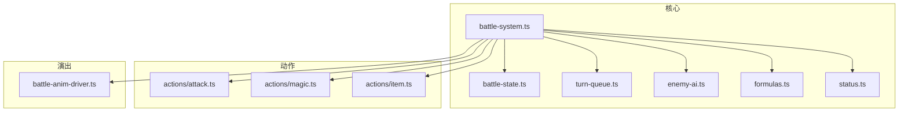
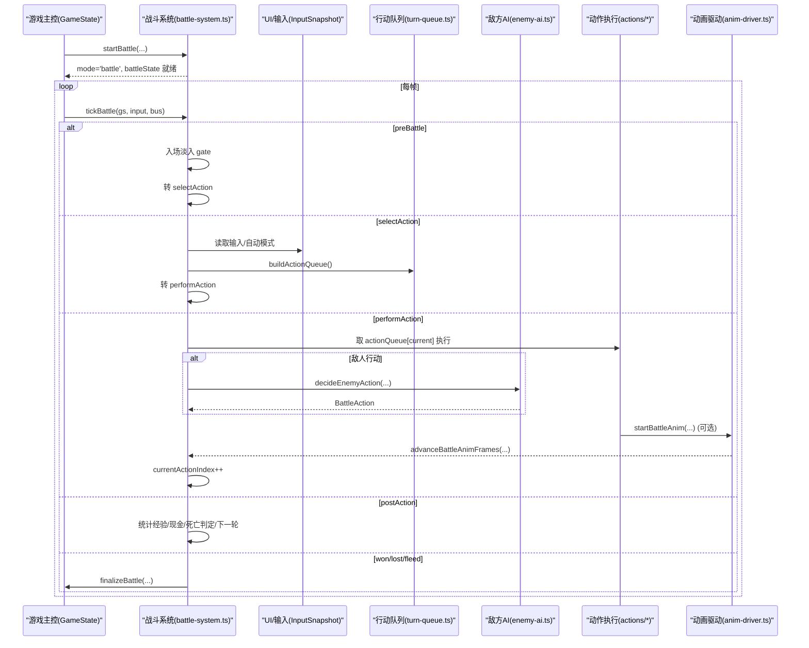
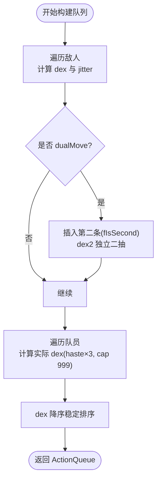
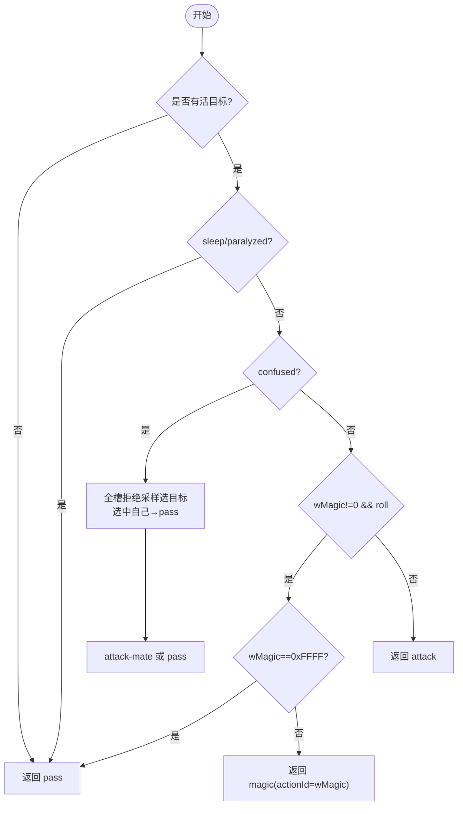
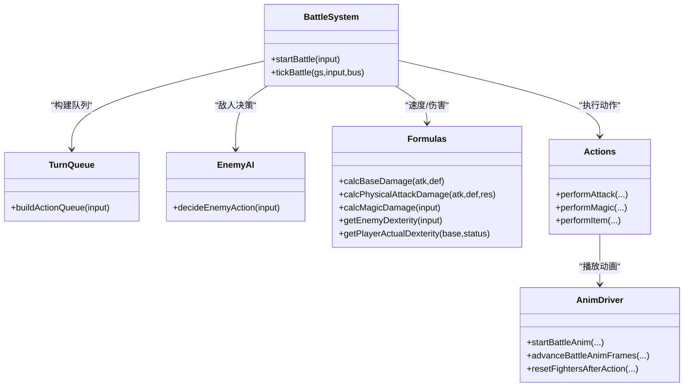

# 战斗系统

<cite>
**本文引用的文件**   
- [battle-system.ts](file://packages/game/src/core/battle/battle-system.ts)
- [battle-state.ts](file://packages/game/src/core/battle/battle-state.ts)
- [turn-queue.ts](file://packages/game/src/core/battle/turn-queue.ts)
- [enemy-ai.ts](file://packages/game/src/core/battle/enemy-ai.ts)
- [formulas.ts](file://packages/game/src/core/battle/formulas.ts)
- [attack.ts](file://packages/game/src/core/battle/actions/attack.ts)
- [magic.ts](file://packages/game/src/core/battle/actions/magic.ts)
- [item.ts](file://packages/game/src/core/battle/actions/item.ts)
- [status.ts](file://packages/game/src/core/battle/status.ts)
- [battle-anim-driver.ts](file://packages/game/src/core/battle/battle-anim-driver.ts)
</cite>

## 目录
1. [简介](#简介)
2. [项目结构](#项目结构)
3. [核心组件](#核心组件)
4. [架构总览](#架构总览)
5. [详细组件分析](#详细组件分析)
6. [依赖关系分析](#依赖关系分析)
7. [性能与优化](#性能与优化)
8. [故障排查指南](#故障排查指南)
9. [结论](#结论)
10. [附录：扩展与调试](#附录扩展与调试)

## 简介
本文件面向“回合制战斗系统”的完整技术文档，覆盖以下关键主题：
- 战斗状态机与阶段流转（preBattle → selectAction → performAction → postAction → won/lost/fleed）
- 行动队列构建与速度修正、双动机制
- 伤害公式（物理/法术）、防御与抗性、暴击与浮动
- AI 决策算法（含沉默/混乱/睡眠/麻痹等状态影响）
- 战斗界面状态、动画时间线、音效同步
- 数据序列化与存档要点、回放可行性、性能优化策略
- 如何添加新角色、实现自定义法术、扩展敌人 AI
- 调试工具与平衡性测试方法

## 项目结构
战斗系统位于 packages/game/src/core/battle 下，采用“核心逻辑 + 动作执行 + 动画驱动”的分层组织：
- 核心控制：battle-system.ts（主循环、阶段路由、UI 输入、回合推进）
- 状态模型：battle-state.ts（战斗状态、UI 状态、动画片段定义）
- 回合顺序：turn-queue.ts（dex 排序、dualMove 二次行动）
- AI：enemy-ai.ts（内置 fallback 决策）
- 公式：formulas.ts（基础/物理/法术伤害、速度修正）
- 动作执行：actions/*（攻击、法术、物品等）
- 动画驱动：battle-anim-driver.ts（声明式帧序列应用与复位）

图表来源
- [battle-system.ts:472-614](file://packages/game/src/core/battle/battle-system.ts#L472-L614)
- [battle-state.ts:455-666](file://packages/game/src/core/battle/battle-state.ts#L455-L666)
- [turn-queue.ts:68-99](file://packages/game/src/core/battle/turn-queue.ts#L68-L99)
- [enemy-ai.ts:68-130](file://packages/game/src/core/battle/enemy-ai.ts#L68-L130)
- [formulas.ts:36-158](file://packages/game/src/core/battle/formulas.ts#L36-L158)
- [battle-anim-driver.ts:115-154](file://packages/game/src/core/battle/battle-anim-driver.ts#L115-L154)

章节来源
- [battle-system.ts:472-614](file://packages/game/src/core/battle/battle-system.ts#L472-L614)
- [battle-state.ts:455-666](file://packages/game/src/core/battle/battle-state.ts#L455-L666)

## 核心组件
- 战斗主循环与阶段路由：tickBattle 负责死锁保护、对话/淡入/逃跑/结算 hold、回合起手脚本、玩家选指令菜单启动、各 phase 分发。
- 状态模型：BattleState 包含队员/敌人视图、phase、UI 状态、动画时间线、回合计数、隐藏经验池、入场淡入、逃跑动画等。
- 行动队列：buildActionQueue 按 dex 降序稳定排序，支持 dualMove 二次行动与抖动。
- AI：decideEnemyAction 基于 wMagic/wMagicRate/silence/confused/sleep/paralyzed 等条件选择魔法或物理，并处理目标选择 RNG 对齐。
- 公式：calcBaseDamage/calcPhysicalAttackDamage/calcMagicDamage/getEnemyDexterity/getPlayerActualDexterity 严格复刻 CLASSIC 分支。
- 动作执行：performAttack/performMagic/performItem 分别处理物理、法术、物品，调用事件脚本与动画时间线。
- 动画驱动：startBattleAnim/advanceBattleAnimFrames/resetFightersAfterAction 将声明式帧应用到 fighter render state，并在结束后复位。

章节来源
- [battle-system.ts:472-614](file://packages/game/src/core/battle/battle-system.ts#L472-L614)
- [battle-state.ts:455-666](file://packages/game/src/core/battle/battle-state.ts#L455-L666)
- [turn-queue.ts:68-99](file://packages/game/src/core/battle/turn-queue.ts#L68-L99)
- [enemy-ai.ts:68-130](file://packages/game/src/core/battle/enemy-ai.ts#L68-L130)
- [formulas.ts:36-158](file://packages/game/src/core/battle/formulas.ts#L36-L158)
- [attack.ts:112-435](file://packages/game/src/core/battle/actions/attack.ts#L112-L435)
- [magic.ts:123-435](file://packages/game/src/core/battle/actions/magic.ts#L123-L435)
- [item.ts:69-119](file://packages/game/src/core/battle/actions/item.ts#L69-L119)
- [battle-anim-driver.ts:115-154](file://packages/game/src/core/battle/battle-anim-driver.ts#L115-L154)

## 架构总览
下图展示从进入战斗到完成一轮行动的端到端流程，包括 UI 选择、AI 决策、动画与音效同步。

图表来源
- [battle-system.ts:472-614](file://packages/game/src/core/battle/battle-system.ts#L472-L614)
- [turn-queue.ts:68-99](file://packages/game/src/core/battle/turn-queue.ts#L68-L99)
- [enemy-ai.ts:68-130](file://packages/game/src/core/battle/enemy-ai.ts#L68-L130)
- [battle-anim-driver.ts:115-154](file://packages/game/src/core/battle/battle-anim-driver.ts#L115-L154)

## 详细组件分析

### 战斗状态机与阶段流转
- 阶段：preBattle → selectAction → performAction → postAction → won/lost/fleed
- 防卡死：非 selectAction 阶段累计 phaseStallTicks，超过阈值强制退出
- 入场淡入：preBattle 期间 dither fade-in，完成后才进入 selectAction
- 回合起手脚本：selectAction 前对全体活敌跑 scriptOnTurnStart，若有对话/动画则阻塞菜单
- 回合末延迟：毒/状态数字弹出后停顿若干 tick，再开下一轮菜单

章节来源
- [battle-system.ts:576-614](file://packages/game/src/core/battle/battle-system.ts#L576-L614)
- [battle-system.ts:620-634](file://packages/game/src/core/battle/battle-system.ts#L620-L634)
- [battle-system.ts:535-561](file://packages/game/src/core/battle/battle-system.ts#L535-L561)
- [battle-system.ts:580-596](file://packages/game/src/core/battle/battle-system.ts#L580-L596)

### 行动队列与回合顺序
- 构建规则：先敌人后队员；dex 降序稳定排序；同 dex 保持敌人优先
- 敌人双动：dualMove 时插入两条记录，第二项 fIsSecond=true；dex2 独立二抽决定先后
- 玩家 dex 修正：haste ×3，上限 999；敌人 dex = (level+6)*3 + dexterity
- 随机抖动：dex 乘以 RandomFloat(0.9,1.1) 截断，保证真值 RNG 流

图表来源
- [turn-queue.ts:68-99](file://packages/game/src/core/battle/turn-queue.ts#L68-L99)
- [formulas.ts:179-216](file://packages/game/src/core/battle/formulas.ts#L179-L216)
- [battle-system.ts:788-800](file://packages/game/src/core/battle/battle-system.ts#L788-L800)

章节来源
- [turn-queue.ts:68-99](file://packages/game/src/core/battle/turn-queue.ts#L68-L99)
- [formulas.ts:179-216](file://packages/game/src/core/battle/formulas.ts#L179-L216)
- [battle-system.ts:788-800](file://packages/game/src/core/battle/battle-system.ts#L788-L800)

### 伤害计算公式
- 基础伤害：三段公式，SHORT 语义，Math.trunc 截断
- 物理伤害：基础伤害 / physicalResistance（resist=0 不除），最小 1
- 法术伤害：magStr 经随机因子调制，基础部分除以 4 加 baseDamage，元素/毒抗修正，战场加成，最终 SHORT 截断
- 速度修正：敌人 dex=(level+6)*3+dex；玩家 dex=haste×3，上限 999

章节来源
- [formulas.ts:36-158](file://packages/game/src/core/battle/formulas.ts#L36-L158)
- [formulas.ts:179-216](file://packages/game/src/core/battle/formulas.ts#L179-L216)

### 敌方 AI 决策算法
- 无活目标 → pass
- 睡眠/麻痹 → pass（保留已掷 RNG）
- 混乱 → 在全部槽位中拒绝空/死槽重摇，选中自己则 pass，否则 attack-mate
- 沉默 → 不出魔法（但仍消耗一次骰子以对齐 RNG）
- 有魔法且命中概率 → magic；否则 attack
- 目标选择：若传入 party 全表，按“随机索引 + while HP==0 重摇”路径，RNG 流逐抽对齐

图表来源
- [enemy-ai.ts:68-130](file://packages/game/src/core/battle/enemy-ai.ts#L68-L130)

章节来源
- [enemy-ai.ts:68-130](file://packages/game/src/core/battle/enemy-ai.ts#L68-L130)

### 物理攻击执行与动画
- 玩家→敌人：str=role.attackStrength（不含等级项），def=enemy.defense+(level+6)*4，res=physicalResistance；单体含 jitter/crit/李逍遥额外暴击/RandomFloat 浮动；群攻固定命中序、逐敌减半
- 敌人→玩家：str=enemy.attackStrength+(level+6)*6，def=player.defense(+defending×2)，res=2；含自动闪避/守护替挡/Protect 减半
- 动画：buildPlayerAttackTimeline/buildEnemyPhysicalTimeline，挂出招声/武器声于对应帧；缺渲染状态回退即时 emit

章节来源
- [attack.ts:112-435](file://packages/game/src/core/battle/actions/attack.ts#L112-L435)
- [battle-anim-driver.ts:236-254](file://packages/game/src/core/battle/battle-anim-driver.ts#L236-L254)

### 法术执行与动画时间线
- 扣 MP（仅玩家），scriptOnUse 失败仍扣 MP 但不播效果
- 预掷 autoDefend（敌法），runScript(scriptOnUse/scriptOnSuccess)
- 玩家攻击魔法：PreMagic → OffMagic → PostMagic，数字挂 PostMagic 首帧；召唤魔法：变亮→神出场→二次效果→PostMagic→淡出
- 敌方攻击魔法：OffMagic 链，效果音与施法音帧同步
- 未建链（旧 fixture/缺资源）→ 即时播放声音与数字

章节来源
- [magic.ts:123-435](file://packages/game/src/core/battle/actions/magic.ts#L123-L435)
- [magic.ts:485-572](file://packages/game/src/core/battle/actions/magic.ts#L485-L572)
- [magic.ts:585-678](file://packages/game/src/core/battle/actions/magic.ts#L585-L678)
- [magic.ts:749-800](file://packages/game/src/core/battle/actions/magic.ts#L749-L800)

### 物品使用执行
- 检查库存（仅玩家），跑 scriptOnUse，按 consuming 标志扣 count
- 敌人使用不扣库存

章节来源
- [item.ts:69-119](file://packages/game/src/core/battle/actions/item.ts#L69-L119)

### 状态衰减与可行动判定
- 每回合 turn++ 前对所有 alive 对象递减所有 status 计数器（含 haste/protect/dualAttack 等 boolean 类）
- canAct：sleep/paralyzed > 0 不可行动；canCastMagic：silence > 0 不可施法

章节来源
- [status.ts:20-47](file://packages/game/src/core/battle/status.ts#L20-L47)

### 动画驱动与音效同步
- startBattleAnim：设置 battleAnim 并立即应用首帧
- advanceBattleAnimFrames：按 dtMs 推进 idx，applyAnimFrame 写入 fighters/overlay/damageNum/sound
- resetFightersAfterAction：复位 pos/currentFrame/iColorShift/idle 状态
- 视觉细分：stepBattleAnimRender 按 wall-clock 平滑显示帧，不影响逻辑副作用

章节来源
- [battle-anim-driver.ts:115-154](file://packages/game/src/core/battle/battle-anim-driver.ts#L115-L154)
- [battle-anim-driver.ts:174-204](file://packages/game/src/core/battle/battle-anim-driver.ts#L174-L204)
- [battle-anim-driver.ts:236-254](file://packages/game/src/core/battle/battle-anim-driver.ts#L236-L254)

## 依赖关系分析
- 模块耦合：
  - battle-system.ts 聚合 turn-queue、enemy-ai、formulas、status、actions/*、battle-anim-driver
  - actions/* 依赖 battle-state、formulas、battle-anim-driver、event-system（通过 runScript 注入）
  - battle-anim-driver 仅依赖 battle-state 与 CommandBus
- 外部依赖：
  - @type-pal/shared 提供共享类型与常量
  - event-system 提供 runScript 与全局命令表
  - present/dialog-box/audio 通过 CommandBus 消费

图表来源
- [battle-system.ts:472-614](file://packages/game/src/core/battle/battle-system.ts#L472-L614)
- [turn-queue.ts:68-99](file://packages/game/src/core/battle/turn-queue.ts#L68-L99)
- [enemy-ai.ts:68-130](file://packages/game/src/core/battle/enemy-ai.ts#L68-L130)
- [formulas.ts:36-158](file://packages/game/src/core/battle/formulas.ts#L36-L158)
- [attack.ts:112-435](file://packages/game/src/core/battle/actions/attack.ts#L112-L435)
- [magic.ts:123-435](file://packages/game/src/core/battle/actions/magic.ts#L123-L435)
- [battle-anim-driver.ts:115-154](file://packages/game/src/core/battle/battle-anim-driver.ts#L115-L154)

章节来源
- [battle-system.ts:472-614](file://packages/game/src/core/battle/battle-system.ts#L472-L614)
- [turn-queue.ts:68-99](file://packages/game/src/core/battle/turn-queue.ts#L68-L99)
- [enemy-ai.ts:68-130](file://packages/game/src/core/battle/enemy-ai.ts#L68-L130)
- [formulas.ts:36-158](file://packages/game/src/core/battle/formulas.ts#L36-L158)
- [battle-anim-driver.ts:115-154](file://packages/game/src/core/battle/battle-anim-driver.ts#L115-L154)

## 性能与优化
- 确定性 RNG：所有随机源来自 SeedableRng，确保回放一致性与对拍
- 动画与音效分离：逻辑 tick 与视觉细分解耦，避免 40ms 离散导致的抖帧
- 批量操作：群攻挥砍与多落点法术使用 overlays 一次性提交，减少多次 emit
- 资源缺失兼容：缺精灵帧数 Map 时走即时路径，避免运行时异常
- 内存友好：BattleState 仅存必要字段，持久化只写回 GameState 必要项

[本节为通用指导，无需源码引用]

## 故障排查指南
- 战斗卡死：检查 phaseStallTicks 是否超限；确认 selectAction 不会误计 stall
- 动画无声：确认 frame.sound 是否正确挂帧；未建链路径需 push pendingSounds
- 数字错位：攻击/召唤数字应挂 PostMagic 首帧；DefMagic 挂链末；未建链则即时 emit
- 敌人行为异常：核对 enemy.wMagic/wMagicRate/silence/confused 与 RNG 抽取顺序
- 队伍复活问题：startBattle 会复活 HP=0 队员至 1，并更新装备 effect

章节来源
- [battle-system.ts:472-514](file://packages/game/src/core/battle/battle-system.ts#L472-L514)
- [battle-system.ts:277-419](file://packages/game/src/core/battle/battle-system.ts#L277-L419)
- [magic.ts:123-435](file://packages/game/src/core/battle/actions/magic.ts#L123-L435)

## 结论
本战斗系统以“状态机 + 声明式动画 + 纯函数公式/AI”为核心，严格复刻 sdlpal CLASSIC 分支的行为与 RNG 流，具备高可测试性与可扩展性。通过模块化拆分与资源缺失兼容，既保证真值一致性，又兼顾开发效率与用户体验。

[本节为总结，无需源码引用]

## 附录：扩展与调试

### 添加新角色
- 在 PlayerRoles 中添加角色条目（含 level/attackStrength/defense/magicStrength 等）
- 确保 spriteNumInBattle 与 weaponSound/criticalSound/magicSound 等配置正确
- 在 startBattle 前 updateAllEquipments 以刷新装备授予的状态（如 dualAttack）

章节来源
- [battle-system.ts:340-355](file://packages/game/src/core/battle/battle-system.ts#L340-L355)
- [formulas.ts:207-216](file://packages/game/src/core/battle/formulas.ts#L207-L216)

### 实现自定义法术
- 在 spells.json 中新增条目，指向 magic id
- 在 magic.json 中定义 type/baseDamage/elemental/effect/special/speed/fireDelay/shake/xOffset/yOffset/wave/keepEffect/sound 等
- 编写 spell.scriptOnUse/scriptOnSuccess 脚本，使用 0x1B/0x1C/0x1D/0x22 等 opcode 实现治疗/复活/伤害
- 若需要动画，提供 FIRE.MKF 帧数 Map 与 battle-effect-index 列表

章节来源
- [magic.ts:123-435](file://packages/game/src/core/battle/actions/magic.ts#L123-L435)
- [magic.ts:485-572](file://packages/game/src/core/battle/actions/magic.ts#L485-L572)

### 扩展敌人 AI 行为
- 在 enemy-objects.json 中为具体 OBJECT_ENEMY 配置 scriptOnReady/scriptOnTurnStart/scriptOnBattleEnd/resistanceToSorcery
- 在脚本中通过 opcode 改写 wMagic/wMagicRate 或触发逃跑/变身等
- 如需更复杂决策，可在 decideEnemyAction 上游注入自定义逻辑（保持 RNG 流一致）

章节来源
- [battle-system.ts:277-330](file://packages/game/src/core/battle/battle-system.ts#L277-L330)
- [enemy-ai.ts:68-130](file://packages/game/src/core/battle/enemy-ai.ts#L68-L130)

### 战斗回放与存档
- 回放：所有随机源由 SeedableRng 提供，seed 可复现；actionQueue 与脚本执行均为确定性
- 存档：战斗结束回写 GameState（HP/MP/exp/cash 等），战斗内临时状态（battleAnim/persistentBgBlits 等）不持久
- 注意：重复动作 prevActions 跨战斗映射需按 roleId 保存，避免队伍变化导致错位

章节来源
- [battle-system.ts:377-383](file://packages/game/src/core/battle/battle-system.ts#L377-L383)
- [battle-system.ts:419-425](file://packages/game/src/core/battle/battle-system.ts#L419-L425)

### 调试工具与平衡性测试
- 单测：__tests__/battle-* 覆盖状态机、动画驱动、对话、升级、opcode 等
- 对拍：使用相同 seed 运行，比对 RNG 流与输出
- 数值调优：调整 formulas 中的系数与上限，结合大量随机样本评估期望伤害分布

章节来源
- [battle-system.ts:472-614](file://packages/game/src/core/battle/battle-system.ts#L472-L614)
- [formulas.ts:36-158](file://packages/game/src/core/battle/formulas.ts#L36-L158)