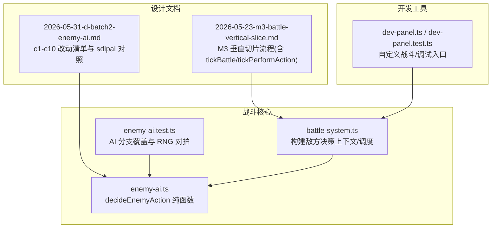
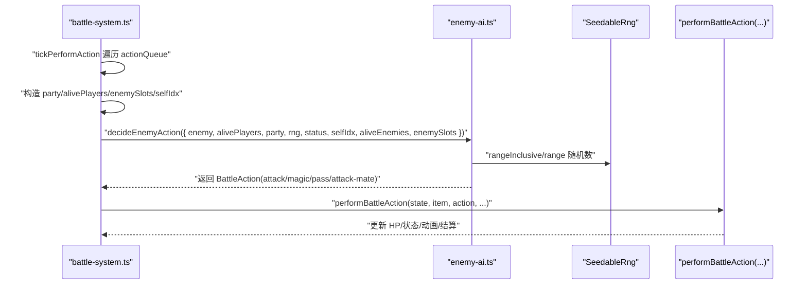
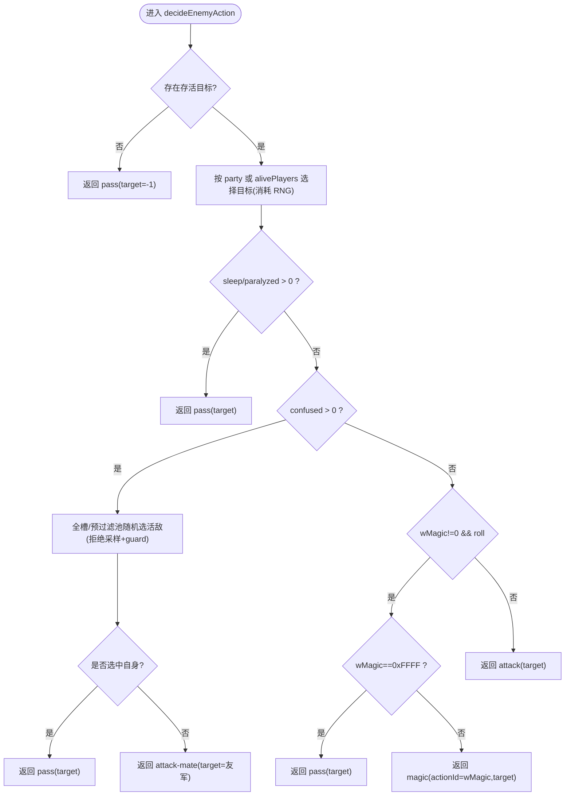
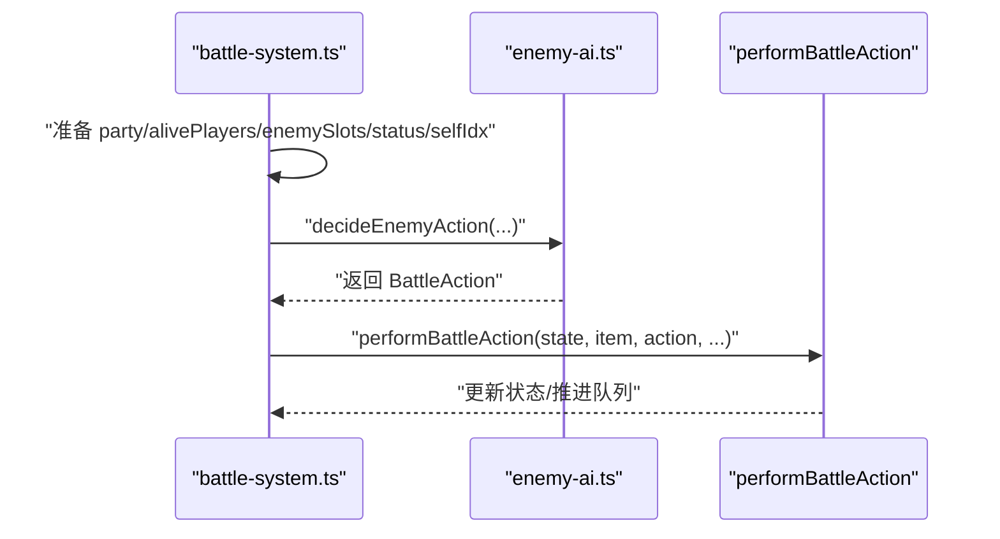
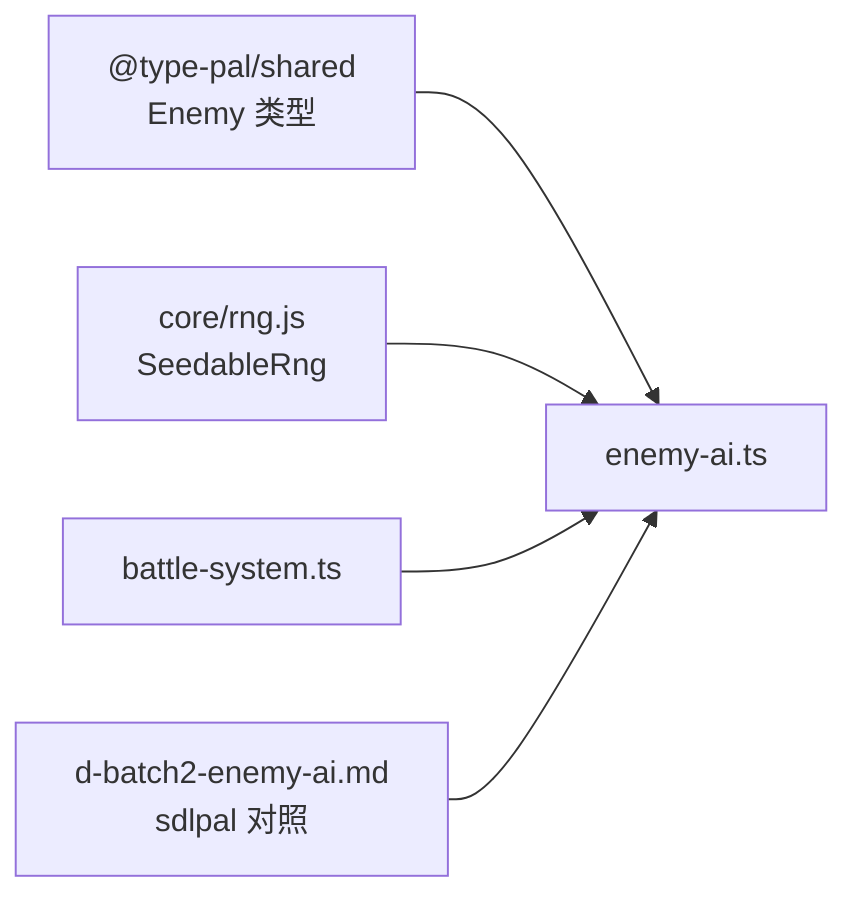

# 敌人 AI 系统

<cite>
**本文引用的文件**   
- [enemy-ai.ts](file://packages/game/src/core/battle/enemy-ai.ts)
- [enemy-ai.test.ts](file://packages/game/src/core/battle/__tests__/enemy-ai.test.ts)
- [battle-system.ts](file://packages/game/src/core/battle/battle-system.ts)
- [2026-05-31-d-batch2-enemy-ai.md](file://docs/phase1/plans/2026-05-31-d-batch2-enemy-ai.md)
- [2026-05-23-m3-battle-vertical-slice.md](file://docs/phase1/plans/2026-05-23-m3-battle-vertical-slice.md)
- [dev-panel.ts](file://packages/game/src/dev/dev-panel.ts)
- [dev-panel.test.ts](file://packages/game/src/dev/dev-panel.test.ts)
</cite>

## 目录
1. [简介](#简介)
2. [项目结构](#项目结构)
3. [核心组件](#核心组件)
4. [架构总览](#架构总览)
5. [详细组件分析](#详细组件分析)
6. [依赖关系分析](#依赖关系分析)
7. [性能与可扩展性](#性能与可扩展性)
8. [调试与行为分析工具](#调试与行为分析工具)
9. [结论](#结论)
10. [附录：实战指南](#附录实战指南)

## 简介
本文件系统化梳理并文档化“敌人 AI 系统”，聚焦以下目标：
- 决策树与行为模式：基于 sdlpal 真值路径的 fallback 决策（睡眠/麻痹跳过、沉默强制物理、混乱攻击友军、魔法概率门等）。
- 难度调节机制：通过 enemy 数据字段（如 magic/magicRate/dexterity/fleeRate）驱动行为倾向，结合 RNG 确定性。
- 攻击选择、防御策略、技能释放时机、团队协作逻辑：在战斗主循环中由 battle-system 组装输入并调用 AI 决策，再执行具体动作。
- 学习能力与适应性调整：当前实现为纯函数 + 配置驱动，无在线学习；可通过脚本与外部状态注入扩展。
- 性能优化策略：纯函数、确定性 RNG、最小对象分配、拒绝采样 guard 防死循环。
- 实战示例：如何创建新敌人类型、配置 AI 行为、实现复杂战术逻辑（以代码片段路径引用代替直接粘贴代码）。
- 调试与行为分析：开发面板与测试用例的使用方式。

## 项目结构
敌人 AI 相关代码位于游戏核心模块的 battle 子系统，围绕一个纯函数 decideEnemyAction 展开，并由 battle-system 在每回合行动时装配上下文并调用。

图表来源
- [battle-system.ts:2480-2518](file://packages/game/src/core/battle/battle-system.ts#L2480-L2518)
- [enemy-ai.ts:1-131](file://packages/game/src/core/battle/enemy-ai.ts#L1-L131)
- [enemy-ai.test.ts:1-215](file://packages/game/src/core/battle/__tests__/enemy-ai.test.ts#L1-L215)
- [2026-05-31-d-batch2-enemy-ai.md:23-43](file://docs/phase1/plans/2026-05-31-d-batch2-enemy-ai.md#L23-L43)
- [2026-05-23-m3-battle-vertical-slice.md:3644-3846](file://docs/phase1/plans/2026-05-23-m3-battle-vertical-slice.md#L3644-L3846)
- [dev-panel.ts](file://packages/game/src/dev/dev-panel.ts)
- [dev-panel.test.ts:122-141](file://packages/game/src/dev/dev-panel.test.ts#L122-L141)

章节来源
- [battle-system.ts:2480-2518](file://packages/game/src/core/battle/battle-system.ts#L2480-L2518)
- [enemy-ai.ts:1-131](file://packages/game/src/core/battle/enemy-ai.ts#L1-L131)
- [enemy-ai.test.ts:1-215](file://packages/game/src/core/battle/__tests__/enemy-ai.test.ts#L1-L215)
- [2026-05-31-d-batch2-enemy-ai.md:23-43](file://docs/phase1/plans/2026-05-31-d-batch2-enemy-ai.md#L23-L43)
- [2026-05-23-m3-battle-vertical-slice.md:3644-3846](file://docs/phase1/plans/2026-05-23-m3-battle-vertical-slice.md#L3644-L3846)
- [dev-panel.test.ts:122-141](file://packages/game/src/dev/dev-panel.test.ts#L122-L141)

## 核心组件
- 决策函数 decideEnemyAction
  - 输入：敌方单位、活着的玩家列表、RNG、敌方状态（sleep/paralyzed/silence/confused）、可选全 party 列表、可选全敌槽位、selfIdx 等。
  - 输出：BattleAction（attack/magic/pass/attack-mate 等），包含 target/actionId 等。
  - 特性：纯函数、确定性 RNG、严格对齐 sdlpal RNG 流（party 拒绝采样、confused 全槽拒绝采样）。
- 战斗系统集成
  - battle-system 在 performAction 阶段为每个敌人构造 DecideEnemyActionInput，调用 decideEnemyAction，并将结果交给 performBattleAction 执行。
- 测试与基准
  - enemy-ai.test.ts 覆盖关键分支与 RNG 对拍，确保同 seed 决策稳定。

章节来源
- [enemy-ai.ts:26-55](file://packages/game/src/core/battle/enemy-ai.ts#L26-L55)
- [enemy-ai.ts:68-131](file://packages/game/src/core/battle/enemy-ai.ts#L68-L131)
- [battle-system.ts:2499-2518](file://packages/game/src/core/battle/battle-system.ts#L2499-L2518)
- [enemy-ai.test.ts:52-214](file://packages/game/src/core/battle/__tests__/enemy-ai.test.ts#L52-L214)

## 架构总览
下图展示从“回合开始”到“敌人行动决策与执行”的关键流程，以及 RNG 与状态门的作用点。

图表来源
- [battle-system.ts:2499-2518](file://packages/game/src/core/battle/battle-system.ts#L2499-L2518)
- [enemy-ai.ts:68-131](file://packages/game/src/core/battle/enemy-ai.ts#L68-L131)

## 详细组件分析

### 决策函数 decideEnemyAction
- 输入参数要点
  - enemy: 敌方单位数据（magic/magicRate 等决定魔法概率）。
  - alivePlayers/party: 用于目标选择；传入 party 时使用“全 party 拒绝采样”以对齐 sdlpal RNG 流。
  - status: sleep/paralyzed → pass；silence → 强制物理；confused → 打友军或 pass。
  - selfIdx/aliveEnemies/enemySlots: confused 目标选择；enemySlots 走“全槽拒绝采样”路径，保证 RNG 流一致。
- 决策规则（与 sdlpal fight.c 对齐）
  - 无存活目标 → pass。
  - 先消耗一次 RNG 选目标（即使后续因状态门被丢弃）。
  - sleep/paralyzed → pass。
  - confused → 从全槽或预过滤池随机选活敌；选中自己则 pass；否则 attack-mate。
  - 魔法门：wMagic != 0 且 RandomLong(0,9) < wMagicRate 且 silence==0 → 若 wMagic==0xFFFF 则 pass，否则 magic(actionId=wMagic)。
  - 其余情况 → attack。
- RNG 与确定性
  - 使用 SeedableRng，同 seed 同输入必同输出，满足 baseline 对拍要求。
  - party 拒绝采样与 enemySlots 拒绝采样均带 guard 防止极端异常导致死循环。

图表来源
- [enemy-ai.ts:68-131](file://packages/game/src/core/battle/enemy-ai.ts#L68-L131)

章节来源
- [enemy-ai.ts:26-55](file://packages/game/src/core/battle/enemy-ai.ts#L26-L55)
- [enemy-ai.ts:68-131](file://packages/game/src/core/battle/enemy-ai.ts#L68-L131)
- [enemy-ai.test.ts:52-214](file://packages/game/src/core/battle/__tests__/enemy-ai.test.ts#L52-L214)

### 战斗系统集成与调用链
- 调用位置
  - battle-system 在 performAction 阶段为每个敌人构造输入，包括：
    - party（含死者，用于拒绝采样）
    - alivePlayers（仅活者）
    - enemySlots（含死/空槽，用于 confused 全槽拒绝采样）
    - status/selfIdx/aliveEnemies
  - 调用 decideEnemyAction 后交由 performBattleAction 执行。
- 目标重选与降级
  - 玩家侧 perform 前会进行动作合法性校验与目标重选；敌人侧在 decideEnemyAction 已基于当前活目标选择，无需再次重选。

图表来源
- [battle-system.ts:2499-2518](file://packages/game/src/core/battle/battle-system.ts#L2499-L2518)
- [2026-05-23-m3-battle-vertical-slice.md:3768-3799](file://docs/phase1/plans/2026-05-23-m3-battle-vertical-slice.md#L3768-L3799)

章节来源
- [battle-system.ts:2499-2518](file://packages/game/src/core/battle/battle-system.ts#L2499-L2518)
- [2026-05-23-m3-battle-vertical-slice.md:3768-3799](file://docs/phase1/plans/2026-05-23-m3-battle-vertical-slice.md#L3768-L3799)

### 行为模式库与难度调节
- 行为模式
  - 物理攻击：默认行为，target 为随机活玩家。
  - 法术攻击：当 wMagic!=0 且随机判定命中且未沉默时触发；wMagic==0xFFFF 表示“进魔法分支即什么不做”。
  - 混乱攻击：优先打友军；若选中自身则 pass。
  - 跳过回合：睡眠/麻痹时 pass。
- 难度调节
  - magic/magicRate：控制法术倾向与频率。
  - dexterity：影响出手顺序（由上层公式计算）。
  - fleeRate：影响逃跑倾向（由上层逻辑处理）。
  - 其他抗性/强度字段影响伤害与生存能力，间接改变 AI 行为表现。

章节来源
- [enemy-ai.ts:116-131](file://packages/game/src/core/battle/enemy-ai.ts#L116-L131)
- [2026-05-31-d-batch2-enemy-ai.md:23-43](file://docs/phase1/plans/2026-05-31-d-batch2-enemy-ai.md#L23-L43)

### 攻击选择、防御策略、技能释放时机、团队协作
- 攻击选择
  - 基于存活目标随机选择；若传入 party 则采用“全 party 拒绝采样”以对齐 RNG 流。
- 防御策略
  - 敌人侧不主动防御；防御由玩家侧动作与状态机管理。
- 技能释放时机
  - 每回合行动时根据 magic/magicRate 与状态门判定是否施法。
- 团队协作
  - 混乱状态下优先攻击友军；若仅有自身存活则 pass。
  - 合击/围攻等玩家侧协作逻辑不影响敌人 AI 的 fallback 决策。

章节来源
- [enemy-ai.ts:74-114](file://packages/game/src/core/battle/enemy-ai.ts#L74-L114)
- [battle-system.ts:2499-2518](file://packages/game/src/core/battle/battle-system.ts#L2499-L2518)

### 学习能力与适应性调整
- 当前实现为纯函数 + 配置驱动，无在线学习或权重自调优。
- 可通过以下方式扩展：
  - 在 battle-system 中注入额外上下文（如队伍平均血量、最近 N 回合趋势）到 decideEnemyAction 输入。
  - 使用脚本钩子（wScriptOnTurnStart/wScriptOnReady）改写 wMagic 或临时状态，从而动态改变行为。

章节来源
- [enemy-ai.ts:1-20](file://packages/game/src/core/battle/enemy-ai.ts#L1-L20)
- [battle-system.ts:2480-2498](file://packages/game/src/core/battle/battle-system.ts#L2480-L2498)

### 性能优化策略
- 纯函数与确定性 RNG：便于缓存、回放与对拍。
- 拒绝采样 guard：避免极端情况下无限循环。
- 最小对象分配：只传递必要字段，减少 GC 压力。
- 短路序与门控：尽早返回 pass，减少后续计算。

章节来源
- [enemy-ai.ts:68-131](file://packages/game/src/core/battle/enemy-ai.ts#L68-L131)

## 依赖关系分析
- 内部依赖
  - enemy-ai.ts 依赖 @type-pal/shared 的 Enemy 类型与 core/rng.js 的 SeedableRng。
  - battle-system.ts 负责装配输入并调用 enemy-ai.ts。
- 外部依赖
  - 与 sdlpal 真值路径对齐（fight.c 对应行号见计划文档）。
- 潜在耦合
  - 若未来引入更复杂的 AI（如强化学习），需保持接口稳定，将复杂逻辑封装在新的服务层，仍通过 battle-system 统一接入。

图表来源
- [enemy-ai.ts:22-24](file://packages/game/src/core/battle/enemy-ai.ts#L22-L24)
- [battle-system.ts:2499-2518](file://packages/game/src/core/battle/battle-system.ts#L2499-L2518)
- [2026-05-31-d-batch2-enemy-ai.md:23-43](file://docs/phase1/plans/2026-05-31-d-batch2-enemy-ai.md#L23-L43)

章节来源
- [enemy-ai.ts:22-24](file://packages/game/src/core/battle/enemy-ai.ts#L22-L24)
- [battle-system.ts:2499-2518](file://packages/game/src/core/battle/battle-system.ts#L2499-L2518)
- [2026-05-31-d-batch2-enemy-ai.md:23-43](file://docs/phase1/plans/2026-05-31-d-batch2-enemy-ai.md#L23-L43)

## 性能与可扩展性
- 性能
  - 决策函数 O(1) 期望时间（拒绝采样带固定上限 guard）。
  - 确定性 RNG 使回放与压测更高效。
- 可扩展性
  - 新增敌人类型：仅需配置 enemy 数据（magic/magicRate/dexterity/fleeRate 等）。
  - 复杂战术：通过脚本钩子或 battle-system 注入上下文，在不破坏纯函数前提下扩展。

[本节为通用指导，不直接分析具体文件]

## 调试与行为分析工具
- 单元测试
  - enemy-ai.test.ts 提供分支覆盖与 RNG 对拍用例，可用于验证新行为是否符合预期。
- 开发面板
  - dev-panel.ts 提供自定义战斗入口（buildCustomEnemyTeam），可快速组合敌人阵容进行测试。
  - dev-panel.test.ts 验证了自定义队伍构建逻辑（填充/截断/重复等）。
- 建议用法
  - 使用 dev-panel 快速生成特定敌人阵容，运行战斗并观察 decideEnemyAction 的输出。
  - 通过修改 SeedableRng seed 复现问题，配合单元测试定位偏差。

章节来源
- [enemy-ai.test.ts:1-215](file://packages/game/src/core/battle/__tests__/enemy-ai.test.ts#L1-L215)
- [dev-panel.test.ts:122-141](file://packages/game/src/dev/dev-panel.test.ts#L122-L141)

## 结论
敌人 AI 系统以纯函数为核心，严格对齐 sdlpal 的行为与 RNG 流，具备高确定性与可测试性。通过 battle-system 的统一装配与执行，实现了清晰的职责分离与良好的可扩展性。当前版本未内置在线学习，但可通过脚本与上下文注入灵活扩展战术逻辑。

[本节为总结，不直接分析具体文件]

## 附录：实战指南

### 如何创建新敌人类型
- 在资源层定义敌人数据（id、magic、magicRate、dexterity、fleeRate 等）。
- 在自定义战斗中通过 buildCustomEnemyTeam 组合敌人 id 列表，系统会自动填充至 5 槽。
- 参考路径：
  - [dev-panel.test.ts:122-141](file://packages/game/src/dev/dev-panel.test.ts#L122-L141)

章节来源
- [dev-panel.test.ts:122-141](file://packages/game/src/dev/dev-panel.test.ts#L122-L141)

### 如何配置 AI 行为
- 基础行为
  - 设置 magic=0 则始终物理攻击；magic!=0 且 magicRate 控制法术概率。
  - 设置 fleeRate 影响逃跑倾向（由上层逻辑处理）。
- 高级行为
  - 通过脚本钩子（wScriptOnTurnStart/wScriptOnReady）改写 wMagic 或临时状态，实现动态行为切换。
- 参考路径：
  - [enemy-ai.ts:116-131](file://packages/game/src/core/battle/enemy-ai.ts#L116-L131)
  - [2026-05-31-d-batch2-enemy-ai.md:23-43](file://docs/phase1/plans/2026-05-31-d-batch2-enemy-ai.md#L23-L43)

章节来源
- [enemy-ai.ts:116-131](file://packages/game/src/core/battle/enemy-ai.ts#L116-L131)
- [2026-05-31-d-batch2-enemy-ai.md:23-43](file://docs/phase1/plans/2026-05-31-d-batch2-enemy-ai.md#L23-L43)

### 如何实现复杂战术逻辑
- 在 battle-system 中注入额外上下文（如队伍平均血量、最近 N 回合趋势）到 decideEnemyAction 输入。
- 在 decideEnemyAction 中根据上下文调整魔法概率或目标选择策略。
- 参考路径：
  - [battle-system.ts:2499-2518](file://packages/game/src/core/battle/battle-system.ts#L2499-L2518)
  - [enemy-ai.ts:26-55](file://packages/game/src/core/battle/enemy-ai.ts#L26-L55)

章节来源
- [battle-system.ts:2499-2518](file://packages/game/src/core/battle/battle-system.ts#L2499-L2518)
- [enemy-ai.ts:26-55](file://packages/game/src/core/battle/enemy-ai.ts#L26-L55)

### 如何使用调试与行为分析工具
- 使用单元测试验证分支与 RNG 对拍：
  - [enemy-ai.test.ts:52-214](file://packages/game/src/core/battle/__tests__/enemy-ai.test.ts#L52-L214)
- 使用开发面板快速构建自定义战斗阵容：
  - [dev-panel.test.ts:122-141](file://packages/game/src/dev/dev-panel.test.ts#L122-L141)
- 在 M3 垂直切片中观察 tickPerformAction 的敌人决策与执行：
  - [2026-05-23-m3-battle-vertical-slice.md:3768-3799](file://docs/phase1/plans/2026-05-23-m3-battle-vertical-slice.md#L3768-L3799)

章节来源
- [enemy-ai.test.ts:52-214](file://packages/game/src/core/battle/__tests__/enemy-ai.test.ts#L52-L214)
- [dev-panel.test.ts:122-141](file://packages/game/src/dev/dev-panel.test.ts#L122-L141)
- [2026-05-23-m3-battle-vertical-slice.md:3768-3799](file://docs/phase1/plans/2026-05-23-m3-battle-vertical-slice.md#L3768-L3799)