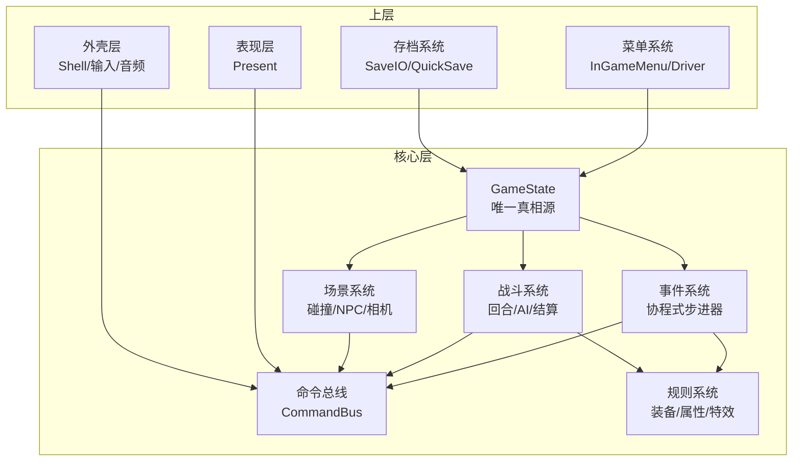
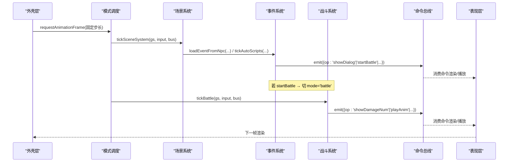
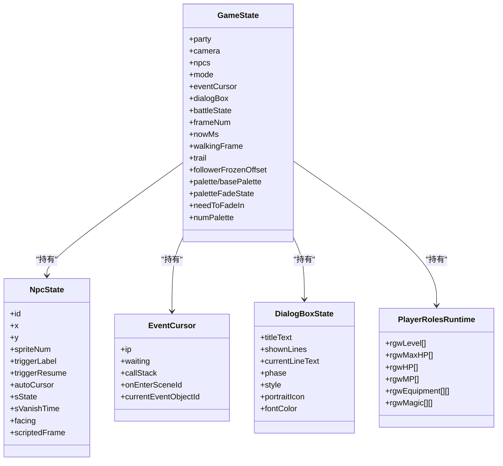
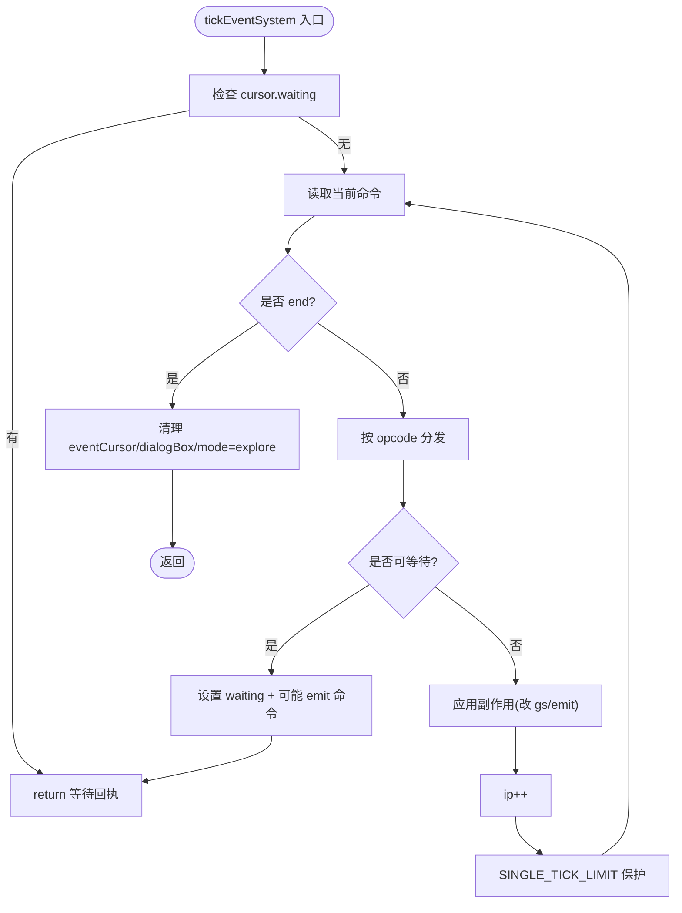
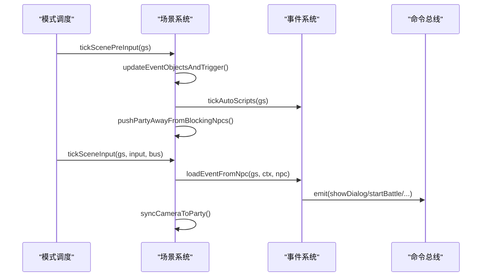
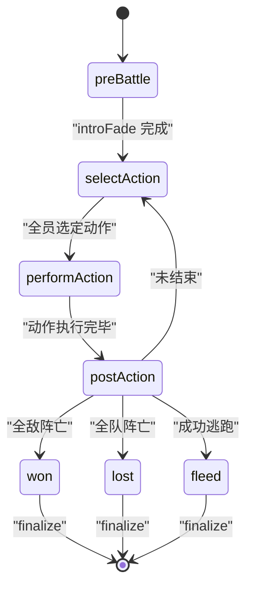
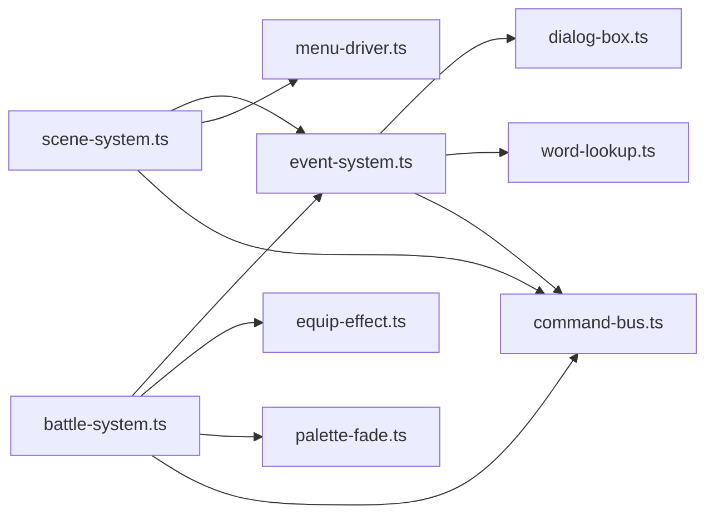

# 核心层 (Core Layer)

<cite>
**本文引用的文件**   
- [02-architecture.md](file://docs/phase1/02-architecture.md)
- [game-state.ts](file://packages/game/src/core/game-state.ts)
- [event-system.ts](file://packages/game/src/core/event-system.ts)
- [scene-system.ts](file://packages/game/src/core/scene-system.ts)
- [battle-system.ts](file://packages/game/src/core/battle/battle-system.ts)
- [command-bus.ts](file://packages/game/src/core/command-bus.ts)
- [equip-effect.ts](file://packages/game/src/core/equip-effect.ts)
- [palette-fade.ts](file://packages/game/src/core/palette-fade.ts)
- [dialog-box.ts](file://packages/game/src/present/dialog-box.ts)
- [menu-driver.ts](file://packages/game/src/core/menu/menu-driver.ts)
- [menu-mode.ts](file://packages/game/src/core/menu/menu-mode.ts)
- [in-game-menu.ts](file://packages/game/src/core/menu/in-game-menu.ts)
- [save-io.ts](file://packages/game/src/tools/save-io.ts)
- [quick-save.ts](file://packages/game/src/tools/quick-save.ts)
- [rng.ts](file://packages/game/src/core/rng.ts)
</cite>

## 目录
1. [简介](#简介)
2. [项目结构](#项目结构)
3. [核心组件](#核心组件)
4. [架构总览](#架构总览)
5. [详细组件分析](#详细组件分析)
6. [依赖关系分析](#依赖关系分析)
7. [性能考量](#性能考量)
8. [故障排查指南](#故障排查指南)
9. [结论](#结论)
10. [附录](#附录)

## 简介
本文件聚焦 Type-Pal 第一阶段的核心层设计与实现，围绕“纯逻辑、可测试、与表现解耦”的目标，系统化阐述以下要点：
- GameState 作为唯一真相源的状态管理模型与序列化策略
- 事件系统（总导演模式、协程式步进器、可等待命令）
- 场景系统（碰撞检测、NPC 行为、相机控制、自动触发区）
- 战斗系统（回合制状态机、伤害公式、AI 决策、动画与对话 hold）
- 规则系统（角色属性、物品效果、法术机制、装备加成）
- 命令总线如何使核心层与上层解耦
- 单元测试方法与扩展点（新增事件类型、新战斗机制）
- 存档系统设计（状态快照、增量持久化、回滚与一致性）

## 项目结构
核心层位于 packages/game/src/core，按职责划分为：
- 状态与数据：game-state.ts
- 事件脚本执行：event-system.ts
- 探索场景循环：scene-system.ts
- 战斗主循环：battle/battle-system.ts
- 命令总线：command-bus.ts
- 规则与数值：equip-effect.ts、palette-fade.ts、rng.ts
- 菜单与交互：menu/*.ts
- 对话框表现桥接：present/dialog-box.ts
- 存档工具：tools/save-io.ts、tools/quick-save.ts

图表来源
- [02-architecture.md:81-104](file://docs/phase1/02-architecture.md#L81-L104)
- [game-state.ts:655-732](file://packages/game/src/core/game-state.ts#L655-L732)
- [event-system.ts:1-25](file://packages/game/src/core/event-system.ts#L1-L25)
- [scene-system.ts:1-8](file://packages/game/src/core/scene-system.ts#L1-L8)
- [battle-system.ts:1-27](file://packages/game/src/core/battle/battle-system.ts#L1-L27)
- [command-bus.ts:1-200](file://packages/game/src/core/command-bus.ts#L1-L200)

章节来源
- [02-architecture.md:1-137](file://docs/phase1/02-architecture.md#L1-L137)

## 核心组件
- GameState
  - 唯一真相源，包含队伍位置、相机、NPC、事件游标、对话框、调色板、战斗态等。
  - 支持序列化/反序列化；通过 createInitialGameState 提供默认值，避免 undefined 分支。
  - 字段注释详尽，严格对齐 sdlpal 真值（如 PARTYOFFSET_X/Y、sState/sVanishTime 等）。
- 事件系统
  - 协程式步进器：单 tick 内连跑非阻塞命令，遇 waitable/end/goto 才返回。
  - 可等待命令：dialog/fade-screen/scene-load/delay/shop/palette-fade 等，跨帧等待回执。
  - 具名 opcode 常量集中定义，便于扩展与维护。
- 场景系统
  - 菱形碰撞、tilemap 阻挡位、NPC 阻挡判定、自动触发区距离公式。
  - 相机跟随与边界 clamp；Confirm Search 视觉与脚本切换。
- 战斗系统
  - Phase 状态机：preBattle → selectAction → performAction → postAction → won/lost/fleed。
  - 资源缓存 __battleResources，避免 GameState 膨胀；RNG 确定性种子。
  - 入场淡入、死亡淡出、逃跑动画、回合起手脚本、AI 决策、队列构建。
- 规则系统
  - 装备 effect 叠加、属性行映射、毒抗性、元素抗性、升级阈值与学法术表。
  - 调色板 fade 引擎与昼夜调色板切换。
- 命令总线
  - 核心层 emit 命令，上层消费并驱动 Present/Shell 副作用，双向解耦。

章节来源
- [game-state.ts:655-800](file://packages/game/src/core/game-state.ts#L655-L800)
- [event-system.ts:1-120](file://packages/game/src/core/event-system.ts#L1-L120)
- [scene-system.ts:1-120](file://packages/game/src/core/scene-system.ts#L1-L120)
- [battle-system.ts:1-120](file://packages/game/src/core/battle/battle-system.ts#L1-L120)
- [equip-effect.ts:1-200](file://packages/game/src/core/equip-effect.ts#L1-L200)
- [palette-fade.ts:1-200](file://packages/game/src/core/palette-fade.ts#L1-L200)
- [command-bus.ts:1-200](file://packages/game/src/core/command-bus.ts#L1-L200)

## 架构总览
核心层遵循“1 个状态 + 4 个系统 + 1 条总线”的架构：
- GameState 是唯一真相源，所有系统读写这里。
- 事件系统为“总导演”，串联剧情、演出、战斗、商店等流程。
- 场景系统负责探索模式下的移动、碰撞、触发与相机。
- 战斗系统处理回合制逻辑、伤害公式、AI 与结算。
- 规则系统提供属性、物品、法术、装备与调色板等底层规则。
- 命令总线将核心逻辑与表现/外壳解耦，支持可等待命令。

图表来源
- [02-architecture.md:106-114](file://docs/phase1/02-architecture.md#L106-L114)
- [scene-system.ts:443-584](file://packages/game/src/core/scene-system.ts#L443-L584)
- [event-system.ts:1594-1623](file://packages/game/src/core/event-system.ts#L1594-L1623)
- [battle-system.ts:472-614](file://packages/game/src/core/battle/battle-system.ts#L472-L614)
- [command-bus.ts:1-200](file://packages/game/src/core/command-bus.ts#L1-L200)

## 详细组件分析

### GameState 状态管理
- 设计要点
  - 单一真相源，所有子系统只读/写 gs 字段，保证一致性与可序列化。
  - 大量字段注释对齐 sdlpal 真值，避免歧义与回归。
  - 初始态由 createInitialGameState 生成，确保无 undefined 分支。
- 关键数据结构
  - NpcState：含 sState/sVanishTime/autoCursor/triggerResume 等运行时可变字段。
  - EventCursor：ip/waiting/callStack/onEnterSceneId 等，支撑协程式脚本推进。
  - DialogBoxState：打字、翻页、样式、头像布局、颜色状态等。
  - PlayerRolesRuntime：角色运行时属性（HP/MP/等级/装备槽/魔法等）。
- 序列化与存档
  - GameState 可直接 JSON 化；对 Map/函数需特殊处理或避免直接持有。
  - 生产路径通过 save-io/quick-save 进行 IO 封装，结合 dev panel 导入导出。

图表来源
- [game-state.ts:655-800](file://packages/game/src/core/game-state.ts#L655-L800)
- [game-state.ts:800-1200](file://packages/game/src/core/game-state.ts#L800-L1200)

章节来源
- [game-state.ts:655-800](file://packages/game/src/core/game-state.ts#L655-L800)
- [game-state.ts:800-1200](file://packages/game/src/core/game-state.ts#L800-L1200)

### 事件系统（总导演模式、协程式步进器、可等待命令）
- 职责边界
  - 解析全局命令数组，维护 EventCursor，按 opcode 分发。
  - 管理 waiting 状态，跨帧等待回执后继续步进。
  - 与场景/战斗/菜单/表现层通过命令总线交互。
- 可等待命令
  - dialog/frame-wait/fade-screen/scene-load/delay/shop/palette-fade/rng-play/show-fbp/scroll-fbp/ending-anim/wait-key/quit/confirm/camera-pan 等。
- 扩展新事件类型
  - 在 event-system.ts 中新增 opcode 常量与 dispatch case。
  - 如需 UI 交互，使用 createSelectionMenu/openMenu 组合；如需异步，注入回调并通过 cursor.waiting 挂起。
  - 参考现有示例：OP_START_BATTLE、OP_SET_PARTY_POS、OP_FADE_SCREEN、OP_PLAY_RNG 等。

图表来源
- [event-system.ts:1-120](file://packages/game/src/core/event-system.ts#L1-L120)
- [event-system.ts:1594-1623](file://packages/game/src/core/event-system.ts#L1594-L1623)

章节来源
- [event-system.ts:1-120](file://packages/game/src/core/event-system.ts#L1-L120)
- [event-system.ts:1594-1623](file://packages/game/src/core/event-system.ts#L1594-L1623)

### 场景系统（碰撞检测、NPC 行为、相机控制）
- 职责边界
  - 探索模式主循环：预输入（自动触发/自动脚本/推离阻挡）→ 输入（走路/转向/搜索/菜单快捷键）→ 相机跟随。
  - 菱形碰撞：tilemap 阻挡位 + NPC 阻挡 + 下边界 blockX/blockY。
  - 自动触发区：Manhattan 距离阈值按 triggerMode 计算。
- NPC 行为
  - autoScript 每 tick 推进一条 op；trigger 脚本进入 event 模式。
  - vanishTime/sState 可见性控制；离开视口复活。
- 相机控制
  - camera = party - PARTYOFFSET，边界 clamp。
- 扩展点
  - 自定义触发区逻辑：修改 _findTriggerZoneNpc/isWalkable。
  - 自定义 NPC 行为：在 updateEventObjectsAndTrigger/tickAutoScripts 中扩展。

图表来源
- [scene-system.ts:443-584](file://packages/game/src/core/scene-system.ts#L443-L584)
- [scene-system.ts:187-267](file://packages/game/src/core/scene-system.ts#L187-L267)
- [scene-system.ts:371-425](file://packages/game/src/core/scene-system.ts#L371-L425)

章节来源
- [scene-system.ts:1-120](file://packages/game/src/core/scene-system.ts#L1-L120)
- [scene-system.ts:443-584](file://packages/game/src/core/scene-system.ts#L443-L584)

### 战斗系统（回合制逻辑、伤害公式、AI 决策）
- 职责边界
  - 启动：startBattle 构造 BattleState、缓存资源、切 mode='battle'。
  - 主循环：tickBattle 按 phase 路由，内置死循环保护与多种 hold（淡出/对话/逃跑/结算）。
  - 选择阶段：UI 输入处理、自动/强制/重复动作、build ActionQueue。
  - 执行阶段：perform* 动作、动画时间线、伤害与状态更新、回合收尾。
  - 结算阶段：经验/金钱入账、升级、学法术、退出到 explore。
- 伤害与公式
  - 通过 formulas.ts 计算 dex、命中、伤害、暴击、五灵抗性等。
  - 装备 effect 通过 equip-effect.ts 叠加到实时属性。
- AI 决策
  - decideEnemyAction 根据敌人状态与队伍情况选择行动。
- 扩展新战斗机制
  - 新增动作类型：在 battle-system.ts 的 actionDexMultiplier/perform* 链路扩展。
  - 新增状态/异常：在 status.ts 与 tickStatusEffects 中扩展。
  - 新增动画/弹幕：通过 anim-timeline.ts 与 bus.emit('showDamageNum') 等。

图表来源
- [battle-system.ts:1-27](file://packages/game/src/core/battle/battle-system.ts#L1-L27)
- [battle-system.ts:472-614](file://packages/game/src/core/battle/battle-system.ts#L472-L614)

章节来源
- [battle-system.ts:1-120](file://packages/game/src/core/battle/battle-system.ts#L1-L120)
- [battle-system.ts:472-614](file://packages/game/src/core/battle/battle-system.ts#L472-L614)

### 规则系统（角色属性、物品效果、法术机制）
- 角色属性
  - PlayerRolesRuntime 维护 HP/MP/等级/装备/魔法等运行时数据。
  - equip-effect.ts 提供装备 effect 叠加与 getter（攻击/防御/速度/逃跑率/抗性）。
- 物品效果
  - 事件系统 OP_ADD_ITEM/OP_REMOVE_ITEM/OP_EQUIP_ITEM 等影响 inventory 与装备槽。
  - scriptOnUse/scriptOnEquip 通过 runScript 同步执行。
- 法术机制
  - 学习/移除：OP_ADD_MAGIC/OP_REMOVE_MAGIC。
  - 战斗施法：actions/magic.ts 与 magic-object.ts 解析对象法术。
- 调色板与昼夜
  - palette-fade.ts 提供 FadeOut/FadeIn/PaletteFade/ColorFade/SceneFade/FadeToRed。
  - setDayPalette/setNightPalette 切换昼夜调色板目标。

章节来源
- [equip-effect.ts:1-200](file://packages/game/src/core/equip-effect.ts#L1-L200)
- [event-system.ts:271-450](file://packages/game/src/core/event-system.ts#L271-L450)
- [palette-fade.ts:1-200](file://packages/game/src/core/palette-fade.ts#L1-L200)

### 命令总线与解耦
- 核心层 emit 命令，上层消费并驱动 Present/Shell 副作用。
- 可等待命令：事件系统在 waiting 状态下挂起，待回执后继续。
- 典型命令：显示对话、播放音效、进入战斗、展示伤害数字、播放动画等。

章节来源
- [command-bus.ts:1-200](file://packages/game/src/core/command-bus.ts#L1-L200)
- [event-system.ts:1-120](file://packages/game/src/core/event-system.ts#L1-L120)
- [battle-system.ts:472-614](file://packages/game/src/core/battle/battle-system.ts#L472-L614)

### 单元测试与扩展实践
- 单元测试
  - 核心层纯逻辑，不依赖浏览器 API，可通过 Vitest 运行。
  - 推荐用例：事件脚本嵌套调用、战斗 phase 流转、碰撞与触发区、装备 effect 叠加。
- 扩展新事件类型
  - 在 event-system.ts 新增 opcode 常量与 dispatch case，必要时注入回调（setSceneLoader/setObstacleChecker）。
  - 参考：OP_START_BATTLE、OP_SET_PARTY_POS、OP_FADE_SCREEN、OP_PLAY_RNG。
- 扩展新战斗机制
  - 在 battle-system.ts 扩展动作类型与 perform* 逻辑，必要时新增状态与动画时间线。
  - 参考：actionDexMultiplier、tickSelectAction、tickPerformAction。

章节来源
- [event-system.test.ts:4662-4684](file://packages/game/src/core/event-system.test.ts#L4662-L4684)
- [game-state.test.ts:215-332](file://packages/game/src/core/game-state.test.ts#L215-L332)
- [battle-system.ts:614-800](file://packages/game/src/core/battle/battle-system.ts#L614-L800)

## 依赖关系分析
- 模块耦合
  - scene-system 依赖 event-system（自动脚本/触发）、menu（快捷菜单）。
  - battle-system 依赖 event-system（runScript）、equip-effect（属性）、palette-fade（淡屏）。
  - event-system 依赖 present/dialog-box（对话框状态机）、word-lookup（文本查找）。
- 外部依赖
  - @type-pal/shared 提供共享类型与常量（FPS、InputSnapshot 等）。
  - 表现层 present 与外壳层 shell 通过 CommandBus 与核心层通信。

图表来源
- [scene-system.ts:1-20](file://packages/game/src/core/scene-system.ts#L1-L20)
- [event-system.ts:1-62](file://packages/game/src/core/event-system.ts#L1-L62)
- [battle-system.ts:48-88](file://packages/game/src/core/battle/battle-system.ts#L48-L88)

章节来源
- [scene-system.ts:1-20](file://packages/game/src/core/scene-system.ts#L1-L20)
- [event-system.ts:1-62](file://packages/game/src/core/event-system.ts#L1-L62)
- [battle-system.ts:48-88](file://packages/game/src/core/battle/battle-system.ts#L48-L88)

## 性能考量
- 固定步长与帧率
  - 探索/事件/菜单 10fps，战斗 25fps，忠实原版节奏。
- 防卡死保护
  - 事件系统 SINGLE_TICK_LIMIT；战斗 PHASE_STALL_TICKS_LIMIT。
- 资源缓存
  - 战斗中 BattleResources 缓存 items/spells/magics/playerRoles/commands 等，避免频繁查找。
- 调色板淡入淡出
  - palette-fade 工作副本逐帧 ramp，避免重绘开销。

[本节为通用指导，无需具体文件分析]

## 故障排查指南
- 常见症状
  - 黑屏无法恢复：检查 needToFadeIn 与 palette-fade 状态，确认 tickSceneAutoFadeIn 是否被正确消费。
  - 对话残留：确认 dialogBox/dialogBoxKept 状态机与 pendingFullClear/pendingPartialClear 分支。
  - 战斗卡死：检查 phaseStallTicks 与 introFade/hold 条件，确认 tickBattle 各 hold 是否放行。
  - 触发区不触发：核对 triggerMode 阈值与 Manhattan 距离公式，确认 sState/sVanishTime 可见性。
- 定位方法
  - 使用 dev panel 查看 GameState 快照与命令日志。
  - 通过 quick-save/save-io 对比存档差异，定位状态漂移。

章节来源
- [event-system.ts:645-671](file://packages/game/src/core/event-system.ts#L645-L671)
- [battle-system.ts:472-614](file://packages/game/src/core/battle/battle-system.ts#L472-L614)
- [scene-system.ts:187-267](file://packages/game/src/core/scene-system.ts#L187-L267)

## 结论
Type-Pal 核心层以 GameState 为中心，通过事件系统串联玩法流程，场景系统与战斗系统分别承载探索与回合制逻辑，规则系统提供属性与数值基础，命令总线实现与上层解耦。该设计兼顾忠实还原与可扩展性，便于单元测试与持续迭代。

[本节为总结，无需具体文件分析]

## 附录

### 状态序列化与存档系统设计
- 序列化策略
  - GameState 整体 JSON 化；Map/函数需避免直接持久化或使用替代结构。
  - 战斗资源 BattleResources 仅用于运行时，不在 GameState 主表持久化。
- 存档接口
  - save-io.ts：统一存档 IO，支持多槽位、导入导出。
  - quick-save.ts：快速存档/读档，供开发面板使用。
- 一致性保障
  - 切场景/战斗前保存必要上下文（如 wave 状态、onEnter 进度）。
  - 读档后重建必要缓存（如 labelMap、sceneCommands），确保后续脚本正常执行。

章节来源
- [save-io.ts:1-200](file://packages/game/src/tools/save-io.ts#L1-L200)
- [quick-save.ts:1-200](file://packages/game/src/tools/quick-save.ts#L1-L200)
- [game-state.ts:655-800](file://packages/game/src/core/game-state.ts#L655-L800)

### 扩展示例指引
- 新增事件类型
  - 在 event-system.ts 新增 opcode 常量与 dispatch case，必要时注入回调（setSceneLoader/setObstacleChecker）。
  - 参考：OP_START_BATTLE、OP_SET_PARTY_POS、OP_FADE_SCREEN、OP_PLAY_RNG。
- 新增战斗机制
  - 在 battle-system.ts 扩展动作类型与 perform* 逻辑，必要时新增状态与动画时间线。
  - 参考：actionDexMultiplier、tickSelectAction、tickPerformAction。

章节来源
- [event-system.ts:1-120](file://packages/game/src/core/event-system.ts#L1-L120)
- [battle-system.ts:614-800](file://packages/game/src/core/battle/battle-system.ts#L614-L800)