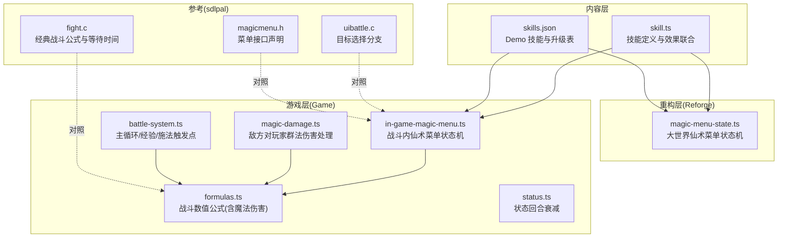
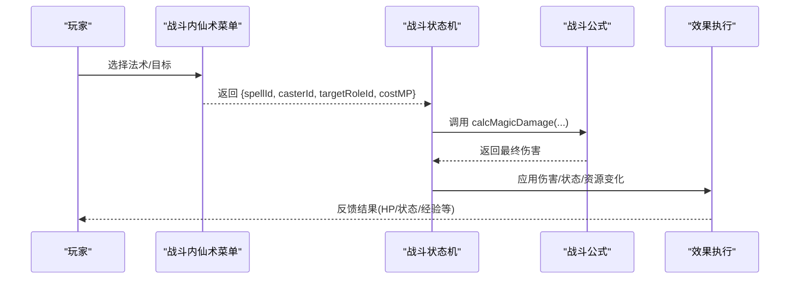
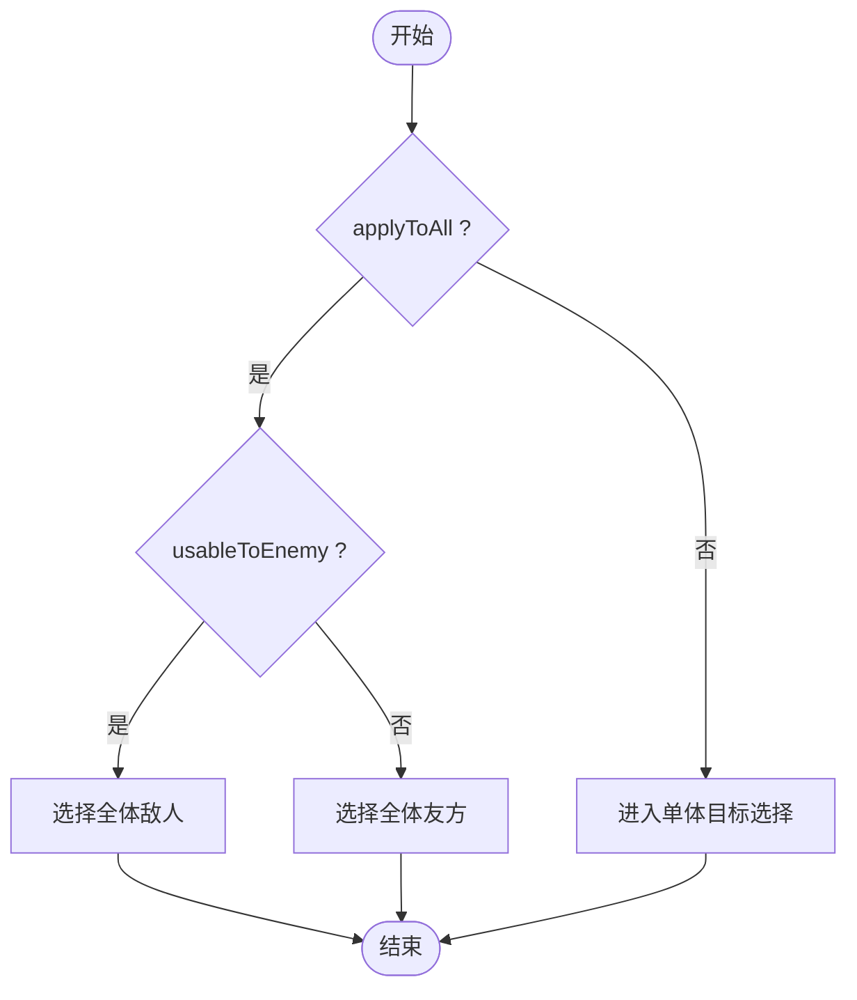
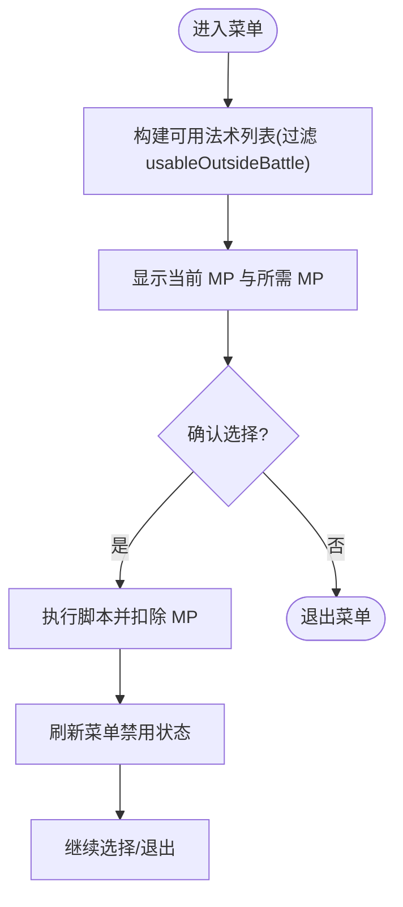
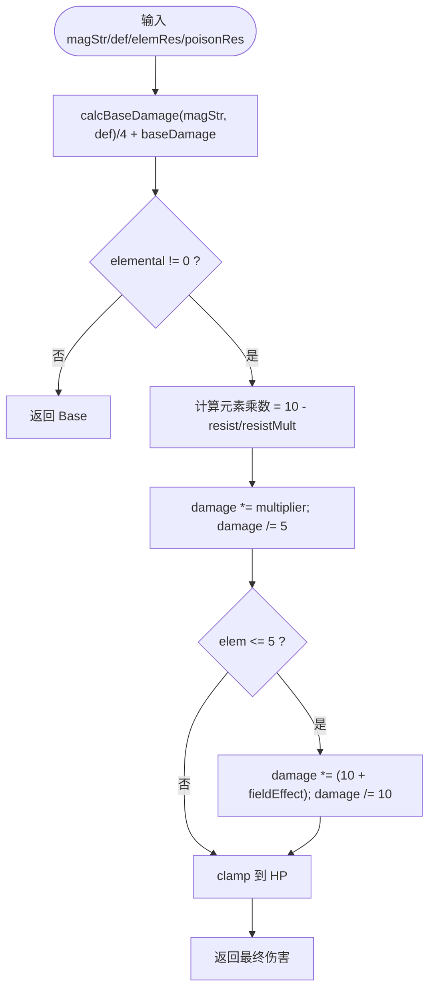
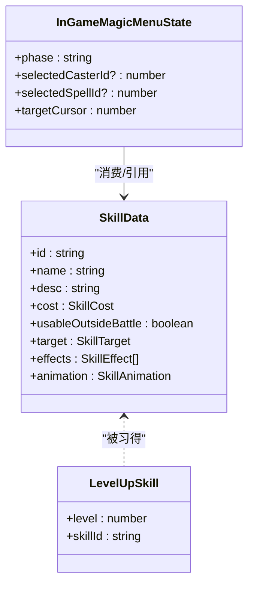
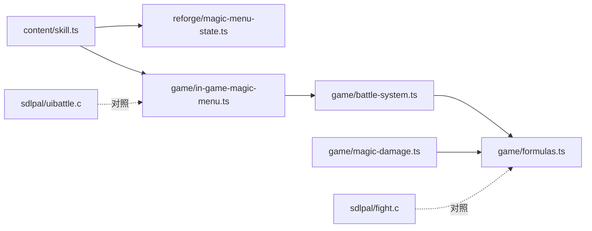

# 法术规则

<cite>
**本文引用的文件**   
- [packages/content/src/skill.ts](file://packages/content/src/skill.ts)
- [projects/demo/content/skills.json](file://projects/demo/content/skills.json)
- [packages/reforge/src/magic-menu-state.ts](file://packages/reforge/src/magic-menu-state.ts)
- [packages/game/src/core/menu/in-game-magic-menu.ts](file://packages/game/src/core/menu/in-game-magic-menu.ts)
- [packages/game/src/core/battle/formulas.ts](file://packages/game/src/core/battle/formulas.ts)
- [packages/game/src/core/battle/magic-damage.ts](file://packages/game/src/core/battle/magic-damage.ts)
- [packages/game/src/core/battle/status.ts](file://packages/game/src/core/battle/status.ts)
- [packages/game/src/core/battle/battle-system.ts](file://packages/game/src/core/battle/battle-system.ts)
- [reference/sdlpal/fight.c](file://reference/sdlpal/fight.c)
- [reference/sdlpal/uibattle.c](file://reference/sdlpal/uibattle.c)
- [reference/sdlpal/magicmenu.h](file://reference/sdlpal/magicmenu.h)
- [docs/phase2/foundation/skill-data-plan.md](file://docs/phase2/foundation/skill-data-plan.md)
- [docs/phase2/menu/magic-menu-plan.md](file://docs/phase2/menu/magic-menu-plan.md)
</cite>

## 目录
1. [简介](#简介)
2. [项目结构](#项目结构)
3. [核心组件](#核心组件)
4. [架构总览](#架构总览)
5. [详细组件分析](#详细组件分析)
6. [依赖关系分析](#依赖关系分析)
7. [性能与平衡性](#性能与平衡性)
8. [故障排查指南](#故障排查指南)
9. [结论](#结论)
10. [附录](#附录)

## 简介
本文件系统化梳理“法术规则系统”的设计与实现，覆盖以下关键主题：
- 法术分类体系与目标选择逻辑
- MP 消耗机制与冷却时间管理（含原版行为对照）
- 伤害计算、范围判定与抗性对抗
- 升级习得系统与组合技（合击）机制
- 复合法术系统的扩展方式
- 新法术定义与效果配置方法
- 数据验证与平衡性测试工具使用建议

## 项目结构
围绕“法术规则”，代码与文档主要分布在 content 层（数据与类型）、reforge 层（大世界菜单状态机）、game 层（战斗公式与菜单流程），以及 sdlpal 参考源码。

图示来源
- [packages/content/src/skill.ts:1-75](file://packages/content/src/skill.ts#L1-L75)
- [projects/demo/content/skills.json:1-101](file://projects/demo/content/skills.json#L1-L101)
- [packages/reforge/src/magic-menu-state.ts:1-64](file://packages/reforge/src/magic-menu-state.ts#L1-L64)
- [packages/game/src/core/menu/in-game-magic-menu.ts:1-307](file://packages/game/src/core/menu/in-game-magic-menu.ts#L1-L307)
- [packages/game/src/core/battle/formulas.ts:1-217](file://packages/game/src/core/battle/formulas.ts#L1-L217)
- [packages/game/src/core/battle/magic-damage.ts:242-288](file://packages/game/src/core/battle/magic-damage.ts#L242-L288)
- [packages/game/src/core/battle/status.ts:1-35](file://packages/game/src/core/battle/status.ts#L1-L35)
- [packages/game/src/core/battle/battle-system.ts:1339-1602](file://packages/game/src/core/battle/battle-system.ts#L1339-L1602)
- [reference/sdlpal/fight.c:1919-1962](file://reference/sdlpal/fight.c#L1919-L1962)
- [reference/sdlpal/uibattle.c:1122-1155](file://reference/sdlpal/uibattle.c#L1122-L1155)
- [reference/sdlpal/magicmenu.h:1-50](file://reference/sdlpal/magicmenu.h#L1-L50)

章节来源
- [packages/content/src/skill.ts:1-75](file://packages/content/src/skill.ts#L1-L75)
- [projects/demo/content/skills.json:1-101](file://projects/demo/content/skills.json#L1-L101)
- [packages/reforge/src/magic-menu-state.ts:1-64](file://packages/reforge/src/magic-menu-state.ts#L1-L64)
- [packages/game/src/core/menu/in-game-magic-menu.ts:1-307](file://packages/game/src/core/menu/in-game-magic-menu.ts#L1-L307)
- [packages/game/src/core/battle/formulas.ts:1-217](file://packages/game/src/core/battle/formulas.ts#L1-L217)
- [packages/game/src/core/battle/magic-damage.ts:242-288](file://packages/game/src/core/battle/magic-damage.ts#L242-L288)
- [packages/game/src/core/battle/status.ts:1-35](file://packages/game/src/core/battle/status.ts#L1-L35)
- [packages/game/src/core/battle/battle-system.ts:1339-1602](file://packages/game/src/core/battle/battle-system.ts#L1339-L1602)
- [reference/sdlpal/fight.c:1919-1962](file://reference/sdlpal/fight.c#L1919-L1962)
- [reference/sdlpal/uibattle.c:1122-1155](file://reference/sdlpal/uibattle.c#L1122-L1155)
- [reference/sdlpal/magicmenu.h:1-50](file://reference/sdlpal/magicmenu.h#L1-L50)

## 核心组件
- 技能数据模型与效果联合
  - 技能定义包含名称、描述、消耗、是否可在大世界使用、目标类型、有序 effects 列表、动画信息。
  - 效果为判别联合，涵盖伤害、治疗、复活、状态施加/移除、毒、属性增益、即死、偷取、收集宝物、召唤、变身等。
  - 目标类型为五类之一：单体敌人、全体敌人、单体友方、全体友方、自身。
- 大世界仙术菜单状态机
  - 提供解析可用法术、打开/关闭菜单、确认选法、返回上一阶段、网格导航等功能。
  - 列数固定为 3，光标移动按行列 clamp，不 wrap。
- 战斗内仙术菜单状态机
  - 三阶段：选择施法人 → 选择法术 → 选择目标；支持翻页、Home/End、取消回退等。
  - 单人队伍跳过施法人选择直接进入法术列表。
- 战斗数值公式
  - 基础伤害、物理伤害、魔法伤害、敏捷值计算等纯函数，忠实移植自 sdlpal 的 PAL_CLASSIC 路径。
  - 魔法伤害考虑魔攻、防御、元素抗性、毒抗、战场加成、随机波动因子。
- 状态回合衰减
  - 每回合对所有状态计数器统一递减，包括布尔型状态的计数语义。
- 经验与施法触发点
  - 玩家施法后增加隐藏经验项，且仅在非敌方时生效。

章节来源
- [packages/content/src/skill.ts:1-75](file://packages/content/src/skill.ts#L1-L75)
- [packages/reforge/src/magic-menu-state.ts:1-64](file://packages/reforge/src/magic-menu-state.ts#L1-L64)
- [packages/game/src/core/menu/in-game-magic-menu.ts:1-307](file://packages/game/src/core/menu/in-game-magic-menu.ts#L1-L307)
- [packages/game/src/core/battle/formulas.ts:1-217](file://packages/game/src/core/battle/formulas.ts#L1-L217)
- [packages/game/src/core/battle/status.ts:1-35](file://packages/game/src/core/battle/status.ts#L1-L35)
- [packages/game/src/core/battle/battle-system.ts:2773-2785](file://packages/game/src/core/battle/battle-system.ts#L2773-L2785)

## 架构总览
下图展示从“数据定义”到“菜单交互”再到“战斗执行与数值结算”的整体链路。

图示来源
- [packages/game/src/core/menu/in-game-magic-menu.ts:169-222](file://packages/game/src/core/menu/in-game-magic-menu.ts#L169-L222)
- [packages/game/src/core/battle/formulas.ts:112-158](file://packages/game/src/core/battle/formulas.ts#L112-L158)
- [packages/game/src/core/battle/magic-damage.ts:242-288](file://packages/game/src/core/battle/magic-damage.ts#L242-L288)

## 详细组件分析

### 法术分类体系与目标选择
- 分类维度
  - 目标类型：oneEnemy / allEnemies / oneAlly / allAllies / self
  - 使用场景：usableOutsideBattle 控制是否可在大世界菜单显示
  - 效果序列：effects[] 有序执行，便于组合多段效果
- 目标选择逻辑
  - 战斗内菜单根据 flags.applyToAll 与 flags.usableToEnemy 决定进入“全体/单体”、“敌/友”目标选择分支。
  - 单人队伍直接跳过施法人选择，进入法术列表。
  - 原版的菜单入口与更新由 magicmenu.h 暴露，UI 分支在 uibattle.c 中按 flags 分流。

图示来源
- [packages/game/src/core/menu/in-game-magic-menu.ts:169-222](file://packages/game/src/core/menu/in-game-magic-menu.ts#L169-L222)
- [reference/sdlpal/uibattle.c:1122-1155](file://reference/sdlpal/uibattle.c#L1122-L1155)

章节来源
- [packages/content/src/skill.ts:12-13](file://packages/content/src/skill.ts#L12-L13)
- [packages/game/src/core/menu/in-game-magic-menu.ts:169-222](file://packages/game/src/core/menu/in-game-magic-menu.ts#L169-L222)
- [reference/sdlpal/uibattle.c:1122-1155](file://reference/sdlpal/uibattle.c#L1122-L1155)

### MP 消耗机制与冷却时间管理
- MP 消耗
  - 战斗内菜单返回 costMP，上层在脚本执行后扣减 MP，并根据当前 MP 刷新菜单禁用状态。
  - 大世界菜单渲染层会依据 currentMP >= neededMP 灰显不可用项。
- 冷却时间
  - 当前实现未引入全局冷却计时器；若需新增，建议在状态机或菜单层维护每个法术的 lastUsedTimestamp 并在可用列表中过滤。
- 原版对照
  - 原版非 CLASSIC 分支下，法术“等待时间”与 MP 成本相关，治疗类缩短等待时间；CLASSIC 路径下为纯回合制，无 ATB 等待槽。

图示来源
- [packages/reforge/src/magic-menu-state.ts:15-29](file://packages/reforge/src/magic-menu-state.ts#L15-L29)
- [packages/game/src/core/menu/in-game-magic-menu.ts:127-160](file://packages/game/src/core/menu/in-game-magic-menu.ts#L127-L160)
- [reference/sdlpal/fight.c:1919-1962](file://reference/sdlpal/fight.c#L1919-L1962)

章节来源
- [packages/reforge/src/magic-menu-state.ts:15-29](file://packages/reforge/src/magic-menu-state.ts#L15-L29)
- [packages/game/src/core/menu/in-game-magic-menu.ts:127-160](file://packages/game/src/core/menu/in-game-magic-menu.ts#L127-L160)
- [reference/sdlpal/fight.c:1919-1962](file://reference/sdlpal/fight.c#L1919-L1962)

### 伤害计算、范围判定与抗性对抗
- 伤害计算
  - 基础伤害基于魔攻与防御三段式，随后除以 4 并加上 magic.baseDamage。
  - 元素修正：根据 elemental 索引选择对应元素抗性，乘以 (10 - resist/resistMult) 后再除以 5；若为风雷水火土，再叠加战场场效修正。
  - 随机波动：magStr 乘以 [1.0, 1.1] 的随机因子。
- 范围判定
  - 通过 flags.applyToAll 与 flags.usableToEnemy 确定目标侧与范围。
  - 敌方对玩家的群法伤害逐存活队员独立掷随机因子并分别结算。
- 抗性对抗
  - 元素抗性 elemRes[wind/thunder/water/fire/earth] 与 poisonRes 分别影响对应伤害。
  - 当某元素抗性达到满值时，伤害归零（免疫）。

图示来源
- [packages/game/src/core/battle/formulas.ts:112-158](file://packages/game/src/core/battle/formulas.ts#L112-L158)
- [packages/game/src/core/battle/magic-damage.ts:242-288](file://packages/game/src/core/battle/magic-damage.ts#L242-L288)

章节来源
- [packages/game/src/core/battle/formulas.ts:112-158](file://packages/game/src/core/battle/formulas.ts#L112-L158)
- [packages/game/src/core/battle/magic-damage.ts:242-288](file://packages/game/src/core/battle/magic-damage.ts#L242-L288)

### 升级系统与组合技（合击）机制
- 升级习得
  - levelUpSkills 以角色为单位记录等级→法术 ID 的映射，用于自动习得。
  - Demo 中李逍遥的习得表已给出，后续全量迁移至 phase3。
- 组合技
  - 战斗主菜单“合击”选项读取角色的 cooperativeMagic 字段，进入目标选择分支，执行 performCoopMagic。
  - 目标选择遵循 flags.usableToEnemy 与 flags.applyToAll 的规则。

图示来源
- [packages/content/src/skill.ts:54-74](file://packages/content/src/skill.ts#L54-L74)
- [packages/game/src/core/menu/in-game-magic-menu.ts:1339-1372](file://packages/game/src/core/battle/battle-system.ts#L1339-L1372)

章节来源
- [projects/demo/content/skills.json:61-101](file://projects/demo/content/skills.json#L61-L101)
- [packages/game/src/core/battle/battle-system.ts:1339-1372](file://packages/game/src/core/battle/battle-system.ts#L1339-L1372)

### 复合法术系统（可扩展设计）
- 思路
  - 将多个 SkillEffect 串联为一个复合效果链，按顺序执行，中间可插入条件判断（如命中/抗性/概率）。
  - 在菜单层保留“预览”能力，显示复合效果的总体描述与 MP 需求。
- 示例路径
  - 定义复合效果：在 effects 数组中组合 healHp + buffStat + applyStatus。
  - 在菜单层聚合显示：遍历 effects 生成文本摘要。
  - 在执行层：逐个 effect 执行，遇到失败分支（如抗性免疫）可短路或降级。

章节来源
- [packages/content/src/skill.ts:27-48](file://packages/content/src/skill.ts#L27-L48)
- [packages/game/src/core/menu/in-game-magic-menu.ts:127-160](file://packages/game/src/core/menu/in-game-magic-menu.ts#L127-L160)

### 如何定义新法术与配置效果
- 步骤
  - 在 skills.json 中添加新的 skill 条目，填写 id/name/desc/cost/target/effects/animation。
  - 如需升级习得，在 levelUp 表中追加对应角色的条目。
  - 若需要在大世界菜单可见，设置 usableOutsideBattle=true。
- 校验
  - 运行内容层的引用校验，确保 levelUp.skillId 存在于 skills 表。
- 参考路径
  - 新增条目位置：projects/demo/content/skills.json
  - 升级表位置：projects/demo/content/skills.json 的 levelUp 段
  - 校验逻辑：packages/content/src/validate-refs.ts

章节来源
- [projects/demo/content/skills.json:1-60](file://projects/demo/content/skills.json#L1-L60)
- [projects/demo/content/skills.json:61-101](file://projects/demo/content/skills.json#L61-L101)
- [docs/phase2/foundation/skill-data-plan.md:214-278](file://docs/phase2/foundation/skill-data-plan.md#L214-L278)

### 数据验证与平衡性测试工具使用方法
- 数据验证
  - 运行内容层校验脚本，检查 levelUp 引用是否指向存在的 skillId。
  - 针对 skills.json 的 schema 一致性进行断言（vitest）。
- 平衡性测试
  - 使用 formulas.test.ts 中的用例作为基准，调整 baseDamage、elemental、resistMult、fieldEffect 等参数，观察伤害输出区间。
  - 结合 battle-system.test.ts 与 magic-damage.ts 的群法路径，验证 AoE 下的期望伤害分布。
- 参考路径
  - 校验：packages/content/src/validate-refs.ts
  - 公式单测：packages/game/src/core/battle/__tests__/formulas.test.ts
  - 群法路径：packages/game/src/core/battle/magic-damage.ts

章节来源
- [packages/content/src/validate-refs.ts:145-154](file://packages/content/src/validate-refs.ts#L145-L154)
- [packages/game/src/core/battle/__tests__/formulas.test.ts:85-208](file://packages/game/src/core/battle/__tests__/formulas.test.ts#L85-L208)
- [packages/game/src/core/battle/magic-damage.ts:242-288](file://packages/game/src/core/battle/magic-damage.ts#L242-L288)

## 依赖关系分析
- 内容层 → 重构层/游戏层
  - skill.ts 的类型与 DEMO_SKILLS 被 reforge 与 game 层消费。
- 游戏层内部
  - in-game-magic-menu.ts 依赖 menu primitives 与 spells/magics 数据，调用 battle-system 的流程节点。
  - formulas.ts 被 battle-system.ts 与 magic-damage.ts 共同调用。
- 参考层
  - fight.c 与 uibattle.c 提供行为真值，指导 TS 实现的 1:1 对齐。

图示来源
- [packages/content/src/skill.ts:1-75](file://packages/content/src/skill.ts#L1-L75)
- [packages/reforge/src/magic-menu-state.ts:1-64](file://packages/reforge/src/magic-menu-state.ts#L1-L64)
- [packages/game/src/core/menu/in-game-magic-menu.ts:1-307](file://packages/game/src/core/menu/in-game-magic-menu.ts#L1-L307)
- [packages/game/src/core/battle/battle-system.ts:1339-1602](file://packages/game/src/core/battle/battle-system.ts#L1339-L1602)
- [packages/game/src/core/battle/formulas.ts:1-217](file://packages/game/src/core/battle/formulas.ts#L1-L217)
- [packages/game/src/core/battle/magic-damage.ts:242-288](file://packages/game/src/core/battle/magic-damage.ts#L242-L288)
- [reference/sdlpal/fight.c:1919-1962](file://reference/sdlpal/fight.c#L1919-L1962)
- [reference/sdlpal/uibattle.c:1122-1155](file://reference/sdlpal/uibattle.c#L1122-L1155)

章节来源
- [packages/content/src/skill.ts:1-75](file://packages/content/src/skill.ts#L1-L75)
- [packages/reforge/src/magic-menu-state.ts:1-64](file://packages/reforge/src/magic-menu-state.ts#L1-L64)
- [packages/game/src/core/menu/in-game-magic-menu.ts:1-307](file://packages/game/src/core/menu/in-game-magic-menu.ts#L1-L307)
- [packages/game/src/core/battle/battle-system.ts:1339-1602](file://packages/game/src/core/battle/battle-system.ts#L1339-L1602)
- [packages/game/src/core/battle/formulas.ts:1-217](file://packages/game/src/core/battle/formulas.ts#L1-L217)
- [packages/game/src/core/battle/magic-damage.ts:242-288](file://packages/game/src/core/battle/magic-damage.ts#L242-L288)
- [reference/sdlpal/fight.c:1919-1962](file://reference/sdlpal/fight.c#L1919-L1962)
- [reference/sdlpal/uibattle.c:1122-1155](file://reference/sdlpal/uibattle.c#L1122-L1155)

## 性能与平衡性
- 性能
  - 菜单状态机为纯函数/轻量状态，开销极低。
  - 伤害公式为纯函数，适合批量模拟与并行测试。
- 平衡性
  - 通过 formulas.test.ts 的用例集快速评估不同抗性/场效/随机因子的影响。
  - 群法路径下注意逐目标独立随机导致的方差，建议以期望值与分位数双视角评估。

## 故障排查指南
- 常见问题
  - 菜单无法进入 pick-target：检查 confirmSpell 返回值是否为 null（可能因 MP 不足或 spell/magic 缺失）。
  - 法术伤害异常：核对 elemental 索引与 elemRes 对应关系，确认 resistMult 取值是否符合预期。
  - 状态不衰减：确认 tickStatusEffects 是否在每回合推进前调用。
- 定位建议
  - 在 battle-system.ts 的施法分支处打印关键变量（magStr、baseDamage、elemental、resistMult、fieldEffect）。
  - 使用 formulas.test.ts 的边界用例复现问题，逐步缩小参数空间。

章节来源
- [packages/game/src/core/menu/in-game-magic-menu.ts:169-222](file://packages/game/src/core/menu/in-game-magic-menu.ts#L169-L222)
- [packages/game/src/core/battle/formulas.ts:112-158](file://packages/game/src/core/battle/formulas.ts#L112-L158)
- [packages/game/src/core/battle/status.ts:20-35](file://packages/game/src/core/battle/status.ts#L20-L35)

## 结论
本系统以“数据驱动 + 纯函数公式 + 状态机菜单”为核心，实现了从数据定义、菜单交互到战斗执行的完整闭环。通过 sdlpal 参考源码的严格对照，保证了数值与流程的忠实度。未来可在现有基础上扩展冷却时间、更丰富的复合效果与可视化预览，同时借助单元测试与基准用例持续保障平衡性与稳定性。

## 附录
- 大世界菜单计划与验收要点
  - 数据来源：learnedSkills → DEMO_SKILLS，过滤 usableOutsideBattle。
  - 网格布局：3 列，光标 clamp，MP box 显示 needed/current。
  - 单人查看版：不执行 effects，仅展示与导航。
- 参考路径
  - 计划文档：docs/phase2/menu/magic-menu-plan.md
  - 地基设计：docs/phase2/foundation/skill-data-plan.md

章节来源
- [docs/phase2/menu/magic-menu-plan.md:1-184](file://docs/phase2/menu/magic-menu-plan.md#L1-L184)
- [docs/phase2/foundation/skill-data-plan.md:1-176](file://docs/phase2/foundation/skill-data-plan.md#L1-L176)