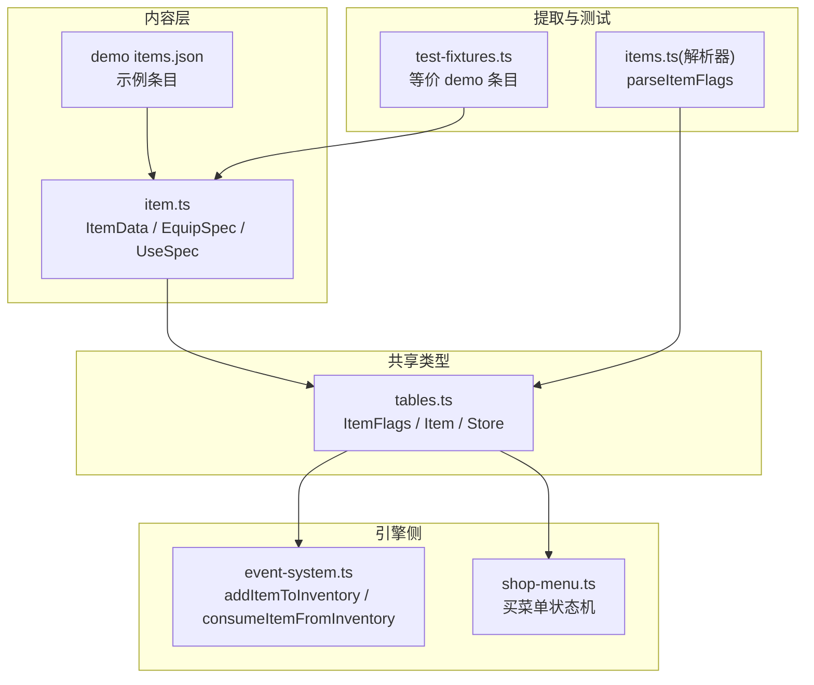
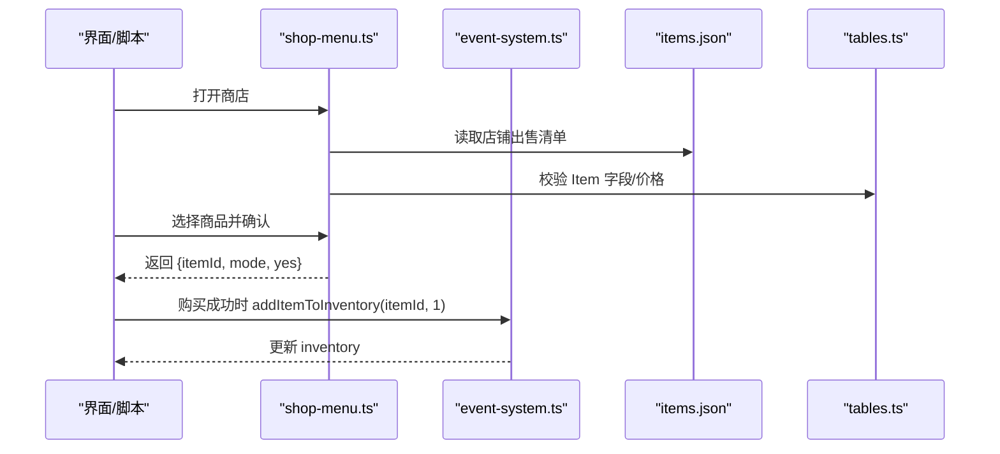
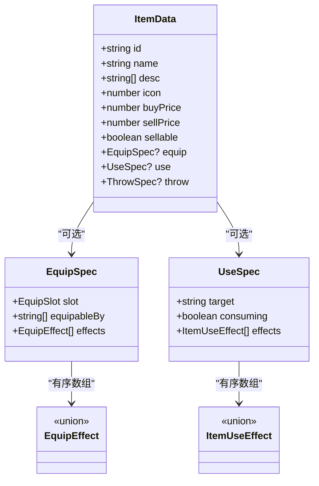
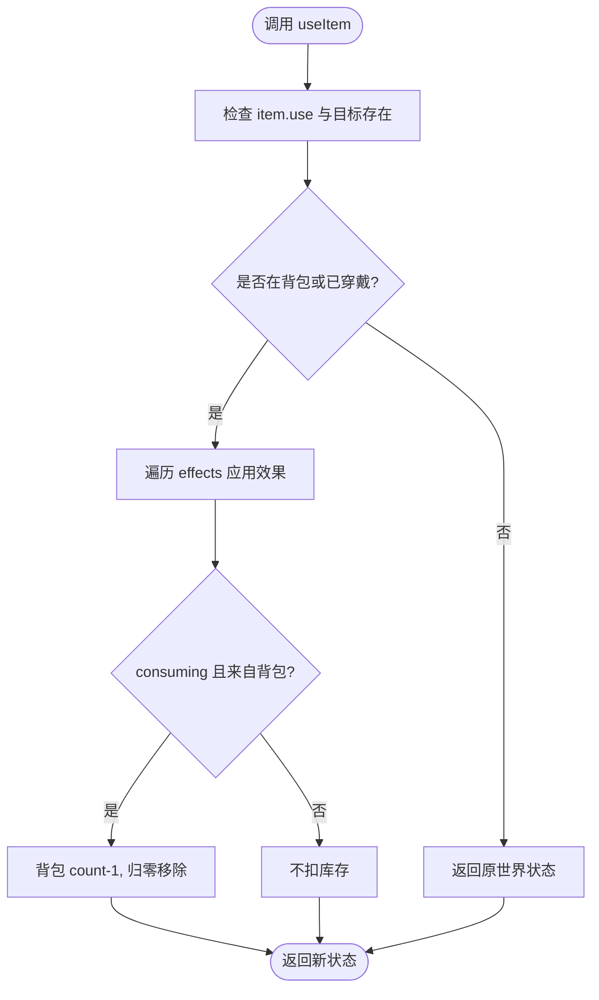
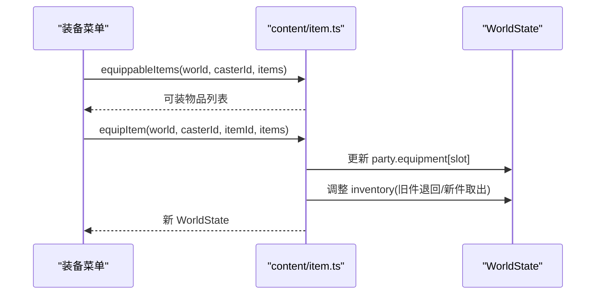
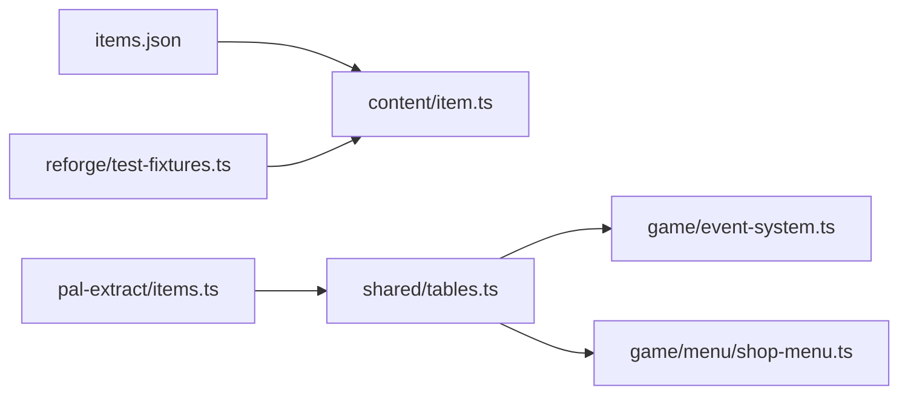
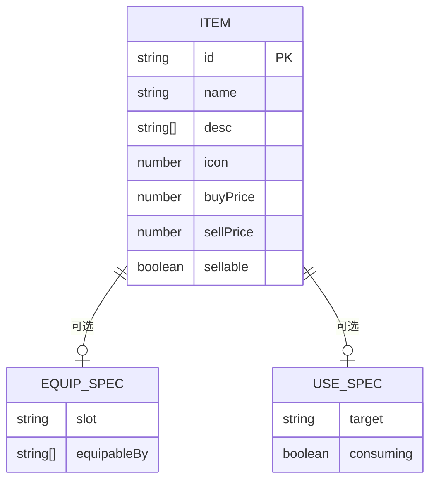

# 物品规则

<cite>
**本文引用的文件**   
- [packages/content/src/item.ts](file://packages/content/src/item.ts)
- [packages/shared/src/tables.ts](file://packages/shared/src/tables.ts)
- [projects/demo/content/items.json](file://projects/demo/content/items.json)
- [docs/phase2/foundation/item-data-design.md](file://docs/phase2/foundation/item-data-design.md)
- [packages/game/src/core/event-system.ts](file://packages/game/src/core/event-system.ts)
- [packages/game/src/core/menu/shop-menu.ts](file://packages/game/src/core/menu/shop-menu.ts)
- [packages/pal-extract/src/resources/parsers/items.ts](file://packages/pal-extract/src/resources/parsers/items.ts)
- [packages/reforge/src/test-fixtures.ts](file://packages/reforge/src/test-fixtures.ts)
</cite>

## 目录
1. [引言](#引言)
2. [项目结构](#项目结构)
3. [核心组件](#核心组件)
4. [架构总览](#架构总览)
5. [详细组件分析](#详细组件分析)
6. [依赖分析](#依赖分析)
7. [性能考虑](#性能考虑)
8. [故障排查指南](#故障排查指南)
9. [结论](#结论)
10. [附录](#附录)

## 引言
本文件系统化梳理“物品规则系统”的设计与实现，覆盖以下关键主题：
- 物品分类体系与能力块（装备/使用/投掷）
- 使用效果机制与消耗逻辑
- 装备属性加成与有效属性计算
- 耐久度系统与合成配方（现状与规划）
- 稀有度分级、掉落概率与商店定价（现状与规划）
- 如何定义新物品、配置使用效果、实现装备属性系统
- 物品数据管理与平衡性工具使用方法

## 项目结构
围绕“物品规则”，代码与文档主要分布在如下位置：
- 内容层（纯数据与类型）：content/src/item.ts
- 共享表类型（反编译对齐 sdlpal）：shared/src/tables.ts
- 示例数据：projects/demo/content/items.json
- 设计文档：docs/phase2/foundation/item-data-design.md
- 引擎侧库存与消耗：game/src/core/event-system.ts
- 商店买菜单状态机：game/src/core/menu/shop-menu.ts
- 解析器（flags 位映射）：pal-extract/src/resources/parsers/items.ts
- 测试夹具（等价 demo 条目）：reforge/src/test-fixtures.ts

图表来源
- [packages/content/src/item.ts:52-64](file://packages/content/src/item.ts#L52-L64)
- [projects/demo/content/items.json:1-248](file://projects/demo/content/items.json#L1-L248)
- [packages/shared/src/tables.ts:22-40](file://packages/shared/src/tables.ts#L22-L40)
- [packages/game/src/core/event-system.ts:3262-3283](file://packages/game/src/core/event-system.ts#L3262-L3283)
- [packages/game/src/core/menu/shop-menu.ts:39-103](file://packages/game/src/core/menu/shop-menu.ts#L39-L103)
- [packages/pal-extract/src/resources/parsers/items.ts:40-54](file://packages/pal-extract/src/resources/parsers/items.ts#L40-L54)
- [packages/reforge/src/test-fixtures.ts:33-87](file://packages/reforge/src/test-fixtures.ts#L33-L87)

章节来源
- [packages/content/src/item.ts:52-64](file://packages/content/src/item.ts#L52-L64)
- [packages/shared/src/tables.ts:22-40](file://packages/shared/src/tables.ts#L22-L40)
- [projects/demo/content/items.json:1-248](file://projects/demo/content/items.json#L1-L248)
- [docs/phase2/foundation/item-data-design.md:1-147](file://docs/phase2/foundation/item-data-design.md#L1-L147)

## 核心组件
- 物品基类与能力块
  - ItemData：id/name/desc/icon/buyPrice/sellPrice/sellable + 可选能力块 equip?/use?/throw?
  - EquipSpec：slot/equipableBy/effects（statBonus/resistance/maxPool/grantStatus/grantSkill/attackAll）
  - UseSpec：target/consuming/effects（healHp/healMp/applyStatus/triggerScript/teleport 等）
- 有效属性计算
  - effectiveStat(char, stat, items)：基础值 + Σ 已穿戴的 statBonus
- 背包与消耗
  - addItemToInventory(gs, itemId, qty)：+/- 数量，上限 99，qty=0→1 的原版行为
  - consumeItemFromInventory(gs, itemId)：-1 数量
- 商店买菜单
  - createBuyMenu/shopSelectItem/shopConfirm：对照 sdlpal 状态机，price<=cash 才弹确认

章节来源
- [packages/content/src/item.ts:52-105](file://packages/content/src/item.ts#L52-L105)
- [packages/content/src/item.ts:69-90](file://packages/content/src/item.ts#L69-L90)
- [packages/game/src/core/event-system.ts:3262-3283](file://packages/game/src/core/event-system.ts#L3262-L3283)
- [packages/game/src/core/menu/shop-menu.ts:39-103](file://packages/game/src/core/menu/shop-menu.ts#L39-L103)

## 架构总览
从数据到运行时的关键路径：
- 数据层：items.json → content ItemDataMap
- 类型层：shared tables.ts 提供 ItemFlags/Item/Store 等类型
- 引擎层：event-system.ts 管理库存增减；shop-menu.ts 驱动购买流程
- 解析层：pal-extract 将原始 flags 位拆为具名 ItemFlags

图表来源
- [packages/game/src/core/menu/shop-menu.ts:39-103](file://packages/game/src/core/menu/shop-menu.ts#L39-L103)
- [packages/game/src/core/event-system.ts:3262-3283](file://packages/game/src/core/event-system.ts#L3262-L3283)
- [projects/demo/content/items.json:1-248](file://projects/demo/content/items.json#L1-L248)
- [packages/shared/src/tables.ts:433-448](file://packages/shared/src/tables.ts#L433-L448)

## 详细组件分析

### 物品分类体系与能力块
- 一物多能力：一条 ItemData 可同时拥有 equip/use/throw，菜单按能力块存在与否过滤。
- 槽位显式化：EquipSpec.slot 明确 weapon/head/body/cloak/feet/accessory，替代原版运行时定槽。
- 可装备角色：equipableBy 以稳定角色模板 id 列表表达（原 6 bit 位）。

图表来源
- [packages/content/src/item.ts:52-64](file://packages/content/src/item.ts#L52-L64)
- [packages/content/src/item.ts:13-30](file://packages/content/src/item.ts#L13-L30)
- [packages/content/src/item.ts:32-50](file://packages/content/src/item.ts#L32-L50)

章节来源
- [docs/phase2/foundation/item-data-design.md:15-43](file://docs/phase2/foundation/item-data-design.md#L15-L43)
- [packages/content/src/item.ts:52-64](file://packages/content/src/item.ts#L52-L64)
- [packages/shared/src/tables.ts:22-40](file://packages/shared/src/tables.ts#L22-L40)

### 使用效果机制与消耗逻辑
- UseSpec.target 支持 oneAlly/allAllies/self/scene 等目标语义。
- UseSpec.consuming 控制是否扣减库存；useItem 仅从背包扣除，穿戴中的灵珠使用后不扣包内数量。
- 当前实现 healHp/healMp（夹在 max），其余 kind 留桩待扩展。

图表来源
- [packages/content/src/item.ts:178-226](file://packages/content/src/item.ts#L178-L226)

章节来源
- [packages/content/src/item.ts:178-226](file://packages/content/src/item.ts#L178-L226)
- [docs/phase2/foundation/item-data-design.md:98-115](file://docs/phase2/foundation/item-data-design.md#L98-L115)

### 装备属性加成与有效属性计算
- effectiveStat(char, stat, items)：基础值 + Σ 已穿戴装备的 statBonus(delta)。
- equippableItems(world, casterId, items)：筛选背包中该角色可装的物品。
- equipItem(world, casterId, itemId, items)：换装（旧件回包，不可变更新）。

图表来源
- [packages/content/src/item.ts:92-149](file://packages/content/src/item.ts#L92-L149)

章节来源
- [packages/content/src/item.ts:69-90](file://packages/content/src/item.ts#L69-L90)
- [packages/content/src/item.ts:92-149](file://packages/content/src/item.ts#L92-L149)

### 商店定价机制
- 买价：Item.buyPrice（demo 数据显式存储）
- 卖价：Item.sellPrice（demo 数据显式存储）
- 买菜单：shop-menu.ts 显示原价，price<=cash 才进入确认；确认后由上层执行 cash/inventory 变更。

章节来源
- [projects/demo/content/items.json:1-248](file://projects/demo/content/items.json#L1-L248)
- [packages/game/src/core/menu/shop-menu.ts:39-103](file://packages/game/src/core/menu/shop-menu.ts#L39-L103)

### 耐久度系统与合成配方规则
- 耐久度：当前仓库未实现物品耐久度字段与衰减逻辑。
- 合成配方：当前仓库未实现合成配方数据结构与合成流程。
- 建议：在 ItemData 扩展 durability/maxDurability 字段，并在 use/effect 中引入耐久消耗；新增 recipes.json 描述配方与产出。

[本节为概念性说明，不涉及具体源码引用]

### 稀有度分级、掉落概率计算
- 稀有度：当前仓库未定义物品稀有度字段与分级展示。
- 掉落概率：当前仓库未实现基于稀有度的掉落权重与概率计算。
- 建议：在 ItemData 扩展 rarity 字段，并在掉落系统中引入权重/阈值判定。

[本节为概念性说明，不涉及具体源码引用]

### 实战示例：如何定义新物品、配置使用效果、实现装备属性系统
- 定义新物品（参考 demo items.json 的结构）
  - 指定 id/name/desc/icon/buyPrice/sellPrice/sellable
  - 若可装备：添加 equip{slot, equipableBy, effects:[{kind:'statBonus', stat, delta}]}
  - 若可使用：添加 use{target, consuming, effects:[{kind:'healHp'|'healMp', amount}]}
- 配置使用效果
  - 在 UseSpec.effects 中添加对应 kind 与参数
  - 注意 consuming=true 时仅在背包中存在才会扣数
- 实现装备属性系统
  - 通过 effectiveStat 获取最终属性
  - 通过 equippableItems 过滤可装物品
  - 通过 equipItem 完成换装

章节来源
- [projects/demo/content/items.json:1-248](file://projects/demo/content/items.json#L1-L248)
- [packages/content/src/item.ts:52-105](file://packages/content/src/item.ts#L52-L105)
- [packages/content/src/item.ts:178-226](file://packages/content/src/item.ts#L178-L226)

## 依赖分析
- 内容层对共享类型无直接依赖，但遵循 shared 的类型约定（如 ItemFlags 的 6 个角色位）。
- 引擎侧 event-system.ts 使用数字型 itemId（与 items.json id 一致），负责库存加减。
- shop-menu.ts 依赖 shared 的 Item 类型进行列表渲染与交互。
- pal-extract 的 parseItemFlags 将原始位图转为具名 ItemFlags，确保 flags 语义正确。

图表来源
- [packages/shared/src/tables.ts:22-40](file://packages/shared/src/tables.ts#L22-L40)
- [packages/pal-extract/src/resources/parsers/items.ts:40-54](file://packages/pal-extract/src/resources/parsers/items.ts#L40-L54)
- [packages/game/src/core/event-system.ts:3262-3283](file://packages/game/src/core/event-system.ts#L3262-L3283)
- [packages/game/src/core/menu/shop-menu.ts:39-103](file://packages/game/src/core/menu/shop-menu.ts#L39-L103)
- [packages/reforge/src/test-fixtures.ts:33-87](file://packages/reforge/src/test-fixtures.ts#L33-L87)

章节来源
- [packages/shared/src/tables.ts:22-40](file://packages/shared/src/tables.ts#L22-L40)
- [packages/pal-extract/src/resources/parsers/items.ts:40-54](file://packages/pal-extract/src/resources/parsers/items.ts#L40-L54)
- [packages/game/src/core/event-system.ts:3262-3283](file://packages/game/src/core/event-system.ts#L3262-L3283)
- [packages/game/src/core/menu/shop-menu.ts:39-103](file://packages/game/src/core/menu/shop-menu.ts#L39-L103)
- [packages/reforge/src/test-fixtures.ts:33-87](file://packages/reforge/src/test-fixtures.ts#L33-L87)

## 性能考虑
- effectiveStat 为 O(S+E)，S 为槽位数（固定 6），E 为装备 effect 数（通常很小），开销极低。
- equippableItems 遍历一次 inventory 并做少量过滤，适合实时 UI 刷新。
- addItemToInventory 采用线性查找匹配 itemId，inventory 规模较小时足够高效；后续可按需改为 Map 索引。

[本节为通用性能讨论，不涉及具体源码引用]

## 故障排查指南
- 库存数量为 0 却显示为空槽
  - 现象：giveItem 传入 qty=0 时，原版会视为 1；实现中已将 0 修正为 1，避免幽灵空槽。
  - 定位：addItemToInventory 入口守卫与 qty==0→1 分支。
- 买不起仍弹出确认
  - 现象：shopSelectItem 会在 price>cash 时拒绝进入 confirm。
  - 定位：shop-menu.ts 的购买前置校验。
- 装备后属性未变化
  - 现象：effectiveStat 只累加 statBonus，其他 effect（resist/grant/attackAll）尚未接入引擎。
  - 定位：content/item.ts 的有效属性计算范围。

章节来源
- [packages/game/src/core/event-system.ts:3262-3283](file://packages/game/src/core/event-system.ts#L3262-L3283)
- [packages/game/src/core/menu/shop-menu.ts:65-77](file://packages/game/src/core/menu/shop-menu.ts#L65-L77)
- [packages/content/src/item.ts:69-90](file://packages/content/src/item.ts#L69-L90)

## 结论
- 当前系统以“能力块”为核心，将装备/使用/投掷解耦，配合显式槽位与稳定角色模板，使“一物多能”自然落地。
- 有效属性计算聚焦 statBonus，保证状态板穿装即变；其余效果预留接口，便于后续阶段接入。
- 库存与商店买菜单严格对齐 sdlpal 行为，保障还原度与可测性。
- 耐久度、合成、稀有度与掉落概率属于下一阶段增强点，建议在 schema 上预留字段与处理管线。

[本节为总结性内容，不涉及具体源码引用]

## 附录

### 数据模型关系（概念）

[此图为概念示意，不对应具体源码结构，故不提供图表来源]

### 开发与设计参考
- 设计文档：item-data-design.md 明确了能力块拆分原则、槽位命名、effect 形状与边界。
- 测试夹具：reforge/test-fixtures.ts 提供了等价 demo 条目，便于快速验证。

章节来源
- [docs/phase2/foundation/item-data-design.md:1-147](file://docs/phase2/foundation/item-data-design.md#L1-L147)
- [packages/reforge/src/test-fixtures.ts:33-87](file://packages/reforge/src/test-fixtures.ts#L33-L87)