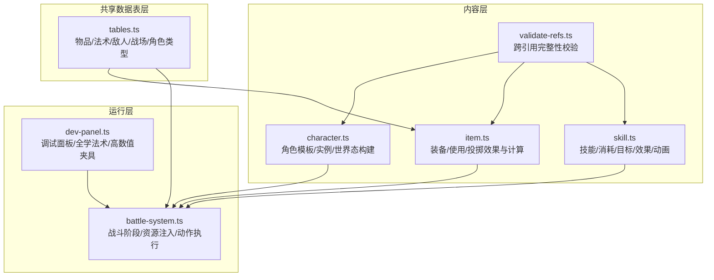
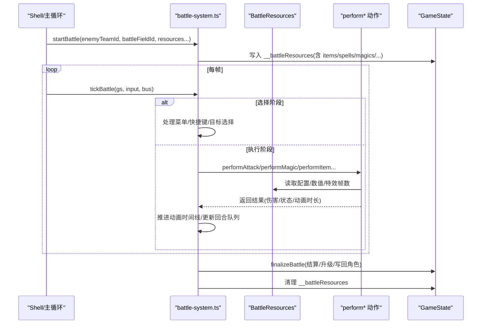
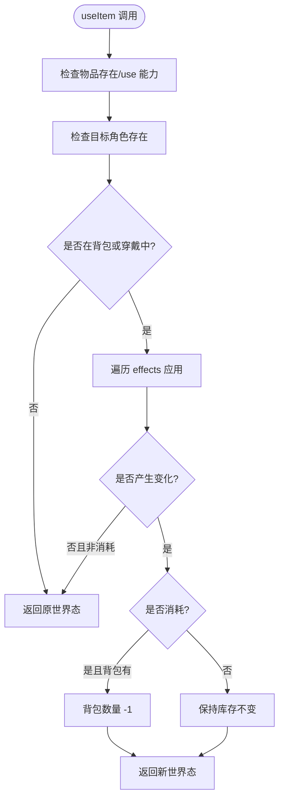
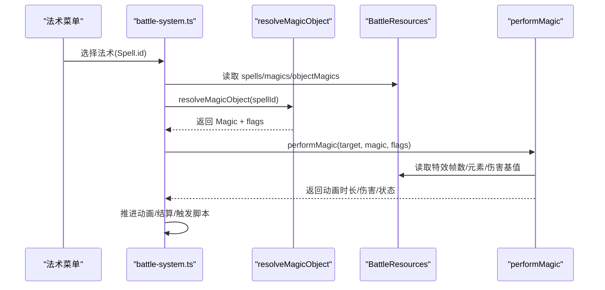
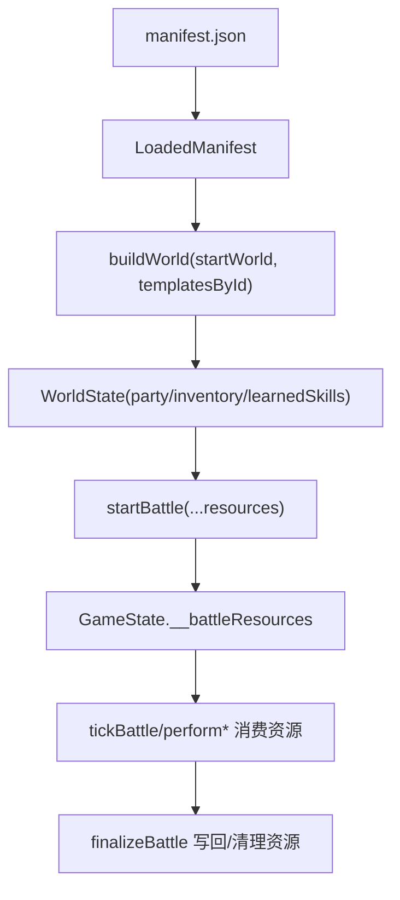
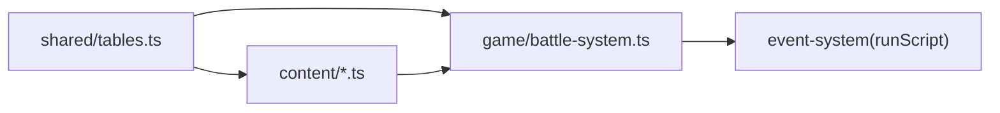

# 规则系统

<cite>
**本文引用的文件**
- [packages/shared/src/tables.ts](file://packages/shared/src/tables.ts)
- [packages/content/src/character.ts](file://packages/content/src/character.ts)
- [packages/content/src/item.ts](file://packages/content/src/item.ts)
- [packages/content/src/skill.ts](file://packages/content/src/skill.ts)
- [packages/game/src/core/battle/battle-system.ts](file://packages/game/src/core/battle/battle-system.ts)
- [packages/game/src/dev/dev-panel.ts](file://packages/game/src/dev/dev-panel.ts)
- [packages/content/src/validate-refs.ts](file://packages/content/src/validate-refs.ts)
</cite>

## 目录
1. [简介](#简介)
2. [项目结构](#项目结构)
3. [核心组件](#核心组件)
4. [架构总览](#架构总览)
5. [详细组件分析](#详细组件分析)
6. [依赖关系分析](#依赖关系分析)
7. [性能与复杂度](#性能与复杂度)
8. [故障排查指南](#故障排查指南)
9. [结论](#结论)
10. [附录：扩展与示例](#附录扩展与示例)

## 简介
本文件面向“规则系统”的完整说明，覆盖角色属性、物品效果、法术施放三大核心规则；阐述规则的验证逻辑、冲突解决策略与扩展机制；解释数据结构设计、配置文件格式与运行时加载流程；并提供添加新角色、定义新物品效果、实现自定义法术的实践路径与调试测试方法。

## 项目结构
规则系统由三层组成：
- 共享数据表层（shared）：以 sdlpal 原表为基准的类型定义，描述物品、法术、敌人、战场、玩家角色等静态数据模型。
- 内容层（content）：面向编辑器的 L1/L2 数据与纯函数式规则计算（如装备加成、使用效果），不依赖引擎。
- 游戏运行层（game）：战斗状态机、动作执行、资源注入、脚本调度与调试工具。



图表来源
- [packages/shared/src/tables.ts](file://packages/shared/src/tables.ts)
- [packages/content/src/character.ts](file://packages/content/src/character.ts)
- [packages/content/src/item.ts](file://packages/content/src/item.ts)
- [packages/content/src/skill.ts](file://packages/content/src/skill.ts)
- [packages/game/src/core/battle/battle-system.ts](file://packages/game/src/core/battle/battle-system.ts)
- [packages/game/src/dev/dev-panel.ts](file://packages/game/src/dev/dev-panel.ts)
- [packages/content/src/validate-refs.ts](file://packages/content/src/validate-refs.ts)

章节来源
- [packages/shared/src/tables.ts](file://packages/shared/src/tables.ts)
- [packages/content/src/character.ts](file://packages/content/src/character.ts)
- [packages/content/src/item.ts](file://packages/content/src/item.ts)
- [packages/content/src/skill.ts](file://packages/content/src/skill.ts)
- [packages/game/src/core/battle/battle-system.ts](file://packages/game/src/core/battle/battle-system.ts)
- [packages/game/src/dev/dev-panel.ts](file://packages/game/src/dev/dev-panel.ts)
- [packages/content/src/validate-refs.ts](file://packages/content/src/validate-refs.ts)

## 核心组件
- 共享数据表层（tables.ts）
  - 物品 Item、物品标志 ItemFlags
  - 法术 Spell、法术标志 SpellFlags、魔法详情 Magic、魔法类型 MagicType
  - 敌人 Enemy、敌队 EnemyTeam、战场 BattleField
  - 玩家角色 PlayerRole、玩家组 PlayerRoles、升级习得 LevelUpMagicEntry/Table
  - rgObject 的 union 视图：ObjectMagicView、ObjectPoisonView、ObjectPlayerView
- 内容层（content）
  - 角色模板/实例与世界态构建（character.ts）
  - 物品能力块：装备效果 EquipEffect、使用效果 ItemUseEffect、投掷 ThrowSpec（item.ts）
  - 技能定义 SkillData、消耗、目标、效果、动画（skill.ts）
  - 跨引用校验 ContentBundle + Issue（validate-refs.ts）
- 运行层（game）
  - 战斗系统入口、阶段流转、资源缓存 BattleResources（battle-system.ts）
  - 调试面板：一键全学法术、拉满数值、批量道具（dev-panel.ts）

章节来源
- [packages/shared/src/tables.ts](file://packages/shared/src/tables.ts)
- [packages/content/src/character.ts](file://packages/content/src/character.ts)
- [packages/content/src/item.ts](file://packages/content/src/item.ts)
- [packages/content/src/skill.ts](file://packages/content/src/skill.ts)
- [packages/game/src/core/battle/battle-system.ts](file://packages/game/src/core/battle/battle-system.ts)
- [packages/game/src/dev/dev-panel.ts](file://packages/game/src/dev/dev-panel.ts)
- [packages/content/src/validate-refs.ts](file://packages/content/src/validate-refs.ts)

## 架构总览
规则系统在运行时通过“资源注入 + 阶段推进 + 动作执行”的方式工作：
- startBattle 将 items/spells/magics/playerRoles/commands 等资源写入 GameState 的隐藏字段 __battleResources。
- tickBattle 根据当前 phase 路由到 selectAction / performAction / postAction，并驱动 UI 输入与动画时间线。
- 具体动作（攻击、防御、法术、物品、投掷、逃跑、合击）在 actions/* 中实现，读取 BattleResources 进行判定与结算。
- 升级时依据 levelUpExp 阈值与 levelUpMagic 表学习新法术。



图表来源
- [packages/game/src/core/battle/battle-system.ts](file://packages/game/src/core/battle/battle-system.ts)

## 详细组件分析

### 角色属性系统
- 数据模型
  - PlayerRole/PlayerRoles：对应 sdlpal tagPLAYERROLES 的反 SoA 视图，包含等级、HP/MP、攻防敏、抗性、音效等。
  - CharacterTemplate/CharacterInstance/WorldState：L2 模板与 L1 实例分离，buildWorld 从 manifest.startWorld 组装初始世界态。
- 关键规则
  - 升级习得法术：levelUpMagicTable[entryIndex][roleIndex] 按 { level<=新等级 && magic!=0 && 未学 } 条件学习。
  - 角色可用法术集合：角色初始 magic + 升级习得 + 授予（剧情/法宝），去重后上限 32。
- 冲突与边界
  - 重复习得去重；超过 32 槽位截断。
  - signed 字段（attackStrength/magicStrength/defense/dexterity）作为 stat modifier 可负。

```mermaid
classDiagram
class PlayerRole {
+id
+level
+hp/maxHP/mp/maxMP
+attackStrength/magicStrength/defense/dexterity
+elemResistance{wind,thunder,water,fire,earth}
+equipment[]
+magic[]
}
class PlayerRoles {
+roles : PlayerRole[]
}
class LevelUpMagicEntry {
+level
+magic
}
class LevelUpMagicTable {
+entries : LevelUpMagicEntry[][]
}
PlayerRoles --> PlayerRole : "包含"
LevelUpMagicTable --> LevelUpMagicEntry : "条目"
```

图表来源
- [packages/shared/src/tables.ts](file://packages/shared/src/tables.ts)

章节来源
- [packages/shared/src/tables.ts](file://packages/shared/src/tables.ts)
- [packages/content/src/character.ts](file://packages/content/src/character.ts)
- [packages/game/src/dev/dev-panel.ts](file://packages/game/src/dev/dev-panel.ts)

### 物品效果机制
- 能力块设计
  - 装备效果 EquipEffect：statBonus、resistance、maxPool、grantStatus、grantSkill、attackAll。
  - 使用效果 ItemUseEffect：healHp/healMp、applyStatus、triggerScript、teleport。
  - 投掷 ThrowSpec：占位，后续细化。
- 计算与交互
  - effectiveStat：角色 base + Σ 已穿戴装备的 statBonus。
  - equippableItems：背包中具备 equip 能力且 equipableBy 包含该角色的物品。
  - useItem：对目标应用 effects，consuming 则从背包扣减（穿戴中的灵珠类不扣）。
- 冲突与一致性
  - 同一 slot 换装时旧件回包，不可变返回新 WorldState。
  - 使用菜单兼容“穿戴中但本身可用”的物品（灵珠系）。



图表来源
- [packages/content/src/item.ts](file://packages/content/src/item.ts)

章节来源
- [packages/content/src/item.ts](file://packages/content/src/item.ts)

### 法术施放规则
- 数据模型
  - Spell：指向 Magic 详细 stats 的索引、flags（是否可在战斗外/内使用、可对敌、全体）、脚本钩子。
  - Magic：type（normal/attackAll/attackWhole/attackField/applyToPlayer/applyToParty/trance/summon/other）、costMP、baseDamage、elemental、sound 等。
  - ObjectMagicView：整个 OBJECT 数组按 magic 段解读，供 0x42 SimulateMagic 解析任意 object id。
- 运行时流程
  - 选择法术 → 校验 flags 与 MP → 解析 Magic 参数 → 构建动画时间线 → 结算伤害/状态/召唤等 → 触发 scriptOnSuccess/scriptOnUse。
- 升级习得
  - roleMagicsAtLevel：合并初始 magic、levelUpMagic 与 grants，去重取前 32。



图表来源
- [packages/game/src/core/battle/battle-system.ts](file://packages/game/src/core/battle/battle-system.ts)
- [packages/shared/src/tables.ts](file://packages/shared/src/tables.ts)

章节来源
- [packages/shared/src/tables.ts](file://packages/shared/src/tables.ts)
- [packages/game/src/core/battle/battle-system.ts](file://packages/game/src/core/battle/battle-system.ts)
- [packages/game/src/dev/dev-panel.ts](file://packages/game/src/dev/dev-panel.ts)

### 规则验证与冲突解决
- 单表形状校验：validate.ts（仅查字段是否存在，不在本文件范围展开）。
- 跨引用完整性校验：validate-refs.ts
  - 输入 ContentBundle（scenes/characters/skills/items/locale/sprites/startWorld/levelUp）。
  - 输出 Issue[]（severity=error/warn，where 定位数据路径）。
  - 跳过尚未落地的字段（poisonId/triggerScript.scriptId/teleport.target），待系统落地再补。
- 冲突解决策略
  - 升级习得去重与上限 32。
  - 装备 slot 互斥：同槽位只能一件，换装时旧件回包。
  - 使用效果幂等：无变化且不消耗则不改变世界态。

章节来源
- [packages/content/src/validate-refs.ts](file://packages/content/src/validate-refs.ts)
- [packages/game/src/dev/dev-panel.ts](file://packages/game/src/dev/dev-panel.ts)
- [packages/content/src/item.ts](file://packages/content/src/item.ts)

### 运行时加载机制
- 工程清单 LoadedManifest：id/name/contentVersion/entryScene/content/assets/startWorld。
- buildWorld：从 manifest.startWorld 组装初始 party、money、learnedSkills、inventory，支持 seedStats 覆盖 hp/mp。
- 战斗资源注入：startBattle 将 items/spells/magics/playerRoles/commands 等写入 GameState.__battleResources，finalizeBattle 清理。



图表来源
- [packages/content/src/character.ts](file://packages/content/src/character.ts)
- [packages/game/src/core/battle/battle-system.ts](file://packages/game/src/core/battle/battle-system.ts)

章节来源
- [packages/content/src/character.ts](file://packages/content/src/character.ts)
- [packages/game/src/core/battle/battle-system.ts](file://packages/game/src/core/battle/battle-system.ts)

## 依赖关系分析
- 模块耦合
  - content 层对 shared 类型强依赖，对 game 层零依赖（纯函数）。
  - game 层依赖 shared 类型与 content 层部分类型（如 PlayerRolesRuntime），并通过 BattleResources 解耦资源访问。
- 外部依赖点
  - DATA.MKF/SSS.MKF/FIRE.MKF/BALL.MKF 等资产与 chunk 布局由 tables.ts 注释对齐 sdlpal 原表。
  - 事件系统与脚本：runScript 在战斗中用于成功/使用脚本与毒 tick 等。



图表来源
- [packages/shared/src/tables.ts](file://packages/shared/src/tables.ts)
- [packages/content/src/character.ts](file://packages/content/src/character.ts)
- [packages/content/src/item.ts](file://packages/content/src/item.ts)
- [packages/game/src/core/battle/battle-system.ts](file://packages/game/src/core/battle/battle-system.ts)

章节来源
- [packages/shared/src/tables.ts](file://packages/shared/src/tables.ts)
- [packages/game/src/core/battle/battle-system.ts](file://packages/game/src/core/battle/battle-system.ts)

## 性能与复杂度
- 有效属性计算 effectiveStat：O(E)，E 为已穿戴装备数（固定 6 槽，常数级）。
- 升级习得合并 roleMagicsAtLevel：O(N+M+G)，N 初始法术、M 升级习得、G 授予，最终去重与切片至 32。
- 战斗 tick：受 PHASE_STALL_TICKS_LIMIT 保护，避免长时间卡死；动画时间线基于 BATTLE_FRAME_TIME 推进。

[本节为通用性能讨论，无需列出具体文件来源]

## 故障排查指南
- 调试面板（dev-panel.ts）
  - 一键全学法术：传入 level=99，合并初始/升级/授予法术，去重 cap 32。
  - 拉满数值：level=99、hp/mp 极大、magicStrength 提升便于观察法术伤害。
  - 批量道具：将全部物品数量置 99，方便测试使用/投掷效果。
  - 敌人血量调整：便于持久观察伤害与动画。
- 事件系统日志
  - 未具名 opcode 在 battle 模式下会打印带 [event-system battle] 前缀的 debug 信息，便于定位。
- 常见错误
  - 全局 label 缺失：warn + skip，避免死循环；注意主 while goto 与 autoCursor 行为差异。

章节来源
- [packages/game/src/dev/dev-panel.ts](file://packages/game/src/dev/dev-panel.ts)

## 结论
规则系统以“共享类型 + 内容纯函数 + 运行期资源注入”的分层设计，清晰分离了数据定义、规则计算与运行时执行。通过严格的跨引用校验、明确的冲突解决策略与完善的调试工具，既保证了数据的健壮性，也提升了扩展与排障效率。

[本节为总结性内容，无需列出具体文件来源]

## 附录：扩展与示例

### 如何添加新角色
- 在内容层新增 CharacterTemplate（id/name/baseStats/initialEquipment/initialMagic）。
- 在 manifest.startWorld.party 中加入该模板 id，必要时提供 seedStats 覆盖初始 hp/mp。
- 若需升级习得法术，在 levelUp 表中为该角色追加 LevelUpSkill。

章节来源
- [packages/content/src/character.ts](file://packages/content/src/character.ts)
- [packages/content/src/skill.ts](file://packages/content/src/skill.ts)

### 如何定义新物品效果
- 在 item.ts 的能力块联合中添加新的 kind（例如 grantSkill 或 attackAll 的扩展）。
- 在 UseSpec/EquipSpec 中声明其参数，并在 useItem/effectiveStat 等函数中补充分支逻辑。
- 确保 validate-refs.ts 的跨引用校验覆盖新增字段（如 status/skillId 等）。

章节来源
- [packages/content/src/item.ts](file://packages/content/src/item.ts)
- [packages/content/src/validate-refs.ts](file://packages/content/src/validate-refs.ts)

### 如何实现自定义法术
- 在 shared 层确认 Spell/Magic/ObjectMagicView 字段足以表达新法术需求（type/costMP/baseDamage/elemental 等）。
- 在 battle-system.ts 的动作执行链路中，为新的 type 或 flags 组合增加分支（如新的 target 或效果链）。
- 如需联动脚本，利用 spell.scriptOnUse/scriptOnSuccess 与 runScript 注入。

章节来源
- [packages/shared/src/tables.ts](file://packages/shared/src/tables.ts)
- [packages/game/src/core/battle/battle-system.ts](file://packages/game/src/core/battle/battle-system.ts)

### 规则调试与测试工具
- 使用 dev-panel.ts 的“法术测试”夹具快速构造高数值队伍与大量道具，验证法术伤害与动画。
- 在事件系统中关注 [event-system battle] 前缀的 debug 输出，定位未具名 opcode 或跳转问题。
- 使用 validate-refs.ts 的 ContentBundle 接口在编辑器或 loader 侧统一校验跨表引用。

章节来源
- [packages/game/src/dev/dev-panel.ts](file://packages/game/src/dev/dev-panel.ts)
- [packages/content/src/validate-refs.ts](file://packages/content/src/validate-refs.ts)