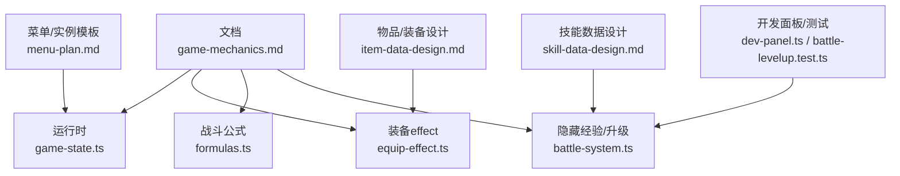
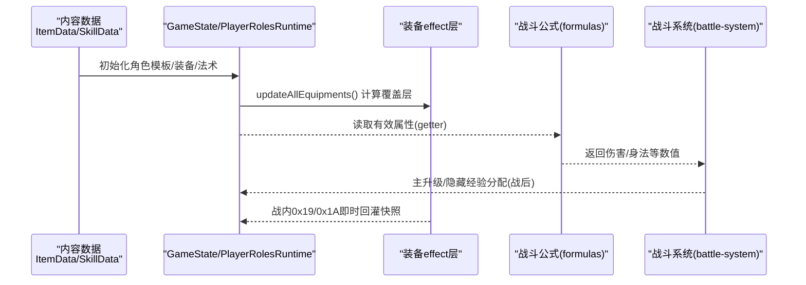
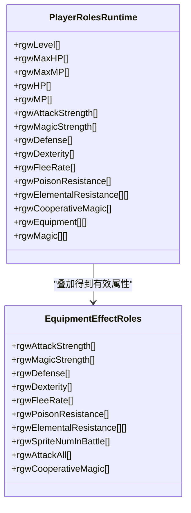
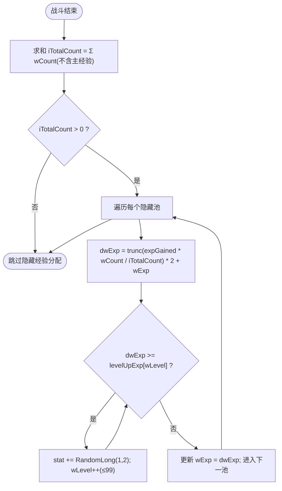
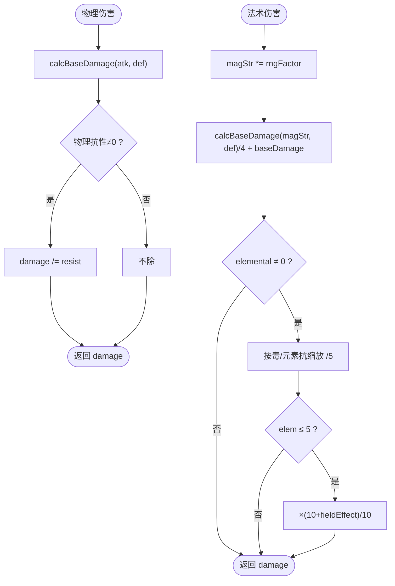
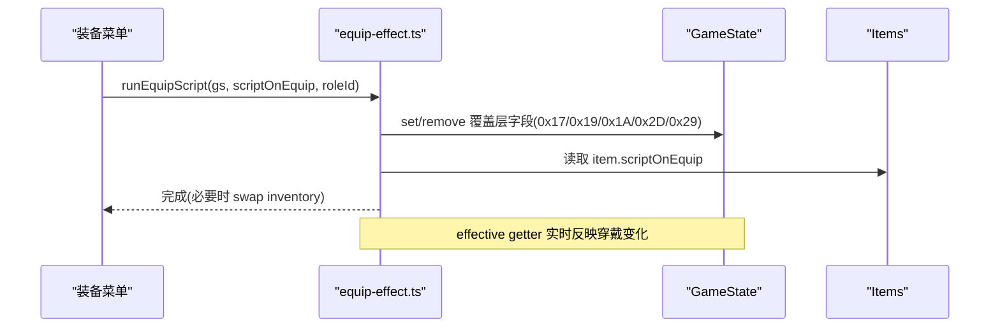
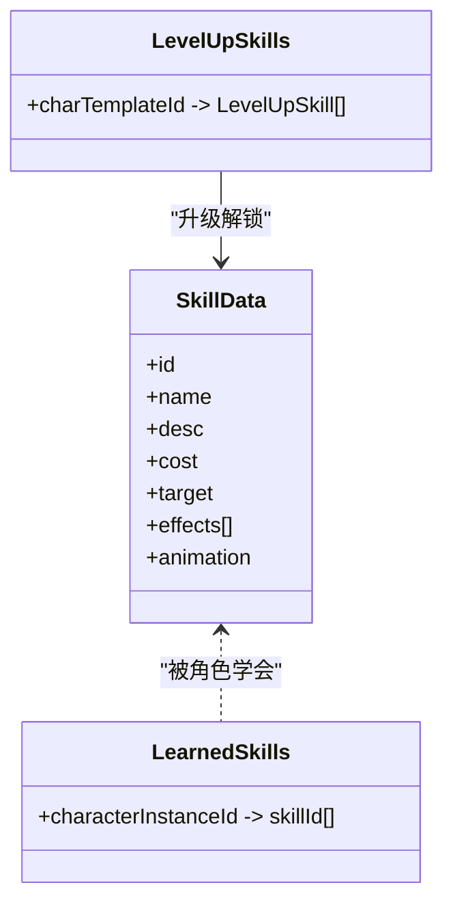
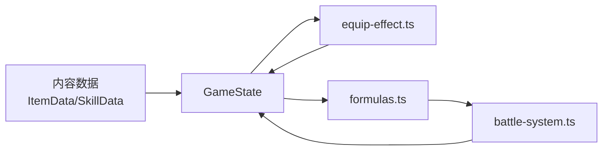

# 角色规则

<cite>
**本文引用的文件**   
- [README.md](file://README.md)
- [game-mechanics.md](file://docs/phase1/game-mechanics.md)
- [item-data-design.md](file://docs/phase2/foundation/item-data-design.md)
- [skill-data-design.md](file://docs/phase2/foundation/skill-data-design.md)
- [menu-plan.md](file://docs/phase2/menu/plan.md)
- [game-state.ts](file://packages/game/src/core/game-state.ts)
- [equip-effect.ts](file://packages/game/src/core/equip-effect.ts)
- [formulas.ts](file://packages/game/src/core/battle/formulas.ts)
- [battle-system.ts](file://packages/game/src/core/battle/battle-system.ts)
- [dev-panel.ts](file://packages/game/src/dev/dev-panel.ts)
- [battle-levelup.test.ts](file://packages/game/src/core/battle/__tests__/battle-levelup.test.ts)
</cite>

## 目录
1. [引言](#引言)
2. [项目结构](#项目结构)
3. [核心组件](#核心组件)
4. [架构总览](#架构总览)
5. [详细组件分析](#详细组件分析)
6. [依赖关系分析](#依赖关系分析)
7. [性能与平衡性考量](#性能与平衡性考量)
8. [故障排查指南](#故障排查指南)
9. [结论](#结论)
10. [附录](#附录)

## 引言
本文件围绕“角色规则系统”展开，聚焦以下目标：
- 角色属性定义、等级成长机制、装备槽位系统
- 基础属性与衍生属性计算、属性上限限制
- 职业特性、技能学习规则、状态效果叠加逻辑
- 如何定义新角色、配置属性成长曲线、实现特殊角色能力
- 角色数据验证与平衡性测试工具使用方法

本项目采用“第一阶段忠实还原 + 第二阶段重构”的双轨策略。第一阶段以 sdlpal C 源为真值基准；第二阶段在内容层建立稳定 schema（如 ItemData/SkillData），并在战斗公式与运行时中 1:1 对齐原版行为。

**章节来源**
- [README.md](file://README.md)

## 项目结构
与角色规则直接相关的代码与文档分布如下：
- 文档层
  - 底层机制真值与规则说明：[game-mechanics.md](file://docs/phase1/game-mechanics.md)
  - 物品/装备数据设计（含槽位与效果）：[item-data-design.md](file://docs/phase2/foundation/item-data-design.md)
  - 技能数据设计（effects 列表与习得规则）：[skill-data-design.md](file://docs/phase2/foundation/skill-data-design.md)
  - 菜单与角色实例/模板结构：[menu-plan.md](file://docs/phase2/menu/plan.md)
- 运行时代码
  - 全局状态与角色运行时字段：[game-state.ts](file://packages/game/src/core/game-state.ts)
  - 装备 effect 计算与脚本同步：[equip-effect.ts](file://packages/game/src/core/equip-effect.ts)
  - 战斗公式（伤害、身法等）：[formulas.ts](file://packages/game/src/core/battle/formulas.ts)
  - 隐藏经验分配与主升级流程：[battle-system.ts](file://packages/game/src/core/battle/battle-system.ts)
  - 开发面板与确定性升级增长：[dev-panel.ts](file://packages/game/src/dev/dev-panel.ts)
  - 升级相关单测夹具：[battle-levelup.test.ts](file://packages/game/src/core/battle/__tests__/battle-levelup.test.ts)

**图示来源**
- [game-mechanics.md](file://docs/phase1/game-mechanics.md)
- [game-state.ts](file://packages/game/src/core/game-state.ts)
- [equip-effect.ts](file://packages/game/src/core/equip-effect.ts)
- [formulas.ts](file://packages/game/src/core/battle/formulas.ts)
- [battle-system.ts](file://packages/game/src/core/battle/battle-system.ts)
- [menu-plan.md](file://docs/phase2/menu/plan.md)
- [item-data-design.md](file://docs/phase2/foundation/item-data-design.md)
- [skill-data-design.md](file://docs/phase2/foundation/skill-data-design.md)
- [dev-panel.ts](file://packages/game/src/dev/dev-panel.ts)
- [battle-levelup.test.ts](file://packages/game/src/core/battle/__tests__/battle-levelup.test.ts)

**章节来源**
- [game-mechanics.md](file://docs/phase1/game-mechanics.md)
- [item-data-design.md](file://docs/phase2/foundation/item-data-design.md)
- [skill-data-design.md](file://docs/phase2/foundation/skill-data-design.md)
- [menu-plan.md](file://docs/phase2/menu/plan.md)
- [game-state.ts](file://packages/game/src/core/game-state.ts)
- [equip-effect.ts](file://packages/game/src/core/equip-effect.ts)
- [formulas.ts](file://packages/game/src/core/battle/formulas.ts)
- [battle-system.ts](file://packages/game/src/core/battle/battle-system.ts)
- [dev-panel.ts](file://packages/game/src/dev/dev-panel.ts)
- [battle-levelup.test.ts](file://packages/game/src/core/battle/__tests__/battle-levelup.test.ts)

## 核心组件
- 角色运行时与持久化
  - PlayerRolesRuntime 维护所有角色的可变字段（等级、HP/MP、攻防、身法、逃跑率、抗性、合击、魔法槽、装备槽等）。
  - ExpEntry/AllExperience 表示主经验与 7 个隐藏属性经验池（含 wCount 用于战后按比例分配）。
- 装备 effect 计算
  - 通过 rgEquipmentEffect 覆盖层对 base 进行叠加，提供 6 个 effective getter（攻击、灵力、防御、身法、逃跑率、毒抗）。
  - 支持 scriptOnEquip 的 opcode 链（0x17/0x18/0x19/0x1A/0x2D/0x29）同步写入覆盖层或 runtime。
- 战斗公式
  - calcBaseDamage/calcMagicDamage/calcPhysicalAttackDamage 严格 1:1 ported。
  - getPlayerActualDexterity/getEnemyDexterity 决定出手顺序。
- 隐藏经验与升级
  - 胜利后按动作权重把主经验×2分配到隐藏池，跨阈值提升对应属性（每级+1~2）。
  - 主升级走 levelUpExp 表，隐藏升级共用同一表但独立计数。

**章节来源**
- [game-state.ts](file://packages/game/src/core/game-state.ts)
- [equip-effect.ts](file://packages/game/src/core/equip-effect.ts)
- [formulas.ts](file://packages/game/src/core/battle/formulas.ts)
- [battle-system.ts](file://packages/game/src/core/battle/battle-system.ts)

## 架构总览
角色规则由“数据定义 → 运行时状态 → 战斗公式 → 结算与成长”构成闭环。

**图示来源**
- [game-state.ts](file://packages/game/src/core/game-state.ts)
- [equip-effect.ts](file://packages/game/src/core/equip-effect.ts)
- [formulas.ts](file://packages/game/src/core/battle/formulas.ts)
- [battle-system.ts](file://packages/game/src/core/battle/battle-system.ts)

## 详细组件分析

### 角色属性与槽位体系
- 基础属性
  - 等级、HP/MP、攻击力、灵力、防御、身法、逃跑率、五灵/毒抗、合击、魔法槽、装备槽。
- 装备槽位
  - 6 槽：weapon/head/body/cloak/feet/accessory，与原版 body part 一一对应。
  - 穿戴时通过 equip-effect 的 effective getter 生效到 UI 与战斗。
- 有效属性计算
  - effective = base(PlayerRolesRuntime) + Σ rgEquipmentEffect[i]（i=0..6）。
  - 毒抗 clamp 到 [0,100]。

**图示来源**
- [game-state.ts](file://packages/game/src/core/game-state.ts)
- [equip-effect.ts](file://packages/game/src/core/equip-effect.ts)

**章节来源**
- [item-data-design.md](file://docs/phase2/foundation/item-data-design.md)
- [game-state.ts](file://packages/game/src/core/game-state.ts)
- [equip-effect.ts](file://packages/game/src/core/equip-effect.ts)

### 等级与成长机制
- 主经验与主等级
  - 主经验累计并对照 levelUpExp 表升级；升级时 HP/MP 补满。
- 隐藏属性经验
  - 战斗中按动作累计 wCount（普攻→武术/体力、施法→真气/灵力、防御→防御、逃跑失败→吉运）。
  - 胜利后：iTotalCount = 各隐藏池 wCount 之和；每池 dwExp = expGained × wCount/iTotalCount × 2 + 已有 wExp；跨阈值则随机+1~2属性点并升隐藏级。
  - 注意：身法无 wCount 累计点，不会通过隐藏经验提升。
- 战后恢复
  - 胜利后 HP/MP 恢复“缺失的一半”。

**图示来源**
- [game-mechanics.md](file://docs/phase1/game-mechanics.md)
- [battle-system.ts](file://packages/game/src/core/battle/battle-system.ts)

**章节来源**
- [game-mechanics.md](file://docs/phase1/game-mechanics.md)
- [battle-system.ts](file://packages/game/src/core/battle/battle-system.ts)

### 战斗公式与属性上限
- 物理/法术伤害
  - 三段基础伤害公式；物理再除以物抗；法术先随机浮动灵力，再按元素/毒抗缩放，最后乘战场加成。
- 身法与出手顺序
  - 玩家：haste×3，上限 999；敌人：(等级+6)×3 + (SHORT)身法。
- 属性上限
  - 毒抗 clamp 到 [0,100]；玩家身法上限 999。

**图示来源**
- [formulas.ts](file://packages/game/src/core/battle/formulas.ts)

**章节来源**
- [formulas.ts](file://packages/game/src/core/battle/formulas.ts)
- [game-mechanics.md](file://docs/phase1/game-mechanics.md)

### 装备槽位系统与效果
- 槽位映射
  - weapon/head/body/cloak/feet/accessory 与原版 part 一致。
- 效果类型
  - statBonus/resistance/maxPool/grantStatus/grantSkill/attackAll 等（部分在本期仅定形状，引擎留 phase3）。
- 运行时生效
  - updateAllEquipments 清空覆盖层并逐件跑 scriptOnEquip，写入 rgEquipmentEffect；effective getter 汇总得出最终属性。

**图示来源**
- [equip-effect.ts](file://packages/game/src/core/equip-effect.ts)
- [item-data-design.md](file://docs/phase2/foundation/item-data-design.md)

**章节来源**
- [item-data-design.md](file://docs/phase2/foundation/item-data-design.md)
- [equip-effect.ts](file://packages/game/src/core/equip-effect.ts)

### 技能学习与状态叠加
- 技能数据三层
  - SkillData（effects 有序列表）、learnedSkills（谁会哪些）、levelUpSkills（升级自动学）。
- 命中与抗性
  - applyStatus 的命中由引擎根据目标的巫抗/毒抗判定；伤害类 effects 的元素抗性由 formulas 处理。
- 状态叠加
  - 好状态取较长回合，坏状态仅在未存在时设置；某些状态有额外条件（如傀儡需死亡）。

**图示来源**
- [skill-data-design.md](file://docs/phase2/foundation/skill-data-design.md)

**章节来源**
- [skill-data-design.md](file://docs/phase2/foundation/skill-data-design.md)

### 角色模板与实例
- CharacterTemplate 定义初始属性与初始装备/法术。
- instantiate 深拷贝生成 CharacterInstance，作为世界态 party 成员。
- 状态板显示有效属性（受装备影响）。

**章节来源**
- [menu-plan.md](file://docs/phase2/menu/plan.md)

## 依赖关系分析
- 数据到运行时
  - 内容数据（ItemData/SkillData）→ GameState 初始化 → equip-effect 计算覆盖层 → effective getter 输出。
- 运行时到战斗
  - 战斗公式读取有效属性，产出伤害/身法，驱动 turn queue 与动画。
- 结算到成长
  - 战斗胜利后执行主升级与隐藏经验分配，更新 PlayerRolesRuntime 与 ExpEntry。

**图示来源**
- [game-state.ts](file://packages/game/src/core/game-state.ts)
- [equip-effect.ts](file://packages/game/src/core/equip-effect.ts)
- [formulas.ts](file://packages/game/src/core/battle/formulas.ts)
- [battle-system.ts](file://packages/game/src/core/battle/battle-system.ts)

**章节来源**
- [game-state.ts](file://packages/game/src/core/game-state.ts)
- [equip-effect.ts](file://packages/game/src/core/equip-effect.ts)
- [formulas.ts](file://packages/game/src/core/battle/formulas.ts)
- [battle-system.ts](file://packages/game/src/core/battle/battle-system.ts)

## 性能与平衡性考量
- 性能
  - effective getter 为 O(6) 累加，开销极低。
  - 隐藏经验分配为固定 7 池循环，常数时间。
- 平衡性
  - 毒抗上限 100、身法上限 999 防止极端溢出。
  - 隐藏经验总量约为 2×主经验，且分布受动作权重影响，避免单一路径过强。
  - 法术伤害经元素/毒抗与战场加成缩放，确保环境差异可控。

[本节为通用指导，无需具体文件引用]

## 故障排查指南
- 常见症状与定位
  - 装备穿不上/换不了：检查 equip-effect 的 0x18 是否触发 swap 与 inventory 更新。
  - 属性不生效：确认 effective getter 是否读到覆盖层；若战内 0x19/0x1A 修改了 base，需调用 resyncBattleRoleStatsFromRuntime 刷新快照。
  - 隐藏经验不涨：核对 wCount 是否在对应动作处累计；确认胜利分支调用了隐藏经验分配。
  - 法术命中异常：检查目标巫抗/毒抗与 formulas 的 resistMult 传入是否正确。
- 调试建议
  - 使用 dev panel 的确定性升级增长函数快速构造多等级场景，对比期望值。
  - 利用 battle-levelup.test.ts 夹具搭建最小可复现用例，断言升级前后属性。

**章节来源**
- [equip-effect.ts](file://packages/game/src/core/equip-effect.ts)
- [battle-system.ts](file://packages/game/src/core/battle/battle-system.ts)
- [dev-panel.ts](file://packages/game/src/dev/dev-panel.ts)
- [battle-levelup.test.ts](file://packages/game/src/core/battle/__tests__/battle-levelup.test.ts)

## 结论
本角色规则系统在“数据定义—运行时—战斗公式—结算成长”的闭环上实现了与原版的高度一致。通过稳定的 schema（ItemData/SkillData）与严格的 1:1 公式移植，既保证了可验证性与可维护性，也为后续扩展（灵活加点、技能树、更多装备效果）预留了接口。

[本节为总结，无需具体文件引用]

## 附录

### 如何定义新角色
- 在内容层新增 CharacterTemplate（包含 id/name/baseStats/initialEquipment/initialMagic）。
- 通过 instantiate 生成实例并加入 party。
- 如需专属能力，可在 ItemData 的 grantSkill/grantStatus 或 SkillData 的 effects 中声明。

**章节来源**
- [menu-plan.md](file://docs/phase2/menu/plan.md)
- [item-data-design.md](file://docs/phase2/foundation/item-data-design.md)
- [skill-data-design.md](file://docs/phase2/foundation/skill-data-design.md)

### 配置属性成长曲线
- 主升级：准备 levelUpExp 表（与隐藏升级共用），在胜利结算中按阈值推进。
- 隐藏升级：确保各动作 wCount 累计正确，并在胜利后调用隐藏经验分配。
- 开发面板：可使用确定性增长函数快速模拟升级，便于平衡性验证。

**章节来源**
- [game-mechanics.md](file://docs/phase1/game-mechanics.md)
- [battle-system.ts](file://packages/game/src/core/battle/battle-system.ts)
- [dev-panel.ts](file://packages/game/src/dev/dev-panel.ts)

### 实现特殊角色能力
- 通过 ItemData.equip.effects 中的 grantSkill/grantStatus 授予合击/连击等能力。
- 通过 SkillData.effects 表达复杂技能（即死、偷取、召唤、变身等）。
- 战内 0x19/0x1A 可直接改写 base，配合 resyncBattleRoleStatsFromRuntime 使加成当场生效。

**章节来源**
- [item-data-design.md](file://docs/phase2/foundation/item-data-design.md)
- [skill-data-design.md](file://docs/phase2/foundation/skill-data-design.md)
- [equip-effect.ts](file://packages/game/src/core/equip-effect.ts)

### 角色数据验证与平衡性测试工具
- 单元测试
  - 使用 battle-levelup.test.ts 夹具创建带属性的 GameState，断言升级前后数值。
- 开发面板
  - 使用确定性升级增长函数批量提升等级，观察属性变化是否符合预期。
- 回归基线
  - 遵循 README 的 check/test/typecheck 命令，确保改动不影响既有行为。

**章节来源**
- [battle-levelup.test.ts](file://packages/game/src/core/battle/__tests__/battle-levelup.test.ts)
- [dev-panel.ts](file://packages/game/src/dev/dev-panel.ts)
- [README.md](file://README.md)