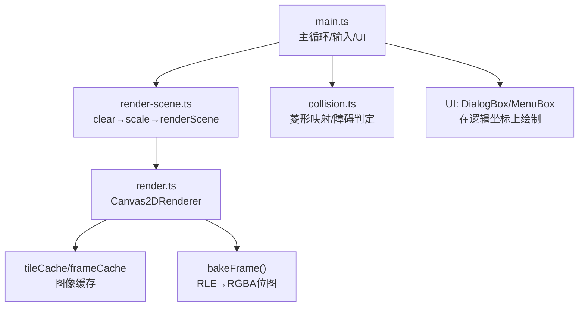
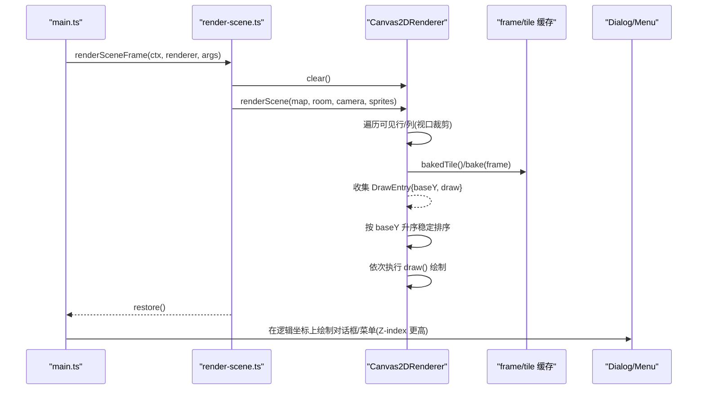
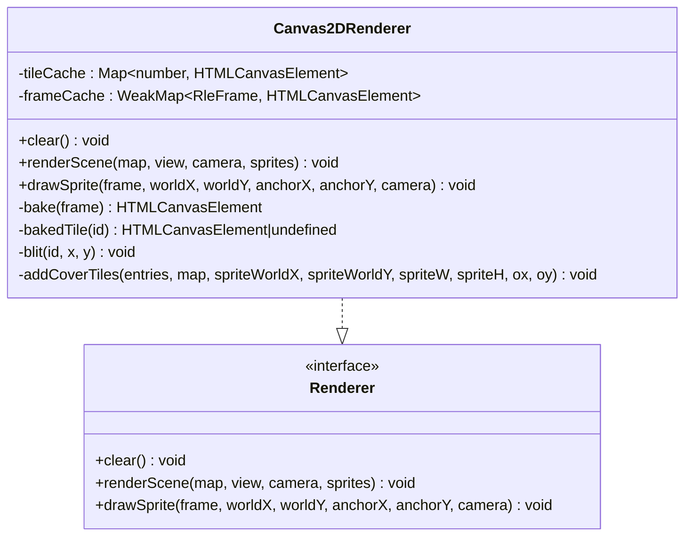
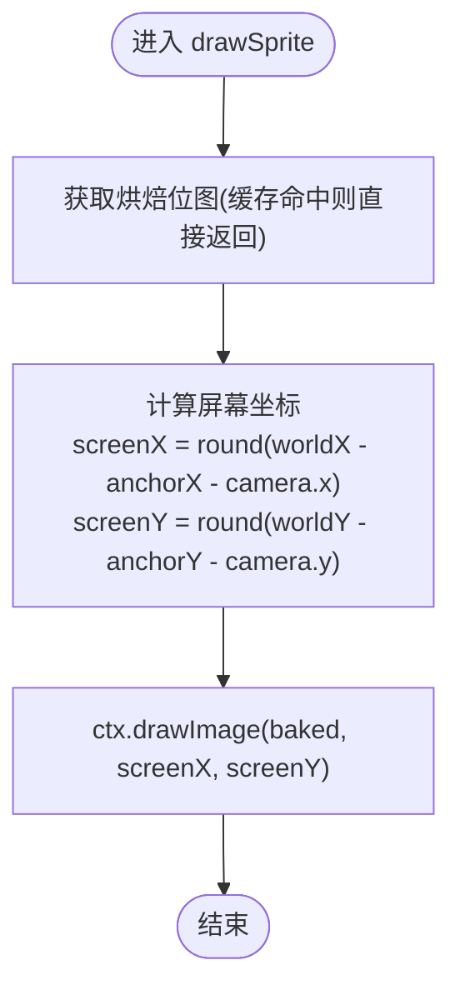
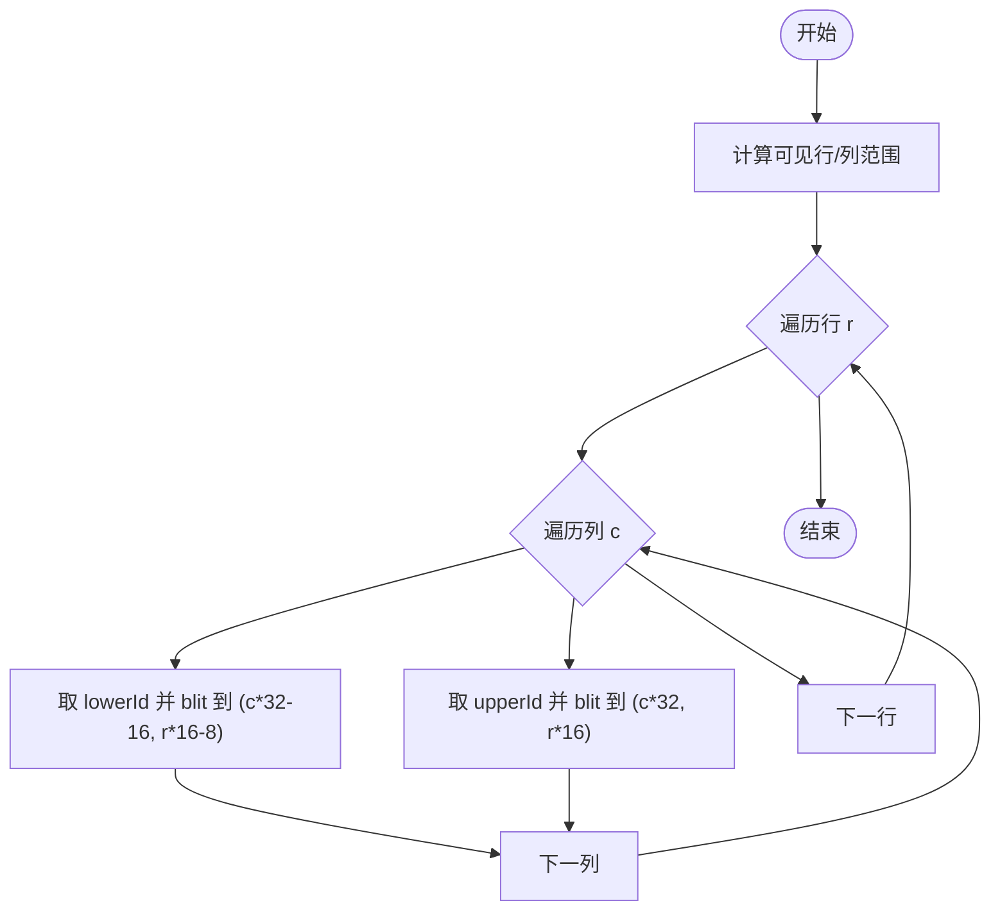
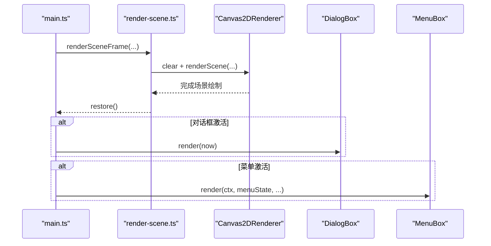
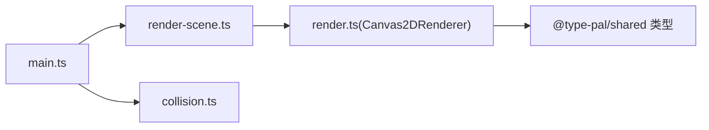

# UI 渲染引擎

<cite>
**本文引用的文件**   
- [packages/reforge/src/render.ts](file://packages/reforge/src/render.ts)
- [packages/reforge/src/render-scene.ts](file://packages/reforge/src/render-scene.ts)
- [packages/reforge/src/main.ts](file://packages/reforge/src/main.ts)
- [packages/reforge/src/collision.ts](file://packages/reforge/src/collision.ts)
- [packages/game/src/present/draw-sprite.ts](file://packages/game/src/present/draw-sprite.ts)
- [packages/game/src/present/draw-tilemap.ts](file://packages/game/src/present/draw-tilemap.ts)
- [packages/game/src/shell/main-loop.ts](file://packages/game/src/shell/main-loop.ts)
</cite>

## 目录
1. [简介](#简介)
2. [项目结构](#项目结构)
3. [核心组件](#核心组件)
4. [架构总览](#架构总览)
5. [详细组件分析](#详细组件分析)
6. [依赖关系分析](#依赖关系分析)
7. [性能考量](#性能考量)
8. [故障排查指南](#故障排查指南)
9. [结论](#结论)
10. [附录](#附录)

## 简介
本文件为 Type-Pal 第二阶段（Reforge）的 Canvas 2D UI 渲染引擎文档。重点覆盖：
- 渲染管线与图层管理：基底两层瓦片 + 精灵/高物瓦片按 baseY 深度排序，实现高度感知的遮挡。
- 精灵绘制引擎：图像缓存、锚点与脚底对齐、透明度混合策略、旋转变换扩展点。
- 地图瓦片系统：瓦片映射、视口裁剪、碰撞检测可视化。
- UI 组件层次：Z-index 管理、遮挡剔除、增量更新策略。
- 跨平台兼容与移动端适配：Canvas 2D 上下文可用性、像素化缩放、显示比例控制。
- 性能分析与调试方法：帧循环门控、调试叠加层、基准对比思路。

## 项目结构
Reforge 的渲染子系统位于 packages/reforge/src 下，核心由以下模块组成：
- render.ts：Canvas2DRenderer 实现，负责场景渲染、精灵绘制、图像缓存与深度排序。
- render-scene.ts：封装“画一帧场景”的纯函数，统一 clear/save/scale/restore 流程。
- main.ts：主循环、相机跟随、精灵组装、UI 层级绘制、调试叠加层入口。
- collision.ts：菱形网格到格坐标的映射与障碍判定，用于移动与碰撞可视化。
- game 包 present 子模块：draw-sprite.ts 与 draw-tilemap.ts 提供第一阶段（game）的像素缓冲绘制参考，便于对照行为与优化。

图表来源
- [packages/reforge/src/main.ts](file://packages/reforge/src/main.ts)
- [packages/reforge/src/render-scene.ts](file://packages/reforge/src/render-scene.ts)
- [packages/reforge/src/render.ts](file://packages/reforge/src/render.ts)
- [packages/reforge/src/collision.ts](file://packages/reforge/src/collision.ts)

章节来源
- [packages/reforge/src/main.ts](file://packages/reforge/src/main.ts)
- [packages/reforge/src/render-scene.ts](file://packages/reforge/src/render-scene.ts)
- [packages/reforge/src/render.ts](file://packages/reforge/src/render.ts)
- [packages/reforge/src/collision.ts](file://packages/reforge/src/collision.ts)

## 核心组件
- Canvas2DRenderer：实现 Renderer 接口，维护 tileCache 与 frameCache，将 RLE 帧烘焙为离屏 Canvas 并复用；按 baseY 对精灵与 cover-tile 进行深度排序，确保正确遮挡。
- renderSceneFrame：纯绘制包装器，负责 clear、save、scale(worldScale)、关闭平滑、调用 renderer.renderScene、restore。
- 精灵数据模型 SpriteDraw：包含帧、世界坐标、锚点，供渲染器计算屏幕位置与深度。
- 相机 Camera 与视口 CellRect：定义逻辑视口与相机偏移，用于瓦片与精灵的屏幕投影。

章节来源
- [packages/reforge/src/render.ts](file://packages/reforge/src/render.ts)
- [packages/reforge/src/render-scene.ts](file://packages/reforge/src/render-scene.ts)

## 架构总览
下图展示从主循环到最终像素输出的关键路径，包括场景基底、精灵与高物瓦片的深度排序以及 UI 叠加。

图表来源
- [packages/reforge/src/main.ts](file://packages/reforge/src/main.ts)
- [packages/reforge/src/render-scene.ts](file://packages/reforge/src/render-scene.ts)
- [packages/reforge/src/render.ts](file://packages/reforge/src/render.ts)

## 详细组件分析

### Canvas2DRenderer 渲染管线
- 基底两层瓦片：先画 layer0(lower)，再画 layer1(upper)。每格 lower 偏移(-16,-8)，upper 偏移(0,0)，符合等距投影。
- 精灵与高物瓦片：将精灵与可能遮挡它的“高瓦片”（cover-tile）放入同一深度表，按 baseY 升序绘制，保证堆叠高度感知遮挡。
- 视口裁剪：仅遍历 view.row..row+rows 与 view.col..col+cols 范围，减少无效绘制。
- 图像缓存：
  - frameCache：WeakMap<RleFrame, HTMLCanvasElement>，避免重复烘焙。
  - tileCache：Map<number, HTMLCanvasElement>，按瓦片 ID 缓存已烘焙位图。
- 透明度混合：通过 opaque mask 写入 RGBA 像素，透明像素不覆盖背景，实现逐像素 alpha=0 的效果。
- 旋转变换：当前未启用；可在 drawSprite 中基于 ctx.save()/ctx.translate()/ctx.rotate()/ctx.drawImage()/ctx.restore() 扩展。

图表来源
- [packages/reforge/src/render.ts](file://packages/reforge/src/render.ts)

章节来源
- [packages/reforge/src/render.ts](file://packages/reforge/src/render.ts)

### 精灵绘制引擎
- 锚点与脚底对齐：精灵以 anchorX/anchorY 指定脚部中心，确保不同高度的帧在同一“脚底”对齐，避免攀爬动画错位。
- 透明度混合：opaque mask 决定像素是否写入，idx=0 仍可为不透明像素（palette index 0 合法）。
- 缩放算法：使用 Canvas 最近邻（imageSmoothingEnabled=false），整数倍放大保持点阵锐利。
- 旋转变换：可通过 drawSprite 扩展，注意先 translate 到锚点，再 rotate，最后 drawImage。

图表来源
- [packages/reforge/src/render.ts](file://packages/reforge/src/render.ts)
- [packages/game/src/present/draw-sprite.ts](file://packages/game/src/present/draw-sprite.ts)

章节来源
- [packages/reforge/src/render.ts](file://packages/reforge/src/render.ts)
- [packages/game/src/present/draw-sprite.ts](file://packages/game/src/present/draw-sprite.ts)

### 地图瓦片渲染系统
- 瓦片映射：lower(h=0) 画在 (col*32-16, row*16-8)，upper(h=1) 画在 (col*32, row*16)。
- 视口裁剪：仅绘制可见行列，且整行/整列可快速跳过。
- 碰撞检测可视化：菱形四分法将像素映射到格与子行，结合障碍位 bit 13(0x2000) 判断阻挡；调试模式在画面上叠加菱形网格与可走/禁入点。

图表来源
- [packages/reforge/src/render.ts](file://packages/reforge/src/render.ts)
- [packages/game/src/present/draw-tilemap.ts](file://packages/game/src/present/draw-tilemap.ts)
- [packages/reforge/src/collision.ts](file://packages/reforge/src/collision.ts)

章节来源
- [packages/reforge/src/render.ts](file://packages/reforge/src/render.ts)
- [packages/game/src/present/draw-tilemap.ts](file://packages/game/src/present/draw-tilemap.ts)
- [packages/reforge/src/collision.ts](file://packages/reforge/src/collision.ts)

### UI 组件的渲染层次结构
- Z-index 管理：场景基底 → 精灵/高物瓦片 → 对话框 → 菜单 → 提示。通过绘制顺序实现层级。
- 遮挡剔除：场景层已做视口裁剪；UI 层在逻辑坐标上绘制，配合 save/scale/restore 隔离变换。
- 增量更新：菜单/对话框仅在 active 时重绘；保存浏览界面打开时抓取上一帧缩略图作为背景，避免全量重绘。

图表来源
- [packages/reforge/src/main.ts](file://packages/reforge/src/main.ts)
- [packages/reforge/src/render-scene.ts](file://packages/reforge/src/render-scene.ts)
- [packages/reforge/src/render.ts](file://packages/reforge/src/render.ts)

章节来源
- [packages/reforge/src/main.ts](file://packages/reforge/src/main.ts)
- [packages/reforge/src/render-scene.ts](file://packages/reforge/src/render-scene.ts)

### 自定义渲染器与视觉效果示例
- 创建自定义渲染器：实现 Renderer 接口，提供 clear、renderScene、drawSprite。可在 renderScene 内接入批处理（如合并相同纹理的 drawImage 调用）。
- 添加旋转效果：在 drawSprite 中于锚点处应用 ctx.rotate，注意先 translate 到锚点，再 rotate，最后 drawImage。
- 批处理优化：将同帧/同瓦片连续绘制合并，减少状态切换；或使用离屏 Canvas 预合成复杂组合。

章节来源
- [packages/reforge/src/render.ts](file://packages/reforge/src/render.ts)

## 依赖关系分析
- main.ts 依赖 render-scene.ts 与 Canvas2DRenderer，同时集成 UI 组件与碰撞可视化。
- render-scene.ts 仅依赖 Renderer 接口与 Tilemap/Camera/SpriteDraw 类型，保持纯函数特性，便于编辑器复用。
- Canvas2DRenderer 依赖 Palette、RleFrame、Tilemap 等共享类型，内部使用浏览器 Canvas API。
- collision.ts 提供菱形映射与障碍判定，被 main.ts 的交互与调试层使用。

图表来源
- [packages/reforge/src/main.ts](file://packages/reforge/src/main.ts)
- [packages/reforge/src/render-scene.ts](file://packages/reforge/src/render-scene.ts)
- [packages/reforge/src/render.ts](file://packages/reforge/src/render.ts)
- [packages/reforge/src/collision.ts](file://packages/reforge/src/collision.ts)

章节来源
- [packages/reforge/src/main.ts](file://packages/reforge/src/main.ts)
- [packages/reforge/src/render-scene.ts](file://packages/reforge/src/render-scene.ts)
- [packages/reforge/src/render.ts](file://packages/reforge/src/render.ts)
- [packages/reforge/src/collision.ts](file://packages/reforge/src/collision.ts)

## 性能考量
- 图像缓存：frameCache 与 tileCache 显著降低 RLE 解码与 ImageData 写入开销。
- 视口裁剪：仅绘制可见区域，避免全屏扫描。
- 深度排序：按 baseY 稳定排序，减少覆盖错误导致的额外重绘。
- 最近邻缩放：关闭 imageSmoothingEnabled，整数倍放大保持清晰度。
- 帧循环门控：第一阶段 game 包的 main-loop.ts 在淡出/战斗动画期间强制 per-rAF present，避免动画抖动；Reforge 当前以 requestAnimationFrame 驱动主循环，建议在未来引入类似门控以保证过渡动画流畅。

章节来源
- [packages/reforge/src/render.ts](file://packages/reforge/src/render.ts)
- [packages/game/src/shell/main-loop.ts](file://packages/game/src/shell/main-loop.ts)

## 故障排查指南
- Canvas 2D 不可用：若 getContext('2d') 失败，会抛出错误。检查运行环境与浏览器兼容性。
- 精灵错位：确认每帧 anchorX/anchorY 基于自身宽高设置，避免整组共用首帧尺寸导致脚底溢出。
- 遮挡异常：检查 cover-tile 的 baseY 计算与排序稳定性；确保高物瓦片参与深度表。
- 模糊或锯齿：确认 imageSmoothingEnabled=false 且 worldScale 为整数倍。
- 碰撞误判：核对菱形映射公式与障碍位 0x2000；使用 ?collision 参数查看可视化叠加层。

章节来源
- [packages/reforge/src/render.ts](file://packages/reforge/src/render.ts)
- [packages/game/src/present/draw-sprite.ts](file://packages/game/src/present/draw-sprite.ts)
- [packages/reforge/src/collision.ts](file://packages/reforge/src/collision.ts)
- [packages/reforge/src/main.ts](file://packages/reforge/src/main.ts)

## 结论
Reforge 的 Canvas 2D 渲染引擎以清晰的职责划分与稳定的深度排序为核心，实现了高度感知的遮挡、高效的图像缓存与直观的 UI 层级管理。通过视口裁剪与最近邻缩放，兼顾了性能与画质。未来可在批处理、GPU 加速与更细粒度的增量更新方面继续优化。

## 附录
- 跨平台兼容与移动端适配要点：
  - 始终检查 Canvas 2D 上下文可用性。
  - 使用整数倍 worldScale 与关闭平滑，确保点阵清晰。
  - 在移动端考虑触摸事件与虚拟摇杆输入（当前 main.ts 使用键盘输入，可扩展）。
  - 显示比例控制：通过 localStorage 持久化显示百分比，支持 10%~1000% 范围。

章节来源
- [packages/reforge/src/main.ts](file://packages/reforge/src/main.ts)