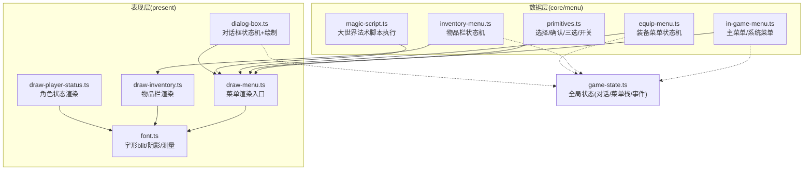
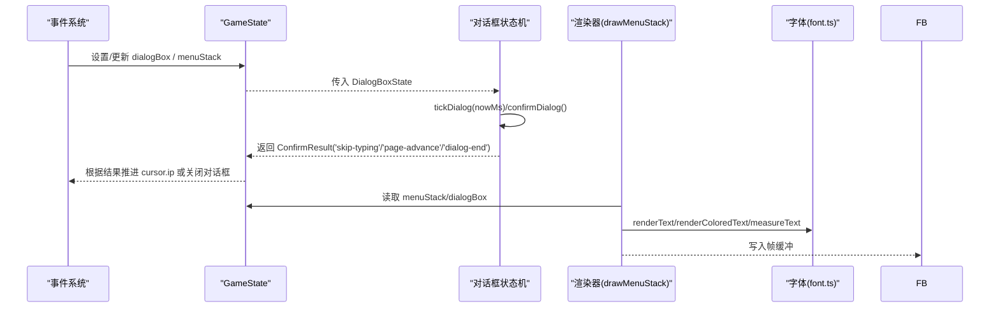
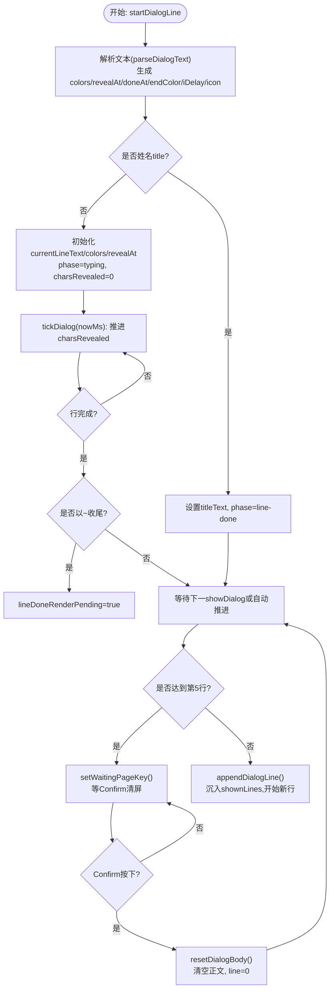
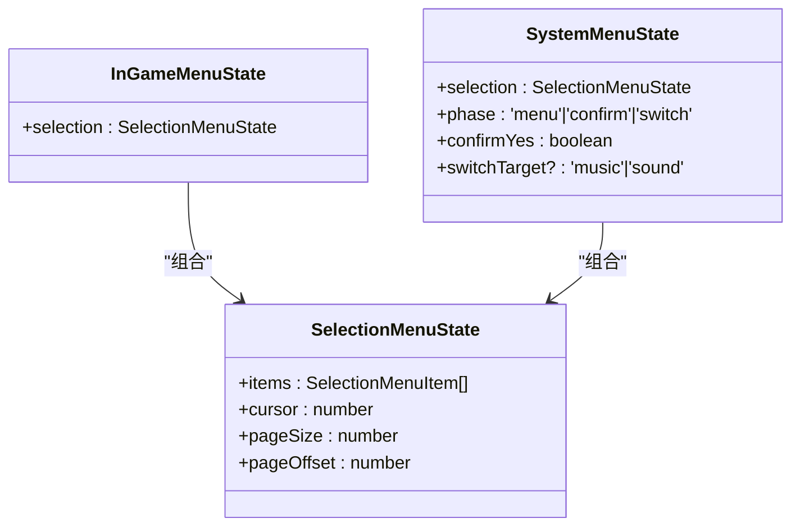
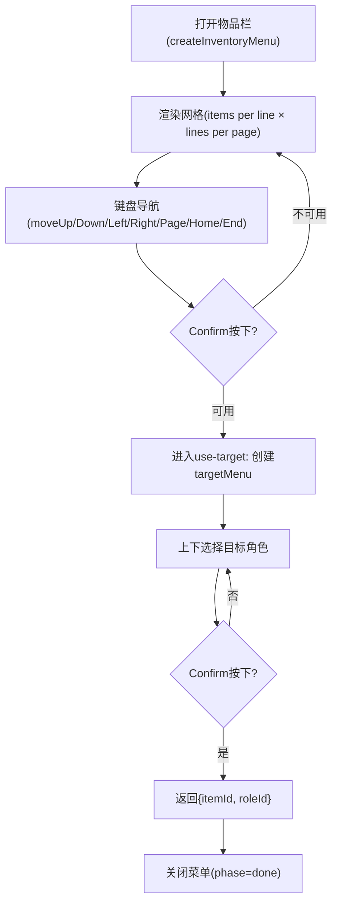
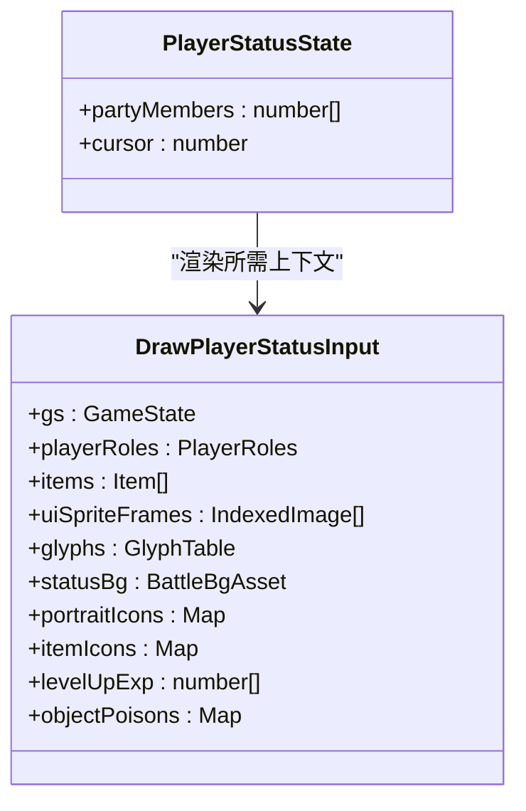
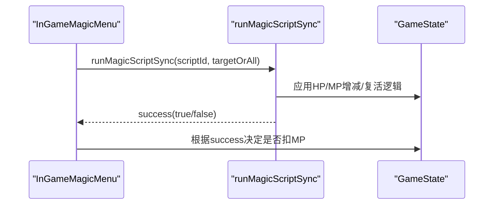
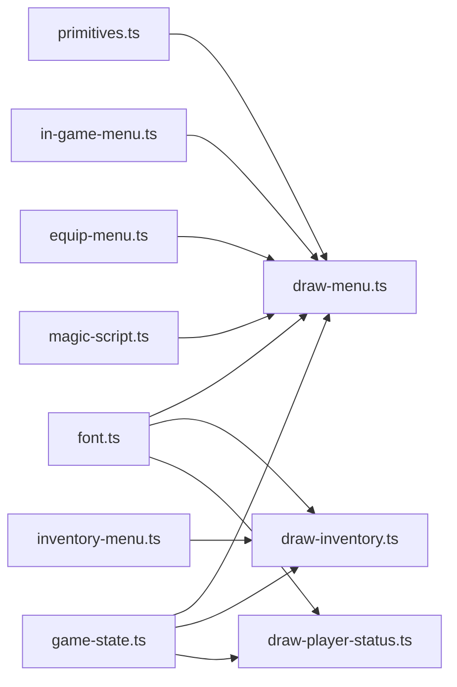

# UI 组件系统

<cite>
**本文引用的文件**   
- [packages/game/src/present/dialog-box.ts](file://packages/game/src/present/dialog-box.ts)
- [packages/game/src/core/menu/in-game-menu.ts](file://packages/game/src/core/menu/in-game-menu.ts)
- [packages/game/src/core/menu/primitives.ts](file://packages/game/src/core/menu/primitives.ts)
- [packages/game/src/core/menu/inventory-menu.ts](file://packages/game/src/core/menu/inventory-menu.ts)
- [packages/game/src/core/menu/equip-menu.ts](file://packages/game/src/core/menu/equip-menu.ts)
- [packages/game/src/present/menu/draw-menu.ts](file://packages/game/src/present/menu/draw-menu.ts)
- [packages/game/src/present/menu/draw-inventory.ts](file://packages/game/src/present/menu/draw-inventory.ts)
- [packages/game/src/present/menu/draw-player-status.ts](file://packages/game/src/present/menu/draw-player-status.ts)
- [packages/game/src/present/font.ts](file://packages/game/src/present/font.ts)
- [packages/game/src/core/game-state.ts](file://packages/game/src/core/game-state.ts)
- [packages/game/src/core/menu/magic-script.ts](file://packages/game/src/core/menu/magic-script.ts)
</cite>

## 目录
1. [简介](#简介)
2. [项目结构](#项目结构)
3. [核心组件](#核心组件)
4. [架构总览](#架构总览)
5. [详细组件分析](#详细组件分析)
6. [依赖关系分析](#依赖关系分析)
7. [性能与可访问性](#性能与可访问性)
8. [故障排查指南](#故障排查指南)
9. [结论](#结论)
10. [附录：扩展与自定义示例](#附录扩展与自定义示例)

## 简介
本文件系统化梳理 Type-Pal 的 UI 组件体系，重点覆盖对话框系统与菜单界面。文档面向开发者与策划人员，既提供代码级实现细节，也给出可视化图示与最佳实践，帮助快速理解并扩展 UI 子系统。

## 项目结构
UI 子系统按“数据状态 + 渲染”分层组织：
- 数据层（core/menu）：维护菜单/对话框的状态机、输入处理与业务规则。
- 表现层（present/*）：将状态绘制到帧缓冲，负责字体、精灵、数字等像素级绘制。
- 全局状态（core/game-state.ts）：集中持有对话框、菜单栈、事件游标等运行时上下文。

图表来源
- [packages/game/src/present/dialog-box.ts:1-120](file://packages/game/src/present/dialog-box.ts#L1-L120)
- [packages/game/src/core/menu/in-game-menu.ts:1-130](file://packages/game/src/core/menu/in-game-menu.ts#L1-L130)
- [packages/game/src/core/menu/primitives.ts:1-177](file://packages/game/src/core/menu/primitives.ts#L1-L177)
- [packages/game/src/core/menu/inventory-menu.ts:1-120](file://packages/game/src/core/menu/inventory-menu.ts#L1-L120)
- [packages/game/src/core/menu/equip-menu.ts:1-112](file://packages/game/src/core/menu/equip-menu.ts#L1-L112)
- [packages/game/src/present/menu/draw-menu.ts:1-120](file://packages/game/src/present/menu/draw-menu.ts#L1-L120)
- [packages/game/src/present/menu/draw-inventory.ts:1-120](file://packages/game/src/present/menu/draw-inventory.ts#L1-L120)
- [packages/game/src/present/menu/draw-player-status.ts:1-120](file://packages/game/src/present/menu/draw-player-status.ts#L1-L120)
- [packages/game/src/present/font.ts:1-120](file://packages/game/src/present/font.ts#L1-L120)
- [packages/game/src/core/game-state.ts:345-496](file://packages/game/src/core/game-state.ts#L345-L496)

章节来源
- [packages/game/src/present/dialog-box.ts:1-120](file://packages/game/src/present/dialog-box.ts#L1-L120)
- [packages/game/src/core/menu/in-game-menu.ts:1-130](file://packages/game/src/core/menu/in-game-menu.ts#L1-L130)
- [packages/game/src/core/menu/primitives.ts:1-177](file://packages/game/src/core/menu/primitives.ts#L1-L177)
- [packages/game/src/core/menu/inventory-menu.ts:1-120](file://packages/game/src/core/menu/inventory-menu.ts#L1-L120)
- [packages/game/src/core/menu/equip-menu.ts:1-112](file://packages/game/src/core/menu/equip-menu.ts#L1-L112)
- [packages/game/src/present/menu/draw-menu.ts:1-120](file://packages/game/src/present/menu/draw-menu.ts#L1-L120)
- [packages/game/src/present/menu/draw-inventory.ts:1-120](file://packages/game/src/present/menu/draw-inventory.ts#L1-L120)
- [packages/game/src/present/menu/draw-player-status.ts:1-120](file://packages/game/src/present/menu/draw-player-status.ts#L1-L120)
- [packages/game/src/present/font.ts:1-120](file://packages/game/src/present/font.ts#L1-L120)
- [packages/game/src/core/game-state.ts:345-496](file://packages/game/src/core/game-state.ts#L345-L496)

## 核心组件
- 对话框系统：包含文本解析、逐字打字、光标控制、自动播放与翻页逻辑，严格对齐 sdlpal text.c 行为。
- 菜单系统：主菜单、系统菜单、物品栏、装备、角色状态、商店等，采用 primitives 抽象统一导航与选择。
- 状态管理：通过 GameState 集中持有 dialogBox、menuStack、eventCursor 等，驱动交互与渲染。
- 文本渲染：基于 GlyphTable 的字形 blit，支持阴影、逐字符上色、宽度测量。

章节来源
- [packages/game/src/present/dialog-box.ts:1-120](file://packages/game/src/present/dialog-box.ts#L1-L120)
- [packages/game/src/core/menu/primitives.ts:1-177](file://packages/game/src/core/menu/primitives.ts#L1-L177)
- [packages/game/src/present/font.ts:1-120](file://packages/game/src/present/font.ts#L1-L120)
- [packages/game/src/core/game-state.ts:345-496](file://packages/game/src/core/game-state.ts#L345-L496)

## 架构总览
下图展示 UI 子系统在运行时的关键交互：事件系统推进对话、对话框状态机驱动打字与翻页、菜单栈承载各子菜单、渲染层根据状态绘制。

图表来源
- [packages/game/src/present/dialog-box.ts:453-562](file://packages/game/src/present/dialog-box.ts#L453-L562)
- [packages/game/src/present/menu/draw-menu.ts:101-120](file://packages/game/src/present/menu/draw-menu.ts#L101-L120)
- [packages/game/src/present/font.ts:105-165](file://packages/game/src/present/font.ts#L105-L165)
- [packages/game/src/core/game-state.ts:655-740](file://packages/game/src/core/game-state.ts#L655-L740)

## 详细组件分析

### 对话框系统
- 文本解析与控制符
  - 支持颜色切换、打字速度、行尾暂停、图标提示、转义等控制符；解析为可见文本、逐字符色、出现时刻与行末状态。
- 打字与自动播放
  - 使用墙钟 nowMs 驱动逐字显示，避免旧版“每 100ms 蹦字成块”的问题；支持用户快进与 `~NN` 尾停顿保留。
- 光标与翻页
  - 单行打完自动推进下一行；累计 4 行后进入等待页键；整段结束等待结束键；支持 setDialogStyleX 切换样式与头像布局。
- 绘制与布局
  - 支持 top/bottom/center/narration/item-box 多种样式；标题行独立位置与颜色；等键箭头按真值条件显示与闪烁。

图表来源
- [packages/game/src/present/dialog-box.ts:98-145](file://packages/game/src/present/dialog-box.ts#L98-L145)
- [packages/game/src/present/dialog-box.ts:257-374](file://packages/game/src/present/dialog-box.ts#L257-L374)
- [packages/game/src/present/dialog-box.ts:376-451](file://packages/game/src/present/dialog-box.ts#L376-L451)
- [packages/game/src/present/dialog-box.ts:453-562](file://packages/game/src/present/dialog-box.ts#L453-L562)

章节来源
- [packages/game/src/present/dialog-box.ts:1-120](file://packages/game/src/present/dialog-box.ts#L1-L120)
- [packages/game/src/present/dialog-box.ts:98-145](file://packages/game/src/present/dialog-box.ts#L98-L145)
- [packages/game/src/present/dialog-box.ts:257-374](file://packages/game/src/present/dialog-box.ts#L257-L374)
- [packages/game/src/present/dialog-box.ts:376-451](file://packages/game/src/present/dialog-box.ts#L376-L451)
- [packages/game/src/present/dialog-box.ts:453-562](file://packages/game/src/present/dialog-box.ts#L453-L562)
- [packages/game/src/core/game-state.ts:345-496](file://packages/game/src/core/game-state.ts#L345-L496)

### 菜单系统（主菜单/系统菜单）
- 数据结构
  - 使用 SelectionMenuState 统一管理列表项、光标、分页偏移；支持向上/向下移动与翻页。
- 主菜单
  - 四项：状态/法术/物品/系统；box 与 item 起始坐标严格对齐 sdlpal 真值；选中项闪烁色由时间驱动。
- 系统菜单
  - 五项：存档/读档/音乐/音效/退出；支持二次确认与开关切换子菜单。

图表来源
- [packages/game/src/core/menu/primitives.ts:14-68](file://packages/game/src/core/menu/primitives.ts#L14-L68)
- [packages/game/src/core/menu/in-game-menu.ts:49-97](file://packages/game/src/core/menu/in-game-menu.ts#L49-L97)

章节来源
- [packages/game/src/core/menu/primitives.ts:1-177](file://packages/game/src/core/menu/primitives.ts#L1-L177)
- [packages/game/src/core/menu/in-game-menu.ts:1-130](file://packages/game/src/core/menu/in-game-menu.ts#L1-L130)
- [packages/game/src/present/menu/draw-menu.ts:260-316](file://packages/game/src/present/menu/draw-menu.ts#L260-L316)

### 物品栏与装备菜单
- 物品栏
  - 全屏网格布局，列数/行数/单元格宽度严格对齐 sdlpal；支持 Up/Down/Left/Right/PgUp/PgDn/Home/End 导航；确认时若可用则进入目标选择。
  - 颜色规则：选中/未选中、可用/不可用、已装备分别对应不同色与闪烁。
- 装备菜单
  - 复用物品栏 grid 与导航；确认后进入 pick-role 阶段，循环选择队员；最终交由脚本执行装备交换。

图表来源
- [packages/game/src/core/menu/inventory-menu.ts:114-154](file://packages/game/src/core/menu/inventory-menu.ts#L114-L154)
- [packages/game/src/core/menu/inventory-menu.ts:167-215](file://packages/game/src/core/menu/inventory-menu.ts#L167-L215)
- [packages/game/src/core/menu/inventory-menu.ts:219-275](file://packages/game/src/core/menu/inventory-menu.ts#L219-L275)
- [packages/game/src/core/menu/equip-menu.ts:43-97](file://packages/game/src/core/menu/equip-menu.ts#L43-L97)

章节来源
- [packages/game/src/core/menu/inventory-menu.ts:1-275](file://packages/game/src/core/menu/inventory-menu.ts#L1-L275)
- [packages/game/src/core/menu/equip-menu.ts:1-112](file://packages/game/src/core/menu/equip-menu.ts#L1-L112)
- [packages/game/src/present/menu/draw-inventory.ts:244-348](file://packages/game/src/present/menu/draw-inventory.ts#L244-L348)

### 角色状态界面
- 全屏布局：背景、头像、装备槽、属性标签与数值、经验/等级、HP/MP、五维属性、中毒信息。
- 数值计算：基础值 + 装备效果叠加，严格对齐 sdlpal 获取有效属性的方式。

图表来源
- [packages/game/src/present/menu/draw-player-status.ts:133-155](file://packages/game/src/present/menu/draw-player-status.ts#L133-L155)

章节来源
- [packages/game/src/present/menu/draw-player-status.ts:1-271](file://packages/game/src/present/menu/draw-player-status.ts#L1-L271)

### 大世界法术脚本执行
- 同步 runner：仅处理纯数据 opcode（如 HP/MP 增减、复活），不阻塞主循环。
- 成功判定：无活 target 复活时返回失败，上层据此决定是否扣 MP。

图表来源
- [packages/game/src/core/menu/magic-script.ts:118-220](file://packages/game/src/core/menu/magic-script.ts#L118-L220)

章节来源
- [packages/game/src/core/menu/magic-script.ts:1-252](file://packages/game/src/core/menu/magic-script.ts#L1-L252)

## 依赖关系分析
- 模块耦合
  - 渲染层 draw-menu.ts 聚合所有菜单绘制，依赖 primitives 与具体菜单 state。
  - 对话框与菜单均依赖 font.ts 进行文本绘制与测量。
  - 全局状态 game-state.ts 作为单一真相源，被数据层与表现层共同消费。
- 外部依赖
  - 资源：SPRITEUI、RGM 头像、BALL 图标、LevelUpExp 表等通过 extra ctx 注入。
  - 输入：事件系统通过 gs.eventCursor 与 waiting 字段协调 UI 阻塞与恢复。

图表来源
- [packages/game/src/present/font.ts:1-120](file://packages/game/src/present/font.ts#L1-L120)
- [packages/game/src/present/menu/draw-menu.ts:1-120](file://packages/game/src/present/menu/draw-menu.ts#L1-L120)
- [packages/game/src/present/menu/draw-inventory.ts:1-120](file://packages/game/src/present/menu/draw-inventory.ts#L1-L120)
- [packages/game/src/present/menu/draw-player-status.ts:1-120](file://packages/game/src/present/menu/draw-player-status.ts#L1-L120)
- [packages/game/src/core/menu/primitives.ts:1-177](file://packages/game/src/core/menu/primitives.ts#L1-L177)
- [packages/game/src/core/menu/in-game-menu.ts:1-130](file://packages/game/src/core/menu/in-game-menu.ts#L1-L130)
- [packages/game/src/core/menu/inventory-menu.ts:1-120](file://packages/game/src/core/menu/inventory-menu.ts#L1-L120)
- [packages/game/src/core/menu/equip-menu.ts:1-112](file://packages/game/src/core/menu/equip-menu.ts#L1-L112)
- [packages/game/src/core/menu/magic-script.ts:1-120](file://packages/game/src/core/menu/magic-script.ts#L1-L120)
- [packages/game/src/core/game-state.ts:655-740](file://packages/game/src/core/game-state.ts#L655-L740)

章节来源
- [packages/game/src/present/font.ts:1-120](file://packages/game/src/present/font.ts#L1-L120)
- [packages/game/src/present/menu/draw-menu.ts:1-120](file://packages/game/src/present/menu/draw-menu.ts#L1-L120)
- [packages/game/src/present/menu/draw-inventory.ts:1-120](file://packages/game/src/present/menu/draw-inventory.ts#L1-L120)
- [packages/game/src/present/menu/draw-player-status.ts:1-120](file://packages/game/src/present/menu/draw-player-status.ts#L1-L120)
- [packages/game/src/core/menu/primitives.ts:1-177](file://packages/game/src/core/menu/primitives.ts#L1-L177)
- [packages/game/src/core/menu/in-game-menu.ts:1-130](file://packages/game/src/core/menu/in-game-menu.ts#L1-L130)
- [packages/game/src/core/menu/inventory-menu.ts:1-120](file://packages/game/src/core/menu/inventory-menu.ts#L1-L120)
- [packages/game/src/core/menu/equip-menu.ts:1-112](file://packages/game/src/core/menu/equip-menu.ts#L1-L112)
- [packages/game/src/core/menu/magic-script.ts:1-120](file://packages/game/src/core/menu/magic-script.ts#L1-L120)
- [packages/game/src/core/game-state.ts:655-740](file://packages/game/src/core/game-state.ts#L655-L740)

## 性能与可访问性
- 性能
  - 打字进度改用 wall-clock 驱动，避免 10fps tick 导致的“成块蹦字”，提升流畅度。
  - 菜单闪烁色基于 Date.now()/100 取模，开销极低。
  - 描述文本按需渲染，卖/买菜单禁用描述以减少绘制。
- 可访问性
  - 全键盘导航：方向键、翻页、Home/End 全覆盖；确认/取消语义清晰。
  - 高对比与阴影文本增强可读性；等键箭头明确提示交互点。
- 跨平台兼容
  - 字体加载通过 fetch glyphs.json，浏览器环境需确保路径正确；缺失字形回退 tofu 占位。
  - 数字绘制使用 sprite-based 数字，保证在不同分辨率下对齐一致。

[本节为通用指导，无需列出章节来源]

## 故障排查指南
- 对话框问题
  - 症状：打字卡顿、翻页异常、结尾无箭头。
  - 排查：检查 nowMs 是否正确注入 tickDialog；确认 shouldWaitPageKey 与 confirmDialog 返回值分支；核对 endedWithTilde 与 lineDoneRenderPending 时序。
- 菜单导航异常
  - 症状：光标越界、禁用项不可停、翻页错位。
  - 排查：确认 moveSelectionUp/Down 与 ensureCursorVisible 逻辑；翻页使用 findNextSelectable 定位可选项；校验 pageSize 与 items.length。
- 物品栏颜色错误
  - 症状：可装备/可使用项颜色不符合预期。
  - 排查：pickItemRowColor 的 isSelected/isUsable/isEquipped 判断；确认 matchesFilter 与 filter 参数；数量 diff 计算。
- 角色状态数值不对
  - 症状：属性未含装备加成。
  - 排查：确认 getPlayerAttackStrength 等 getter 是否接入 equip-effect；检查 rgwEquipment 与 rgEquipmentEffect 叠加。

章节来源
- [packages/game/src/present/dialog-box.ts:453-562](file://packages/game/src/present/dialog-box.ts#L453-L562)
- [packages/game/src/core/menu/primitives.ts:75-128](file://packages/game/src/core/menu/primitives.ts#L75-L128)
- [packages/game/src/core/menu/inventory-menu.ts:75-91](file://packages/game/src/core/menu/inventory-menu.ts#L75-L91)
- [packages/game/src/present/menu/draw-player-status.ts:99-119](file://packages/game/src/present/menu/draw-player-status.ts#L99-L119)

## 结论
Type-Pal 的 UI 子系统以“数据状态 + 渲染”分层为核心，严格对齐 sdlpal 真值，实现了高保真的对话框与菜单体验。通过 primitives 抽象与统一的渲染入口，新增菜单与对话框组件具备良好可扩展性与可测试性。未来可在可访问性（屏幕阅读器支持）、多语言动态化、以及移动端触控适配方面继续深化。

[本节为总结，无需列出章节来源]

## 附录：扩展与自定义示例
- 创建新菜单组件
  - 定义状态接口与创建函数（参考 in-game-menu.ts 的 createInGameMenu）。
  - 在 draw-menu.ts 的 drawMenuEntry 中新增 case，调用对应绘制函数。
  - 在 GameState.menuStack 中 push/pop 该菜单条目。
- 自定义菜单样式
  - 调整 box 坐标与行高（参考 draw-menu.ts 中的 IN_GAME_MENU_BOX/SYSTEM_MENU_BOX）。
  - 修改选中闪烁色与文本阴影（selectedColor 与 renderText fShadow）。
- 绑定游戏状态
  - 从 GameState 读取必要数据（如 dwCash、PlayerRolesRuntime、inventory）。
  - 在输入处理中更新 menuStack 与 eventCursor.waiting，确保交互与脚本推进一致。
- 处理用户输入事件
  - 使用 primitives 的 moveSelectionUp/Down/pageUp/pageDown 处理导航。
  - 在 confirm/cancel 分支中更新菜单 phase 与返回结果，驱动上层逻辑。

章节来源
- [packages/game/src/core/menu/in-game-menu.ts:57-97](file://packages/game/src/core/menu/in-game-menu.ts#L57-L97)
- [packages/game/src/present/menu/draw-menu.ts:113-256](file://packages/game/src/present/menu/draw-menu.ts#L113-L256)
- [packages/game/src/core/game-state.ts:680-740](file://packages/game/src/core/game-state.ts#L680-L740)
- [packages/game/src/core/menu/primitives.ts:89-128](file://packages/game/src/core/menu/primitives.ts#L89-L128)