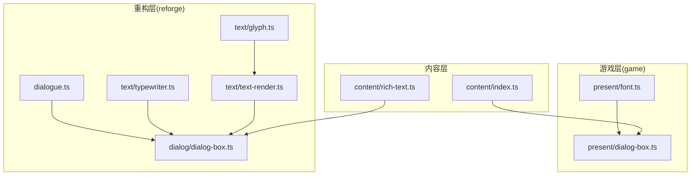
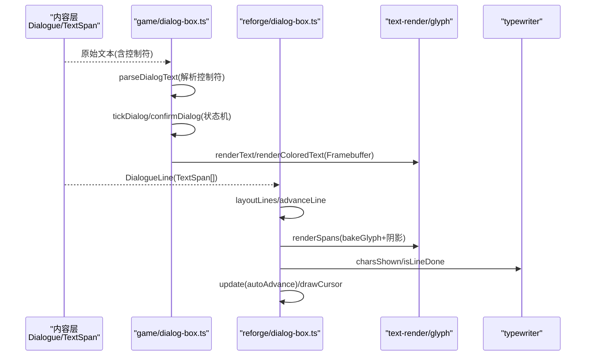
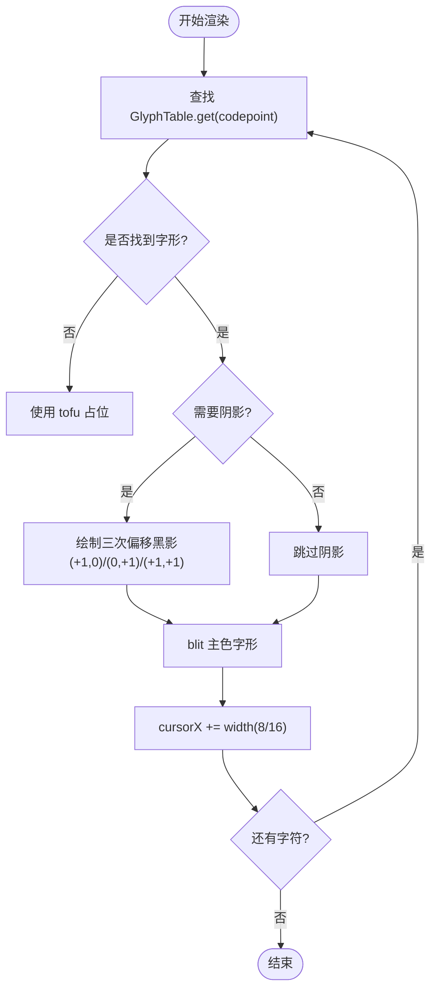
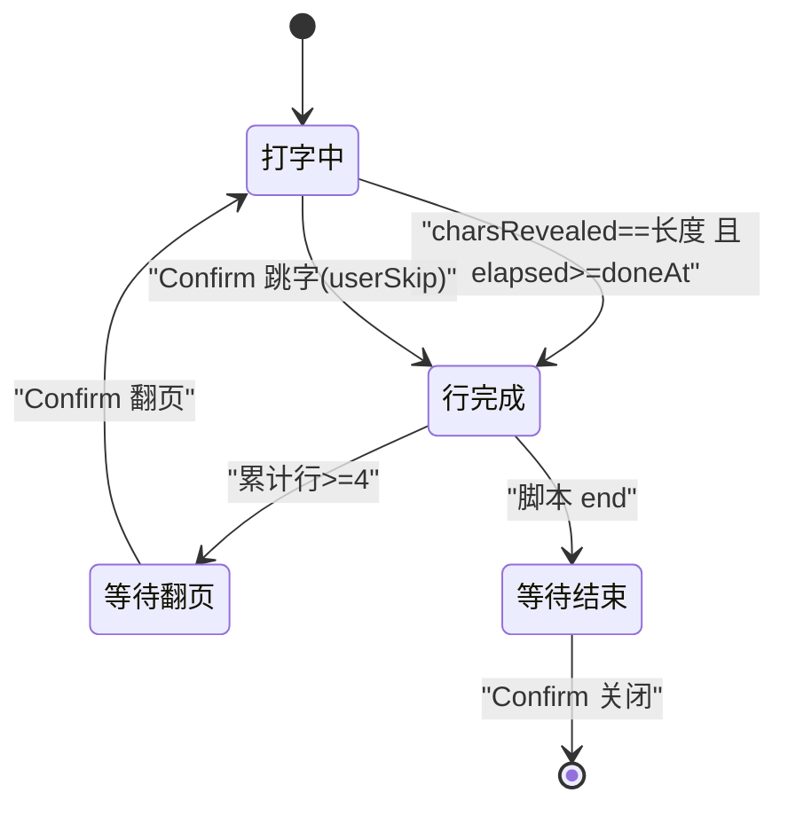
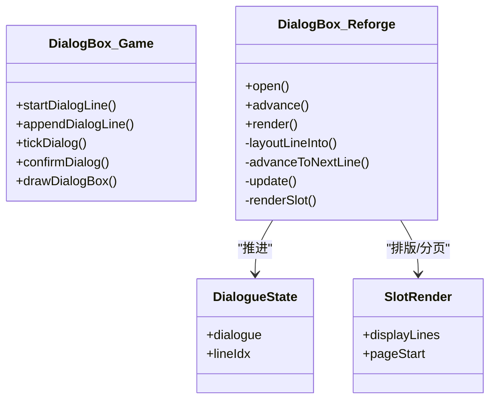
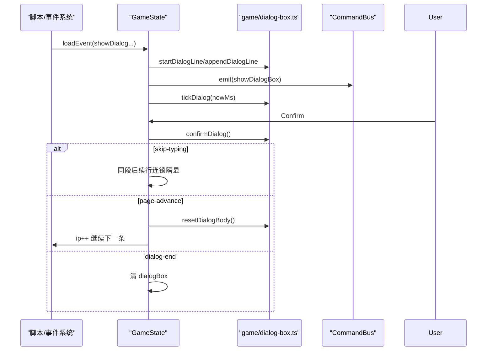
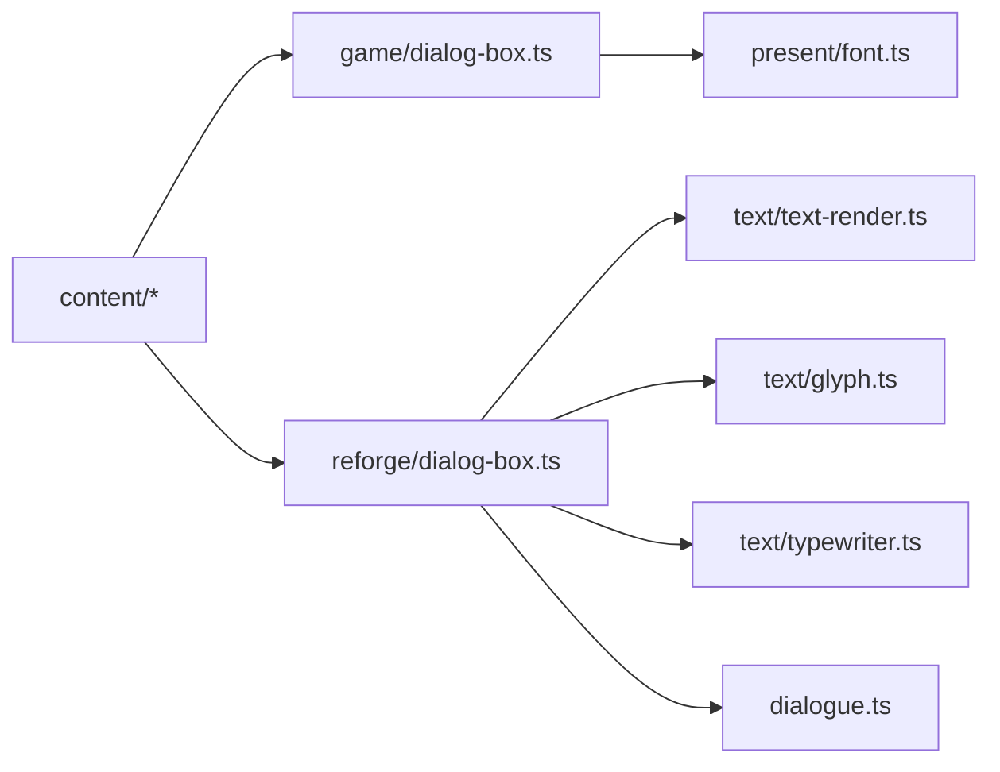

# 对话框系统

<cite>
**本文引用的文件**   
- [packages/game/src/present/dialog-box.ts](file://packages/game/src/present/dialog-box.ts)
- [packages/game/src/present/font.ts](file://packages/game/src/present/font.ts)
- [packages/reforge/src/dialog/dialog-box.ts](file://packages/reforge/src/dialog/dialog-box.ts)
- [packages/reforge/src/text/glyph.ts](file://packages/reforge/src/text/glyph.ts)
- [packages/reforge/src/text/text-render.ts](file://packages/reforge/src/text/text-render.ts)
- [packages/reforge/src/text/typewriter.ts](file://packages/reforge/src/text/typewriter.ts)
- [packages/content/src/index.ts](file://packages/content/src/index.ts)
- [packages/content/src/rich-text.ts](file://packages/content/src/rich-text.ts)
- [packages/reforge/src/dialogue.ts](file://packages/reforge/src/dialogue.ts)
- [packages/game/src/core/dialog-bug2-skip.test.ts](file://packages/game/src/core/dialog-bug2-skip.test.ts)
- [packages/game/src/core/event-system.test.ts](file://packages/game/src/core/event-system.test.ts)
- [docs/phase2/dialogue/visual-design.md](file://docs/phase2/dialogue/visual-design.md)
</cite>

## 目录
1. [简介](#简介)
2. [项目结构](#项目结构)
3. [核心组件](#核心组件)
4. [架构总览](#架构总览)
5. [详细组件分析](#详细组件分析)
6. [依赖关系分析](#依赖关系分析)
7. [性能与内存优化](#性能与内存优化)
8. [故障排查指南](#故障排查指南)
9. [结论](#结论)
10. [附录：示例与最佳实践](#附录示例与最佳实践)

## 简介
本文件为 Type-Pal 的对话框系统提供系统化、可落地的技术文档。内容覆盖两套实现路径：
- game 层（基于 Framebuffer 的 SDL 风格实现）：忠实还原 sdlpal text.c 的行为，包括控制符解析、逐字打字、翻页等键、自动推进、头像与姓名牌布局、narration 居中提示框等。
- reforge 层（Canvas2D 适配）：以 TextSpan + layoutLines 的富文本管线为核心，支持多槽（top/bottom）共存、分页、自动播放、光标动画、头像渲染等。

重点说明：
- 文本渲染引擎：字模加载、解码、阴影、逐字符上色、数字 sprite 绘制。
- 字符编码处理：按 code point 遍历，CJK 全宽/ASCII 半宽宽度计算，tofu 占位。
- 字体渲染优化：离屏 canvas 缓存、bakeGlyph、measureSpans 预测量。
- 光标控制机制：打字机效果、自动播放模式、用户交互暂停与“按一下全显”连锁瞬显。
- 状态管理：多行文本、表情符号（通过 locale 富文本）、特殊命令解析（$NN、~NN、`(`/`)`、转义）。
- 事件系统集成：showDialog → waiting → confirm 推进；复杂对话分支由脚本驱动。
- 性能与内存：缓存策略、避免重复 decode、按需渲染、减少 drawImage 调用。

## 项目结构
对话框系统横跨 content、game、reforge 三层：
- content：定义 DialogueLine、TextSpan、DialogColor 等数据模型与富文本解析。
- game：SDL 风格实现，直接 port sdlpal text.c 行为，面向低层像素缓冲。
- reforge：Canvas2D 适配，抽象出 glyph/text-render/typewriter 等通用原语，供上层 DialogBox 消费。

图表来源
- [packages/game/src/present/dialog-box.ts:1-120](file://packages/game/src/present/dialog-box.ts#L1-L120)
- [packages/game/src/present/font.ts:1-120](file://packages/game/src/present/font.ts#L1-L120)
- [packages/reforge/src/dialog/dialog-box.ts:1-120](file://packages/reforge/src/dialog/dialog-box.ts#L1-L120)
- [packages/reforge/src/text/glyph.ts:1-88](file://packages/reforge/src/text/glyph.ts#L1-L88)
- [packages/reforge/src/text/text-render.ts:1-63](file://packages/reforge/src/text/text-render.ts#L1-L63)
- [packages/reforge/src/text/typewriter.ts:1-36](file://packages/reforge/src/text/typewriter.ts#L1-L36)
- [packages/reforge/src/dialogue.ts:1-26](file://packages/reforge/src/dialogue.ts#L1-L26)
- [packages/content/src/index.ts:1-101](file://packages/content/src/index.ts#L1-L101)
- [packages/content/src/rich-text.ts:1-25](file://packages/content/src/rich-text.ts#L1-L25)

章节来源
- [packages/game/src/present/dialog-box.ts:1-120](file://packages/game/src/present/dialog-box.ts#L1-L120)
- [packages/reforge/src/dialog/dialog-box.ts:1-120](file://packages/reforge/src/dialog/dialog-box.ts#L1-L120)
- [packages/content/src/index.ts:1-101](file://packages/content/src/index.ts#L1-L101)

## 核心组件
- 内容模型与富文本
  - DialogueLine/Dialogue：包含说话人、正文、速度、尾停顿、slot、头像、光标形态等字段。
  - TextSpan：同色文本片段，用于渲染层按段着色。
  - parseRichText：将 <color>…</color> 标记解析为 TextSpan[]。
- 游戏层对话框（SDL 风格）
  - parseDialogText：解析原始文本中的控制符（颜色切换、速度、尾停顿、图标、转义），输出可见文本、逐字符色、revealAt/doneAt 等时间驱动数据。
  - startDialogLine/appendDialogLine/tickDialog/confirmDialog：状态机驱动 typing、line-done、waiting-page-key、waiting-end-key 四阶段。
  - drawDialogBox/drawNarrationDialog：根据 style/portrait/title 进行布局与绘制，含数字 sprite 与 key icon。
- 重构层对话框（Canvas2D）
  - DialogBox：管理多 slot(top/bottom)、分页、autoAdvance、光标动画、头像渲染。
  - text-render/glyph：字模加载、decodeGlyph、bakeGlyph 缓存、renderSpans 带阴影、measureSpans 测量。
  - typewriter：charsShown/isLineDone/countChars 等纯函数，驱动打字进度与完成判定。
  - dialogue：纯状态机，仅负责逐句推进。

章节来源
- [packages/content/src/index.ts:32-53](file://packages/content/src/index.ts#L32-L53)
- [packages/content/src/rich-text.ts:1-25](file://packages/content/src/rich-text.ts#L1-L25)
- [packages/game/src/present/dialog-box.ts:98-145](file://packages/game/src/present/dialog-box.ts#L98-L145)
- [packages/game/src/present/dialog-box.ts:257-319](file://packages/game/src/present/dialog-box.ts#L257-L319)
- [packages/game/src/present/dialog-box.ts:453-497](file://packages/game/src/present/dialog-box.ts#L453-L497)
- [packages/game/src/present/dialog-box.ts:597-696](file://packages/game/src/present/dialog-box.ts#L597-L696)
- [packages/reforge/src/dialog/dialog-box.ts:45-104](file://packages/reforge/src/dialog/dialog-box.ts#L45-L104)
- [packages/reforge/src/text/glyph.ts:18-36](file://packages/reforge/src/text/glyph.ts#L18-L36)
- [packages/reforge/src/text/text-render.ts:20-51](file://packages/reforge/src/text/text-render.ts#L20-L51)
- [packages/reforge/src/text/typewriter.ts:1-36](file://packages/reforge/src/text/typewriter.ts#L1-L36)
- [packages/reforge/src/dialogue.ts:1-26](file://packages/reforge/src/dialogue.ts#L1-L26)

## 架构总览
下图展示从内容到渲染的关键流程：内容层提供 DialogueLine 与富文本，game/reforge 分别实现各自的渲染与交互逻辑。

图表来源
- [packages/game/src/present/dialog-box.ts:98-145](file://packages/game/src/present/dialog-box.ts#L98-L145)
- [packages/game/src/present/dialog-box.ts:453-497](file://packages/game/src/present/dialog-box.ts#L453-L497)
- [packages/game/src/present/font.ts:105-165](file://packages/game/src/present/font.ts#L105-L165)
- [packages/reforge/src/dialog/dialog-box.ts:133-188](file://packages/reforge/src/dialog/dialog-box.ts#L133-L188)
- [packages/reforge/src/text/text-render.ts:20-51](file://packages/reforge/src/text/text-render.ts#L20-L51)
- [packages/reforge/src/text/typewriter.ts:1-36](file://packages/reforge/src/text/typewriter.ts#L1-L36)

## 详细组件分析

### 文本渲染引擎与字符编码
- 字模与解码
  - glyph.ts 提供 decodeGlyph(glyph, rgba) 将 MSB-first 点阵转为 RGBA 字节数组，并 bakeGlyph(cp, glyph, rgba) 写入离屏 canvas 并按 (cp,rgba) 缓存。
  - text-render.ts 的 renderSpans 对每个字符查找 GlyphTable，必要时三次偏移绘制黑色阴影，再绘制主色字形。
- 游戏层渲染
  - font.ts 的 renderText/renderColoredText 在 Framebuffer 上逐像素 blit，支持 fShadow 三重阴影与逐字符调色板索引。
  - narration 路径中数字采用 drawNumber 的黄色 sprite digit，其余走 renderText。
- 编码与宽度
  - 统一按 code point 迭代；ASCII 半角 8px，CJK 全角 16px；缺失字形使用 tofu 占位。
  - measureText/palCharWidth/palWordWidth 提供布局度量能力。

图表来源
- [packages/reforge/src/text/glyph.ts:18-36](file://packages/reforge/src/text/glyph.ts#L18-L36)
- [packages/reforge/src/text/text-render.ts:20-51](file://packages/reforge/src/text/text-render.ts#L20-L51)
- [packages/game/src/present/font.ts:105-165](file://packages/game/src/present/font.ts#L105-L165)

章节来源
- [packages/reforge/src/text/glyph.ts:1-88](file://packages/reforge/src/text/glyph.ts#L1-88)
- [packages/reforge/src/text/text-render.ts:1-63](file://packages/reforge/src/text/text-render.ts#L1-63)
- [packages/game/src/present/font.ts:1-210](file://packages/game/src/present/font.ts#L1-210)

### 光标控制机制（打字机、自动播放、交互暂停）
- 游戏层
  - tickDialog 使用 wall-clock(nowMs - lineStartMs) 或回退帧计数决定 charsRevealed；当达到 doneAt 进入 line-done。
  - confirmDialog 支持“跳字”：typing 中按 Confirm 立即满显当前行，并置 userSkip 使同段后续行在同 tick 内连锁瞬显；若行末有 ~NN 尾停顿，则不可加速，必须等待固定时长。
  - shouldWaitPageKey 检测累计行数达 4 后进入 waiting-page-key；end 触发 waiting-end-key。
- 重构层
  - typewriter.charsShown/isLineDone 基于 elapsedMs/speedMs 计算显示字符数与完成条件；autoAdvance 存在时需在打完后再等 autoAdvanceMs。
  - DialogBox.update 每帧检查活跃页 totalChars*speed + autoAdvance，超时自动推进下一段。
  - drawCursor 在活跃槽且全显且非 autoAdvance 时于末行末尾绘制三态轮转光标。

图表来源
- [packages/game/src/present/dialog-box.ts:453-497](file://packages/game/src/present/dialog-box.ts#L453-L497)
- [packages/game/src/present/dialog-box.ts:512-562](file://packages/game/src/present/dialog-box.ts#L512-L562)
- [packages/reforge/src/text/typewriter.ts:1-36](file://packages/reforge/src/text/typewriter.ts#L1-L36)
- [packages/reforge/src/dialog/dialog-box.ts:173-188](file://packages/reforge/src/dialog/dialog-box.ts#L173-L188)

章节来源
- [packages/game/src/present/dialog-box.ts:453-497](file://packages/game/src/present/dialog-box.ts#L453-L497)
- [packages/game/src/present/dialog-box.ts:512-562](file://packages/game/src/present/dialog-box.ts#L512-L562)
- [packages/reforge/src/text/typewriter.ts:1-36](file://packages/reforge/src/text/typewriter.ts#L1-L36)
- [packages/reforge/src/dialog/dialog-box.ts:173-188](file://packages/reforge/src/dialog/dialog-box.ts#L173-L188)

### 状态管理与多行/分页/头像/姓名牌
- 游戏层
  - startDialogLine/appendDialogLine 维护 shownLines/currentLineText、逐字符色、revealAt、doneAt、iconKind、fontColorState/iDelayState 跨行持续。
  - getDialogTextPos/getDialogTitlePos/getPortraitPos 严格对齐 sdlpal 位置公式；title 仅在首行且非 center 且冒号结尾时渲染。
  - drawDialogBox 区分 narration 居中框与普通 top/bottom 样式，并在 item-box 下短路至专用绘制。
- 重构层
  - layoutLineInto 依据是否有头像调整 startX/maxRight，layoutLines 生成 DisplayLine 列表；每页 LINES_PER_PAGE=4。
  - advanceToNextLine 推进 DialogueState，按 slot 覆盖/共存策略更新 renders；update 驱动 autoAdvance。
  - renderSlot 绘制头像、姓名牌、正文（留显全字/活跃打字）、末行光标。

图表来源
- [packages/game/src/present/dialog-box.ts:257-319](file://packages/game/src/present/dialog-box.ts#L257-L319)
- [packages/game/src/present/dialog-box.ts:597-696](file://packages/game/src/present/dialog-box.ts#L597-L696)
- [packages/reforge/src/dialog/dialog-box.ts:45-104](file://packages/reforge/src/dialog/dialog-box.ts#L45-L104)
- [packages/reforge/src/dialog/dialog-box.ts:133-188](file://packages/reforge/src/dialog/dialog-box.ts#L133-L188)

章节来源
- [packages/game/src/present/dialog-box.ts:150-234](file://packages/game/src/present/dialog-box.ts#L150-L234)
- [packages/game/src/present/dialog-box.ts:257-319](file://packages/game/src/present/dialog-box.ts#L257-L319)
- [packages/reforge/src/dialog/dialog-box.ts:67-104](file://packages/reforge/src/dialog/dialog-box.ts#L67-L104)
- [packages/reforge/src/dialog/dialog-box.ts:133-188](file://packages/reforge/src/dialog/dialog-box.ts#L133-L188)

### 特殊命令与富文本解析
- 游戏层控制符
  - `-` 青 / `'` 红 / `@` 红 alt / `"` 黄（仅 !isDialog）切换当前色；`$NN` 改 iDelayTime；`~NN` 尾停顿并提前结束该行；`(`/`)` 设置等键图标；`\` 转义下一字符。
  - isDialog 真值影响 DEFAULT 映射与 `"` 生效范围。
- 重构层富文本
  - parseRichText 解析 <cyan>/<red>/<redAlt>/<yellow> 成 TextSpan[]，渲染层按 span.color 着色。
- 数字与标题
  - narration 路径数字用 sprite digit；title 行以冒号结尾且在首行非 center 时独立渲染。

章节来源
- [packages/game/src/present/dialog-box.ts:98-145](file://packages/game/src/present/dialog-box.ts#L98-L145)
- [packages/game/src/present/dialog-box.ts:772-800](file://packages/game/src/present/dialog-box.ts#L772-L800)
- [packages/content/src/rich-text.ts:1-25](file://packages/content/src/rich-text.ts#L1-L25)

### 事件系统集成与对话分支
- 事件流
  - showDialog opcode → 初始化 dialogBox 并设 waiting='dialog'，同时发出 showDialogBox 命令给 present 层。
  - 玩家 Confirm → confirmDialog 返回 skip-typing/page-advance/dialog-end/noop，event-system 据此推进 cursor.ip 或关闭对话框。
- 复杂分支
  - 通过脚本序列（labelMap/ip）组织分支；对话本身只负责显示与推进，不关心分支逻辑。

图表来源
- [packages/game/src/core/event-system.test.ts:310-331](file://packages/game/src/core/event-system.test.ts#L310-L331)
- [packages/game/src/present/dialog-box.ts:257-319](file://packages/game/src/present/dialog-box.ts#L257-L319)
- [packages/game/src/present/dialog-box.ts:512-562](file://packages/game/src/present/dialog-box.ts#L512-L562)

章节来源
- [packages/game/src/core/event-system.test.ts:310-331](file://packages/game/src/core/event-system.test.ts#L310-L331)
- [packages/game/src/present/dialog-box.ts:512-562](file://packages/game/src/present/dialog-box.ts#L512-L562)

## 依赖关系分析
- 内容层 → 渲染层
  - DialogueLine/TextSpan 被 game/reforge 消费；rich-text 产物用于 reforge 渲染。
- 渲染层内部
  - reforge：DialogBox 依赖 text-render/glyph/typewriter/dialogue。
  - game：dialog-box 依赖 font（renderText/renderColoredText/measureText）与 UI 辅助（drawSingleLineBox/drawNumber）。
- 外部资源
  - glyphs.json 字模、RGM 头像 chunk、DATA.MKF 图标组。

图表来源
- [packages/content/src/index.ts:1-101](file://packages/content/src/index.ts#L1-L101)
- [packages/reforge/src/dialog/dialog-box.ts:1-120](file://packages/reforge/src/dialog/dialog-box.ts#L1-L120)
- [packages/game/src/present/dialog-box.ts:1-120](file://packages/game/src/present/dialog-box.ts#L1-L120)

章节来源
- [packages/reforge/src/dialog/dialog-box.ts:1-120](file://packages/reforge/src/dialog/dialog-box.ts#L1-L120)
- [packages/game/src/present/dialog-box.ts:1-120](file://packages/game/src/present/dialog-box.ts#L1-L120)

## 性能与内存优化
- 字模与字形缓存
  - bakeGlyph 按 (cp,rgba) 缓存 HTMLCanvasElement，避免重复 decode 与 putImageData。
  - 光标色阶烘焙：bakeCursorStep 将 frame×step 结果缓存，降低每帧开销。
- 渲染路径优化
  - renderSpans 支持 maxChars 截断，避免多余 drawImage。
  - measureSpans 预测量用于光标定位与布局，减少运行时重复计算。
- 打字时序
  - 使用 wall-clock(nowMs) 驱动，避免 tick 粒度导致的“成块蹦字”。
  - autoAdvance 计算整页 totalChars*speed + autoAdvance，一次性判定推进。
- 内存管理
  - GlyphTable 使用 Map 存储，按需获取；tofu 占位共享单例。
  - 关闭对话框时清空 renders 与 slots 引用，释放临时对象。

章节来源
- [packages/reforge/src/text/glyph.ts:62-87](file://packages/reforge/src/text/glyph.ts#L62-L87)
- [packages/reforge/src/text/text-render.ts:20-51](file://packages/reforge/src/text/text-render.ts#L20-L51)
- [packages/reforge/src/dialog/dialog-box.ts:289-296](file://packages/reforge/src/dialog/dialog-box.ts#L289-L296)
- [packages/game/src/present/dialog-box.ts:453-497](file://packages/game/src/present/dialog-box.ts#L453-L497)

## 故障排查指南
- “按一下全显”未生效
  - 确认 tickDialog 传入 nowMs，确保 wall-clock 驱动；否则回退到帧计数导致卡顿。
  - 检查 confirmDialog 是否在 typing 阶段命中，且未处于 ~NN 尾停顿完成后的 noop 分支。
- 历史面板泄露控制符
  - 历史应存可见文本（已剥离 `( ) ~ $ \ "` 等），确保 pushDialogHistory 使用 parseDialogText 的输出而非原始 cmd.text。
- 第 5 行不等键
  - 应在 appendDialogLine 前调用 shouldWaitPageKey，命中则 setWaitingPageKey，等待 Confirm 翻页。
- 自动推进被按键打断
  - 若 activeAutoAdvance 存在，advance 会 return noop，必须由 update 计时推进。

章节来源
- [packages/game/src/core/dialog-bug2-skip.test.ts:1-124](file://packages/game/src/core/dialog-bug2-skip.test.ts#L1-L124)
- [packages/game/src/core/event-system.test.ts:310-331](file://packages/game/src/core/event-system.test.ts#L310-L331)
- [packages/game/src/present/dialog-box.ts:382-422](file://packages/game/src/present/dialog-box.ts#L382-L422)
- [packages/reforge/src/dialog/dialog-box.ts:173-188](file://packages/reforge/src/dialog/dialog-box.ts#L173-L188)

## 结论
Type-Pal 的对话框系统在两条渲染路径上均实现了高保真还原与可扩展设计：game 层贴近 sdlpal 行为，reforge 层提供 Canvas2D 友好的高性能管线。通过严格的控制符解析、wall-clock 驱动的打字机、多槽共存与分页、以及完善的测试用例，系统既满足复古体验，又具备现代工程的可维护性与扩展性。

## 附录：示例与最佳实践
- 自定义对话框样式（reforge）
  - 通过修改 POS 常量与 layoutLineInto 的 startX/maxRight 实现不同布局；头像侧边与正文缩进需保持一致。
  - 参考视觉设计与 GLM spec 的位置真值。
- 添加动画效果
  - 光标：利用 CURSOR_RGBA 与 bakeCursorTinted 实现色阶轮转；可在 drawCursor 中叠加淡入淡出。
  - 段落过渡：在 advanceToNextLine 前后插入淡入淡出或位移过渡，注意保持 autoAdvance 时序一致。
- 集成事件系统
  - 在 event-system 中监听 showDialog 指令，调用 startDialogLine/appendDialogLine，并根据 confirmDialog 返回值推进 cursor.ip。
- 复杂对话分支
  - 使用 labelMap/ip 组织分支；对话渲染层不感知分支，仅负责显示与推进。

章节来源
- [docs/phase2/dialogue/visual-design.md:1-140](file://docs/phase2/dialogue/visual-design.md#L1-L140)
- [packages/reforge/src/dialog/dialog-box.ts:17-38](file://packages/reforge/src/dialog/dialog-box.ts#L17-L38)
- [packages/reforge/src/dialog/dialog-box.ts:272-296](file://packages/reforge/src/dialog/dialog-box.ts#L272-L296)
- [packages/game/src/core/event-system.test.ts:310-331](file://packages/game/src/core/event-system.test.ts#L310-L331)