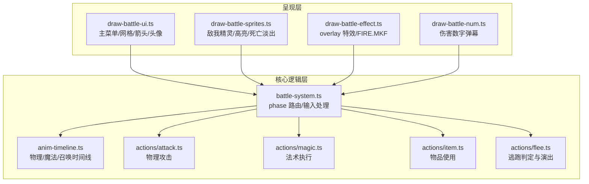
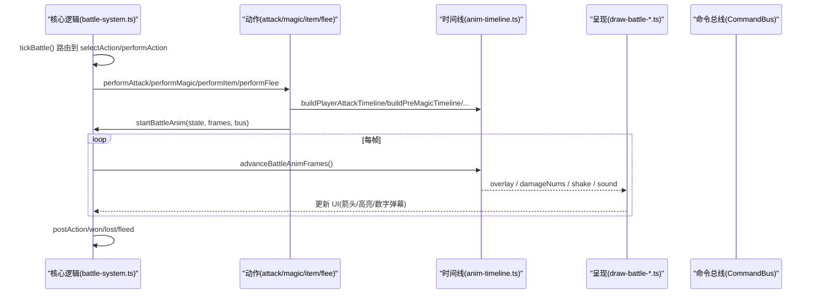
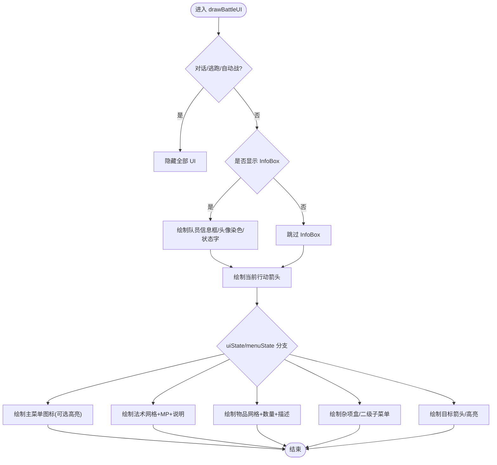
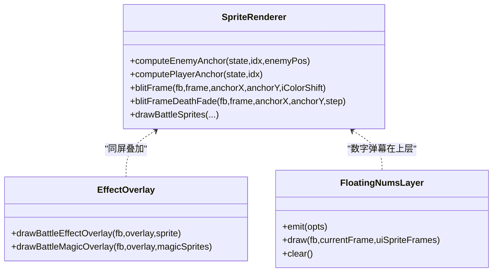
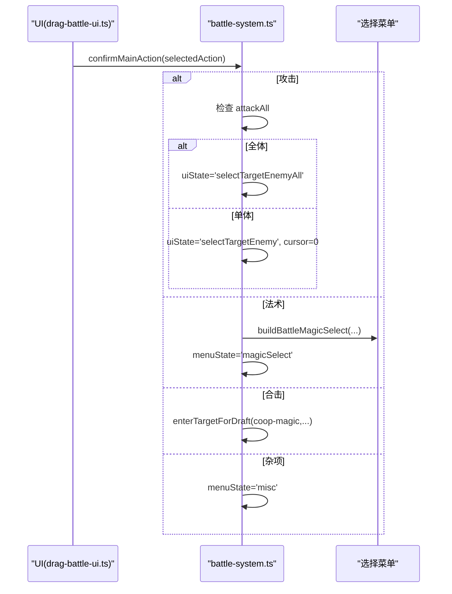
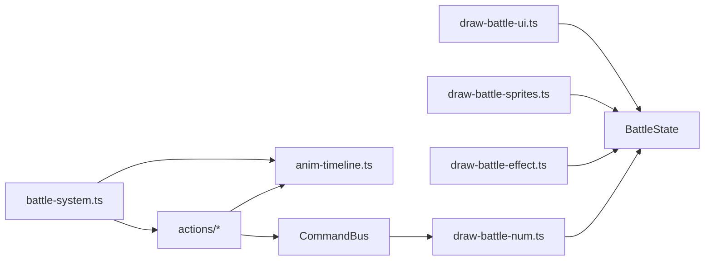

# 战斗界面组件

<cite>
**本文引用的文件**   
- [packages/game/src/present/battle/draw-battle-ui.ts](file://packages/game/src/present/battle/draw-battle-ui.ts)
- [packages/game/src/present/battle/draw-battle-sprites.ts](file://packages/game/src/present/battle/draw-battle-sprites.ts)
- [packages/game/src/present/battle/draw-battle-effect.ts](file://packages/game/src/present/battle/draw-battle-effect.ts)
- [packages/game/src/present/battle/draw-battle-num.ts](file://packages/game/src/present/battle/draw-battle-num.ts)
- [packages/game/src/core/battle/battle-system.ts](file://packages/game/src/core/battle/battle-system.ts)
- [packages/game/src/core/battle/anim-timeline.ts](file://packages/game/src/core/battle/anim-timeline.ts)
- [packages/game/src/core/battle/actions/attack.ts](file://packages/game/src/core/battle/actions/attack.ts)
- [packages/game/src/core/battle/actions/magic.ts](file://packages/game/src/core/battle/actions/magic.ts)
- [packages/game/src/core/battle/actions/item.ts](file://packages/game/src/core/battle/actions/item.ts)
- [packages/game/src/core/battle/actions/flee.ts](file://packages/game/src/core/battle/actions/flee.ts)
- [packages/game/src/tools/tools-panel.ts](file://packages/game/src/tools/tools-panel.ts)
- [packages/game/src/dev/dev-panel.ts](file://packages/game/src/dev/dev-panel.ts)
</cite>

## 目录
1. [简介](#简介)
2. [项目结构](#项目结构)
3. [核心组件](#核心组件)
4. [架构总览](#架构总览)
5. [详细组件分析](#详细组件分析)
6. [依赖关系分析](#依赖关系分析)
7. [性能考量](#性能考量)
8. [故障排查指南](#故障排查指南)
9. [结论](#结论)
10. [附录](#附录)

## 简介
本文件面向 Type-Pal 的战斗界面组件，系统性说明战斗场景的 UI 渲染系统（角色立绘、敌人状态面板、战斗日志窗口）、战斗菜单组件（攻击、防御、道具、逃跑等选项的动态生成与选择逻辑）、战斗动画的时间线控制（动作预览、伤害数字显示、特效触发时机），以及 UI 与战斗逻辑的状态同步机制。文档同时提供扩展实践（新增战斗动作、自定义战斗动画、扩展战斗信息展示）与性能优化策略（批量渲染、对象池使用），并给出调试工具与故障排查指南。

## 项目结构
战斗界面由“呈现层”和“核心逻辑层”两部分组成：
- 呈现层负责绘制：UI 框体、图标、网格、箭头、头像染色、精灵帧、法术 overlay、伤害数字弹幕等。
- 核心逻辑层负责状态机、回合队列、动作执行、动画时间线构建与驱动、脚本运行与事件派发。



图表来源
- [packages/game/src/present/battle/draw-battle-ui.ts:1-120](file://packages/game/src/present/battle/draw-battle-ui.ts#L1-L120)
- [packages/game/src/present/battle/draw-battle-sprites.ts:1-120](file://packages/game/src/present/battle/draw-battle-sprites.ts#L1-L120)
- [packages/game/src/present/battle/draw-battle-effect.ts:1-74](file://packages/game/src/present/battle/draw-battle-effect.ts#L1-L74)
- [packages/game/src/present/battle/draw-battle-num.ts:1-79](file://packages/game/src/present/battle/draw-battle-num.ts#L1-L79)
- [packages/game/src/core/battle/battle-system.ts:472-614](file://packages/game/src/core/battle/battle-system.ts#L472-L614)
- [packages/game/src/core/battle/anim-timeline.ts:1-120](file://packages/game/src/core/battle/anim-timeline.ts#L1-L120)

章节来源
- [packages/game/src/present/battle/draw-battle-ui.ts:1-120](file://packages/game/src/present/battle/draw-battle-ui.ts#L1-L120)
- [packages/game/src/core/battle/battle-system.ts:472-614](file://packages/game/src/core/battle/battle-system.ts#L472-L614)

## 核心组件
- 战斗 UI 渲染器：负责主菜单四图标、杂项盒、法术/物品网格、目标箭头、底部队员信息框、头像中毒染色、状态字显示。
- 精灵渲染器：负责敌我精灵底锚计算、idle 轮播、受击闪白、target 高亮、混乱抖动、死亡淡出 crossfade。
- 特效 overlay 渲染器：物理命中特效与 FIRE.MKF 法术精灵按底中 anchor 叠加。
- 伤害数字弹幕层：按 sdlpal 寿命与上移规则显示颜色语义的数字。
- 战斗系统：phase 状态机、selectAction 输入分发、performAction 驱动、postAction 收尾、自动模式与防卡死保护。
- 动画时间线：物理攻击/受击、魔法 Pre/Off/Post、防御/治疗、召唤神、合击、逃跑失败等时间线构建。
- 动作执行：物理攻击、法术、物品、逃跑的具体实现与与时间线的衔接。

章节来源
- [packages/game/src/present/battle/draw-battle-ui.ts:228-320](file://packages/game/src/present/battle/draw-battle-ui.ts#L228-L320)
- [packages/game/src/present/battle/draw-battle-sprites.ts:259-393](file://packages/game/src/present/battle/draw-battle-sprites.ts#L259-L393)
- [packages/game/src/present/battle/draw-battle-effect.ts:49-74](file://packages/game/src/present/battle/draw-battle-effect.ts#L49-L74)
- [packages/game/src/present/battle/draw-battle-num.ts:31-79](file://packages/game/src/present/battle/draw-battle-num.ts#L31-L79)
- [packages/game/src/core/battle/battle-system.ts:472-614](file://packages/game/src/core/battle/battle-system.ts#L472-L614)
- [packages/game/src/core/battle/anim-timeline.ts:311-458](file://packages/game/src/core/battle/anim-timeline.ts#L311-L458)
- [packages/game/src/core/battle/actions/attack.ts:112-297](file://packages/game/src/core/battle/actions/attack.ts#L112-L297)
- [packages/game/src/core/battle/actions/magic.ts:123-435](file://packages/game/src/core/battle/actions/magic.ts#L123-L435)
- [packages/game/src/core/battle/actions/item.ts:69-120](file://packages/game/src/core/battle/actions/item.ts#L69-L120)
- [packages/game/src/core/battle/actions/flee.ts:36-77](file://packages/game/src/core/battle/actions/flee.ts#L36-L77)

## 架构总览
战斗界面的数据流遵循“状态驱动 + 时间线驱动”的双通道：
- 状态驱动：battle-system.ts 维护 BattleState，present 层每帧读取 state 决定 UI 分支与绘制内容。
- 时间线驱动：perform* 阶段根据动作类型构建 BattleAnimFrame[]，由 battle-anim-driver 逐 tick 推进，期间 present 层在 overlay 层绘制特效并在首帧或命中帧弹出伤害数字。



图表来源
- [packages/game/src/core/battle/battle-system.ts:472-614](file://packages/game/src/core/battle/battle-system.ts#L472-L614)
- [packages/game/src/core/battle/anim-timeline.ts:311-458](file://packages/game/src/core/battle/anim-timeline.ts#L311-L458)
- [packages/game/src/present/battle/draw-battle-num.ts:31-79](file://packages/game/src/present/battle/draw-battle-num.ts#L31-L79)

## 详细组件分析

### 战斗 UI 渲染系统
- 主菜单四图标：攻击/法术/合击/杂项，选中全彩，可用灰阶，不可用更暗；在 target 选择态隐藏部分图标以对齐原版。
- 杂项盒与二级子菜单：围攻/道具/防御/逃跑/状态，进入道具后出现“使用/投掷”。
- 法术/物品网格：N 列分页布局，cursor 精灵，数量/MP 显示，右侧说明文本。
- 目标箭头：当前行动队员头顶箭头闪烁；友方目标箭头红/常交替；敌方目标选择通过 ColorShift 高亮而非箭头。
- 底部队员信息框：头像框、头像（中毒/死亡单色重染）、HP/MP 斜杠与数字、状态字（乱/定/眠/封）。
- 对话期与逃跑动画期：整个战斗 UI 隐藏，避免菜单与信息框闪烁。



图表来源
- [packages/game/src/present/battle/draw-battle-ui.ts:228-320](file://packages/game/src/present/battle/draw-battle-ui.ts#L228-L320)
- [packages/game/src/present/battle/draw-battle-ui.ts:379-421](file://packages/game/src/present/battle/draw-battle-ui.ts#L379-L421)
- [packages/game/src/present/battle/draw-battle-ui.ts:429-485](file://packages/game/src/present/battle/draw-battle-ui.ts#L429-L485)
- [packages/game/src/present/battle/draw-battle-ui.ts:487-525](file://packages/game/src/present/battle/draw-battle-ui.ts#L487-L525)
- [packages/game/src/present/battle/draw-battle-ui.ts:531-580](file://packages/game/src/present/battle/draw-battle-ui.ts#L531-L580)
- [packages/game/src/present/battle/draw-battle-ui.ts:586-626](file://packages/game/src/present/battle/draw-battle-ui.ts#L586-L626)
- [packages/game/src/present/battle/draw-battle-ui.ts:696-737](file://packages/game/src/present/battle/draw-battle-ui.ts#L696-L737)

章节来源
- [packages/game/src/present/battle/draw-battle-ui.ts:1-120](file://packages/game/src/present/battle/draw-battle-ui.ts#L1-L120)
- [packages/game/src/present/battle/draw-battle-ui.ts:228-320](file://packages/game/src/present/battle/draw-battle-ui.ts#L228-L320)
- [packages/game/src/present/battle/draw-battle-ui.ts:379-421](file://packages/game/src/present/battle/draw-battle-ui.ts#L379-L421)
- [packages/game/src/present/battle/draw-battle-ui.ts:429-485](file://packages/game/src/present/battle/draw-battle-ui.ts#L429-L485)
- [packages/game/src/present/battle/draw-battle-ui.ts:487-525](file://packages/game/src/present/battle/draw-battle-ui.ts#L487-L525)
- [packages/game/src/present/battle/draw-battle-ui.ts:531-580](file://packages/game/src/present/battle/draw-battle-ui.ts#L531-L580)
- [packages/game/src/present/battle/draw-battle-ui.ts:586-626](file://packages/game/src/present/battle/draw-battle-ui.ts#L586-L626)
- [packages/game/src/present/battle/draw-battle-ui.ts:696-737](file://packages/game/src/present/battle/draw-battle-ui.ts#L696-L737)

### 精灵与特效渲染
- 底锚计算：敌方位置来自 ENEMYPOS 表与 yPosOffset；我方位置基于队伍人数固定布局。
- idle 轮播：闭式索引复现 sdlpal 倒计时器，睡眠/麻痹定格 frame 0。
- 高亮与抖动：敌方 target 选择时 ColorShift=7 闪烁；混乱单位 X/Y 轴 ±1px 抖动。
- 死亡淡出：crossfade 像素级逼近背景，72 步交错渐隐。
- overlay 特效：物理命中与 FIRE.MKF 法术精灵按底中 anchor 叠加，参与统一 z 排序。



图表来源
- [packages/game/src/present/battle/draw-battle-sprites.ts:26-50](file://packages/game/src/present/battle/draw-battle-sprites.ts#L26-L50)
- [packages/game/src/present/battle/draw-battle-sprites.ts:107-131](file://packages/game/src/present/battle/draw-battle-sprites.ts#L107-L131)
- [packages/game/src/present/battle/draw-battle-sprites.ts:157-191](file://packages/game/src/present/battle/draw-battle-sprites.ts#L157-L191)
- [packages/game/src/present/battle/draw-battle-sprites.ts:259-393](file://packages/game/src/present/battle/draw-battle-sprites.ts#L259-L393)
- [packages/game/src/present/battle/draw-battle-effect.ts:49-74](file://packages/game/src/present/battle/draw-battle-effect.ts#L49-L74)
- [packages/game/src/present/battle/draw-battle-num.ts:31-79](file://packages/game/src/present/battle/draw-battle-num.ts#L31-L79)

章节来源
- [packages/game/src/present/battle/draw-battle-sprites.ts:1-120](file://packages/game/src/present/battle/draw-battle-sprites.ts#L1-L120)
- [packages/game/src/present/battle/draw-battle-sprites.ts:259-393](file://packages/game/src/present/battle/draw-battle-sprites.ts#L259-L393)
- [packages/game/src/present/battle/draw-battle-effect.ts:1-74](file://packages/game/src/present/battle/draw-battle-effect.ts#L1-L74)
- [packages/game/src/present/battle/draw-battle-num.ts:1-79](file://packages/game/src/present/battle/draw-battle-num.ts#L1-L79)

### 战斗菜单与选择逻辑
- 主菜单四图标映射 selectedAction：0 攻击、1 法术、2 合击、3 杂项。
- 确认主菜单图标后：
  - 攻击：若武器 attackAll → 全体目标即时提交；否则进入单体目标选择。
  - 法术：打开法术网格，支持 MP 显示与说明文本。
  - 合击：取 cooperativeMagic，判断可打敌/友与是否全体，进入目标选择。
  - 杂项：打开杂项盒，进入“道具”后出现“使用/投掷”二级菜单。
- 灰项判定：法术需非沉默；合击需本人健康且健康队友数 > 1。



图表来源
- [packages/game/src/core/battle/battle-system.ts:1339-1372](file://packages/game/src/core/battle/battle-system.ts#L1339-L1372)
- [packages/game/src/present/battle/draw-battle-ui.ts:68-92](file://packages/game/src/present/battle/draw-battle-ui.ts#L68-L92)
- [packages/game/src/present/battle/draw-battle-ui.ts:429-485](file://packages/game/src/present/battle/draw-battle-ui.ts#L429-L485)

章节来源
- [packages/game/src/core/battle/battle-system.ts:1339-1372](file://packages/game/src/core/battle/battle-system.ts#L1339-L1372)
- [packages/game/src/present/battle/draw-battle-ui.ts:68-92](file://packages/game/src/present/battle/draw-battle-ui.ts#L68-L92)
- [packages/game/src/present/battle/draw-battle-ui.ts:429-485](file://packages/game/src/present/battle/draw-battle-ui.ts#L429-L485)

### 战斗动画时间线与伤害数字
- 物理攻击：玩家→敌人（含群攻挥砍、双击、前摇、命中特效、收势位移）、敌人→玩家（格挡/替挡、受击抖动、死亡/濒死帧恢复）。
- 法术：PreMagic 前摇 + OffMagic 落点特效 + PostMagic 受击抖动；防御/治疗魔法 DefMagic；召唤神序列；合击聚拢/蓄势/出招/滑回。
- 伤害数字：挂到 i==0 帧或 PostMagic 第一帧，寿命 11 帧，每帧上移 1px，颜色语义 blue/yellow/cyan。
- 回合起手脚本动画 hold：在 selectAction 阶段冻结时间线至播完，再复位战士位置，不干扰 action 队列。

```mermaid
flowchart TD
A["performAttack/performMagic"] --> B["build*Timeline() 返回 BattleAnimFrame[]"]
B --> C["startBattleAnim(state, frames, bus)"]
C --> D["advanceBattleAnimFrames() 每tick推进"]
D --> E{"帧属性?"}
E --> |overlay| F["drawBattleEffectOverlay / drawBattleMagicOverlay"]
E --> |damageNum(s)| G["FloatingNumsLayer.emit()"]
E --> |shake| H["屏幕震动"]
E --> |sound| I["播放音效"]
D --> J["resetFightersAfterAction() 复位"]
```

图表来源
- [packages/game/src/core/battle/anim-timeline.ts:311-458](file://packages/game/src/core/battle/anim-timeline.ts#L311-L458)
- [packages/game/src/core/battle/anim-timeline.ts:1148-1205](file://packages/game/src/core/battle/anim-timeline.ts#L1148-L1205)
- [packages/game/src/present/battle/draw-battle-num.ts:14-27](file://packages/game/src/present/battle/draw-battle-num.ts#L14-L27)
- [packages/game/src/core/battle/battle-system.ts:544-561](file://packages/game/src/core/battle/battle-system.ts#L544-L561)

章节来源
- [packages/game/src/core/battle/anim-timeline.ts:311-458](file://packages/game/src/core/battle/anim-timeline.ts#L311-L458)
- [packages/game/src/core/battle/anim-timeline.ts:1148-1205](file://packages/game/src/core/battle/anim-timeline.ts#L1148-L1205)
- [packages/game/src/present/battle/draw-battle-num.ts:1-79](file://packages/game/src/present/battle/draw-battle-num.ts#L1-L79)
- [packages/game/src/core/battle/battle-system.ts:544-561](file://packages/game/src/core/battle/battle-system.ts#L544-L561)

### 状态同步机制
- 战斗 live roles：present 层必须读取 getBattleLiveRoles() 中的实时 HP/MP/状态，避免 stale 基线导致错误视觉。
- 选择开始标记：selectionStartedForTurn === turn 才画 InfoBox，防止 preBattle/selectAction 过渡帧闪 UI。
- 回合末延迟：roundEndDelayTicks 在下一轮菜单前停顿，确保数字可见。
- 自动模式：fAutoBattle/fAutoAttack/fForce/fRepeat 整队粘滞，选满后清粘性。

章节来源
- [packages/game/src/core/battle/battle-system.ts:179-186](file://packages/game/src/core/battle/battle-system.ts#L179-L186)
- [packages/game/src/present/battle/draw-battle-ui.ts:268-270](file://packages/game/src/present/battle/draw-battle-ui.ts#L268-L270)
- [packages/game/src/core/battle/battle-system.ts:581-596](file://packages/game/src/core/battle/battle-system.ts#L581-L596)
- [packages/game/src/core/battle/battle-system.ts:775-786](file://packages/game/src/core/battle/battle-system.ts#L775-L786)

### 扩展实践示例（路径指引）
- 添加新的战斗动作
  - 在 battle-system.ts 的 confirmMainAction 分支中添加新图标映射，并在 draw-battle-ui.ts 的主菜单图标数组与灰项判定中补齐。
  - 参考路径：[confirmMainAction:1339-1372](file://packages/game/src/core/battle/battle-system.ts#L1339-L1372)、[MAIN_ICONS/灰项判定:68-92](file://packages/game/src/present/battle/draw-battle-ui.ts#L68-L92)、[isBattleActionValidForDraw:457-485](file://packages/game/src/present/battle/draw-battle-ui.ts#L457-L485)。
- 自定义战斗动画
  - 在 anim-timeline.ts 新增 build*Timeline 函数，返回 BattleAnimFrame[]；在 actions/* 中调用 startBattleAnim 启动。
  - 参考路径：[buildPlayerAttackTimeline:311-458](file://packages/game/src/core/battle/anim-timeline.ts#L311-L458)、[buildCoopMagicTimeline:1148-1205](file://packages/game/src/core/battle/anim-timeline.ts#L1148-L1205)。
- 扩展战斗信息展示
  - 在 draw-battle-ui.ts 的 InfoBox 区域增加字段（如抗性/经验），或在 tools-panel.ts 的“战斗 tab”中追加只读快照。
  - 参考路径：[drawPlayerInfoBoxes:379-421](file://packages/game/src/present/battle/draw-battle-ui.ts#L379-L421)、[tools-panel 战斗 tab:393-430](file://packages/game/src/tools/tools-panel.ts#L393-L430)。

## 依赖关系分析
- 呈现层对核心逻辑为只读依赖：UI 仅读取 BattleState 与 PlayerRolesRuntime，不修改状态。
- 核心逻辑通过 CommandBus 向呈现层下发 showDamageNum/playSound 等指令，呈现层消费并渲染。
- 动画时间线作为纯函数 builder，被 perform* 调用，再由 battle-anim-driver 驱动。



图表来源
- [packages/game/src/present/battle/draw-battle-ui.ts:228-320](file://packages/game/src/present/battle/draw-battle-ui.ts#L228-L320)
- [packages/game/src/present/battle/draw-battle-sprites.ts:259-393](file://packages/game/src/present/battle/draw-battle-sprites.ts#L259-L393)
- [packages/game/src/present/battle/draw-battle-effect.ts:49-74](file://packages/game/src/present/battle/draw-battle-effect.ts#L49-L74)
- [packages/game/src/present/battle/draw-battle-num.ts:31-79](file://packages/game/src/present/battle/draw-battle-num.ts#L31-L79)
- [packages/game/src/core/battle/battle-system.ts:472-614](file://packages/game/src/core/battle/battle-system.ts#L472-L614)
- [packages/game/src/core/battle/anim-timeline.ts:311-458](file://packages/game/src/core/battle/anim-timeline.ts#L311-L458)

章节来源
- [packages/game/src/core/battle/battle-system.ts:472-614](file://packages/game/src/core/battle/battle-system.ts#L472-L614)
- [packages/game/src/present/battle/draw-battle-num.ts:31-79](file://packages/game/src/present/battle/draw-battle-num.ts#L31-L79)

## 性能考量
- 批量渲染
  - 精灵统一收集到 DrawItem 列表并按 Y/X 排序后一次 blit，减少重复遍历与状态切换。
  - overlay 与精灵同列排序，保证正确覆盖顺序。
- 对象池与复用
  - FloatingNumsLayer 内部维护 nums 数组，过期清理，避免频繁 GC。
  - 网格绘制共用 drawSelectGridItems，减少重复代码与开销。
- 资源缺失降级
  - 缺 sprite 资源时走文字兜底或 no-op，避免异常与额外计算。
- 动画帧粒度
  - 所有 Delay 以 BATTLE_FRAME_TIME=40ms 为单位，tick 与 25fps 对齐，便于预测与节流。

章节来源
- [packages/game/src/present/battle/draw-battle-sprites.ts:274-393](file://packages/game/src/present/battle/draw-battle-sprites.ts#L274-L393)
- [packages/game/src/present/battle/draw-battle-num.ts:31-79](file://packages/game/src/present/battle/draw-battle-num.ts#L31-L79)
- [packages/game/src/present/battle/draw-battle-ui.ts:646-681](file://packages/game/src/present/battle/draw-battle-ui.ts#L646-L681)
- [packages/game/src/core/battle/anim-timeline.ts:26-35](file://packages/game/src/core/battle/anim-timeline.ts#L26-L35)

## 故障排查指南
- 常见问题定位
  - 菜单/血量面板在开场闪一下：检查 dialogActive/escapeAnim/autoBattle 早退条件与 selectionStartedForTurn 标记。
  - 群攻无动画或数字偏晚：确认 groupDamageNums 挂到挥砍 i==0 帧，而非 pendingDamageNums。
  - 施法音/效果音不同步：检查 castSound 与 magic.sound 是否挂到对应帧，未建链则回落即时 push。
  - 敌普攻无声无动画：performAttack 中 autoDefend 分支需建时间线，补全 playEnemyAttack 与动画。
- 调试工具
  - dev-panel 自定义战斗：快速配置敌人/队员/等级/道具，一键开战，方便复现问题。
  - tools-panel 战斗 tab：实时显示回合、灵葫值、我方/敌方状态、中毒计数，自动签名驱动重渲染。
- 建议步骤
  - 开启 dev-panel 自定义战斗，构造最小用例。
  - 在 tools-panel 观察 battleSig 变化，定位状态不一致。
  - 针对具体动作，查看对应 perform* 与时间线构建路径，核对帧挂载点。

章节来源
- [packages/game/src/dev/dev-panel.ts:641-747](file://packages/game/src/dev/dev-panel.ts#L641-L747)
- [packages/game/src/tools/tools-panel.ts:393-430](file://packages/game/src/tools/tools-panel.ts#L393-L430)
- [packages/game/src/tools/tools-panel.ts:800-830](file://packages/game/src/tools/tools-panel.ts#L800-L830)
- [packages/game/src/present/battle/draw-battle-ui.ts:244-270](file://packages/game/src/present/battle/draw-battle-ui.ts#L244-L270)
- [packages/game/src/core/battle/actions/attack.ts:150-236](file://packages/game/src/core/battle/actions/attack.ts#L150-L236)
- [packages/game/src/core/battle/actions/magic.ts:154-174](file://packages/game/src/core/battle/actions/magic.ts#L154-L174)
- [packages/game/src/core/battle/actions/attack.ts:336-356](file://packages/game/src/core/battle/actions/attack.ts#L336-L356)

## 结论
Type-Pal 战斗界面采用“状态驱动 + 时间线驱动”的清晰分层：呈现层忠实复刻 sdlpal 的像素与行为，核心逻辑层以 phase 状态机组织流程，并通过时间线将动作、特效、音效与数字弹幕精确对齐。通过完善的调试工具与健壮的降级策略，开发者可高效扩展动作与动画，同时保持性能与稳定性。

## 附录
- 关键常量与真值对照
  - 主菜单图标与位置、杂项标签 WORD.DAT 真值、法术/物品网格布局参数、箭头精灵帧号等均在 draw-battle-ui.ts 注释中标注了 sdlpal 行号，便于逐项核对。
- 相关测试与验证
  - 头像染色与数字弹帧时序均有单测覆盖，可作为回归基准。

章节来源
- [packages/game/src/present/battle/draw-battle-ui.ts:1-120](file://packages/game/src/present/battle/draw-battle-ui.ts#L1-L120)
- [packages/game/src/present/battle/__tests__/draw-battle-ui.test.ts:1-32](file://packages/game/src/present/battle/__tests__/draw-battle-ui.test.ts#L1-L32)
- [packages/game/src/core/battle/actions/attack.ts:509-538](file://packages/game/src/core/battle/actions/attack.ts#L509-L538)