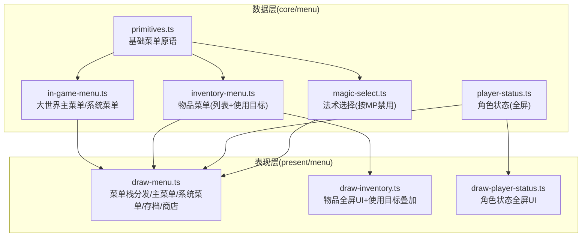
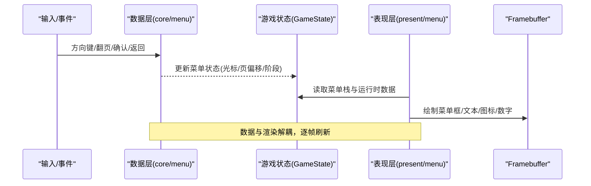
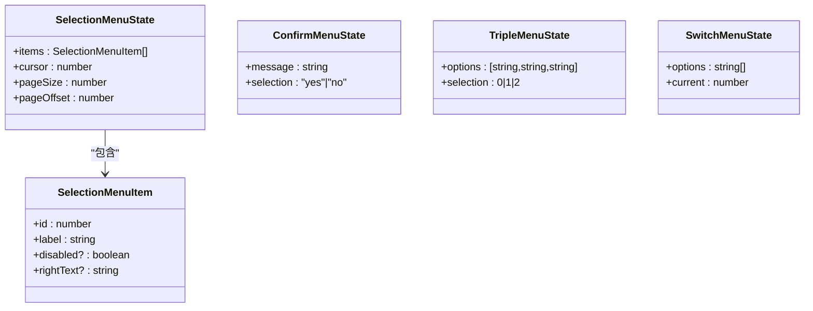
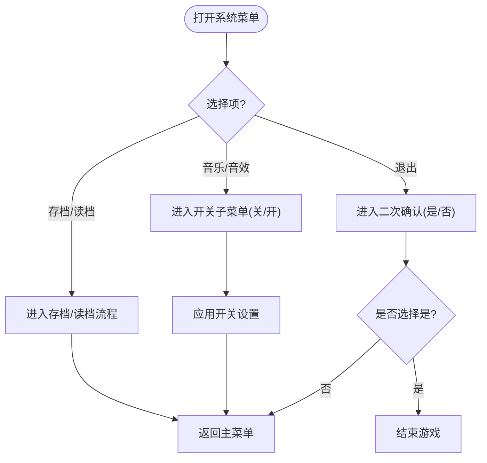
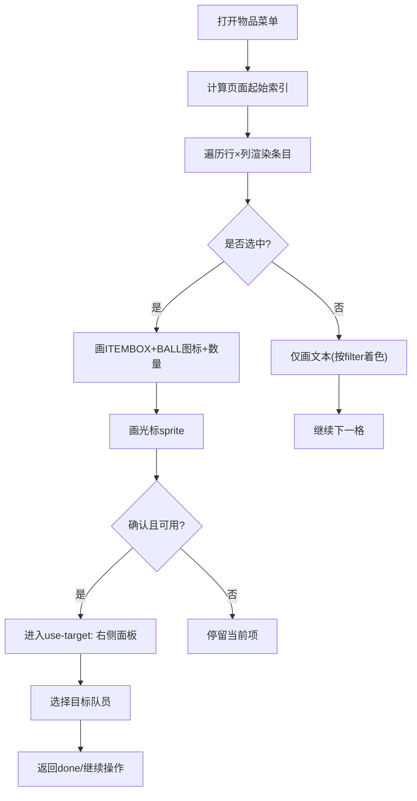
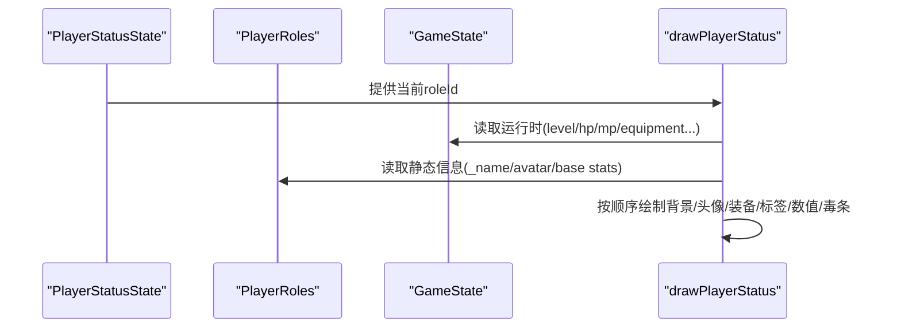
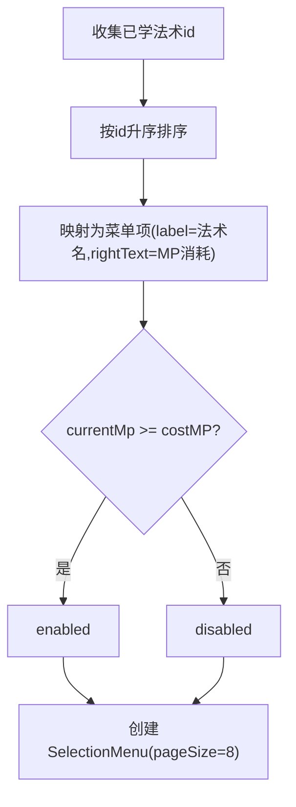

# 菜单组件系统

<cite>
**本文引用的文件**   
- [in-game-menu.ts](file://packages/game/src/core/menu/in-game-menu.ts)
- [inventory-menu.ts](file://packages/game/src/core/menu/inventory-menu.ts)
- [player-status.ts](file://packages/game/src/core/menu/player-status.ts)
- [magic-select.ts](file://packages/game/src/core/menu/magic-select.ts)
- [primitives.ts](file://packages/game/src/core/menu/primitives.ts)
- [draw-menu.ts](file://packages/game/src/present/menu/draw-menu.ts)
- [draw-inventory.ts](file://packages/game/src/present/menu/draw-inventory.ts)
- [draw-player-status.ts](file://packages/game/src/present/menu/draw-player-status.ts)
</cite>

## 目录
1. [简介](#简介)
2. [项目结构](#项目结构)
3. [核心组件](#核心组件)
4. [架构总览](#架构总览)
5. [详细组件分析](#详细组件分析)
6. [依赖关系分析](#依赖关系分析)
7. [性能与布局算法](#性能与布局算法)
8. [交互与输入处理](#交互与输入处理)
9. [数据绑定与状态同步](#数据绑定与状态同步)
10. [生命周期与资源清理](#生命周期与资源清理)
11. [可访问性与跨平台兼容](#可访问性与跨平台兼容)
12. [故障排查指南](#故障排查指南)
13. [结论](#结论)

## 简介
本文件系统化梳理 Type-Pal 第一阶段（忠实还原）中的“菜单组件系统”，覆盖主菜单、物品栏、角色状态、法术选择等核心菜单的数据层与表现层实现，解释布局与网格算法、滚动与分页、焦点与导航、鼠标/触摸支持策略、数据绑定与实时同步、动画过渡思路、生命周期与资源管理，以及可访问性与跨平台注意事项。文档以源码为依据，提供可视化图示与定位路径，便于快速上手与扩展。

## 项目结构
菜单系统采用“数据层 + 表现层”的清晰分层：
- 数据层（core/menu）：纯数据与光标/翻页/确认等状态机，不含渲染与 DOM 引用，便于单测与真值对齐。
- 表现层（present/menu）：基于 Framebuffer 的像素级绘制，严格对照 sdlpal 坐标、颜色与行为。

图表来源
- [primitives.ts:1-177](file://packages/game/src/core/menu/primitives.ts#L1-L177)
- [in-game-menu.ts:1-130](file://packages/game/src/core/menu/in-game-menu.ts#L1-L130)
- [inventory-menu.ts:1-275](file://packages/game/src/core/menu/inventory-menu.ts#L1-L275)
- [player-status.ts:1-59](file://packages/game/src/core/menu/player-status.ts#L1-L59)
- [magic-select.ts:1-57](file://packages/game/src/core/menu/magic-select.ts#L1-L57)
- [draw-menu.ts:1-435](file://packages/game/src/present/menu/draw-menu.ts#L1-L435)
- [draw-inventory.ts:1-348](file://packages/game/src/present/menu/draw-inventory.ts#L1-L348)
- [draw-player-status.ts:1-271](file://packages/game/src/present/menu/draw-player-status.ts#L1-L271)

章节来源
- [primitives.ts:1-177](file://packages/game/src/core/menu/primitives.ts#L1-L177)
- [draw-menu.ts:1-435](file://packages/game/src/present/menu/draw-menu.ts#L1-L435)

## 核心组件
- 基础菜单原语（SelectionMenu/ConfirmMenu/TripleMenu/SwitchMenu）
  - 提供统一的 items/cursor/pageOffset 模型与移动/翻页/选中读取 API。
  - 关键：逐项移动不跳过 disabled；翻页时跳到下一个可选项；确保光标可见性。
- 大世界主菜单与系统菜单
  - 主菜单四项：状态/法术/物品/系统；系统菜单五项：存档/读档/音乐/音效/退出。
  - 系统菜单含二次确认与开关切换子阶段。
- 物品菜单
  - 全屏网格布局，行列固定常量，支持上下左右、翻页、首尾跳转。
  - 使用入口进入“选择目标队员”子流程，持久记忆上次选中的队员槽位。
- 角色状态
  - 全屏一屏展示头像、装备槽、属性标签与数值、经验/等级、HP/MP、五维、毒条等。
  - 通过左右键在队伍成员间循环浏览，越界关闭。
- 法术选择
  - 聚合已学法术，按编号排序，显示 MP 消耗，不足时禁用。

章节来源
- [primitives.ts:1-177](file://packages/game/src/core/menu/primitives.ts#L1-L177)
- [in-game-menu.ts:1-130](file://packages/game/src/core/menu/in-game-menu.ts#L1-L130)
- [inventory-menu.ts:1-275](file://packages/game/src/core/menu/inventory-menu.ts#L1-L275)
- [player-status.ts:1-59](file://packages/game/src/core/menu/player-status.ts#L1-L59)
- [magic-select.ts:1-57](file://packages/game/src/core/menu/magic-select.ts#L1-L57)

## 架构总览
菜单系统遵循“数据驱动 + 真值对齐”的设计：
- 数据层只维护状态与输入响应，无渲染依赖。
- 表现层从 GameState 与 catalog 中取数，按 sdlpal 真值坐标/颜色绘制。
- 菜单栈由上层调度，drawMenuStack 遍历并分派到具体绘制函数。

图表来源
- [draw-menu.ts:101-111](file://packages/game/src/present/menu/draw-menu.ts#L101-L111)
- [primitives.ts:89-128](file://packages/game/src/core/menu/primitives.ts#L89-L128)

## 详细组件分析

### 基础菜单原语（SelectionMenu 等）
- SelectionMenu
  - 数据结构：items、cursor、pageSize、pageOffset。
  - 移动：moveSelectionUp/Down 环绕且不跳过 disabled；ensureCursorVisible 保证可见。
  - 翻页：pageUp/pageDown 跳至下一页首个可选项，边界回退。
  - 选中：getSelected 返回当前项（可能 undefined）。
- ConfirmMenu/TripleMenu/SwitchMenu
  - 用于 Yes/No、三选一、多选项循环切换等常见模式。

图表来源
- [primitives.ts:14-46](file://packages/game/src/core/menu/primitives.ts#L14-L46)
- [primitives.ts:48-133](file://packages/game/src/core/menu/primitives.ts#L48-L133)

章节来源
- [primitives.ts:1-177](file://packages/game/src/core/menu/primitives.ts#L1-L177)

### 大世界主菜单与系统菜单
- 主菜单
  - 四项：状态/法术/物品/系统，文案来自 WORD id，fallback 兜底。
  - 光标上下移动，确认进入对应子菜单。
- 系统菜单
  - 五项：存档/读档/音乐/音效/退出。
  - 退出触发二次确认（是/否），默认高亮“否”。
  - 音乐/音效进入 switch 阶段（关/开），默认高亮当前态。

图表来源
- [in-game-menu.ts:28-47](file://packages/game/src/core/menu/in-game-menu.ts#L28-L47)
- [in-game-menu.ts:99-126](file://packages/game/src/core/menu/in-game-menu.ts#L99-L126)
- [draw-menu.ts:285-316](file://packages/game/src/present/menu/draw-menu.ts#L285-L316)

章节来源
- [in-game-menu.ts:1-130](file://packages/game/src/core/menu/in-game-menu.ts#L1-L130)
- [draw-menu.ts:258-316](file://packages/game/src/present/menu/draw-menu.ts#L258-L316)

### 物品菜单（全屏网格 + 使用目标）
- 网格与滚动
  - 列数 = 3，行数 = 7，每行高度 18px，单元格宽度 100px。
  - 支持上下左右、PgUp/PgDn、Home/End，光标 clamp 不 wrap。
- 颜色规则
  - 根据是否选中、是否可用、是否装备中决定颜色，选中可用项闪烁。
- 使用目标
  - 确认后可用物品后进入 use-target 阶段，弹出右侧面板显示目标队员名称与属性。
  - 持久记忆上次选择的队员 slot，跨切换或重开保持。

图表来源
- [inventory-menu.ts:43-91](file://packages/game/src/core/menu/inventory-menu.ts#L43-L91)
- [inventory-menu.ts:167-215](file://packages/game/src/core/menu/inventory-menu.ts#L167-L215)
- [inventory-menu.ts:219-274](file://packages/game/src/core/menu/inventory-menu.ts#L219-L274)
- [draw-inventory.ts:244-347](file://packages/game/src/present/menu/draw-inventory.ts#L244-L347)

章节来源
- [inventory-menu.ts:1-275](file://packages/game/src/core/menu/inventory-menu.ts#L1-L275)
- [draw-inventory.ts:1-348](file://packages/game/src/present/menu/draw-inventory.ts#L1-L348)

### 角色状态（全屏一屏）
- 布局顺序
  - 全屏背景 → 头像 → 6 装备槽（BALL 图标 + 名称）→ 标签（Exp/Lv/HP/MP + 五维）→ 角色名 → 斜杠 sprite → 数值（经验/等级/HP/MP/五维）→ 毒条。
- 数值来源
  - 优先运行时值（等级/HP/MP 等），否则回退到基础值；五维通过 equip-effect 计算有效值。
- 导航
  - 左右键在队伍成员间切换，越界关闭菜单。

图表来源
- [player-status.ts:19-58](file://packages/game/src/core/menu/player-status.ts#L19-L58)
- [draw-player-status.ts:157-270](file://packages/game/src/present/menu/draw-player-status.ts#L157-L270)

章节来源
- [player-status.ts:1-59](file://packages/game/src/core/menu/player-status.ts#L1-L59)
- [draw-player-status.ts:1-271](file://packages/game/src/present/menu/draw-player-status.ts#L1-L271)

### 法术选择（按 MP 禁用）
- 数据来源
  - 从角色 magic 槽收集已学法术 id，过滤空位并按 id 升序排列。
  - 通过 spells.json 反查 magicNumber，再取 magic.json 的 costMP。
- 禁用逻辑
  - currentMp < mpCost 则 disabled，不可确认。

图表来源
- [magic-select.ts:26-56](file://packages/game/src/core/menu/magic-select.ts#L26-L56)

章节来源
- [magic-select.ts:1-57](file://packages/game/src/core/menu/magic-select.ts#L1-L57)

## 依赖关系分析
- 数据层对共享类型（Item、PlayerRoles、Spell、Magic）有引用，但不依赖渲染。
- 表现层依赖 draw-box、font、draw-number、equip-effect、word-lookup 等通用模块。
- 菜单栈分发器 drawMenuStack 统一调度各菜单绘制。

图表来源
- [draw-menu.ts:13-43](file://packages/game/src/present/menu/draw-menu.ts#L13-L43)
- [inventory-menu.ts:25-33](file://packages/game/src/core/menu/inventory-menu.ts#L25-L33)
- [magic-select.ts:8-10](file://packages/game/src/core/menu/magic-select.ts#L8-L10)

章节来源
- [draw-menu.ts:1-435](file://packages/game/src/present/menu/draw-menu.ts#L1-L435)

## 性能与布局算法
- 网格与分页
  - 物品菜单：固定 3×7 网格，pageStart 计算基于 cursor 与列宽，居中滚动。
  - 基础 SelectionMenu：pageSize 控制每屏行数，ensureCursorVisible 自动调整 pageOffset。
- 颜色与闪烁
  - 选中项颜色按 tick/100 % N 动态变化，避免频繁分配，使用 Date.now() 近似 SDL_GetTicks。
- 渲染优化建议
  - 批量绘制：将同色文本合并调用 renderText。
  - 缓存 sprite：uiSpriteFrames/itemIcons/portraitIcons 复用 Map，避免重复查找。
  - 描述区按需渲染：带 OnItemChange 的卖/买菜单关闭描述，减少文本测量。

章节来源
- [inventory-menu.ts:43-91](file://packages/game/src/core/menu/inventory-menu.ts#L43-L91)
- [draw-inventory.ts:244-347](file://packages/game/src/present/menu/draw-inventory.ts#L244-L347)
- [draw-menu.ts:67-69](file://packages/game/src/present/menu/draw-menu.ts#L67-L69)

## 交互与输入处理
- 键盘导航
  - 主菜单/系统菜单：↑↓ 移动，空格/回车确认，Esc 返回或关闭。
  - 物品菜单：↑↓ 跨行，←→ 跨列，PgUp/PgDn 翻页，Home/End 首尾，Menu 取消。
  - 角色状态：←→ 切换队员，Menu 关闭。
- 鼠标/触摸支持
  - 当前数据层未内置指针事件；可在上层将 PointerEvent 转换为等效键盘动作（如点击项映射为 moveSelectionDown/confirm）。
- 焦点管理
  - 所有列表均维护全局 index（非页内局部），翻页时通过 pageOffset 维持可见性。

章节来源
- [primitives.ts:89-128](file://packages/game/src/core/menu/primitives.ts#L89-L128)
- [inventory-menu.ts:167-215](file://packages/game/src/core/menu/inventory-menu.ts#L167-L215)
- [player-status.ts:35-52](file://packages/game/src/core/menu/player-status.ts#L35-L52)

## 数据绑定与状态同步
- 数据源
  - 物品清单：gs.inventory（快照于开菜单时复制，但使用目标面板金额仍实时读取 gs.inventory）。
  - 角色状态：gs.PlayerRolesRuntime 与 playerRoles.catalog 组合。
  - 法术列表：playerRoles.roles[roleId].magic + spells/magics catalog。
- 实时更新
  - 使用目标面板的金额、HP/MP/五维等数值每帧从运行时读取，避免“道具不减/数值不变”问题。
- 持久记忆
  - 物品使用目标选择保留上次队员 slot，跨切换或重开保持一致。

章节来源
- [inventory-menu.ts:114-154](file://packages/game/src/core/menu/inventory-menu.ts#L114-L154)
- [draw-inventory.ts:234-242](file://packages/game/src/present/menu/draw-inventory.ts#L234-L242)
- [draw-player-status.ts:104-119](file://packages/game/src/present/menu/draw-player-status.ts#L104-L119)

## 生命周期与资源清理
- 菜单生命周期
  - 创建：createXxxMenu 初始化 state（复制必要数据、设置默认光标/阶段）。
  - 运行：tick 中消费输入，更新 state；draw 层每帧读取最新运行时数据。
  - 销毁：cancel/close 回到 done 或 pop 出 menuStack，释放临时状态（如 targetMenu）。
- 资源管理
  - uiSpriteFrames/itemIcons/portraitIcons 由上层预加载并传入，避免在菜单内部重复 fetch。
  - 描述区脚本链仅在需要时解析，减少开销。

章节来源
- [draw-menu.ts:101-111](file://packages/game/src/present/menu/draw-menu.ts#L101-L111)
- [inventory-menu.ts:263-274](file://packages/game/src/core/menu/inventory-menu.ts#L263-L274)
- [draw-inventory.ts:325-347](file://packages/game/src/present/menu/draw-inventory.ts#L325-L347)

## 可访问性与跨平台兼容
- 可访问性
  - 键盘可达性完备（方向键/翻页/Home/End/确认/返回）。
  - 建议在 UI 层增加 aria 语义（若未来迁移到 DOM 或混合渲染）。
- 跨平台
  - 时间基准使用 Date.now() 替代 SDL_GetTicks，需保证一致性。
  - 字体与数字渲染走 sprite-based 方案，避免不同平台字体差异导致的对齐问题。
  - 触摸设备可将点击/拖拽映射为等效键盘事件，保持交互一致。

章节来源
- [draw-menu.ts:67-69](file://packages/game/src/present/menu/draw-menu.ts#L67-L69)
- [draw-inventory.ts:366-370](file://packages/game/src/present/menu/draw-inventory.ts#L366-L370)

## 故障排查指南
- 症状：选中不可用项仍可确认
  - 检查 confirmInventoryItem 的可用判定（filter 命中 + count > inUse）。
- 症状：使用物品后数量不减少
  - 确认使用目标面板金额读取自 gs.inventory 而非快照。
- 症状：角色状态数值异常
  - 核对 runtimeOrBase 优先级与 equip-effect 计算是否正确注入。
- 症状：法术列表未按编号排序
  - 检查 learnedSpellIds 的 sort 逻辑与 spells/magics 反查。

章节来源
- [inventory-menu.ts:219-252](file://packages/game/src/core/menu/inventory-menu.ts#L219-L252)
- [draw-inventory.ts:234-242](file://packages/game/src/present/menu/draw-inventory.ts#L234-L242)
- [draw-player-status.ts:104-119](file://packages/game/src/present/menu/draw-player-status.ts#L104-L119)
- [magic-select.ts:36-36](file://packages/game/src/core/menu/magic-select.ts#L36-L36)

## 结论
Type-Pal 的菜单系统以“数据层 + 表现层”的分层设计为核心，严格对齐 sdlpal 真值，实现了主菜单、物品栏、角色状态、法术选择等关键交互。其网格布局、滚动分页、焦点管理与颜色闪烁均有明确算法与注释锚点，便于回归测试与移植验证。在此基础上，可按需扩展新菜单类型、自定义样式与动画过渡，并通过上层输入适配实现鼠标/触摸支持。