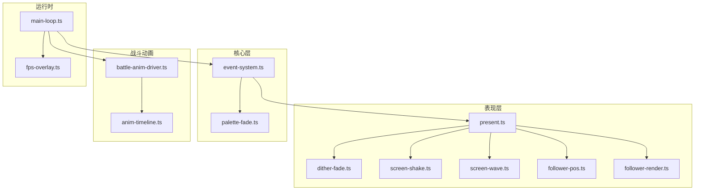
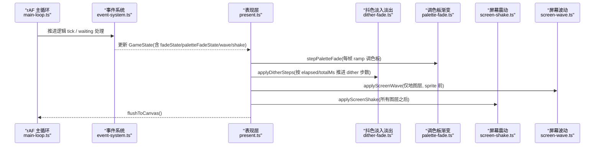
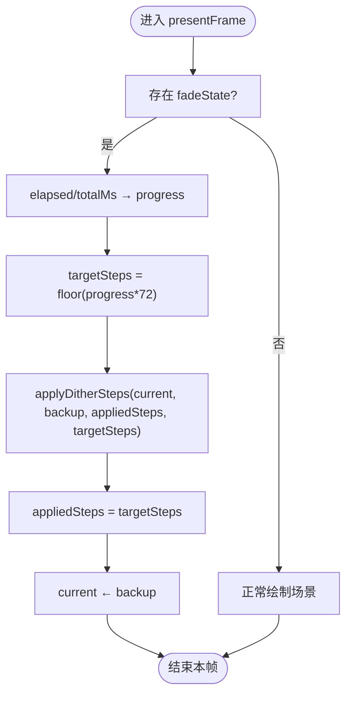
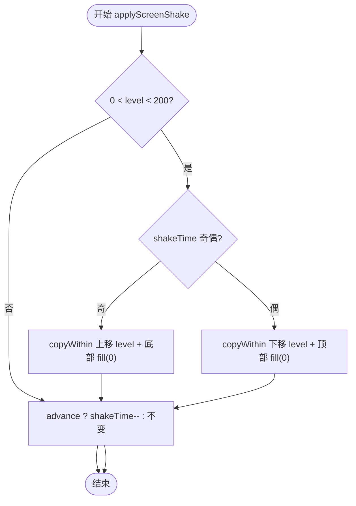
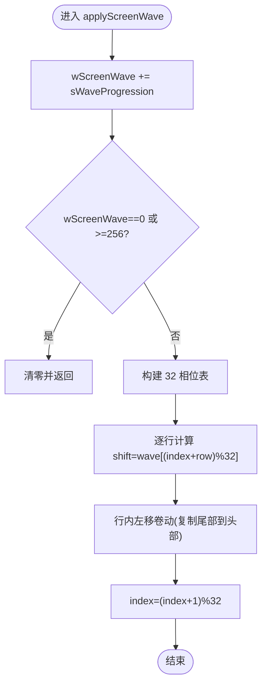
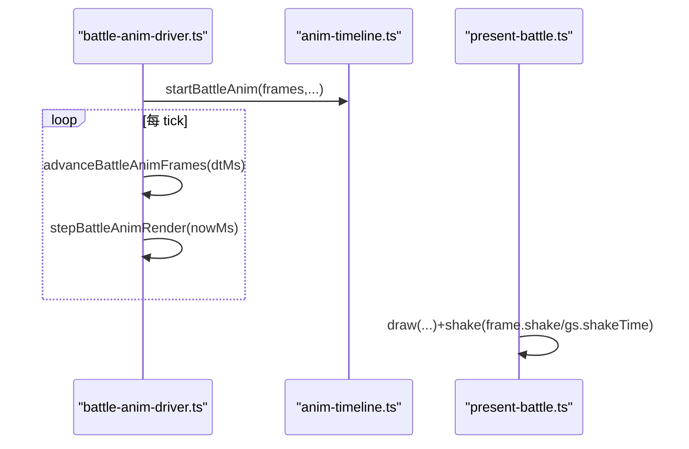
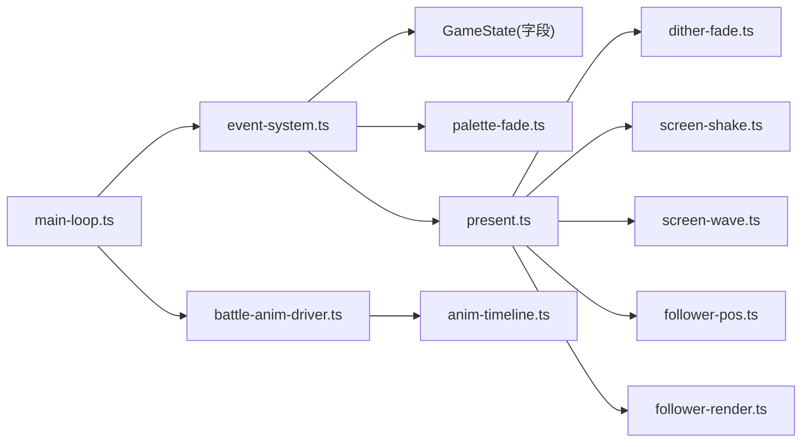

# 动画系统

<cite>
**本文引用的文件**   
- [present.ts](file://packages/game/src/present/present.ts)
- [dither-fade.ts](file://packages/game/src/present/dither-fade.ts)
- [screen-shake.ts](file://packages/game/src/present/screen-shake.ts)
- [screen-wave.ts](file://packages/game/src/present/screen-wave.ts)
- [follower-pos.ts](file://packages/game/src/present/follower-pos.ts)
- [follower-render.ts](file://packages/game/src/present/follower-render.ts)
- [palette-fade.ts](file://packages/game/src/core/palette-fade.ts)
- [event-system.ts](file://packages/game/src/core/event-system.ts)
- [battle-anim-driver.ts](file://packages/game/src/core/battle/battle-anim-driver.ts)
- [anim-timeline.ts](file://packages/game/src/core/battle/anim-timeline.ts)
- [main-loop.ts](file://packages/game/src/shell/main-loop.ts)
- [fps-overlay.ts](file://packages/game/src/tools/fps-overlay.ts)
</cite>

## 目录
1. [简介](#简介)
2. [项目结构](#项目结构)
3. [核心组件](#核心组件)
4. [架构总览](#架构总览)
5. [详细组件分析](#详细组件分析)
6. [依赖关系分析](#依赖关系分析)
7. [性能与优化](#性能与优化)
8. [故障排查指南](#故障排查指南)
9. [结论](#结论)
10. [附录：示例与最佳实践](#附录示例与最佳实践)

## 简介
本文件系统性梳理 Type-Pal 的动画系统，覆盖转场动画（抖动淡入淡出、调色板渐变）、屏幕特效（震动、波纹扭曲）、跟随者渲染（路径计算、碰撞避让、动画同步），以及时序控制（帧率同步、插值、性能优化）和调试监控方法。文档以“代码级”为依据，提供可视化图示与可追溯来源，帮助读者快速理解并扩展动画效果。

## 项目结构
动画系统横跨表现层（present）、核心逻辑（core）、战斗动画驱动（battle）与运行时主循环（shell）。关键模块职责如下：
- present 层：负责帧合成、特效叠加、精灵绘制、对话框与菜单覆盖、最终输出到 Canvas。
- core 层：事件脚本调度、调色板 fade 引擎、游戏状态管理。
- battle 层：战斗动画时间线构建与驱动，按固定步长推进逻辑与视觉。
- shell 层：rAF 主循环、逻辑 tick 聚合、FPS 统计。



图表来源
- [present.ts:166-686](file://packages/game/src/present/present.ts#L166-L686)
- [dither-fade.ts:1-45](file://packages/game/src/present/dither-fade.ts#L1-L45)
- [screen-shake.ts:1-55](file://packages/game/src/present/screen-shake.ts#L1-L55)
- [screen-wave.ts:1-72](file://packages/game/src/present/screen-wave.ts#L1-L72)
- [follower-pos.ts:1-85](file://packages/game/src/present/follower-pos.ts#L1-L85)
- [follower-render.ts:1-65](file://packages/game/src/present/follower-render.ts#L1-L65)
- [palette-fade.ts:1-326](file://packages/game/src/core/palette-fade.ts#L1-L326)
- [event-system.ts:1-800](file://packages/game/src/core/event-system.ts#L1-L800)
- [battle-anim-driver.ts:108-204](file://packages/game/src/core/battle/battle-anim-driver.ts#L108-L204)
- [anim-timeline.ts:1-22](file://packages/game/src/core/battle/anim-timeline.ts#L1-L22)
- [main-loop.ts:59-181](file://packages/game/src/shell/main-loop.ts#L59-L181)
- [fps-overlay.ts:33-110](file://packages/game/src/tools/fps-overlay.ts#L33-L110)

章节来源
- [present.ts:166-686](file://packages/game/src/present/present.ts#L166-L686)
- [event-system.ts:1-800](file://packages/game/src/core/event-system.ts#L1-L800)
- [main-loop.ts:59-181](file://packages/game/src/shell/main-loop.ts#L59-L181)

## 核心组件
- 抖色淡入淡出（Nibble Dither Fade）：基于两缓冲（当前帧与备份帧）的低四位 nibble 渐进混合，实现主角在场景切换时全程可见的平滑过渡。
- 调色板渐变（Palette Ramp Fade）：通过修改 256 色 LUT 实现淡入/淡出/场景淡入淡出/纯色过渡等，支持 lerp 与 approach 两种数学模型。
- 屏幕震动（Screen Shake）：整幅垂直奇偶交替平移 + 黑条填充，模拟冲击感。
- 屏幕波动（Screen Wave）：逐行循环卷动 + 相位表，产生水波/热浪效果。
- 跟随者渲染：队员与额外跟随者的位置/朝向/帧选择与 Y-sort 同队列，含碰撞避让与冻结态保持。
- 战斗动画驱动：时间线构建与推进，逻辑与视觉分离，保证伤害数字与特效时机一致。
- 主循环与时序：rAF 驱动、逻辑间隔聚合、fade 期间补帧策略、FPS 统计。

章节来源
- [dither-fade.ts:1-45](file://packages/game/src/present/dither-fade.ts#L1-L45)
- [palette-fade.ts:1-326](file://packages/game/src/core/palette-fade.ts#L1-L326)
- [screen-shake.ts:1-55](file://packages/game/src/present/screen-shake.ts#L1-L55)
- [screen-wave.ts:1-72](file://packages/game/src/present/screen-wave.ts#L1-L72)
- [follower-pos.ts:1-85](file://packages/game/src/present/follower-pos.ts#L1-L85)
- [follower-render.ts:1-65](file://packages/game/src/present/follower-render.ts#L1-L65)
- [battle-anim-driver.ts:108-204](file://packages/game/src/core/battle/battle-anim-driver.ts#L108-L204)
- [anim-timeline.ts:1-22](file://packages/game/src/core/battle/anim-timeline.ts#L1-L22)
- [main-loop.ts:59-181](file://packages/game/src/shell/main-loop.ts#L59-L181)

## 架构总览
下图展示从 rAF 主循环到具体动画效果的调用链路与数据流。



图表来源
- [main-loop.ts:59-181](file://packages/game/src/shell/main-loop.ts#L59-L181)
- [event-system.ts:1544-1561](file://packages/game/src/core/event-system.ts#L1544-L1561)
- [present.ts:166-686](file://packages/game/src/present/present.ts#L166-L686)
- [dither-fade.ts:1-45](file://packages/game/src/present/dither-fade.ts#L1-L45)
- [palette-fade.ts:1-326](file://packages/game/src/core/palette-fade.ts#L1-L326)
- [screen-shake.ts:1-55](file://packages/game/src/present/screen-shake.ts#L1-L55)
- [screen-wave.ts:1-72](file://packages/game/src/present/screen-wave.ts#L1-L72)

## 详细组件分析

### 转场动画：抖动淡入淡出（Nibble Dither Fade）
- 算法原理
  - 使用两个 8-bit indexed framebuffer：当前帧 current 与备份帧 backup。
  - 每帧执行一个 (outer, inner) step：对 stride=6 的像素组，将 target 的高四位立即写入 backup，低四位逐步向 target 逼近，形成平滑过渡。
  - 总步数 72（12 outer × 6 inner），按 wall-clock 进度计算目标步数，rAF 慢则一帧多跑几步追赶。
- 关键流程
  - 启动 fade：记录 startTimeMs、totalMs、appliedSteps、backupPixels。
  - 每帧：根据 elapsed/totalMs 计算 targetSteps，调用 applyDitherSteps 推进 [appliedSteps, targetSteps)，再将 backup 拷贝回 current 显示。
  - 完成：当 progress≥1 时停止推进，确保最终完全等于 backup（即新场景帧）。



图表来源
- [present.ts:606-643](file://packages/game/src/present/present.ts#L606-L643)
- [dither-fade.ts:1-45](file://packages/game/src/present/dither-fade.ts#L1-L45)

章节来源
- [present.ts:606-643](file://packages/game/src/present/present.ts#L606-L643)
- [dither-fade.ts:1-45](file://packages/game/src/present/dither-fade.ts#L1-L45)

### 转场动画：调色板渐变（Palette Ramp Fade）
- 数学模型
  - lerp：线性插值 start↔target，支持 fade60/fade63 量化分支（比例缩放，对齐 sdlpal 位移位运算）。
  - approach：每通道朝 target 移动至多 increment×stepN，用于 ColorFade/FadeToRed。
- 构造器
  - buildFadeOut/buildFadeIn/buildSceneFade/buildPaletteFade/buildColorFade/buildFadeToRed 分别对应不同 opcode 行为。
  - 支持 freeze（冻屏淡黑）、skipIndex（文字色不染红）、remap（fb 像素重映射）。
- 应用与收尾
  - stepPaletteFade 每帧原地修改 gs.palette.colors；finalizePaletteFade 精确补齐终值（考虑 SceneFade fadeIn 不补满 100% 的差异）。

```mermaid
classDiagram
class PaletteFadeState {
+RGB[] startColors
+RGB[] targetColors
+number startTimeMs
+number totalMs
+string mode
+number steps
+number increment
+number skipIndex
+{from : number,to : number} remap
+boolean freeze
+string fade60
+string fade63
}
class PaletteFadeAPI {
+buildFadeOut(...)
+buildFadeIn(...)
+buildSceneFade(...)
+buildPaletteFade(...)
+buildColorFade(...)
+buildFadeToRed(...)
+stepPaletteFade(colors, pf, nowMs)
+finalizePaletteFade(colors, pf)
}
PaletteFadeAPI --> PaletteFadeState : "创建/推进/收尾"
```

图表来源
- [palette-fade.ts:1-326](file://packages/game/src/core/palette-fade.ts#L1-L326)

章节来源
- [palette-fade.ts:1-326](file://packages/game/src/core/palette-fade.ts#L1-L326)
- [present.ts:181-201](file://packages/game/src/present/present.ts#L181-L201)

### 屏幕特效：震动（Screen Shake）
- 触发与参数
  - 事件脚本设置 shakeTime/shakeLevel；level∈[1, 199] 有效。
- 算法要点
  - 奇帧：源顶部裁掉 level 行，整幅上移 level，底部填黑。
  - 偶帧：源 row 0..199-level 下移 level，顶部填黑。
  - 每帧末尾自减 shakeTime（除非 advance=false 的 fade-only 补帧）。
- 适用阶段
  - 在所有图层+精灵+fade+菜单装配完成后施加，对齐 sdlpal 输出阶段。



图表来源
- [screen-shake.ts:1-55](file://packages/game/src/present/screen-shake.ts#L1-L55)
- [present.ts:677-685](file://packages/game/src/present/present.ts#L677-L685)

章节来源
- [screen-shake.ts:1-55](file://packages/game/src/present/screen-shake.ts#L1-L55)
- [present.ts:677-685](file://packages/game/src/present/present.ts#L677-L685)

### 屏幕特效：波纹扭曲（Screen Wave）
- 触发与参数
  - 事件脚本设置 wScreenWave/sWaveProgression；每帧累加，越界清零关闭。
- 算法要点
  - 32 相位偏移表：a/b 递推生成 wave[i]，wave[i+16]=320-wave[i]。
  - 逐行左移卷动，每行相位=(index+row)%32，index 每帧+1。
  - 在两层 tilemap 绘制后、sprite 之前应用，仅影响地图层。



图表来源
- [screen-wave.ts:1-72](file://packages/game/src/present/screen-wave.ts#L1-L72)
- [present.ts:292-296](file://packages/game/src/present/present.ts#L292-L296)

章节来源
- [screen-wave.ts:1-72](file://packages/game/src/present/screen-wave.ts#L1-L72)
- [present.ts:292-296](file://packages/game/src/present/present.ts#L292-L296)

### 跟随者渲染系统
- 位置与朝向
  - walking=true：基于 trail[1]+方向偏移，撞墙回退到 trail[1]；朝向取 trail[2].dir。
  - walking=false：冻结快照（位置偏移+朝向），避免骑乘/演出期重叠跳变；未捕获快照时直接取 trail[m]。
- 帧选择
  - 队长：walking 优先 trail 帧，否则 scriptedFrame 或站立帧。
  - 队员：同队长规则，但各自角色 sprite 独立。
  - 额外跟随者（opcode 0x98）：恒 3 帧步序列 [0,2,0,1]，sprite num 为 operand 直接作为 MGO chunk。
- 渲染排序
  - 统一 Y-sort 队列，sort key=world.y+wLayer+10，cover tile 重画 layer-1 以正确遮挡。

```mermaid
classDiagram
class FollowerPosState {
+party : {x,y}
+trail : TrailEntry[]
+walking : boolean
+frozenOffset : (FollowerFrozen|null)[]
}
class FollowerRenderItem {
+worldX : number
+worldY : number
+frameIdx : number
+spriteNum : number
+followerIndex : number
}
class computeFollowerWorldPos {
+compute(s,m,isWalkable) {x,y,dir}|null
}
class computeFollowerRenderItems {
+compute(trail,followers,walking,stepFrame) FollowerRenderItem[]
}
FollowerPosState --> computeFollowerWorldPos : "输入"
TrailEntry --> computeFollowerRenderItems : "输入"
computeFollowerRenderItems --> FollowerRenderItem : "输出"
```

图表来源
- [follower-pos.ts:1-85](file://packages/game/src/present/follower-pos.ts#L1-L85)
- [follower-render.ts:1-65](file://packages/game/src/present/follower-render.ts#L1-L65)
- [present.ts:373-490](file://packages/game/src/present/present.ts#L373-L490)

章节来源
- [follower-pos.ts:1-85](file://packages/game/src/present/follower-pos.ts#L1-L85)
- [follower-render.ts:1-65](file://packages/game/src/present/follower-render.ts#L1-L65)
- [present.ts:373-490](file://packages/game/src/present/present.ts#L373-L490)

### 战斗动画时序控制
- 时间线构建：纯函数产出 BattleAnimFrame[]，包含 fighters/overlays/damageNums/shake 等。
- 驱动推进：advanceBattleAnimFrames 按 dtMs 推进逻辑帧；stepBattleAnimRender 惰性锚点对齐视觉帧。
- 与呈现层集成：present-battle 在 draw 末尾施加 shake（若 frame.shake 或 gs.shakeTime 非零）。



图表来源
- [battle-anim-driver.ts:108-204](file://packages/game/src/core/battle/battle-anim-driver.ts#L108-L204)
- [anim-timeline.ts:1-22](file://packages/game/src/core/battle/anim-timeline.ts#L1-L22)
- [present-battle.ts:347-360](file://packages/game/src/present/battle/present-battle.ts#L347-L360)

章节来源
- [battle-anim-driver.ts:108-204](file://packages/game/src/core/battle/battle-anim-driver.ts#L108-L204)
- [anim-timeline.ts:1-22](file://packages/game/src/core/battle/anim-timeline.ts#L1-L22)
- [present-battle.ts:347-360](file://packages/game/src/present/battle/present-battle.ts#L347-L360)

## 依赖关系分析
- 耦合与内聚
  - present.ts 高度内聚于帧合成与特效叠加，依赖 dither-fade/screen-shake/screen-wave/follower-* 等纯函数模块，降低耦合。
  - event-system.ts 通过 GameState 字段与 present.ts 解耦，仅写状态，不直接操作渲染。
  - palette-fade.ts 提供通用 ramp 引擎，被 event-system 与 present 共同消费。
- 外部依赖
  - Canvas 2D 输出（flushToCanvas）。
  - SDL 真值参考（reference/sdlpal）用于行为对齐。
- 潜在环与规避
  - event-system 与 scene-system 通过注入回调（setObstacleChecker）避免反向 import 成环。



图表来源
- [event-system.ts:1-800](file://packages/game/src/core/event-system.ts#L1-L800)
- [present.ts:166-686](file://packages/game/src/present/present.ts#L166-L686)
- [battle-anim-driver.ts:108-204](file://packages/game/src/core/battle/battle-anim-driver.ts#L108-L204)
- [main-loop.ts:59-181](file://packages/game/src/shell/main-loop.ts#L59-L181)

章节来源
- [event-system.ts:1-800](file://packages/game/src/core/event-system.ts#L1-L800)
- [present.ts:166-686](file://packages/game/src/present/present.ts#L166-L686)
- [battle-anim-driver.ts:108-204](file://packages/game/src/core/battle/battle-anim-driver.ts#L108-L204)
- [main-loop.ts:59-181](file://packages/game/src/shell/main-loop.ts#L59-L181)

## 性能与优化
- 帧率同步
  - rAF 主循环维护 accumulator，按模式设定逻辑 interval（探索 100ms、战斗 40ms），fade 期间允许补帧追赶但不提速逻辑。
- 插值与追赶
  - dither fade 与 palette fade 均按 wall-clock 进度计算目标步数，rAF 慢时一帧多推进，保证时长一致。
- 内存与分配
  - 接缝修复 mask 复用同一缓冲，避免每帧分配 64KB。
  - screen-wave 每行临时缓冲复用，减少 GC。
- 剔除与裁剪
  - NPC 屏外剔除发生在 AddSpriteToDraw 与 cover tile 计算之前，减少无效绘制。
- 特效计数门控
  - DM32:false 模式下（fade-only 补帧），wave/shake 计数器不推进，避免快进。

章节来源
- [main-loop.ts:59-181](file://packages/game/src/shell/main-loop.ts#L59-L181)
- [present.ts:154-164](file://packages/game/src/present/present.ts#L154-L164)
- [present.ts:548-557](file://packages/game/src/present/present.ts#L548-L557)
- [screen-wave.ts:1-72](file://packages/game/src/present/screen-wave.ts#L1-L72)

## 故障排查指南
- 淡屏卡死或对话键无效
  - 检查 paletteFadeState 孤儿：等待中（palette-fade/scene-fade）不应被 present 提前清掉，否则 waiting handler 防御分支导致重复运行。
  - 确认 needToFadeIn 自动淡入仅在 PAL_MakeScene 语义点触发，避免误亮屏。
- 淡出后永久黑屏
  - 确认 tickSceneAutoFadeIn 在 explore 或特定 event waiting 中被调用，且未处于 loading/fade 进行中。
- 战斗震屏不显示
  - 检查 present-battle 是否在 draw 末尾施加 shake（frame.shake 或 gs.shakeTime）。
- 跟随者重叠/朝向错乱
  - 核对 frozenOffset 捕获时机：walking 时捕获，not walking 时冻结位置与朝向；0x46 摆位应取 trail[m] 而非 trail[1]+offset。
- 波纹过快或提前结束
  - 确认 DM32:false 时 advanceEffects=false，wave/shake 计数不推进。

章节来源
- [event-system.ts:645-671](file://packages/game/src/core/event-system.ts#L645-L671)
- [present.ts:181-201](file://packages/game/src/present/present.ts#L181-L201)
- [present-battle.ts:347-360](file://packages/game/src/present/battle/present-battle.ts#L347-L360)
- [follower-pos.ts:1-85](file://packages/game/src/present/follower-pos.ts#L1-L85)

## 结论
Type-Pal 动画系统以“忠实还原 sdlpal 行为”为核心目标，采用模块化设计将转场、特效、跟随者与战斗动画解耦，并通过 wall-clock 驱动的插值与追赶机制保证跨平台时序一致性。配合完善的调试工具与性能门控，可在保真与性能之间取得良好平衡。

## 附录：示例与最佳实践

### 如何创建新的屏幕特效
- 步骤
  - 新增特效函数（如 applyNewEffect(indices, gs, advance)），遵循 320×200 索引缓冲约定。
  - 在 presentFrame 合适阶段调用（地图层后、sprite 前或全部绘制后）。
  - 在 GameState 增加必要字段，并在事件脚本中设置。
  - 若需 DM32:false 兼容，传入 advanceEffects 控制是否推进内部计数。
- 参考路径
  - [screen-wave.ts:1-72](file://packages/game/src/present/screen-wave.ts#L1-L72)
  - [screen-shake.ts:1-55](file://packages/game/src/present/screen-shake.ts#L1-L55)
  - [present.ts:292-296](file://packages/game/src/present/present.ts#L292-L296)

### 如何自定义转场效果
- 调色板渐变
  - 使用 palette-fade.ts 的构造器组合新效果（lerp/approach、freeze/remap/skipIndex）。
  - 在 event-system 中注册新 opcode 或通过现有 fade 组合达成。
  - 参考路径：
    - [palette-fade.ts:116-249](file://packages/game/src/core/palette-fade.ts#L116-L249)
    - [event-system.ts:571-598](file://packages/game/src/core/event-system.ts#L571-L598)
- 抖色淡入淡出
  - 复用 applyDitherSteps，调整 totalMs 与起始/终止步数即可定制节奏。
  - 参考路径：
    - [dither-fade.ts:1-45](file://packages/game/src/present/dither-fade.ts#L1-L45)
    - [present.ts:606-643](file://packages/game/src/present/present.ts#L606-L643)

### 动画系统的时序控制机制
- 帧率同步
  - main-loop.ts 维护 accumulator，clamp 避免 catch-up 过多 tick。
  - 参考路径：
    - [main-loop.ts:59-181](file://packages/game/src/shell/main-loop.ts#L59-L181)
- 插值计算
  - dither/palette 均按 elapsed/totalMs 计算 progress，再映射到步数或颜色值。
  - 参考路径：
    - [present.ts:628-643](file://packages/game/src/present/present.ts#L628-L643)
    - [palette-fade.ts:258-302](file://packages/game/src/core/palette-fade.ts#L258-L302)
- 性能优化策略
  - 复用缓冲、屏外剔除、DM32:false 门控、菜单只在 menu 模式绘制。
  - 参考路径：
    - [present.ts:154-164](file://packages/game/src/present/present.ts#L154-L164)
    - [present.ts:655-675](file://packages/game/src/present/present.ts#L655-L675)

### 调试工具与性能监控
- FPS 覆盖层
  - 每 ~500ms 刷新一次，便于观察卡顿与帧率稳定性。
  - 参考路径：
    - [fps-overlay.ts:33-110](file://packages/game/src/tools/fps-overlay.ts#L33-L110)
- 状态导出与回放
  - 结合 dev/state-dump 与 e2e 差分测试，定位时序差异。
  - 参考路径：
    - [main-loop.ts:162-181](file://packages/game/src/shell/main-loop.ts#L162-L181)