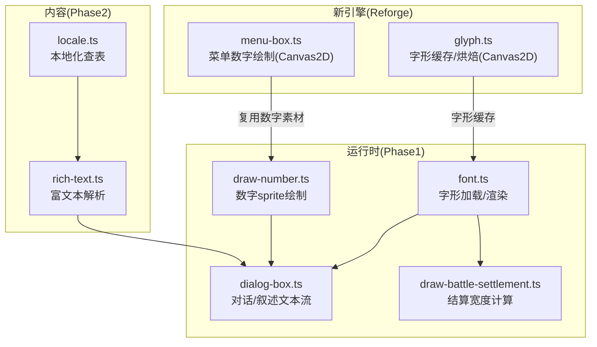
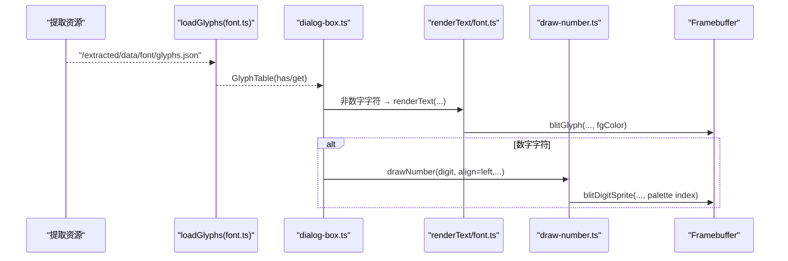
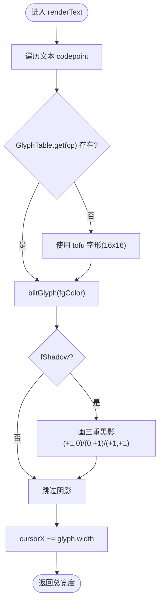
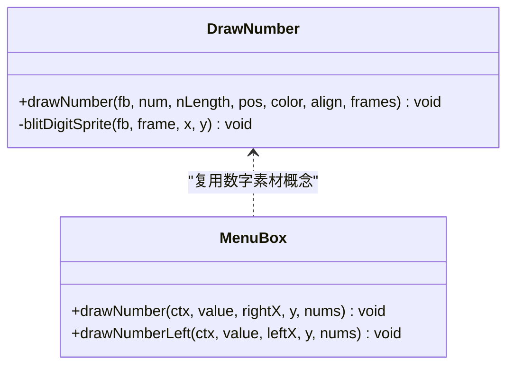
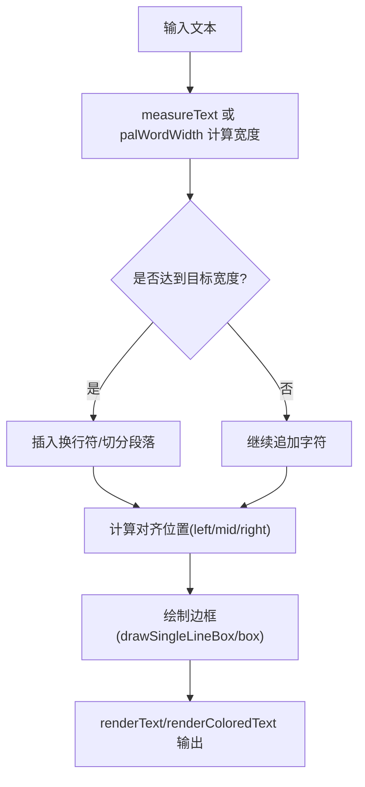
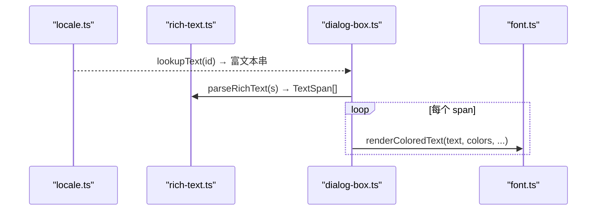
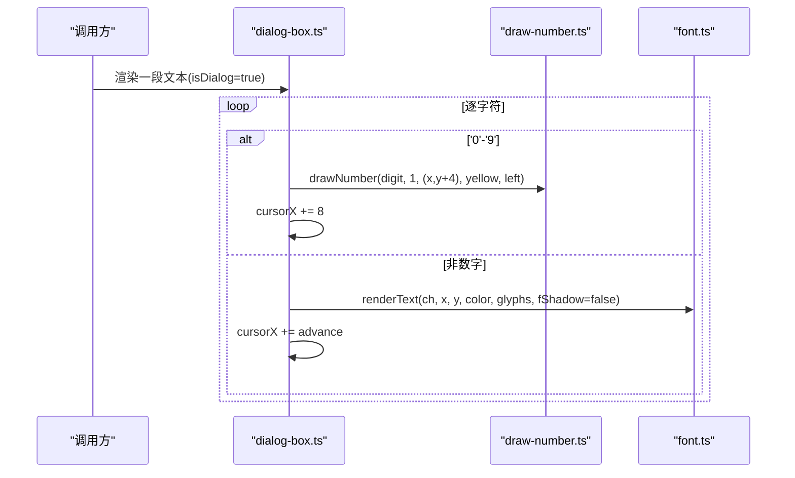
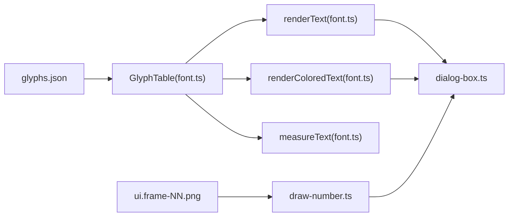

# 字体文本系统

<cite>
**本文引用的文件**   
- [font.ts](file://packages/game/src/present/font.ts)
- [draw-number.ts](file://packages/game/src/present/draw-number.ts)
- [dialog-box.ts](file://packages/game/src/present/dialog-box.ts)
- [rich-text.ts](file://packages/content/src/rich-text.ts)
- [locale.ts](file://packages/content/src/locale.ts)
- [menu-box.ts](file://packages/reforge/src/menu/menu-box.ts)
- [glyph.ts](file://packages/reforge/src/text/glyph.ts)
- [draw-battle-settlement.ts](file://packages/game/src/present/battle/draw-battle-settlement.ts)
- [font.test.ts](file://packages/game/src/present/font.test.ts)
</cite>

## 目录
1. [简介](#简介)
2. [项目结构](#项目结构)
3. [核心组件](#核心组件)
4. [架构总览](#架构总览)
5. [详细组件分析](#详细组件分析)
6. [依赖关系分析](#依赖关系分析)
7. [性能考量](#性能考量)
8. [故障排查指南](#故障排查指南)
9. [结论](#结论)
10. [附录](#附录)

## 简介
本文件系统性梳理 Type-Pal 的字体与文本渲染子系统，覆盖中文字体点阵加载、字符编码处理、多语言支持、数字显示（伤害/经验/金钱等）、文本布局（换行、对齐、边框绘制）、动画表现、扩展接口与国际化方案，并给出性能优化策略与可操作示例路径。

## 项目结构
围绕“字体文本系统”的关键代码分布在以下模块：
- 游戏运行时（Phase1）
  - 字形加载与渲染：packages/game/src/present/font.ts
  - 数字 sprite 绘制：packages/game/src/present/draw-number.ts
  - 对话框集成（逐字/数字混排）：packages/game/src/present/dialog-box.ts
  - 结算界面宽度计算辅助：packages/game/src/present/battle/draw-battle-settlement.ts
- 内容层（Phase2）
  - 富文本解析：<color>…</color> 标记 → TextSpan[]：packages/content/src/rich-text.ts
  - 本地化查表：packages/content/src/locale.ts
- 新引擎（Reforge，Phase2）
  - 菜单数字绘制（Canvas2D）：packages/reforge/src/menu/menu-box.ts
  - 字形缓存与烘焙（Canvas2D）：packages/reforge/src/text/glyph.ts
- 测试与规格对照
  - 字形宽度与渲染行为验证：packages/game/src/present/font.test.ts

图表来源
- [font.ts:105-131](file://packages/game/src/present/font.ts#L105-L131)
- [draw-number.ts:61-109](file://packages/game/src/present/draw-number.ts#L61-L109)
- [dialog-box.ts:813-839](file://packages/game/src/present/dialog-box.ts#L813-L839)
- [rich-text.ts:10-24](file://packages/content/src/rich-text.ts#L10-L24)
- [locale.ts:7-9](file://packages/content/src/locale.ts#L7-L9)
- [menu-box.ts:188-206](file://packages/reforge/src/menu/menu-box.ts#L188-L206)
- [glyph.ts:64-87](file://packages/reforge/src/text/glyph.ts#L64-L87)
- [draw-battle-settlement.ts:48-57](file://packages/game/src/present/battle/draw-battle-settlement.ts#L48-L57)

章节来源
- [font.ts:105-131](file://packages/game/src/present/font.ts#L105-L131)
- [draw-number.ts:61-109](file://packages/game/src/present/draw-number.ts#L61-L109)
- [dialog-box.ts:813-839](file://packages/game/src/present/dialog-box.ts#L813-L839)
- [rich-text.ts:10-24](file://packages/content/src/rich-text.ts#L10-L24)
- [locale.ts:7-9](file://packages/content/src/locale.ts#L7-L9)
- [menu-box.ts:188-206](file://packages/reforge/src/menu/menu-box.ts#L188-L206)
- [glyph.ts:64-87](file://packages/reforge/src/text/glyph.ts#L64-L87)
- [draw-battle-settlement.ts:48-57](file://packages/game/src/present/battle/draw-battle-settlement.ts#L48-L57)

## 核心组件
- 字形表与加载器
  - Glyph/GlyphTable 抽象：按 codepoint 查询位图字形；提供 has/get 访问语义。
  - loadGlyphs：从 /extracted/data/font/glyphs.json 异步加载预处理的 Unifont CN BDF 产物，解码为 Uint8Array 位图。
- 文本渲染
  - renderText：逐 codepoint 查找字形，缺失回退 tofu 框；可选三重阴影（黑偏移 + 主色）。
  - renderColoredText：逐字符上色版本，适配对话控制符解析后的颜色序列。
  - measureText：不写屏测量像素宽度，用于布局。
  - palCharWidth/palWordWidth：近似 sdlpal 的半角/全宽计数，用于菜单/结算等布局公式。
- 数字显示
  - drawNumber：基于 SPRITEUI 数字 sprite（6×8），支持 yellow/blue/cyan 三套 base frame，left/mid/right 对齐，R-to-L 绘制。
  - 菜单数字（Canvas2D）：drawNumber/drawNumberLeft 在 Reforge 中使用 ImageBitmap 绘制。
- 富文本与本地化
  - parseRichText：解析 <cyan>/<red>/<yellow> 等成对标签为 TextSpan[]。
  - lookupText：textId → 字符串，未命中返回 id 本身便于开发期发现漏填。
- 集成点
  - dialog-box：叙述模式下一整段一次性显示，数字字符走 drawNumber，其余走 renderText；默认无阴影。
  - 结算界面：使用 charWidthPx/wordWidthCols 进行宽度量化，驱动 UI 布局。

章节来源
- [font.ts:44-62](file://packages/game/src/present/font.ts#L44-L62)
- [font.ts:105-131](file://packages/game/src/present/font.ts#L105-L131)
- [font.ts:140-165](file://packages/game/src/present/font.ts#L140-L165)
- [font.ts:174-185](file://packages/game/src/present/font.ts#L174-L185)
- [font.ts:196-209](file://packages/game/src/present/font.ts#L196-L209)
- [draw-number.ts:61-109](file://packages/game/src/present/draw-number.ts#L61-L109)
- [menu-box.ts:188-206](file://packages/reforge/src/menu/menu-box.ts#L188-L206)
- [rich-text.ts:10-24](file://packages/content/src/rich-text.ts#L10-L24)
- [locale.ts:7-9](file://packages/content/src/locale.ts#L7-L9)
- [dialog-box.ts:813-839](file://packages/game/src/present/dialog-box.ts#L813-L839)
- [draw-battle-settlement.ts:48-57](file://packages/game/src/present/battle/draw-battle-settlement.ts#L48-L57)

## 架构总览
下图展示从数据到屏幕的端到端流程：资源提取 → 字形表 → 文本/数字渲染 → 对话框/菜单/结算等场景集成。

图表来源
- [font.ts:44-62](file://packages/game/src/present/font.ts#L44-L62)
- [font.ts:105-131](file://packages/game/src/present/font.ts#L105-L131)
- [draw-number.ts:61-109](file://packages/game/src/present/draw-number.ts#L61-L109)
- [dialog-box.ts:813-839](file://packages/game/src/present/dialog-box.ts#L813-L839)

## 详细组件分析

### 字形加载与渲染（font.ts）
- 数据结构
  - Glyph：width(8/16)、height(16)、bitmap(Uint8Array 位图)。
  - GlyphTable：has/get 接口，屏蔽具体存储实现。
- 关键流程
  - loadGlyphs：fetch glyphs.json → Map<codepoint, Glyph> → 返回 GlyphTable。
  - renderText：遍历 codepoint → get(glyph) → 可选 triple shadow → 写入 Framebuffer。
  - renderColoredText：按 colors[i] 逐字符着色，缺省回退默认色。
  - measureText：累加各字形 width，缺失时按 16 回退。
  - palCharWidth/palWordWidth：近似 sdlpal 的半角/全宽计数，用于布局公式。
- 错误与回退
  - glyphs.json 不可达抛错。
  - 缺失字形以 tofu 框占位，保证布局稳定。

图表来源
- [font.ts:105-131](file://packages/game/src/present/font.ts#L105-L131)

章节来源
- [font.ts:14-23](file://packages/game/src/present/font.ts#L14-L23)
- [font.ts:44-62](file://packages/game/src/present/font.ts#L44-L62)
- [font.ts:105-131](file://packages/game/src/present/font.ts#L105-L131)
- [font.ts:140-165](file://packages/game/src/present/font.ts#L140-L165)
- [font.ts:174-185](file://packages/game/src/present/font.ts#L174-L185)
- [font.ts:196-209](file://packages/game/src/present/font.ts#L196-L209)

### 数字显示系统（draw-number.ts 与 menu-box.ts）
- 运行时（Phase1）
  - drawNumber：根据 color 选择 base frame（yellow/blue/cyan），计算 nActualLength 与对齐起点，R-to-L 逐个 digit sprite 写入 Framebuffer。
  - DIGIT_WIDTH=6，每帧 6×8，对齐模式 left/mid/right 严格遵循 sdlpal ui.c 真值。
- 新引擎（Reforge）
  - drawNumber/drawNumberLeft：基于 ImageBitmap 的数字素材，右对齐/左对齐两种用法。
- 典型用途
  - 对话中的数字字符（黄色、左对齐、y+4 偏移）。
  - 主菜单金钱横卷轴右侧数字（右对齐）。
  - 战斗结算数值展示。

图表来源
- [draw-number.ts:61-109](file://packages/game/src/present/draw-number.ts#L61-L109)
- [menu-box.ts:188-206](file://packages/reforge/src/menu/menu-box.ts#L188-L206)

章节来源
- [draw-number.ts:61-109](file://packages/game/src/present/draw-number.ts#L61-L109)
- [menu-box.ts:188-206](file://packages/reforge/src/menu/menu-box.ts#L188-L206)

### 文本布局算法（换行、对齐、边框）
- 宽度量化
  - palCharWidth：ASCII<0x80→8px，CJK→16px。
  - palWordWidth：(ΣcharWidth + 8)>>4，返回“全宽字数”，用于菜单项定位。
  - 结算界面：charWidthPx/wordWidthCols 同逻辑，驱动 UI 元素宽度。
- 对齐与边框
  - 单行边框 drawSingleLineBox：左头 + 中段重复 + 右头，支持阴影一行。
  - 通用 box：四边 + 中心 tileFill，左右列宽取实际块尺寸，避免纹理拉伸。
- 换行
  - 当前实现以逐字符 advance 为主；长文本换行可在上层依据 measureText 与目标宽度进行切分（建议策略见“扩展接口”）。

图表来源
- [font.ts:196-209](file://packages/game/src/present/font.ts#L196-L209)
- [draw-battle-settlement.ts:48-57](file://packages/game/src/present/battle/draw-battle-settlement.ts#L48-L57)

章节来源
- [font.ts:196-209](file://packages/game/src/present/font.ts#L196-L209)
- [draw-battle-settlement.ts:48-57](file://packages/game/src/present/battle/draw-battle-settlement.ts#L48-L57)

### 富文本与国际化（rich-text.ts 与 locale.ts）
- 富文本
  - parseRichText：识别 <cyan>/<red>/<yellow> 等成对闭合标签，生成 TextSpan[]（含 text 与 color）。
- 本地化
  - lookupText：textId → string，未命中返回 id 自身，便于开发期发现缺失。
- 与渲染集成
  - 对话渲染：将 TextSpan 的颜色映射为逐字符颜色序列，交由 renderColoredText 输出。

图表来源
- [locale.ts:7-9](file://packages/content/src/locale.ts#L7-L9)
- [rich-text.ts:10-24](file://packages/content/src/rich-text.ts#L10-L24)
- [font.ts:140-165](file://packages/game/src/present/font.ts#L140-L165)
- [dialog-box.ts:813-839](file://packages/game/src/present/dialog-box.ts#L813-L839)

章节来源
- [rich-text.ts:10-24](file://packages/content/src/rich-text.ts#L10-L24)
- [locale.ts:7-9](file://packages/content/src/locale.ts#L7-L9)
- [font.ts:140-165](file://packages/game/src/present/font.ts#L140-L165)
- [dialog-box.ts:813-839](file://packages/game/src/present/dialog-box.ts#L813-L839)

### 对话框集成（dialog-box.ts）
- 叙述模式（narration）：整段一次性显示，数字字符走 drawNumber（黄色、左对齐、y+4），其余走 renderText（无阴影）。
- 游标步进：数字字符按 PAL_CharWidth=8 步进，digit sprite 仍 6px，形成固定间隙。
- 颜色：isDialog + DEFAULT → color=0（黑），其他控制符映射青色/红色等。

图表来源
- [dialog-box.ts:813-839](file://packages/game/src/present/dialog-box.ts#L813-L839)
- [draw-number.ts:61-109](file://packages/game/src/present/draw-number.ts#L61-L109)
- [font.ts:105-131](file://packages/game/src/present/font.ts#L105-L131)

章节来源
- [dialog-box.ts:813-839](file://packages/game/src/present/dialog-box.ts#L813-L839)

## 依赖关系分析
- 低耦合接口
  - GlyphTable 作为字形源抽象，renderText/renderColoredText/measureText 仅依赖该接口。
  - drawNumber 通过 IndexedImage[] 获取数字 sprite，与字形系统解耦。
- 外部依赖
  - glyphs.json 由提取管线产出，位于 /extracted/data/font/。
  - SPRITEUI 数字帧来自 images/ui/frame-NN.png（bake 后暴露）。
- 潜在循环
  - 当前未见循环依赖；渲染层与内容层通过纯函数与类型隔离。

图表来源
- [font.ts:44-62](file://packages/game/src/present/font.ts#L44-L62)
- [font.ts:105-131](file://packages/game/src/present/font.ts#L105-L131)
- [draw-number.ts:61-109](file://packages/game/src/present/draw-number.ts#L61-L109)
- [dialog-box.ts:813-839](file://packages/game/src/present/dialog-box.ts#L813-L839)

章节来源
- [font.ts:44-62](file://packages/game/src/present/font.ts#L44-L62)
- [font.ts:105-131](file://packages/game/src/present/font.ts#L105-L131)
- [draw-number.ts:61-109](file://packages/game/src/present/draw-number.ts#L61-L109)
- [dialog-box.ts:813-839](file://packages/game/src/present/dialog-box.ts#L813-L839)

## 性能考量
- 字形缓存
  - Phase1：GlyphTable 内存常驻，避免重复 I/O；缺失字形 tofu 占位，减少分支开销。
  - Reforge：bakeGlyph 按 (cp, rgba) 缓存 HTMLCanvasElement，避免重复 decodeGlyph 与 putImageData。
- 批量绘制
  - 对话框/菜单/结算等场景尽量合并一次帧内绘制，减少跨层切换。
  - 数字绘制采用 R-to-L 顺序，配合固定步长，利于流水线化。
- 内存管理
  - glyphs.json 解码为 Uint8Array，注意大体积时的首帧耗时；建议在启动阶段预取并缓存。
  - Sprite 帧数组 uiSpriteFrames 全局复用，避免重复加载。
- 布局计算
  - 优先使用 palCharWidth/palWordWidth 做快速估算，仅在需要精确像素时使用 measureText。

章节来源
- [font.ts:44-62](file://packages/game/src/present/font.ts#L44-L62)
- [glyph.ts:64-87](file://packages/reforge/src/text/glyph.ts#L64-L87)
- [draw-number.ts:61-109](file://packages/game/src/present/draw-number.ts#L61-L109)

## 故障排查指南
- glyphs.json 无法加载
  - 现象：初始化时报 fetch 失败。
  - 排查：确认 /extracted/data/font/glyphs.json 是否存在且可访问；检查 baseUrl 配置。
- 出现大量 tofu 框
  - 现象：部分字符显示为空心框。
  - 排查：确认 glyphs.json 包含对应 codepoint；必要时扩展 Unifont 子集或增加 fallback 字体。
- 数字间距异常
  - 现象：对话中数字之间间隙过大或过小。
  - 排查：确认数字字符步进使用 PAL_CharWidth=8，而 digit sprite 宽度为 6，二者差异导致固定间隙属预期。
- 对齐错位
  - 现象：数字右对齐/居中不对。
  - 排查：核对 nLength 与实际位数 nActualLength 的计算，以及 align 分支的起始 x 计算公式。

章节来源
- [font.ts:44-62](file://packages/game/src/present/font.ts#L44-L62)
- [dialog-box.ts:813-839](file://packages/game/src/present/dialog-box.ts#L813-L839)
- [draw-number.ts:61-109](file://packages/game/src/present/draw-number.ts#L61-L109)

## 结论
Type-Pal 的字体文本系统以 GlyphTable 为核心抽象，结合 sprites-based 数字绘制与富文本/本地化能力，实现了与 sdlpal 高度一致的中文点阵渲染体验。通过明确的接口边界与严格的布局公式，系统在保真度与可扩展性之间取得平衡，并为后续动画、换行与多语言扩展提供了清晰路径。

## 附录

### 如何添加新字体（示例路径）
- 准备字形数据
  - 将新的点阵字形导出为 glyphs.json（codepoint/width/height/bitmapBase64）。
  - 放置于 /extracted/data/font/glyphs.json（或自定义 baseUrl）。
- 接入加载器
  - 参考 loadGlyphs 的实现，确保返回符合 GlyphTable 接口的对象。
  - 若需多套字体，可封装 FontRegistry 维护多个 GlyphTable。
- 替换渲染入口
  - 在对话框/菜单/结算等调用处传入新的 GlyphTable。
- 参考路径
  - [font.ts:44-62](file://packages/game/src/present/font.ts#L44-L62)
  - [font.ts:105-131](file://packages/game/src/present/font.ts#L105-L131)

### 自定义文本样式（示例路径）
- 颜色控制
  - 使用 renderColoredText 传入逐字符颜色数组，实现对话控制符效果。
- 阴影效果
  - 开启 fShadow 参数启用三重黑影（DOS 风格）。
- 参考路径
  - [font.ts:140-165](file://packages/game/src/present/font.ts#L140-L165)
  - [font.ts:105-131](file://packages/game/src/present/font.ts#L105-L131)

### 数字动画与特效（思路）
- 入场缩放/弹跳：在 Canvas2D 侧对数字 ImageBitmap 应用 transform 与缓动。
- 滚动更新：对变化位做增量重绘，避免整行重排。
- 参考路径
  - [menu-box.ts:188-206](file://packages/reforge/src/menu/menu-box.ts#L188-L206)
  - [draw-number.ts:61-109](file://packages/game/src/present/draw-number.ts#L61-L109)

### 文本换行与对齐（扩展建议）
- 换行策略
  - 基于 measureText 累计宽度，超过目标宽度时在词边界或字符边界切分。
- 对齐策略
  - 使用 palWordWidth 计算“全宽列数”，再换算像素坐标，统一 left/mid/right 对齐。
- 参考路径
  - [font.ts:174-185](file://packages/game/src/present/font.ts#L174-L185)
  - [font.ts:196-209](file://packages/game/src/present/font.ts#L196-L209)
  - [draw-battle-settlement.ts:48-57](file://packages/game/src/present/battle/draw-battle-settlement.ts#L48-L57)

### 国际化支持方案
- 文本组织
  - 使用 locale.ts 的 Locale 记录，lookupText 统一查表。
- 富文本
  - 在文案中使用 <color>…</color> 标记，parseRichText 解析为 TextSpan[]。
- 参考路径
  - [locale.ts:7-9](file://packages/content/src/locale.ts#L7-L9)
  - [rich-text.ts:10-24](file://packages/content/src/rich-text.ts#L10-L24)

### 测试与规格对照
- 字形宽度与渲染行为
  - font.test.ts 验证 ASCII/CJK 宽度、renderText 像素写入与 measureText 结果。
- 参考路径
  - [font.test.ts:30-66](file://packages/game/src/present/font.test.ts#L30-L66)