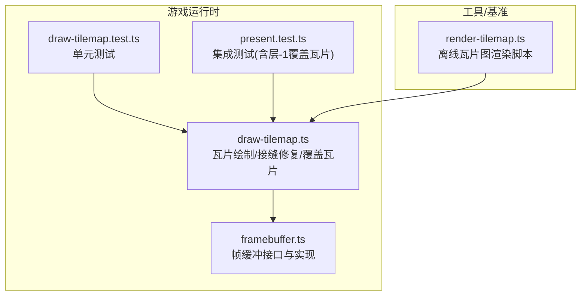
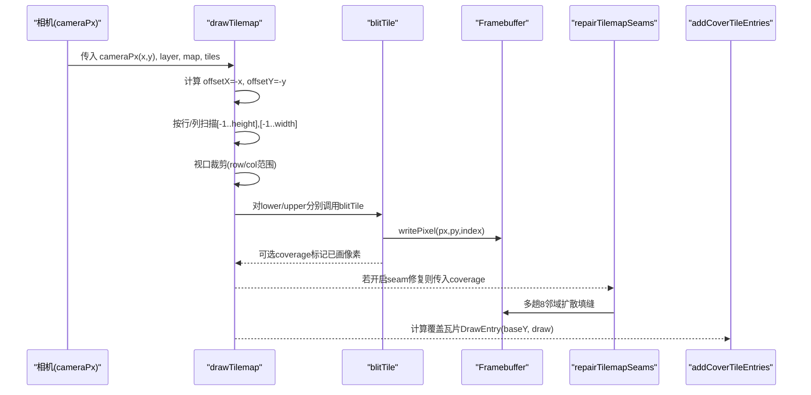
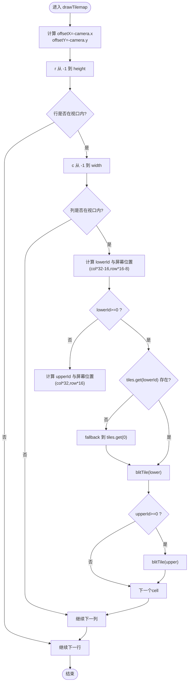
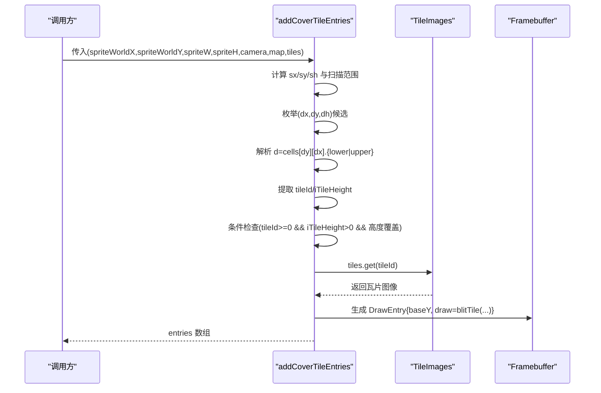
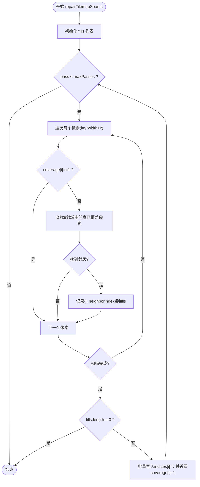
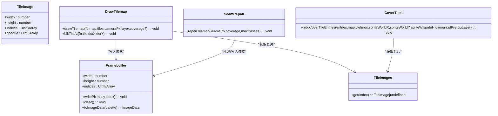

# 地图瓦片渲染

<cite>
**本文引用的文件**
- [draw-tilemap.ts](file://packages/game/src/present/draw-tilemap.ts)
- [framebuffer.ts](file://packages/game/src/present/framebuffer.ts)
- [draw-tilemap.test.ts](file://packages/game/src/present/draw-tilemap.test.ts)
- [present.test.ts](file://packages/game/src/present/present.test.ts)
- [render-tilemap.ts](file://packages/pal-extract/scripts/render-tilemap.ts)
</cite>

## 目录
1. [简介](#简介)
2. [项目结构](#项目结构)
3. [核心组件](#核心组件)
4. [架构总览](#架构总览)
5. [详细组件分析](#详细组件分析)
6. [依赖关系分析](#依赖关系分析)
7. [性能考虑](#性能考虑)
8. [故障排查指南](#故障排查指南)
9. [结论](#结论)
10. [附录](#附录)

## 简介
本文件聚焦 Type-Pal 的地图瓦片渲染系统，围绕以下目标展开：
- 瓦片图集与 TileImages 数据结构的设计与管理机制
- drawTilemap 函数的完整渲染流程：视口裁剪、坐标计算、批量绘制优化
- 双层瓦片系统（layer 0 底层 + layer 1 顶层）的实现原理，包括覆盖瓦片（cover tile）的计算与重绘逻辑
- 接缝修复算法 repairTilemapSeams，解决透明像素导致的黑色缝隙问题
- 如何添加新瓦片类型与自定义绘制效果的实践路径
- 渲染性能优化指南：视口优化、瓦片缓存、绘制批处理等

## 项目结构
与地图瓦片渲染直接相关的代码位于 packages/game/src/present 下，包含帧缓冲抽象与瓦片绘制实现；另有一份用于离线基准对比的脚本位于 packages/pal-extract/scripts。

图表来源
- [draw-tilemap.ts:1-384](file://packages/game/src/present/draw-tilemap.ts#L1-L384)
- [framebuffer.ts:1-50](file://packages/game/src/present/framebuffer.ts#L1-L50)
- [draw-tilemap.test.ts:1-174](file://packages/game/src/present/draw-tilemap.test.ts#L1-L174)
- [present.test.ts:1093-1120](file://packages/game/src/present/present.test.ts#L1093-L1120)
- [render-tilemap.ts:152-248](file://packages/pal-extract/scripts/render-tilemap.ts#L152-L248)

章节来源
- [draw-tilemap.ts:1-384](file://packages/game/src/present/draw-tilemap.ts#L1-L384)
- [framebuffer.ts:1-50](file://packages/game/src/present/framebuffer.ts#L1-L50)
- [draw-tilemap.test.ts:1-174](file://packages/game/src/present/draw-tilemap.test.ts#L1-L174)
- [present.test.ts:1093-1120](file://packages/game/src/present/present.test.ts#L1093-L1120)
- [render-tilemap.ts:152-248](file://packages/pal-extract/scripts/render-tilemap.ts#L152-L248)

## 核心组件
- 帧缓冲 Framebuffer：提供 writePixel/clear/toImageData 等基础能力，作为所有光栅化写入的目标。
- 瓦片图像 TileImage：描述单个瓦片的尺寸、索引数据与不透明掩码 opaque。
- 瓦片图集接口 TileImages：通过 get(index) 返回对应瓦片图像，支持按需加载或缓存。
- 双层瓦片系统：每个 cell 同时编码 layer 0 与 layer 1 的 9-bit 瓦片 ID 及高度信息。
- 覆盖瓦片 addCoverTileEntries：根据精灵位置与高度，计算可能遮挡精灵的顶层瓦片并生成 DrawEntry。
- 接缝修复 repairTilemapSeams：对未被任何瓦片覆盖的像素进行邻域扩散填充，避免“黑色三角”。

章节来源
- [framebuffer.ts:1-50](file://packages/game/src/present/framebuffer.ts#L1-L50)
- [draw-tilemap.ts:21-33](file://packages/game/src/present/draw-tilemap.ts#L21-L33)
- [draw-tilemap.ts:31-33](file://packages/game/src/present/draw-tilemap.ts#L31-L33)
- [draw-tilemap.ts:35-53](file://packages/game/src/present/draw-tilemap.ts#L35-L53)
- [draw-tilemap.ts:255-383](file://packages/game/src/present/draw-tilemap.ts#L255-L383)
- [draw-tilemap.ts:169-208](file://packages/game/src/present/draw-tilemap.ts#L169-L208)

## 架构总览
下图展示了从相机到屏幕的关键数据流与调用顺序：相机坐标 → 视口偏移 → 双层瓦片遍历与裁剪 → blitTile 写入帧缓冲 → 可选 coverage 记录 → 接缝修复 → 上层精灵与覆盖瓦片排序绘制。

图表来源
- [draw-tilemap.ts:92-151](file://packages/game/src/present/draw-tilemap.ts#L92-L151)
- [draw-tilemap.ts:55-80](file://packages/game/src/present/draw-tilemap.ts#L55-L80)
- [draw-tilemap.ts:169-208](file://packages/game/src/present/draw-tilemap.ts#L169-L208)
- [draw-tilemap.ts:255-383](file://packages/game/src/present/draw-tilemap.ts#L255-L383)
- [framebuffer.ts:20-49](file://packages/game/src/present/framebuffer.ts#L20-L49)

## 详细组件分析

### 瓦片图集与 TileImages 设计
- TileImage 包含 width、height、indices(Uint8Array)、opaque(Uint8Array)。opaque 用于区分“RLE跳过”和“合法的不透明调色板索引0”，避免将 palette-0 误判为透明。
- TileImages 是只读接口，get(index) 返回瓦片图像或 undefined。运行时可基于 Map/WeakMap 实现缓存，或在切换场景时路由到不同 scene 的图集。

章节来源
- [draw-tilemap.ts:21-33](file://packages/game/src/present/draw-tilemap.ts#L21-L33)
- [draw-tilemap.ts:31-33](file://packages/game/src/present/draw-tilemap.ts#L31-L33)

### 双层瓦片系统与 cell 编码
- 每个 u32 cell 同时编码两个 9-bit 瓦片 ID：
  - layer 0（底层）：低 16 位中取 (d & 0xff) | ((d >> 4) & 0x100)
  - layer 1（顶层）：高 16 位中取 ((hi & 0xff) | ((hi >> 4) & 0x100)) - 1，id=0 表示无瓦片
- 高度字段：
  - layer 0：(d >> 8) & 0xf
  - layer 1：(d >> 24) & 0xf
- 视觉分层：
  - layer 0 先绘制，代表地面/墙基
  - layer 1 后绘制，代表门/柜子侧面/柱子等遮挡物，通常画在精灵之上

章节来源
- [draw-tilemap.ts:35-53](file://packages/game/src/present/draw-tilemap.ts#L35-L53)
- [draw-tilemap.ts:331-346](file://packages/game/src/present/draw-tilemap.ts#L331-L346)

### drawTilemap 渲染流程
- 视口裁剪：camera 语义为 sdlpal viewport（屏幕左上 world 坐标），screen = world - camera。据此计算 offsetX=-camera.x, offsetY=-camera.y。
- 菱形错排公式：
  - h=0（lower）：xPos = col*32 - 16, yPos = row*16 - 8
  - h=1（upper）：xPos = col*32, yPos = row*16
- ±1 fence 边界处理：
  - layer 0 越界回落到 cells[0][0].lower 的 h=0 瓦片
  - layer 1 越界直接跳过（fenceFill=-1）
- 早裁剪：整行/整列不在视口内则跳过，减少无效访问
- 缺失帧兜底：layer 0 若 tiles.get(lowerId) 返回 undefined，则 fallback 到 tiles.get(0)；layer 1 仍跳过

图表来源
- [draw-tilemap.ts:92-151](file://packages/game/src/present/draw-tilemap.ts#L92-L151)

章节来源
- [draw-tilemap.ts:92-151](file://packages/game/src/present/draw-tilemap.ts#L92-L151)

### 覆盖瓦片（cover tile）计算与重绘
- 目的：当精灵移动时，某些高层瓦片会遮挡精灵，需要按 Y-sort 重新绘制这些 cover tile，确保正确遮挡关系。
- 输入：精灵世界坐标 spriteWorldX/Y、宽高 spriteW/H、相机 camera、当前 tilemap 与图集。
- 扫描范围：依据 sy=spriteWorldY-iLayer 与 sh=(sx%32!==0)?1:0 确定候选行列区间。
- 候选点：对每个 (x,y) 最多 5 个候选 (dx,dy,dh)，dh=0 选 lower DWORD，dh=1 选 upper DWORD。
- 条件过滤：tileId>=0、iTileHeight>0、且 (dy+iTileHeight)*16+dh*8 >= sy。
- 输出：为每个符合条件的 cover tile 构造 DrawEntry{baseY, draw, id}，由上层统一排序后绘制。

图表来源
- [draw-tilemap.ts:255-383](file://packages/game/src/present/draw-tilemap.ts#L255-L383)

章节来源
- [draw-tilemap.ts:255-383](file://packages/game/src/present/draw-tilemap.ts#L255-L383)

### 接缝修复算法 repairTilemapSeams
- 背景：原版 PAL_MakeScene 不清屏，接缝处显示上一帧邻接地形；我们每帧 fb.clear() 到 index 0，导致透明像素缝隙露黑（如血池“黑色三角”）。
- 思路：在两层 base tilemap 画完后，用 coverage mask 识别“确实没被任何瓦片画过”的像素，用最近的已覆盖邻居像素填充。逐趟向内扩散（dilation），薄缝一两趟即填满；相机越过地图边缘的大片屏外空洞因无邻居自然留黑。
- 关键点：使用 coverage 而非 indices===0 判断漏黑，因为瓦片可合法画出 opaque index-0 像素。

图表来源
- [draw-tilemap.ts:169-208](file://packages/game/src/present/draw-tilemap.ts#L169-L208)

章节来源
- [draw-tilemap.ts:169-208](file://packages/game/src/present/draw-tilemap.ts#L169-L208)

### 单元测试与行为验证
- drawTilemap 测试覆盖了：
  - lower(h=0) 与 upper(h=1) 的相对落点
  - ±1 fence 行为：layer 0 回落到 cells[0][0].lower 的 h=0；layer 1 跳过
  - 9-bit tile id 提取与 layer 1 的 -1 偏移
  - coverage 标记的正确性
- present.test 验证了 layer-1 覆盖瓦片参与 Y-sort 的条件与 baseY 计算。

章节来源
- [draw-tilemap.test.ts:6-137](file://packages/game/src/present/draw-tilemap.test.ts#L6-L137)
- [draw-tilemap.test.ts:139-173](file://packages/game/src/present/draw-tilemap.test.ts#L139-L173)
- [present.test.ts:1093-1120](file://packages/game/src/present/present.test.ts#L1093-L1120)

### 离线渲染脚本对照
- render-tilemap.ts 提供了离线渲染瓦片图的参考实现，采用相同的 blitTile 与 fence 策略，便于与运行时 draw-tilemap.ts 对齐 baseline。

章节来源
- [render-tilemap.ts:152-209](file://packages/pal-extract/scripts/render-tilemap.ts#L152-L209)
- [render-tilemap.ts:211-228](file://packages/pal-extract/scripts/render-tilemap.ts#L211-L228)

## 依赖关系分析
- draw-tilemap.ts 依赖 framebuffer.ts 的写像素接口与 toImageData 转换。
- TileImages 为外部注入的图集接口，可由资源管理器或场景上下文提供。
- addCoverTileEntries 与 drawTilemap 共享 tileId 提取与 blitTile 逻辑，保证一致性与可维护性。

图表来源
- [framebuffer.ts:1-50](file://packages/game/src/present/framebuffer.ts#L1-L50)
- [draw-tilemap.ts:21-33](file://packages/game/src/present/draw-tilemap.ts#L21-L33)
- [draw-tilemap.ts:92-151](file://packages/game/src/present/draw-tilemap.ts#L92-L151)
- [draw-tilemap.ts:255-383](file://packages/game/src/present/draw-tilemap.ts#L255-L383)
- [draw-tilemap.ts:169-208](file://packages/game/src/present/draw-tilemap.ts#L169-L208)

章节来源
- [framebuffer.ts:1-50](file://packages/game/src/present/framebuffer.ts#L1-L50)
- [draw-tilemap.ts:21-33](file://packages/game/src/present/draw-tilemap.ts#L21-L33)
- [draw-tilemap.ts:92-151](file://packages/game/src/present/draw-tilemap.ts#L92-L151)
- [draw-tilemap.ts:255-383](file://packages/game/src/present/draw-tilemap.ts#L255-L383)
- [draw-tilemap.ts:169-208](file://packages/game/src/present/draw-tilemap.ts#L169-L208)

## 性能考虑
- 视口裁剪：
  - 行/列级早裁剪，避免无效循环与内存访问
  - 利用 ROW_Y_STEP/SUBROW_Y_STEP 精确计算行覆盖范围，减少越界判断
- 瓦片缓存：
  - 在 TileImages 实现中引入 Map/WeakMap 缓存瓦片图像对象，降低重复分配
  - 结合场景切换，按 sceneId 路由图集，避免全局大图集带来的查找开销
- 绘制批处理：
  - 优先使用 blitTile 的紧凑循环与 opaque 掩码跳过透明像素
  - 将覆盖瓦片收集为 DrawEntry 数组，统一排序后批量绘制，减少分支与状态切换
- 接缝修复：
  - 仅在必要时启用 repairTilemapSeams，并通过 maxPasses 限制扩散次数
  - 使用模块级 coverage buffer 复用，避免每帧分配

章节来源
- [draw-tilemap.ts:92-151](file://packages/game/src/present/draw-tilemap.ts#L92-L151)
- [draw-tilemap.ts:169-208](file://packages/game/src/present/draw-tilemap.ts#L169-L208)

## 故障排查指南
- “黑色三角”现象：
  - 原因：fb.clear() 到 index 0，透明像素缝隙暴露纯黑
  - 解决：启用 repairTilemapSeams，并确保传入正确的 coverage mask
- 瓦片错位/锯齿：
  - 原因：lower/upper 子行偏移错误或 fence 缺失
  - 解决：确认 drawTilemap 中的偏移公式与 fenceFill 逻辑
- layer 0 缺失帧留黑：
  - 原因：tiles.get(lowerId) 返回 undefined 未 fallback
  - 解决：确保 fallback 到 tiles.get(0) 的逻辑生效
- 覆盖瓦片遮挡不正确：
  - 原因：baseY 计算或 iLayer 参数不一致
  - 解决：核对 addCoverTileEntries 的 baseY 与 iLayer 传递

章节来源
- [draw-tilemap.ts:92-151](file://packages/game/src/present/draw-tilemap.ts#L92-L151)
- [draw-tilemap.ts:169-208](file://packages/game/src/present/draw-tilemap.ts#L169-L208)
- [draw-tilemap.ts:255-383](file://packages/game/src/present/draw-tilemap.ts#L255-L383)

## 结论
Type-Pal 的地图瓦片渲染系统以严格的 sdlpal 行为对齐为目标，实现了双层瓦片、菱形错排、±1 fence、覆盖瓦片 Y-sort 以及接缝修复等关键特性。通过 TileImages 接口解耦图集管理，配合视口裁剪与批处理策略，可在保持兼容性的同时获得良好的运行效率。后续演进建议逐步向 GPU instancing 迁移，以消除 CPU 光栅化瓶颈与接缝修复 workaround。

## 附录

### 添加新瓦片类型的步骤
- 定义瓦片图像：
  - 准备 width、height、indices(Uint8Array)、opaque(Uint8Array)
  - 确保 opaque 正确标记 RLE-skip 与不透明像素
- 注册到图集：
  - 在 TileImages 的 get(index) 中返回对应瓦片图像
  - 可按场景或资源包组织图集映射
- 在地图数据中引用：
  - 在 cell.lower/upper 中设置对应的 9-bit tile id 与高度字段
  - 如需覆盖效果，确保 layer 1 的 iTileHeight > 0

章节来源
- [draw-tilemap.ts:21-33](file://packages/game/src/present/draw-tilemap.ts#L21-L33)
- [draw-tilemap.ts:35-53](file://packages/game/src/present/draw-tilemap.ts#L35-L53)

### 自定义瓦片绘制效果
- 扩展 TileImage：
  - 增加额外属性（如动画帧、混合模式）并在 blitTile 中应用
- 自定义 blitTile：
  - 在 draw-tilemap.ts 中新增专用 blit 函数，保留 opaque 掩码与边界检查
- 覆盖瓦片定制：
  - 在 addCoverTileEntries 中调整 baseY 或绘制回调，实现特殊遮挡效果

章节来源
- [draw-tilemap.ts:55-80](file://packages/game/src/present/draw-tilemap.ts#L55-L80)
- [draw-tilemap.ts:255-383](file://packages/game/src/present/draw-tilemap.ts#L255-L383)