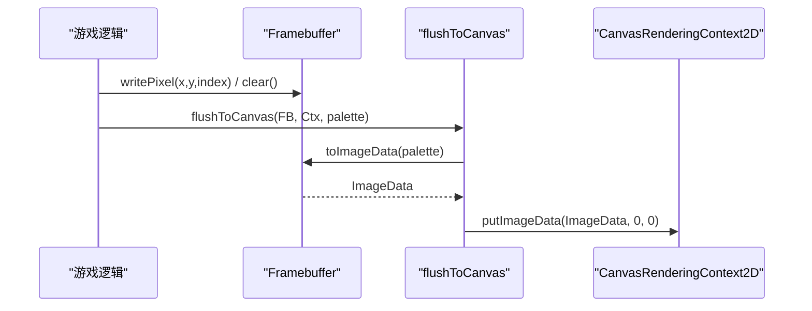
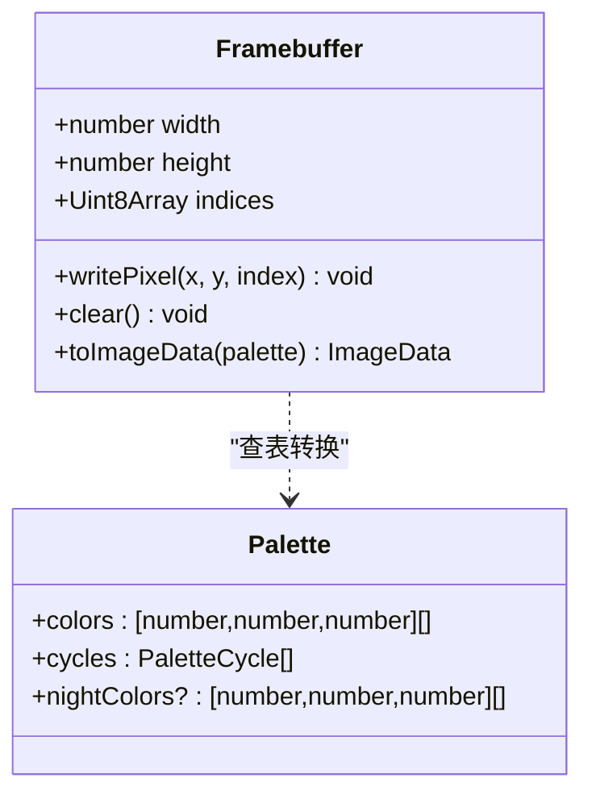
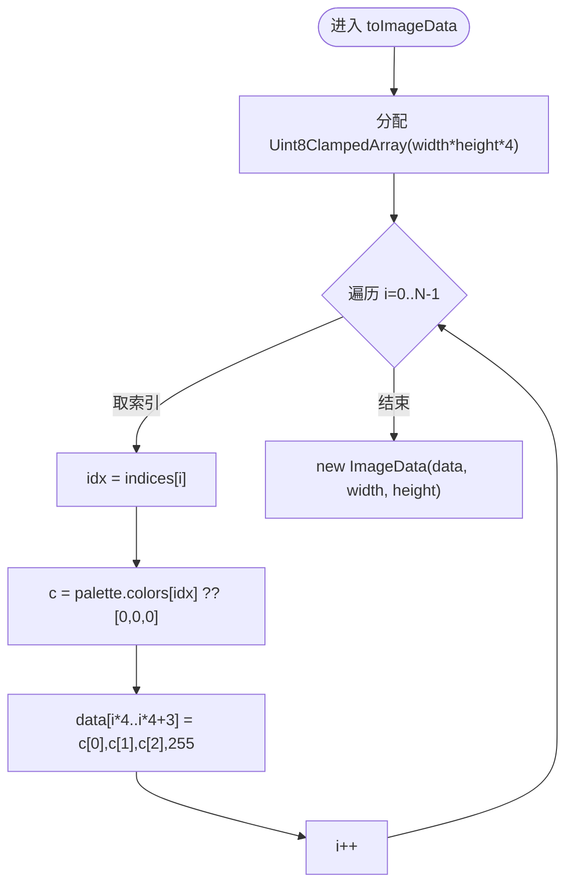

# 帧缓冲系统

<cite>
**本文引用的文件**   
- [packages/game/src/present/framebuffer.ts](file://packages/game/src/present/framebuffer.ts)
- [packages/game/src/present/framebuffer.test.ts](file://packages/game/src/present/framebuffer.test.ts)
- [packages/shared/src/resources.ts](file://packages/shared/src/resources.ts)
- [packages/game/src/shell/splash-fallback.ts](file://packages/game/src/shell/splash-fallback.ts)
- [docs/phase1/plans/2026-05-23-m2-runtime-slice.md](file://docs/phase1/plans/2026-05-23-m2-runtime-slice.md)
</cite>

## 目录
1. [简介](#简介)
2. [项目结构](#项目结构)
3. [核心组件](#核心组件)
4. [架构总览](#架构总览)
5. [详细组件分析](#详细组件分析)
6. [依赖关系分析](#依赖关系分析)
7. [性能考虑](#性能考虑)
8. [故障排查指南](#故障排查指南)
9. [结论](#结论)
10. [附录](#附录)

## 简介
本文件聚焦 Type-Pal 第一阶段（忠实还原）的“帧缓冲系统”，围绕 320×200 软件索引帧缓冲的实现与使用展开，覆盖以下要点：
- 数据结构：Uint8Array 像素索引缓冲区、调色板 Palette 类型定义。
- 调色板映射机制：索引到 RGBA 的查表转换。
- ImageData 转换流程：toImageData 生成 Canvas 2D 可上屏的数据。
- 生命周期管理：创建、清空、像素写入、内存复用策略。
- 与 Canvas 2D 集成：flushToCanvas + putImageData 的上屏路径。
- 离屏渲染与批量绘制：大尺寸缓冲、降采样、批处理等实践。
- 代码示例路径：如何直接操作像素数据、实现自定义绘制效果。
- 性能调优：批量操作、内存池复用、避免频繁分配的最佳实践。

## 项目结构
帧缓冲位于 Present 层，作为游戏渲染的核心抽象；其输入是索引图（每像素一个 0–255 的调色板索引），输出是 ImageData，最终通过 Canvas 2D 的 putImageData 上屏。

```mermaid
graph TB
subgraph "Present 层"
FB["Framebuffer<br/>createFramebuffer()"]
FLUSH["flushToCanvas(fb, ctx, palette)"]
end
subgraph "共享类型"
PAL["Palette(colors, cycles, nightColors?)"]
end
subgraph "Canvas 2D"
CTX["CanvasRenderingContext2D"]
IMG["ImageData"]
end
FB --> |indices: Uint8Array| FLUSH
FLUSH --> |toImageData(palette)| IMG
IMG --> |putImageData| CTX
PAL -.-> FLUSH
```

图表来源
- [packages/game/src/present/framebuffer.ts:20-49](file://packages/game/src/present/framebuffer.ts#L20-L49)
- [packages/shared/src/resources.ts:31-42](file://packages/shared/src/resources.ts#L31-L42)
- [docs/phase1/plans/2026-05-23-m2-runtime-slice.md:2760-2767](file://docs/phase1/plans/2026-05-23-m2-runtime-slice.md#L2760-L2767)

章节来源
- [packages/game/src/present/framebuffer.ts:1-49](file://packages/game/src/present/framebuffer.ts#L1-L49)
- [packages/shared/src/resources.ts:31-42](file://packages/shared/src/resources.ts#L31-L42)
- [docs/phase1/plans/2026-05-23-m2-runtime-slice.md:2760-2767](file://docs/phase1/plans/2026-05-23-m2-runtime-slice.md#L2760-L2767)

## 核心组件
- Framebuffer 接口与默认实现
  - 提供 width/height、只读 indices 视图、writePixel/clear/toImageData 方法。
  - 默认 320×200，也支持任意尺寸的离屏缓冲（例如 dev panel 缩略图）。
- Palette 类型
  - colors: 256 个 RGB(0–255)三元组（白天盘）。
  - cycles: 调色板循环动画段（水/火等）。
  - nightColors?: 夜间调色板（可选）。

章节来源
- [packages/game/src/present/framebuffer.ts:6-14](file://packages/game/src/present/framebuffer.ts#L6-L14)
- [packages/shared/src/resources.ts:31-42](file://packages/shared/src/resources.ts#L31-L42)

## 架构总览
从逻辑帧到屏幕显示的完整链路如下：



图表来源
- [packages/game/src/present/framebuffer.ts:36-47](file://packages/game/src/present/framebuffer.ts#L36-L47)
- [docs/phase1/plans/2026-05-23-m2-runtime-slice.md:2760-2767](file://docs/phase1/plans/2026-05-23-m2-runtime-slice.md#L2760-L2767)

## 详细组件分析

### 数据结构与内存布局
- 像素缓冲区
  - 类型：Uint8Array，长度 = width × height。
  - 布局：行优先，索引为 y * width + x。
- 边界检查
  - writePixel 对越界坐标进行保护，避免非法访问。
- 初始化
  - 构造时全 0 填充，表示透明或背景色（取决于具体场景语义）。

章节来源
- [packages/game/src/present/framebuffer.ts:20-34](file://packages/game/src/present/framebuffer.ts#L20-L34)

### 调色板映射机制
- 输入：palette.colors[idx] → [r,g,b]。
- 输出：RGBA 四通道，A 固定为 255（不透明）。
- 缺失回退：若 idx 超出范围，回退为 [0,0,0]。

章节来源
- [packages/game/src/present/framebuffer.ts:36-47](file://packages/game/src/present/framebuffer.ts#L36-L47)
- [packages/shared/src/resources.ts:31-42](file://packages/shared/src/resources.ts#L31-L42)

### ImageData 转换流程
- 步骤
  - 分配 Uint8ClampedArray(width*height*4)。
  - 遍历 indices，按 palette.colors 查表写出 R/G/B/A。
  - 返回 new ImageData(data, width, height)。
- 用途
  - 供 flushToCanvas 调用 putImageData 上屏。

章节来源
- [packages/game/src/present/framebuffer.ts:36-47](file://packages/game/src/present/framebuffer.ts#L36-L47)
- [docs/phase1/plans/2026-05-23-m2-runtime-slice.md:2760-2767](file://docs/phase1/plans/2026-05-23-m2-runtime-slice.md#L2760-L2767)

### 生命周期管理
- 创建
  - createFramebuffer(width?, height?)：默认 320×200，也可用于离屏大图（如整张地图渲染后降采样）。
- 清空
  - clear()：将 indices 全部置 0。
- 像素写入
  - writePixel(x, y, index)：带边界检查的单点写入。
- 销毁/复用
  - 当前实现未内置对象池；可通过外部缓存实例并重复 clear 复用。

章节来源
- [packages/game/src/present/framebuffer.ts:20-34](file://packages/game/src/present/framebuffer.ts#L20-L34)
- [docs/phase1/plans/2026-05-23-m2-runtime-slice.md:2151-2211](file://docs/phase1/plans/2026-05-23-m2-runtime-slice.md#L2151-L2211)

### 与 Canvas 2D 的集成
- flushToCanvas
  - 调用 fb.toImageData(palette)，得到 ImageData。
  - 使用 ctx.putImageData(img, 0, 0) 上屏。
- 典型调用位置
  - splash-fallback 中封装了 renderFrame → flushToCanvas 的流程。

章节来源
- [docs/phase1/plans/2026-05-23-m2-runtime-slice.md:2760-2767](file://docs/phase1/plans/2026-05-23-m2-runtime-slice.md#L2760-L2767)
- [packages/game/src/shell/splash-fallback.ts:156-163](file://packages/game/src/shell/splash-fallback.ts#L156-L163)

### 类与接口关系图


图表来源
- [packages/game/src/present/framebuffer.ts:6-14](file://packages/game/src/present/framebuffer.ts#L6-L14)
- [packages/shared/src/resources.ts:31-42](file://packages/shared/src/resources.ts#L31-L42)

### 关键流程图：toImageData 索引→RGBA


图表来源
- [packages/game/src/present/framebuffer.ts:36-47](file://packages/game/src/present/framebuffer.ts#L36-L47)

## 依赖关系分析
- 内部依赖
  - framebuffer.ts 仅依赖 @type-pal/shared 中的 Palette 类型。
- 外部依赖
  - 运行时依赖浏览器 Canvas 2D API（ImageData、putImageData）。
- 耦合与内聚
  - Framebuffer 职责单一：维护索引缓冲并提供转换/写入能力，内聚度高。
  - 与 Canvas 2D 的耦合集中在 flushToCanvas 调用处，便于替换渲染后端。


图表来源
- [packages/game/src/present/framebuffer.ts:1-14](file://packages/game/src/present/framebuffer.ts#L1-L14)
- [docs/phase1/plans/2026-05-23-m2-runtime-slice.md:2760-2767](file://docs/phase1/plans/2026-05-23-m2-runtime-slice.md#L2760-L2767)

章节来源
- [packages/game/src/present/framebuffer.ts:1-14](file://packages/game/src/present/framebuffer.ts#L1-L14)
- [docs/phase1/plans/2026-05-23-m2-runtime-slice.md:2760-2767](file://docs/phase1/plans/2026-05-23-m2-runtime-slice.md#L2760-L2767)

## 性能考虑
- 批量像素操作
  - 优先使用区域写入（行/矩形块）减少函数调用开销；在应用层聚合多次 writePixel 为一次批量写入。
- 内存复用
  - 复用同一 Framebuffer 实例，每帧先 clear()，再重绘，避免频繁分配新数组。
- 避免频繁分配
  - toImageData 每帧都会分配新的 Uint8ClampedArray 和 ImageData；可在上层做对象池（复用 ImageData 与底层 buffer）以降低 GC 压力。
- 离屏渲染与降采样
  - 使用更大尺寸的 Framebuffer 渲染整张地图，再缩放至屏幕尺寸，可减少逐格计算与裁剪分支。
- 调色板优化
  - 预构建颜色查找表（R/G/B 三个 Uint8Array 或一维 Uint8ClampedArray）替代二维数组访问，减少属性读取与空值回退分支。
- 合并上屏
  - 将多帧合成后的结果一次性 putImageData，避免多次上屏。

[本节为通用性能建议，不直接分析具体文件，故无章节来源]

## 故障排查指南
- 现象：写像素无效或越界
  - 检查 writePixel 的坐标是否超出 [0,width) 与 [0,height)。
  - 确认 indices 长度是否为 width × height。
- 现象：颜色不正确
  - 核对 palette.colors 的长度与索引范围；确保 idx < 256。
  - 注意 toImageData 中 A 通道固定为 255，如需半透明需在上层处理。
- 现象：上屏闪烁或卡顿
  - 确认每帧仅调用一次 putImageData。
  - 评估是否可复用 ImageData 与底层 buffer，减少分配。
- 现象：离屏缓冲异常
  - 确认离屏尺寸合理，避免过大导致内存不足。
  - 若用于降采样，确保后续缩放逻辑正确。

章节来源
- [packages/game/src/present/framebuffer.ts:27-34](file://packages/game/src/present/framebuffer.ts#L27-L34)
- [packages/game/src/present/framebuffer.ts:36-47](file://packages/game/src/present/framebuffer.ts#L36-L47)

## 结论
Type-Pal 的帧缓冲系统以极简而清晰的抽象实现了 320×200 索引缓冲与调色板查表，配合 flushToCanvas 完成 Canvas 2D 上屏。该设计易于扩展（支持任意尺寸离屏缓冲）、职责清晰、测试完备。在生产环境中，建议结合对象池与批量写入进一步优化性能，并在需要时引入更高级的后处理管线。

[本节为总结性内容，不直接分析具体文件，故无章节来源]

## 附录

### 使用示例（路径指引）
- 创建与清空
  - 参考：[packages/game/src/present/framebuffer.test.ts:6-12](file://packages/game/src/present/framebuffer.test.ts#L6-L12)、[packages/game/src/present/framebuffer.test.ts:14-20](file://packages/game/src/present/framebuffer.test.ts#L14-L20)
- 单像素写入
  - 参考：[packages/game/src/present/framebuffer.test.ts:14-20](file://packages/game/src/present/framebuffer.test.ts#L14-L20)
- 调色板映射与 ImageData
  - 参考：[packages/game/src/present/framebuffer.test.ts:22-42](file://packages/game/src/present/framebuffer.test.ts#L22-L42)
- 上屏到 Canvas
  - 参考：[docs/phase1/plans/2026-05-23-m2-runtime-slice.md:2760-2767](file://docs/phase1/plans/2026-05-23-m2-runtime-slice.md#L2760-L2767)
- 精灵 blit 到帧缓冲
  - 参考：[packages/game/src/shell/splash-fallback.ts:130-154](file://packages/game/src/shell/splash-fallback.ts#L130-L154)

章节来源
- [packages/game/src/present/framebuffer.test.ts:6-42](file://packages/game/src/present/framebuffer.test.ts#L6-L42)
- [docs/phase1/plans/2026-05-23-m2-runtime-slice.md:2760-2767](file://docs/phase1/plans/2026-05-23-m2-runtime-slice.md#L2760-L2767)
- [packages/game/src/shell/splash-fallback.ts:130-154](file://packages/game/src/shell/splash-fallback.ts#L130-L154)