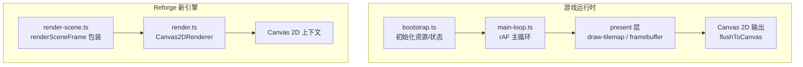
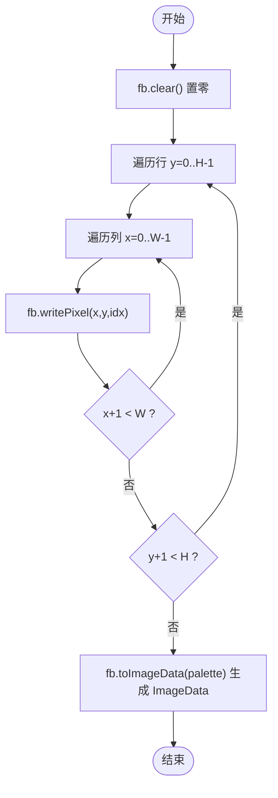
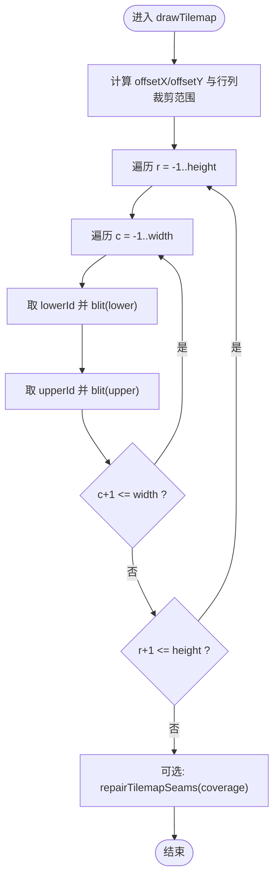
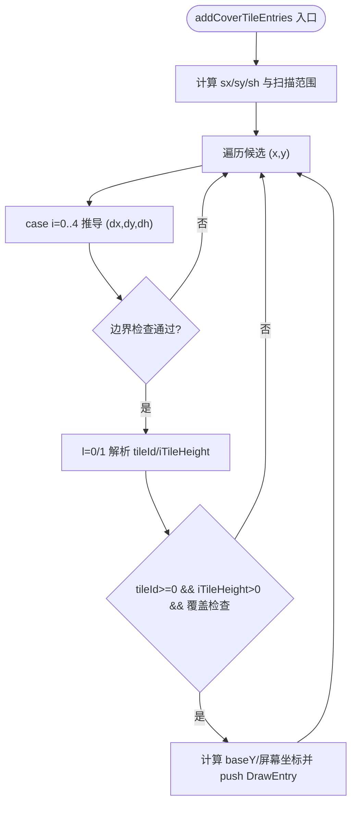
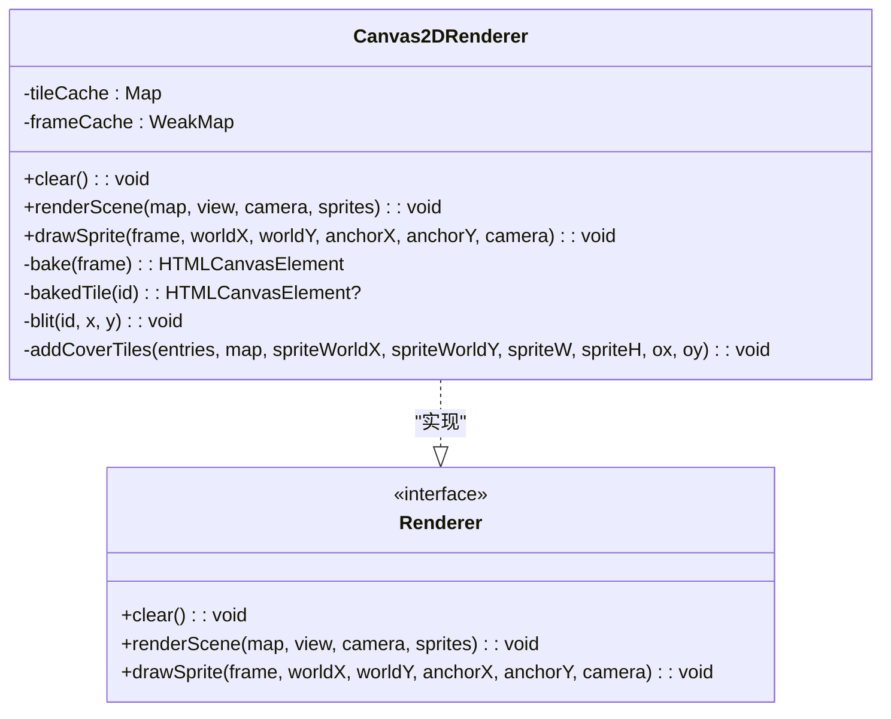
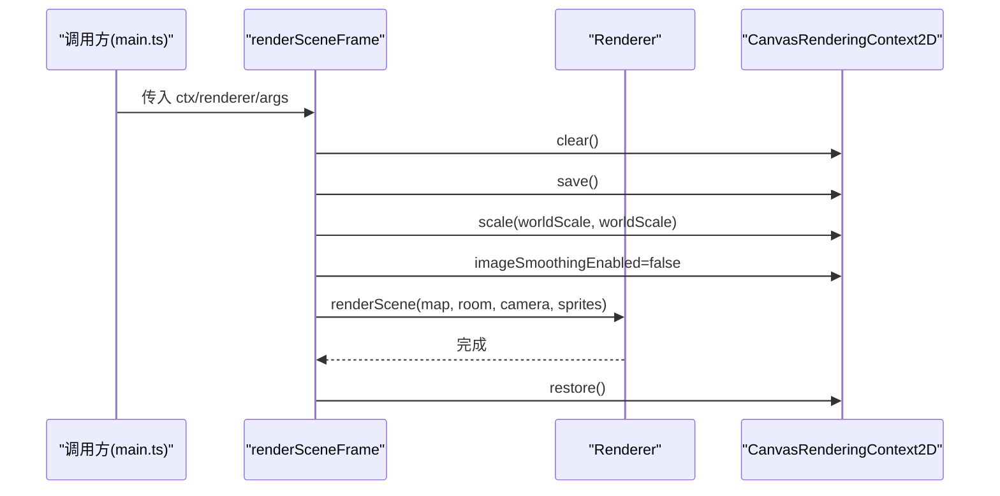
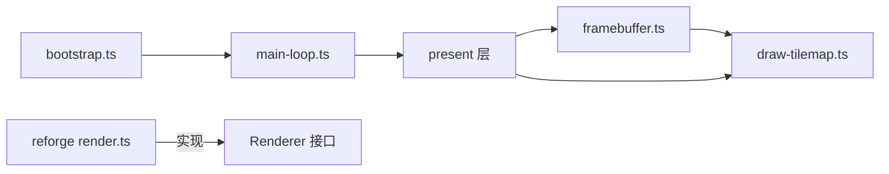

# 渲染引擎

<cite>
**本文引用的文件**   
- [packages/game/src/present/framebuffer.ts](file://packages/game/src/present/framebuffer.ts)
- [packages/game/src/present/draw-tilemap.ts](file://packages/game/src/present/draw-tilemap.ts)
- [packages/reforge/src/render.ts](file://packages/reforge/src/render.ts)
- [packages/reforge/src/render-scene.test.ts](file://packages/reforge/src/render-scene.test.ts)
- [packages/game/src/shell/bootstrap.ts](file://packages/game/src/shell/bootstrap.ts)
- [packages/game/src/shell/main-loop.ts](file://packages/game/src/shell/main-loop.ts)
- [docs/phase2/decisions.md](file://docs/phase2/decisions.md)
</cite>

## 目录
1. [简介](#简介)
2. [项目结构](#项目结构)
3. [核心组件](#核心组件)
4. [架构总览](#架构总览)
5. [详细组件分析](#详细组件分析)
6. [依赖关系分析](#依赖关系分析)
7. [性能考虑](#性能考虑)
8. [故障排查指南](#故障排查指南)
9. [结论](#结论)
10. [附录](#附录)

## 简介
本文件聚焦 Type-Pal 的渲染子系统，覆盖两条实现路径：
- 第一阶段（game）：软件索引帧缓冲 + Canvas 2D 输出。以 320×200 索引缓冲为核心，逐像素调色板映射后通过 ImageData 上屏。
- 第二阶段（reforge）：Canvas 2D 直接绘制瓦片与精灵，采用“基底两层 + 按 baseY 深度排序”的遮挡模型，并内置 cover-tile 计算以还原原版遮挡行为。

文档将解释：
- 320×200 软件索引帧缓冲的工作原理与像素级优化
- 精灵绘制算法（调色板映射、透明度处理、缩放）
- 地图瓦片渲染系统（瓦片图集管理、视口裁剪、批量绘制优化）
- 从 GameState 到渲染命令再到 Canvas 输出的完整数据流
- 如何扩展新的绘制效果与自定义精灵绘制逻辑
- 渲染性能调优（批次合并、离屏缓冲、内存管理）

## 项目结构
与渲染相关的核心位置：
- game/present：软件帧缓冲与 tilemap 绘制（第一阶段）
- reforge/src：Canvas 2D 渲染器与场景渲染封装（第二阶段）
- shell：主循环与启动流程，负责调度 present 层与 flushToCanvas



图表来源
- [packages/game/src/shell/bootstrap.ts:493-508](file://packages/game/src/shell/bootstrap.ts#L493-L508)
- [packages/game/src/shell/main-loop.ts:1-25](file://packages/game/src/shell/main-loop.ts#L1-L25)
- [packages/game/src/present/draw-tilemap.ts:92-151](file://packages/game/src/present/draw-tilemap.ts#L92-L151)
- [packages/game/src/present/framebuffer.ts:1-49](file://packages/game/src/present/framebuffer.ts#L1-L49)
- [packages/reforge/src/render.ts:87-165](file://packages/reforge/src/render.ts#L87-L165)
- [packages/reforge/src/render-scene.test.ts:1-28](file://packages/reforge/src/render-scene.test.ts#L1-L28)

章节来源
- [packages/game/src/shell/bootstrap.ts:493-508](file://packages/game/src/shell/bootstrap.ts#L493-L508)
- [packages/game/src/shell/main-loop.ts:1-25](file://packages/game/src/shell/main-loop.ts#L1-L25)
- [packages/game/src/present/draw-tilemap.ts:92-151](file://packages/game/src/present/draw-tilemap.ts#L92-L151)
- [packages/game/src/present/framebuffer.ts:1-49](file://packages/game/src/present/framebuffer.ts#L1-L49)
- [packages/reforge/src/render.ts:87-165](file://packages/reforge/src/render.ts#L87-L165)
- [packages/reforge/src/render-scene.test.ts:1-28](file://packages/reforge/src/render-scene.test.ts#L1-L28)

## 核心组件
- 320×200 索引帧缓冲（game）
  - 维护 Uint8Array 索引缓冲，writePixel 写入索引，toImageData 按 palette.colors 查表生成 RGBA ImageData 上屏。
- 瓦片绘制（game）
  - drawTilemap 实现菱形错排、双层瓦片（layer0/layer1）、视口裁剪、fence 填充与接缝修复。
- Cover-tile 与 Y-sort（game）
  - addCoverTileEntries 基于 sdlpal scene.c 真值计算可能遮挡精灵的高瓦片，作为 DrawEntry 参与 Y-sort。
- Canvas 2D 渲染器（reforge）
  - Canvas2DRenderer 提供 clear、renderScene、drawSprite；内部对瓦片与精灵进行 bake 缓存，按 baseY 排序绘制。
- 场景渲染包装（reforge）
  - renderSceneFrame 统一 clear → save → scale(worldScale) → renderScene → restore，并关闭 imageSmoothingEnabled。

章节来源
- [packages/game/src/present/framebuffer.ts:1-49](file://packages/game/src/present/framebuffer.ts#L1-L49)
- [packages/game/src/present/draw-tilemap.ts:92-151](file://packages/game/src/present/draw-tilemap.ts#L92-L151)
- [packages/game/src/present/draw-tilemap.ts:255-383](file://packages/game/src/present/draw-tilemap.ts#L255-L383)
- [packages/reforge/src/render.ts:87-165](file://packages/reforge/src/render.ts#L87-L165)
- [packages/reforge/src/render-scene.test.ts:1-28](file://packages/reforge/src/render-scene.test.ts#L1-L28)

## 架构总览
下图展示从 GameState 到 Canvas 输出的两阶段路径：

```mermaid
sequenceDiagram
participant GS as "GameState"
participant LOOP as "main-loop.ts"
participant PRESENT as "present 层"
participant FB as "framebuffer.ts"
participant CANVAS as "Canvas 2D"
LOOP->>GS : 读取当前模式/状态
alt 战斗模式
LOOP->>PRESENT : presentBattleFrame(...)
else 探索/事件模式
LOOP->>PRESENT : presentFrame(...)
end
PRESENT->>FB : writePixel / drawTilemap / ...
PRESENT->>CANVAS : flushToCanvas(fb, ctx, palette)
CANVAS-->>LOOP : 下一帧
```

图表来源
- [packages/game/src/shell/bootstrap.ts:493-508](file://packages/game/src/shell/bootstrap.ts#L493-L508)
- [packages/game/src/shell/main-loop.ts:1-25](file://packages/game/src/shell/main-loop.ts#L1-L25)
- [packages/game/src/present/framebuffer.ts:1-49](file://packages/game/src/present/framebuffer.ts#L1-L49)

## 详细组件分析

### 320×200 软件索引帧缓冲（game）
- 数据结构
  - indices: Uint8Array(width*height)，每个元素为调色板索引。
  - toImageData(palette): 遍历 indices，按 palette.colors[idx] 写出 RGBA。
- 关键特性
  - 边界检查：writePixel 越界直接丢弃。
  - 全清：clear() 用 fill(0) 置零。
  - 无 alpha：alpha 固定 255，透明由 index 0 语义表达（后续使用 opaque mask 更严谨）。



图表来源
- [packages/game/src/present/framebuffer.ts:20-49](file://packages/game/src/present/framebuffer.ts#L20-L49)

章节来源
- [packages/game/src/present/framebuffer.ts:1-49](file://packages/game/src/present/framebuffer.ts#L1-L49)

### 地图瓦片渲染系统（game）
- 菱形错排与双层瓦片
  - TILE_W=32, TILE_H=16; lower(h=0) 相对 baseline 偏移 (-16,-8)，upper(h=1) 在 baseline。
  - cell 编码：lower/upper 各含 layer0/layer1 的 9-bit tile id 与高度属性位。
- 视口裁剪与 fence
  - 整行/整列快速跳过；边缘行/列使用 fenceFill 填充避免漏黑。
- 透明度与 opaque mask
  - 使用 tile.opaque 判断是否写入，避免把“opaque 的 index-0”误判为透明。
- 接缝修复
  - repairTilemapSeams 基于 coverage 做多趟膨胀，填补因瓦片透明导致的缝隙。



图表来源
- [packages/game/src/present/draw-tilemap.ts:92-151](file://packages/game/src/present/draw-tilemap.ts#L92-L151)
- [packages/game/src/present/draw-tilemap.ts:169-208](file://packages/game/src/present/draw-tilemap.ts#L169-L208)

章节来源
- [packages/game/src/present/draw-tilemap.ts:92-151](file://packages/game/src/present/draw-tilemap.ts#L92-L151)
- [packages/game/src/present/draw-tilemap.ts:169-208](file://packages/game/src/present/draw-tilemap.ts#L169-L208)

### Cover-tile 与精灵遮挡（game）
- 目标：找出会盖住精灵的高瓦片，将其作为 DrawEntry 参与 Y-sort。
- 算法要点
  - 根据精灵世界坐标与宽高计算扫描矩形（向零截断，匹配 sdlpal 整数除法）。
  - 对候选 (dx,dy,dh) 组合，分别解析 layer0/layer1 的 tile id 与高度。
  - 条件过滤：tileId>=0、iTileHeight>0、投影高度覆盖 sy。
  - 计算 baseY 与屏幕绘制位置，构造 DrawEntry。



图表来源
- [packages/game/src/present/draw-tilemap.ts:255-383](file://packages/game/src/present/draw-tilemap.ts#L255-L383)

章节来源
- [packages/game/src/present/draw-tilemap.ts:255-383](file://packages/game/src/present/draw-tilemap.ts#L255-L383)

### Canvas 2D 渲染器（reforge）
- 设计决策
  - 先用 Canvas 2D，隐藏于 Renderer 接口之后，便于未来替换 WebGL 实现。
- 核心流程
  - clear：黑色背景。
  - renderScene：先画基底两层（layer0→layer1），再将精灵与 cover-tile 入表，按 baseY 升序绘制。
  - drawSprite：直接绘制已 bake 的精灵图像。
- 缓存策略
  - frameCache：WeakMap<RleFrame, HTMLCanvasElement> 缓存精灵帧。
  - tileCache：Map<number, HTMLCanvasElement> 缓存瓦片帧。
  - bakeFrame：将 RLE 帧 + 调色板转为带 alpha 的 Canvas 图像。



图表来源
- [packages/reforge/src/render.ts:87-257](file://packages/reforge/src/render.ts#L87-L257)
- [packages/reforge/src/render.ts:73-85](file://packages/reforge/src/render.ts#L73-L85)

章节来源
- [packages/reforge/src/render.ts:87-257](file://packages/reforge/src/render.ts#L87-L257)
- [packages/reforge/src/render.ts:73-85](file://packages/reforge/src/render.ts#L73-L85)

### 场景渲染包装（reforge）
- renderSceneFrame 的职责
  - 调用顺序：clear → save → scale(worldScale) → renderer.renderScene(...) → restore
  - 关闭 imageSmoothingEnabled，确保像素风不模糊。
  - 仅负责绘制委托，不包含相机计算与精灵组装。



图表来源
- [packages/reforge/src/render-scene.test.ts:1-28](file://packages/reforge/src/render-scene.test.ts#L1-L28)

章节来源
- [packages/reforge/src/render-scene.test.ts:1-28](file://packages/reforge/src/render-scene.test.ts#L1-L28)

### 渲染管线数据流（从 GameState 到 Canvas）
- 启动与循环
  - bootstrap 加载资源、创建 fb 与 canvas context，注册 onPresent 回调。
  - main-loop 按 gs.mode 选择 battle/explore 路径，驱动 present 层。
- 绘制与输出
  - present 层写 fb（或 reforge 的 Canvas 直接绘制）。
  - flushToCanvas 将 fb 转换为 ImageData 并 put 到 Canvas。

```mermaid
sequenceDiagram
participant Boot as "bootstrap.ts"
participant Loop as "main-loop.ts"
participant Present as "present/battle or explore"
participant FB as "framebuffer.ts"
participant Canvas as "Canvas 2D"
Boot->>Loop : 注册 onPresent
Loop->>Present : presentBattleFrame / presentFrame
Present->>FB : writePixel / drawTilemap / ...
Present->>Canvas : flushToCanvas(fb, ctx, palette)
Canvas-->>Loop : 下一帧
```

图表来源
- [packages/game/src/shell/bootstrap.ts:493-508](file://packages/game/src/shell/bootstrap.ts#L493-L508)
- [packages/game/src/shell/main-loop.ts:1-25](file://packages/game/src/shell/main-loop.ts#L1-L25)
- [packages/game/src/present/framebuffer.ts:1-49](file://packages/game/src/present/framebuffer.ts#L1-L49)

章节来源
- [packages/game/src/shell/bootstrap.ts:493-508](file://packages/game/src/shell/bootstrap.ts#L493-L508)
- [packages/game/src/shell/main-loop.ts:1-25](file://packages/game/src/shell/main-loop.ts#L1-L25)
- [packages/game/src/present/framebuffer.ts:1-49](file://packages/game/src/present/framebuffer.ts#L1-L49)

## 依赖关系分析
- 组件耦合
  - game 的 present 层强依赖 framebuffer 与 draw-tilemap；reforge 的 Canvas2DRenderer 依赖 Renderer 接口与 tiles/RleFrame/Palette。
- 外部依赖
  - Canvas 2D API（drawImage、putImageData、scale、imageSmoothingEnabled）。
- 潜在环依赖
  - present 与 shell 之间通过回调解耦，未见直接环引用。



图表来源
- [packages/game/src/present/framebuffer.ts:1-49](file://packages/game/src/present/framebuffer.ts#L1-L49)
- [packages/game/src/present/draw-tilemap.ts:92-151](file://packages/game/src/present/draw-tilemap.ts#L92-L151)
- [packages/game/src/shell/bootstrap.ts:493-508](file://packages/game/src/shell/bootstrap.ts#L493-L508)
- [packages/game/src/shell/main-loop.ts:1-25](file://packages/game/src/shell/main-loop.ts#L1-L25)
- [packages/reforge/src/render.ts:73-85](file://packages/reforge/src/render.ts#L73-L85)

章节来源
- [packages/game/src/present/framebuffer.ts:1-49](file://packages/game/src/present/framebuffer.ts#L1-L49)
- [packages/game/src/present/draw-tilemap.ts:92-151](file://packages/game/src/present/draw-tilemap.ts#L92-L151)
- [packages/game/src/shell/bootstrap.ts:493-508](file://packages/game/src/shell/bootstrap.ts#L493-L508)
- [packages/game/src/shell/main-loop.ts:1-25](file://packages/game/src/shell/main-loop.ts#L1-L25)
- [packages/reforge/src/render.ts:73-85](file://packages/reforge/src/render.ts#L73-L85)

## 性能考虑
- 批次合并
  - reforge 的 Canvas2DRenderer 使用 tileCache 与 frameCache，减少重复 bake 与 drawImage 调用；建议对同图连续绘制尽量合并。
- 离屏缓冲
  - game 的 createFramebuffer 支持任意尺寸离屏缓冲，适合大图缩略图或复杂合成后再一次性上屏。
- 内存管理
  - reforge 使用 WeakMap 缓存精灵帧，避免长期持有导致内存增长；tileCache 可结合 LRU 或容量上限控制。
- 视口裁剪
  - drawTilemap 对整行/整列快速跳过，降低无效绘制。
- 透明度与 opaque mask
  - 使用 opaque mask 判定透明，避免不必要的写入分支与错误覆盖。
- 缩放与平滑
  - reforge 在 renderSceneFrame 中关闭 imageSmoothingEnabled，保持像素风锐利；如需放大，优先使用整数倍缩放。

[本节为通用指导，无需特定文件来源]

## 故障排查指南
- 画面闪烁或色表冲突
  - 现象：suspendRaf 期间 modal 播放器独占 canvas，若主循环仍 flushToCanvas 会与播放器的 palette 互抢，造成闪烁。
  - 定位：检查 suspendRaf 分支与 flushToCanvas 调用时机。
- 瓦片错位/锯齿/遮挡异常
  - 现象：dense 场景出现整图错位或 overhang 遮挡人物。
  - 定位：核对 sub-row 偏移、±1 fence、layer0 fallback 是否正确实现。
- 接缝漏黑
  - 现象：血池等地图斜接缝处出现黑色三角。
  - 定位：确认是否启用 repairTilemapSeams 且 coverage 统计正确。
- 精灵被高墙遮挡不正确
  - 现象：角色走入高墙下被错误遮挡或未遮挡。
  - 定位：检查 addCoverTileEntries 的扫描范围、dh/l 层解析与 baseY 计算。

章节来源
- [packages/game/src/shell/bootstrap.ts:493-508](file://packages/game/src/shell/bootstrap.ts#L493-L508)
- [packages/game/src/present/draw-tilemap.ts:92-151](file://packages/game/src/present/draw-tilemap.ts#L92-L151)
- [packages/game/src/present/draw-tilemap.ts:169-208](file://packages/game/src/present/draw-tilemap.ts#L169-L208)
- [packages/game/src/present/draw-tilemap.ts:255-383](file://packages/game/src/present/draw-tilemap.ts#L255-L383)

## 结论
Type-Pal 的渲染系统在两个阶段提供了互补的实现：
- game 阶段以软件索引帧缓冲为核心，严格对齐 sdlpal 的 tilemap 公式与遮挡行为，并通过 opaque mask 与接缝修复提升视觉一致性。
- reforge 阶段以 Canvas 2D 为主，通过 Renderer 接口抽象、bake 缓存与 baseY 排序，兼顾易扩展性与性能。

建议在后续演进中：
- 继续完善 reforge 的 RenderGraph 与对象池，降低每帧分配开销。
- 在需要全局光照/天气时，保留 indexed fb 作为风格层，叠加 RGBA + GPU 后处理通道。
- 持续以 sdlpal 真值为准，建立跨实现的像素级回归测试。

[本节为总结性内容，无需特定文件来源]

## 附录

### 添加新的绘制效果（示例步骤）
- 在 reforge 中新增全屏 tint 或合成模式
  - 在 Canvas2DRenderer 增加方法（如 applyTint），在 renderScene 末尾调用。
  - 参考 render-scene.test.ts 中对 imageSmoothingEnabled 的设置方式，确保像素风一致。
- 在 game 中新增 post-process
  - 在 flushToCanvas 前对 ImageData 进行像素变换（例如亮度/对比度），再上屏。

章节来源
- [packages/reforge/src/render-scene.test.ts:1-28](file://packages/reforge/src/render-scene.test.ts#L1-L28)
- [packages/game/src/present/framebuffer.ts:1-49](file://packages/game/src/present/framebuffer.ts#L1-L49)

### 自定义精灵绘制逻辑（示例步骤）
- 在 reforge 中
  - 扩展 SpriteDraw 字段（如 effectFlags），在 renderScene 中根据标志位调整绘制顺序或混合模式。
  - 利用 frameCache 复用已 bake 的精灵帧，避免重复解码。
- 在 game 中
  - 在 present 层构建 DrawEntry 时注入自定义 draw 回调，参与 Y-sort。

章节来源
- [packages/reforge/src/render.ts:87-257](file://packages/reforge/src/render.ts#L87-L257)
- [packages/game/src/present/draw-tilemap.ts:255-383](file://packages/game/src/present/draw-tilemap.ts#L255-L383)

### 渲染性能调优清单
- 绘制批次合并：同图连续绘制，减少 drawImage 切换。
- 离屏缓冲：大图合成后一次性上屏。
- 内存管理：WeakMap 缓存精灵帧；tileCache 设置上限或 LRU。
- 视口裁剪：整行/整列跳过，减少无效遍历。
- 透明度优化：使用 opaque mask 避免误写。
- 缩放策略：整数倍缩放，关闭平滑。

[本节为通用指导，无需特定文件来源]