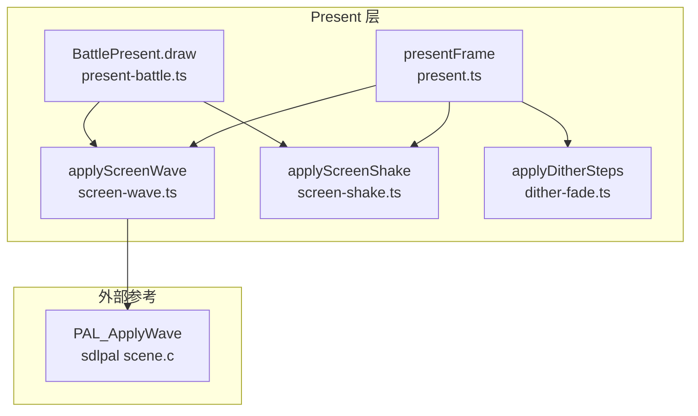
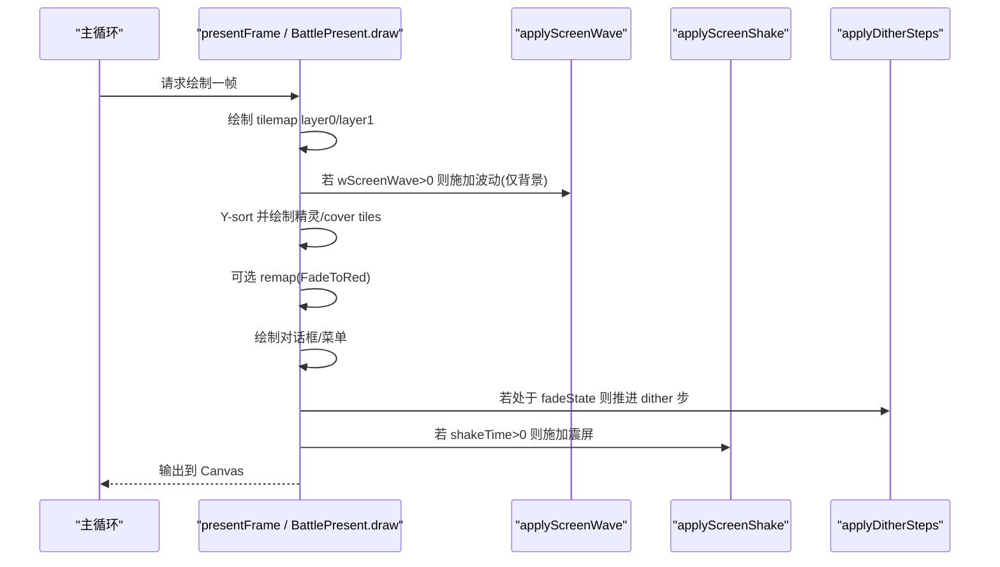
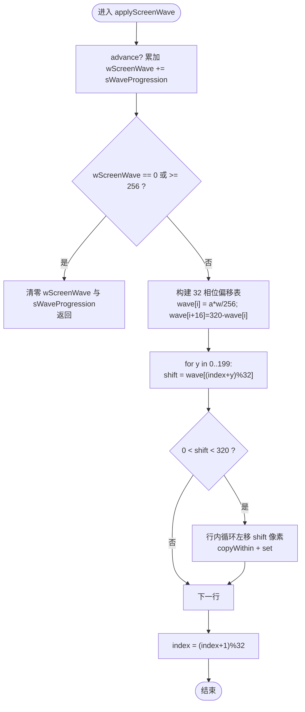
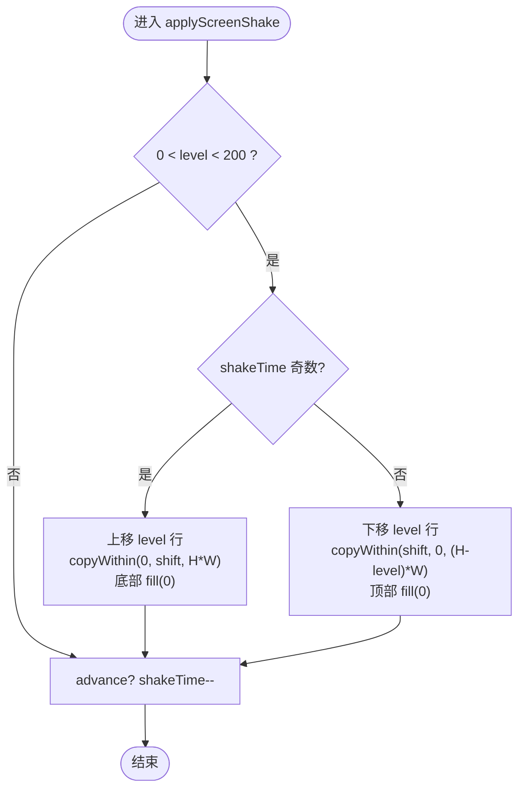
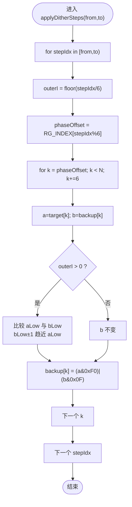
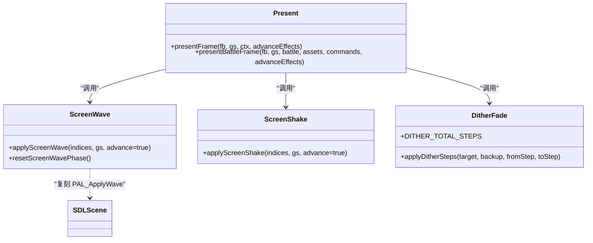

# 渲染特效系统

<cite>
**本文引用的文件**   
- [packages/game/src/present/screen-wave.ts](file://packages/game/src/present/screen-wave.ts)
- [packages/game/src/present/screen-shake.ts](file://packages/game/src/present/screen-shake.ts)
- [packages/game/src/present/dither-fade.ts](file://packages/game/src/present/dither-fade.ts)
- [packages/game/src/present/present.ts](file://packages/game/src/present/present.ts)
- [packages/game/src/present/battle/present-battle.ts](file://packages/game/src/present/battle/present-battle.ts)
- [reference/sdlpal/scene.c](file://reference/sdlpal/scene.c)
</cite>

## 目录
1. [简介](#简介)
2. [项目结构](#项目结构)
3. [核心组件](#核心组件)
4. [架构总览](#架构总览)
5. [详细组件分析](#详细组件分析)
6. [依赖关系分析](#依赖关系分析)
7. [性能与优化](#性能与优化)
8. [故障排查指南](#故障排查指南)
9. [结论](#结论)
10. [附录：扩展新特效与过渡动画](#附录扩展新特效与过渡动画)

## 简介
本文件系统性梳理 Type-Pal 的渲染特效子系统，重点覆盖以下三类视觉特效：
- 屏幕波动（screen wave）：基于正弦式相位偏移表的逐行横向循环卷动，模拟水波/热浪荡漾。
- 屏幕震动（screen shake）：奇偶帧垂直方向整幅平移 + 黑条填充，配合时间递减控制衰减。
- 抖动淡入淡出（dither fade）：nibble 级调色板渐变，72 步（12 outer × 6 inner）平滑过渡，保证主角等跨场景像素全程可见。

文档同时给出在 present 管线中的集成点、调用时序、状态推进策略，以及新增特效与自定义过渡动画的实践建议与性能优化要点。

## 项目结构
特效实现集中在 packages/game/src/present 下，按功能拆分为独立模块；present.ts 作为主合成入口，负责调度各特效与绘制阶段顺序。战斗模式通过 present-battle.ts 复用同一套特效能力。

图表来源
- [packages/game/src/present/present.ts:292-296](file://packages/game/src/present/present.ts#L292-L296)
- [packages/game/src/present/present.ts:677-685](file://packages/game/src/present/present.ts#L677-L685)
- [packages/game/src/present/battle/present-battle.ts:210-225](file://packages/game/src/present/battle/present-battle.ts#L210-L225)
- [packages/game/src/present/battle/present-battle.ts:347-360](file://packages/game/src/present/battle/present-battle.ts#L347-L360)
- [reference/sdlpal/scene.c:382-447](file://reference/sdlpal/scene.c#L382-L447)

章节来源
- [packages/game/src/present/present.ts:166-200](file://packages/game/src/present/present.ts#L166-L200)
- [packages/game/src/present/present.ts:292-296](file://packages/game/src/present/present.ts#L292-L296)
- [packages/game/src/present/present.ts:677-685](file://packages/game/src/present/present.ts#L677-L685)
- [packages/game/src/present/battle/present-battle.ts:210-225](file://packages/game/src/present/battle/present-battle.ts#L210-L225)
- [packages/game/src/present/battle/present-battle.ts:347-360](file://packages/game/src/present/battle/present-battle.ts#L347-L360)

## 核心组件
- applyScreenWave：实现屏幕波动，含相位表生成、逐行循环卷动、每帧相位推进与幅度自衰减。
- applyScreenShake：实现屏幕震动，奇偶帧垂直位移 + 黑条填充，shakeTime 递减至 0 停止。
- applyDitherSteps：实现 nibble 级 dither 淡变，72 步推进 backup 逼近 target，保持关键像素可见性。

章节来源
- [packages/game/src/present/screen-wave.ts:28-71](file://packages/game/src/present/screen-wave.ts#L28-L71)
- [packages/game/src/present/screen-shake.ts:28-54](file://packages/game/src/present/screen-shake.ts#L28-L54)
- [packages/game/src/present/dither-fade.ts:23-44](file://packages/game/src/present/dither-fade.ts#L23-L44)

## 架构总览
presentFrame 与 BattlePresent.draw 分别在大世界与战斗模式下组织渲染流程，并在正确阶段插入特效：
- 地图层绘制后、精灵绘制前：应用 screen wave，仅扭曲背景层，精灵保持笔直。
- 全部图层 + 精灵 + UI + 对话框完成后：应用 screen shake，对最终帧整体垂直跳动。
- 场景切换或淡入淡出时：使用 dither fade，以 72 步逐步将 backup 像素逼近当前帧，确保主角等跨缓冲像素始终可见。

图表来源
- [packages/game/src/present/present.ts:280-296](file://packages/game/src/present/present.ts#L280-L296)
- [packages/game/src/present/present.ts:584-604](file://packages/game/src/present/present.ts#L584-L604)
- [packages/game/src/present/present.ts:628-643](file://packages/game/src/present/present.ts#L628-L643)
- [packages/game/src/present/present.ts:677-685](file://packages/game/src/present/present.ts#L677-L685)
- [packages/game/src/present/battle/present-battle.ts:210-225](file://packages/game/src/present/battle/present-battle.ts#L210-L225)
- [packages/game/src/present/battle/present-battle.ts:347-360](file://packages/game/src/present/battle/present-battle.ts#L347-L360)

## 详细组件分析

### 屏幕波动（screen wave）
- 算法要点
  - 每帧先根据 sWaveProgression 更新 wScreenWave；当 wScreenWave==0 或 >=256 时自动清零并关闭效果。
  - 构建 32 相位偏移表：a/b 递推生成半周期偏移，后半周期镜像对称凑满 32 项。
  - 逐扫描线按 (index + row) % 32 选择偏移量，执行“左移 shift 像素并将移出部分接回行尾”的循环卷动。
  - index 为全局静态相位，每帧 +1 % 32，形成波形向上滚动的动态感。
- 数据流与复杂度
  - 输入：Uint8Array indices(320×200)，gs.wScreenWave, gs.sWaveProgression。
  - 每行最多一次 copyWithin + set，整体 O(W×H)。
- 错误处理与边界
  - 越界保护：shift=0 或 >=SCREEN_W 直接跳过该行。
  - 关闭条件：wScreenWave 归零或超界时立即返回，避免无意义计算。
- 与 sdlpal 对齐
  - 完全复刻 PAL_ApplyWave 的相位表与逐行卷动逻辑，且调用时机一致（两层地图之后、精灵之前）。

图表来源
- [packages/game/src/present/screen-wave.ts:28-71](file://packages/game/src/present/screen-wave.ts#L28-L71)
- [reference/sdlpal/scene.c:382-447](file://reference/sdlpal/scene.c#L382-L447)

章节来源
- [packages/game/src/present/screen-wave.ts:28-71](file://packages/game/src/present/screen-wave.ts#L28-L71)
- [reference/sdlpal/scene.c:382-447](file://reference/sdlpal/scene.c#L382-L447)
- [packages/game/src/present/present.ts:292-296](file://packages/game/src/present/present.ts#L292-L296)
- [packages/game/src/present/battle/present-battle.ts:210-225](file://packages/game/src/present/battle/present-battle.ts#L210-L225)

### 屏幕震动（screen shake）
- 算法要点
  - 依据 shakeTime 的奇偶性决定整幅上移或下移 shakeLevel 行，露出行用黑色填充。
  - 奇帧：源顶部裁掉 level 行，整幅上移 level，底部 level 行填黑。
  - 偶帧：dstrect.y=level，整幅下移 level，顶部 level 行填黑。
  - 每帧末尾 shakeTime--，直至 0 停止。
- 数据流与复杂度
  - 使用 copyWithin 进行整块内存平移，O(W×H) 但常数极小。
- 错误处理与边界
  - level<=0 或 >=SCREEN_H 时无可见偏移，但仍会递减 shakeTime，保证时序一致。
- 与 sdlpal 对齐
  - 对应 VIDEO_UpdateScreen 的 shake 分支，纯垂直跳动，不左右移动。

图表来源
- [packages/game/src/present/screen-shake.ts:28-54](file://packages/game/src/present/screen-shake.ts#L28-L54)

章节来源
- [packages/game/src/present/screen-shake.ts:28-54](file://packages/game/src/present/screen-shake.ts#L28-L54)
- [packages/game/src/present/present.ts:677-685](file://packages/game/src/present/present.ts#L677-L685)
- [packages/game/src/present/battle/present-battle.ts:347-360](file://packages/game/src/present/battle/present-battle.ts#L347-L360)

### 抖动淡入淡出（dither fade）
- 算法要点
  - 72 步（12 outer × 6 inner），rgIndex={0,3,1,5,2,4} 决定 stride-6 像素组处理序。
  - 每 step：取 a=target[k], b=backup[k]；outer>0 时对 b 的低 nibble 朝 a 低 nibble ±1 步进；
    高 nibble 立即取 target，组合成新的 backup[k]。
  - 目标：使 backup 逐步逼近 target，同时保持两 buffer 都存在的像素（如主角）全程可见。
- 数据流与复杂度
  - 输入：target、backup 同长度 Uint8Array；fromStep/toStep 指定推进区间。
  - 每步遍历 stride-6 像素组，总体 O(N)。
- 时间控制
  - present.ts 中根据 elapsedMs/totalMs 计算目标步数，支持 rAF 慢时一帧多跑几步追赶进度。
- 与 sdlpal 对齐
  - 完全复刻 VIDEO_FadeScreen 的 nibble-dither 算法与 rgIndex 序列。

图表来源
- [packages/game/src/present/dither-fade.ts:23-44](file://packages/game/src/present/dither-fade.ts#L23-L44)
- [packages/game/src/present/present.ts:628-643](file://packages/game/src/present/present.ts#L628-L643)

章节来源
- [packages/game/src/present/dither-fade.ts:23-44](file://packages/game/src/present/dither-fade.ts#L23-L44)
- [packages/game/src/present/present.ts:628-643](file://packages/game/src/present/present.ts#L628-L643)

## 依赖关系分析
- present.ts 导入并调用三个特效函数，按阶段插入到绘制流程中。
- battle/present-battle.ts 复用 applyScreenWave 与 applyScreenShake，确保战斗模式与大世界一致的视觉体验。
- screen-wave.ts 严格复刻 sdlpal scene.c 的 PAL_ApplyWave 行为，包括相位表与逐行卷动。

图表来源
- [packages/game/src/present/present.ts:10-12](file://packages/game/src/present/present.ts#L10-L12)
- [packages/game/src/present/screen-wave.ts:20-22](file://packages/game/src/present/screen-wave.ts#L20-L22)
- [packages/game/src/present/screen-shake.ts:28-54](file://packages/game/src/present/screen-shake.ts#L28-L54)
- [packages/game/src/present/dither-fade.ts:17-17](file://packages/game/src/present/dither-fade.ts#L17-L17)
- [reference/sdlpal/scene.c:382-447](file://reference/sdlpal/scene.c#L382-L447)

章节来源
- [packages/game/src/present/present.ts:10-12](file://packages/game/src/present/present.ts#L10-L12)
- [packages/game/src/present/battle/present-battle.ts:39-40](file://packages/game/src/present/battle/present-battle.ts#L39-L40)
- [packages/game/src/present/screen-wave.ts:20-22](file://packages/game/src/present/screen-wave.ts#L20-L22)
- [packages/game/src/present/dither-fade.ts:17-17](file://packages/game/src/present/dither-fade.ts#L17-L17)

## 性能与优化
- 增量更新
  - screen wave/shake 均提供 advance=false 参数，用于 fade-only 补帧场景，避免 rAF 高频补帧导致计数过快推进。
  - dither fade 采用 time-based 目标步数，允许慢帧追赶，减少卡顿感知。
- 内存与拷贝
  - 使用 TypedArray.copyWithin/set 原地操作，避免额外分配；present.ts 复用 seamCoverageBuf 降低 GC 压力。
- GPU 加速建议
  - 当前为 CPU 像素级操作，适合 320×200 低分辨率。如需更高性能可考虑 WebGL/Canvas2D 纹理 blit 与 shader 替代逐像素循环。
- 移动端适配
  - 控制特效强度（wave 幅度、shake level）与持续时间，避免低端设备掉帧。
  - 在弱网/低电量场景禁用非必要特效，优先保障交互流畅。

章节来源
- [packages/game/src/present/present.ts:166-174](file://packages/game/src/present/present.ts#L166-L174)
- [packages/game/src/present/present.ts:154-164](file://packages/game/src/present/present.ts#L154-L164)
- [packages/game/src/present/present.ts:628-643](file://packages/game/src/present/present.ts#L628-L643)

## 故障排查指南
- 屏幕波动未生效
  - 检查 gs.wScreenWave 与 gs.sWaveProgression 是否非零；确认调用时机位于 tilemap 绘制后、精灵绘制前。
  - 若 wScreenWave 被设为 0 或 >=256，会自动关闭，需调整触发逻辑。
- 屏幕震动提前结束
  - 确认 shakeTime 未被误置为 0；注意 advanceEffects=false 时不会自减，可能导致视觉与逻辑不同步。
- dither fade 不收敛或闪烁
  - 检查 appliedSteps 与 targetSteps 的计算是否正确；确保 backupPixels 在 fade 启动时已快照。
  - 若 rAF 过慢，应允许单帧多跑几步追赶进度。

章节来源
- [packages/game/src/present/present.ts:292-296](file://packages/game/src/present/present.ts#L292-L296)
- [packages/game/src/present/present.ts:677-685](file://packages/game/src/present/present.ts#L677-L685)
- [packages/game/src/present/present.ts:628-643](file://packages/game/src/present/present.ts#L628-L643)

## 结论
Type-Pal 的渲染特效系统以清晰的分层与严格的时序控制，实现了与原版的视觉一致性。screen wave 通过相位表与逐行循环卷动营造水面/热浪效果；screen shake 以奇偶帧垂直跳动增强打击反馈；dither fade 以 nibble 级渐进确保过渡自然且主体可见。三者均在 present 管线中精确插入，兼顾性能与兼容性。

## 附录：扩展新特效与过渡动画
- 新增视觉特效步骤
  - 新建特效模块（例如 packages/game/src/present/new-effect.ts），导出 applyNewEffect(indices, gs, advance=true) 函数。
  - 在 present.ts 的合适阶段插入调用（如 tilemap 后、精灵前，或最终输出前），遵循原有时序约定。
  - 若需要与 battle 模式一致，同步在 present-battle.ts 对应位置调用。
- 自定义过渡动画
  - 复用 dither fade 框架：定义新的 rgIndex 序列与 outer/inner 步数，实现不同的 stride 访问模式。
  - 在 present.ts 中基于 elapsedMs/totalMs 计算目标步数，调用 applyDitherSteps 推进 backup 逼近 target。
- 最佳实践
  - 尽量使用原地内存操作（copyWithin/set），避免频繁分配。
  - 提供 advance=false 接口，兼容 fade-only 补帧场景。
  - 对移动端与低端设备提供降级开关，限制特效强度与频率。

章节来源
- [packages/game/src/present/present.ts:292-296](file://packages/game/src/present/present.ts#L292-L296)
- [packages/game/src/present/present.ts:677-685](file://packages/game/src/present/present.ts#L677-L685)
- [packages/game/src/present/dither-fade.ts:23-44](file://packages/game/src/present/dither-fade.ts#L23-L44)
- [packages/game/src/present/battle/present-battle.ts:210-225](file://packages/game/src/present/battle/present-battle.ts#L210-L225)
- [packages/game/src/present/battle/present-battle.ts:347-360](file://packages/game/src/present/battle/present-battle.ts#L347-L360)