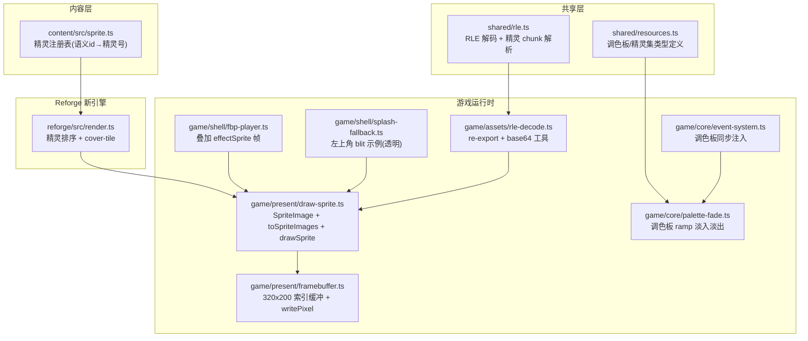
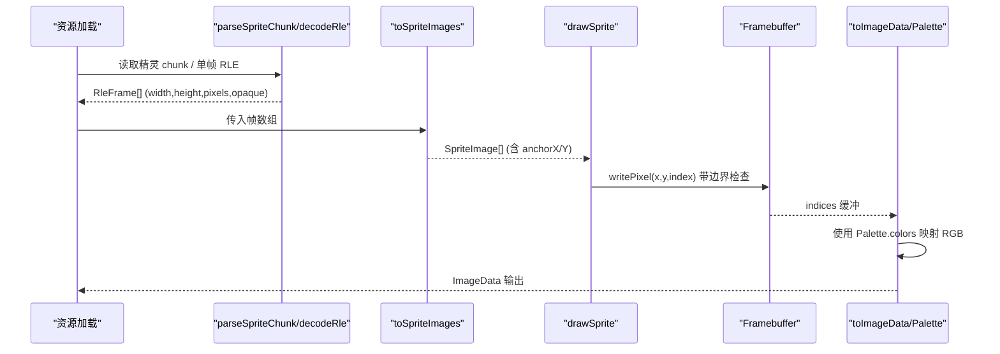
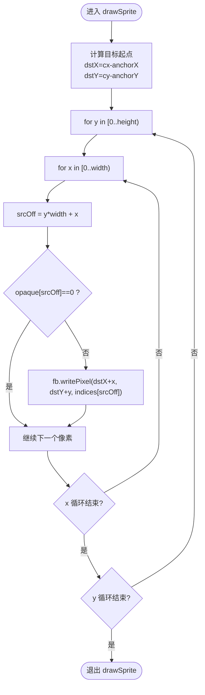
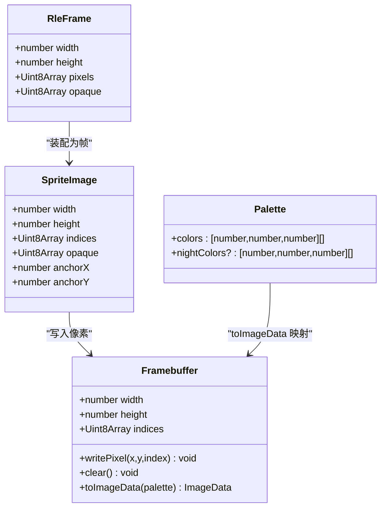

# 精灵绘制系统

<cite>
**本文引用的文件**   
- [packages/game/src/present/draw-sprite.ts](file://packages/game/src/present/draw-sprite.ts)
- [packages/shared/src/rle.ts](file://packages/shared/src/rle.ts)
- [packages/game/src/assets/rle-decode.ts](file://packages/game/src/assets/rle-decode.ts)
- [packages/game/src/present/framebuffer.ts](file://packages/game/src/present/framebuffer.ts)
- [packages/shared/src/resources.ts](file://packages/shared/src/resources.ts)
- [packages/game/src/shell/splash-fallback.ts](file://packages/game/src/shell/splash-fallback.ts)
- [packages/game/src/shell/fbp-player.ts](file://packages/game/src/shell/fbp-player.ts)
- [packages/game/src/core/event-system.ts](file://packages/game/src/core/event-system.ts)
- [packages/game/src/core/palette-fade.ts](file://packages/game/src/core/palette-fade.ts)
- [packages/reforge/src/render.ts](file://packages/reforge/src/render.ts)
- [packages/content/src/sprite.ts](file://packages/content/src/sprite.ts)
</cite>

## 目录
1. [简介](#简介)
2. [项目结构](#项目结构)
3. [核心组件](#核心组件)
4. [架构总览](#架构总览)
5. [详细组件分析](#详细组件分析)
6. [依赖关系分析](#依赖关系分析)
7. [性能考量](#性能考量)
8. [故障排查指南](#故障排查指南)
9. [结论](#结论)
10. [附录](#附录)

## 简介
本文件系统性梳理 Type-Pal 的精灵绘制子系统，覆盖以下关键主题：
- 精灵图像的数据结构与透明度语义（opaque mask）
- 调色板映射与淡入淡出机制
- drawSprite 的核心逻辑：源矩形到目标矩形的像素复制、边界检查、锚点定位
- 精灵图集管理：RLE 解码、chunk 解析、帧装配与缓存策略
- MGO/原版精灵格式加载与解析流程
- 自定义绘制效果与混合模式扩展建议
- 性能优化技巧：批次合并、离屏缓冲、纹理压缩等

## 项目结构
Type-Pal 将“资源提取”和“运行时渲染”解耦。精灵相关的关键路径如下：
- shared 层提供 RLE 解码与通用数据结构
- game 层负责运行时解码、帧装配、绘制与呈现
- reforge 子引擎演示了基于 Canvas 2D 的精灵排序与覆盖瓦片处理
- content 层提供精灵注册表（语义 id → 原版精灵号），用于编辑器与内容管线

图表来源
- [packages/shared/src/rle.ts:1-127](file://packages/shared/src/rle.ts#L1-L127)
- [packages/game/src/assets/rle-decode.ts:1-20](file://packages/game/src/assets/rle-decode.ts#L1-L20)
- [packages/game/src/present/draw-sprite.ts:1-55](file://packages/game/src/present/draw-sprite.ts#L1-L55)
- [packages/game/src/present/framebuffer.ts:1-50](file://packages/game/src/present/framebuffer.ts#L1-L50)
- [packages/game/src/shell/splash-fallback.ts:125-168](file://packages/game/src/shell/splash-fallback.ts#L125-L168)
- [packages/game/src/shell/fbp-player.ts:20-35](file://packages/game/src/shell/fbp-player.ts#L20-L35)
- [packages/game/src/core/event-system.ts:535-558](file://packages/game/src/core/event-system.ts#L535-L558)
- [packages/game/src/core/palette-fade.ts:1-251](file://packages/game/src/core/palette-fade.ts#L1-L251)
- [packages/reforge/src/render.ts:152-184](file://packages/reforge/src/render.ts#L152-L184)
- [packages/content/src/sprite.ts:1-21](file://packages/content/src/sprite.ts#L1-L21)

章节来源
- [packages/shared/src/rle.ts:1-127](file://packages/shared/src/rle.ts#L1-L127)
- [packages/game/src/present/draw-sprite.ts:1-55](file://packages/game/src/present/draw-sprite.ts#L1-L55)
- [packages/game/src/present/framebuffer.ts:1-50](file://packages/game/src/present/framebuffer.ts#L1-L50)

## 核心组件
- SpriteImage：运行时精灵帧对象，包含宽高、调色板索引数组 indices、不透明掩码 opaque、以及锚点 anchorX/anchorY。
- toSpriteImages：将解码后的逐帧位图装配为 SpriteImage[]，按每帧自身宽高设置锚点（底部中心）。
- drawSprite：根据锚点计算目标位置，遍历源矩形，依据 opaque 掩码写入 Framebuffer。
- Framebuffer：320×200 索引缓冲，writePixel 自带屏幕边界裁剪；toImageData 使用当前调色板生成 ImageData。
- RLE 解码与 chunk 解析：decodeRle 与 parseSpriteChunk 提供统一的原版精灵格式解码器。
- 调色板与淡入淡出：Palette 类型与 palette-fade 模块实现调色板级淡入淡出。

章节来源
- [packages/game/src/present/draw-sprite.ts:1-55](file://packages/game/src/present/draw-sprite.ts#L1-L55)
- [packages/game/src/present/framebuffer.ts:1-50](file://packages/game/src/present/framebuffer.ts#L1-L50)
- [packages/shared/src/rle.ts:1-127](file://packages/shared/src/rle.ts#L1-L127)
- [packages/shared/src/resources.ts:31-54](file://packages/shared/src/resources.ts#L31-L54)
- [packages/game/src/core/palette-fade.ts:1-251](file://packages/game/src/core/palette-fade.ts#L1-L251)

## 架构总览
从数据到像素的完整链路：
- 资源侧：MGO/MKF 中的精灵 chunk 经 parseSpriteChunk 解析为多帧 RleFrame；单帧整-chunk 场景通过 decodeRle(buf, { skipFilePrefix }) 解码。
- 运行时装配：toSpriteImages 为每帧设置锚点（底部中心），形成可绘制的 SpriteImage。
- 绘制阶段：drawSprite 以锚点定位，遍历源矩形，按 opaque 掩码写入 Framebuffer。
- 呈现阶段：Framebuffer.toImageData 使用当前 Palette.colors 将索引映射为 RGB，输出到 Canvas。
- 特效阶段：palette-fade 在调色板层面做淡入淡出，不影响像素数据。

图表来源
- [packages/shared/src/rle.ts:85-126](file://packages/shared/src/rle.ts#L85-L126)
- [packages/game/src/present/draw-sprite.ts:26-54](file://packages/game/src/present/draw-sprite.ts#L26-L54)
- [packages/game/src/present/framebuffer.ts:20-49](file://packages/game/src/present/framebuffer.ts#L20-L49)
- [packages/shared/src/resources.ts:31-54](file://packages/shared/src/resources.ts#L31-L54)

## 详细组件分析

### 精灵图像数据结构与透明度语义
- SpriteImage.indices：长度 width×height 的 Uint8Array，值为调色板下标。
- SpriteImage.opaque：与 indices 同长度的 Uint8Array，1 表示写入，0 表示跳过（透明）。
- 重要修正：早期误用“indices[i]===0 即透明”，导致 palette-0 的合法像素被当作透明，出现半透明问题。现严格以 opaque 掩码为准。

章节来源
- [packages/game/src/present/draw-sprite.ts:3-13](file://packages/game/src/present/draw-sprite.ts#L3-L13)
- [packages/shared/src/rle.ts:13-25](file://packages/shared/src/rle.ts#L13-L25)

### 调色板映射算法
- Palette.colors：256 色 RGB 三元组数组，作为运行时 LUT。
- Framebuffer.toImageData：遍历 indices，取 palette.colors[idx] 填充 RGBA。
- 夜间调色板：Palette.nightColors 可选，消费方根据 night flag 切换。
- 调色板淡入淡出：palette-fade 模块对 colors 进行 lerp/approach 插值，不改动像素数据。

章节来源
- [packages/shared/src/resources.ts:31-54](file://packages/shared/src/resources.ts#L31-L54)
- [packages/game/src/present/framebuffer.ts:36-47](file://packages/game/src/present/framebuffer.ts#L36-L47)
- [packages/game/src/core/palette-fade.ts:1-251](file://packages/game/src/core/palette-fade.ts#L1-L251)

### 透明度处理机制
- RLE 指令：b≥0x80 表示跳过 b-0x80 个像素（opaque=0），否则直接写入 b 个像素（opaque=1）。
- opaque 与 indices 的关系：仅当 opaque[i]=1 时 indices[i] 有效；opaque[i]=0 的位置不应参与绘制。
- 边界检查：Framebuffer.writePixel 在越界时直接返回，避免异常与越写。

章节来源
- [packages/shared/src/rle.ts:27-83](file://packages/shared/src/rle.ts#L27-L83)
- [packages/game/src/present/framebuffer.ts:27-30](file://packages/game/src/present/framebuffer.ts#L27-L30)

### drawSprite 核心逻辑
- 锚点定位：dstX = cx - anchorX，dstY = cy - anchorY。
- 源矩形遍历：y∈[0,height)，x∈[0,width)，srcOff = y*width+x。
- 透明判定：若 opaque[srcOff]=0 则 continue。
- 写入像素：fb.writePixel(dstX+x, dstY+y, indices[srcOff])。
- 脚底对齐：toSpriteImages 为每帧设置 anchorX=floor(width/2)、anchorY=height，确保不同高度帧在同一 cy 处脚底对齐。

图表来源
- [packages/game/src/present/draw-sprite.ts:39-54](file://packages/game/src/present/draw-sprite.ts#L39-L54)

章节来源
- [packages/game/src/present/draw-sprite.ts:26-54](file://packages/game/src/present/draw-sprite.ts#L26-L54)

### 精灵图集管理与缓存策略
- 解析：parseSpriteChunk 读取 imagecount 与偏移表，逐个 offset 调用 decodeRle 得到 RleFrame[]。
- 安全守卫：对 w/h 做上限校验（SPRITE_DIM_MAX=400），防止损坏帧导致死循环。
- 装配：toSpriteImages 为每帧设置锚点，形成 SpriteImage[]。
- 缓存策略：
  - 运行时未显式实现全局 SpriteImage 缓存；常见做法是在上层（如场景或精灵管理器）维护 Map<spriteId, SpriteImage[]>，结合引用计数或 LRU 淘汰。
  - 对于频繁重绘的 UI 精灵（如标题、鹤群），可在 shell 层局部缓存帧引用，避免重复装配。
- 参考用法：splash-fallback 与 fbp-player 直接使用 IndexedImage/SpriteImage 进行绘制。

章节来源
- [packages/shared/src/rle.ts:85-126](file://packages/shared/src/rle.ts#L85-L126)
- [packages/game/src/present/draw-sprite.ts:26-37](file://packages/game/src/present/draw-sprite.ts#L26-L37)
- [packages/game/src/shell/splash-fallback.ts:125-168](file://packages/game/src/shell/splash-fallback.ts#L125-L168)
- [packages/game/src/shell/fbp-player.ts:20-35](file://packages/game/src/shell/fbp-player.ts#L20-L35)

### MGO 格式精灵的加载与解析
- 单帧整-chunk：decodeRle(buf, { skipFilePrefix: true }) 跳过 0x00000002 前缀后解码。
- 精灵组 chunk：parseSpriteChunk 解析 imagecount 与偏移表，再对每个 offset 调用 decodeRle（不跳前缀）。
- 运行时 re-export：game/assets/rle-decode.ts 统一导出 shared 解码器，并提供 base64ToBytes 工具。

章节来源
- [packages/shared/src/rle.ts:39-83](file://packages/shared/src/rle.ts#L39-L83)
- [packages/shared/src/rle.ts:110-126](file://packages/shared/src/rle.ts#L110-L126)
- [packages/game/src/assets/rle-decode.ts:1-20](file://packages/game/src/assets/rle-decode.ts#L1-L20)

### 覆盖瓦片与深度排序（Reforge 参考）
- 精灵排序：按 worldY+偏移 升序绘制，保证前后遮挡正确。
- Cover-tile：计算精灵包围盒覆盖的高瓦片，将其加入绘制队列，实现“精灵钻入地形”的效果。
- 该逻辑可作为第一阶段运行时未来引入的参考方案。

章节来源
- [packages/reforge/src/render.ts:152-184](file://packages/reforge/src/render.ts#L152-L184)

### 调色板淡入淡出与事件系统集成
- 淡入淡出模式：lerp（FadeOut/FadeIn/SceneFade/PaletteFade）与 approach（ColorFade/FadeToRed）。
- 事件系统注入：setPaletteSource 提供同步调色板源，使 setPalette 在同帧生效，满足脚本时序要求。

章节来源
- [packages/game/src/core/palette-fade.ts:1-251](file://packages/game/src/core/palette-fade.ts#L1-L251)
- [packages/game/src/core/event-system.ts:535-558](file://packages/game/src/core/event-system.ts#L535-L558)

### 自定义精灵绘制效果与新增混合模式
- 自定义效果思路：
  - 在 drawSprite 之前对 indices/opaque 做变换（例如色调偏移、抖动、边缘高亮），再写入 Framebuffer。
  - 利用 Framebuffer 的 toImageData 与 Canvas 合成操作实现更复杂效果（如阴影、辉光）。
- 新增混合模式建议：
  - 在 drawSprite 中增加 blendMode 参数，根据模式选择是否替换像素、alpha 混合、加色/减色等。
  - 对于高性能需求，优先在 CPU 端预计算混合结果或使用 WebGL/WebGPU shader 加速。
- 参考用例：
  - splash-fallback 的 blitSpriteAt 展示了左上角 blit 与 opaque 掩码的使用方式。
  - fbp-player 展示了 effectSprite 帧的叠加绘制。

章节来源
- [packages/game/src/shell/splash-fallback.ts:125-168](file://packages/game/src/shell/splash-fallback.ts#L125-L168)
- [packages/game/src/shell/fbp-player.ts:20-35](file://packages/game/src/shell/fbp-player.ts#L20-L35)
- [packages/game/src/present/draw-sprite.ts:39-54](file://packages/game/src/present/draw-sprite.ts#L39-L54)

## 依赖关系分析
- draw-sprite 依赖 framebuffer 的 writePixel 完成边界安全的像素写入。
- rle-decode 复用 shared 的 decodeRle/parseSpriteChunk，保证 extractor 与 runtime 一致。
- event-system 注入调色板源，palette-fade 修改 Palette.colors，影响 toImageData 的输出。
- reforge render 展示精灵排序与覆盖瓦片，可作为未来第一阶段运行时的增强方向。
- content sprite 注册表提供语义 id 到精灵号的映射，便于编辑器与内容管线。

图表来源
- [packages/game/src/present/draw-sprite.ts:3-13](file://packages/game/src/present/draw-sprite.ts#L3-L13)
- [packages/game/src/present/framebuffer.ts:6-14](file://packages/game/src/present/framebuffer.ts#L6-L14)
- [packages/shared/src/rle.ts:13-25](file://packages/shared/src/rle.ts#L13-L25)
- [packages/shared/src/resources.ts:31-42](file://packages/shared/src/resources.ts#L31-L42)

章节来源
- [packages/game/src/present/draw-sprite.ts:1-55](file://packages/game/src/present/draw-sprite.ts#L1-L55)
- [packages/game/src/present/framebuffer.ts:1-50](file://packages/game/src/present/framebuffer.ts#L1-L50)
- [packages/shared/src/rle.ts:1-127](file://packages/shared/src/rle.ts#L1-L127)
- [packages/shared/src/resources.ts:31-54](file://packages/shared/src/resources.ts#L31-L54)

## 性能考量
- 绘制批次合并：
  - 将同一帧的多次 drawSprite 合并为一次遍历，减少函数调用与边界检查开销。
  - 对相同 SpriteImage 的连续绘制，可先计算 dst 范围并批量写入。
- 离屏缓冲使用：
  - 对复杂特效（如阴影、辉光）先在较小离屏缓冲绘制，再整体贴回主缓冲，降低逐像素合成成本。
  - 大地图缩略图已在 dev panel 中使用更大尺寸 Framebuffer 降采样渲染。
- 纹理压缩与传输：
  - 精灵图集可考虑使用浏览器原生纹理格式（如 ASTC/ETC2）或打包为 Blob/ArrayBuffer 以减少 JSON 体积。
  - 对静态精灵预编码为 PNG 并在运行时按需解码，可减少 CPU 解码压力。
- 内存与缓存：
  - 在上层维护 SpriteImage[] 缓存，避免重复装配；对热点精灵采用引用计数或 LRU 淘汰。
  - 控制 opaque/indices 视图的创建与拷贝，尽量复用 TypedArray 视图。
- 并行与 SIMD：
  - 对大批量像素写入可使用 WebAssembly 或 SIMD 指令加速（需评估跨平台兼容性）。
- 显示缩放：
  - 内部恒 320×200，CSS 整数倍缩放保锐利，避免 GPU 插值带来的模糊。

[本节为通用指导，无需特定文件来源]

## 故障排查指南
- 人物头发/眼睛变半透明：
  - 原因：曾以 indices[i]===0 判断透明，导致 palette-0 被误判。
  - 修复：严格使用 opaque 掩码，仅在 opaque[i]=1 时写入。
- 密道攀爬角色偏下：
  - 原因：整组精灵共用 frame0 的宽高设置锚点，导致高帧脚底下溢。
  - 修复：toSpriteImages 为每帧设置 anchorX=floor(width/2)、anchorY=height。
- 屏幕外绘制抛错：
  - 原因：未做边界检查。
  - 修复：Framebuffer.writePixel 在越界时直接返回。
- 调试面板效果无效：
  - 原因：调色板未同步注入或淡入淡出状态未更新。
  - 修复：确保 setPaletteSource 已注入，palette-fade 状态随帧推进更新。

章节来源
- [packages/game/src/present/draw-sprite.ts:3-13](file://packages/game/src/present/draw-sprite.ts#L3-L13)
- [packages/game/src/present/draw-sprite.ts:26-37](file://packages/game/src/present/draw-sprite.ts#L26-L37)
- [packages/game/src/present/framebuffer.ts:27-30](file://packages/game/src/present/framebuffer.ts#L27-L30)
- [packages/game/src/core/event-system.ts:535-558](file://packages/game/src/core/event-system.ts#L535-L558)
- [packages/game/src/core/palette-fade.ts:1-251](file://packages/game/src/core/palette-fade.ts#L1-L251)

## 结论
Type-Pal 的精灵绘制系统以“数据驱动 + 纯函数解码 + 明确透明语义”为核心，确保与 sdlpal 行为一致。通过 opaque 掩码、逐帧锚点、边界检查与调色板淡入淡出，实现了稳定可靠的像素级绘制。未来可在运行时引入精灵排序与覆盖瓦片、批次合并与离屏缓冲、纹理压缩与缓存策略，进一步提升性能与表现力。

[本节为总结性内容，无需特定文件来源]

## 附录
- 精灵注册表（content/src/sprite.ts）提供语义 id 到原版精灵号的映射，便于编辑器与内容管线统一管理实体精灵。
- 参考用法：
  - splash-fallback 的 blitSpriteAt 展示了左上角 blit 与 opaque 掩码的使用方式。
  - fbp-player 展示了 effectSprite 帧的叠加绘制。

章节来源
- [packages/content/src/sprite.ts:1-21](file://packages/content/src/sprite.ts#L1-L21)
- [packages/game/src/shell/splash-fallback.ts:125-168](file://packages/game/src/shell/splash-fallback.ts#L125-L168)
- [packages/game/src/shell/fbp-player.ts:20-35](file://packages/game/src/shell/fbp-player.ts#L20-L35)