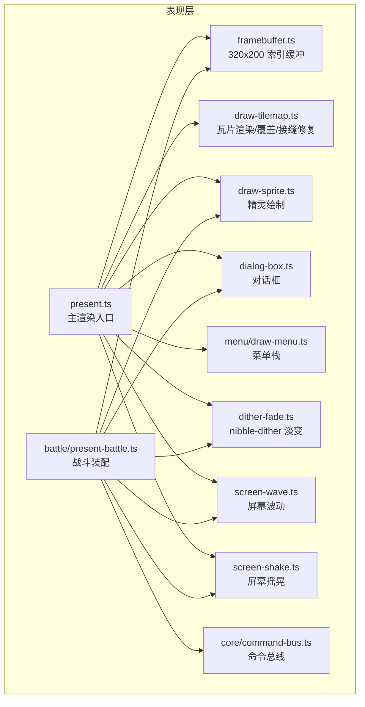
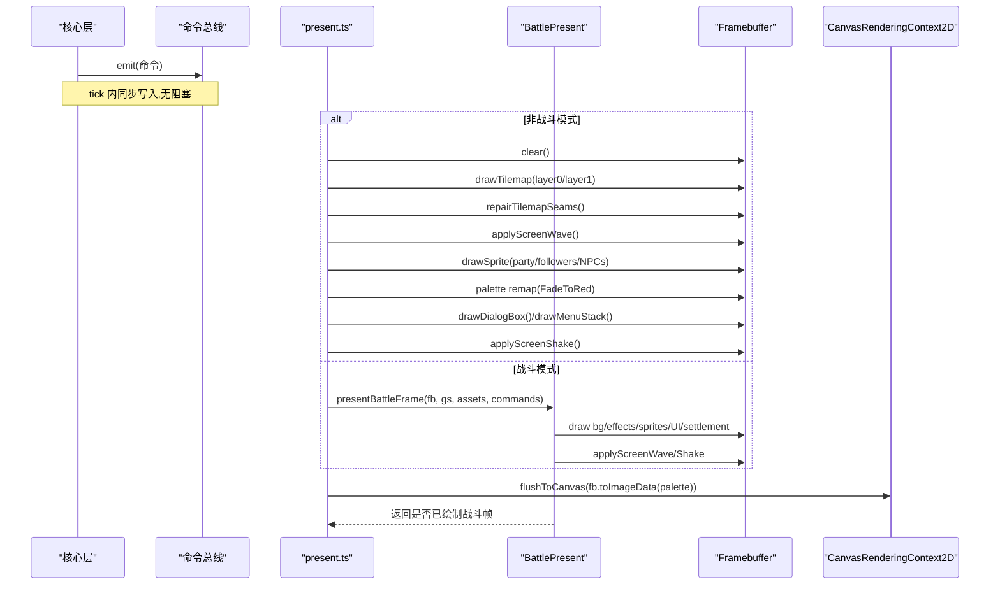
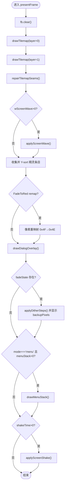
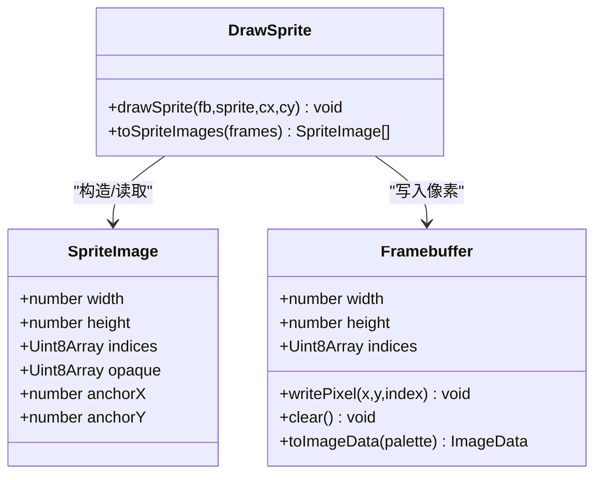
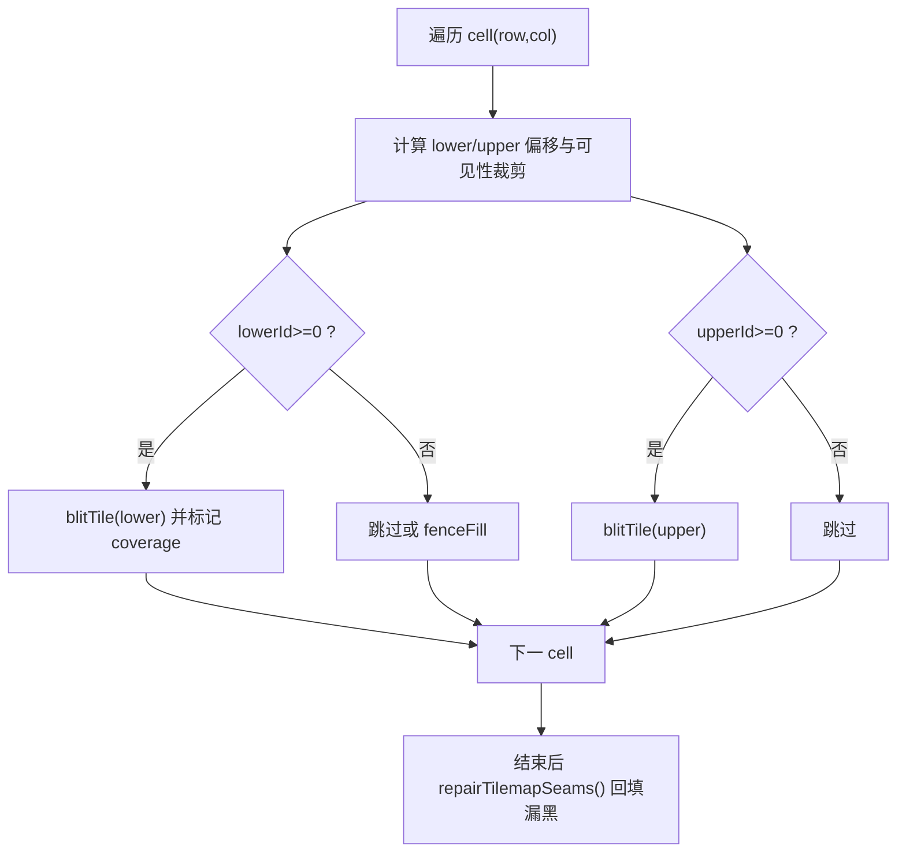
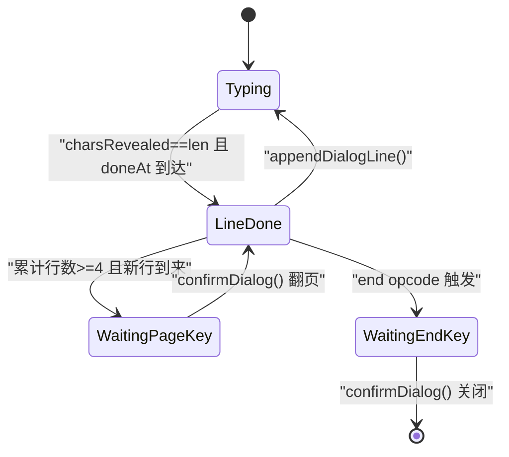
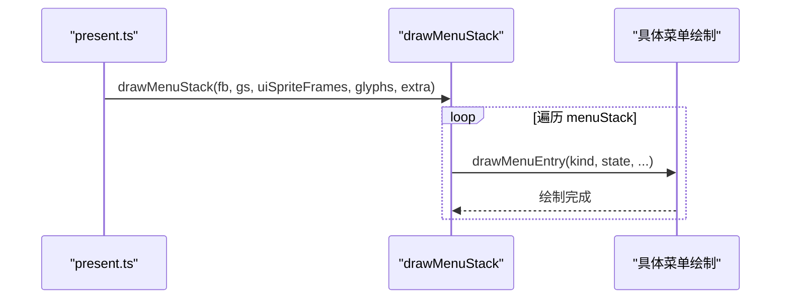
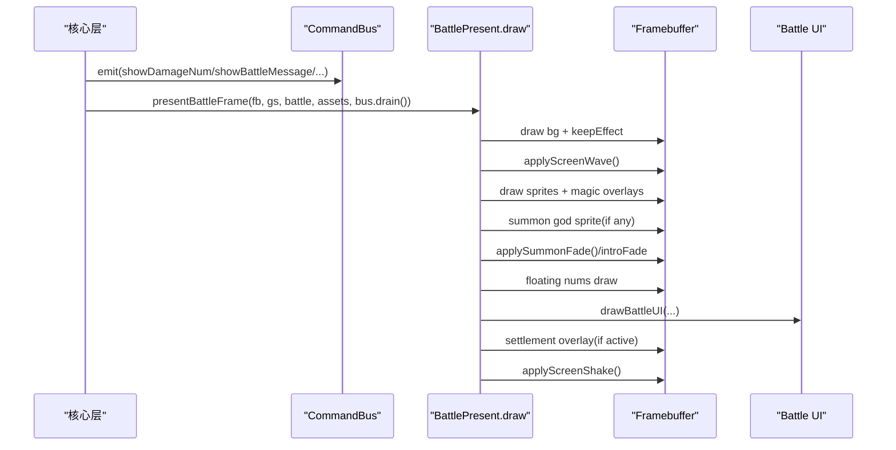
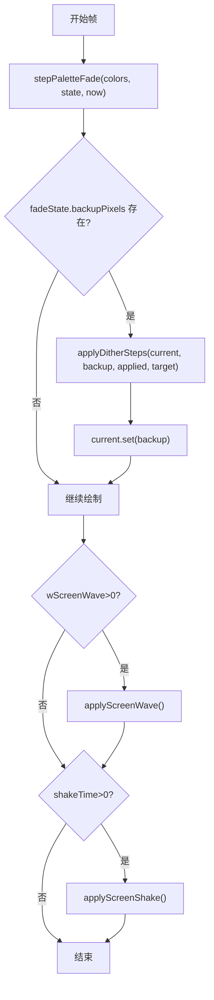
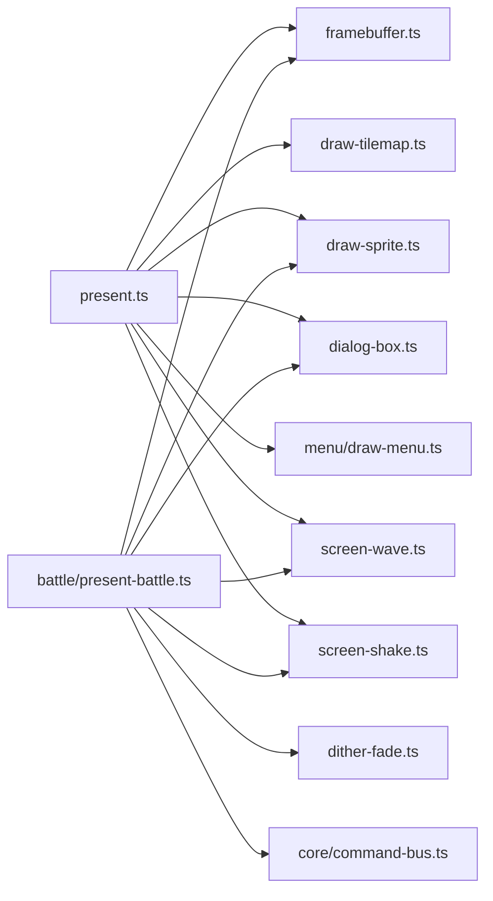

# 表现层 (Presentation Layer)

<cite>
**本文引用的文件**   
- [present.ts](file://packages/game/src/present/present.ts)
- [framebuffer.ts](file://packages/game/src/present/framebuffer.ts)
- [draw-sprite.ts](file://packages/game/src/present/draw-sprite.ts)
- [draw-tilemap.ts](file://packages/game/src/present/draw-tilemap.ts)
- [dialog-box.ts](file://packages/game/src/present/dialog-box.ts)
- [draw-menu.ts](file://packages/game/src/present/menu/draw-menu.ts)
- [present-battle.ts](file://packages/game/src/present/battle/present-battle.ts)
- [dither-fade.ts](file://packages/game/src/present/dither-fade.ts)
- [screen-wave.ts](file://packages/game/src/present/screen-wave.ts)
- [screen-shake.ts](file://packages/game/src/present/screen-shake.ts)
- [command-bus.ts](file://packages/game/src/core/command-bus.ts)
</cite>

## 目录
1. [简介](#简介)
2. [项目结构](#项目结构)
3. [核心组件](#核心组件)
4. [架构总览](#架构总览)
5. [详细组件分析](#详细组件分析)
6. [依赖关系分析](#依赖关系分析)
7. [性能考虑](#性能考虑)
8. [故障排查指南](#故障排查指南)
9. [结论](#结论)
10. [附录：扩展与最佳实践](#附录扩展与最佳实践)

## 简介
本文件为 Type-Pal 表现层的权威技术文档，聚焦以下职责与实现：
- 渲染系统：Canvas 2D 输出、320×200 索引缓冲、精灵绘制优化、地图瓦片渲染（含接缝修复与覆盖瓦片）。
- UI 组件系统：对话框、菜单界面、战斗 UI、转场效果。
- 动画系统：精灵动画、调色板渐变、屏幕波动/摇晃、dither 淡入淡出。
- 渲染管线：软件索引帧缓冲、像素级绘制、内存管理策略。
- 命令总线：核心层指令到视觉输出的转换流程。
- 性能调优与跨浏览器兼容性注意事项。

## 项目结构
表现层位于 packages/game/src/present，按功能域组织：
- present.ts：主渲染入口，装配场景、精灵、特效、UI、菜单与过渡。
- framebuffer.ts：320×200 索引缓冲抽象，提供 writePixel/clear/toImageData。
- draw-sprite.ts：精灵位图 blit 与锚点计算。
- draw-tilemap.ts：等距瓦片两层渲染、接缝修复、覆盖瓦片计算。
- dialog-box.ts：对话状态机、打字节奏、样式与图标。
- menu/draw-menu.ts：大世界菜单栈与各子菜单绘制。
- battle/present-battle.ts：战斗一帧装配（背景、精灵、弹幕、UI、结算、转场）。
- dither-fade.ts / screen-wave.ts / screen-shake.ts：通用视觉特效。
- core/command-bus.ts：Core→Present 单向命令通道。

图表来源
- [present.ts:166-686](file://packages/game/src/present/present.ts#L166-L686)
- [framebuffer.ts:1-50](file://packages/game/src/present/framebuffer.ts#L1-L50)
- [draw-sprite.ts:1-55](file://packages/game/src/present/draw-sprite.ts#L1-L55)
- [draw-tilemap.ts:92-384](file://packages/game/src/present/draw-tilemap.ts#L92-L384)
- [dialog-box.ts:1-800](file://packages/game/src/present/dialog-box.ts#L1-L800)
- [draw-menu.ts:101-256](file://packages/game/src/present/menu/draw-menu.ts#L101-L256)
- [present-battle.ts:127-360](file://packages/game/src/present/battle/present-battle.ts#L127-L360)
- [dither-fade.ts:1-45](file://packages/game/src/present/dither-fade.ts#L1-L45)
- [screen-wave.ts:1-72](file://packages/game/src/present/screen-wave.ts#L1-L72)
- [screen-shake.ts:1-55](file://packages/game/src/present/screen-shake.ts#L1-L55)
- [command-bus.ts:1-89](file://packages/game/src/core/command-bus.ts#L1-L89)

章节来源
- [present.ts:166-686](file://packages/game/src/present/present.ts#L166-L686)
- [framebuffer.ts:1-50](file://packages/game/src/present/framebuffer.ts#L1-L50)

## 核心组件
- 帧缓冲 Framebuffer：320×200 索引缓冲，writePixel 边界检查，toImageData 将索引映射为 RGBA 供 Canvas 2D putImageData 输出。
- 精灵绘制 SpriteImage：每帧独立宽高与 opaque mask，anchor 基于当前帧底部中心对齐，避免不同高度帧错位。
- 瓦片渲染 Tilemap：两层 tilemap（底层/顶层）全画 + cover tile 重画；接缝修复用 coverage mask 回填漏黑像素。
- 对话框 DialogBox：状态机（typing/line-done/waiting-page-key/waiting-end-key），wall-clock 驱动打字，控制符解析与颜色切换。
- 菜单 MenuStack：严格对齐 sdlpal 坐标与闪烁色，支持多类菜单（打开、系统、存档、物品、装备、仙术、商店）。
- 战斗装配 BattlePresent：消费命令总线，装配背景、精灵、法术 overlay、数字弹幕、UI、结算与转场。
- 特效：dither 淡变（nibble 低四位渐进）、屏幕波动（行循环卷动）、屏幕摇晃（奇偶垂直跳动）。
- 命令总线 CommandBus：Core→Present 单向队列，tick 末 drain 一次性消费。

章节来源
- [framebuffer.ts:1-50](file://packages/game/src/present/framebuffer.ts#L1-L50)
- [draw-sprite.ts:1-55](file://packages/game/src/present/draw-sprite.ts#L1-L55)
- [draw-tilemap.ts:92-384](file://packages/game/src/present/draw-tilemap.ts#L92-L384)
- [dialog-box.ts:1-800](file://packages/game/src/present/dialog-box.ts#L1-L800)
- [draw-menu.ts:101-256](file://packages/game/src/present/menu/draw-menu.ts#L101-L256)
- [present-battle.ts:127-360](file://packages/game/src/present/battle/present-battle.ts#L127-L360)
- [dither-fade.ts:1-45](file://packages/game/src/present/dither-fade.ts#L1-L45)
- [screen-wave.ts:1-72](file://packages/game/src/present/screen-wave.ts#L1-L72)
- [screen-shake.ts:1-55](file://packages/game/src/present/screen-shake.ts#L1-L55)
- [command-bus.ts:1-89](file://packages/game/src/core/command-bus.ts#L1-L89)

## 架构总览
表现层通过两个主入口完成一帧合成：
- 大世界/事件模式：presentFrame 装配场景、精灵、特效、对话框与菜单。
- 战斗模式：presentBattleFrame → BattlePresent.draw 装配战斗画面与 UI。

图表来源
- [present.ts:166-686](file://packages/game/src/present/present.ts#L166-L686)
- [present.ts:688-695](file://packages/game/src/present/present.ts#L688-L695)
- [present-battle.ts:127-360](file://packages/game/src/present/battle/present-battle.ts#L127-L360)
- [framebuffer.ts:1-50](file://packages/game/src/present/framebuffer.ts#L1-L50)

## 详细组件分析

### 渲染管线与帧缓冲
- 帧缓冲：Uint8Array 索引缓冲，writePixel 做边界检查，clear 填充 0，toImageData 逐像素查调色板生成 ImageData。
- 刷新：flushToCanvas 调用 fb.toImageData(palette) 后 ctx.putImageData 输出到 Canvas 2D。
- 缩放：保持 1:1 320×200，由上层 Canvas 尺寸控制显示缩放。

图表来源
- [present.ts:166-686](file://packages/game/src/present/present.ts#L166-L686)
- [dither-fade.ts:1-45](file://packages/game/src/present/dither-fade.ts#L1-L45)
- [screen-wave.ts:1-72](file://packages/game/src/present/screen-wave.ts#L1-L72)
- [screen-shake.ts:1-55](file://packages/game/src/present/screen-shake.ts#L1-L55)

章节来源
- [framebuffer.ts:1-50](file://packages/game/src/present/framebuffer.ts#L1-L50)
- [present.ts:166-686](file://packages/game/src/present/present.ts#L166-L686)

### 精灵绘制优化
- 锚点：每帧以自身宽高计算 anchorX=width/2、anchorY=height，保证脚底对齐。
- 透明处理：使用 opaque mask 判透明，避免 palette-0 被误判为透明。
- 批量绘制：present 层收集所有精灵条目，按 baseY 稳定排序后统一绘制，减少分支与状态切换。

图表来源
- [draw-sprite.ts:1-55](file://packages/game/src/present/draw-sprite.ts#L1-L55)
- [framebuffer.ts:1-50](file://packages/game/src/present/framebuffer.ts#L1-L50)

章节来源
- [draw-sprite.ts:1-55](file://packages/game/src/present/draw-sprite.ts#L1-L55)

### 地图瓦片渲染与覆盖瓦片
- 两层全画：layer 0 先画，layer 1 后画，确保物体完整可见并为 cover tile 提供遮挡基础。
- 接缝修复：coverage mask 记录被瓦片实际绘制的像素，对未覆盖区域进行最近邻扩散填充，消除“黑色三角”。
- 覆盖瓦片：根据精灵包围盒与 iLayer 计算可能遮挡的 layer-1 瓦片，作为 DrawEntry 参与 Y-sort，使高 y 的瓦片正确盖住精灵头部。

图表来源
- [draw-tilemap.ts:92-151](file://packages/game/src/present/draw-tilemap.ts#L92-L151)
- [draw-tilemap.ts:169-208](file://packages/game/src/present/draw-tilemap.ts#L169-L208)
- [draw-tilemap.ts:255-384](file://packages/game/src/present/draw-tilemap.ts#L255-L384)

章节来源
- [draw-tilemap.ts:92-384](file://packages/game/src/present/draw-tilemap.ts#L92-L384)

### 对话框系统
- 状态机：typing → line-done → waiting-page-key → resetBody → typing；或 waiting-end-key 关闭。
- 打字节奏：wall-clock 驱动 revealAt 表，支持 $NN 速度控制与 ~NN 尾停顿；Confirm 可跳字但保留 ~NN 停顿。
- 文本解析：控制符 -/'/@/"/$/~/(/) 解析，isDialog 影响默认色与黄色开关。
- 头像与图标：portrait 居中/侧边布局，key icon 在等待阶段常显并通过 palette 轮转产生“闪烁”。

图表来源
- [dialog-box.ts:257-451](file://packages/game/src/present/dialog-box.ts#L257-L451)
- [dialog-box.ts:453-562](file://packages/game/src/present/dialog-box.ts#L453-L562)
- [dialog-box.ts:597-696](file://packages/game/src/present/dialog-box.ts#L597-L696)

章节来源
- [dialog-box.ts:1-800](file://packages/game/src/present/dialog-box.ts#L1-L800)

### 菜单界面系统
- 严格对齐 sdlpal 坐标与行高、列数计算、选中项闪烁色（基于 Date.now()/100 % 6）。
- 菜单栈：opening/in-game/system/save-slot/inventory/equip/magic/shop-buy/sell 等类型分发绘制。
- 资源注入：items/catalog、uiSpriteFrames、portraitIcons、levelUpExp、objectPoisons 等通过 extra 上下文传入。

图表来源
- [draw-menu.ts:101-256](file://packages/game/src/present/menu/draw-menu.ts#L101-L256)
- [present.ts:655-675](file://packages/game/src/present/present.ts#L655-L675)

章节来源
- [draw-menu.ts:101-256](file://packages/game/src/present/menu/draw-menu.ts#L101-L256)
- [present.ts:655-675](file://packages/game/src/present/present.ts#L655-L675)

### 战斗装配与命令消费
- 命令消费：showDamageNum 解析目标锚点并加入 FloatingNumsLayer；showBattleMessage 设置过期时间。
- 绘制顺序：背景 → 精灵/法术 overlay → 召唤神替换 → crossfade/intro fade → 数字弹幕 → UI → 结算 → 屏幕摇晃。
- 特效时序：屏波在精灵之前仅扭曲背景；shake 在所有图层之后施加。

图表来源
- [present-battle.ts:127-360](file://packages/game/src/present/battle/present-battle.ts#L127-L360)
- [command-bus.ts:1-89](file://packages/game/src/core/command-bus.ts#L1-L89)

章节来源
- [present-battle.ts:127-360](file://packages/game/src/present/battle/present-battle.ts#L127-L360)
- [command-bus.ts:1-89](file://packages/game/src/core/command-bus.ts#L1-L89)

### 动画系统与转场
- 调色板渐变：stepPaletteFade 每帧推进 gs.paletteFadeState，修改 colors 数组，与 dither 淡变正交。
- dither 淡变：72 step（12 outer × 6 inner），stride-6 相位 rgIndex，逐步逼近 target 的低 nibble。
- 屏幕波动：32 相位偏移表，逐行循环左移，index 每帧 +1，wave 幅值自动归零。
- 屏幕摇晃：奇偶帧上下平移 shakeLevel 行，空白处填黑，shakeTime 递减。

图表来源
- [dither-fade.ts:1-45](file://packages/game/src/present/dither-fade.ts#L1-L45)
- [screen-wave.ts:1-72](file://packages/game/src/present/screen-wave.ts#L1-L72)
- [screen-shake.ts:1-55](file://packages/game/src/present/screen-shake.ts#L1-L55)
- [present.ts:193-201](file://packages/game/src/present/present.ts#L193-L201)
- [present.ts:628-643](file://packages/game/src/present/present.ts#L628-L643)

章节来源
- [dither-fade.ts:1-45](file://packages/game/src/present/dither-fade.ts#L1-L45)
- [screen-wave.ts:1-72](file://packages/game/src/present/screen-wave.ts#L1-L72)
- [screen-shake.ts:1-55](file://packages/game/src/present/screen-shake.ts#L1-L55)
- [present.ts:193-201](file://packages/game/src/present/present.ts#L193-L201)
- [present.ts:628-643](file://packages/game/src/present/present.ts#L628-L643)

## 依赖关系分析
- present.ts 依赖：framebuffer、draw-tilemap、draw-sprite、dialog-box、menu/draw-menu、screen-wave、screen-shake、palette-fade、follower-pos/render。
- battle/present-battle.ts 依赖：draw-battle-*、FloatingNumsLayer、font、dither-fade、screen-wave/shake、dialog-box。
- command-bus.ts 被 battle 消费，用于异步回执预留与命令一次性 drain。

图表来源
- [present.ts:1-31](file://packages/game/src/present/present.ts#L1-L31)
- [present-battle.ts:1-54](file://packages/game/src/present/battle/present-battle.ts#L1-L54)
- [command-bus.ts:1-89](file://packages/game/src/core/command-bus.ts#L1-L89)

章节来源
- [present.ts:1-31](file://packages/game/src/present/present.ts#L1-L31)
- [present-battle.ts:1-54](file://packages/game/src/present/battle/present-battle.ts#L1-L54)
- [command-bus.ts:1-89](file://packages/game/src/core/command-bus.ts#L1-L89)

## 性能考虑
- 复用缓冲：seamCoverageBuf 每帧清零复用，避免重复分配 64KB 掩码。
- 剔除优化：NPC 屏外剔除发生在 AddSpriteToDraw 与 CalcCoverTiles 之前，减少无效 cover tile 生成。
- 稳定排序：entries.sort 使用稳定排序，同 baseY 保序，避免抖动。
- 墙钟驱动：打字进度与战斗动画细分采用 performance.now()，避免 10fps tick 导致的拍频卡顿。
- 批量操作：toImageData 与 putImageData 一次提交整帧，减少 GPU/CPU 交互次数。
- 内存管理：dither 淡变与召唤 crossfade 复用 Uint8Array 缓冲，按需扩容，避免频繁 GC。

[本节为通用指导，不直接分析具体文件]

## 故障排查指南
- 黑色三角/缝隙漏黑：确认 drawTilemap 两遍全画 + repairTilemapSeams 启用，且 coverage 正确记录。
- 精灵错位/脚底漂移：检查 toSpriteImages 每帧 anchor 计算与 drawSprite 的 cx/cy 传参。
- 菜单位置/闪烁异常：核对 IN_GAME_MENU_BOX/SYSTEM_MENU_BOX 等常量与 selectedColor 计时。
- 战斗伤害数字位置漂移：确认 computeEnemyAnchor/computePlayerAnchor 与 x=-24、yOff 规则一致。
- 屏幕波动/摇晃不生效：检查 wScreenWave/sWaveProgression 与 shakeTime/shakeLevel 赋值与时机。
- 对话箭头不闪烁：确认 phase 为 waiting-page-key/waiting-end-key 且 style≠center，同时 present 层 palette 轮转生效。

章节来源
- [draw-tilemap.ts:169-208](file://packages/game/src/present/draw-tilemap.ts#L169-L208)
- [draw-sprite.ts:26-54](file://packages/game/src/present/draw-sprite.ts#L26-L54)
- [draw-menu.ts:46-69](file://packages/game/src/present/menu/draw-menu.ts#L46-L69)
- [present-battle.ts:165-193](file://packages/game/src/present/battle/present-battle.ts#L165-L193)
- [screen-wave.ts:28-72](file://packages/game/src/present/screen-wave.ts#L28-L72)
- [screen-shake.ts:28-55](file://packages/game/src/present/screen-shake.ts#L28-L55)
- [dialog-box.ts:705-708](file://packages/game/src/present/dialog-box.ts#L705-L708)

## 结论
表现层以 320×200 索引缓冲为核心，围绕 presentFrame 与 BattlePresent.draw 两条主线，严格对齐 sdlpal 行为，实现了高保真的场景渲染、精灵遮挡、UI 与转场效果。通过 wall-clock 驱动的动画细分、稳定的 Y-sort 与覆盖瓦片机制，以及命令总线解耦，系统在浏览器环境下具备良好性能与可维护性。

[本节为总结，不直接分析具体文件]

## 附录：扩展与最佳实践

### 添加新的绘制效果（示例路径）
- 新增全屏滤镜：在 present.ts 中于合适阶段插入函数调用（如 wave/shake 之后），对 fb.indices 原地变换，再 flushToCanvas。
  - 参考路径：[present.ts:683-685](file://packages/game/src/present/present.ts#L683-L685)
- 新增精灵叠加层：在 entries 收集阶段 push 自定义 DrawEntry，参与 Y-sort 与统一绘制。
  - 参考路径：[present.ts:303-389](file://packages/game/src/present/present.ts#L303-L389)

### 自定义 UI 组件（示例路径）
- 在 menu/draw-menu.ts 的 drawMenuEntry 中添加新 kind 分支，实现 drawXXXMenu 函数，遵循 sdlpal 坐标与闪烁规则。
  - 参考路径：[draw-menu.ts:113-256](file://packages/game/src/present/menu/draw-menu.ts#L113-L256)
- 如需全局菜单数据，通过 PresentContext.extra 注入 catalog 与图标资源。
  - 参考路径：[present.ts:655-675](file://packages/game/src/present/present.ts#L655-L675)

### 通过命令总线接收核心层指令
- 在 core 层 emit(PresentCommand)，在 battle 装配时 drain() 一次性消费，解析目标坐标并更新 UI/弹幕状态。
  - 参考路径：[command-bus.ts:69-88](file://packages/game/src/core/command-bus.ts#L69-L88)
  - 参考路径：[present-battle.ts:165-193](file://packages/game/src/present/battle/present-battle.ts#L165-L193)

### 渲染性能调优清单
- 尽量使用 Uint8Array 原地操作，避免创建中间对象。
- 使用 stable sort 与提前剔除减少绘制条目。
- 复用大缓冲（如 seamCoverageBuf、dither backup），按需扩容。
- 使用 wall-clock 驱动动画，避免逻辑 tick 拍频。
- 将昂贵计算（如菜单文案宽度）缓存或延迟至必要时机。

### 跨浏览器兼容性注意事项
- Canvas 2D：putImageData 与 ImageData 在各浏览器基本一致，注意 iOS Safari 的内存峰值与并发限制。
- performance.now()：广泛支持，建议作为时间源替代 Date.now() 以获得更高精度。
- TypedArray：Uint8Array/Uint8ClampedArray 在现代浏览器均受支持，无需 polyfill。
- Service Worker 与离线预缓存：生产环境注册 sw.js，注意首屏加载门控与资源版本化。

[本节为通用指导，不直接分析具体文件]