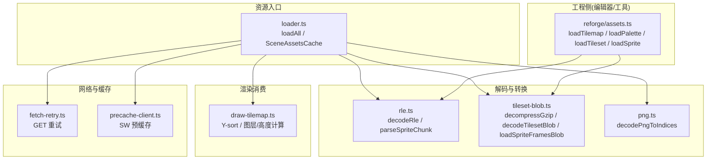
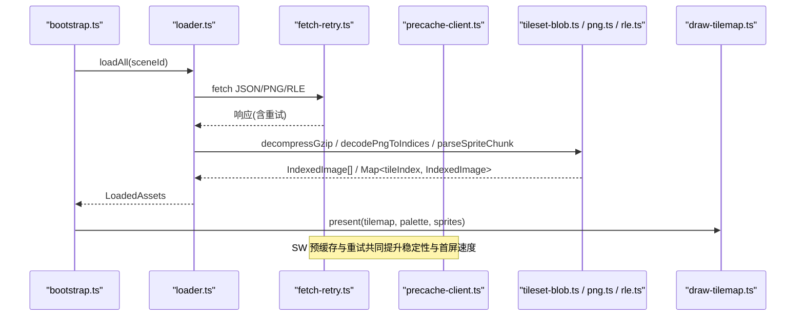
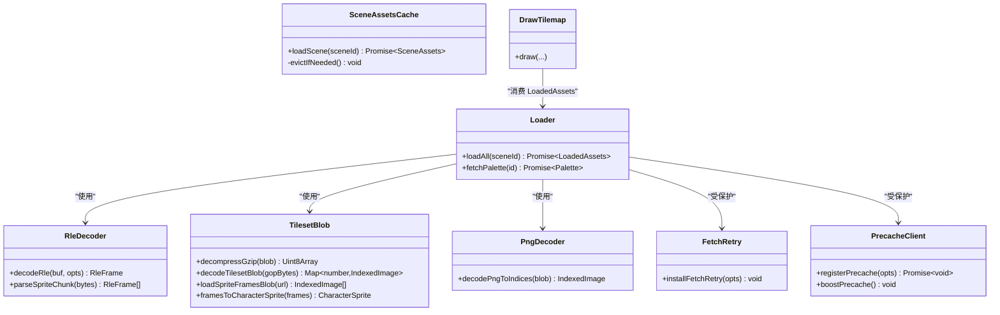

# 资源加载层 (Assets Layer)

<cite>
**本文引用的文件**   
- [packages/game/src/assets/loader.ts](file://packages/game/src/assets/loader.ts)
- [packages/game/src/assets/tileset-blob.ts](file://packages/game/src/assets/tileset-blob.ts)
- [packages/game/src/assets/png.ts](file://packages/game/src/assets/png.ts)
- [packages/shared/src/rle.ts](file://packages/shared/src/rle.ts)
- [packages/reforge/src/assets.ts](file://packages/reforge/src/assets.ts)
- [packages/game/src/shell/fetch-retry.ts](file://packages/game/src/shell/fetch-retry.ts)
- [packages/game/src/shell/precache-client.ts](file://packages/game/src/shell/precache-client.ts)
- [packages/game/src/shell/bootstrap.ts](file://packages/game/src/shell/bootstrap.ts)
- [packages/game/src/present/draw-tilemap.ts](file://packages/game/src/present/draw-tilemap.ts)
- [reference/sdlpal/map.h](file://reference/sdlpal/map.h)
- [reference/sdlpal/map.c](file://reference/sdlpal/map.c)
- [packages/game/src/shell/audio.ts](file://packages/game/src/shell/audio.ts)
</cite>

## 目录
1. [简介](#简介)
2. [项目结构](#项目结构)
3. [核心组件](#核心组件)
4. [架构总览](#架构总览)
5. [详细组件分析](#详细组件分析)
6. [依赖关系分析](#依赖关系分析)
7. [性能与内存优化](#性能与内存优化)
8. [故障排查指南](#故障排查指南)
9. [结论](#结论)
10. [附录：扩展新资源格式与自定义处理器](#附录：扩展新资源格式与自定义处理器)

## 简介
本文件系统性梳理 Type-Pal 的资源加载层设计与实现，覆盖现代资源格式（PNG 索引位图、JSON 数据、OGG 音频）、RLE 精灵图集与瓦片地图解析流程、异步加载策略（预缓存、懒加载、错误重试）、内存管理（场景 LRU 缓存、引用计数/释放策略）以及与上层解耦方式。同时给出添加新资源格式与自定义处理器的实践路径，并提供资源优化建议与性能监控方法。

## 项目结构
资源层围绕“统一入口 + 多格式解码 + 异步并发 + 缓存”组织：
- 统一入口：按场景一次性拉取 JSON 清单与关键资源，构建运行时可用对象集合。
- 解码器：RLE 精灵、PNG 索引位图、gzip RLE blob 解压。
- 异步策略：并行 fetch、SW 预缓存、网络层重试、按需懒加载。
- 内存管理：场景级 LRU 缓存、音频元素显式释放、tileset 帧数组复用。

图表来源
- [packages/game/src/assets/loader.ts:135-390](file://packages/game/src/assets/loader.ts#L135-L390)
- [packages/game/src/assets/tileset-blob.ts:1-151](file://packages/game/src/assets/tileset-blob.ts#L1-L151)
- [packages/game/src/assets/png.ts:1-50](file://packages/game/src/assets/png.ts#L1-L50)
- [packages/shared/src/rle.ts:1-58](file://packages/shared/src/rle.ts#L1-L58)
- [packages/reforge/src/assets.ts:1-99](file://packages/reforge/src/assets.ts#L1-L99)
- [packages/game/src/shell/fetch-retry.ts:1-57](file://packages/game/src/shell/fetch-retry.ts#L1-L57)
- [packages/game/src/shell/precache-client.ts:67-90](file://packages/game/src/shell/precache-client.ts#L67-L90)
- [packages/game/src/present/draw-tilemap.ts:1-352](file://packages/game/src/present/draw-tilemap.ts#L1-L352)

章节来源
- [packages/game/src/assets/loader.ts:135-390](file://packages/game/src/assets/loader.ts#L135-L390)
- [packages/game/src/assets/tileset-blob.ts:1-151](file://packages/game/src/assets/tileset-blob.ts#L1-L151)
- [packages/game/src/assets/png.ts:1-50](file://packages/game/src/assets/png.ts#L1-L50)
- [packages/shared/src/rle.ts:1-58](file://packages/shared/src/rle.ts#L1-L58)
- [packages/reforge/src/assets.ts:1-99](file://packages/reforge/src/assets.ts#L1-L99)
- [packages/game/src/shell/fetch-retry.ts:1-57](file://packages/game/src/shell/fetch-retry.ts#L1-L57)
- [packages/game/src/shell/precache-client.ts:67-90](file://packages/game/src/shell/precache-client.ts#L67-L90)
- [packages/game/src/present/draw-tilemap.ts:1-352](file://packages/game/src/present/draw-tilemap.ts#L1-L352)

## 核心组件
- 资源加载入口 loader.ts
  - 负责按场景拉取 tilemap、palette、事件、角色、战斗表等 JSON，并批量下载 tileset RLE blob、NPC/战斗/法术精灵 RLE blob、UI 与物品图标 PNG，组装为 LoadedAssets。
  - 提供 SceneAssetsCache 用于场景资源的 LRU 懒加载与淘汰回调。
- 解码与转换
  - shared/rle.ts：统一的 RLE 精灵解码与 sprite chunk 解析。
  - assets/tileset-blob.ts：gzip 解压、RLE→IndexedImage 转换、tileset Map 构造、字符精灵锚点计算。
  - assets/png.ts：PNG 索引位图解码，分离 indices 与 opaque mask。
- 渲染消费 draw-tilemap.ts
  - 基于 Tilemap 的层、高度与 Y-sort 规则进行绘制，严格对齐 sdlpal 的瓦片布局与遮挡逻辑。
- 网络与缓存
  - shell/fetch-retry.ts：全局 GET 幂等重试，应对 HTTP/2 GOAWAY 与瞬时网关错误。
  - shell/precache-client.ts：Service Worker 预缓存注册、进度上报、boost 提速。
- 工程侧 reforge/assets.ts
  - 面向编辑器/工具的轻量资源加载：tilemap、palette、tileset、sprite 的 URL 拼装与 gzip+RLE 解码。

章节来源
- [packages/game/src/assets/loader.ts:135-390](file://packages/game/src/assets/loader.ts#L135-L390)
- [packages/game/src/assets/tileset-blob.ts:1-151](file://packages/game/src/assets/tileset-blob.ts#L1-L151)
- [packages/game/src/assets/png.ts:1-50](file://packages/game/src/assets/png.ts#L1-L50)
- [packages/shared/src/rle.ts:1-58](file://packages/shared/src/rle.ts#L1-L58)
- [packages/game/src/present/draw-tilemap.ts:1-352](file://packages/game/src/present/draw-tilemap.ts#L1-L352)
- [packages/game/src/shell/fetch-retry.ts:1-57](file://packages/game/src/shell/fetch-retry.ts#L1-L57)
- [packages/game/src/shell/precache-client.ts:67-90](file://packages/game/src/shell/precache-client.ts#L67-L90)
- [packages/reforge/src/assets.ts:1-99](file://packages/reforge/src/assets.ts#L1-L99)

## 架构总览
资源层采用“入口聚合 + 并行 I/O + 统一解码 + 分层缓存”的架构。启动期通过 bootstrap 并行拉取字体、对话框资产与主资源；运行期通过 SceneAssetsCache 按需加载场景资源；网络层以 fetch-retry 兜底偶发失败；SW 预缓存降低冷启动时延。

图表来源
- [packages/game/src/shell/bootstrap.ts:215-236](file://packages/game/src/shell/bootstrap.ts#L215-L236)
- [packages/game/src/assets/loader.ts:135-390](file://packages/game/src/assets/loader.ts#L135-L390)
- [packages/game/src/shell/fetch-retry.ts:1-57](file://packages/game/src/shell/fetch-retry.ts#L1-L57)
- [packages/game/src/shell/precache-client.ts:67-90](file://packages/game/src/shell/precache-client.ts#L67-L90)
- [packages/game/src/assets/tileset-blob.ts:1-151](file://packages/game/src/assets/tileset-blob.ts#L1-L151)
- [packages/game/src/assets/png.ts:1-50](file://packages/game/src/assets/png.ts#L1-L50)
- [packages/shared/src/rle.ts:1-58](file://packages/shared/src/rle.ts#L1-L58)
- [packages/game/src/present/draw-tilemap.ts:1-352](file://packages/game/src/present/draw-tilemap.ts#L1-L352)

## 详细组件分析

### 资源加载入口 (loader.ts)
- 功能要点
  - 并行拉取 tilemap、palette、事件、角色、敌人、商店、词表等 JSON。
  - 根据 tilemap.tileset 字段拉取单张 gzip RLE tileset blob，解析为 Map<tileIndex, IndexedImage>。
  - 从 player-roles.json 与 scene.eventObjects 推导需要的大世界 NPC 精灵 id，批量加载 .rle 精灵帧。
  - 战斗相关：按 manifest 拉取 battle-sprite、battle-bg、魔法特效 overlay、UI 精灵与物品图标。
  - 返回 LoadedAssets 供上层使用。
- 关键数据结构
  - LoadedAssets：包含 tilemap、palette、scene、events、playerRoles、tileImages、characterSprites、各类战斗与 UI 资源映射等。
  - SceneAssetsCache：LRU 场景缓存，支持 onEvict 清理外部并行缓存、protect 保护当前渲染场景。
- 错误处理
  - 对可选资源（如 object-players.json、words.json、ui-sprite、items-icons）采用 catch + warn 降级，不中断主流程。
- 代码片段路径
  - [packages/game/src/assets/loader.ts:135-390](file://packages/game/src/assets/loader.ts#L135-L390)
  - [packages/game/src/assets/loader.ts:451-499](file://packages/game/src/assets/loader.ts#L451-L499)

章节来源
- [packages/game/src/assets/loader.ts:135-390](file://packages/game/src/assets/loader.ts#L135-L390)
- [packages/game/src/assets/loader.ts:451-499](file://packages/game/src/assets/loader.ts#L451-L499)

### 精灵与瓦片解码 (rle.ts / tileset-blob.ts / png.ts)
- RLE 精灵解码 (shared/rle.ts)
  - 统一 decodeRle 与 parseSpriteChunk，区分“整帧带文件头前缀”和“sprite-group 帧”两种情况。
  - 输出 RleFrame{width,height,pixels,opaque}，其中 opaque 明确表达透明跳过与 palette-0 可绘像素的区别。
- gzip RLE blob 加载 (assets/tileset-blob.ts)
  - decompressGzip：浏览器原生 DecompressionStream('gzip')，兼容 Content-Encoding 双解压防御。
  - decodeTilesetBlob：GOP chunk → Map<tileIndex, IndexedImage>，键与旧 framesToOut.index 一致。
  - loadSpriteFramesBlob：npc/battle/magic 共用，返回 IndexedImage[]。
  - framesToCharacterSprite：计算角色脚下锚点(anchorX=宽的一半, anchorY=高)。
- PNG 索引位图 (assets/png.ts)
  - 将 RGBA PNG 转为 {indices, opaque}，A 通道作为 opaque mask，解决 palette-0 被误判为透明的历史问题。
- 代码片段路径
  - [packages/shared/src/rle.ts:1-58](file://packages/shared/src/rle.ts#L1-L58)
  - [packages/game/src/assets/tileset-blob.ts:1-151](file://packages/game/src/assets/tileset-blob.ts#L1-L151)
  - [packages/game/src/assets/png.ts:1-50](file://packages/game/src/assets/png.ts#L1-L50)

章节来源
- [packages/shared/src/rle.ts:1-58](file://packages/shared/src/rle.ts#L1-L58)
- [packages/game/src/assets/tileset-blob.ts:1-151](file://packages/game/src/assets/tileset-blob.ts#L1-L151)
- [packages/game/src/assets/png.ts:1-50](file://packages/game/src/assets/png.ts#L1-L50)

### 瓦片地图渲染与偏移计算 (draw-tilemap.ts)
- 设计要点
  - 遵循 sdlpal map.c 的瓦片布局：每行两排(h=0,h=1)，Y 步进 16，h=1 相对 h=0 下移 8。
  - 层选择与 tileId 提取：底层与顶层分别按位域计算 tileId，顶层需减一。
  - 高度与遮挡：iTileHeight 决定覆盖判定与 baseY 排序键，确保正确遮挡。
- 与 sdlpal 对照
  - 参考 reference/sdlpal/map.h 与 map.c 的 Tiles[y][x][h] 布局与 PAL_MapGetTileBitmap 的位域解析。
- 代码片段路径
  - [packages/game/src/present/draw-tilemap.ts:1-352](file://packages/game/src/present/draw-tilemap.ts#L1-L352)
  - [reference/sdlpal/map.h:22-80](file://reference/sdlpal/map.h#L22-L80)
  - [reference/sdlpal/map.c:127-299](file://reference/sdlpal/map.c#L127-L299)

章节来源
- [packages/game/src/present/draw-tilemap.ts:1-352](file://packages/game/src/present/draw-tilemap.ts#L1-L352)
- [reference/sdlpal/map.h:22-80](file://reference/sdlpal/map.h#L22-L80)
- [reference/sdlpal/map.c:127-299](file://reference/sdlpal/map.c#L127-L299)

### 异步加载策略：预缓存、懒加载、错误重试
- 预缓存 (precache-client.ts)
  - 在开发环境禁用，生产环境注册 Service Worker，监听 precache-progress/done/error，支持 boostPrecache 提高并发。
  - 与主循环协作：modal 播放期间暂停预缓存，避免抢占视频/输入带宽。
- 懒加载 (SceneAssetsCache)
  - 基于 JS Map 顺序实现 LRU，命中刷新 MRU；支持 maxEntries 与 onEvict 联动清理外部缓存；protect 防止正在渲染的场景被回收。
- 错误重试 (fetch-retry.ts)
  - 仅对 GET 幂等请求生效，针对网络层失败与 502/503/504 进行指数退避重试，默认 2 次。
- 代码片段路径
  - [packages/game/src/shell/precache-client.ts:67-90](file://packages/game/src/shell/precache-client.ts#L67-L90)
  - [packages/game/src/assets/loader.ts:451-499](file://packages/game/src/assets/loader.ts#L451-L499)
  - [packages/game/src/shell/fetch-retry.ts:1-57](file://packages/game/src/shell/fetch-retry.ts#L1-L57)
  - [packages/game/src/shell/bootstrap.ts:471-494](file://packages/game/src/shell/bootstrap.ts#L471-L494)

章节来源
- [packages/game/src/shell/precache-client.ts:67-90](file://packages/game/src/shell/precache-client.ts#L67-L90)
- [packages/game/src/assets/loader.ts:451-499](file://packages/game/src/assets/loader.ts#L451-L499)
- [packages/game/src/shell/fetch-retry.ts:1-57](file://packages/game/src/shell/fetch-retry.ts#L1-L57)
- [packages/game/src/shell/bootstrap.ts:471-494](file://packages/game/src/shell/bootstrap.ts#L471-L494)

### 内存管理与资源释放
- 场景 LRU 缓存
  - SceneAssetsCache 控制最大条目数，淘汰最旧非 protected 场景，onEvict 回调由调用方清理并行缓存（例如 tileImagesBySceneId）。
- 精灵帧数组复用
  - rleFrameToIndexedImage 直接复用 RleFrame.pixels 作为 indices，避免拷贝，减少 GC 压力。
- 音频资源释放
  - OGG 音乐后端在切换曲目或停止时，pause + removeAttribute('src') + load()，彻底释放底层媒体资源，避免游离 HTMLAudioElement。
- 代码片段路径
  - [packages/game/src/assets/loader.ts:451-499](file://packages/game/src/assets/loader.ts#L451-L499)
  - [packages/game/src/assets/tileset-blob.ts:26-33](file://packages/game/src/assets/tileset-blob.ts#L26-L33)
  - [packages/game/src/shell/audio.ts:161-195](file://packages/game/src/shell/audio.ts#L161-L195)

章节来源
- [packages/game/src/assets/loader.ts:451-499](file://packages/game/src/assets/loader.ts#L451-L499)
- [packages/game/src/assets/tileset-blob.ts:26-33](file://packages/game/src/assets/tileset-blob.ts#L26-L33)
- [packages/game/src/shell/audio.ts:161-195](file://packages/game/src/shell/audio.ts#L161-L195)

### 资源依赖关系与上层解耦
- 解耦方式
  - loader.ts 只暴露 LoadedAssets 与 SceneAssetsCache，上层通过接口消费，无需关心具体 URL 与解码细节。
  - reforge/assets.ts 提供工程侧轻量加载，复用 shared 解码能力，保持与游戏端一致的语义。
- 依赖关系
  - loader.ts 依赖 shared/rle.ts、assets/tileset-blob.ts、assets/png.ts；draw-tilemap.ts 消费 tilemap 与 tileImages。
  - bootstrap.ts 协调 soundfont、glyphs、dialog 与 loadAll 并行加载，保证首屏体验。
- 代码片段路径
  - [packages/reforge/src/assets.ts:1-99](file://packages/reforge/src/assets.ts#L1-L99)
  - [packages/game/src/shell/bootstrap.ts:215-236](file://packages/game/src/shell/bootstrap.ts#L215-L236)

章节来源
- [packages/reforge/src/assets.ts:1-99](file://packages/reforge/src/assets.ts#L1-L99)
- [packages/game/src/shell/bootstrap.ts:215-236](file://packages/game/src/shell/bootstrap.ts#L215-L236)

## 依赖关系分析

图表来源
- [packages/game/src/assets/loader.ts:135-390](file://packages/game/src/assets/loader.ts#L135-L390)
- [packages/game/src/assets/tileset-blob.ts:1-151](file://packages/game/src/assets/tileset-blob.ts#L1-L151)
- [packages/game/src/assets/png.ts:1-50](file://packages/game/src/assets/png.ts#L1-L50)
- [packages/shared/src/rle.ts:1-58](file://packages/shared/src/rle.ts#L1-L58)
- [packages/game/src/present/draw-tilemap.ts:1-352](file://packages/game/src/present/draw-tilemap.ts#L1-L352)
- [packages/game/src/shell/fetch-retry.ts:1-57](file://packages/game/src/shell/fetch-retry.ts#L1-L57)
- [packages/game/src/shell/precache-client.ts:67-90](file://packages/game/src/shell/precache-client.ts#L67-L90)

## 性能与内存优化
- 请求合并与去重
  - 使用 manifest 驱动按需加载（如 magic fire-sprites 仅加载被 magics[].effect 引用的 chunk），避免全量 55 chunk。
- 二进制直传与零拷贝
  - tileset/npc/battle/magic 统一存为 gzip RLE blob，一次 fetch + 流式解压，避免大量小 PNG 请求与 createImageBitmap 开销。
  - IndexedImage.indices 直接复用 RleFrame.pixels，减少内存分配与 GC。
- 预缓存与让路
  - modal 播放期间暂停预缓存，避免抢占视频与用户输入带宽；进入后可 boostPrecache 提升并发。
- 音频资源释放
  - 切歌/停止时主动移除 src 并 load，确保底层媒体资源及时释放。
- 建议
  - 对超大资源（如 soundfont）提前到 boot 阶段并行下载，避免阻塞后续交互。
  - 对频繁切换场景启用 SceneAssetsCache.maxEntries 与 onEvict，配合 protect 保证当前场景不被回收。

[本节为通用指导，不直接分析具体文件]

## 故障排查指南
- 常见症状与定位
  - 资源 404/5xx：检查 BASE 路径与文件名是否匹配 loader.ts 中的 URL 模板；确认 fetchJson/fetchPng 的错误抛出位置。
  - 瓦片显示异常（透明错乱）：确认 PNG 的 A 通道是否正确写入 opaque；检查 draw-tilemap 的 opaque 判断逻辑。
  - 卡顿或黑屏：检查 SceneAssetsCache 的 maxEntries 与 protect 配置；确认 modal 期间预缓存已暂停。
  - 音频无声或内存泄漏：确认 OGG 后端 release 逻辑是否执行（removeAttribute('src') + load）。
- 调试技巧
  - 使用 fetch-retry 日志观察重试次数与退避间隔。
  - 在 SceneAssetsCache.onEvict 中打印被回收的 sceneId，评估缓存大小是否合理。
- 代码片段路径
  - [packages/game/src/assets/loader.ts:135-390](file://packages/game/src/assets/loader.ts#L135-L390)
  - [packages/game/src/assets/png.ts:1-50](file://packages/game/src/assets/png.ts#L1-L50)
  - [packages/game/src/present/draw-tilemap.ts:1-352](file://packages/game/src/present/draw-tilemap.ts#L1-L352)
  - [packages/game/src/shell/fetch-retry.ts:1-57](file://packages/game/src/shell/fetch-retry.ts#L1-L57)
  - [packages/game/src/shell/audio.ts:161-195](file://packages/game/src/shell/audio.ts#L161-L195)

章节来源
- [packages/game/src/assets/loader.ts:135-390](file://packages/game/src/assets/loader.ts#L135-L390)
- [packages/game/src/assets/png.ts:1-50](file://packages/game/src/assets/png.ts#L1-L50)
- [packages/game/src/present/draw-tilemap.ts:1-352](file://packages/game/src/present/draw-tilemap.ts#L1-L352)
- [packages/game/src/shell/fetch-retry.ts:1-57](file://packages/game/src/shell/fetch-retry.ts#L1-L57)
- [packages/game/src/shell/audio.ts:161-195](file://packages/game/src/shell/audio.ts#L161-L195)

## 结论
Type-Pal 资源加载层以“统一入口 + 并行 I/O + 统一解码 + 分层缓存”为核心，兼顾还原度与性能。通过 gzip RLE blob、IndexedImage 零拷贝、SceneAssetsCache LRU、fetch-retry 与 SW 预缓存，显著降低首屏时延与内存占用，并在错误场景具备良好降级能力。上层通过稳定接口消费资源，实现了解耦与可扩展性。

[本节为总结，不直接分析具体文件]

## 附录：扩展新资源格式与自定义处理器
- 新增资源格式步骤
  - 定义类型与 URL 模板：在 loader.ts 的 LoadedAssets 中添加新字段，并在 loadAll 中增加 fetch 与解析逻辑。
  - 实现解码器：若为新二进制格式，参照 tileset-blob.ts 的 decompressGzip + parseSpriteChunk 模式，封装为 loadXxxBlob。
  - 集成渲染消费：在 draw-* 模块中消费新资源，确保与现有 opaque/layer/height 体系一致。
  - 错误降级：对新资源采用 catch + warn 降级，避免影响主流程。
- 示例路径
  - 新增 JSON 数据加载：参考 loadAll 中对 enemies.json、magic.json 等的 fetchJson 用法。
  - 新增 RLE 精灵加载：参考 loadSpriteFramesBlob 与 loadCharacterSpriteBlob 的实现。
  - 新增 PNG 索引位图：参考 fetchPng 与 decodePngToIndices 的使用。
- 自定义资源处理器
  - 在 assets/ 目录下新建 xxx-handler.ts，导出 loadXxxBlob 与 decodeXxx 函数。
  - 在 loader.ts 中引入并使用，必要时加入 SceneAssetsCache 的 onEvict 清理逻辑。
- 代码片段路径
  - [packages/game/src/assets/loader.ts:135-390](file://packages/game/src/assets/loader.ts#L135-L390)
  - [packages/game/src/assets/tileset-blob.ts:1-151](file://packages/game/src/assets/tileset-blob.ts#L1-L151)
  - [packages/game/src/assets/png.ts:1-50](file://packages/game/src/assets/png.ts#L1-L50)

章节来源
- [packages/game/src/assets/loader.ts:135-390](file://packages/game/src/assets/loader.ts#L135-L390)
- [packages/game/src/assets/tileset-blob.ts:1-151](file://packages/game/src/assets/tileset-blob.ts#L1-L151)
- [packages/game/src/assets/png.ts:1-50](file://packages/game/src/assets/png.ts#L1-L50)