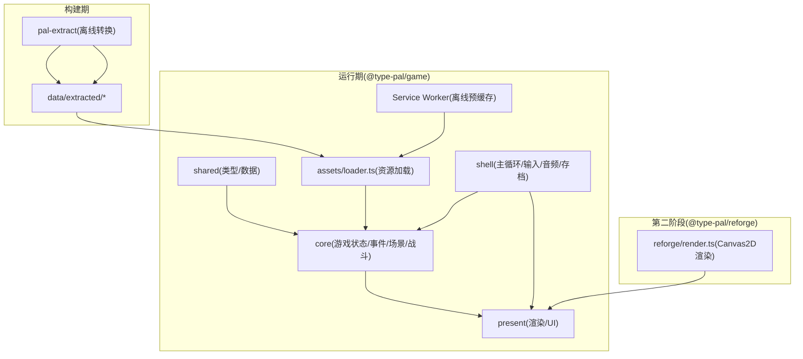
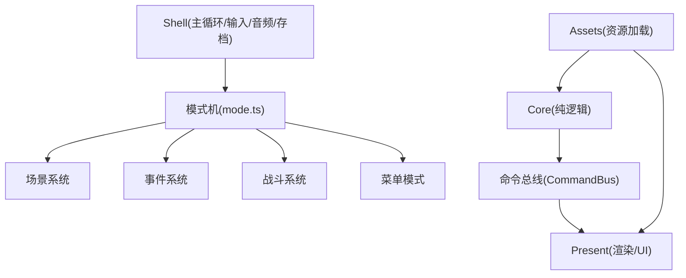
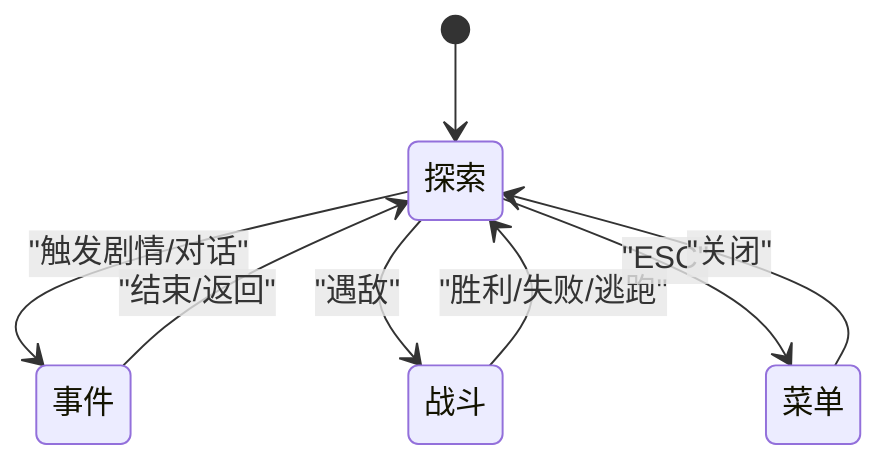
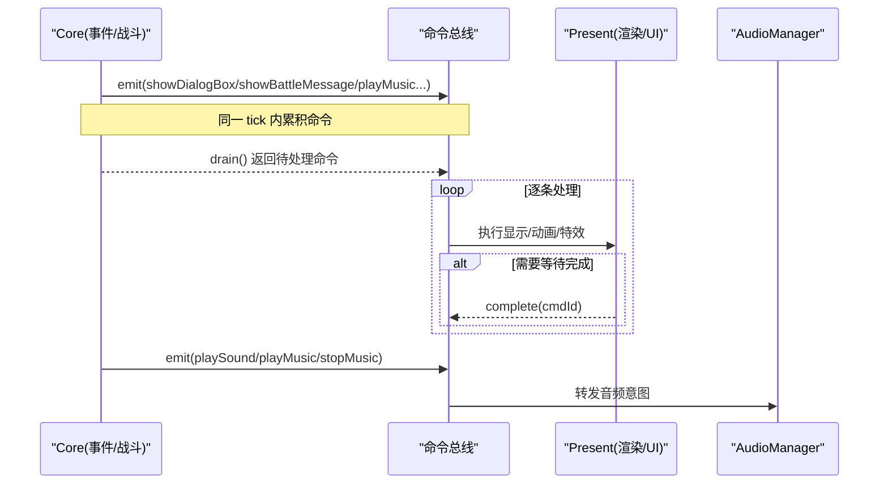
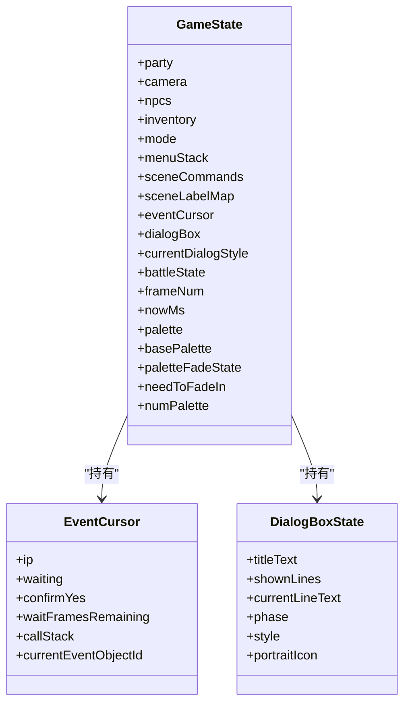
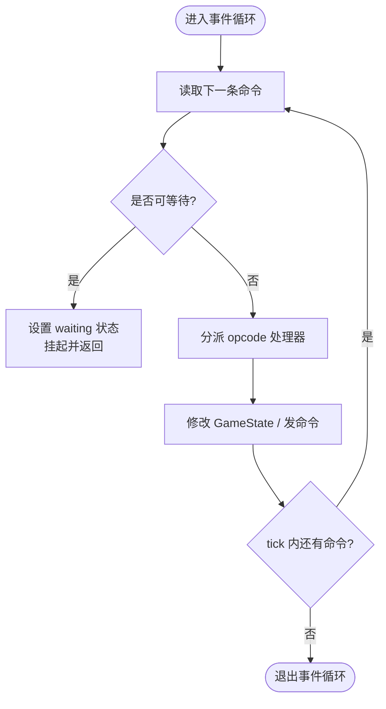
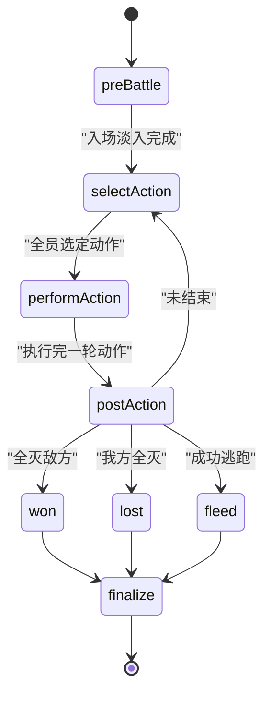
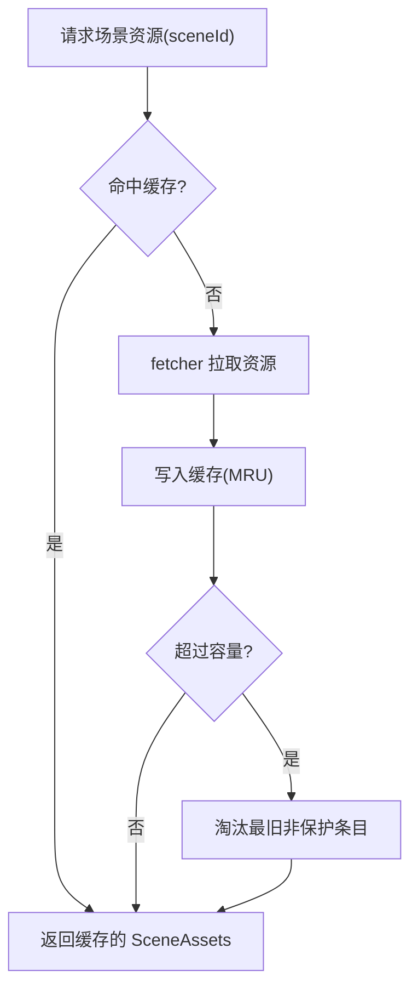
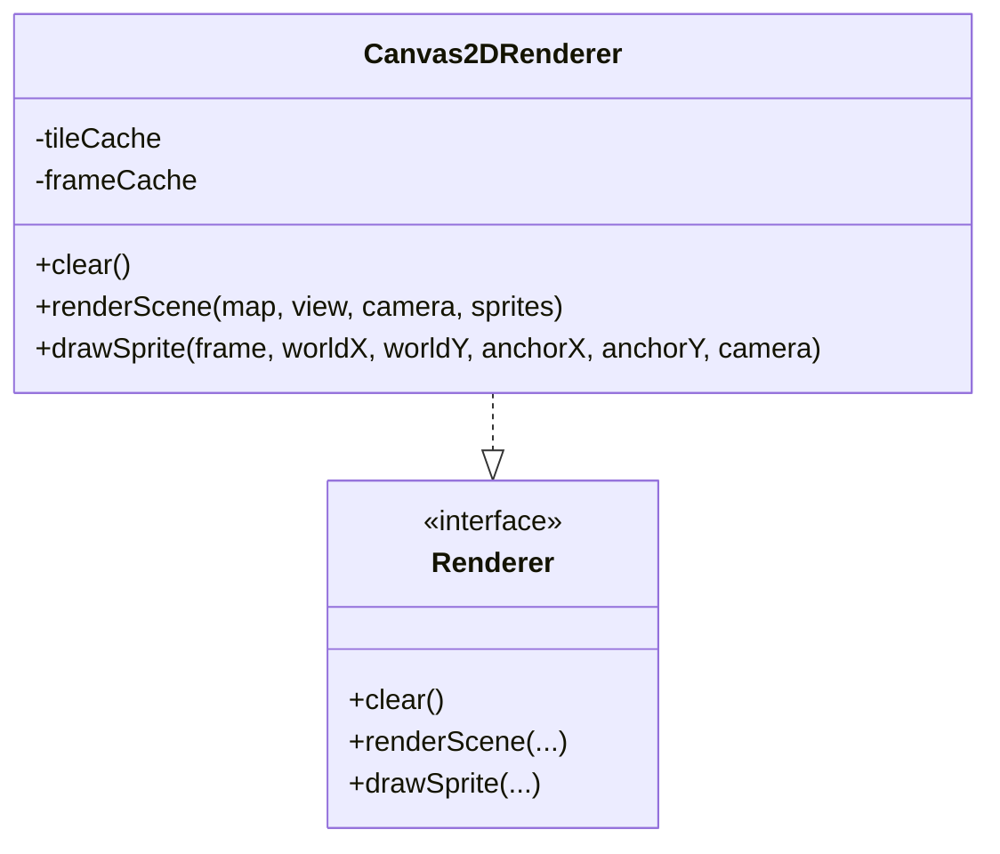
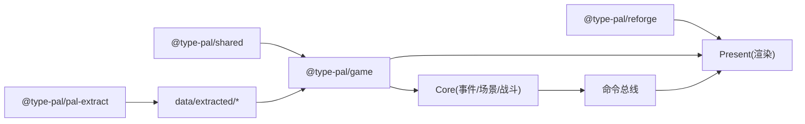

# 架构设计

<cite>
**本文引用的文件**   
- [README.md](file://README.md)
- [02-architecture.md](file://docs/phase1/02-architecture.md)
- [phase2 README.md](file://docs/phase2/README.md)
- [command-bus.ts](file://packages/game/src/core/command-bus.ts)
- [game-state.ts](file://packages/game/src/core/game-state.ts)
- [mode.ts](file://packages/game/src/core/mode.ts)
- [event-system.ts](file://packages/game/src/core/event-system.ts)
- [battle-system.ts](file://packages/game/src/core/battle/battle-system.ts)
- [render.ts](file://packages/reforge/src/render.ts)
- [loader.ts](file://packages/game/src/assets/loader.ts)
</cite>

## 目录
1. [引言](#引言)
2. [项目结构](#项目结构)
3. [核心组件](#核心组件)
4. [架构总览](#架构总览)
5. [详细组件分析](#详细组件分析)
6. [依赖关系分析](#依赖关系分析)
7. [性能考量](#性能考量)
8. [故障排查指南](#故障排查指南)
9. [结论](#结论)
10. [附录](#附录)

## 引言
Type-Pal 以“第一阶段：忠实还原”与“第二阶段：Reforge 重制版”双轨并行。第一阶段以 sdlpal 源码为行为真值，在 TypeScript 中重建资源提取、事件脚本、场景、战斗、菜单、存档、音频与演出系统；第二阶段采用全新引擎与内容编辑器，面向现代化管线与自有内容生产。两阶段严格隔离，避免混用。

本架构文档聚焦分层模式（Shell / Presentation / Core / Assets）、关键设计模式（状态机、命令总线、单一真相源），以及两阶段分离策略与扩展点。

章节来源
- [README.md:1-24](file://README.md#L1-L24)
- [02-architecture.md:1-26](file://docs/phase1/02-architecture.md#L1-L26)

## 项目结构
仓库采用 pnpm workspace 多包组织，核心包职责如下：
- shared：共享类型与数据结构（事件命令、数据表、输入等）
- pal-extract：离线资源提取工具（MKF → PNG/JSON/Ogg/MP4 等）
- game：浏览器运行时（场景、战斗、事件 VM、菜单、存档、音频、Canvas 表现层、工具面板、离线预缓存）
- reforge：第二阶段新引擎（Canvas 2D，切片 demo）
- content：第二阶段自有内容数据（早期）

图表来源
- [02-architecture.md:56-73](file://docs/phase1/02-architecture.md#L56-L73)
- [loader.ts:451-499](file://packages/game/src/assets/loader.ts#L451-L499)
- [render.ts:1-20](file://packages/reforge/src/render.ts#L1-L20)

章节来源
- [README.md:110-131](file://README.md#L110-L131)
- [02-architecture.md:56-73](file://docs/phase1/02-architecture.md#L56-L73)

## 核心组件
- GameState：唯一真相源，承载队伍、背包、金钱、事件对象状态、当前场景与坐标、游戏进度等，可序列化用于存档。
- 事件系统：协程式步进器，驱动对话、走位、淡屏、场景切换、商店菜单等，通过命令总线向表现层发令。
- 场景系统：地图、行走碰撞、NPC 行为、触发检测、相机滚动。
- 战斗系统：回合制流程、AI、伤害公式、经验升级、奖励结算。
- 命令总线：Core → Present 单向通道，支持同步队列与异步回执接口。
- 资源加载层：fetch png/json/ogg/mp4，不含 MKF；提供 LRU 场景资源缓存。
- 外壳层：requestAnimationFrame 主循环、固定步长逻辑 tick、输入快照、音频播放、IndexedDB 存档。

章节来源
- [02-architecture.md:81-104](file://docs/phase1/02-architecture.md#L81-L104)
- [command-bus.ts:1-89](file://packages/game/src/core/command-bus.ts#L1-L89)
- [game-state.ts:655-800](file://packages/game/src/core/game-state.ts#L655-L800)
- [loader.ts:451-499](file://packages/game/src/assets/loader.ts#L451-L499)

## 架构总览
分层与通信要点：
- Shell 层：主循环、输入、音频、存档；每 tick 收集输入快照并分发到当前模式。
- Presentation 层：渲染缓冲→Canvas 缩放、精灵/地图/文字/转场、消息框/菜单/战斗 UI。
- Core 层：纯逻辑，GameState 为单一真相源；事件系统作为“总导演”，串联场景、战斗、规则。
- Assets 层：只负责现代资源加载，不接触 MKF。

图表来源
- [02-architecture.md:56-73](file://docs/phase1/02-architecture.md#L56-L73)
- [mode.ts:15-88](file://packages/game/src/core/mode.ts#L15-L88)
- [command-bus.ts:63-88](file://packages/game/src/core/command-bus.ts#L63-L88)

## 详细组件分析

### 顶层模式机与状态机模式
- 模式枚举：探索/事件/战斗/菜单。
- 每 tick 推进全局 frameNum，按 gs.mode 分发到对应子系统。
- 特殊门控：自动脚本与追逐计时器仅在允许窗口内推进；从 battle/menu 切 event 时同帧再步进一次以避免露帧。

图表来源
- [mode.ts:15-88](file://packages/game/src/core/mode.ts#L15-L88)
- [game-state.ts:51-74](file://packages/game/src/core/game-state.ts#L51-L74)

章节来源
- [mode.ts:15-88](file://packages/game/src/core/mode.ts#L15-L88)
- [game-state.ts:51-74](file://packages/game/src/core/game-state.ts#L51-L74)

### 命令总线模式（系统间通信）
- Core 发出 PresentCommand，Present 在 tick 末 drain 消费。
- 支持异步回执：complete(cmdId) 用于转场/视频等需要等待完成的命令。
- 命令集覆盖对话框、战斗 UI、音效/BGM 意图等。

图表来源
- [command-bus.ts:9-57](file://packages/game/src/core/command-bus.ts#L9-L57)
- [command-bus.ts:63-88](file://packages/game/src/core/command-bus.ts#L63-L88)

章节来源
- [command-bus.ts:1-89](file://packages/game/src/core/command-bus.ts#L1-L89)

### 单一真相源：GameState 设计
- 所有系统读写 GameState，保证状态一致性。
- 字段包含队伍、背包、金钱、事件对象状态、当前场景与坐标、游戏进度、调色板与淡入淡出状态、对话框状态、战斗状态等。
- 可序列化：存档 = JSON 化；读档 = 还原后继续运行。

图表来源
- [game-state.ts:655-800](file://packages/game/src/core/game-state.ts#L655-L800)
- [game-state.ts:226-343](file://packages/game/src/core/game-state.ts#L226-L343)
- [game-state.ts:354-496](file://packages/game/src/core/game-state.ts#L354-L496)

章节来源
- [game-state.ts:655-800](file://packages/game/src/core/game-state.ts#L655-L800)

### 事件系统（协程式步进器）
- 单 tick 内连跑非阻塞命令，遇到 waitable/end/越界才返回。
- 支持大量 opcode：移动、镜头、淡屏、场景切换、商店菜单、物品/法术/装备效果、随机跳转、条件分支等。
- 通过注入点与外部模块解耦（如 startBattleHandler、sceneLoader、mapReloader、obstacleChecker、paletteSource）。

图表来源
- [event-system.ts:1-25](file://packages/game/src/core/event-system.ts#L1-L25)
- [event-system.ts:817-837](file://packages/game/src/core/event-system.ts#L817-L837)

章节来源
- [event-system.ts:1-25](file://packages/game/src/core/event-system.ts#L1-L25)
- [event-system.ts:817-837](file://packages/game/src/core/event-system.ts#L817-L837)

### 战斗系统（回合制 phase 状态机）
- Phase 流转：preBattle → selectAction → performAction → postAction → won/lost/fleed → finalize → explore。
- 入场淡入、死亡淡出、逃跑动画、回合起手脚本、行动队列构建、AI 决策、结算演出等均有 hold 机制确保时序正确。
- 通过 __battleResources 暂存战斗所需数据表，避免污染 GameState 主表。

图表来源
- [battle-system.ts:1-27](file://packages/game/src/core/battle/battle-system.ts#L1-L27)
- [battle-system.ts:472-614](file://packages/game/src/core/battle/battle-system.ts#L472-L614)

章节来源
- [battle-system.ts:1-27](file://packages/game/src/core/battle/battle-system.ts#L1-L27)
- [battle-system.ts:472-614](file://packages/game/src/core/battle/battle-system.ts#L472-L614)

### 资源加载与缓存（Assets 层）
- 仅加载现代资源（png/json/ogg/mp4），不包含 MKF。
- SceneAssetsCache 使用 Map 实现 LRU 缓存，支持保护当前场景不被淘汰。
- 战斗相关资源（精灵、背景、特效 RLE 等）按需加载与缓存。

图表来源
- [loader.ts:451-499](file://packages/game/src/assets/loader.ts#L451-L499)

章节来源
- [loader.ts:451-499](file://packages/game/src/assets/loader.ts#L451-L499)

### 第二阶段 Reforge 渲染基础
- Canvas 2D 渲染器，基于 Y 深度排序实现遮挡（cover-tile）。
- 将精灵与高瓦片统一入深度表，按 baseY 升序绘制，确保正确遮挡。
- 提供 renderSceneFrame 抽象，便于编辑器复用。

图表来源
- [render.ts:73-85](file://packages/reforge/src/render.ts#L73-L85)
- [render.ts:87-165](file://packages/reforge/src/render.ts#L87-L165)

章节来源
- [render.ts:1-20](file://packages/reforge/src/render.ts#L1-L20)
- [render.ts:73-85](file://packages/reforge/src/render.ts#L73-L85)
- [render.ts:87-165](file://packages/reforge/src/render.ts#L87-L165)

## 依赖关系分析
- 包级依赖：
  - @type-pal/game 依赖 @type-pal/shared（类型/数据）
  - @type-pal/pal-extract 独立于运行时，产出 data/extracted
  - @type-pal/reforge 独立新引擎，复用部分渲染原语
- 模块耦合：
  - mode.ts 聚合 scene/event/battle/menu 子系统
  - event-system.ts 通过注入点与外部模块解耦（startBattleHandler、sceneLoader、mapReloader、obstacleChecker、paletteSource）
  - battle-system.ts 通过 __battleResources 访问数据表，避免直接耦合 bootstrap
  - assets/loader.ts 提供 SceneAssetsCache，供场景切换与战斗资源加载使用

图表来源
- [README.md:110-131](file://README.md#L110-L131)
- [02-architecture.md:56-73](file://docs/phase1/02-architecture.md#L56-L73)

章节来源
- [README.md:110-131](file://README.md#L110-L131)
- [02-architecture.md:56-73](file://docs/phase1/02-architecture.md#L56-L73)

## 性能考量
- 固定步长逻辑 tick：探索/事件/菜单 10fps，战斗 25fps，保持原版节奏。
- 资源缓存：SceneAssetsCache 使用 LRU，减少重复 fetch；RLE 精灵打包为 blob 降低 IO。
- 渲染优化：Canvas 2D 帧缓存与 tile 缓存，按 baseY 排序减少覆盖计算。
- 防卡死兜底：战斗 phase stall 阈值保护，避免异常导致无限等待。

[本节为通用指导，无需具体文件分析]

## 故障排查指南
- 事件系统无响应：检查 cursor.waiting 是否为 dialog/frame-wait/fade-screen 等阻塞态；确认 autoScript 白名单是否放行。
- 战斗卡顿或闪退：查看 phaseStallTicks 是否超限；确认 __battleResources 是否正确注入；核对 introFadeTicks 配置。
- 场景切换黑屏：确认 needToFadeIn 与 paletteFadeState 状态；检查 tickSceneAutoFadeIn 是否被调用。
- 资源缺失：关注 loader 警告日志；确认 data/extracted 路径与软链正确。

章节来源
- [event-system.ts:645-671](file://packages/game/src/core/event-system.ts#L645-L671)
- [battle-system.ts:472-514](file://packages/game/src/core/battle/battle-system.ts#L472-L514)
- [loader.ts:239-276](file://packages/game/src/assets/loader.ts#L239-L276)

## 结论
Type-Pal 的分层架构清晰、职责明确：Shell 负责驱动与外设，Presentation 专注表现，Core 保持纯逻辑与单一真相源，Assets 提供稳定资源入口。通过状态机、命令总线与单一真相源三大模式，系统在忠实还原与可扩展性之间取得平衡。两阶段分离策略使“保真”与“现代化”并行演进，互不干扰。

[本节为总结，无需具体文件分析]

## 附录
- 两阶段分离策略
  - 第一阶段：离线转换 + 运行时，MKF 解析仅在 pal-extract 中，运行时不感知 MKF。
  - 第二阶段：Reforge 新引擎，Canvas 2D 渲染与编辑器，不对齐旧引擎行为，架构优先。
- 扩展点说明
  - 新场景：新增 map.json + events.json
  - 新物品/法术/怪物：追加 data/*.json 条目
  - 新玩法机制：新增系统模块并接入模式机
  - 编辑器复用：reforge 导出渲染原语与加载器，供编辑器直接使用

章节来源
- [02-architecture.md:3-26](file://docs/phase1/02-architecture.md#L3-L26)
- [phase2 README.md:1-20](file://docs/phase2/README.md#L1-L20)
- [02-architecture.md:116-124](file://docs/phase1/02-architecture.md#L116-L124)