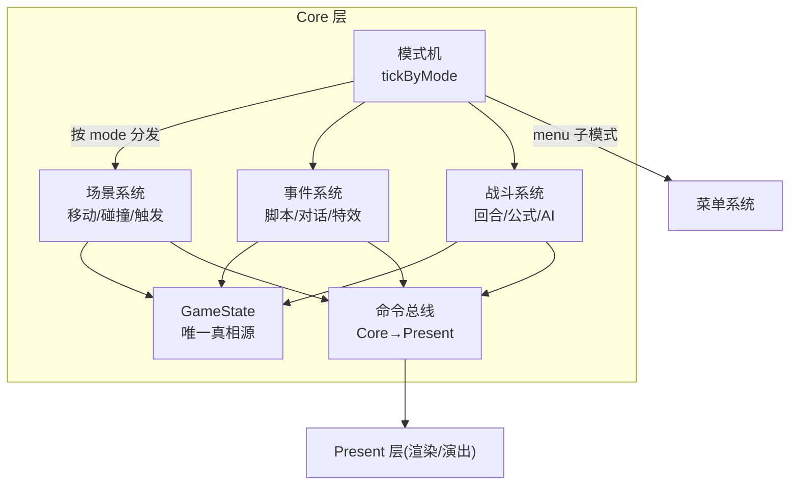
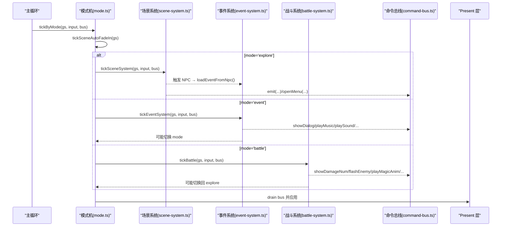
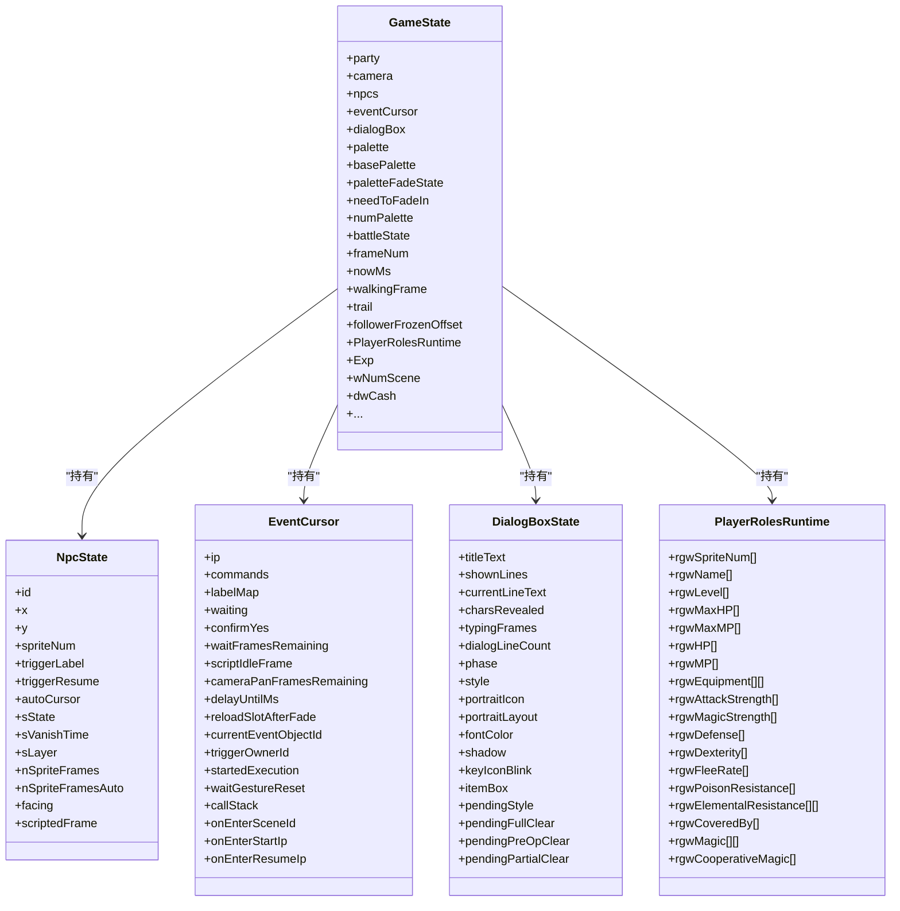
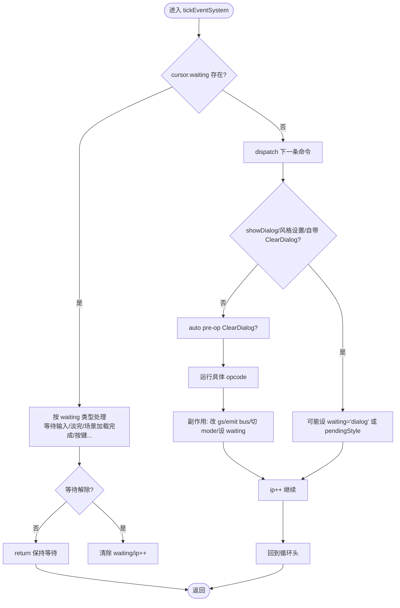
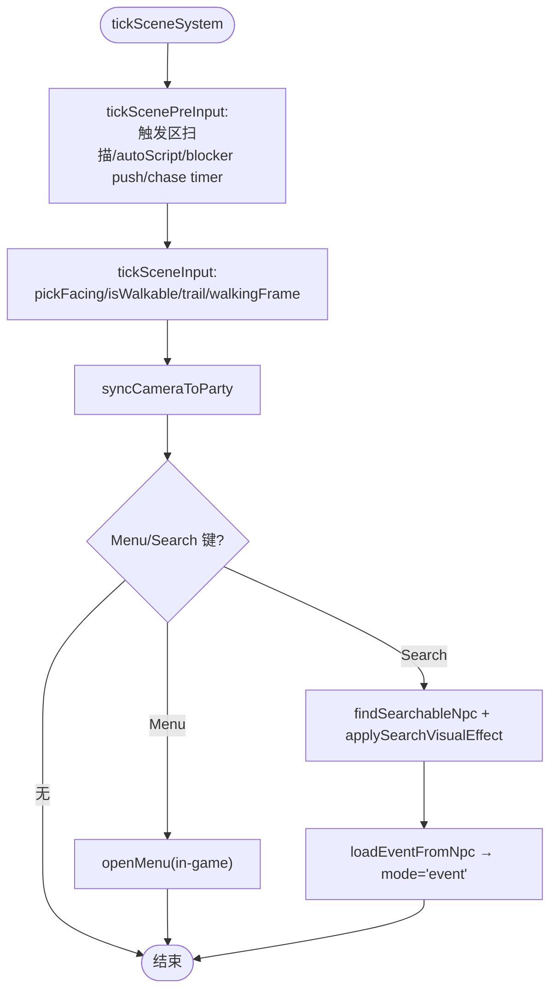
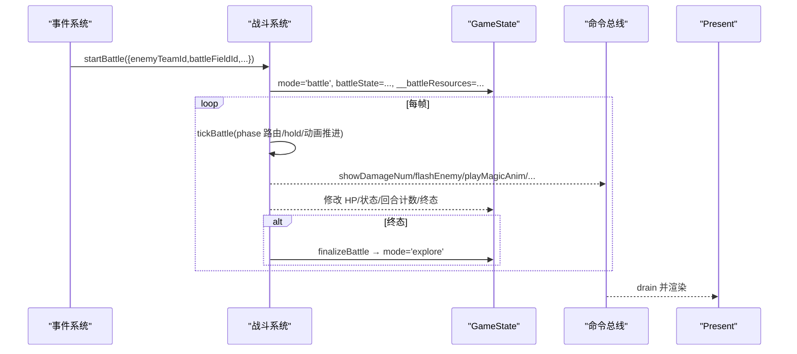
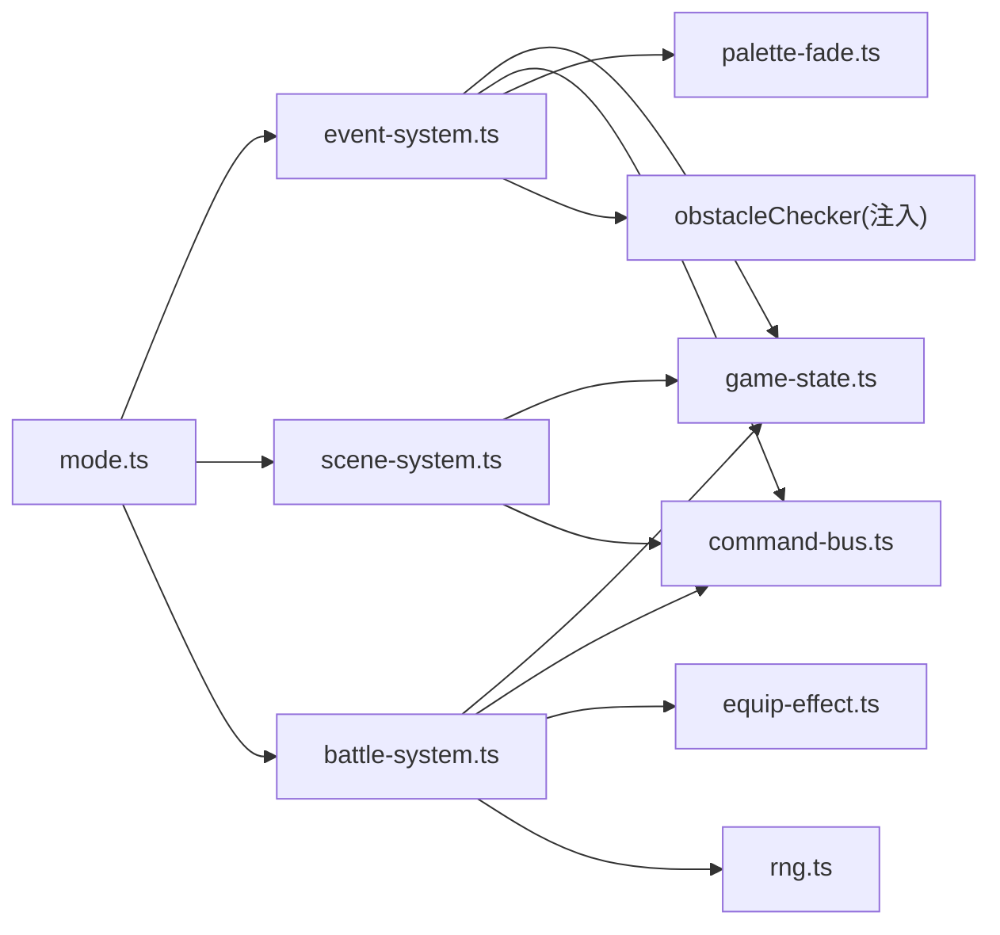

# 核心系统概览

<cite>
**本文引用的文件**   
- [README.md](file://README.md)
- [02-architecture.md](file://docs/phase1/02-architecture.md)
- [game-state.ts](file://packages/game/src/core/game-state.ts)
- [event-system.ts](file://packages/game/src/core/event-system.ts)
- [scene-system.ts](file://packages/game/src/core/scene-system.ts)
- [battle-system.ts](file://packages/game/src/core/battle/battle-system.ts)
- [command-bus.ts](file://packages/game/src/core/command-bus.ts)
- [mode.ts](file://packages/game/src/core/mode.ts)
</cite>

## 目录
1. [引言](#引言)
2. [项目结构](#项目结构)
3. [核心组件](#核心组件)
4. [架构总览](#架构总览)
5. [详细组件分析](#详细组件分析)
6. [依赖关系分析](#依赖关系分析)
7. [性能考量](#性能考量)
8. [故障排查指南](#故障排查指南)
9. [结论](#结论)
10. [附录](#附录)

## 引言
本概览聚焦 Core 层的四大核心系统与一条总线：GameState（唯一真相源）、事件系统（总导演编排）、场景系统（地图与碰撞检测）、战斗系统（回合制逻辑），以及 CommandBus（命令总线）。文档将说明各系统的职责边界、数据流向与交互关系，给出架构图与关键数据结构说明，并解释如何通过命令总线实现松耦合通信，最后提供扩展指南与最佳实践。

## 项目结构
Type-Pal 第一阶段以浏览器运行时为核心，Core 层位于 packages/game/src/core，包含状态、事件、场景、战斗、菜单、存档等子系统；Present 层负责渲染与表现；Shell 层负责音频、启动、离线预缓存等。顶层模式机根据 GameState.mode 分发到对应 tick 函数。

图表来源
- [mode.ts:15-89](file://packages/game/src/core/mode.ts#L15-L89)
- [02-architecture.md:81-104](file://docs/phase1/02-architecture.md#L81-L104)

章节来源
- [README.md:110-131](file://README.md#L110-L131)
- [02-architecture.md:81-104](file://docs/phase1/02-architecture.md#L81-L104)

## 核心组件
- GameState：所有可序列化游戏状态的单一真相源，包含队伍、角色、背包、金钱、当前场景、事件光标、对话框、调色板淡入淡出、相机、跟随者轨迹、战斗临时态等。
- 事件系统：解析并执行事件脚本（含对话、跳转、等待、特效、资源切换、商店、战斗入口等），维护 EventCursor 的 waiting 语义，驱动全局 autoScript 与追逐计时器。
- 场景系统：探索模式主循环，处理输入→走路/转向→碰撞→自动触发区→Confirm Search→切事件模式或打开菜单。
- 战斗系统：回合制 phase 状态机（preBattle → selectAction → performAction → postAction → won/lost/fleed），管理行动队列、AI、动画时间线、结算演出与淡入淡出 hold。
- 命令总线：Core 向 Present 单向发送指令（对话、音效、BGM、战斗 UI、伤害数字等），Present 每帧 drain 消费。

章节来源
- [game-state.ts:655-800](file://packages/game/src/core/game-state.ts#L655-L800)
- [event-system.ts:1-120](file://packages/game/src/core/event-system.ts#L1-L120)
- [scene-system.ts:1-80](file://packages/game/src/core/scene-system.ts#L1-L80)
- [battle-system.ts:1-120](file://packages/game/src/core/battle/battle-system.ts#L1-L120)
- [command-bus.ts:1-89](file://packages/game/src/core/command-bus.ts#L1-L89)

## 架构总览
顶层模式机每帧推进 frameNum，并根据 gs.mode 调用对应 tick。事件系统在 event 模式下通过 EventCursor.waiting 控制是否放行 autoScript 与追逐计时器；场景系统在 explore 模式下先做“脚本结束后的首帧抑制”，再扫描触发区、跑 autoScript、推离阻挡物、更新追逐计时器，然后处理输入与搜索；战斗系统在 battle 模式下按 phase 路由，并在多个 hold 阶段（死亡淡出、逃跑动画、战斗内对话、胜利结算）暂停推进。

图表来源
- [mode.ts:15-89](file://packages/game/src/core/mode.ts#L15-L89)
- [scene-system.ts:443-584](file://packages/game/src/core/scene-system.ts#L443-L584)
- [event-system.ts:1-120](file://packages/game/src/core/event-system.ts#L1-L120)
- [battle-system.ts:472-614](file://packages/game/src/core/battle/battle-system.ts#L472-L614)
- [command-bus.ts:63-89](file://packages/game/src/core/command-bus.ts#L63-L89)

## 详细组件分析

### GameState（唯一真相源）
- 职责：集中保存所有可持久化与跨系统共享的状态，包括队伍坐标与朝向、相机、NPC 列表与状态、事件光标、对话框样式与打字进度、调色板工作副本与淡入淡出状态、战斗临时态、经验与角色运行时属性等。
- 关键数据结构
  - NpcState：位置、精灵帧、触发器状态、autoScript 游标、可见性计时、图层、姿势覆盖等。
  - EventCursor：当前脚本 ip、waiting 原因、callStack、onEnter 持久化信息、currentEventObjectId 等。
  - DialogBoxState：多行文本、逐字显示时序、翻页/清屏策略、头像布局、字体色、待清理标记等。
  - PlayerRolesRuntime：角色运行时字段（等级、HP/MP、装备槽、属性、魔法、合击等）。
  - EquipmentEffectRoles：装备效果叠加的 stat 行映射。
  - SceneStateMutable / ObjectStateMutable：场景与对象的可变部分（稀疏存）。
- 数据流：各系统仅读写其关心的字段；存档即 JSON 序列化；读档即还原后由 bootstrap 初始化缺失项。

图表来源
- [game-state.ts:655-800](file://packages/game/src/core/game-state.ts#L655-L800)
- [game-state.ts:82-224](file://packages/game/src/core/game-state.ts#L82-L224)
- [game-state.ts:226-343](file://packages/game/src/core/game-state.ts#L226-L343)
- [game-state.ts:354-496](file://packages/game/src/core/game-state.ts#L354-L496)
- [game-state.ts:536-606](file://packages/game/src/core/game-state.ts#L536-L606)

章节来源
- [game-state.ts:655-800](file://packages/game/src/core/game-state.ts#L655-L800)
- [game-state.ts:82-224](file://packages/game/src/core/game-state.ts#L82-L224)
- [game-state.ts:226-343](file://packages/game/src/core/game-state.ts#L226-L343)
- [game-state.ts:354-496](file://packages/game/src/core/game-state.ts#L354-L496)
- [game-state.ts:536-606](file://packages/game/src/core/game-state.ts#L536-L606)

### 事件系统（总导演编排）
- 职责：解析并步进事件脚本，维护 EventCursor 的 waiting 语义；支持对话、跳转、条件分支、延时、淡入淡出、场景切换、音乐/SFX、商店菜单、战斗入口、摄像机平移、RNG/FBP 播放、退出/加载存档等。
- 关键机制
  - opcode 常量与具名命令：大量 opcode 在 event-system.ts 中定义与分发，raw 路径兜底。
  - waiting 语义：如 'dialog'、'fade-screen'、'scene-load'、'delay'、'palette-fade'、'scene-fade'、'wait-key'、'quit'、'confirm'、'camera-pan' 等，配合 mode.ts 决定是否放行 autoScript。
  - 特效 A：调色板 ramp fade（FadeOut/FadeIn/PaletteFade/ColorFade/FadeToRed/SceneFade），由 gs.paletteFadeState 驱动，present 层每帧 ramp。
  - 自动脚本：每 tick 对符合条件的 NPC 推进 autoCursor，受 waiting 门控。
- 数据流：读取/写入 GameState 的 eventCursor、dialogBox、palette 相关字段、music/sound 意图通过 bus 下发。

图表来源
- [event-system.ts:1-120](file://packages/game/src/core/event-system.ts#L1-L120)
- [event-system.ts:500-533](file://packages/game/src/core/event-system.ts#L500-L533)
- [event-system.ts:571-608](file://packages/game/src/core/event-system.ts#L571-L608)
- [event-system.ts:645-671](file://packages/game/src/core/event-system.ts#L645-L671)

章节来源
- [event-system.ts:1-120](file://packages/game/src/core/event-system.ts#L1-L120)
- [event-system.ts:500-533](file://packages/game/src/core/event-system.ts#L500-L533)
- [event-system.ts:571-608](file://packages/game/src/core/event-system.ts#L571-L608)
- [event-system.ts:645-671](file://packages/game/src/core/event-system.ts#L645-L671)

### 场景系统（地图与碰撞检测）
- 职责：探索模式主循环，处理输入→走路/转向→碰撞→自动触发区→Confirm Search→切事件模式或打开菜单；同时负责相机跟随与边界 clamp。
- 关键算法
  - 菱形 isometric 碰撞：像素→(col,row,h)，查 tilemap obstacle bit 13，再查 NPC 菱形曼哈顿距离（sState>=2 才阻挡）。
  - 自动触发区：Manhattan 距离阈值随 triggerMode 变化（4..8）。
  - 搜索视觉反馈：NPC 面向玩家反方向+站立帧；全队面向 NPC。
  - 推离阻挡：当 party anchor 被 sState>=2 的 NPC 压到时，沿 NPC 朝向顺时针尝试推离一格。
- 数据流：读取/写入 gs.party、gs.camera、gs.npcs、gs.walkingFrame、gs.trail、gs.fScriptSuccess、gs.eventCursor、gs.mode 等。

图表来源
- [scene-system.ts:443-584](file://packages/game/src/core/scene-system.ts#L443-L584)
- [scene-system.ts:371-425](file://packages/game/src/core/scene-system.ts#L371-L425)
- [scene-system.ts:187-267](file://packages/game/src/core/scene-system.ts#L187-L267)
- [scene-system.ts:276-296](file://packages/game/src/core/scene-system.ts#L276-L296)

章节来源
- [scene-system.ts:443-584](file://packages/game/src/core/scene-system.ts#L443-L584)
- [scene-system.ts:371-425](file://packages/game/src/core/scene-system.ts#L371-L425)
- [scene-system.ts:187-267](file://packages/game/src/core/scene-system.ts#L187-L267)
- [scene-system.ts:276-296](file://packages/game/src/core/scene-system.ts#L276-L296)

### 战斗系统（回合制逻辑）
- 职责：回合制 phase 状态机，管理入场淡入、选指令、构建行动队列、执行动作、状态/毒效推进、逃跑/敌人逃逸动画、胜利结算演出、淡出 hold 等。
- 关键流程
  - startBattle：展开敌方队伍、准备 RNG/BattleState、复活倒地队员、重算装备 effect、保存波场、注入 runScript。
  - tickBattle：死循环保护、各类 hold（死亡淡出、战斗内对话、逃跑动画、结算演出）、turnStart 脚本、idle 动画推进、selectAction/performAction/postAction 路由。
  - ActionQueue：dex 倍率（合击×10、防御×5、辅助法术×3、物品×3、逃跑÷2），CLASSIC 抖动与双动规则。
- 数据流：读写 gs.battleState、__battleResources（items/spells/magics/playerRoles/commands 等）、gs.dialogBox、gs.mode 等；通过 bus 下发战斗 UI 与动画指令。

图表来源
- [battle-system.ts:277-419](file://packages/game/src/core/battle/battle-system.ts#L277-L419)
- [battle-system.ts:472-614](file://packages/game/src/core/battle/battle-system.ts#L472-L614)
- [battle-system.ts:679-800](file://packages/game/src/core/battle/battle-system.ts#L679-L800)
- [command-bus.ts:9-57](file://packages/game/src/core/command-bus.ts#L9-L57)

章节来源
- [battle-system.ts:277-419](file://packages/game/src/core/battle/battle-system.ts#L277-L419)
- [battle-system.ts:472-614](file://packages/game/src/core/battle/battle-system.ts#L472-L614)
- [battle-system.ts:679-800](file://packages/game/src/core/battle/battle-system.ts#L679-L800)
- [command-bus.ts:9-57](file://packages/game/src/core/command-bus.ts#L9-L57)

### 命令总线（松耦合通信）
- 职责：Core 系统每帧 emit 呈现指令，Present 层 drain 消费；为异步回执预留接口（M3 转场/视频时激活）。
- 典型指令：对话框、战斗消息、伤害数字、闪烁、攻击/法术动画、音效、BGM 播放/停止、战斗 UI 显隐等。
- 使用方式：各系统在 tick 内 emit，tick 末统一 drain 并应用到 Present。

章节来源
- [command-bus.ts:1-89](file://packages/game/src/core/command-bus.ts#L1-L89)

## 依赖关系分析
- 顶层模式机（mode.ts）依赖四个 tick 函数，依据 gs.mode 分发；autoScript 与追逐计时器的运行时机受 eventCursor.waiting 门控。
- 场景系统依赖事件系统（触发 NPC 后载入事件）、菜单系统（快捷菜单）、命令总线（UI 意图）。
- 事件系统依赖命令总线（播放音/乐、对话）、调色板淡入淡出模块、世界障碍检测（通过注入回调避免环依赖）。
- 战斗系统依赖事件系统（runScript）、装备效果计算、随机数生成、菜单系统（选择 UI）、命令总线（战斗演出）。
- 所有系统共同读写 GameState，形成“单真相源”的数据中心。

图表来源
- [mode.ts:15-89](file://packages/game/src/core/mode.ts#L15-L89)
- [event-system.ts:1-120](file://packages/game/src/core/event-system.ts#L1-L120)
- [scene-system.ts:1-80](file://packages/game/src/core/scene-system.ts#L1-L80)
- [battle-system.ts:1-120](file://packages/game/src/core/battle/battle-system.ts#L1-L120)
- [command-bus.ts:1-89](file://packages/game/src/core/command-bus.ts#L1-L89)

章节来源
- [mode.ts:15-89](file://packages/game/src/core/mode.ts#L15-L89)
- [event-system.ts:1-120](file://packages/game/src/core/event-system.ts#L1-L120)
- [scene-system.ts:1-80](file://packages/game/src/core/scene-system.ts#L1-L80)
- [battle-system.ts:1-120](file://packages/game/src/core/battle/battle-system.ts#L1-L120)
- [command-bus.ts:1-89](file://packages/game/src/core/command-bus.ts#L1-L89)

## 性能考量
- 事件系统单 tick 限制：防止 goto 自指/raw 链导致死循环（SINGLE_TICK_LIMIT）。
- 战斗系统防卡死：非 selectAction 阶段的 phaseStallTicks 超过阈值强制退出，避免长时间阻塞。
- 碰撞判定：isWalkable 采用位运算与整数比较，避免浮点开销；NPC 阻挡用曼哈顿距离快速剪枝。
- 调色板淡入淡出：ramp 操作在 present 层批量刷新，减少频繁 DOM/Canvas 操作。
- 资源访问：战斗资源通过 __battleResources 缓存，避免重复查找；全局脚本数组单一来源减少内存拷贝。

[本节为通用指导，不直接分析具体文件]

## 故障排查指南
- 黑屏无法恢复：检查 needToFadeIn 与 paletteFadeState 状态，确认 explore 模式 auto fade-in 是否被正确触发。
- 对话不消失或错行：核对 dialogBox.pendingStyle/pendingFullClear/pendingPreOpClear/pendingPartialClear 标志与 page-advance 路径。
- 自动触发区无效：确认 npc.triggerMode 与 sState 值、autoTriggerAnchorX/Y 是否偏移了判定中心。
- 战斗开场菜单闪一下：检查 battle-menu 起跳时机与 turnStart 脚本/动画 hold 顺序，确保菜单在 turnStart 之后才出现。
- 事件脚本未执行：查看 eventCursor.waiting 是否为 'dialog'/'fade-screen'/'scene-load' 等，确认 mode.ts 的 shouldRunAutoScripts 门控。

章节来源
- [event-system.ts:500-533](file://packages/game/src/core/event-system.ts#L500-L533)
- [event-system.ts:645-671](file://packages/game/src/core/event-system.ts#L645-L671)
- [scene-system.ts:443-584](file://packages/game/src/core/scene-system.ts#L443-L584)
- [battle-system.ts:472-614](file://packages/game/src/core/battle/battle-system.ts#L472-L614)

## 结论
Core 层以 GameState 为中心，通过事件系统编排剧情与特效、场景系统承载行走与碰撞、战斗系统实现回合制玩法，并以命令总线解耦 Core 与 Present。该设计既忠实于 sdlpal 的行为规格，又具备清晰的扩展点与测试友好性。遵循本文的职责边界与最佳实践，可在保证保真度的前提下高效迭代与扩展。

[本节为总结，不直接分析具体文件]

## 附录

### 系统扩展指南与最佳实践
- 新增 opcode
  - 在 event-system.ts 中声明 OP_* 常量，并在 tickEventSystem 的 dispatch 分支实现；若需等待（如淡入淡出、场景加载、按键），设置 cursor.waiting 并 return。
  - 如需影响 autoScript 运行时机，同步更新 mode.ts 的 shouldRunAutoScripts 白名单。
- 新增特效
  - 调色板淡入淡出：复用 buildFadeOut/buildFadeIn/buildSceneFade/buildPaletteFade/buildColorFade/buildFadeToRed，并通过 gs.paletteFadeState 驱动；必要时在 event-system.ts 的 startPaletteFade/setPaletteFadeCursorless 中接入。
- 新增场景行为
  - 在 scene-system.ts 的 updateEventObjectsAndTrigger/tickSceneInput 中添加新触发或交互逻辑；注意 blockX/blockY 下边界与菱形碰撞一致性。
- 新增战斗能力
  - 在 battle-system.ts 的 tickPerformAction 与 actions/* 中扩展动作；如需动画，使用 anim-timeline 与 battle-anim-driver；通过 bus.emit 通知 Present。
- 数据与存档
  - 新增 GameState 字段需在 createInitialGameState/loadDefaultGame/resetSceneRuntimeForNewGame 等处保持一致初始化；优先使用 sparse 记录（如 rgEventObject/rgObject）以减少存档体积。
- 调试与测试
  - 利用 e2e 与 vitest 用例对照 sdlpal 行为；对关键路径（碰撞、触发区、回合顺序、伤害颜色）编写失败先行用例。

章节来源
- [event-system.ts:1-120](file://packages/game/src/core/event-system.ts#L1-L120)
- [event-system.ts:571-608](file://packages/game/src/core/event-system.ts#L571-L608)
- [scene-system.ts:187-267](file://packages/game/src/core/scene-system.ts#L187-L267)
- [battle-system.ts:472-614](file://packages/game/src/core/battle/battle-system.ts#L472-L614)
- [02-architecture.md:81-104](file://docs/phase1/02-architecture.md#L81-L104)