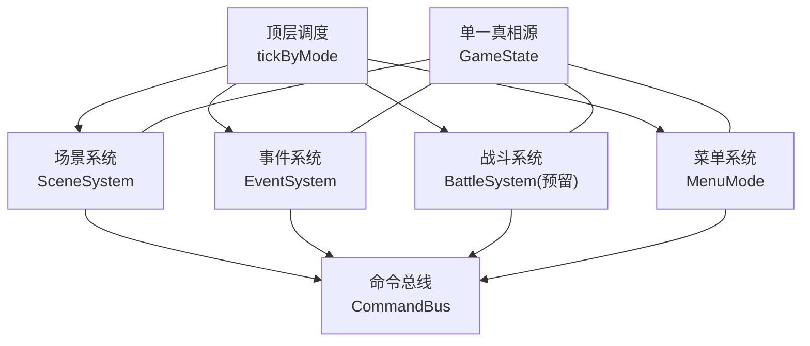
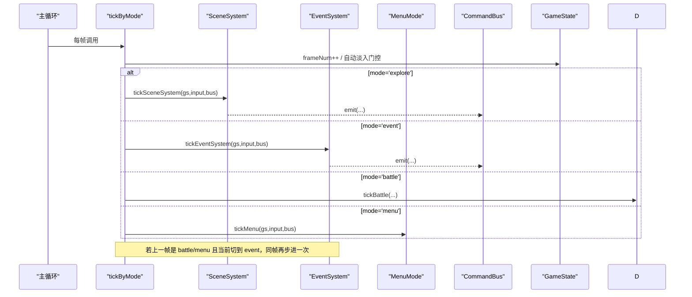
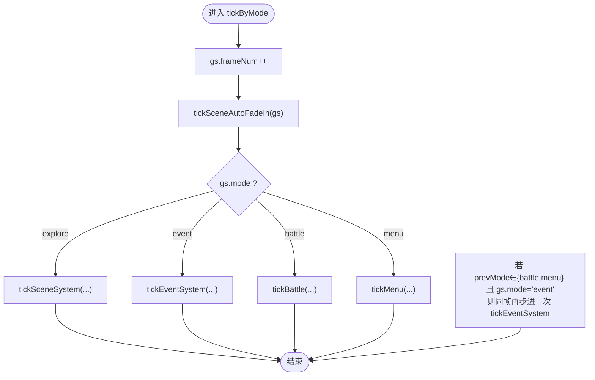
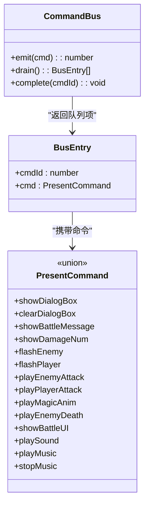
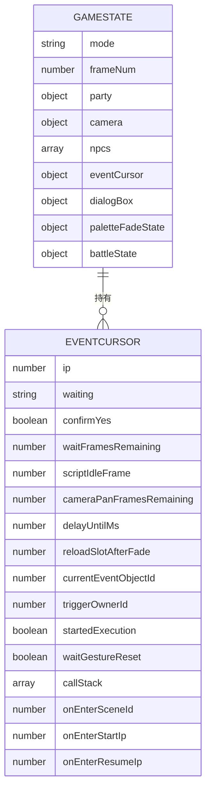
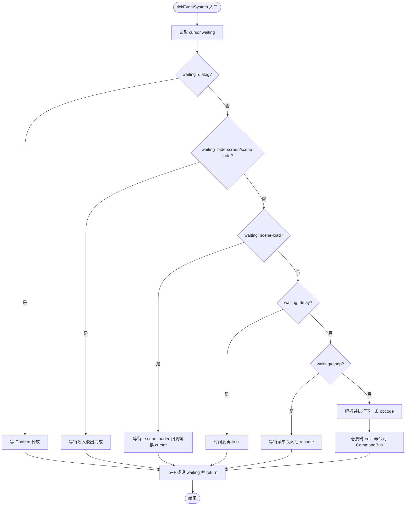
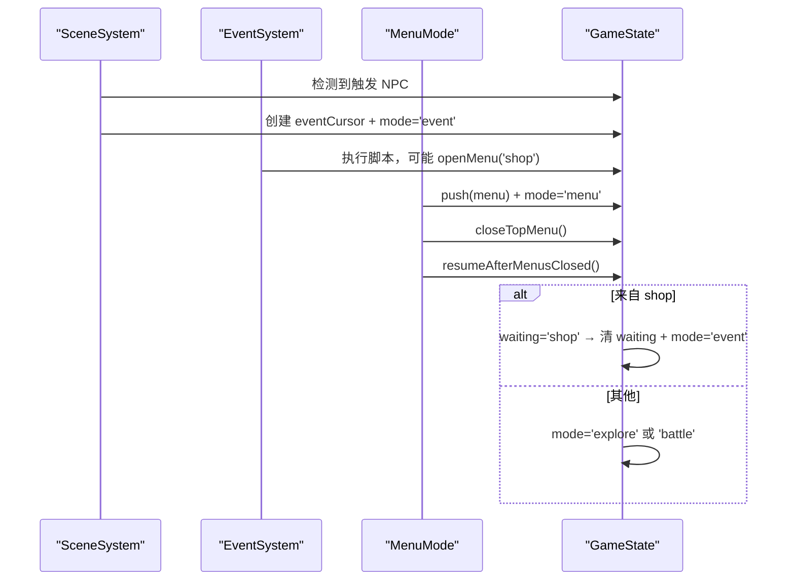
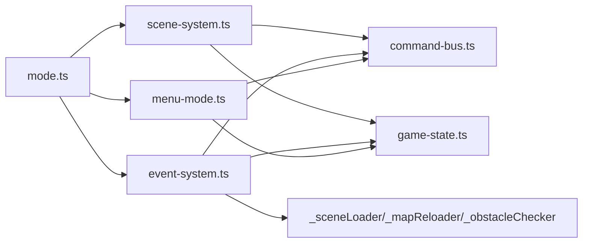

# 核心设计模式

<cite>
**本文引用的文件**   
- [mode.ts](file://packages/game/src/core/mode.ts)
- [command-bus.ts](file://packages/game/src/core/command-bus.ts)
- [game-state.ts](file://packages/game/src/core/game-state.ts)
- [event-system.ts](file://packages/game/src/core/event-system.ts)
- [scene-system.ts](file://packages/game/src/core/scene-system.ts)
- [menu-mode.ts](file://packages/game/src/core/menu/menu-mode.ts)
</cite>

## 目录
1. [引言](#引言)
2. [项目结构](#项目结构)
3. [核心组件](#核心组件)
4. [架构总览](#架构总览)
5. [详细组件分析](#详细组件分析)
6. [依赖关系分析](#依赖关系分析)
7. [性能考量](#性能考量)
8. [故障排查指南](#故障排查指南)
9. [结论](#结论)

## 引言
本文件聚焦 Type-Pal 第一阶段（浏览器端 TypeScript 重写）的核心设计模式，围绕以下四个关键模式展开：
- 状态机模式：用于游戏模式切换（探索/事件/战斗/菜单），由顶层 tickByMode 驱动。
- 命令总线模式：Core → Present 单向解耦通道，统一 emit/drain 语义。
- 单一真相源模式：GameState 作为全局唯一可序列化状态，贯穿所有子系统。
- 协程式步进器：EventSystem 在 event 模式下以“循环直到等待”的方式推进脚本，支持多种 waiting 状态与异步资源回调。

文档将解释每种模式的适用场景、实现方式与优势，并给出协作关系图与代码级示例路径，帮助读者理解如何通过这些模式构建高内聚、低耦合的架构。

## 项目结构
Type-Pal 采用分层组织：core 层包含模式与系统实现，present 层负责表现，shell 层负责启动与外设交互。本次文档聚焦 core 层的五个关键文件及其交互。

图表来源
- [mode.ts:15-88](file://packages/game/src/core/mode.ts#L15-L88)
- [scene-system.ts:575-584](file://packages/game/src/core/scene-system.ts#L575-L584)
- [event-system.ts:1-25](file://packages/game/src/core/event-system.ts#L1-L25)
- [menu-mode.ts:18-30](file://packages/game/src/core/menu/menu-mode.ts#L18-L30)
- [command-bus.ts:63-88](file://packages/game/src/core/command-bus.ts#L63-L88)
- [game-state.ts:655-700](file://packages/game/src/core/game-state.ts#L655-L700)

章节来源
- [mode.ts:15-88](file://packages/game/src/core/mode.ts#L15-L88)
- [scene-system.ts:575-584](file://packages/game/src/core/scene-system.ts#L575-L584)
- [event-system.ts:1-25](file://packages/game/src/core/event-system.ts#L1-L25)
- [menu-mode.ts:18-30](file://packages/game/src/core/menu/menu-mode.ts#L18-L30)
- [command-bus.ts:63-88](file://packages/game/src/core/command-bus.ts#L63-L88)
- [game-state.ts:655-700](file://packages/game/src/core/game-state.ts#L655-L700)

## 核心组件
- 顶层模式机（状态机）：根据 gs.mode 分发到对应 tick 函数；处理 auto fade-in、autoScript 运行门控、以及 battle/menu→event 的同帧续跑修复。
- 命令总线：emit/drain/complete 接口，Core 侧 emit，Present 侧 drain，为未来异步回执留口。
- 单一真相源 GameState：集中保存队伍、场景、事件游标、对话框、调色板、战斗上下文等全部可变状态，保证一致性与可序列化。
- 协程式步进器 EventSystem：loop-until-waitable，支持对话、淡入淡出、场景加载、延时、商店菜单等多种 waiting；通过注入点接入异步资源与外部能力。
- 场景系统 SceneSystem：探索模式输入处理、碰撞/触发、自动脚本与追逐计时器、菜单入口。
- 菜单系统 MenuMode：基于栈的模态菜单，关闭后按上下文恢复 explore/battle/event。

章节来源
- [mode.ts:15-88](file://packages/game/src/core/mode.ts#L15-L88)
- [command-bus.ts:63-88](file://packages/game/src/core/command-bus.ts#L63-L88)
- [game-state.ts:655-700](file://packages/game/src/core/game-state.ts#L655-L700)
- [event-system.ts:1-25](file://packages/game/src/core/event-system.ts#L1-L25)
- [scene-system.ts:575-584](file://packages/game/src/core/scene-system.ts#L575-L584)
- [menu-mode.ts:18-30](file://packages/game/src/core/menu/menu-mode.ts#L18-L30)

## 架构总览
下图展示四种模式如何协同工作：状态机驱动主循环，事件系统作为协程步进器，命令总线解耦 Core 与 Present，GameState 提供单一真相源。

图表来源
- [mode.ts:15-88](file://packages/game/src/core/mode.ts#L15-L88)
- [scene-system.ts:575-584](file://packages/game/src/core/scene-system.ts#L575-L584)
- [event-system.ts:1-25](file://packages/game/src/core/event-system.ts#L1-L25)
- [menu-mode.ts:18-30](file://packages/game/src/core/menu/menu-mode.ts#L18-L30)
- [command-bus.ts:63-88](file://packages/game/src/core/command-bus.ts#L63-L88)
- [game-state.ts:655-700](file://packages/game/src/core/game-state.ts#L655-L700)

## 详细组件分析

### 状态机模式：顶层模式切换（探索/事件/战斗/菜单）
- 适用场景
  - 需要清晰区分不同玩法阶段（探索移动、剧情演出、回合战斗、模态菜单）。
  - 各阶段有独立的输入处理、逻辑步进和渲染约束。
- 实现要点
  - tickByMode 依据 gs.mode 分发到对应 tick 函数。
  - 统一推进 frameNum，并在 explore 前执行自动淡入检查。
  - 对 autoScript 的运行设置白名单（frame-wait/scene-fade/camera-pan 等），避免在阻塞期间冻结 NPC。
  - 针对 battle/menu→event 的边界情况，同帧立即再步进一次，消除空窗露帧。
- 优势
  - 职责清晰、扩展方便（新增模式只需增加 case 分支）。
  - 与 GameState 的 mode 字段强绑定，便于存档与调试。

图表来源
- [mode.ts:15-88](file://packages/game/src/core/mode.ts#L15-L88)

章节来源
- [mode.ts:15-88](file://packages/game/src/core/mode.ts#L15-L88)

### 命令总线模式：Core → Present 解耦通信
- 适用场景
  - 逻辑层（Core）与表现层（Present）之间需要稳定、有序的命令流。
  - 需要批处理与未来异步回执能力（如转场、视频播放）。
- 实现要点
  - CommandBus 提供 emit(cmd): number、drain(): BusEntry[]、complete(cmdId): void。
  - Core 在 tick 内 emit，Present 在帧末 drain 消费；complete 为 M3+ 异步完成预留。
  - PresentCommand 联合类型覆盖对话、战斗 UI、音效/音乐等意图。
- 优势
  - 单向数据流，避免双向耦合。
  - 顺序确定、易于回放与测试。
  - 可扩展至异步生命周期管理。

图表来源
- [command-bus.ts:63-88](file://packages/game/src/core/command-bus.ts#L63-L88)
- [command-bus.ts:9-57](file://packages/game/src/core/command-bus.ts#L9-L57)

章节来源
- [command-bus.ts:63-88](file://packages/game/src/core/command-bus.ts#L63-L88)
- [command-bus.ts:9-57](file://packages/game/src/core/command-bus.ts#L9-L57)

### 单一真相源模式：GameState 设计原则
- 适用场景
  - 多子系统共享大量运行时状态，需保证一致性、可序列化与可回溯。
- 实现要点
  - GameState 集中存放队伍、相机、NPC、事件游标、对话框、调色板、战斗上下文等。
  - 明确标注持久化与瞬态字段，支持 JSON 序列化与读档还原。
  - 通过子结构（如 PlayerRolesRuntime、rgPoisonStatus、rgEquipmentEffect）降低耦合面。
- 优势
  - 任意时刻可快照/回滚，利于调试与回放。
  - 跨模块访问同一份数据，避免多源不一致。
  - 为存档系统提供稳定契约。

图表来源
- [game-state.ts:655-700](file://packages/game/src/core/game-state.ts#L655-L700)
- [game-state.ts:226-343](file://packages/game/src/core/game-state.ts#L226-L343)

章节来源
- [game-state.ts:655-700](file://packages/game/src/core/game-state.ts#L655-L700)
- [game-state.ts:226-343](file://packages/game/src/core/game-state.ts#L226-L343)

### 协程式步进器：EventSystem 的事件执行模型
- 适用场景
  - 剧情脚本、条件跳转、延时、淡入淡出、场景切换、商店菜单等复杂时序控制。
- 实现要点
  - loop-until-waitable：单 tick 内连跑非阻塞指令，遇到等待或结束才返回。
  - waiting 枚举涵盖 dialog/frame-wait/fade-screen/scene-load/delay/shop/palette-fade/scene-fade/rng-play/show-fbp/scroll-fbp/ending-anim/wait-key/quit/confirm/camera-pan。
  - 通过注入点（setSceneLoader/setMapReloader/setObstacleChecker/setFetchPalette 等）对接异步资源与外部能力。
  - 与 mode.ts 配合：特定 waiting 允许 autoScript 继续运行，保持 NPC 动画与追逐计时器不冻。
- 优势
  - 将同步脚本转换为可暂停/恢复的协程，简化复杂时序。
  - 与 GameState 的 eventCursor 紧密协作，状态即程序计数器。
  - 通过 waiting 机制天然支持 UI 阻塞与异步资源加载。

图表来源
- [event-system.ts:1-25](file://packages/game/src/core/event-system.ts#L1-L25)
- [event-system.ts:1594-1623](file://packages/game/src/core/event-system.ts#L1594-L1623)
- [event-system.ts:645-671](file://packages/game/src/core/event-system.ts#L645-L671)
- [event-system.ts:685-704](file://packages/game/src/core/event-system.ts#L685-L704)

章节来源
- [event-system.ts:1-25](file://packages/game/src/core/event-system.ts#L1-L25)
- [event-system.ts:1594-1623](file://packages/game/src/core/event-system.ts#L1594-L1623)
- [event-system.ts:645-671](file://packages/game/src/core/event-system.ts#L645-L671)
- [event-system.ts:685-704](file://packages/game/src/core/event-system.ts#L685-L704)

### 场景系统与菜单系统的协作
- 场景系统（探索模式）
  - 处理方向键移动、菱形碰撞、NPC 阻挡、自动触发区检测、Confirm 搜索、菜单入口。
  - 与 EventSystem 协作：触发 NPC 时创建 eventCursor 并切换到 event 模式。
- 菜单系统（模态菜单）
  - 使用 menuStack 显式化 SDL 的 C 调用栈；栈空时按上下文恢复到 explore/battle/event。
  - 与 EventSystem 协作：商店菜单打开时设置 waiting='shop'，关闭后恢复 event 继续脚本。

图表来源
- [scene-system.ts:302-339](file://packages/game/src/core/scene-system.ts#L302-L339)
- [menu-mode.ts:18-30](file://packages/game/src/core/menu/menu-mode.ts#L18-L30)
- [menu-mode.ts:40-51](file://packages/game/src/core/menu/menu-mode.ts#L40-L51)
- [event-system.ts:1594-1623](file://packages/game/src/core/event-system.ts#L1594-L1623)

章节来源
- [scene-system.ts:302-339](file://packages/game/src/core/scene-system.ts#L302-L339)
- [menu-mode.ts:18-30](file://packages/game/src/core/menu/menu-mode.ts#L18-L30)
- [menu-mode.ts:40-51](file://packages/game/src/core/menu/menu-mode.ts#L40-L51)
- [event-system.ts:1594-1623](file://packages/game/src/core/event-system.ts#L1594-L1623)

## 依赖关系分析
- 耦合与内聚
  - mode.ts 仅依赖各子系统 tick 函数与 GameState，职责单一。
  - event-system.ts 通过注入点（_sceneLoader/_mapReloader/_obstacleChecker 等）避免反向 import，降低环依赖风险。
  - command-bus.ts 被多个子系统消费，但只提供最小接口，保持低耦合。
- 外部依赖
  - present 层通过 drain 消费命令，audio/shell 通过 bus 接收音频意图。
  - scene-system.ts 依赖 tilemap 与 labelMap，由 bootstrap 注入。
- 潜在环依赖
  - event-system.ts 与 scene-system.ts 通过 setSceneContext 与注入点解耦，避免直接互相 import。

图表来源
- [mode.ts:15-88](file://packages/game/src/core/mode.ts#L15-L88)
- [scene-system.ts:575-584](file://packages/game/src/core/scene-system.ts#L575-L584)
- [event-system.ts:685-704](file://packages/game/src/core/event-system.ts#L685-L704)
- [menu-mode.ts:18-30](file://packages/game/src/core/menu/menu-mode.ts#L18-L30)
- [command-bus.ts:63-88](file://packages/game/src/core/command-bus.ts#L63-L88)
- [game-state.ts:655-700](file://packages/game/src/core/game-state.ts#L655-L700)

章节来源
- [mode.ts:15-88](file://packages/game/src/core/mode.ts#L15-L88)
- [scene-system.ts:575-584](file://packages/game/src/core/scene-system.ts#L575-L584)
- [event-system.ts:685-704](file://packages/game/src/core/event-system.ts#L685-L704)
- [menu-mode.ts:18-30](file://packages/game/src/core/menu/menu-mode.ts#L18-L30)
- [command-bus.ts:63-88](file://packages/game/src/core/command-bus.ts#L63-L88)
- [game-state.ts:655-700](file://packages/game/src/core/game-state.ts#L655-L700)

## 性能考量
- 单 tick 指令上限：EventSystem 内置 SINGLE_TICK_LIMIT 防止死循环。
- 自动脚本门控：仅在允许的 waiting 状态下运行 autoScript，避免不必要的计算。
- 批量命令：CommandBus 在帧末一次性 drain，减少频繁 UI 更新开销。
- 懒加载与缓存：场景资源按需加载，labelMap 与全局脚本数组复用，减少重复解析。

[本节为通用指导，无需具体文件分析]

## 故障排查指南
- 常见问题定位
  - 模式切换闪屏：检查 battle/menu→event 是否触发了同帧二次步进。
  - 脚本卡住：确认 waiting 是否正确设置与释放（dialog/fade/scene-load/delay/shop）。
  - 菜单无法关闭：核对 menuStack 是否为空及 resumeAfterMenusClosed 分支。
  - 资源未就绪：验证 _sceneLoader/_mapReloader 注入是否生效。
- 建议步骤
  - 打印 gs.mode、cursor.waiting、menuStack.length。
  - 在 CommandBus.drain 前后记录命令序列，确保 Present 消费顺序正确。
  - 使用 dev 面板 dump GameState，对比预期字段变化。

章节来源
- [mode.ts:81-88](file://packages/game/src/core/mode.ts#L81-L88)
- [event-system.ts:1594-1623](file://packages/game/src/core/event-system.ts#L1594-L1623)
- [menu-mode.ts:40-51](file://packages/game/src/core/menu/menu-mode.ts#L40-L51)
- [event-system.ts:685-704](file://packages/game/src/core/event-system.ts#L685-L704)

## 结论
通过状态机、命令总线、单一真相源与协程式步进器的组合，Type-Pal 实现了清晰的职责划分与松耦合的系统间通信：
- 状态机确保模式切换可控、可预测。
- 命令总线屏蔽 Core/Present 细节差异，便于扩展与测试。
- GameState 作为单一真相源保障一致性与可序列化。
- EventSystem 将复杂时序抽象为可暂停/恢复的协程，提升可维护性。

这些模式共同支撑起高内聚、低耦合的架构，为后续战斗系统完善与第二阶段重制打下坚实基础。