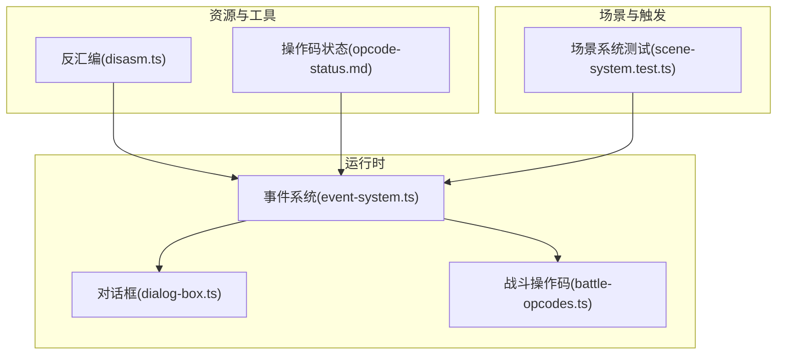
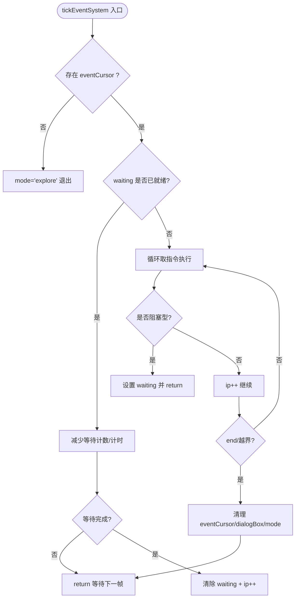
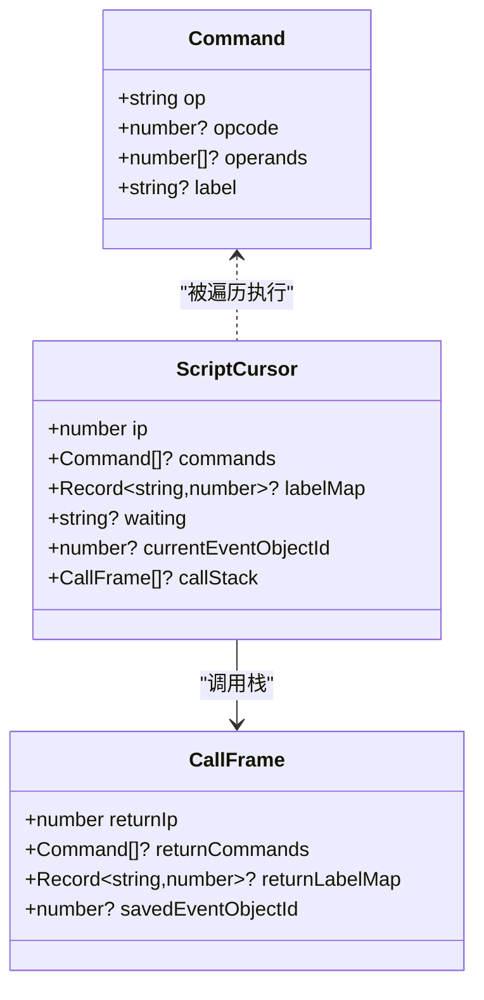
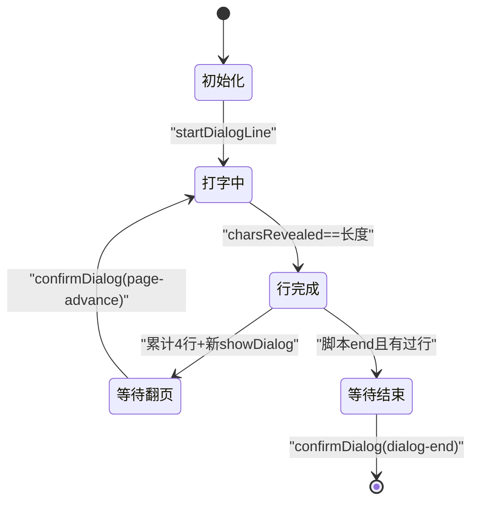
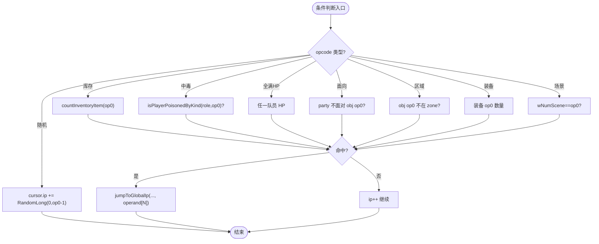
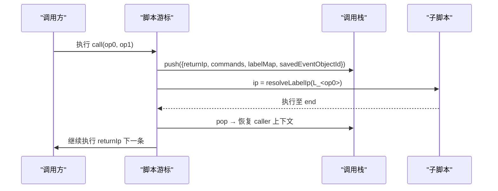
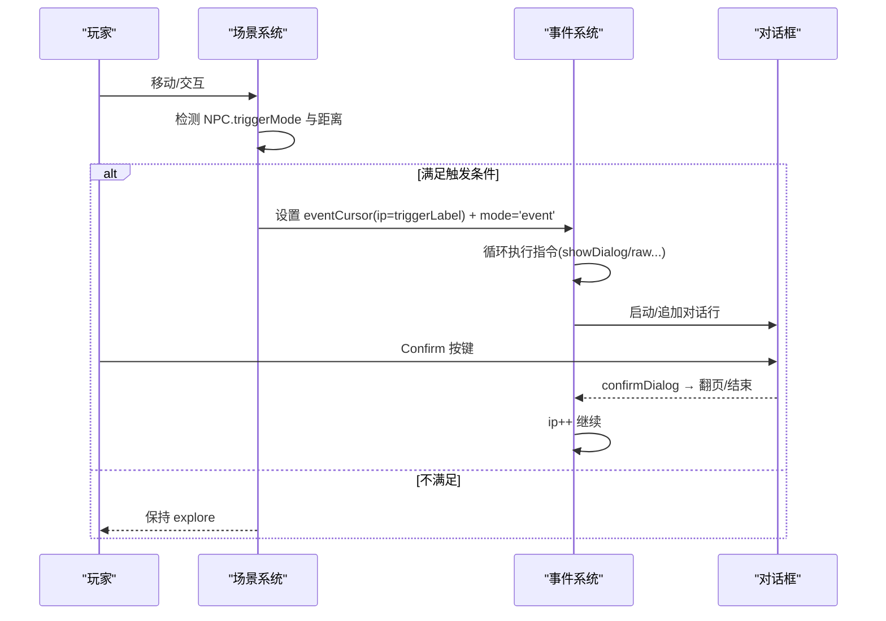
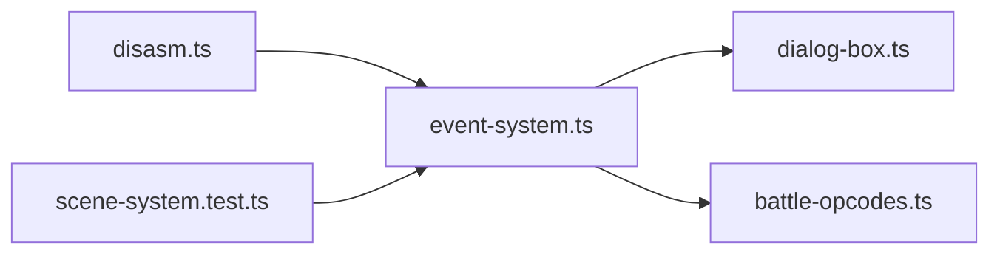

# 事件系统

<cite>
**本文引用的文件**   
- [event-system.ts](file://packages/game/src/core/event-system.ts)
- [dialog-box.ts](file://packages/game/src/present/dialog-box.ts)
- [opcode-status.md](file://docs/phase1/status/opcode-status.md)
- [disasm.ts](file://packages/pal-extract/src/events/disasm.ts)
- [battle-opcodes.ts](file://packages/game/src/core/battle/battle-opcodes.ts)
- [scene-system.test.ts](file://packages/game/src/core/scene-system.test.ts)
</cite>

## 目录
1. [简介](#简介)
2. [项目结构](#项目结构)
3. [核心组件](#核心组件)
4. [架构总览](#架构总览)
5. [详细组件分析](#详细组件分析)
6. [依赖关系分析](#依赖关系分析)
7. [性能考量](#性能考量)
8. [故障排查指南](#故障排查指南)
9. [结论](#结论)
10. [附录](#附录)

## 简介
本文件为 Type-Pal 事件系统的综合技术文档，聚焦以下方面：
- 事件脚本执行器：指令解析、操作码处理与协程式步进器实现
- 对话管理系统：对话框状态机、文本渲染与打字效果
- 条件判断逻辑：变量检查、标志位测试与表达式求值
- 脚本调用栈管理：子脚本调用、参数传递与返回值处理
- 事件触发机制：NPC 接触、物品使用与场景进入等触发条件
- 实战示例：如何编写新事件脚本、自定义操作码与复杂剧情逻辑
- 调试工具与性能分析方法

## 项目结构
事件系统位于游戏运行时包中，核心由“事件解释器 + 对话渲染 + 战斗扩展”三部分构成；资源侧通过提取器的反汇编与切片工具生成可执行的命令序列。



图表来源
- [event-system.ts:1-120](file://packages/game/src/core/event-system.ts#L1-L120)
- [dialog-box.ts:1-60](file://packages/game/src/present/dialog-box.ts#L1-L60)
- [battle-opcodes.ts:1366-1386](file://packages/game/src/core/battle/battle-opcodes.ts#L1366-L1386)
- [disasm.ts:58-98](file://packages/pal-extract/src/events/disasm.ts#L58-L98)
- [opcode-status.md:1-30](file://docs/phase1/status/opcode-status.md#L1-L30)

章节来源
- [event-system.ts:1-120](file://packages/game/src/core/event-system.ts#L1-L120)
- [opcode-status.md:1-30](file://docs/phase1/status/opcode-status.md#L1-L30)

## 核心组件
- 事件脚本执行器
  - 协程式步进器：单 tick 内循环执行非阻塞指令，遇等待（对话、淡入淡出、帧等待、场景加载）挂起，下一 tick 恢复
  - 统一 raw 操作码分发：未具名化 opcode 走 applyRawOpcode 路径，保证可扩展性
  - 全局脚本数组与 label 解析：P2#5 后塌缩为单一全局数组，goto/call 均基于 L_<n> 标签解析
- 对话管理系统
  - 状态机：typing / line-done / waiting-page-key / waiting-end-key
  - 时间驱动打字：按墙钟推进 revealAt，支持 $NN 变速与 ~NN 尾停顿
  - 样式切换与保留：setDialogStyleX 在翻页时保持立绘布局与字体色态
- 条件判断与跳转
  - A2 类条件跳转：库存不足、中毒状态、队伍 HP、面向关系、对象区域、装备数量、场景号等
  - 概率跳转与随机跳转：0x06 与 0xA2 的语义差异（autoScript 与 trigger 分支不同）
- 脚本调用栈
  - call 压栈：保存返回 ip、commands、labelMap、当前事件对象 id
  - end 弹栈：自动回到 caller 下一条继续执行
- 事件触发机制
  - NPC 接触：triggerMode >= 4 时按曼哈顿距离阈值自动触发
  - 场景进入：onEnterLabel 在 bootstrap 阶段装配并立即运行
  - 物品使用：item.scriptOnUse 通过 runScript 同步执行

章节来源
- [event-system.ts:1496-1599](file://packages/game/src/core/event-system.ts#L1496-L1599)
- [event-system.ts:4738-4764](file://packages/game/src/core/event-system.ts#L4738-L4764)
- [event-system.ts:4622-4654](file://packages/game/src/core/event-system.ts#L4622-L4654)
- [dialog-box.ts:263-319](file://packages/game/src/present/dialog-box.ts#L263-L319)
- [dialog-box.ts:466-497](file://packages/game/src/present/dialog-box.ts#L466-L497)
- [scene-system.test.ts:450-578](file://packages/game/src/core/scene-system.test.ts#L450-L578)

## 架构总览
事件系统作为“主循环中的 event 模式”控制器，负责：
- 从 GameState.eventCursor 读取当前脚本游标
- 循环取指令并执行，遇到等待则设置 cursor.waiting 并在下一 tick 恢复
- 与对话框、调色板淡入淡出、场景加载、战斗系统等子系统协作

```mermaid
sequenceDiagram
participant Main as "主循环"
participant Scene as "场景系统"
participant Event as "事件系统(tickEventSystem)"
participant Dialog as "对话框(tickDialog)"
participant Present as "表现层"
Main->>Scene : tick(snapshot, gs)
Scene-->>Main : 可能设置 mode='event' + eventCursor
Main->>Event : tickEventSystem(gs, input, bus)
loop 直到 waitable/end/越界
Event->>Event : 取 cmd = commands[ip]
alt showDialog
Event->>Dialog : startDialogLine/appendDialogLine
Event->>Event : waiting='dialog' + emit
break
else setDialogStyle*
Event->>Event : 累积到 currentDialogStyle
Event->>Event : ip++
else raw(非阻塞)
Event->>Event : applyRawOpcode(...)
Event->>Event : ip++
else raw(waitable)
Event->>Event : 设 waiting=... (frame-wait/fade/scene-load)
break
end
end
Main->>Present : drain() 绘制 tilemap/sprites/dialog
Note over Event,Dialog : Confirm 按键 → confirmDialog → 清 dialogBox/ip++ 继续
```

图表来源
- [event-system.ts:1496-1599](file://packages/game/src/core/event-system.ts#L1496-L1599)
- [dialog-box.ts:263-319](file://packages/game/src/present/dialog-box.ts#L263-L319)
- [dialog-box.ts:466-497](file://packages/game/src/present/dialog-box.ts#L466-L497)

## 详细组件分析

### 事件脚本执行器（协程式步进器）
- 单 tick 连跑：loop-until-waitable，避免卡顿
- 等待类型：
  - frame-wait：按帧计数推进
  - fade-screen / palette-fade / scene-fade：按 wall-clock 计时
  - scene-load：异步回调替换 eventCursor
  - dialog：等待 Confirm 翻页或结束
- 安全保护：SINGLE_TICK_LIMIT 防死循环



图表来源
- [event-system.ts:1496-1599](file://packages/game/src/core/event-system.ts#L1496-L1599)
- [event-system.ts:1387-1420](file://packages/game/src/core/event-system.ts#L1387-L1420)

章节来源
- [event-system.ts:1496-1599](file://packages/game/src/core/event-system.ts#L1496-L1599)
- [event-system.ts:1387-1420](file://packages/game/src/core/event-system.ts#L1387-L1420)

### 指令解析与操作码处理
- 具名化 vs raw：
  - 反汇编阶段对带 label 的目标打 L_<n> 标签，供 goto/call 解析
  - 未具名化 opcode 以 {op:'raw', opcode, operands} 形式进入 applyRawOpcode
- 关键常量与分类：
  - 控制流：end/goto/call/wait/frame-wait 等
  - 数据/动作：属性修改、物品、金钱、状态、移动、特效
  - 战斗：伤害、毒、召唤、分裂、结果设定等
- 条件跳转（A2 类）：
  - 库存不足、中毒、HP 不满、面向关系、对象区域、装备数量、场景号、随机跳等



图表来源
- [event-system.ts:1087-1105](file://packages/game/src/core/event-system.ts#L1087-L1105)
- [event-system.ts:4738-4764](file://packages/game/src/core/event-system.ts#L4738-L4764)
- [disasm.ts:58-98](file://packages/pal-extract/src/events/disasm.ts#L58-L98)

章节来源
- [disasm.ts:58-98](file://packages/pal-extract/src/events/disasm.ts#L58-L98)
- [event-system.ts:4622-4654](file://packages/game/src/core/event-system.ts#L4622-L4654)
- [opcode-status.md:155-211](file://docs/phase1/status/opcode-status.md#L155-L211)

### 对话管理系统（状态机、渲染与打字）
- 状态机阶段：
  - typing：逐字显示，Confirm 可快进
  - line-done：行末自动推进（不等键），除非达到第 5 行
  - waiting-page-key：满页等 Confirm 翻页
  - waiting-end-key：整段结束等 Confirm 关闭
- 文本解析与控制符：
  - 颜色切换、速度控制 $NN、行尾暂停 ~NN、图标 ()、转义 \
- 位置与头像：
  - top/bottom/center/narration 四种样式，姓名标题独立渲染
  - 头像位置与缩进布局与 portraitIcon/portraitLayout 解耦



图表来源
- [dialog-box.ts:263-319](file://packages/game/src/present/dialog-box.ts#L263-L319)
- [dialog-box.ts:466-497](file://packages/game/src/present/dialog-box.ts#L466-L497)
- [dialog-box.ts:512-562](file://packages/game/src/present/dialog-box.ts#L512-L562)

章节来源
- [dialog-box.ts:263-319](file://packages/game/src/present/dialog-box.ts#L263-L319)
- [dialog-box.ts:466-497](file://packages/game/src/present/dialog-box.ts#L466-L497)
- [dialog-box.ts:512-562](file://packages/game/src/present/dialog-box.ts#L512-L562)

### 条件判断逻辑（变量检查、标志位测试、表达式求值）
- 库存检查：OP_JUMP_IF_ITEM_LESS
- 中毒状态：OP_JUMP_IF_NOT_POISON_KIND / OP_JUMP_IF_NOT_POISONED
- 队伍 HP：OP_JUMP_IF_NOT_ALL_FULL_HP
- 面向关系：OP_JUMP_IF_NOT_FACING
- 对象区域：OP_JUMP_IF_OBJ_NOT_IN_ZONE
- 装备数量：OP_JUMP_IF_NOT_EQUIPPED
- 场景号：OP_JUMP_IF_SCENE
- 随机跳转：OP_RANDOM_JUMP
- 概率跳转（autoScript 专用）：OP_JUMP_BY_RATE（每帧重掷语义）



图表来源
- [event-system.ts:4622-4654](file://packages/game/src/core/event-system.ts#L4622-L4654)
- [event-system.ts:1387-1420](file://packages/game/src/core/event-system.ts#L1387-L1420)

章节来源
- [event-system.ts:4622-4654](file://packages/game/src/core/event-system.ts#L4622-L4654)
- [event-system.ts:1387-1420](file://packages/game/src/core/event-system.ts#L1387-L1420)

### 脚本调用栈管理（子脚本调用、参数传递、返回值）
- call 子脚本：
  - 压栈：保存 returnIp、commands、labelMap、currentEventObjectId
  - 目标解析：优先 cursor.labelMap，否则全局 labelMap
  - 返回：子脚本 end 弹栈，恢复 caller 上下文并继续
- autoScript 中的 call：
  - 同帧消化短 callee，多帧 op 卡住时退化为逐帧推进



图表来源
- [event-system.ts:4738-4764](file://packages/game/src/core/event-system.ts#L4738-L4764)
- [event-system.ts:1287-1337](file://packages/game/src/core/event-system.ts#L1287-L1337)

章节来源
- [event-system.ts:4738-4764](file://packages/game/src/core/event-system.ts#L4738-L4764)
- [event-system.ts:1287-1337](file://packages/game/src/core/event-system.ts#L1287-L1337)

### 事件触发机制（NPC 接触、物品使用、场景进入）
- NPC 接触：
  - triggerMode >= 4：按 Manhattan 距离阈值自动触发
  - triggerMode 1-3：需 Confirm 或装饰像素，不自动触发
- 场景进入：
  - onEnterLabel 在 bootstrap 装配阶段即装入 eventCursor，第一 tick 开始运行
- 物品使用：
  - item.scriptOnUse 通过 runScript 同步执行，不改变 GameState.mode/scene/party



图表来源
- [scene-system.test.ts:450-578](file://packages/game/src/core/scene-system.test.ts#L450-L578)
- [event-system.ts:1496-1599](file://packages/game/src/core/event-system.ts#L1496-L1599)
- [dialog-box.ts:512-562](file://packages/game/src/present/dialog-box.ts#L512-L562)

章节来源
- [scene-system.test.ts:450-578](file://packages/game/src/core/scene-system.test.ts#L450-L578)
- [event-system.ts:1496-1599](file://packages/game/src/core/event-system.ts#L1496-L1599)

### 实战示例（如何编写新事件脚本、自定义操作码与复杂剧情）
- 编写新事件脚本
  - 在 events/all.json 中添加命令序列，使用 label 标记跳转目标
  - 使用 showDialog/setDialogStyleX 控制对话样式与头像
  - 使用 goto/call 组织复杂剧情分支
- 自定义操作码
  - 在 event-system.ts 中定义常量与 case 分支
  - 若为 raw 未具名化，确保 JUMP_TARGET_OPERAND 表包含其跳转目标索引，以便 disasm 打 label
- 复杂剧情逻辑
  - 组合条件跳转与 call 子脚本，形成模块化剧情
  - 使用 frame-wait/fade/scene-load 控制演出节奏

章节来源
- [disasm.ts:58-98](file://packages/pal-extract/src/events/disasm.ts#L58-L98)
- [opcode-status.md:155-211](file://docs/phase1/status/opcode-status.md#L155-L211)
- [event-system.ts:4738-4764](file://packages/game/src/core/event-system.ts#L4738-L4764)

## 依赖关系分析
- 模块耦合
  - event-system.ts 依赖 dialog-box.ts 进行对话渲染
  - battle-opcodes.ts 提供战斗相关 opcode 的具名化处理
  - disasm.ts 为事件脚本提供反汇编与 label 注入
- 外部集成点
  - 场景系统通过 tickSceneSystem 检测触发条件并装配 eventCursor
  - 表现层通过 present 消费对话框与淡入淡出状态



图表来源
- [disasm.ts:58-98](file://packages/pal-extract/src/events/disasm.ts#L58-L98)
- [event-system.ts:1496-1599](file://packages/game/src/core/event-system.ts#L1496-L1599)
- [dialog-box.ts:263-319](file://packages/game/src/present/dialog-box.ts#L263-L319)
- [battle-opcodes.ts:1366-1386](file://packages/game/src/core/battle/battle-opcodes.ts#L1366-L1386)
- [scene-system.test.ts:450-578](file://packages/game/src/core/scene-system.test.ts#L450-L578)

章节来源
- [disasm.ts:58-98](file://packages/pal-extract/src/events/disasm.ts#L58-L98)
- [event-system.ts:1496-1599](file://packages/game/src/core/event-system.ts#L1496-L1599)
- [dialog-box.ts:263-319](file://packages/game/src/present/dialog-box.ts#L263-L319)
- [battle-opcodes.ts:1366-1386](file://packages/game/src/core/battle/battle-opcodes.ts#L1366-L1386)
- [scene-system.test.ts:450-578](file://packages/game/src/core/scene-system.test.ts#L450-L578)

## 性能考量
- 单 tick 限制：SINGLE_TICK_LIMIT 防止 goto 自环或 raw 链导致无限循环
- 等待类型优化：
  - frame-wait 使用整数计数，避免浮点误差
  - fade/screen-fade 使用 wall-clock 计时，不受 rAF 频率影响
- 自动脚本节流：
  - owner 对象在特定等待态跳过 autoScript，避免覆盖玩家朝向
  - goto 递归深度限制，防止同帧无限跳转

章节来源
- [event-system.ts:1242-1285](file://packages/game/src/core/event-system.ts#L1242-L1285)
- [event-system.ts:1387-1420](file://packages/game/src/core/event-system.ts#L1387-L1420)

## 故障排查指南
- 常见问题
  - 对话不翻页：检查 shouldWaitPageKey 与 confirmDialog 返回值
  - 跳转无效：确认 labelMap 是否包含目标，必要时 fallback 到全局 ip
  - 自动脚本冻结：检查 goto frameDelay 计数与 autoScript 的 owner 跳过逻辑
- 调试建议
  - 使用 console.debug 输出 opcode 号与 operands
  - 利用单元测试验证条件跳转与 call 行为

章节来源
- [dialog-box.ts:512-562](file://packages/game/src/present/dialog-box.ts#L512-L562)
- [event-system.ts:1387-1420](file://packages/game/src/core/event-system.ts#L1387-L1420)

## 结论
Type-Pal 事件系统以协程式步进器为核心，结合统一的 raw 操作码分发与强大的对话状态机，实现了高保真、可扩展的剧情与演出能力。通过严格的条件判断、调用栈管理与触发机制，系统在忠实还原原版行为的同时，提供了良好的开发与调试体验。

## 附录
- 操作码全集与状态：详见 opcode-status.md
- 反汇编与标签注入：详见 disasm.ts
- 战斗扩展：详见 battle-opcodes.ts