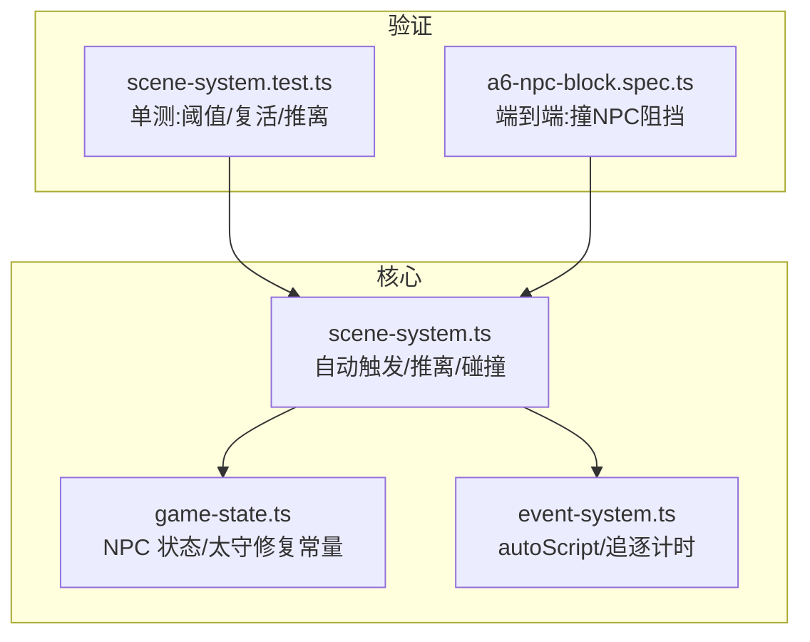
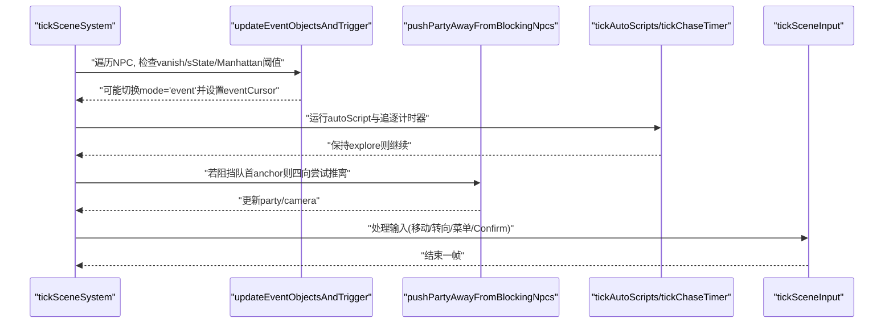
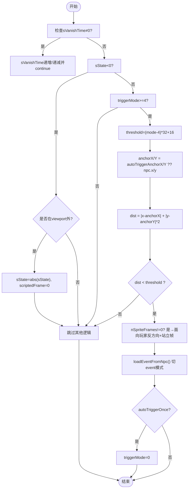
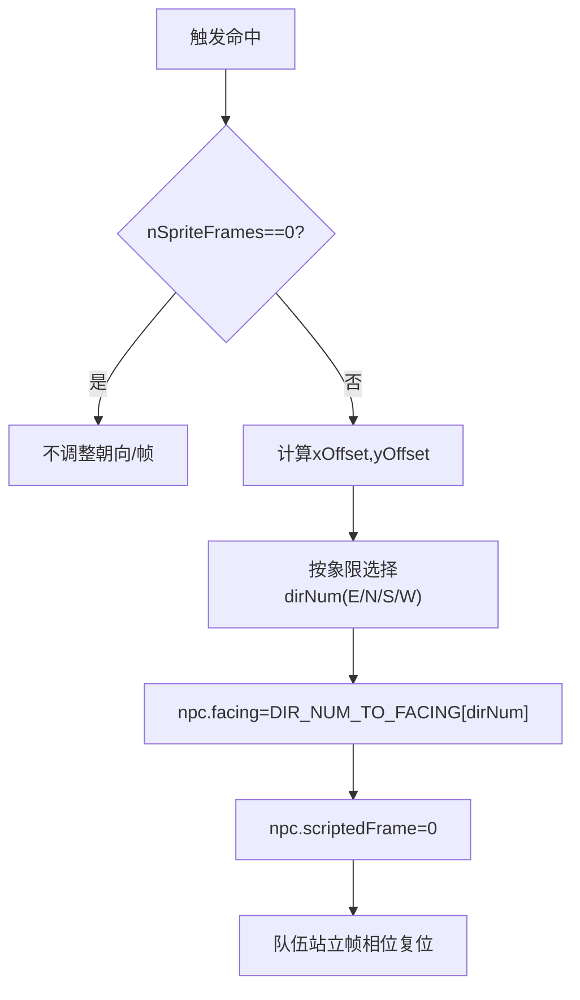
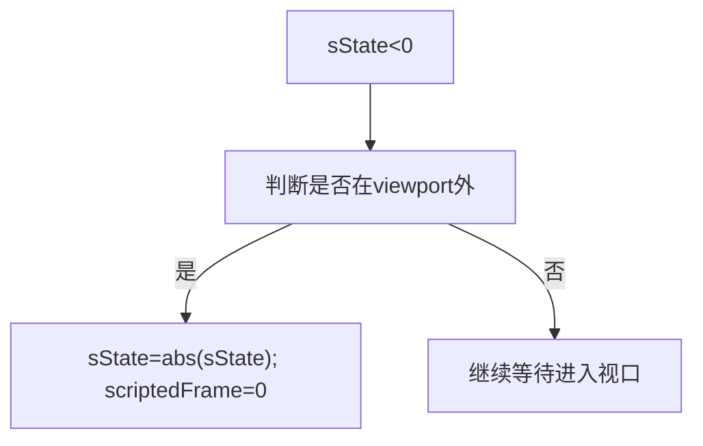
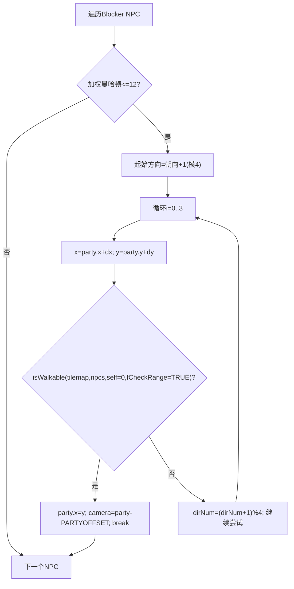
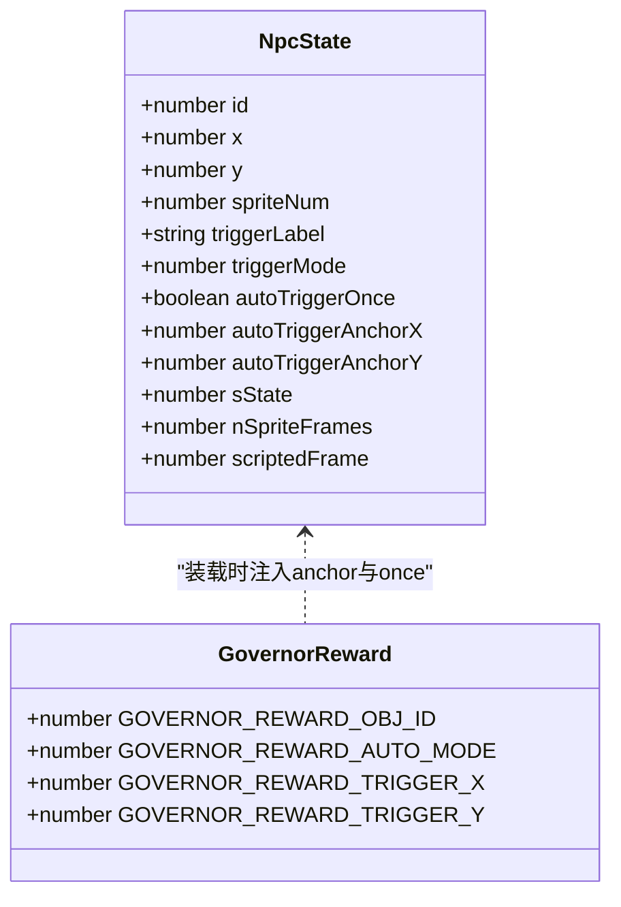
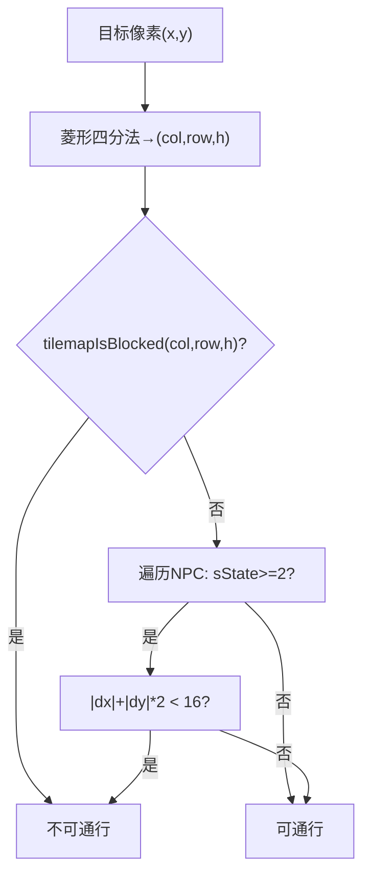
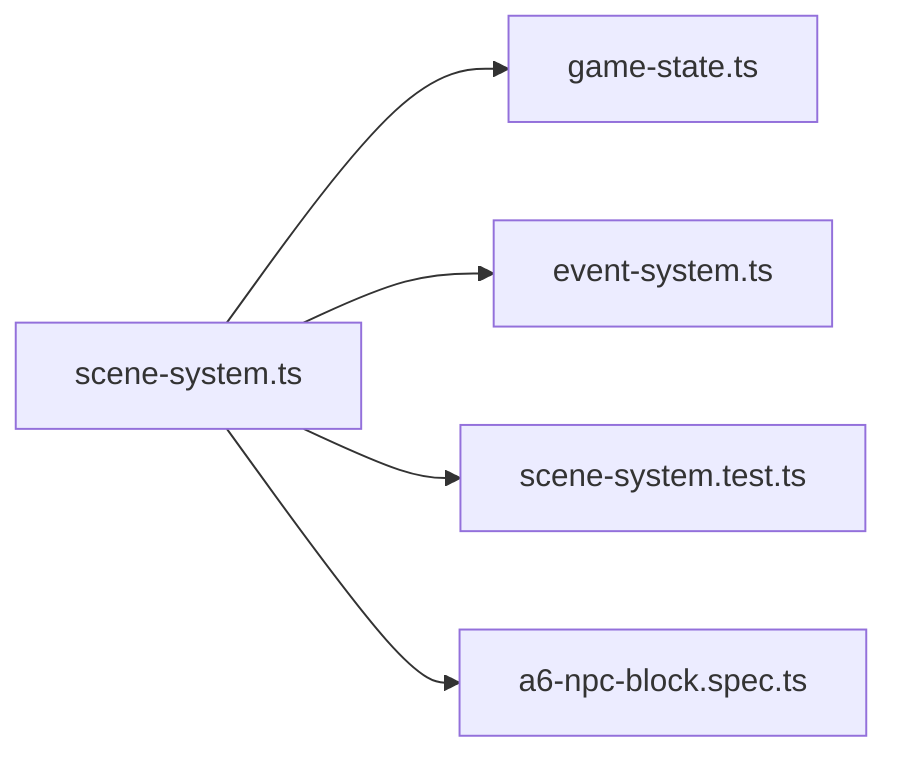

# NPC 行为系统

<cite>
**本文引用的文件**   
- [scene-system.ts](file://packages/game/src/core/scene-system.ts)
- [game-state.ts](file://packages/game/src/core/game-state.ts)
- [event-system.ts](file://packages/game/src/core/event-system.ts)
- [scene-system.test.ts](file://packages/game/src/core/scene-system.test.ts)
- [a6-npc-block.spec.ts](file://packages/game/e2e/scene/a6-npc-block.spec.ts)
</cite>

## 目录
1. [简介](#简介)
2. [项目结构](#项目结构)
3. [核心组件](#核心组件)
4. [架构总览](#架构总览)
5. [详细组件分析](#详细组件分析)
6. [依赖关系分析](#依赖关系分析)
7. [性能考量](#性能考量)
8. [故障排查指南](#故障排查指南)
9. [结论](#结论)
10. [附录：配置与示例](#附录配置与示例)

## 简介
本文件面向 Type-Pal 的 NPC 行为系统，聚焦以下关键机制：
- 自动触发区域检测（triggerMode 4-8）与 Manhattan 距离公式应用
- NPC 转向逻辑（面向玩家的反方向计算、站立帧重置）
- NPC 复活机制（sState < 0 的状态处理与 viewport 外检测）
- pushPartyAwayFromBlockingNpcs 推离算法与四向尝试
- autoTriggerAnchorX/Y 的作用与扬州太守领赏场景
- 调试工具与性能监控方法
- 如何配置 NPC 行为、设置触发条件与自定义交互逻辑

## 项目结构
NPC 行为系统位于游戏核心模块中，主要涉及：
- 场景系统：负责探索模式每 tick 的自动触发、阻挡推离、输入驱动移动等
- 游戏状态：定义 NPC 运行时字段、扬州太守领赏修复常量与转换逻辑
- 事件系统：提供自动脚本推进、追逐计时器等辅助能力
- 测试与端到端用例：覆盖触发阈值、复活、推离、碰撞等关键路径

图表来源
- [scene-system.ts:180-379](file://packages/game/src/core/scene-system.ts#L180-L379)
- [game-state.ts:1900-2070](file://packages/game/src/core/game-state.ts#L1900-L2070)
- [scene-system.test.ts:605-632](file://packages/game/src/core/scene-system.test.ts#L605-L632)
- [a6-npc-block.spec.ts:13-48](file://packages/game/e2e/scene/a6-npc-block.spec.ts#L13-L48)

章节来源
- [scene-system.ts:180-379](file://packages/game/src/core/scene-system.ts#L180-L379)
- [game-state.ts:1900-2070](file://packages/game/src/core/game-state.ts#L1900-L2070)

## 核心组件
- 自动触发区检测：在 explore 模式每 tick 前扫描所有 NPC，按 triggerMode 4-8 使用加权 Manhattan 距离判定是否进入触发范围。
- NPC 转向与站立帧：触发时根据玩家相对位置计算 NPC 朝向，并复位为站立帧；非方向性精灵不改变帧。
- 复活机制：当 NPC sState < 0 且离开屏幕视口时，将其恢复为正态并复位站立帧。
- 阻挡推离：若自动触发或自动脚本后 NPC 阻挡了队伍锚点，沿 NPC 朝向的下一方向起试 4 个方向，将队伍与相机推离一格。
- 扬州太守领赏：通过 autoTriggerAnchorX/Y 将触发中心偏移至书案前站立点，避免出场即触发，实现“走近才触发”。

章节来源
- [scene-system.ts:180-379](file://packages/game/src/core/scene-system.ts#L180-L379)
- [game-state.ts:1900-2070](file://packages/game/src/core/game-state.ts#L1900-L2070)

## 架构总览
下图展示探索模式下 NPC 行为的关键流程：自动触发区检测 → 转向与站立帧 → 事件加载 → 阻挡推离 → 自动脚本与追逐计时器更新。

图表来源
- [scene-system.ts:443-584](file://packages/game/src/core/scene-system.ts#L443-L584)
- [scene-system.ts:180-379](file://packages/game/src/core/scene-system.ts#L180-L379)

## 详细组件分析

### 自动触发区域检测（triggerMode 4-8）
- 触发条件：
  - NPC sState > 0 且 triggerMode >= 4
  - 使用加权 Manhattan 距离：|dx| + |dy| * 2 < threshold
  - threshold = (triggerMode - 4) * 32 + 16
- 各 mode 阈值：
  - mode=4: 16
  - mode=5: 48
  - mode=6: 80
  - mode=7: 112
  - mode=8: 144
- 触发中心偏移：
  - 若 NPC 设置了 autoTriggerAnchorX/Y，则以该坐标作为距离计算中心，否则用 npc.x/y
- 触发后效果：
  - 仅当 nSpriteFrames != 0 时，NPC 朝向玩家反方向并复位 scriptedFrame 为 0
  - 加载事件并切到 event 模式；若标记 autoTriggerOnce，则消费一次后将 triggerMode 置 0

图表来源
- [scene-system.ts:180-379](file://packages/game/src/core/scene-system.ts#L180-L379)
- [scene-system.ts:125-140](file://packages/game/src/core/scene-system.ts#L125-L140)

章节来源
- [scene-system.ts:180-379](file://packages/game/src/core/scene-system.ts#L180-L379)
- [scene-system.ts:125-140](file://packages/game/src/core/scene-system.ts#L125-L140)
- [scene-system.test.ts:813-844](file://packages/game/src/core/scene-system.test.ts#L813-L844)

### NPC 转向逻辑与站立帧重置
- 转向规则：
  - 基于玩家世界坐标与 NPC 坐标差值，确定 NPC 应面向的方向（玩家所在象限决定 East/North/South/West）
  - 仅当 nSpriteFrames != 0 时才调整朝向与帧
- 站立帧重置：
  - 触发时将 scriptedFrame 置 0，确保以站立帧开始演出
  - 同时队伍全员也切换到面向 NPC 的站立帧相位

图表来源
- [scene-system.ts:232-246](file://packages/game/src/core/scene-system.ts#L232-L246)

章节来源
- [scene-system.ts:232-246](file://packages/game/src/core/scene-system.ts#L232-L246)

### NPC 复活机制（sState < 0 与 viewport 外检测）
- 当 NPC sState < 0 时，视为临时隐藏；若其坐标完全在屏幕视口外，则将其恢复为正态（sState = abs(sState)），并复位 scriptedFrame 为 0
- 视口边界比较采用 SCREEN_W（320）用于 x 和 y 两侧（忠实复刻 sdlpal 真值）

图表来源
- [scene-system.ts:207-216](file://packages/game/src/core/scene-system.ts#L207-L216)

章节来源
- [scene-system.ts:207-216](file://packages/game/src/core/scene-system.ts#L207-L216)
- [scene-system.test.ts:605-632](file://packages/game/src/core/scene-system.test.ts#L605-L632)

### pushPartyAwayFromBlockingNpcs 推离算法与四向尝试
- 触发条件：
  - NPC sState >= 2（Blocker）且有 spriteNum
  - 与队伍 anchor 的加权 Manhattan 距离 <= 12
- 推离策略：
  - 从 NPC 朝向的下一方向开始，依次尝试 4 个方向
  - 对每个候选落点调用 isWalkable（含 tilemap 障碍与 blockX/blockY 下边界检查）
  - 找到可走点后，同步更新 gs.party 与 gs.camera，保持 camera = party - PARTYOFFSET

图表来源
- [scene-system.ts:269-296](file://packages/game/src/core/scene-system.ts#L269-L296)
- [scene-system.ts:371-425](file://packages/game/src/core/scene-system.ts#L371-L425)

章节来源
- [scene-system.ts:269-296](file://packages/game/src/core/scene-system.ts#L269-L296)
- [scene-system.ts:371-425](file://packages/game/src/core/scene-system.ts#L371-L425)
- [scene-system.test.ts:722-745](file://packages/game/src/core/scene-system.test.ts#L722-L745)

### autoTriggerAnchorX/Y 的作用与扬州太守领赏
- 作用：
  - 将自动触发的判定中心从 NPC sprite 位置偏移至指定世界坐标（如书案前站立点）
  - 不影响 NPC 渲染位置与朝向计算，仅影响距离判定
- 扬州太守领赏场景：
  - 原版 Confirm-search 因地图布局导致无法接近，tp 层将其改为走近自动触发（mode=6），并设置 autoTriggerOnce 与 anchor 坐标
  - 阈值与 anchor 经实测调优，保证“走到书案前才触发”，避免出场即触发

图表来源
- [game-state.ts:1909-1992](file://packages/game/src/core/game-state.ts#L1909-L1992)
- [scene-system.ts:222-230](file://packages/game/src/core/scene-system.ts#L222-L230)

章节来源
- [game-state.ts:1909-1992](file://packages/game/src/core/game-state.ts#L1909-L1992)
- [scene-system.ts:222-230](file://packages/game/src/core/scene-system.ts#L222-L230)

### 碰撞与阻挡（菱形曼哈顿距离与 Blocker）
- 碰撞判定：
  - 将像素坐标映射到等距网格（菱形四分法），再查 tilemap obstacle bit（bit 13）
  - NPC 阻挡条件：sState >= 2 且加权 Manhattan 距离 < 16
- 走路与 follower 避障：
  - 走路时 fCheckRange=TRUE，额外限制 blockX/blockY 下边界，防止镜头越界
- 明雷接触（triggerMode >= 4）：
  - 走进明雷不会阻挡走路，但会触发战斗脚本（由事件系统执行）

图表来源
- [scene-system.ts:357-425](file://packages/game/src/core/scene-system.ts#L357-L425)

章节来源
- [scene-system.ts:357-425](file://packages/game/src/core/scene-system.ts#L357-L425)
- [a6-npc-block.spec.ts:13-48](file://packages/game/e2e/scene/a6-npc-block.spec.ts#L13-L48)

## 依赖关系分析
- scene-system.ts 依赖：
  - game-state.ts：读取/写入 NPC 状态、常量与转换函数
  - event-system.ts：自动脚本推进与追逐计时器
- 数据流：
  - 每 tick 先执行 updateEventObjectsAndTrigger，再执行 pushPartyAwayFromBlockingNpcs，最后处理输入
  - 事件加载后，event-system 在后续 tick 推进脚本（对话、商店、场景切换等）

图表来源
- [scene-system.ts:1-20](file://packages/game/src/core/scene-system.ts#L1-L20)
- [scene-system.ts:443-584](file://packages/game/src/core/scene-system.ts#L443-L584)

章节来源
- [scene-system.ts:1-20](file://packages/game/src/core/scene-system.ts#L1-L20)
- [scene-system.ts:443-584](file://packages/game/src/core/scene-system.ts#L443-L584)

## 性能考量
- 触发检测复杂度：每 tick O(N) 遍历 NPC，N 为当前场景 NPC 数量；建议控制同屏 NPC 数量
- 碰撞判定：isWalkable 内部包含 tilemap 障碍与 NPC 列表扫描，注意减少不必要的频繁调用
- 推离算法：最多尝试 4 方向，每次调用 isWalkable，整体开销可控
- 自动脚本：tickAutoScripts 每 tick 推进少量指令，避免长阻塞 op 堆积

[本节为通用指导，无需具体文件引用]

## 故障排查指南
- 常见问题：
  - 远距离 NPC 不触发：确认 triggerMode 是否为 5-8，以及 threshold 计算是否正确
  - 扬州太守领赏提前触发：检查 autoTriggerAnchorX/Y 与 autoTriggerOnce 是否生效
  - NPC 被挡住无法靠近：查看 sState 是否为 2（Blocker），以及碰撞距离是否 < 16
  - 复活未发生：核对 NPC 坐标是否在 viewport 外，以及 sState 是否为负数
- 定位手段：
  - 使用单测断言与 e2e 用例复现问题
  - 在浏览器 dev 面板观察 gs.npcs 与 gs.camera 变化，验证推离与相机跟随
  - 打印触发阈值与距离，确认 Manhattan 计算是否符合预期

章节来源
- [scene-system.test.ts:605-632](file://packages/game/src/core/scene-system.test.ts#L605-L632)
- [scene-system.test.ts:722-745](file://packages/game/src/core/scene-system.test.ts#L722-L745)
- [scene-system.test.ts:1339-1355](file://packages/game/src/core/scene-system.test.ts#L1339-L1355)

## 结论
Type-Pal 的 NPC 行为系统在探索模式下实现了与 sdlpal 高度一致的自动触发、转向、复活与阻挡推离逻辑。通过加权 Manhattan 距离与灵活的触发中心偏移，既保证了原版的体验，又能在特定场景（如扬州太守领赏）进行合理修正。配合完善的单测与端到端用例，开发者可以高效地配置与调试 NPC 行为。

[本节为总结，无需具体文件引用]

## 附录：配置与示例

### 配置 NPC 行为与触发条件
- 基本字段（来自 NpcState）：
  - triggerMode：0（装饰）、1-3（Confirm-search）、4-8（contact 自动触发）
  - triggerLabel：事件标签（全局 L_<ip>）
  - sState：0 Hidden / 1 Normal / 2 Blocker / 负数临时隐藏
  - nSpriteFrames：方向性精灵帧数（0 表示非方向性）
  - scriptedFrame：姿势帧覆盖
- 自动触发阈值：
  - threshold = (triggerMode - 4) * 32 + 16
  - 距离公式：|dx| + |dy| * 2 < threshold
- 触发中心偏移：
  - 设置 autoTriggerAnchorX/Y 可将判定中心挪到任意世界坐标

章节来源
- [game-state.ts:82-224](file://packages/game/src/core/game-state.ts#L82-L224)
- [scene-system.ts:180-379](file://packages/game/src/core/scene-system.ts#L180-L379)

### 自定义交互逻辑
- 通过 triggerLabel 指向全局事件脚本，脚本内可使用 opcode 控制对话、商店、场景切换等
- 支持 triggerResume 续跑机制，避免重复播放已执行的 cutscene
- 对于需要只触发一次的场景，启用 autoTriggerOnce，并在触发成功后由系统消费（triggerMode→0）

章节来源
- [scene-system.ts:298-339](file://packages/game/src/core/scene-system.ts#L298-L339)
- [game-state.ts:1909-1992](file://packages/game/src/core/game-state.ts#L1909-L1992)

### 调试工具与性能监控
- 单测断言：
  - 覆盖不同 triggerMode 的阈值与触发结果
  - 验证复活与推离行为
- 端到端用例：
  - 模拟玩家走向 NPC，验证碰撞与阻挡
- 开发面板：
  - 观察 gs.npcs、gs.camera、gs.eventCursor 的变化
  - 打印触发阈值与距离，快速定位问题

章节来源
- [scene-system.test.ts:813-844](file://packages/game/src/core/scene-system.test.ts#L813-L844)
- [scene-system.test.ts:605-632](file://packages/game/src/core/scene-system.test.ts#L605-L632)
- [a6-npc-block.spec.ts:13-48](file://packages/game/e2e/scene/a6-npc-block.spec.ts#L13-L48)