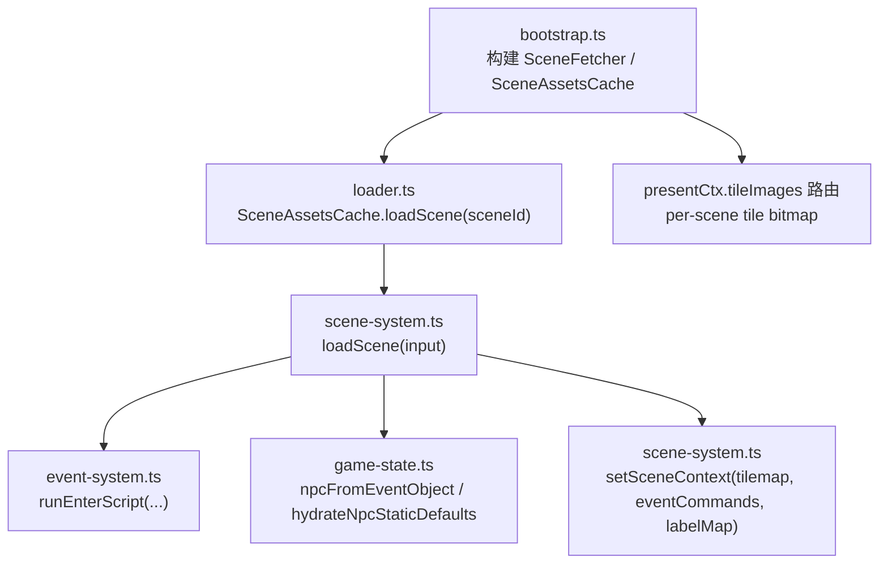
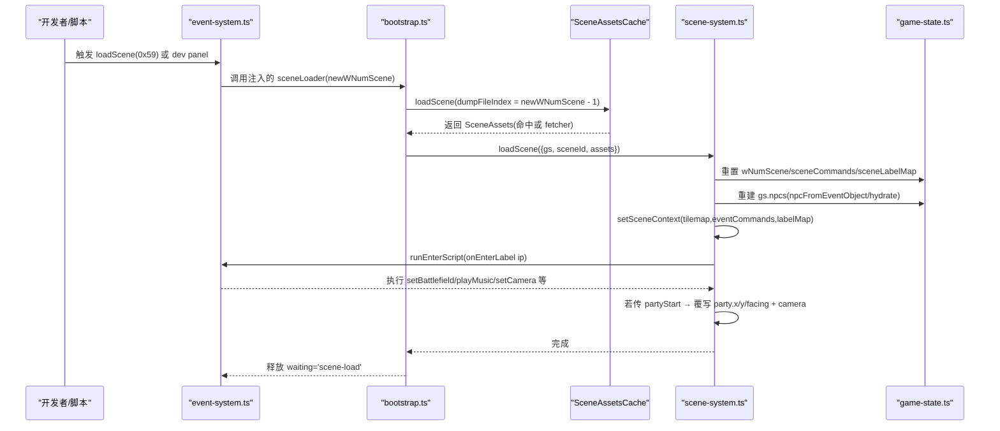
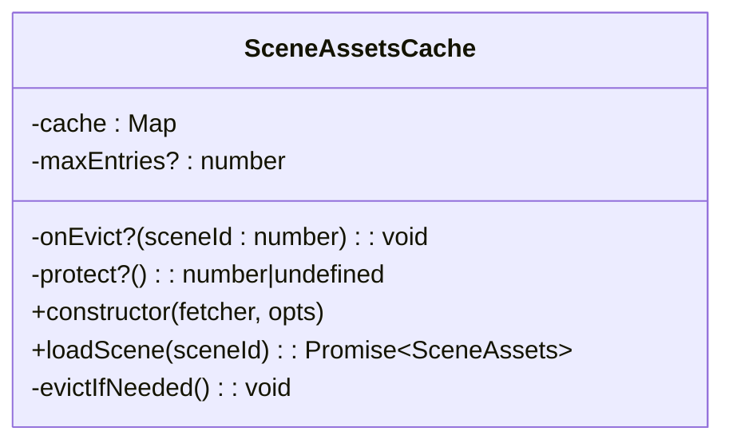
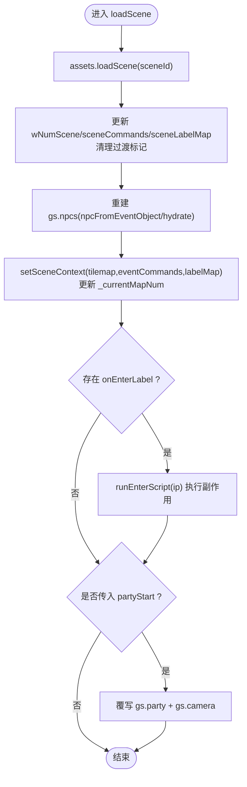
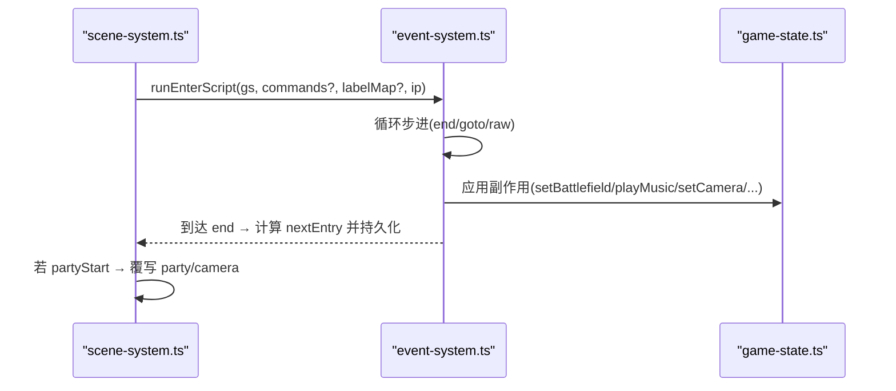
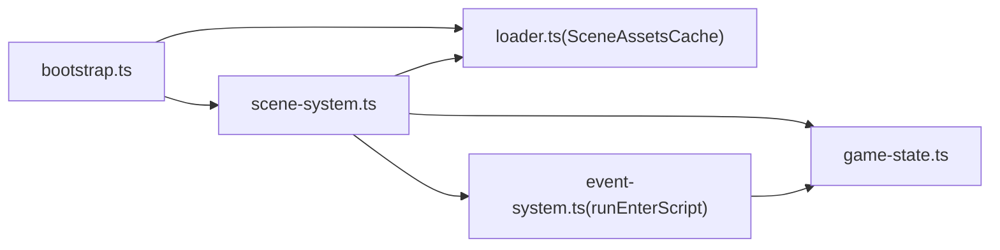

# 场景加载与管理

<cite>
**本文引用的文件**
- [scene-system.ts](file://packages/game/src/core/scene-system.ts)
- [loader.ts](file://packages/game/src/assets/loader.ts)
- [bootstrap.ts](file://packages/game/src/shell/bootstrap.ts)
- [event-system.ts](file://packages/game/src/core/event-system.ts)
- [game-state.ts](file://packages/game/src/core/game-state.ts)
- [loader.test.ts](file://packages/game/src/assets/loader.test.ts)
- [scene-system.test.ts](file://packages/game/src/core/scene-system.test.ts)
</cite>

## 目录
1. [简介](#简介)
2. [项目结构](#项目结构)
3. [核心组件](#核心组件)
4. [架构总览](#架构总览)
5. [详细组件分析](#详细组件分析)
6. [依赖关系分析](#依赖关系分析)
7. [性能考量](#性能考量)
8. [故障排查指南](#故障排查指南)
9. [结论](#结论)
10. [附录](#附录)

## 简介
本文件聚焦 Type-Pal 的场景加载与管理子系统，围绕 loadScene 的完整流程、SceneAssetsCache 懒加载与 LRU 淘汰、资源预取策略与内存管理、场景切换时的状态重置（NPC 列表重建、事件命令加载、标签映射处理）、onEnter 脚本执行机制及其副作用顺序、partyStart 参数的作用机制（起点坐标设置、相机同步与方向控制）进行系统化说明。文末提供添加新场景、配置场景属性与自定义切换行为的实践指引，以及性能优化技巧与调试工具使用方法。

## 项目结构
场景系统由“资源缓存层 + 场景切换逻辑 + 启动装配 + 事件系统”四部分组成：
- 资源缓存层：SceneAssetsCache 负责按 sceneId 懒加载 SceneAssets，并支持 LRU 淘汰与保护当前渲染场景。
- 场景切换逻辑：loadScene 完成资源获取、GS 字段更新、NPC 重建、onEnter 执行与 partyStart 覆盖。
- 启动装配：bootstrap 构建 SceneFetcher、注入 SceneAssetsCache、维护 per-scene tileImages 路由与 NPC sprite 按需补载。
- 事件系统：runEnterScript 同步执行 onEnter 段，applyRawOpcode 处理 setBattlefield、playMusic、setCamera 等副作用。

图表来源
- [bootstrap.ts:556-628](file://packages/game/src/shell/bootstrap.ts#L556-L628)
- [loader.ts:451-499](file://packages/game/src/assets/loader.ts#L451-L499)
- [scene-system.ts:607-660](file://packages/game/src/core/scene-system.ts#L607-L660)
- [event-system.ts:5504-5564](file://packages/game/src/core/event-system.ts#L5504-L5564)
- [game-state.ts:1479-1526](file://packages/game/src/core/game-state.ts#L1479-L1526)

章节来源
- [bootstrap.ts:556-628](file://packages/game/src/shell/bootstrap.ts#L556-L628)
- [loader.ts:451-499](file://packages/game/src/assets/loader.ts#L451-L499)
- [scene-system.ts:607-660](file://packages/game/src/core/scene-system.ts#L607-L660)

## 核心组件
- SceneAssetsCache：基于 Map 的 LRU 缓存，支持 maxEntries、onEvict、protect；命中刷新 MRU，未命中调用 fetcher 并触发淘汰。
- loadScene：从 assets 获取 SceneAssets，写入 wNumScene、sceneCommands、sceneLabelMap，重建 gs.npcs，更新 SceneContext 与 _currentMapNum，运行 onEnter 脚本，最后可选覆写 partyStart 与 camera。
- bootstrap 中的 SceneFetcher：按需拉取 scene-N.json、tilemap-N.json、events/scene-NNN.json，并行补 fetch NPC sprite 与 tileset blob，返回 SceneAssets。
- runEnterScript：同步跑 onEnter 段，处理 end/goto/raw(含 setPartyPos/setCamera/playMusic/setBattleField 等)，并在结束时持久化下一条 entry。

章节来源
- [loader.ts:451-499](file://packages/game/src/assets/loader.ts#L451-L499)
- [scene-system.ts:607-660](file://packages/game/src/core/scene-system.ts#L607-L660)
- [bootstrap.ts:556-628](file://packages/game/src/shell/bootstrap.ts#L556-L628)
- [event-system.ts:5504-5564](file://packages/game/src/core/event-system.ts#L5504-L5564)

## 架构总览
下图展示一次典型场景切换的关键时序：从 opcode 或 dev panel 触发到资源就绪、状态重置、onEnter 执行与相机同步。

图表来源
- [event-system.ts:673-690](file://packages/game/src/core/event-system.ts#L673-L690)
- [bootstrap.ts:781-800](file://packages/game/src/shell/bootstrap.ts#L781-L800)
- [loader.ts:451-499](file://packages/game/src/assets/loader.ts#L451-L499)
- [scene-system.ts:607-660](file://packages/game/src/core/scene-system.ts#L607-L660)

## 详细组件分析

### SceneAssetsCache 懒加载与 LRU 淘汰
- 设计要点
  - 使用 JS Map 保持插入顺序，迭代序即 LRU(最旧→最近)。命中时 delete+set 刷新到 MRU。
  - 构造可传入 maxEntries 启用 LRU；省略则无限缓存（向后兼容）。
  - onEvict 回调用于联动清理调用方持有的并行缓存（如 tileImagesBySceneId），避免黑屏。
  - protect 返回当前不可淘汰的 sceneId，即使它在 LRU 端也跳过，防止正在渲染的场景被清导致黑屏。
- 复杂度
  - loadScene：命中 O(1)，未命中 O(1) 插入 + 可能触发 evictIfNeeded。
  - evictIfNeeded：线性扫描 Map.keys() 找第一个非 protected 条目淘汰，时间 O(k)（k≤maxEntries）。
- 内存管理
  - 全 223 scene 的 tile 位图解码后常驻可达 ~100MB；默认保留最近 16 个场景，平衡内存与重访成本。
  - 淘汰时删除 tileImagesBySceneId 对应条目，确保 SceneAssets 命中不会因缺失 tile 而黑屏。

图表来源
- [loader.ts:451-499](file://packages/game/src/assets/loader.ts#L451-L499)

章节来源
- [loader.ts:451-499](file://packages/game/src/assets/loader.ts#L451-L499)
- [loader.test.ts:40-129](file://packages/game/src/assets/loader.test.ts#L40-L129)

### loadScene 完整流程
- 输入参数
  - gs: GameState
  - sceneId: 资源 dump 下标（0-based）
  - assets: SceneAssetsCache
  - partyStart?: { x, y, facing? }（像素坐标，不传则不改 party 位置）
- 关键步骤
  1) 通过 assets.loadScene(sceneId) 获取 SceneAssets（LRU 命中或 fetcher 拉取）。
  2) 写入 wNumScene=sceneId+1、sceneCommands、sceneLabelMap，并清理 gameOver/deathHold 等过渡标记。
  3) 解析 onTeleportLabel 的全局 ip 缓存到 gs.sceneOnTeleportEntry。
  4) 重建 gs.npcs：优先 sliceSceneEventObjects(gs, wNumScene)，否则从 sceneAssets.eventObjects 转换并 hydrate 静态默认值。
  5) setSceneContext 同步 tilemap/eventCommands/labelMap，更新 _currentMapNum。
  6) 若有 onEnterLabel，解析全局 ip 并 runEnterScript 执行进场脚本（setBattlefield/music/object state 等副作用）。
  7) 若传入 partyStart，覆写 gs.party(x,y,facing) 与 gs.camera(party - PARTYOFFSET_X/Y)。
- 注意
  - partyStart 在 onEnter 之后执行，保证 enter script 的 setBattlefield 等副作用生效，即便 dev fallback 也不丢。
  - 无 partyStart 且无 onEnterLabel 时，party 留在原坐标（不报错）。

图表来源
- [scene-system.ts:607-660](file://packages/game/src/core/scene-system.ts#L607-L660)

章节来源
- [scene-system.ts:607-660](file://packages/game/src/core/scene-system.ts#L607-L660)
- [scene-system.test.ts:991-1049](file://packages/game/src/core/scene-system.test.ts#L991-L1049)

### 场景切换时的状态重置逻辑
- NPC 列表重建
  - 优先使用 sliceSceneEventObjects(gs, wNumScene) 从全局 allEventObjects 切片，保持脚本改动持久（重进保留）。
  - 若无全局表，则回退为 sceneAssets.eventObjects.map(npcFromEventObject(...))，并用 hydrateNpcStaticDefaults 回填 nSpriteFramesAuto 等静态信息。
- 事件命令与标签映射
  - gs.sceneCommands 与 gs.sceneLabelMap 分别赋值为 sceneAssets.eventCommands 与 labelMap，供 tickEventSystem 与 runEnterScript 使用。
  - setSceneContext 同步 tilemap/eventCommands/labelMap，修复旧 scene 的 labelMap 残留导致的 triggerLabel 查找失败问题。
- 运行时复位（新游戏）
  - resetSceneRuntimeForNewGame 会清 presentation transients、战斗相关静态零字段、scene records、object records，并从 initialEventObjects 重建 allEventObjects，断开上一局脚本改动引用。

章节来源
- [scene-system.ts:622-634](file://packages/game/src/core/scene-system.ts#L622-L634)
- [game-state.ts:1479-1526](file://packages/game/src/core/game-state.ts#L1479-L1526)

### onEnter 脚本执行机制与副作用顺序
- 入口
  - loadScene 中若 sceneAssets.onEnterLabel 存在，则 resolveScriptLabel 解析全局 ip，随后 runEnterScript(gs, undefined, undefined, ip)。
- 副作用处理
  - runEnterScript 内部走 applyRawOpcode 分支，支持 setPartyPos、setCamera(center/absolute)、playMusic、setBattlefield、setSceneObjectState 等。
  - 顺序：先执行 onEnter 脚本（包含 setBattlefield/music/object state 等非位置类副作用），再根据 partyStart 覆写 party 位置与 camera。
- 持久化
  - runEnterScript 遇到 end 时，依据 advance/resetTo 计算下一条 entry，并持久化到 gs.sceneOnEnterIp[sceneId]，避免重复播放开场。

图表来源
- [scene-system.ts:646-660](file://packages/game/src/core/scene-system.ts#L646-L660)
- [event-system.ts:5504-5564](file://packages/game/src/core/event-system.ts#L5504-L5564)

章节来源
- [scene-system.ts:646-660](file://packages/game/src/core/scene-system.ts#L646-L660)
- [event-system.ts:5504-5564](file://packages/game/src/core/event-system.ts#L5504-L5564)

### partyStart 参数机制
- 作用范围
  - 仅当传入时生效：覆写 gs.party.x/y/facing，并将 gs.camera 设置为 party - PARTYOFFSET_X/Y，使相机跟随队伍。
- 行为优先级
  - partyStart 在 onEnter 之后执行，因此不会覆盖 enter script 设置的 setBattlefield/music 等副作用，但会覆盖 enter script 中的 setPartyPos（dev 面板手动 override 场景时尤为常见）。
- 坐标语义
  - partyStart 使用世界像素坐标（与 gs.party.x/y 一致），而非行列坐标。

章节来源
- [scene-system.ts:652-660](file://packages/game/src/core/scene-system.ts#L652-L660)

### 资源预取策略与内存管理
- 预取策略
  - bootstrap 的 sceneFetcher 在 loadScene 前按需拉取 scene-N.json、tilemap-N.json、events/scene-NNN.json，并并行补 fetch 新 scene 的 NPC sprite 与 tileset blob。
  - 对 cutscene 中可能用到的 party sprite（opcode 0x65 setPlayerSprite），可在切场景前预取，减少卡顿。
- 内存管理
  - SceneAssetsCache 的 LRU 上限（默认 16）配合 onEvict 清理 tileImagesBySceneId，避免全场景常驻导致 ~100MB 占用。
  - protect 保证当前渲染场景不被淘汰，防止黑屏。

章节来源
- [bootstrap.ts:556-628](file://packages/game/src/shell/bootstrap.ts#L556-L628)
- [loader.ts:451-499](file://packages/game/src/assets/loader.ts#L451-L499)

## 依赖关系分析
- 模块耦合
  - scene-system.ts 依赖 loader.ts 的 SceneAssetsCache 与 game-state.ts 的 npcFromEventObject/hydrateNpcStaticDefaults。
  - bootstrap.ts 提供 SceneFetcher 实现并注入到 SceneAssetsCache，同时维护 presentCtx 的 per-scene tileImages 路由。
  - event-system.ts 提供 runEnterScript 与 raw opcode 处理，被 loadScene 调用以执行 onEnter 副作用。
- 外部依赖
  - 资源路径统一位于 /extracted/data/*，包括 scene、tilemap、palette、sprites、events 等。
- 潜在环路与解耦
  - event-system 通过 setObstacleChecker 注入 isWalkable，避免反向 import 形成环。

图表来源
- [scene-system.ts:607-660](file://packages/game/src/core/scene-system.ts#L607-L660)
- [loader.ts:451-499](file://packages/game/src/assets/loader.ts#L451-L499)
- [bootstrap.ts:556-628](file://packages/game/src/shell/bootstrap.ts#L556-L628)
- [event-system.ts:5504-5564](file://packages/game/src/core/event-system.ts#L5504-L5564)

章节来源
- [scene-system.ts:607-660](file://packages/game/src/core/scene-system.ts#L607-L660)
- [loader.ts:451-499](file://packages/game/src/assets/loader.ts#L451-L499)
- [bootstrap.ts:556-628](file://packages/game/src/shell/bootstrap.ts#L556-L628)
- [event-system.ts:5504-5564](file://packages/game/src/core/event-system.ts#L5504-L5564)

## 性能考量
- 场景缓存大小
  - 建议 maxEntries=16，兼顾频繁往返场景的命中率与内存占用；过大会导致 tile 位图常驻过多。
- 保护当前场景
  - 始终设置 protect=()=>currentSceneId，避免正在渲染的场景被 LRU 淘汰造成黑屏。
- 预取策略
  - 在切场景前预取新场景的 NPC sprite 与 tileset blob，减少首次渲染卡顿。
  - 针对 cutscene 中 setPlayerSprite 的 sprite id，提前 fetchMissingSprite，避免中途阻塞。
- 资源复用
  - 同 map 多场景共享 tileset blob 解码结果（按 mapNum 维度），避免重复解压。

## 故障排查指南
- 常见问题
  - 切换场景后画面黑屏：检查 SceneAssetsCache 的 onEvict 是否正确清理 tileImagesBySceneId；确认 protect 返回了当前 sceneId。
  - 进入新场景后战斗背景/音乐未生效：确认 onEnter 脚本已执行，且 partyStart 在 onEnter 之后才覆写位置。
  - NPC 状态异常：确认 gs.npcs 是从 sliceSceneEventObjects 重建还是从 scene dump 重建；必要时检查 hydrateNpcStaticDefaults 是否被调用。
- 调试工具
  - dev-panel 传送功能：可直接设置 party.x/y 与 camera，便于对齐触发垫或验证落点合法性。
  - 缩略图预览：按 mapNum 生成整张地图缩略图，辅助定位 partyStart 的合理区域。
  - 日志输出：关注 console.warn/console.log 关于资源加载失败的提示，快速定位缺失资源。

章节来源
- [bootstrap.ts:779-800](file://packages/game/src/shell/bootstrap.ts#L779-L800)
- [dev-panel.ts:1101-1127](file://packages/game/src/dev/dev-panel.ts#L1101-L1127)

## 结论
Type-Pal 的场景加载与管理子系统通过 SceneAssetsCache 的懒加载与 LRU 淘汰、loadScene 的状态重置与 onEnter 副作用执行、以及 partyStart 的后置覆写策略，实现了高效、稳定且可定制的场景切换流程。结合 bootstrap 的资源预取与 per-scene tileImages 路由，系统在内存与性能之间取得良好平衡。通过合理的调试工具与日志手段，可快速定位并解决常见问题。

## 附录

### 如何添加新场景
- 准备数据
  - 在 /extracted/data/scene/{sceneId}.json 中定义 scene 元数据（含 mapNum、eventObjects、onEnterLabel、onTeleportLabel）。
  - 在 /extracted/data/tilemap/{mapNum}.json 中提供 tilemap。
  - 在 /extracted/events/scene-{padded}.json 中提供事件命令与 labelMap。
- 注册与加载
  - 通过 SceneAssetsCache 的 fetcher 实现按需拉取上述资源。
  - 调用 loadScene({ gs, sceneId, assets, partyStart }) 完成切换。
- 配置属性
  - 在 onEnterLabel 指向的脚本中设置 setPartyPos、setCamera、playMusic、setBattlefield 等。
  - 如需归隐脱出，配置 onTeleportLabel。

章节来源
- [bootstrap.ts:556-628](file://packages/game/src/shell/bootstrap.ts#L556-L628)
- [scene-system.ts:607-660](file://packages/game/src/core/scene-system.ts#L607-L660)

### 自定义切换行为
- 在 bootstrap 的 loadSceneCommon 中扩展 fromSavedGame 分支，实现读档路径的特殊处理（例如不清 wave 特效）。
- 在 runEnterScript 中扩展 applyRawOpcode 分支，支持新的副作用 opcode（如自定义 fade 效果）。
- 在 SceneAssetsCache 的 onEvict 中增加联动清理逻辑，确保其他缓存与 SceneAssets 一致性。

章节来源
- [bootstrap.ts:781-800](file://packages/game/src/shell/bootstrap.ts#L781-L800)
- [event-system.ts:5504-5564](file://packages/game/src/core/event-system.ts#L5504-L5564)
- [loader.ts:451-499](file://packages/game/src/assets/loader.ts#L451-L499)