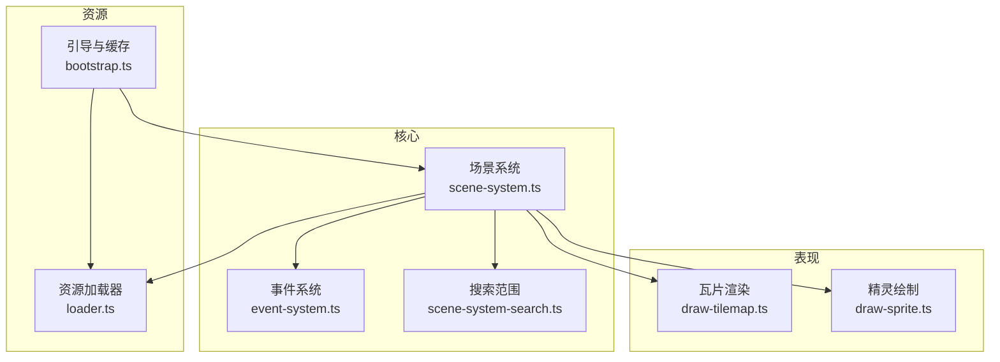
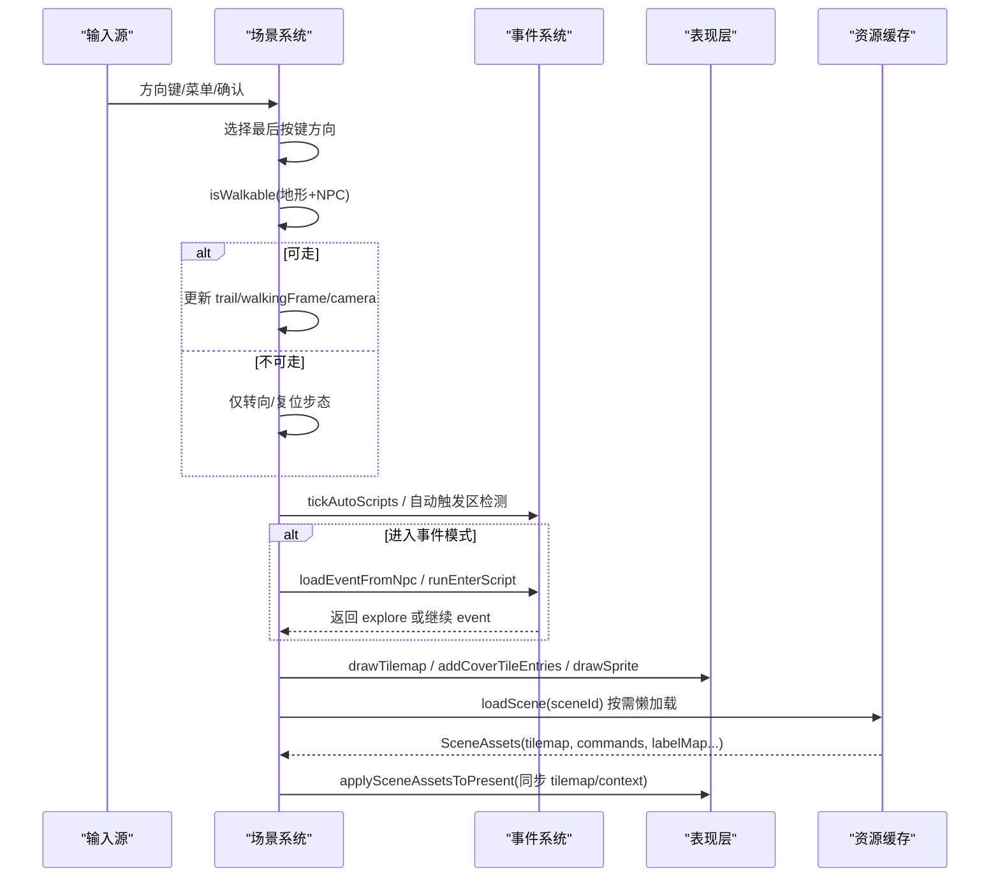
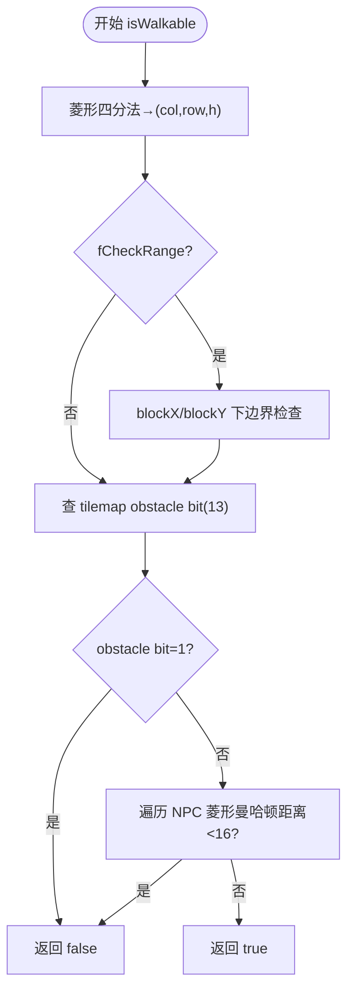
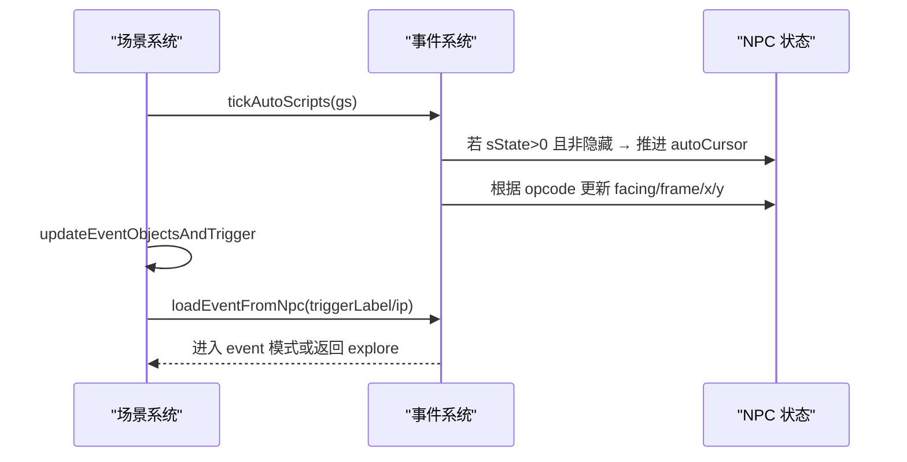
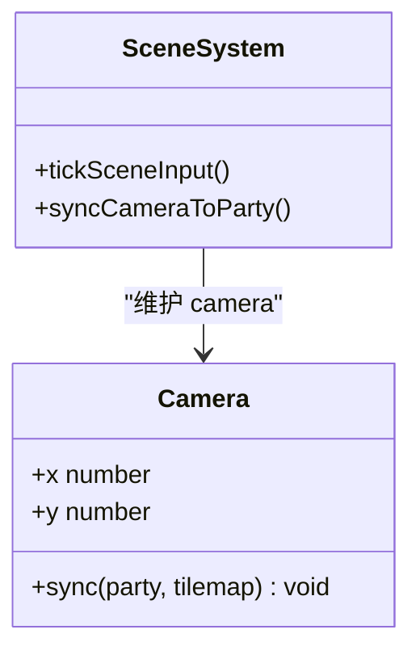
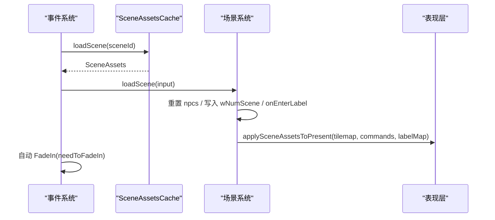
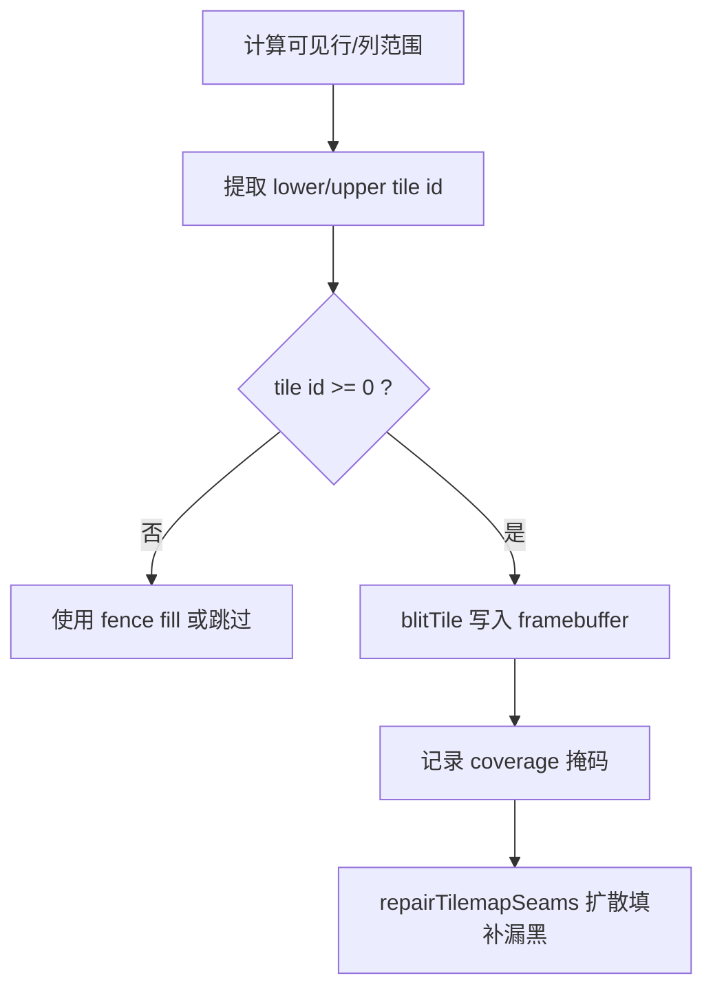
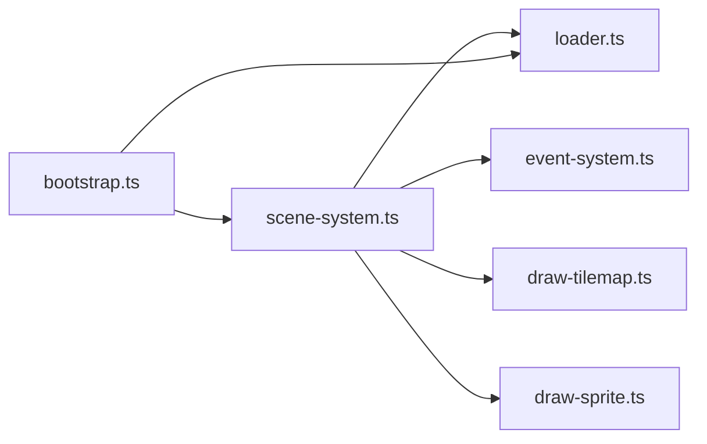

# 场景系统

<cite>
**本文引用的文件**
- [packages/game/src/core/scene-system.ts](file://packages/game/src/core/scene-system.ts)
- [packages/game/src/core/event-system.ts](file://packages/game/src/core/event-system.ts)
- [packages/game/src/present/draw-tilemap.ts](file://packages/game/src/present/draw-tilemap.ts)
- [packages/game/src/present/draw-sprite.ts](file://packages/game/src/present/draw-sprite.ts)
- [packages/game/src/assets/loader.ts](file://packages/game/src/assets/loader.ts)
- [packages/game/src/shell/bootstrap.ts](file://packages/game/src/shell/bootstrap.ts)
- [packages/game/src/core/scene-system-search.ts](file://packages/game/src/core/scene-system-search.ts)
- [packages/game/e2e/scene/a7-camera-follow.spec.ts](file://packages/game/e2e/scene/a7-camera-follow.spec.ts)
</cite>

## 目录
1. [简介](#简介)
2. [项目结构](#项目结构)
3. [核心组件](#核心组件)
4. [架构总览](#架构总览)
5. [详细组件分析](#详细组件分析)
6. [依赖关系分析](#依赖关系分析)
7. [性能考量](#性能考量)
8. [故障排查指南](#故障排查指南)
9. [结论](#结论)
10. [附录](#附录)

## 简介
本文件为 Type-Pal 的场景系统综合文档，聚焦以下方面：
- 场景加载与管理机制（含地图瓦片渲染、精灵图集处理与资源预加载策略）
- 碰撞检测算法（AABB/菱形曼哈顿地形碰撞、NPC 阻挡与接触怪触发）
- NPC 行为系统（自动脚本执行、巡逻路径与交互触发逻辑）
- 相机控制机制（视口跟随、边界限制与平滑移动）
- 场景切换流程（淡入淡出效果、状态保存与恢复）
- 实践示例（添加新场景、配置 NPC 行为、自定义碰撞规则）
- 性能优化技巧与调试工具使用方法

## 项目结构
Type-Pal 第一阶段以浏览器运行时为核心，场景系统由“核心逻辑 + 表现层 + 资源管线”三层协作完成：
- 核心逻辑：场景主循环、输入处理、碰撞、事件脚本、相机与场景切换
- 表现层：Tilemap 渲染、精灵绘制、覆盖瓦片计算、接缝修复
- 资源管线：SceneAssetsCache LRU 缓存、懒加载 fetcher、按场景路由 tileImages

图示来源
- [packages/game/src/core/scene-system.ts:1-120](file://packages/game/src/core/scene-system.ts#L1-L120)
- [packages/game/src/core/event-system.ts:1-120](file://packages/game/src/core/event-system.ts#L1-L120)
- [packages/game/src/present/draw-tilemap.ts:1-120](file://packages/game/src/present/draw-tilemap.ts#L1-L120)
- [packages/game/src/present/draw-sprite.ts:1-55](file://packages/game/src/present/draw-sprite.ts#L1-L55)
- [packages/game/src/assets/loader.ts:400-500](file://packages/game/src/assets/loader.ts#L400-L500)
- [packages/game/src/shell/bootstrap.ts:356-651](file://packages/game/src/shell/bootstrap.ts#L356-L651)

章节来源
- [packages/game/src/core/scene-system.ts:1-120](file://packages/game/src/core/scene-system.ts#L1-L120)
- [packages/game/src/assets/loader.ts:400-500](file://packages/game/src/assets/loader.ts#L400-L500)
- [packages/game/src/shell/bootstrap.ts:356-651](file://packages/game/src/shell/bootstrap.ts#L356-L651)

## 核心组件
- 场景系统（scene-system.ts）
  - 探索模式 tick：读取输入 → 走路/转向 → 碰撞判定 → 自动触发区检测 → 切事件模式
  - 碰撞：菱形四分法映射到 (col,row,h)，查 tile obstacle bit(13)，NPC 菱形曼哈顿距离 < 16 则阻挡
  - 相机：camera = party - PARTYOFFSET；边界 clamp 到 tilemap 最大像素
  - 场景切换：loadScene 异步拉取 SceneAssets，重置 gs.npcs，运行 onEnter 脚本，可选设置 partyStart
- 事件系统（event-system.ts）
  - 协程式步进器：单 tick 连跑非阻塞命令，遇等待/结束/越界返回
  - 自动脚本：tickAutoScripts 驱动 NPC 自动行为（行走、转向、动画帧推进等）
  - 相机控制：OP_SET_CAMERA 支持绝对定位、相对平移、多帧 pan
  - 淡入淡出：palette ramp fade、屏幕 fade、场景 fade、自动 FadeIn
- 瓦片渲染（draw-tilemap.ts）
  - 两层 tilemap：layer 0 先画，layer 1 后画用于遮挡精灵
  - 精确坐标公式与 fence 填充，修复接缝漏黑
  - 覆盖瓦片计算：根据精灵包围盒反查可能覆盖的 layer-1 瓦片并排序
- 精灵绘制（draw-sprite.ts）
  - 每帧独立 anchor（脚底中心），opaque mask 正确跳过透明像素
- 资源加载（loader.ts）
  - SceneAssetsCache：LRU 淘汰、保护当前场景、onEvict 联动清理 tileImagesBySceneId
  - SceneFetcher：从 /extracted 拉取 scene/tilemap/palette/sprites 等资源
- 引导与缓存（bootstrap.ts）
  - 首屏初始化、tileImagesBySceneId 路由、applySceneAssetsToPresent 同步 presentCtx 与 scene-system

章节来源
- [packages/game/src/core/scene-system.ts:357-425](file://packages/game/src/core/scene-system.ts#L357-L425)
- [packages/game/src/core/scene-system.ts:427-434](file://packages/game/src/core/scene-system.ts#L427-L434)
- [packages/game/src/core/scene-system.ts:607-661](file://packages/game/src/core/scene-system.ts#L607-L661)
- [packages/game/src/core/event-system.ts:3650-3672](file://packages/game/src/core/event-system.ts#L3650-L3672)
- [packages/game/src/present/draw-tilemap.ts:92-151](file://packages/game/src/present/draw-tilemap.ts#L92-L151)
- [packages/game/src/present/draw-tilemap.ts:255-383](file://packages/game/src/present/draw-tilemap.ts#L255-L383)
- [packages/game/src/present/draw-sprite.ts:26-37](file://packages/game/src/present/draw-sprite.ts#L26-L37)
- [packages/game/src/assets/loader.ts:451-499](file://packages/game/src/assets/loader.ts#L451-L499)
- [packages/game/src/shell/bootstrap.ts:641-651](file://packages/game/src/shell/bootstrap.ts#L641-L651)

## 架构总览
场景系统的整体数据流与控制流如下：

图示来源
- [packages/game/src/core/scene-system.ts:443-584](file://packages/game/src/core/scene-system.ts#L443-L584)
- [packages/game/src/core/event-system.ts:630-671](file://packages/game/src/core/event-system.ts#L630-L671)
- [packages/game/src/present/draw-tilemap.ts:92-151](file://packages/game/src/present/draw-tilemap.ts#L92-L151)
- [packages/game/src/assets/loader.ts:451-499](file://packages/game/src/assets/loader.ts#L451-L499)
- [packages/game/src/shell/bootstrap.ts:641-651](file://packages/game/src/shell/bootstrap.ts#L641-L651)

## 详细组件分析

### 碰撞检测算法
- 地形碰撞
  - 菱形四分法将像素坐标映射到 (col,row,h=0/1)
  - 检查 tilemap cell.lower/upper 的 obstacle bit(第13位)
  - fCheckRange=true 时额外禁止靠近屏幕边缘的 blockX/blockY 区域，保证队首始终居中
- NPC 碰撞
  - sState>=2 且菱形曼哈顿距离 abs(dx)+abs(dy)*2 < 16 视为阻挡
  - triggerMode>=4 的 contact 怪物不阻挡走路，但会触发战斗
- 搜索触发（Confirm Search）
  - 朝向前方 13 个 grid cell，按 mode 1..3 的距离阈值匹配同格 NPC

图示来源
- [packages/game/src/core/scene-system.ts:371-425](file://packages/game/src/core/scene-system.ts#L371-L425)
- [packages/game/src/core/scene-system-search.ts:38-92](file://packages/game/src/core/scene-system-search.ts#L38-L92)

章节来源
- [packages/game/src/core/scene-system.ts:357-425](file://packages/game/src/core/scene-system.ts#L357-L425)
- [packages/game/src/core/scene-system-search.ts:38-92](file://packages/game/src/core/scene-system-search.ts#L38-L92)

### NPC 行为系统
- 自动脚本执行
  - tickAutoScripts 在 pre-input 阶段运行，驱动 NPC 自动行为（行走、转向、动画帧推进）
  - 对话期 owner NPC 冻结 autoScript，避免覆盖面向玩家的姿态
- 巡逻路径
  - 通过 walkOneStep 系列 opcode 与 setDirection/setGesture 组合实现
  - 帧推进遵循 nSpriteFrames/nSpriteFramesAuto 真值
- 交互触发逻辑
  - 自动触发区：Manhattan 距离阈值随 triggerMode 变化
  - Confirm Search：13 cell 范围 + 同格匹配 + 视觉特效（NPC 转身 + 站立帧）

图示来源
- [packages/game/src/core/scene-system.ts:187-267](file://packages/game/src/core/scene-system.ts#L187-L267)
- [packages/game/src/core/event-system.ts:467-491](file://packages/game/src/core/event-system.ts#L467-L491)

章节来源
- [packages/game/src/core/scene-system.ts:187-267](file://packages/game/src/core/scene-system.ts#L187-L267)
- [packages/game/src/core/event-system.ts:467-491](file://packages/game/src/core/event-system.ts#L467-L491)

### 相机控制机制
- 视口跟随
  - camera = party - PARTYOFFSET；每帧 syncCameraToParty 做边界 clamp
- 边界限制
  - 防止 camera 负值或超出 tilemap 最大像素
- 平滑移动
  - OP_SET_CAMERA 支持相对平移与多帧 pan，waiting='camera-pan' 逐帧推进

图示来源
- [packages/game/src/core/scene-system.ts:427-434](file://packages/game/src/core/scene-system.ts#L427-L434)
- [packages/game/src/core/event-system.ts:3650-3672](file://packages/game/src/core/event-system.ts#L3650-L3672)
- [packages/game/e2e/scene/a7-camera-follow.spec.ts:1-35](file://packages/game/e2e/scene/a7-camera-follow.spec.ts#L1-L35)

章节来源
- [packages/game/src/core/scene-system.ts:427-434](file://packages/game/src/core/scene-system.ts#L427-L434)
- [packages/game/src/core/event-system.ts:3650-3672](file://packages/game/src/core/event-system.ts#L3650-L3672)
- [packages/game/e2e/scene/a7-camera-follow.spec.ts:1-35](file://packages/game/e2e/scene/a7-camera-follow.spec.ts#L1-L35)

### 场景切换流程
- 懒加载与缓存
  - SceneAssetsCache 管理 SceneAssets，LRU 淘汰，protect 当前场景，onEvict 清理 tileImagesBySceneId
- 切换步骤
  - 拉取新 scene 资源（tilemap、commands、labelMap、onEnter/onTeleport 标签）
  - 重置 gs.npcs，运行 onEnter 脚本（可设战场、音乐、对象状态等）
  - 可选 partyStart 覆写起点与相机位置
  - applySceneAssetsToPresent 同步 presentCtx 的 tilemap 与 context
- 淡入淡出
  - palette ramp fade、屏幕 fade、场景 fade；自动 FadeIn 在 PAL_MakeScene 末尾触发

图示来源
- [packages/game/src/assets/loader.ts:451-499](file://packages/game/src/assets/loader.ts#L451-L499)
- [packages/game/src/core/scene-system.ts:607-661](file://packages/game/src/core/scene-system.ts#L607-L661)
- [packages/game/src/core/event-system.ts:630-671](file://packages/game/src/core/event-system.ts#L630-L671)
- [packages/game/src/shell/bootstrap.ts:641-651](file://packages/game/src/shell/bootstrap.ts#L641-L651)

章节来源
- [packages/game/src/assets/loader.ts:451-499](file://packages/game/src/assets/loader.ts#L451-L499)
- [packages/game/src/core/scene-system.ts:607-661](file://packages/game/src/core/scene-system.ts#L607-L661)
- [packages/game/src/core/event-system.ts:630-671](file://packages/game/src/core/event-system.ts#L630-L671)
- [packages/game/src/shell/bootstrap.ts:641-651](file://packages/game/src/shell/bootstrap.ts#L641-L651)

### 地图瓦片渲染与精灵图集处理
- Tilemap 渲染
  - 两层绘制：layer 0 先画，layer 1 后画用于遮挡精灵
  - 精确坐标公式与 fence 填充，修复接缝漏黑
- 精灵图集
  - 每帧独立 anchor（脚底中心），opaque mask 正确跳过透明像素
- 覆盖瓦片
  - 根据精灵包围盒反查可能覆盖的 layer-1 瓦片并排序，确保遮挡顺序正确

图示来源
- [packages/game/src/present/draw-tilemap.ts:92-151](file://packages/game/src/present/draw-tilemap.ts#L92-L151)
- [packages/game/src/present/draw-tilemap.ts:169-208](file://packages/game/src/present/draw-tilemap.ts#L169-L208)
- [packages/game/src/present/draw-tilemap.ts:255-383](file://packages/game/src/present/draw-tilemap.ts#L255-L383)
- [packages/game/src/present/draw-sprite.ts:26-37](file://packages/game/src/present/draw-sprite.ts#L26-L37)

章节来源
- [packages/game/src/present/draw-tilemap.ts:92-151](file://packages/game/src/present/draw-tilemap.ts#L92-L151)
- [packages/game/src/present/draw-tilemap.ts:169-208](file://packages/game/src/present/draw-tilemap.ts#L169-L208)
- [packages/game/src/present/draw-tilemap.ts:255-383](file://packages/game/src/present/draw-tilemap.ts#L255-L383)
- [packages/game/src/present/draw-sprite.ts:26-37](file://packages/game/src/present/draw-sprite.ts#L26-L37)

## 依赖关系分析
- 模块耦合
  - scene-system 依赖 event-system（自动脚本/触发）、present 层（渲染）、assets loader（资源）
  - bootstrap 负责注入 SceneAssetsCache、tileImagesBySceneId 路由与 applySceneAssetsToPresent
- 外部依赖
  - SDLPal 参考源码作为行为规格（碰撞、触发、相机、淡入淡出）
- 潜在环依赖
  - event-system 通过 hook 注入 isWalkable，避免反向 import 形成环

图示来源
- [packages/game/src/core/scene-system.ts:1-120](file://packages/game/src/core/scene-system.ts#L1-L120)
- [packages/game/src/assets/loader.ts:451-499](file://packages/game/src/assets/loader.ts#L451-L499)
- [packages/game/src/shell/bootstrap.ts:356-651](file://packages/game/src/shell/bootstrap.ts#L356-L651)

章节来源
- [packages/game/src/core/scene-system.ts:1-120](file://packages/game/src/core/scene-system.ts#L1-L120)
- [packages/game/src/assets/loader.ts:451-499](file://packages/game/src/assets/loader.ts#L451-L499)
- [packages/game/src/shell/bootstrap.ts:356-651](file://packages/game/src/shell/bootstrap.ts#L356-L651)

## 性能考量
- 资源缓存
  - SceneAssetsCache LRU 上限 16，保护当前场景不被淘汰；onEvict 同步清理 tileImagesBySceneId，避免常驻 ~100MB
- 并行加载
  - 首屏与新场景 tile PNG 与 sprite 并行 fetch，减少卡顿
- 渲染优化
  - viewport clip 整行/整列跳过；coverage 掩码快速修复接缝，避免全图重绘
- 内存控制
  - tileImagesBySceneId 与 SceneAssetsCache 联动释放，保持内存稳定

[本节为通用指导，无需列出具体文件来源]

## 故障排查指南
- 常见问题
  - 场景切换后仍显示旧 tilemap：需调用 applySceneAssetsToPresent 同步 presentCtx 的 tilemap 与 context
  - 淡出后黑屏：需要自动 FadeIn 在 PAL_MakeScene 末尾触发，确保 needToFadeIn 被消费
  - NPC 碰撞异常：检查 sState 与 triggerMode，contact 怪不应阻挡走路
  - 相机偏移错误：确认 camera = party - PARTYOFFSET 与边界 clamp
- 调试建议
  - 使用 e2e 用例验证相机 follow 与视觉 baseline
  - 利用 dev panel 手动 jump 场景并观察 enter script 副作用

章节来源
- [packages/game/src/shell/bootstrap.ts:641-651](file://packages/game/src/shell/bootstrap.ts#L641-L651)
- [packages/game/src/core/event-system.ts:630-671](file://packages/game/src/core/event-system.ts#L630-L671)
- [packages/game/e2e/scene/a7-camera-follow.spec.ts:1-35](file://packages/game/e2e/scene/a7-camera-follow.spec.ts#L1-L35)

## 结论
Type-Pal 的场景系统以 SDLPal 为真值锚点，实现了高保真的碰撞、触发、相机与淡入淡出机制。通过 SceneAssetsCache 与 tileImagesBySceneId 的协同，系统在资源管理与渲染性能之间取得平衡。事件系统与场景系统解耦清晰，便于扩展与调试。

[本节为总结性内容，无需列出具体文件来源]

## 附录

### 实践示例

- 添加新场景
  - 准备 scene JSON、tilemap、palette、sprites 等资源
  - 在引导中注册 SceneAssetsCache 与 SceneFetcher，并在需要时调用 loadScene
  - 如需设置队伍起点，传入 partyStart；否则 onEnter 脚本可设置位置
  - 参考路径：
    - [packages/game/src/assets/loader.ts:451-499](file://packages/game/src/assets/loader.ts#L451-L499)
    - [packages/game/src/core/scene-system.ts:607-661](file://packages/game/src/core/scene-system.ts#L607-L661)
    - [packages/game/src/shell/bootstrap.ts:641-651](file://packages/game/src/shell/bootstrap.ts#L641-L651)

- 配置 NPC 行为
  - 设置 triggerMode 与 triggerLabel，定义自动触发区与交互脚本
  - 使用自动脚本 opcode 控制行走、转向与动画帧推进
  - 参考路径：
    - [packages/game/src/core/scene-system.ts:187-267](file://packages/game/src/core/scene-system.ts#L187-L267)
    - [packages/game/src/core/event-system.ts:467-491](file://packages/game/src/core/event-system.ts#L467-L491)

- 自定义碰撞规则
  - 修改 isWalkable 中的 NPC 阻挡条件或地形 obstacle bit 判断
  - 调整 fCheckRange 的 blockX/blockY 下边界策略
  - 参考路径：
    - [packages/game/src/core/scene-system.ts:371-425](file://packages/game/src/core/scene-system.ts#L371-L425)

- 相机控制
  - 使用 OP_SET_CAMERA 进行绝对定位或相对平移，支持多帧 pan
  - 参考路径：
    - [packages/game/src/core/event-system.ts:3650-3672](file://packages/game/src/core/event-system.ts#L3650-L3672)

- 淡入淡出
  - 使用 palette ramp fade、屏幕 fade、场景 fade；注意 needToFadeIn 的自动消费
  - 参考路径：
    - [packages/game/src/core/event-system.ts:630-671](file://packages/game/src/core/event-system.ts#L630-L671)