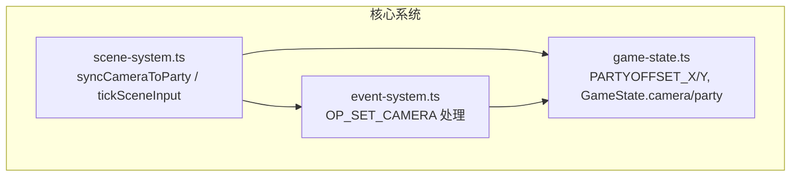
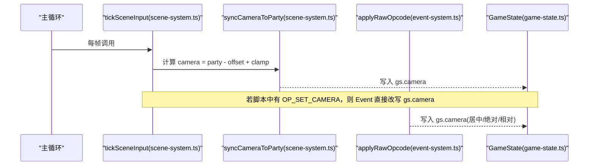
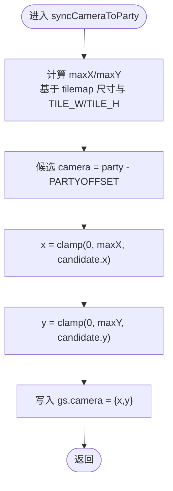

# 相机控制系统

<cite>
**本文引用的文件**   
- [scene-system.ts](file://packages/game/src/core/scene-system.ts)
- [event-system.ts](file://packages/game/src/core/event-system.ts)
- [game-state.ts](file://packages/game/src/core/game-state.ts)
</cite>

## 目录
1. [简介](#简介)
2. [项目结构](#项目结构)
3. [核心组件](#核心组件)
4. [架构总览](#架构总览)
5. [详细组件分析](#详细组件分析)
6. [依赖关系分析](#依赖关系分析)
7. [性能考虑](#性能考虑)
8. [故障排查指南](#故障排查指南)
9. [结论](#结论)
10. [附录：自定义与调试示例](#附录自定义与调试示例)

## 简介
本文件聚焦 Type-Pal 的相机控制系统，围绕以下目标展开：
- 深入解释 syncCameraToParty 的实现原理、视口跟随算法与边界限制机制。
- 说明 camera 与 party 坐标的关系，包括 PARTYOFFSET_X/Y 的作用以及 world coordinate 转换。
- 阐述相机边界钳制逻辑（地图尺寸计算与 Math.max/Math.min 保护）。
- 解释相机更新时机（移动后同步、场景切换时的位置保持）。
- 说明相机系统与渲染系统的集成方式（viewport 坐标传递与屏幕裁剪）。
- 提供自定义相机行为与特殊场景处理的实践建议，并给出性能优化与调试技巧。

## 项目结构
相机控制相关代码集中在游戏核心子系统：
- scene-system.ts：负责探索模式主循环、碰撞检测、事件触发、相机跟随与边界钳制。
- event-system.ts：负责事件脚本执行，包含 OP_SET_CAMERA 等对相机的直接操作。
- game-state.ts：定义全局常量 PARTYOFFSET_X/Y 及 GameState 中 camera/party 字段语义。



图表来源
- [scene-system.ts:427-434](file://packages/game/src/core/scene-system.ts#L427-L434)
- [event-system.ts:3650-3672](file://packages/game/src/core/event-system.ts#L3650-L3672)
- [game-state.ts:15-26](file://packages/game/src/core/game-state.ts#L15-L26)

章节来源
- [scene-system.ts:427-434](file://packages/game/src/core/scene-system.ts#L427-L434)
- [event-system.ts:3650-3672](file://packages/game/src/core/event-system.ts#L3650-L3672)
- [game-state.ts:15-26](file://packages/game/src/core/game-state.ts#L15-L26)

## 核心组件
- 相机状态与队伍状态
  - gs.camera：表示“屏幕左上角在世界坐标系中的像素坐标”，等价于 sdlpal 的 viewport。
  - gs.party.x/y：队伍队长的世界像素坐标。
  - PARTYOFFSET_X/Y：队伍在屏幕上的固定锚点 (160, 112)。camera = party - offset 是核心不变式。

- 相机跟随与边界钳制
  - syncCameraToParty：每帧根据 party 位置计算 camera，并用地图宽高做边界钳制，确保 camera 不越界。

- 事件脚本对相机的干预
  - OP_SET_CAMERA：支持三种模式——居中回正、绝对跳转、相对平移；多帧平移通过 waiting='camera-pan' 逐帧推进。

章节来源
- [game-state.ts:15-26](file://packages/game/src/core/game-state.ts#L15-L26)
- [scene-system.ts:427-434](file://packages/game/src/core/scene-system.ts#L427-L434)
- [event-system.ts:3650-3672](file://packages/game/src/core/event-system.ts#L3650-L3672)

## 架构总览
相机系统在探索模式的主循环中被驱动，并在事件脚本中可被显式修改。整体流程如下：



图表来源
- [scene-system.ts:467-525](file://packages/game/src/core/scene-system.ts#L467-L525)
- [scene-system.ts:427-434](file://packages/game/src/core/scene-system.ts#L427-L434)
- [event-system.ts:3650-3672](file://packages/game/src/core/event-system.ts#L3650-L3672)
- [game-state.ts:15-26](file://packages/game/src/core/game-state.ts#L15-L26)

## 详细组件分析

### 1) 相机跟随与边界钳制：syncCameraToParty
- 输入：当前队伍世界坐标 gs.party.x/y、地图 tilemap 尺寸。
- 计算：
  - 最大可见范围 maxX = (width - 1) * TILE_W，maxY = (height - 1) * TILE_H。
  - 候选 camera = { x: party.x - PARTYOFFSET_X, y: party.y - PARTYOFFSET_Y }。
  - 使用 Math.max(0, Math.min(maxX, candidate)) 进行二维边界钳制。
- 输出：gs.camera 被更新为钳制后的值。



图表来源
- [scene-system.ts:427-434](file://packages/game/src/core/scene-system.ts#L427-L434)

章节来源
- [scene-system.ts:427-434](file://packages/game/src/core/scene-system.ts#L427-L434)

### 2) 相机更新时机
- 探索模式每帧：
  - tickScenePreInput：自动触发区检测、自动脚本推进、阻挡推离、追逐计时器递减。
  - tickSceneInput：读取输入、走路与转向、动画步频更新、随后立即调用 syncCameraToParty 更新相机。
- 事件模式：
  - 当脚本执行 OP_SET_CAMERA 时，applyRawOpcode 直接修改 gs.camera；多帧平移通过 waiting='camera-pan' 逐帧推进。
- 场景切换：
  - loadScene 支持传入 partyStart，设置 gs.party 后，将 gs.camera 设为 party - PARTYOFFSET，保证新场景镜头与队伍对齐。

章节来源
- [scene-system.ts:443-525](file://packages/game/src/core/scene-system.ts#L443-L525)
- [event-system.ts:3650-3672](file://packages/game/src/core/event-system.ts#L3650-L3672)
- [scene-system.ts:607-661](file://packages/game/src/core/scene-system.ts#L607-L661)

### 3) 相机与队伍坐标关系与 WORLD 坐标转换
- 不变式：gs.camera.x = gs.party.x - PARTYOFFSET_X；gs.camera.y = gs.party.y - PARTYOFFSET_Y。
- 含义：
  - gs.party.x/y 是世界像素坐标。
  - gs.camera 是屏幕左上角的世界坐标（即 viewport）。
  - PARTYOFFSET_X/Y 是队伍在屏幕上的固定锚点，决定“队伍始终位于屏幕中心附近”的视觉基准。
- 事件脚本中的绝对定位：
  - OP_SET_CAMERA 的绝对模式以 tile 为单位指定目标区域，内部换算为像素再减去 offset 得到 camera。

章节来源
- [game-state.ts:15-26](file://packages/game/src/core/game-state.ts#L15-L26)
- [event-system.ts:3650-3672](file://packages/game/src/core/event-system.ts#L3650-L3672)

### 4) 事件脚本对相机的控制：OP_SET_CAMERA
- 三种模式：
  - 居中回正：op0=0 && op1=0 → camera = party - offset。
  - 绝对跳转：op2=0xFFFF → camera = (col*32 - offset.x, row*16 - offset.y)。
  - 相对平移：否则 camera += (SHORT op0, SHORT op1)。多帧平移由 waiting='camera-pan' 逐帧推进。
- 注意：
  - 相对平移在多帧期间，脚本等待逐帧推进，避免一次性跳变破坏演出节奏。
  - 居中回正常用于 cutscene 开始或结束时恢复队伍居中的视觉基准。

章节来源
- [event-system.ts:3650-3672](file://packages/game/src/core/event-system.ts#L3650-L3672)

### 5) 相机系统与渲染系统集成
- 渲染层消费 gs.camera 作为 viewport，用于：
  - 计算对象屏幕坐标：screen = world - camera。
  - 屏幕裁剪：仅绘制落在 [0, SCREEN_W]×[0, SCREEN_H] 范围内的对象。
- 事件脚本中的相对坐标：
  - 某些 opcode 会基于 viewport + partyoffset 计算相对位置，由于 ts 端 party.world = viewport + offset，可直接用 gs.party 简化计算。

章节来源
- [event-system.ts:3823-3836](file://packages/game/src/core/event-system.ts#L3823-L3836)

## 依赖关系分析
- scene-system.ts 依赖 game-state.ts 的 PARTYOFFSET_X/Y 与 GameState.camera/party。
- event-system.ts 同样依赖 PARTYOFFSET_X/Y，并在 applyRawOpcode 中直接写 gs.camera。
- 两者共同维护 camera 与 party 的不变式，并通过不同的路径（主循环 vs 事件脚本）更新相机。

```mermaid
classDiagram
class GameState {
+party : {x : number; y : number; facing : string}
+camera : {x : number; y : number}
}
class SceneSystem {
+tickSceneInput(gs,input,bus,ctx)
+syncCameraToParty(gs,tilemap)
}
class EventSystem {
+applyRawOpcode(...)
}
const PARTYOFFSET_X = 160
const PARTYOFFSET_Y = 112
SceneSystem --> GameState : "读写 camera/party"
EventSystem --> GameState : "写 camera"
SceneSystem --> PartyOffset : "使用 PARTYOFFSET_X/Y"
EventSystem --> PartyOffset : "使用 PARTYOFFSET_X/Y"
```

图表来源
- [scene-system.ts:427-434](file://packages/game/src/core/scene-system.ts#L427-L434)
- [event-system.ts:3650-3672](file://packages/game/src/core/event-system.ts#L3650-L3672)
- [game-state.ts:15-26](file://packages/game/src/core/game-state.ts#L15-L26)

章节来源
- [scene-system.ts:427-434](file://packages/game/src/core/scene-system.ts#L427-L434)
- [event-system.ts:3650-3672](file://packages/game/src/core/event-system.ts#L3650-L3672)
- [game-state.ts:15-26](file://packages/game/src/core/game-state.ts#L15-L26)

## 性能考虑
- 每帧一次简单算术与两次 Math.max/Math.min，开销极低，无需额外缓存。
- 避免在高频路径中进行不必要的对象分配：syncCameraToParty 直接写 gs.camera，不创建中间对象。
- 事件脚本的多帧相机平移应合理设置帧数，避免过长的 camera-pan 导致主循环负担增加。

## 故障排查指南
- 症状：队伍走到地图边缘时相机未跟随或出现偏移异常。
  - 检查是否误用了绝对相机模式（OP_SET_CAMERA 的 flag=0xFFFF），导致脱离队伍跟随。
  - 确认 syncCameraToParty 是否在 tickSceneInput 末尾被调用。
- 症状：cutscene 结束后队伍不在屏幕中心。
  - 检查是否在 cutscene 开头使用了相对平移，且未在结尾执行居中回正（op0=0, op1=0）。
- 症状：切场景后相机位置不正确。
  - 确认 loadScene 的 partyStart 是否正确传入，并确保 camera 按 party - offset 设置。

章节来源
- [scene-system.ts:467-525](file://packages/game/src/core/scene-system.ts#L467-L525)
- [event-system.ts:3650-3672](file://packages/game/src/core/event-system.ts#L3650-L3672)
- [scene-system.ts:607-661](file://packages/game/src/core/scene-system.ts#L607-L661)

## 结论
Type-Pal 的相机控制系统以“队伍世界坐标 + 屏幕锚点偏移”为核心模型，通过每帧跟随与边界钳制实现稳定的视口滚动，同时允许事件脚本在必要时覆盖相机位置或执行平滑平移。该设计既忠实还原了原版 SDL-PAL 的行为，又提供了清晰的扩展点以满足自定义需求。

## 附录：自定义与调试示例

### 自定义相机行为
- 动态调整跟随灵敏度
  - 思路：在 syncCameraToParty 前引入插值或延迟跟随，使相机更平滑。
  - 参考路径：在 tickSceneInput 中，先计算候选 camera，再进行平滑过渡后再赋值给 gs.camera。
  - 参考位置：[scene-system.ts:467-525](file://packages/game/src/core/scene-system.ts#L467-L525)

- 特殊场景下的相机锁定
  - 思路：在特定剧情阶段禁用跟随，改用 OP_SET_CAMERA 的绝对模式锁定到某 tile 区域。
  - 参考位置：[event-system.ts:3650-3672](file://packages/game/src/core/event-system.ts#L3650-L3672)

- 自定义边界策略
  - 思路：在某些小房间场景中放宽边界钳制，允许部分画面留白。
  - 参考位置：[scene-system.ts:427-434](file://packages/game/src/core/scene-system.ts#L427-L434)

### 调试技巧
- 打印关键变量
  - 在 tickSceneInput 末尾打印 gs.party.x/y 与 gs.camera.x/y，验证 camera = party - offset 是否成立。
  - 参考位置：[scene-system.ts:467-525](file://packages/game/src/core/scene-system.ts#L467-L525)

- 观察事件脚本对相机的影响
  - 在 applyRawOpcode 的 OP_SET_CAMERA 分支添加日志，记录三种模式的参数与结果。
  - 参考位置：[event-system.ts:3650-3672](file://packages/game/src/core/event-system.ts#L3650-L3672)

- 场景切换后的相机一致性
  - 在 loadScene 的 partyStart 分支打印最终 gs.camera，确保与新场景队伍位置一致。
  - 参考位置：[scene-system.ts:607-661](file://packages/game/src/core/scene-system.ts#L607-L661)