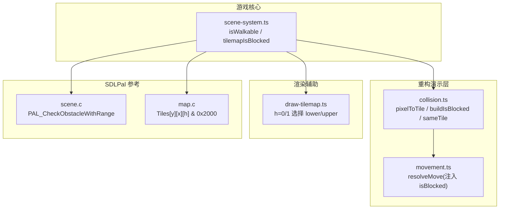
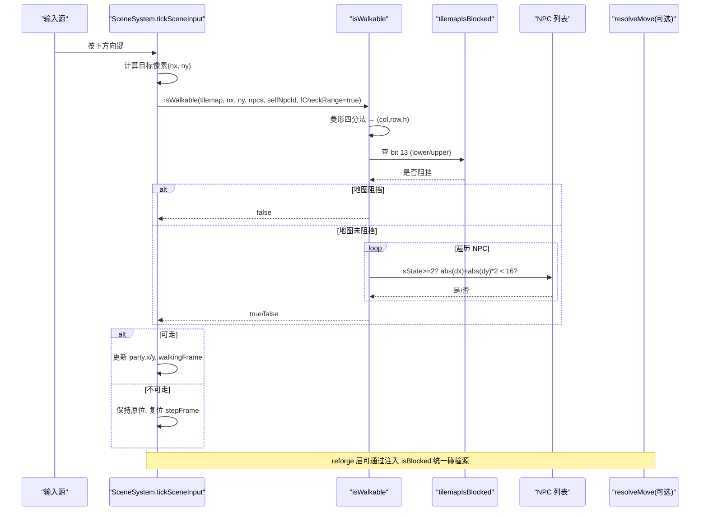
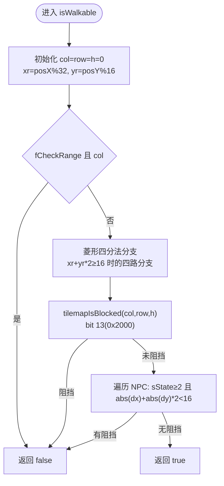
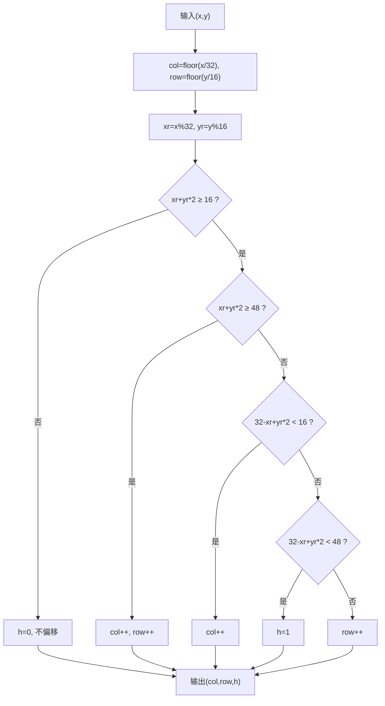
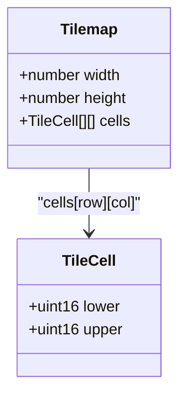
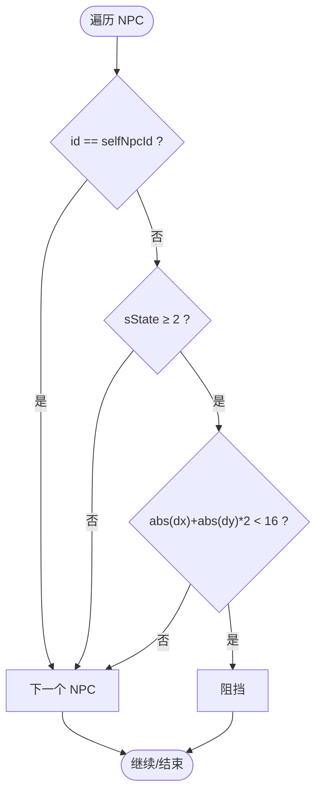
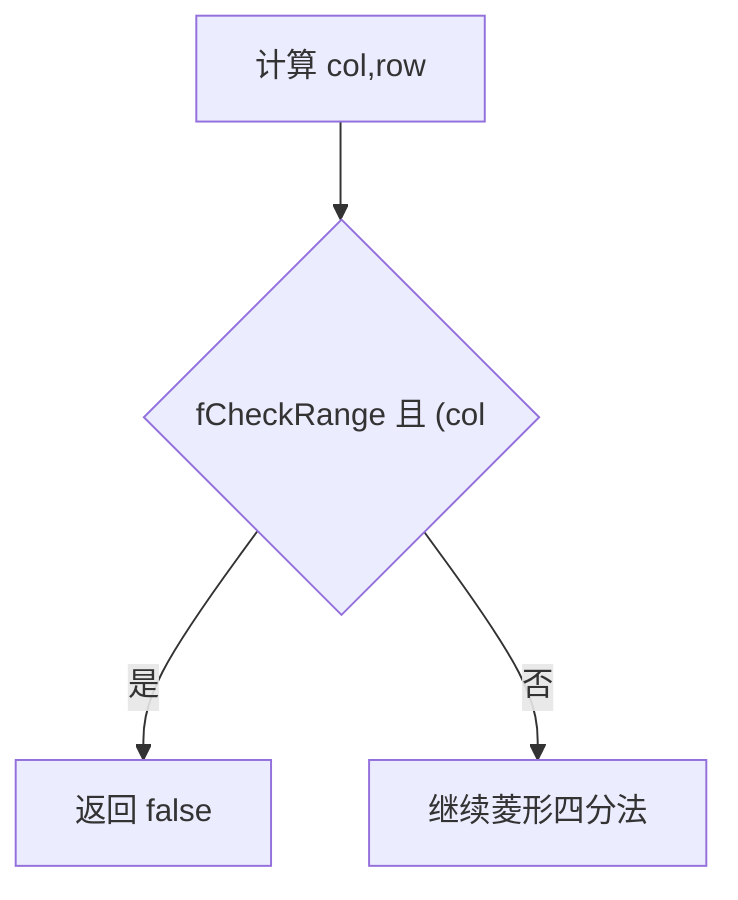
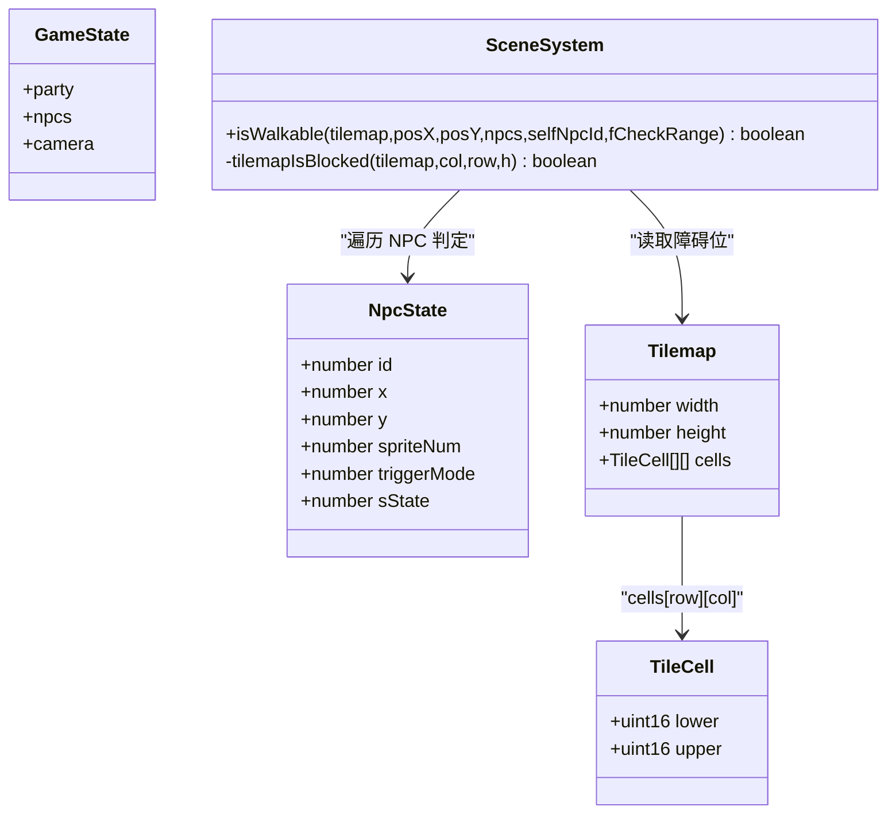
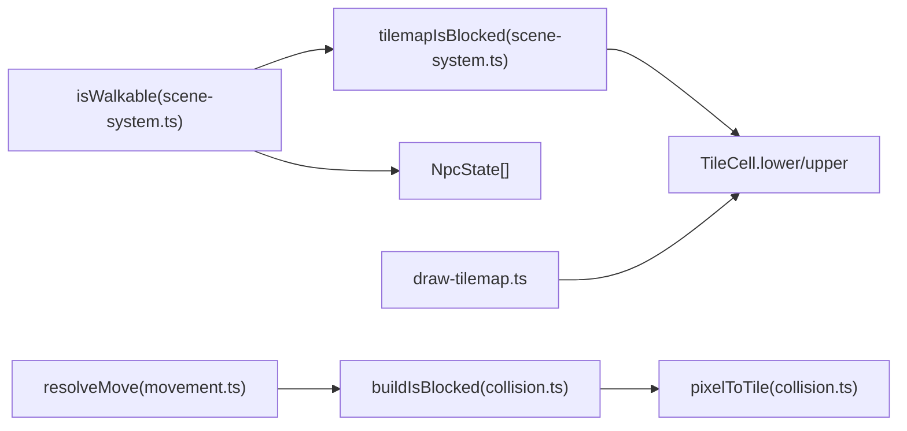

# 碰撞检测系统

<cite>
**本文引用的文件**   
- [packages/game/src/core/scene-system.ts](file://packages/game/src/core/scene-system.ts)
- [packages/reforge/src/collision.ts](file://packages/reforge/src/collision.ts)
- [reference/sdlpal/scene.c](file://reference/sdlpal/scene.c)
- [reference/sdlpal/map.c](file://reference/sdlpal/map.c)
- [packages/game/src/present/draw-tilemap.ts](file://packages/game/src/present/draw-tilemap.ts)
- [packages/reforge/src/movement.ts](file://packages/reforge/src/movement.ts)
- [packages/reforge/src/collision.test.ts](file://packages/reforge/src/collision.test.ts)
- [packages/game/src/core/scene-system.test.ts](file://packages/game/src/core/scene-system.test.ts)
</cite>

## 目录
1. [简介](#简介)
2. [项目结构](#项目结构)
3. [核心组件](#核心组件)
4. [架构总览](#架构总览)
5. [详细组件分析](#详细组件分析)
6. [依赖关系分析](#依赖关系分析)
7. [性能考量](#性能考量)
8. [故障排查指南](#故障排查指南)
9. [结论](#结论)
10. [附录](#附录)

## 简介
本文件系统性梳理 Type-Pal 的碰撞检测系统，聚焦 isWalkable 函数的核心算法与行为：菱形四分法坐标转换、tilemap obstacle bit 检测、NPC 阻挡判定；并解释等距视角下曼哈顿距离 dx + dy*2 的特殊权重处理；阐述 tilemap 障碍物位图结构与 lower/upper cell 的 bit 13 标志位含义；说明 NPC 阻挡逻辑（sState 状态值 Hidden/Normal/Blocker）及碰撞范围计算；解释 fCheckRange 参数的边界检查机制（blockX/blockY 下边界限制）。文末提供自定义碰撞规则的实现思路、特殊地形处理建议、性能优化策略与调试方法。

## 项目结构
Type-Pal 的碰撞检测由“游戏核心”与“重构演示层”共同实现，并与 SDLPal 参考实现严格对齐：
- 游戏核心：scene-system.ts 中的 isWalkable 与 tilemapIsBlocked，负责像素到格子的菱形映射、障碍位检测、NPC 阻挡判断以及 fCheckRange 边界控制。
- 重构演示层：collision.ts 提供 buildIsBlocked、sameTile、isBlockedAt、sameGrid 等纯函数，复用菱形四分法与 bit 13 检测，供 reforge 移动系统使用。
- SDLPal 参考：scene.c 的 PAL_CheckObstacleWithRange 与 map.c 的障碍位读取，作为行为真值来源。

图表来源
- [packages/game/src/core/scene-system.ts:371-425](file://packages/game/src/core/scene-system.ts#L371-L425)
- [packages/reforge/src/collision.ts:18-50](file://packages/reforge/src/collision.ts#L18-L50)
- [packages/reforge/src/movement.ts:20-31](file://packages/reforge/src/movement.ts#L20-L31)
- [packages/game/src/present/draw-tilemap.ts:295-329](file://packages/game/src/present/draw-tilemap.ts#L295-L329)
- [reference/sdlpal/scene.c:521-633](file://reference/sdlpal/scene.c#L521-L633)
- [reference/sdlpal/map.c:290-310](file://reference/sdlpal/map.c#L290-L310)

章节来源
- [packages/game/src/core/scene-system.ts:371-425](file://packages/game/src/core/scene-system.ts#L371-L425)
- [packages/reforge/src/collision.ts:18-50](file://packages/reforge/src/collision.ts#L18-L50)
- [reference/sdlpal/scene.c:521-633](file://reference/sdlpal/scene.c#L521-L633)
- [reference/sdlpal/map.c:290-310](file://reference/sdlpal/map.c#L290-L310)

## 核心组件
- isWalkable：入口函数，完成像素坐标 → 菱形四分法 → (col,row,h) 映射，随后进行 tilemap 障碍位检测与 NPC 阻挡判定，支持 fCheckRange 边界检查。
- tilemapIsBlocked：读取 TileCell 的 lower/upper 字段的 bit 13（0x2000），返回是否阻挡。
- pixelToTile/buildIsBlocked：在 reforge 中封装菱形四分法与 bit 13 检测，形成可注入的 isBlocked 闭包。
- resolveMove：基于注入的 isBlocked 执行“目标被挡即原地停”的移动语义。

章节来源
- [packages/game/src/core/scene-system.ts:348-425](file://packages/game/src/core/scene-system.ts#L348-L425)
- [packages/reforge/src/collision.ts:18-50](file://packages/reforge/src/collision.ts#L18-L50)
- [packages/reforge/src/movement.ts:20-31](file://packages/reforge/src/movement.ts#L20-L31)

## 架构总览
下图展示一次玩家尝试移动的完整调用链：输入方向 → 计算目标像素 → isWalkable 判定 → 若通过则更新位置，否则原地停留。

图表来源
- [packages/game/src/core/scene-system.ts:467-521](file://packages/game/src/core/scene-system.ts#L467-L521)
- [packages/game/src/core/scene-system.ts:371-425](file://packages/game/src/core/scene-system.ts#L371-L425)
- [packages/reforge/src/movement.ts:20-31](file://packages/reforge/src/movement.ts#L20-L31)

## 详细组件分析

### isWalkable 核心算法
- 菱形四分法坐标转换：将像素坐标按 TILE_W=32、TILE_H=16 划分，先取整得到基础 col/row，再根据残差 xr、yr 的四象限条件决定 col++/row++ 或 h=1。该逻辑直接对应 SDLPal scene.c 的分支序列。
- tilemap obstacle bit 检测：读取目标格 (col,row,h) 的 lower/upper 字段的 bit 13（0x2000），置位即为阻挡。
- NPC 阻挡判定：仅当 NPC 的 sState >= 2（Blocker）时参与阻挡；使用菱形曼哈顿距离 abs(dx) + abs(dy)*2 < 16 判定是否在碰撞范围内；selfNpcId 用于跳过自身。
- fCheckRange 边界检查：当传入 TRUE 时，在菱形调整前对 col/row 施加下界限制（BLOCK_X/BLOCK_Y），防止队首走入左上边缘带，保证镜头恒居中。

图表来源
- [packages/game/src/core/scene-system.ts:371-425](file://packages/game/src/core/scene-system.ts#L371-L425)
- [reference/sdlpal/scene.c:556-591](file://reference/sdlpal/scene.c#L556-L591)

章节来源
- [packages/game/src/core/scene-system.ts:371-425](file://packages/game/src/core/scene-system.ts#L371-L425)
- [reference/sdlpal/scene.c:556-591](file://reference/sdlpal/scene.c#L556-L591)

### 菱形四分法与曼哈顿距离
- 菱形四分法：以像素在 32×16 格子内的相对位置（xr, yr）为依据，依据 xr+yr*2 与 16/48 的比较，以及 32-xr+yr*2 与 16/48 的比较，决定 col/row 偏移或切换上层 h=1。
- 曼哈顿距离权重：在等距视角下，y 轴步长权重为 x 的两倍（dy*2），使碰撞区域呈现菱形，贴合视觉上的“斜向相邻”。

图表来源
- [packages/reforge/src/collision.ts:18-38](file://packages/reforge/src/collision.ts#L18-L38)
- [reference/sdlpal/scene.c:569-591](file://reference/sdlpal/scene.c#L569-L591)

章节来源
- [packages/reforge/src/collision.ts:18-38](file://packages/reforge/src/collision.ts#L18-L38)
- [reference/sdlpal/scene.c:569-591](file://reference/sdlpal/scene.c#L569-L591)

### tilemap 障碍物位图结构
- 数据结构：每个 TileCell 包含 lower 与 upper 两个 u16 字段，分别代表下层与上层瓦片数据。
- 障碍位：bit 13（0x2000）表示该格是否阻挡。h=0 查 lower，h=1 查 upper。
- 渲染一致性：渲染路径同样按 dh 选择 lower/upper，确保碰撞与可见性一致。

图表来源
- [packages/game/src/core/scene-system.ts:348-355](file://packages/game/src/core/scene-system.ts#L348-L355)
- [packages/game/src/present/draw-tilemap.ts:326-329](file://packages/game/src/present/draw-tilemap.ts#L326-L329)
- [reference/sdlpal/map.c:290-310](file://reference/sdlpal/map.c#L290-L310)

章节来源
- [packages/game/src/core/scene-system.ts:348-355](file://packages/game/src/core/scene-system.ts#L348-L355)
- [packages/game/src/present/draw-tilemap.ts:326-329](file://packages/game/src/present/draw-tilemap.ts#L326-L329)
- [reference/sdlpal/map.c:290-310](file://reference/sdlpal/map.c#L290-L310)

### NPC 阻挡逻辑与 sState 状态
- sState 含义：
  - Hidden（≤0）：隐藏，不参与阻挡与触发。
  - Normal（1）：可见但不阻挡（装饰物、地板家具等）。
  - Blocker（≥2）：可见且阻挡（墙、门、守卫等）。
- 碰撞范围：菱形曼哈顿距离 abs(dx) + abs(dy)*2 < 16。
- 自身豁免：selfNpcId 用于排除自身（如 NPC 移动时传自己 id）。

图表来源
- [packages/game/src/core/scene-system.ts:410-425](file://packages/game/src/core/scene-system.ts#L410-L425)
- [reference/sdlpal/scene.c:618-628](file://reference/sdlpal/scene.c#L618-L628)

章节来源
- [packages/game/src/core/scene-system.ts:410-425](file://packages/game/src/core/scene-system.ts#L410-L425)
- [reference/sdlpal/scene.c:618-628](file://reference/sdlpal/scene.c#L618-L628)

### fCheckRange 边界检查机制
- 目的：防止队首走入屏幕左上边缘带，保证 camera 始终居中。
- 阈值：BLOCK_X = PARTYOFFSET_X / 32，BLOCK_Y = PARTYOFFSET_Y / 16（例如 5/7）。
- 时机：在菱形调整之前对 col/row 做下界检查，若越界直接返回 false。

图表来源
- [packages/game/src/core/scene-system.ts:391-393](file://packages/game/src/core/scene-system.ts#L391-L393)
- [reference/sdlpal/scene.c:563-567](file://reference/sdlpal/scene.c#L563-L567)

章节来源
- [packages/game/src/core/scene-system.ts:391-393](file://packages/game/src/core/scene-system.ts#L391-L393)
- [reference/sdlpal/scene.c:563-567](file://reference/sdlpal/scene.c#L563-L567)

### 代码级类图（核心对象）

图表来源
- [packages/game/src/core/scene-system.ts:371-425](file://packages/game/src/core/scene-system.ts#L371-L425)
- [packages/game/src/core/scene-system.ts:348-355](file://packages/game/src/core/scene-system.ts#L348-L355)

章节来源
- [packages/game/src/core/scene-system.ts:371-425](file://packages/game/src/core/scene-system.ts#L371-L425)
- [packages/game/src/core/scene-system.ts:348-355](file://packages/game/src/core/scene-system.ts#L348-L355)

## 依赖关系分析
- isWalkable 依赖 tilemapIsBlocked 与 NPC 列表；后者依赖 NpcState 的 sState 与坐标。
- collision.ts 的 buildIsBlocked 复用 pixelToTile 与 bit 13 检测，供 movement.ts 的 resolveMove 注入使用。
- draw-tilemap.ts 的渲染路径与碰撞路径保持一致（dh 选择 lower/upper），避免可视与碰撞不一致。

图表来源
- [packages/game/src/core/scene-system.ts:371-425](file://packages/game/src/core/scene-system.ts#L371-L425)
- [packages/reforge/src/collision.ts:18-50](file://packages/reforge/src/collision.ts#L18-L50)
- [packages/reforge/src/movement.ts:20-31](file://packages/reforge/src/movement.ts#L20-L31)
- [packages/game/src/present/draw-tilemap.ts:326-329](file://packages/game/src/present/draw-tilemap.ts#L326-L329)

章节来源
- [packages/game/src/core/scene-system.ts:371-425](file://packages/game/src/core/scene-system.ts#L371-L425)
- [packages/reforge/src/collision.ts:18-50](file://packages/reforge/src/collision.ts#L18-L50)
- [packages/reforge/src/movement.ts:20-31](file://packages/reforge/src/movement.ts#L20-L31)
- [packages/game/src/present/draw-tilemap.ts:326-329](file://packages/game/src/present/draw-tilemap.ts#L326-L329)

## 性能考量
- 菱形四分法为常数时间 O(1)，主要开销在于 NPC 遍历。建议：
  - 对 NPC 列表按网格分桶或空间索引，减少每帧全量遍历。
  - 仅在靠近玩家时计算 NPC 阻挡（距离阈值预筛）。
- tilemapIsBlocked 为 O(1) 数组访问，注意边界检查短路。
- 批量场景下可将 isBlocked 闭包缓存，避免重复构建。

[本节为通用指导，无需源码引用]

## 故障排查指南
- 现象：玩家能穿过站着的 NPC。
  - 检查 NPC 的 sState 是否为 ≥2（Blocker）。
  - 确认碰撞范围公式是否为 abs(dx)+abs(dy)*2 < 16。
- 现象：走到地图左上角无法前进。
  - 检查 fCheckRange 是否启用，以及 BLOCK_X/BLOCK_Y 阈值是否正确。
- 现象：某些地形可穿或不可穿与预期不符。
  - 核对目标格的 lower/upper 是否设置了 bit 13（0x2000）。
  - 确认 h 的选择是否正确（菱形四分法分支）。
- 现象：contact 怪物误阻挡。
  - 确认 NPC 的 sState 是否 ≥2；triggerMode 不影响阻挡判定。

章节来源
- [packages/game/src/core/scene-system.ts:410-425](file://packages/game/src/core/scene-system.ts#L410-L425)
- [packages/game/src/core/scene-system.ts:391-393](file://packages/game/src/core/scene-system.ts#L391-L393)
- [packages/game/src/core/scene-system.ts:348-355](file://packages/game/src/core/scene-system.ts#L348-L355)
- [packages/reforge/src/collision.test.ts:13-32](file://packages/reforge/src/collision.test.ts#L13-L32)
- [packages/game/src/core/scene-system.test.ts:1339-1369](file://packages/game/src/core/scene-system.test.ts#L1339-L1369)

## 结论
Type-Pal 的碰撞检测以 SDLPal 为真值基准，采用菱形四分法与 bit 13 障碍位实现高效、一致的碰撞判定。isWalkable 将地图与 NPC 判定统一在一个流程中，并通过 fCheckRange 保障镜头与行走体验。reforge 层通过纯函数化接口进一步提升了可测试性与可扩展性。遵循本文规范可实现自定义碰撞规则与特殊地形处理，同时兼顾性能与稳定性。

[本节为总结，无需源码引用]

## 附录

### 自定义碰撞规则示例（思路）
- 扩展 isWalkable：在 tilemapIsBlocked 之后加入自定义地形层（如“沼泽减速”、“陷阱伤害”），通过额外布尔位或数值层标记。
- 注入式 isBlocked：在 reforge 中组合多个 isBlocked 源（tilemap、实体 collide、动态事件区），形成复合判定。
- 特殊地形：利用 h=1 上层格或独立碰撞层，区分“可站立但不可通行”的区域。

章节来源
- [packages/reforge/src/collision.ts:40-50](file://packages/reforge/src/collision.ts#L40-L50)
- [packages/reforge/src/movement.ts:20-31](file://packages/reforge/src/movement.ts#L20-L31)

### 关键 API 与常量速查
- 菱形四分法：pixelToTile（collision.ts）
- 障碍位检测：tilemapIsBlocked（scene-system.ts）、buildIsBlocked（collision.ts）
- 曼哈顿距离：abs(dx)+abs(dy)*2 < 16（scene-system.ts）
- 边界检查：fCheckRange + BLOCK_X/BLOCK_Y（scene-system.ts）
- 移动语义：resolveMove（movement.ts）

章节来源
- [packages/reforge/src/collision.ts:18-50](file://packages/reforge/src/collision.ts#L18-L50)
- [packages/game/src/core/scene-system.ts:371-425](file://packages/game/src/core/scene-system.ts#L371-L425)
- [packages/reforge/src/movement.ts:20-31](file://packages/reforge/src/movement.ts#L20-L31)