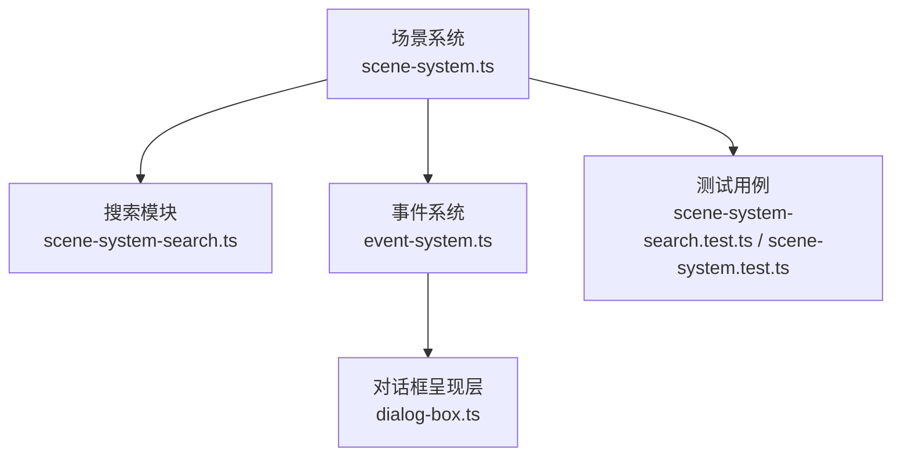
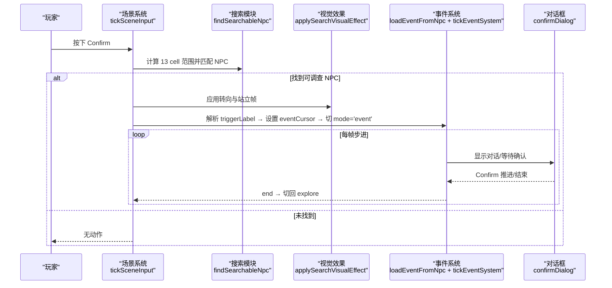
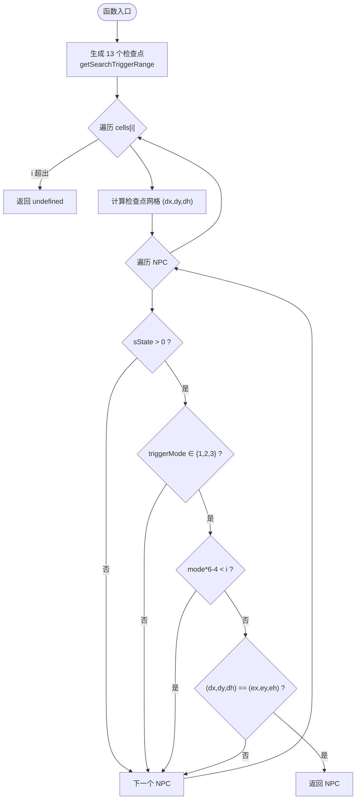
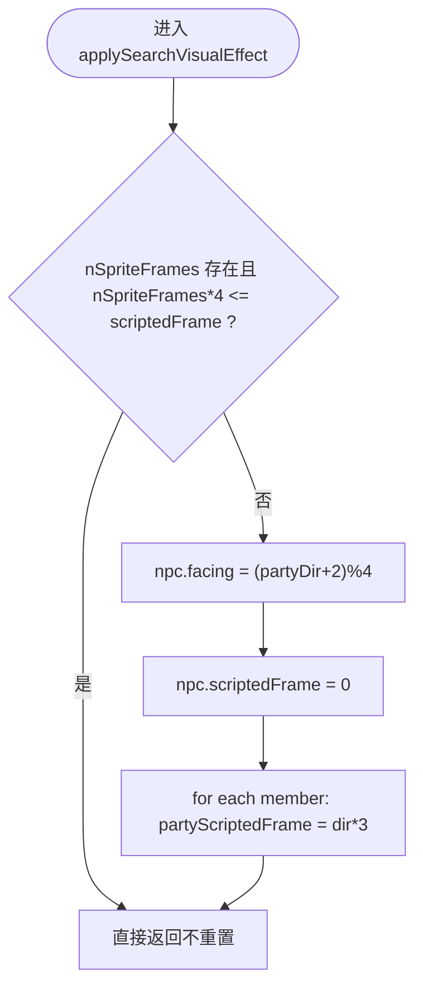
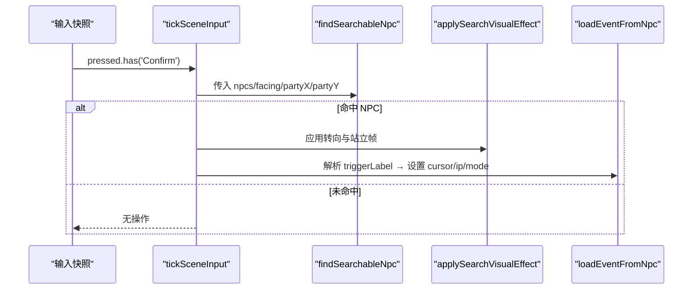
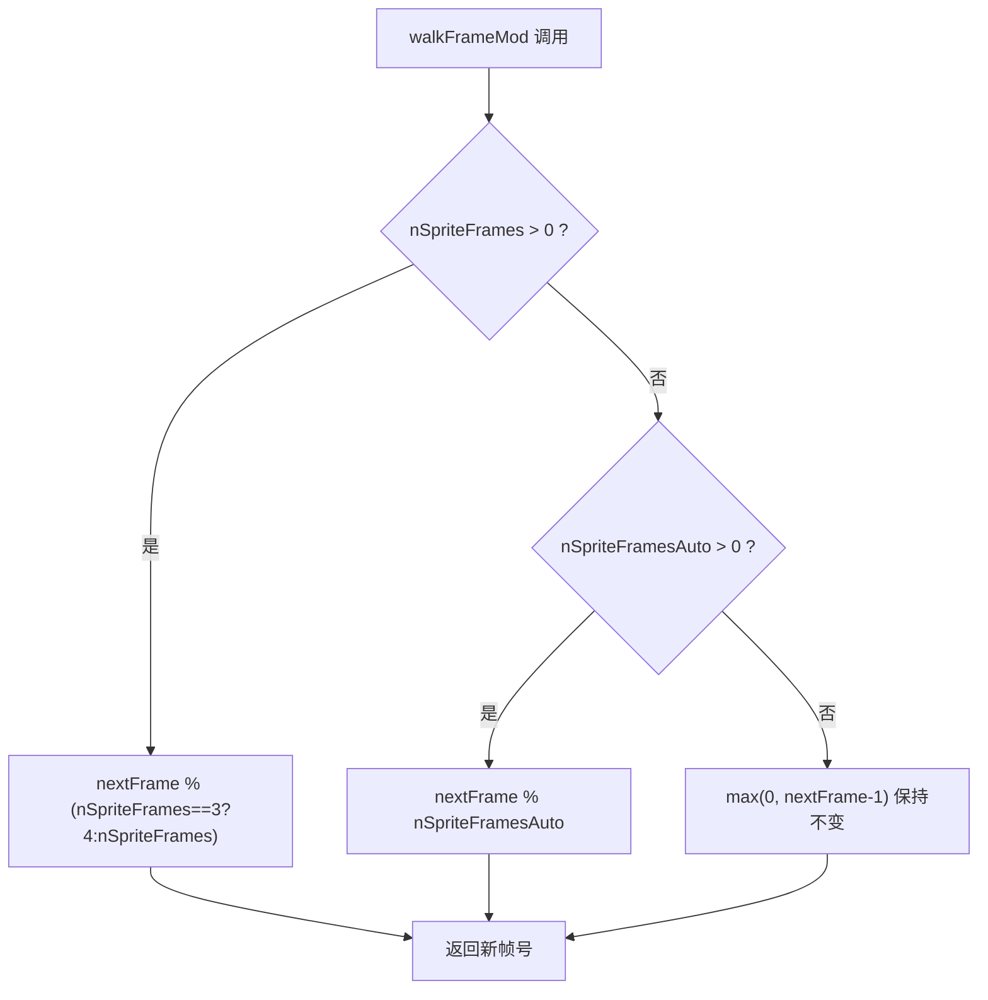
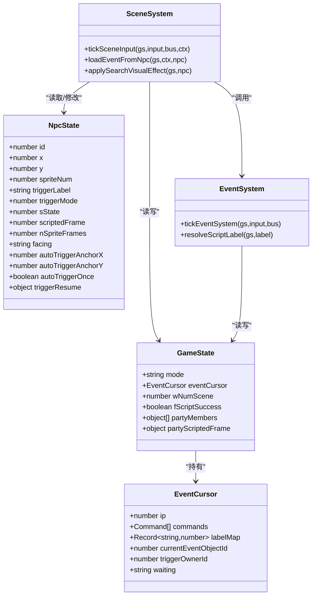
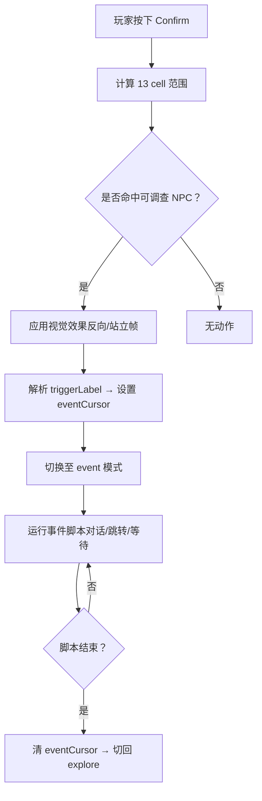
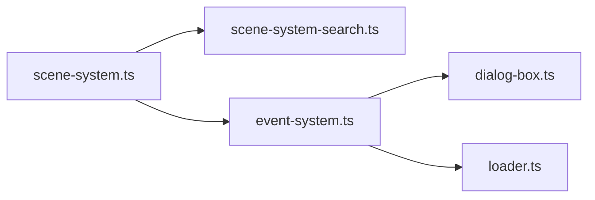

# 调查交互系统

<cite>
**本文引用的文件**
- [scene-system-search.ts](file://packages/game/src/core/scene-system-search.ts)
- [scene-system.ts](file://packages/game/src/core/scene-system.ts)
- [event-system.ts](file://packages/game/src/core/event-system.ts)
- [dialog-box.ts](file://packages/game/src/present/dialog-box.ts)
- [scene-system-search.test.ts](file://packages/game/src/core/scene-system-search.test.ts)
- [scene-system.test.ts](file://packages/game/src/core/scene-system.test.ts)
</cite>

## 目录
1. [简介](#简介)
2. [项目结构](#项目结构)
3. [核心组件](#核心组件)
4. [架构总览](#架构总览)
5. [详细组件分析](#详细组件分析)
6. [依赖关系分析](#依赖关系分析)
7. [性能考量](#性能考量)
8. [故障排查指南](#故障排查指南)
9. [结论](#结论)
10. [附录：扩展与示例](#附录扩展与示例)

## 简介
本文件为 Type-Pal 的“调查交互系统”技术文档，聚焦 Confirm 键触发的 NPC 调查流程。内容覆盖：
- findSearchableNpc 搜索算法（13 cell 范围、triggerMode 过滤、网格匹配）
- applySearchVisualEffect 视觉效果（NPC 反向站立帧复位、全队面向 NPC）
- Confirm 处理流程（输入检测、目标查找、事件加载）
- 视觉反馈机制（帧动画控制、姿态复位）
- 与事件系统的集成（triggerLabel 解析、event mode 切换）
- 扩展方法（添加可调查对象、自定义效果、扩展交互类型）
- 调试方法与用户体验优化建议

## 项目结构
调查交互相关代码位于 packages/game/src/core 下，关键文件如下：
- scene-system-search.ts：实现 13 cell 搜索范围与 findSearchableNpc 判定
- scene-system.ts：探索模式主循环、Confirm 触发、视觉效果、事件装载与模式切换
- event-system.ts：事件脚本步进器、opcode 处理、对话推进等
- dialog-box.ts：对话框状态机与 Confirm 行为

图表来源
- [scene-system.ts:1-661](file://packages/game/src/core/scene-system.ts#L1-L661)
- [scene-system-search.ts:1-93](file://packages/game/src/core/scene-system-search.ts#L1-L93)
- [event-system.ts:1-800](file://packages/game/src/core/event-system.ts#L1-L800)
- [dialog-box.ts:499-510](file://packages/game/src/present/dialog-box.ts#L499-L510)
- [scene-system-search.test.ts:1-89](file://packages/game/src/core/scene-system-search.test.ts#L1-L89)
- [scene-system.test.ts:257-578](file://packages/game/src/core/scene-system.test.ts#L257-L578)

章节来源
- [scene-system.ts:1-661](file://packages/game/src/core/scene-system.ts#L1-L661)
- [scene-system-search.ts:1-93](file://packages/game/src/core/scene-system-search.ts#L1-L93)
- [event-system.ts:1-800](file://packages/game/src/core/event-system.ts#L1-L800)
- [dialog-box.ts:499-510](file://packages/game/src/present/dialog-box.ts#L499-L510)
- [scene-system-search.test.ts:1-89](file://packages/game/src/core/scene-system-search.test.ts#L1-L89)
- [scene-system.test.ts:257-578](file://packages/game/src/core/scene-system.test.ts#L257-L578)

## 核心组件
- 搜索模块
  - getSearchTriggerRange：根据队伍朝向生成 13 个检查点（rgPos[0] 为队伍位置，随后按 xOffset/yOffset 四排扩散）
  - findSearchableNpc：遍历 13 cell × 场景 NPC，执行 sState、triggerMode、距离阈值与网格匹配，返回首个命中 NPC
- 场景系统
  - tickSceneInput：读取输入、移动、相机跟随、菜单快捷键、Confirm 触发 Search
  - applySearchVisualEffect：命中后设置 NPC 反向站立帧、全队面向 NPC 的站立帧
  - loadEventFromNpc：基于 triggerLabel 或 triggerResume 解析全局 ip，设置 eventCursor 并切换到 event 模式
- 事件系统
  - tickEventSystem：协程式步进器，处理 showDialog、等待键、goto/end 等
  - confirmDialog：Confirm 在对话框中的语义（跳行、翻页、结束）

章节来源
- [scene-system-search.ts:35-92](file://packages/game/src/core/scene-system-search.ts#L35-L92)
- [scene-system.ts:153-178](file://packages/game/src/core/scene-system.ts#L153-L178)
- [scene-system.ts:301-339](file://packages/game/src/core/scene-system.ts#L301-L339)
- [scene-system.ts:554-564](file://packages/game/src/core/scene-system.ts#L554-L564)
- [event-system.ts:1-25](file://packages/game/src/core/event-system.ts#L1-L25)
- [dialog-box.ts:499-510](file://packages/game/src/present/dialog-box.ts#L499-L510)

## 架构总览
下图展示从 Confirm 按下到事件启动的完整调用链与数据流。

图表来源
- [scene-system.ts:554-564](file://packages/game/src/core/scene-system.ts#L554-L564)
- [scene-system-search.ts:65-92](file://packages/game/src/core/scene-system-search.ts#L65-L92)
- [scene-system.ts:153-178](file://packages/game/src/core/scene-system.ts#L153-L178)
- [scene-system.ts:301-339](file://packages/game/src/core/scene-system.ts#L301-L339)
- [event-system.ts:1-25](file://packages/game/src/core/event-system.ts#L1-L25)
- [dialog-box.ts:499-510](file://packages/game/src/present/dialog-box.ts#L499-L510)

## 详细组件分析

### 搜索算法：findSearchableNpc
- 13 cell 范围生成
  - 以队伍像素坐标为起点，按朝向决定 xOffset/yOffset，生成 13 个检查点（rgPos[0..12]），用于后续网格匹配
- 过滤条件
  - sState <= 0：隐藏/消失对象不参与
  - triggerMode 仅允许 1..3（Near/Normal/Far），0 为装饰，4..8 为自动触发区（由另一路径处理）
  - 距离阈值：mode * 6 - 4 < i 时跳过，即 mode 越大允许的 i 越大（远触发更宽松）
- 网格匹配
  - 将像素坐标转换为 (col, row, h)，其中 col = floor(x/32), row = floor(y/16), h = (x%32 ? 1 : 0)
  - 若检查点与 NPC 的 (col,row,h) 完全一致，则命中并返回该 NPC

图表来源
- [scene-system-search.ts:35-92](file://packages/game/src/core/scene-system-search.ts#L35-L92)

章节来源
- [scene-system-search.ts:35-92](file://packages/game/src/core/scene-system-search.ts#L35-L92)
- [scene-system-search.test.ts:9-88](file://packages/game/src/core/scene-system-search.test.ts#L9-L88)

### 视觉效果：applySearchVisualEffect
- NPC 转向与帧复位
  - 若 NPC 有方向性精灵帧且已处于非站立阶段，则调整其朝向为队伍反方向，并将 scriptedFrame 置 0（站立帧）
- 全队面向 NPC
  - 将队伍成员全部设为面向 NPC 的站立帧（通过 partyScriptedFrame 覆盖 stepFrame）
- 兼容旧 fixture
  - nSpriteFrames 为 undefined 时保留旧行为（会调整姿势）

图表来源
- [scene-system.ts:153-178](file://packages/game/src/core/scene-system.ts#L153-L178)

章节来源
- [scene-system.ts:153-178](file://packages/game/src/core/scene-system.ts#L153-L178)

### Confirm 键处理流程
- 输入检测
  - 在 tickSceneInput 中，当 gs.mode === 'explore' 且 input.pressed.has('Confirm') 时进入调查分支
- 目标查找
  - 调用 findSearchableNpc 使用当前队伍 facing 与位置进行 13 cell 搜索
- 事件加载
  - 若找到 NPC 且具备 triggerLabel，先应用视觉效果，再调用 loadEventFromNpc 解析 label → 设置 eventCursor → 切换 gs.mode = 'event'

图表来源
- [scene-system.ts:554-564](file://packages/game/src/core/scene-system.ts#L554-L564)
- [scene-system-search.ts:65-92](file://packages/game/src/core/scene-system-search.ts#L65-L92)
- [scene-system.ts:301-339](file://packages/game/src/core/scene-system.ts#L301-L339)

章节来源
- [scene-system.ts:554-564](file://packages/game/src/core/scene-system.ts#L554-L564)
- [scene-system-search.ts:65-92](file://packages/game/src/core/scene-system-search.ts#L65-L92)
- [scene-system.ts:301-339](file://packages/game/src/core/scene-system.ts#L301-L339)

### 视觉反馈机制：帧动画控制与姿态复位
- 帧动画控制
  - walkFrameMod 依据 nSpriteFrames/nSpriteFramesAuto 推进帧号；当两者均为 0 时保持当前帧不变（避免预设姿势被清零）
- 姿态复位
  - 自动触发区（triggerMode >= 4）命中后，若有方向性精灵帧，则将 NPC 朝向队伍并置 scriptedFrame=0；同时走路帧相位复位，避免主角卡在迈步帧

图表来源
- [event-system.ts:480-491](file://packages/game/src/core/event-system.ts#L480-L491)
- [scene-system.ts:232-266](file://packages/game/src/core/scene-system.ts#L232-L266)

章节来源
- [event-system.ts:480-491](file://packages/game/src/core/event-system.ts#L480-L491)
- [scene-system.ts:232-266](file://packages/game/src/core/scene-system.ts#L232-L266)

### 与事件系统的集成：triggerLabel 解析与 event mode 切换
- triggerLabel 解析
  - 优先使用 npc.triggerResume（上次 advance/reset 后的续跑位置）；否则按 triggerLabel 在全局 labelMap 中解析得到全局 ip
- 事件装载
  - 设置 gs.eventCursor.ip、currentEventObjectId、triggerOwnerId，并将 gs.mode 切换为 'event'
- 事件步进
  - tickEventSystem 单 tick 内连跑非阻塞命令，遇到等待（如对话框）则挂起 waiting，待 Confirm 推进或结束

图表来源
- [scene-system.ts:301-339](file://packages/game/src/core/scene-system.ts#L301-L339)
- [event-system.ts:1-25](file://packages/game/src/core/event-system.ts#L1-L25)

章节来源
- [scene-system.ts:301-339](file://packages/game/src/core/scene-system.ts#L301-L339)
- [event-system.ts:1-25](file://packages/game/src/core/event-system.ts#L1-L25)

### 概念性概览
以下为调查交互的高层工作流示意（不绑定具体源码）：

## 依赖关系分析
- 模块耦合
  - scene-system.ts 依赖 scene-system-search.ts 提供搜索能力
  - scene-system.ts 依赖 event-system.ts 提供事件脚本执行
  - event-system.ts 依赖 dialog-box.ts 管理对话框状态
- 外部依赖
  - 全局脚本数组与 labelMap 由 bootstrap 注入，供 resolveScriptLabel 使用
  - 资源加载（tilemap、事件命令、labelMap）由 loader.ts 提供

图表来源
- [scene-system.ts:1-661](file://packages/game/src/core/scene-system.ts#L1-L661)
- [scene-system-search.ts:1-93](file://packages/game/src/core/scene-system-search.ts#L1-L93)
- [event-system.ts:1-800](file://packages/game/src/core/event-system.ts#L1-L800)
- [dialog-box.ts:499-510](file://packages/game/src/present/dialog-box.ts#L499-L510)

章节来源
- [scene-system.ts:1-661](file://packages/game/src/core/scene-system.ts#L1-L661)
- [scene-system-search.ts:1-93](file://packages/game/src/core/scene-system-search.ts#L1-L93)
- [event-system.ts:1-800](file://packages/game/src/core/event-system.ts#L1-L800)
- [dialog-box.ts:499-510](file://packages/game/src/present/dialog-box.ts#L499-L510)

## 性能考量
- 搜索复杂度
  - 13 cell 固定规模，逐格扫描 NPC 列表，时间复杂度 O(13×N) ≈ O(N)，N 为场景 NPC 数量
- 网格转换
  - 使用整除与取模快速映射像素到网格，常数开销小
- 视觉效果
  - 仅在命中时更新少量状态字段，避免全量重绘
- 事件步进
  - 单 tick 内连跑非阻塞命令，遇等待挂起，避免长阻塞影响帧率

## 故障排查指南
- Confirm 无反应
  - 检查 gs.mode 是否为 'explore'
  - 确认 input.pressed 包含 'Confirm'
  - 验证 findSearchableNpc 是否返回 NPC（查看 sState、triggerMode、grid 匹配）
- 命中但未进入事件
  - 检查 NPC 是否具备 triggerLabel
  - 确认全局 labelMap 中存在对应 label（或 triggerResume 有效）
  - 观察 loadEventFromNpc 是否成功设置 eventCursor 并切换 mode
- 视觉效果异常
  - 检查 NPC 的 nSpriteFrames 与 scriptedFrame 是否符合预期
  - 确认 applySearchVisualEffect 是否被调用（命中后立即执行）
- 对话框推进问题
  - 确认 confirmDialog 返回值（skip-typing/page-advance/dialog-end/noop）
  - 检查 tickEventSystem 的 waiting 状态是否正确释放

章节来源
- [scene-system.ts:554-564](file://packages/game/src/core/scene-system.ts#L554-L564)
- [scene-system.ts:301-339](file://packages/game/src/core/scene-system.ts#L301-L339)
- [scene-system-search.ts:65-92](file://packages/game/src/core/scene-system-search.ts#L65-L92)
- [dialog-box.ts:499-510](file://packages/game/src/present/dialog-box.ts#L499-L510)

## 结论
Type-Pal 的调查交互系统以 SDLPal 真值为基准，实现了精确的 13 cell 搜索、严格的 triggerMode 过滤与网格匹配，并在命中后提供一致的视觉反馈与事件驱动流程。通过全局脚本数组与 labelMap 的统一解析，系统在跨场景与多触发路径下保持一致性与可扩展性。

## 附录：扩展与示例

### 如何添加可调查对象
- 在场景中放置 NPC，并确保：
  - sState > 0（可见）
  - triggerMode ∈ {1,2,3}（Near/Normal/Far）
  - 配置 triggerLabel 指向全局脚本 entry
- 验证：
  - 使用单元测试思路构造 NPC 与队伍位置，断言 findSearchableNpc 命中

章节来源
- [scene-system-search.test.ts:33-88](file://packages/game/src/core/scene-system-search.test.ts#L33-L88)
- [scene-system.test.ts:257-286](file://packages/game/src/core/scene-system.test.ts#L257-L286)

### 自定义调查效果
- 在 applySearchVisualEffect 基础上扩展：
  - 增加音效播放（通过事件系统 OP_PLAY_SOUND）
  - 附加屏幕特效（OP_WAVE_SCREEN、OP_COLOR_FADE 等）
  - 改变 NPC 姿态（OP_SET_EVENT_OBJECT_DIR_AND_FRAME）
- 注意：
  - 仅在命中后调用，避免重复刷新
  - 确保与 walkingFrame 相位协调，避免帧闪烁

章节来源
- [scene-system.ts:153-178](file://packages/game/src/core/scene-system.ts#L153-L178)
- [event-system.ts:110-264](file://packages/game/src/core/event-system.ts#L110-L264)

### 扩展交互类型
- 新增 triggerMode 含义（例如 9=特殊调查）：
  - 在 findSearchableNpc 中添加过滤逻辑
  - 在 tickSceneInput 中区分处理（可选不同视觉效果或前置条件）
- 扩展 Confirm 行为：
  - 在 tickSceneInput 的 Confirm 分支中加入额外判断（如装备要求、剧情标志）

章节来源
- [scene-system-search.ts:65-92](file://packages/game/src/core/scene-system-search.ts#L65-L92)
- [scene-system.ts:554-564](file://packages/game/src/core/scene-system.ts#L554-L564)

### 调试方法
- 打印搜索范围
  - 在 getSearchTriggerRange 输出 13 个检查点坐标，核对与队伍朝向一致性
- 断点命中路径
  - 在 findSearchableNpc 的过滤与网格匹配处断点，观察 sState、triggerMode、i 与 grid 值
- 事件脚本追踪
  - 在 loadEventFromNpc 设置断点，确认 triggerLabel 解析结果与 eventCursor 初始化
- 对话框推进
  - 在 confirmDialog 与 tickEventSystem 的 waiting 分支插入日志，确认 Confirm 语义

章节来源
- [scene-system-search.ts:35-92](file://packages/game/src/core/scene-system-search.ts#L35-L92)
- [scene-system.ts:301-339](file://packages/game/src/core/scene-system.ts#L301-L339)
- [dialog-box.ts:499-510](file://packages/game/src/present/dialog-box.ts#L499-L510)

### 用户体验优化建议
- 明确提示
  - 对可调查 NPC 增加视觉标记（如高亮边框），降低寻找成本
- 响应及时
  - 确保 Confirm 命中后视觉效果即时生效，避免延迟感
- 容错友好
  - 对 triggerLabel 缺失或 labelMap 未命中给出警告但不崩溃，便于开发期定位
- 动画连贯
  - 合理设置 walkingFrame 相位复位，避免角色卡顿或跳跃