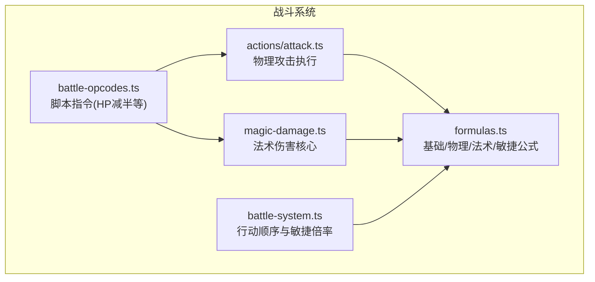
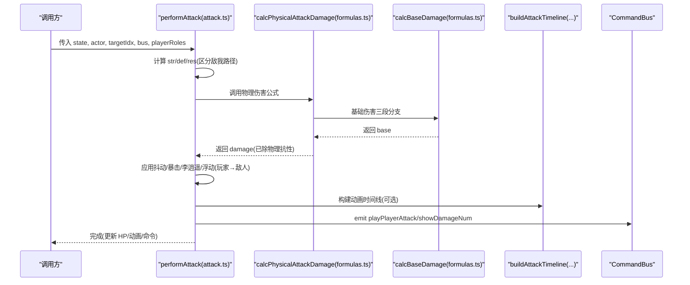
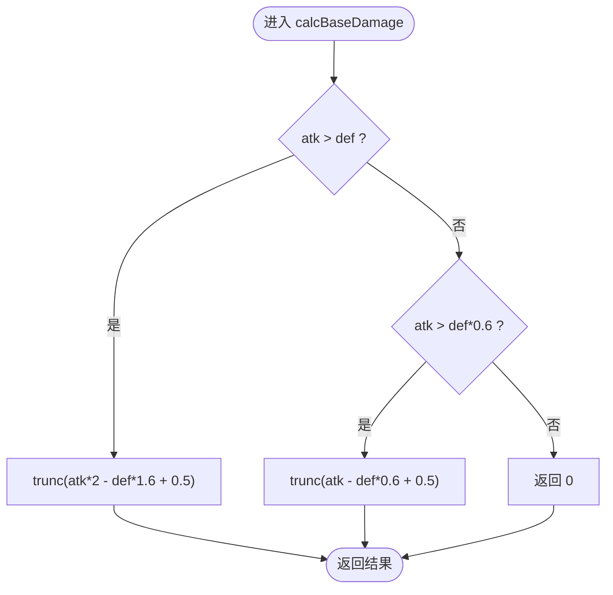
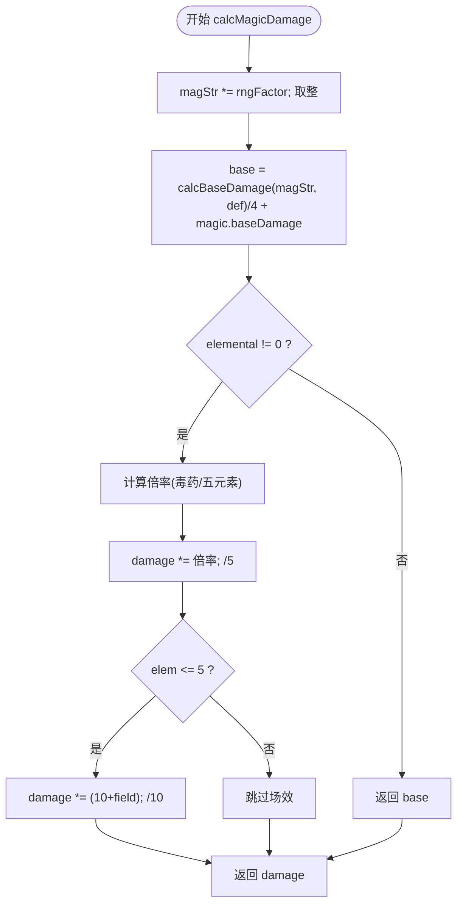
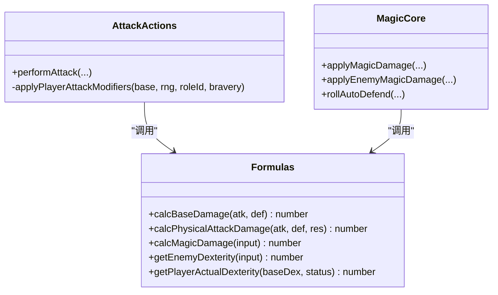
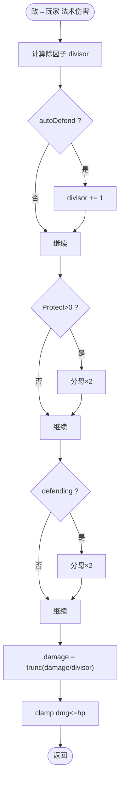
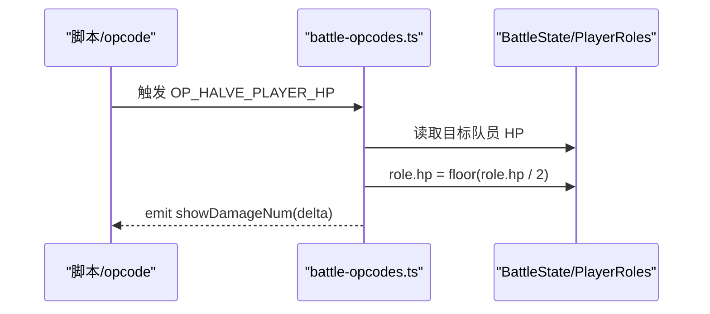
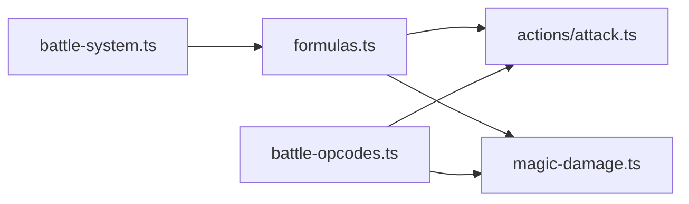

# 伤害计算公式

<cite>
**本文引用的文件列表**
- [formulas.ts](file://packages/game/src/core/battle/formulas.ts)
- [magic-damage.ts](file://packages/game/src/core/battle/magic-damage.ts)
- [attack.ts](file://packages/game/src/core/battle/actions/attack.ts)
- [battle-system.ts](file://packages/game/src/core/battle/battle-system.ts)
- [battle-opcodes.ts](file://packages/game/src/core/battle/battle-opcodes.ts)
- [actions.test.ts](file://packages/game/src/core/battle/__tests__/actions.test.ts)
- [formulas.test.ts](file://packages/game/src/core/battle/__tests__/formulas.test.ts)
</cite>

## 目录
1. [简介](#简介)
2. [项目结构](#项目结构)
3. [核心组件](#核心组件)
4. [架构总览](#架构总览)
5. [详细组件分析](#详细组件分析)
6. [依赖关系分析](#依赖关系分析)
7. [性能与数值平衡](#性能与数值平衡)
8. [故障排查指南](#故障排查指南)
9. [结论](#结论)
10. [附录：扩展与测试](#附录扩展与测试)

## 简介
本文件系统性梳理 Type-Pal 战斗系统中的伤害计算模型，覆盖基础伤害、元素抗性、暴击与命中率（敏捷值）、防御姿态与护盾叠加、以及特殊伤害类型处理。文档以源码为唯一依据，提供代码级流程图与时序图，并给出扩展新伤害公式与自定义伤害类型的实践路径与测试用例设计建议。

## 项目结构
与伤害计算直接相关的核心模块位于 packages/game/src/core/battle 下：
- formulas.ts：纯函数实现的基础伤害、物理伤害、法术伤害、敏捷值等核心公式
- magic-damage.ts：敌→玩家与玩家→敌人的法术伤害共享核心，含 auto-defend、除因子、抗性与战场加成
- actions/attack.ts：物理攻击执行流程，含单体/群攻、暴击、抖动、守护替挡、动画时间线
- battle-system.ts：回合顺序与行动类型对敏捷值的倍率修正
- battle-opcodes.ts：脚本指令（如 HP 减半）等“即死/百分比”类效果入口
- 单元测试：actions.test.ts、formulas.test.ts 用于验证真值一致性

图表来源
- [attack.ts:1-19](file://packages/game/src/core/battle/actions/attack.ts#L1-L19)
- [magic-damage.ts:1-48](file://packages/game/src/core/battle/magic-damage.ts#L1-L48)
- [formulas.ts:1-16](file://packages/game/src/core/battle/formulas.ts#L1-L16)
- [battle-system.ts:826-839](file://packages/game/src/core/battle/battle-system.ts#L826-L839)
- [battle-opcodes.ts:940-958](file://packages/game/src/core/battle/battle-opcodes.ts#L940-L958)

章节来源
- [attack.ts:1-19](file://packages/game/src/core/battle/actions/attack.ts#L1-L19)
- [magic-damage.ts:1-48](file://packages/game/src/core/battle/magic-damage.ts#L1-L48)
- [formulas.ts:1-16](file://packages/game/src/core/battle/formulas.ts#L1-L16)
- [battle-system.ts:826-839](file://packages/game/src/core/battle/battle-system.ts#L826-L839)
- [battle-opcodes.ts:940-958](file://packages/game/src/core/battle/battle-opcodes.ts#L940-L958)

## 核心组件
- 基础伤害 calcBaseDamage：按 atk vs def 三段分支计算，SHORT 截断语义
- 物理伤害 calcPhysicalAttackDamage：在基础伤害基础上应用物理抗性
- 法术伤害 calcMagicDamage：引入魔法强度、防御、元素/毒抗、战场加成、随机浮动
- 敏捷值 getEnemyDexterity / getPlayerActualDexterity：影响行动顺序；haste 在 PAL_CLASSIC 路径下 ×3，上限 999
- 法术伤害应用 applyMagicDamage / applyEnemyMagicDamage：统一计算骨架，差异在于 magStr 来源、minDamage 钳制、resistMult、除因子与 clamp 策略
- 物理攻击 performAttack：单体/群攻、暴击、抖动、守护替挡、动画时间线

章节来源
- [formulas.ts:23-60](file://packages/game/src/core/battle/formulas.ts#L23-L60)
- [formulas.ts:62-158](file://packages/game/src/core/battle/formulas.ts#L62-L158)
- [formulas.ts:160-217](file://packages/game/src/core/battle/formulas.ts#L160-L217)
- [magic-damage.ts:50-124](file://packages/game/src/core/battle/magic-damage.ts#L50-L124)
- [magic-damage.ts:195-270](file://packages/game/src/core/battle/magic-damage.ts#L195-L270)
- [attack.ts:67-101](file://packages/game/src/core/battle/actions/attack.ts#L67-L101)
- [attack.ts:112-297](file://packages/game/src/core/battle/actions/attack.ts#L112-L297)

## 架构总览
下图展示一次完整物理攻击从输入到伤害落地的调用链与关键分支。

图表来源
- [attack.ts:112-297](file://packages/game/src/core/battle/actions/attack.ts#L112-L297)
- [formulas.ts:23-60](file://packages/game/src/core/battle/formulas.ts#L23-L60)

## 详细组件分析

### 基础伤害模型（攻击力、防御力、等级差值、随机因子）
- 基础伤害 calcBaseDamage：
  - 三段分支：atk > def → trunc(atk*2 - def*1.6 + 0.5)；else if atk > def*0.6 → trunc(atk - def*0.6 + 0.5)；否则 0
  - 使用 SHORT 截断语义，保证与 sdlpal 一致
- 物理伤害 calcPhysicalAttackDamage：
  - 在基础伤害基础上除以物理抗性（resist=0 不除）
- 等级项差异：
  - 玩家→敌人：str = role.attackStrength（不含 level 项），def = enemy.wDefense + (enemy.level+6)*4
  - 敌人→玩家：str = enemy.wAttackStrength + (enemy.level+6)*6，def = role.defense（不含 level 项），且若 defending 则 def×2
- 随机因子：
  - 玩家→敌人单体：damage += RandomLong(1,2)，末乘 RandomFloat(1,1.125)
  - 敌人→玩家：str 内加 RandomLong(0,2)，damage 再加 RandomLong(0,1)
  - 法术：magStr 乘以 RandomFloat(10,11)/10（由 rngFactor 注入）

图表来源
- [formulas.ts:23-44](file://packages/game/src/core/battle/formulas.ts#L23-L44)

章节来源
- [formulas.ts:23-60](file://packages/game/src/core/battle/formulas.ts#L23-L60)
- [attack.ts:126-142](file://packages/game/src/core/battle/actions/attack.ts#L126-L142)
- [attack.ts:358-374](file://packages/game/src/core/battle/actions/attack.ts#L358-L374)
- [formulas.test.ts:15-44](file://packages/game/src/core/battle/__tests__/formulas.test.ts#L15-L44)

### 元素抗性系统与魔法属性克制
- 法术伤害 calcMagicDamage：
  - 先按 magStr 与 def 计算基础，再除以 4，加上 magic.baseDamage
  - 若 elemental != 0：
    - 毒药（elemental > 5）：倍率 = 10 - poisonRes / resistMult
    - 五元素（1..5）：倍率 = 10 - elemRes[elem-1] / resistMult
    - 随后 damage *= 倍率，再 /5
    - 仅五元素受 fieldEffect 修正：damage *= (10 + fieldEffect[elem-1])，再 /10
- 玩家→敌人：wResistanceMultiplier = 1
- 敌人→玩家：wResistanceMultiplier = 20，且玩家抗性被 clamp 到 100 以内，避免负伤回血
- 战场加成 fieldEffect：每个元素 -10..+10，可放大或削弱对应元素伤害

图表来源
- [formulas.ts:88-158](file://packages/game/src/core/battle/formulas.ts#L88-L158)
- [magic-damage.ts:245-254](file://packages/game/src/core/battle/magic-damage.ts#L245-L254)

章节来源
- [formulas.ts:62-158](file://packages/game/src/core/battle/formulas.ts#L62-L158)
- [magic-damage.ts:227-254](file://packages/game/src/core/battle/magic-damage.ts#L227-L254)
- [formulas.test.ts:67-208](file://packages/game/src/core/battle/__tests__/formulas.test.ts#L67-L208)

### 暴击系统与命中率（敏捷值的影响）
- 暴击（玩家→敌人单体）：
  - 每击摇一次：RandomLong(0,5)==0 或 bravery>0 → ×3
  - 角色 0（李逍遥）额外：RandomLong(0,11)==0 → ×2（可与普通暴击叠加）
  - 群攻：每 sweep 独立摇一次暴击，全敌同次判定
- 命中率（被动闪避/守护替挡）：
  - 敌人→玩家物理：fAutoDefend = RandomLong(0,16)>=10（7/17）命中即整次免伤
  - 守护替挡 cover：目标处于坏状态/濒死且 fAutoDefend 命中时，查找 coveredBy 健康队友替挡；若替挡者自身坏状态/濒死则无效，强制挨打
- 敏捷值（dexterity）：
  - 影响行动顺序：getEnemyDexterity = (level+6)*3 + (SHORT)dexterity
  - getPlayerActualDexterity（PAL_CLASSIC）：haste → dex×3，上限 999
  - 行动类型倍率：防御 ×5，逃跑 ×0.5（奇数 dex 时 floor），濒死 ÷2，末尾 jitter ×RandomFloat(0.9,1.1)

图表来源
- [formulas.ts:160-217](file://packages/game/src/core/battle/formulas.ts#L160-L217)
- [attack.ts:67-101](file://packages/game/src/core/battle/actions/attack.ts#L67-L101)
- [magic-damage.ts:170-193](file://packages/game/src/core/battle/magic-damage.ts#L170-L193)
- [battle-system.ts:826-839](file://packages/game/src/core/battle/battle-system.ts#L826-L839)

章节来源
- [attack.ts:67-101](file://packages/game/src/core/battle/actions/attack.ts#L67-L101)
- [attack.ts:308-336](file://packages/game/src/core/battle/actions/attack.ts#L308-L336)
- [formulas.ts:160-217](file://packages/game/src/core/battle/formulas.ts#L160-L217)
- [battle-system.ts:826-839](file://packages/game/src/core/battle/battle-system.ts#L826-L839)
- [actions.test.ts:602-635](file://packages/game/src/core/battle/__tests__/actions.test.ts#L602-L635)

### 防御姿态的伤害减免与护盾叠加
- 物理（敌人→玩家）：
  - defending → def×2
  - Protect 状态 → damage/=2
  - fAutoDefend 命中 → 整次免伤（含替挡）
- 法术（敌人→玩家）：
  - 除因子 divisor = ((defending?2:1)*(Protect>0?2:1)) + (autoDefend?1:0)
  - autoDefend：sleep==0 && paralyzed==0 && confused==0 且 RandomLong(0,2)==0
  - 最终 damage = Math.trunc(dmg / divisor)
- 玩家→敌人：
  - 无上述除因子机制；但存在抖动、暴击、浮动等修饰

图表来源
- [magic-damage.ts:256-269](file://packages/game/src/core/battle/magic-damage.ts#L256-L269)
- [attack.ts:358-374](file://packages/game/src/core/battle/actions/attack.ts#L358-L374)

章节来源
- [magic-damage.ts:256-269](file://packages/game/src/core/battle/magic-damage.ts#L256-L269)
- [attack.ts:358-374](file://packages/game/src/core/battle/actions/attack.ts#L358-L374)

### 特殊伤害类型（即死攻击、百分比伤害）
- 即死/百分比伤害通过脚本指令实现：
  - OP_HALVE_PLAYER_HP：将目标队员 HP 折半（floor），并显示掉血数字
  - 该指令可用于“即死”或“百分比扣血”的玩法表达
- 注意：此非传统“固定伤害类型”，而是通过脚本在合适时机修改 HP 达成

图表来源
- [battle-opcodes.ts:940-958](file://packages/game/src/core/battle/battle-opcodes.ts#L940-L958)

章节来源
- [battle-opcodes.ts:940-958](file://packages/game/src/core/battle/battle-opcodes.ts#L940-L958)

## 依赖关系分析
- 公式层（formulas.ts）被动作层（attack.ts）与法术核心（magic-damage.ts）共同依赖
- 法术核心同时负责两条路径（玩家→敌人 inline 与 SimulateMagic；敌人→玩家）
- 战斗系统（battle-system.ts）通过敏捷值影响行动顺序，间接影响战斗节奏
- 脚本指令（battle-opcodes.ts）可直接修改 HP，作为“即死/百分比”手段

图表来源
- [formulas.ts:1-16](file://packages/game/src/core/battle/formulas.ts#L1-L16)
- [attack.ts:1-19](file://packages/game/src/core/battle/actions/attack.ts#L1-L19)
- [magic-damage.ts:1-48](file://packages/game/src/core/battle/magic-damage.ts#L1-L48)
- [battle-system.ts:826-839](file://packages/game/src/core/battle/battle-system.ts#L826-L839)
- [battle-opcodes.ts:940-958](file://packages/game/src/core/battle/battle-opcodes.ts#L940-L958)

章节来源
- [formulas.ts:1-16](file://packages/game/src/core/battle/formulas.ts#L1-L16)
- [attack.ts:1-19](file://packages/game/src/core/battle/actions/attack.ts#L1-L19)
- [magic-damage.ts:1-48](file://packages/game/src/core/battle/magic-damage.ts#L1-L48)
- [battle-system.ts:826-839](file://packages/game/src/core/battle/battle-system.ts#L826-L839)
- [battle-opcodes.ts:940-958](file://packages/game/src/core/battle/battle-opcodes.ts#L940-L958)

## 性能与数值平衡
- 性能特性
  - 所有公式均为纯函数，无副作用，适合 worker/Node 环境运行
  - 使用 SHORT 截断模拟 C 语义，避免浮点误差累积
- 数值平衡要点
  - 玩家→敌人：str 不含 level 项，避免随等级虚高；def 含敌方等级项，体现难度曲线
  - 敌人→玩家：physRes 硬编码 2，Protect/defending/autoDefend 构成多层减伤
  - 法术：resistMult 在敌→玩家时为 20，配合玩家抗性上限 100，确保不会回血
  - 群攻 division 逐敌减半，控制 AoE 强度；bravery 与 DualAttack 显著放大输出
  - 敏捷值上限 999，防止极端加速导致时序失衡

[本节为通用指导，无需列出具体文件来源]

## 故障排查指南
- 常见差异定位
  - 玩家 str 是否误加了 (level+6)*6：应直接使用 role.attackStrength（不含 level 项）
  - 敌人→玩家 def 是否误加了 (level+6)*4：应为 role.defense（不含 level 项）
  - 法术 resistMult 是否传错：玩家→敌人=1，敌人→玩家=20
  - 玩家抗性是否超过 100：需 clamp，避免负倍率导致回血
  - 群攻 division 与 hit order 是否正确：{2,1,0,4,3}，每命中一个活敌后 division*=2
- 调试建议
  - 使用 forceRoll/forceFloat 固定 RNG，复现特定分支
  - 对比 actions.test.ts 与 formulas.test.ts 中的断言，逐步缩小范围

章节来源
- [actions.test.ts:206-222](file://packages/game/src/core/battle/__tests__/actions.test.ts#L206-L222)
- [actions.test.ts:657-685](file://packages/game/src/core/battle/__tests__/actions.test.ts#L657-L685)
- [formulas.test.ts:67-208](file://packages/game/src/core/battle/__tests__/formulas.test.ts#L67-L208)

## 结论
Type-Pal 的伤害体系以 sdlpal fight.c 为真值基准，采用纯函数化、可测试化的实现方式。基础伤害、物理/法术公式、元素抗性、暴击与自动防御、护盾与防御姿态均严格对齐原版逻辑。通过单元测试与可注入 RNG，既能保证数值一致性，也便于后续扩展新的伤害类型与公式。

[本节为总结性内容，无需列出具体文件来源]

## 附录：扩展与测试

### 如何添加新的伤害公式
- 新增纯函数于 formulas.ts，遵循以下原则：
  - 保持 SHORT 截断语义（asShort）
  - 明确输入参数与边界条件（如 resist=0 不除）
  - 提供单测覆盖典型分支与边界
- 在相应动作/法术核心中调用新公式，并在测试中注入 RNG 验证期望输出

章节来源
- [formulas.ts:18-21](file://packages/game/src/core/battle/formulas.ts#L18-L21)
- [formulas.ts:23-60](file://packages/game/src/core/battle/formulas.ts#L23-L60)
- [formulas.test.ts:15-44](file://packages/game/src/core/battle/__tests__/formulas.test.ts#L15-L44)

### 如何添加自定义伤害类型
- 基于现有框架，推荐两种方式：
  - 通过脚本指令（battle-opcodes.ts）直接修改 HP，实现“即死/百分比”效果
  - 在法术核心（magic-damage.ts）中增加新的 damage 分支，复用 calcMagicDamage 骨架，调整 minDamage、resistMult、除因子等
- 示例路径参考：
  - 脚本指令：OP_HALVE_PLAYER_HP
  - 法术核心：applyMagicDamage / applyEnemyMagicDamage

章节来源
- [battle-opcodes.ts:940-958](file://packages/game/src/core/battle/battle-opcodes.ts#L940-L958)
- [magic-damage.ts:80-124](file://packages/game/src/core/battle/magic-damage.ts#L80-L124)
- [magic-damage.ts:195-270](file://packages/game/src/core/battle/magic-damage.ts#L195-L270)

### 测试用例设计建议
- 基础伤害：覆盖三段分支、SHORT 溢出、边界值
- 物理攻击：单体/群攻、暴击、抖动、守护替挡、defending/protect
- 法术伤害：元素/毒抗、fieldEffect、resistMult、minDamage 钳制
- 敏捷值：haste 上限、行动类型倍率、濒死修正
- 脚本指令：HP 折半、显示伤害数字

章节来源
- [formulas.test.ts:15-264](file://packages/game/src/core/battle/__tests__/formulas.test.ts#L15-L264)
- [actions.test.ts:206-800](file://packages/game/src/core/battle/__tests__/actions.test.ts#L206-L800)