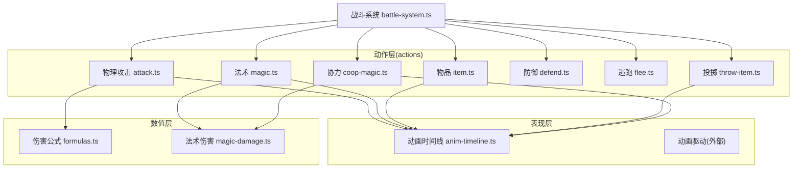
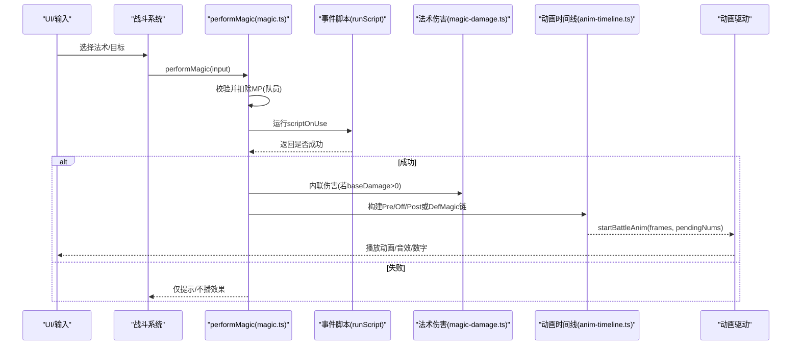
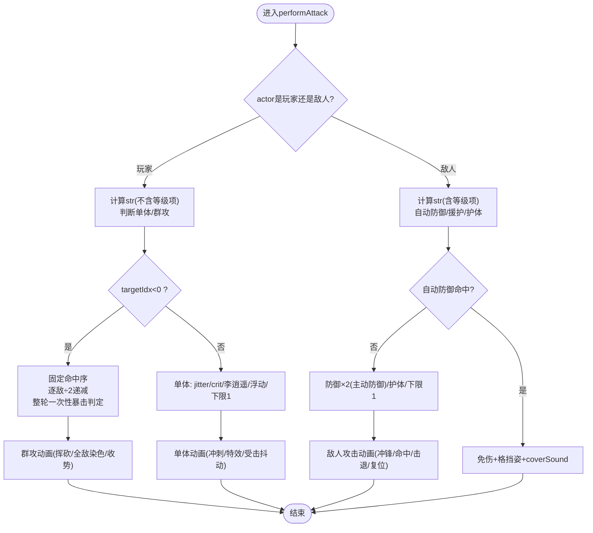
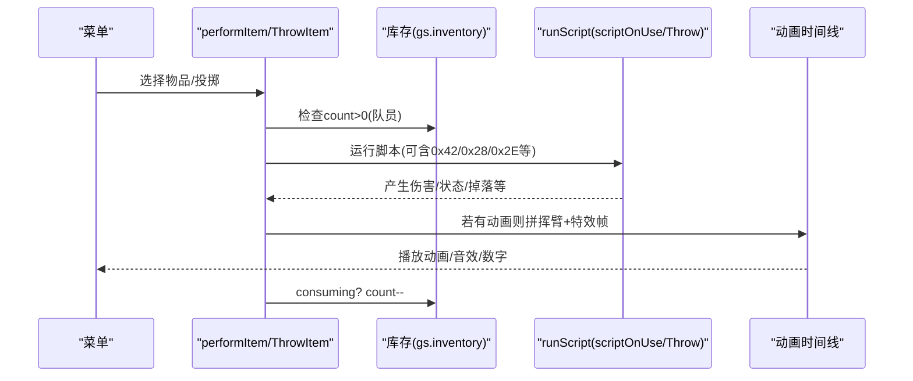
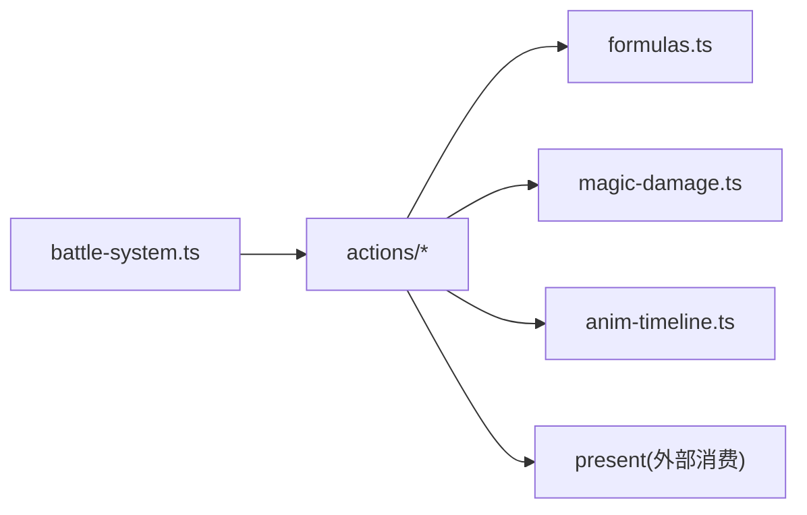

# 战斗动作系统

<cite>
**本文引用的文件**   
- [README.md](file://README.md)
- [game-mechanics.md](file://docs/phase1/game-mechanics.md)
- [attack.ts](file://packages/game/src/core/battle/actions/attack.ts)
- [magic.ts](file://packages/game/src/core/battle/actions/magic.ts)
- [item.ts](file://packages/game/src/core/battle/actions/item.ts)
- [flee.ts](file://packages/game/src/core/battle/actions/flee.ts)
- [throw-item.ts](file://packages/game/src/core/battle/actions/throw-item.ts)
- [defend.ts](file://packages/game/src/core/battle/actions/defend.ts)
- [coop-magic.ts](file://packages/game/src/core/battle/actions/coop-magic.ts)
- [anim-timeline.ts](file://packages/game/src/core/battle/anim-timeline.ts)
- [battle-system.ts](file://packages/game/src/core/battle/battle-system.ts)
- [formulas.ts](file://packages/game/src/core/battle/formulas.ts)
- [magic-damage.ts](file://packages/game/src/core/battle/magic-damage.ts)
</cite>

## 目录
1. [简介](#简介)
2. [项目结构](#项目结构)
3. [核心组件](#核心组件)
4. [架构总览](#架构总览)
5. [详细组件分析](#详细组件分析)
6. [依赖关系分析](#依赖关系分析)
7. [性能与流畅性优化](#性能与流畅性优化)
8. [故障排查指南](#故障排查指南)
9. [结论](#结论)
10. [附录：新增动作与自定义效果示例](#附录新增动作与自定义效果示例)

## 简介
本文件为 Type-Pal 第一阶段（忠实还原）的战斗动作系统技术文档，聚焦以下目标：
- 解释物理攻击、法术释放、物品使用、投掷物、防御、逃跑、协力合击等核心动作的实现机制。
- 梳理从“动作选择”到“结果结算”的完整执行链路。
- 说明动画时间线同步机制（帧映射、特效播放、音效触发）。
- 阐述目标选择系统（单体、群体、随机）判定逻辑。
- 说明动作条件检查（MP 消耗、库存、状态限制、Boss 战限制等）。
- 提供扩展新动作与自定义效果的实践路径。
- 给出性能优化与动画流畅性调优建议。

## 项目结构
战斗动作系统位于 packages/game/src/core/battle 下，采用“动作实现 + 动画时间线 + 伤害公式 + 驱动层”的分层组织：
- 动作实现：actions/* 每个动作一个模块，负责校验、计算、副作用（扣资源、写状态）、派发动画与音效。
- 动画时间线：anim-timeline.ts 纯函数构建 BattleAnimFrame[]，由 battle-anim-driver 逐帧驱动。
- 伤害与抗性：formulas.ts / magic-damage.ts 提供真值对齐的伤害与元素/毒抗缩放。
- 驱动与调度：battle-system.ts 串联回合队列、动作分发、演出收尾与胜利结算。



图表来源
- [attack.ts:1-582](file://packages/game/src/core/battle/actions/attack.ts#L1-L582)
- [magic.ts:1-800](file://packages/game/src/core/battle/actions/magic.ts#L1-L800)
- [item.ts:1-120](file://packages/game/src/core/battle/actions/item.ts#L1-L120)
- [throw-item.ts:1-140](file://packages/game/src/core/battle/actions/throw-item.ts#L1-L140)
- [defend.ts:1-22](file://packages/game/src/core/battle/actions/defend.ts#L1-L22)
- [flee.ts:1-77](file://packages/game/src/core/battle/actions/flee.ts#L1-L77)
- [coop-magic.ts:1-325](file://packages/game/src/core/battle/actions/coop-magic.ts#L1-L325)
- [anim-timeline.ts:1-800](file://packages/game/src/core/battle/anim-timeline.ts#L1-L800)
- [battle-system.ts](file://packages/game/src/core/battle/battle-system.ts)
- [formulas.ts](file://packages/game/src/core/battle/formulas.ts)
- [magic-damage.ts](file://packages/game/src/core/battle/magic-damage.ts)

章节来源
- [README.md:1-139](file://README.md#L1-L139)

## 核心组件
- 物理攻击：支持单体/群攻、暴击/会心、双重攻击、敌人附带异常、自动防御/援护/护体等分支；动画时间线挂载出招声/武器声/命中特效/受击抖动。
- 法术：以脚本驱动为核心，PreMagic → OffMagic/DefMagic → PostMagic 三段式动画链，数字延迟挂帧；敌方法术伤害内联结算并应用自动防御除数。
- 物品/投掷：按 consuming 标志扣库存；投掷走 scriptOnThrow，可调用 0x42 SimulateMagic 复用 OffMagic 特效。
- 防御：设置 defending 标记，后续敌人物理攻击时防御×2生效。
- 逃跑：吉运 vs 敌方抵抗（修复版用敌吉运），成功播放滑出动画，失败播放挪步动画并累计隐藏经验。
- 协力合击：健康成员聚拢施法，HP 代价，伤害按(攻+灵)/4 入法术公式，支持召唤型合击。

章节来源
- [attack.ts:1-582](file://packages/game/src/core/battle/actions/attack.ts#L1-L582)
- [magic.ts:1-800](file://packages/game/src/core/battle/actions/magic.ts#L1-L800)
- [item.ts:1-120](file://packages/game/src/core/battle/actions/item.ts#L1-L120)
- [throw-item.ts:1-140](file://packages/game/src/core/battle/actions/throw-item.ts#L1-L140)
- [defend.ts:1-22](file://packages/game/src/core/battle/actions/defend.ts#L1-L22)
- [flee.ts:1-77](file://packages/game/src/core/battle/actions/flee.ts#L1-L77)
- [coop-magic.ts:1-325](file://packages/game/src/core/battle/actions/coop-magic.ts#L1-L325)

## 架构总览
下图展示一次玩家法术释放的端到端流程：从 performMagic 开始，先扣 MP，再跑 scriptOnUse/scriptOnSuccess，随后根据类型构建 Pre/Off/Post 或 DefMagic 动画链，并将伤害数字与屏幕震动挂到正确帧，最后由动画驱动统一推进。



图表来源
- [magic.ts:123-435](file://packages/game/src/core/battle/actions/magic.ts#L123-L435)
- [anim-timeline.ts:672-800](file://packages/game/src/core/battle/anim-timeline.ts#L672-L800)
- [magic-damage.ts](file://packages/game/src/core/battle/magic-damage.ts)

## 详细组件分析

### 物理攻击（单体/群体/混乱自伤）
- 伤害公式：玩家→敌人使用 calcPhysicalAttackDamage，含基础三段公式、物理抗性、暴击/会心、双重攻击、浮动区间；敌人→玩家包含自动防御/援护/护体/减半等分支。
- 目标选择：targetIdx 指定单体；targetIdx < 0 表示全体，固定命中顺序 index={2,1,0,4,3}，逐敌伤害÷2递减。
- 动画与音效：buildPlayerAttackTimeline/buildEnemyPhysicalTimeline 将出招声、武器声、命中特效、受击抖动、位移复位等挂到对应帧；双击/群攻每 sweep 独立建段。
- 附加异常：敌人普攻命中后按 wAttackEquivItemRate × 玩家毒抗两道门决定是否跑等价物品脚本上异常。



图表来源
- [attack.ts:112-435](file://packages/game/src/core/battle/actions/attack.ts#L112-L435)
- [attack.ts:450-497](file://packages/game/src/core/battle/actions/attack.ts#L450-L497)
- [anim-timeline.ts:311-458](file://packages/game/src/core/battle/anim-timeline.ts#L311-L458)
- [anim-timeline.ts:509-670](file://packages/game/src/core/battle/anim-timeline.ts#L509-L670)

章节来源
- [attack.ts:1-582](file://packages/game/src/core/battle/actions/attack.ts#L1-L582)
- [game-mechanics.md:143-232](file://docs/phase1/game-mechanics.md#L143-L232)
- [game-mechanics.md:351-369](file://docs/phase1/game-mechanics.md#L351-L369)

### 法术释放（脚本驱动 + 三段动画链）
- 流程要点：
  - 队员 cast 先扣 MP；敌人 cast 不 track MP。
  - 预掷自动防御（DM6）：在 scriptOnUse 之前为可能受击的目标预先掷骰，保证 RNG 序列与原版一致。
  - 运行 scriptOnUse → 若失败则 fizzle（仍播起手音，但不播效果/不跑 success）。
  - 运行 scriptOnSuccess：治疗/复活/秒杀等 opcode 修改 HP/状态，数字延迟到动画末或首帧显示。
  - 内联伤害：当 baseDamage > 0 且非防御类时，player→enemy 走 applyMagicDamage；enemy→player 走 applyEnemyMagicDamage，应用 autoDefend/defending/protect 除数。
  - 动画链：PreMagic → OffMagic/DefMagic → PostMagic；召唤/变身有专用链。
- 音效同步：施法音与效果音均挂帧（前摇“施法姿”帧/OffMagic 首帧），避免“先声后画”。

```mermaid
classDiagram
class PerformMagicInput {
+state
+casterIsEnemy
+casterIdx
+spellId
+targetIsEnemy
+targetIdx
+spells
+magics
+items
+playerRoles
+bus
+commands
+runScript
+objectMagics
+gs
+magicSpriteFrameCounts
+summonSpriteFrameCounts
+enemySpriteFrameHeights
}
class MagicAction {
+performMagic(input)
-buildAndStartMagicAnim()
-buildAndStartDefMagicAnim()
-buildAndStartSummonAnim()
-buildAndStartTranceAnim()
}
class TimelineBuilder {
+buildPreMagicTimeline()
+buildPlayerOffMagicTimeline()
+buildPlayerDefMagicTimeline()
+buildPostMagicTimeline()
}
MagicAction --> TimelineBuilder : "构建帧序列"
MagicAction -->|"applyMagicDamage"| DamageModule
```

图表来源
- [magic.ts:59-111](file://packages/game/src/core/battle/actions/magic.ts#L59-L111)
- [magic.ts:123-435](file://packages/game/src/core/battle/actions/magic.ts#L123-L435)
- [anim-timeline.ts:672-800](file://packages/game/src/core/battle/anim-timeline.ts#L672-L800)
- [magic-damage.ts](file://packages/game/src/core/battle/magic-damage.ts)

章节来源
- [magic.ts:1-800](file://packages/game/src/core/battle/actions/magic.ts#L1-L800)
- [game-mechanics.md:201-227](file://docs/phase1/game-mechanics.md#L201-L227)

### 物品使用与投掷
- 使用物品：查找 item → 队员检查库存 → 运行 scriptOnUse → 若 flags.consuming 则 count--。
- 投掷物：跑 scriptOnThrow，注入 magicTables/objectPoisons/playerRoles/gs，支持 0x42 SimulateMagic 复用 OffMagic 特效；挥臂前摇动画与 OffMagic 拼接。



图表来源
- [item.ts:69-119](file://packages/game/src/core/battle/actions/item.ts#L69-L119)
- [throw-item.ts:70-139](file://packages/game/src/core/battle/actions/throw-item.ts#L70-L139)
- [anim-timeline.ts:107-132](file://packages/game/src/core/battle/anim-timeline.ts#L107-L132)

章节来源
- [item.ts:1-120](file://packages/game/src/core/battle/actions/item.ts#L1-L120)
- [throw-item.ts:1-140](file://packages/game/src/core/battle/actions/throw-item.ts#L1-L140)

### 防御
- 设置 defending=true，后续敌人物理攻击时对 def×2 生效；回合末清理。

章节来源
- [defend.ts:1-22](file://packages/game/src/core/battle/actions/defend.ts#L1-L22)
- [attack.ts:358-369](file://packages/game/src/core/battle/actions/attack.ts#L358-L369)

### 逃跑
- 公式：str=我方吉运；def=Σ(敌方抵抗项 + (level+6)*4)。修复版使用敌吉运字段，避免原版的误用身法 bug。
- Boss 战不可逃；成功播放滑出动画，失败播放挪步动画并累计 rgFleeExp.wCount += 2。

章节来源
- [flee.ts:1-77](file://packages/game/src/core/battle/actions/flee.ts#L1-L77)
- [game-mechanics.md:529-577](file://docs/phase1/game-mechanics.md#L529-L577)

### 协力合击
- 参与者：所有 healthy 队员；healthy≤1 退化普通攻击。
- 代价：每位 contributor 扣 HP = magic.costMP（非 MP）。
- 伤害：str = Σ(攻+灵)/4，走法术伤害公式；支持 summon 型合击。
- 动画：聚拢→施法→OffMagic/二次效果→PostMagic→归位。

章节来源
- [coop-magic.ts:1-325](file://packages/game/src/core/battle/actions/coop-magic.ts#L1-L325)
- [game-mechanics.md:450-485](file://docs/phase1/game-mechanics.md#L450-L485)

## 依赖关系分析
- 动作层依赖：
  - 伤害与抗性：formulas.ts（基础三段公式、五灵/毒抗、战场加成）、magic-damage.ts（法术伤害循环与自动防御除数）。
  - 动画：anim-timeline.ts（纯函数生成帧序列）。
  - 驱动：startBattleAnim 统一推进，present 消费帧并播放声音/数字/特效。
- 数据流：
  - 输入：state、playerRoles、magics/items/spells、commands、rng。
  - 输出：对 state 的副作用（HP/MP/状态/库存）、Present 命令（showDamageNum/playSound 等）、动画帧序列。



图表来源
- [attack.ts:1-582](file://packages/game/src/core/battle/actions/attack.ts#L1-L582)
- [magic.ts:1-800](file://packages/game/src/core/battle/actions/magic.ts#L1-L800)
- [formulas.ts](file://packages/game/src/core/battle/formulas.ts)
- [magic-damage.ts](file://packages/game/src/core/battle/magic-damage.ts)
- [anim-timeline.ts:1-800](file://packages/game/src/core/battle/anim-timeline.ts#L1-L800)
- [battle-system.ts](file://packages/game/src/core/battle/battle-system.ts)

## 性能与流畅性优化
- 动画帧合并与去抖：
  - 将同 tick 的多个小帧合并为一段 durationMs，减少驱动开销。
  - 对重复的 iColorShift 变化进行差分压缩，仅在变化帧写入 fighters。
- 音效批处理：
  - 通过帧 sound 字段集中触发，避免多次 bus.emit 造成音频管线抖动。
- 渲染优化：
  - overlay 特效批量绘制，避免频繁切换 spriteChunk。
  - 群攻收势阶段只更新参与演出的敌人集合，降低 per-frame 遍历成本。
- RNG 与确定性：
  - 保持 RNG 调用顺序与原版一致，便于回放与回归测试；必要时缓存 roll 结果避免重复掷骰。
- 内存与对象分配：
  - 复用临时数组（如 hurtEnemies/pendingNums），减少 GC 压力。
  - 对大型 Map（魔法帧数表）做懒加载与缓存。

[本节为通用指导，无需源码引用]

## 故障排查指南
- 法术未播放效果：
  - 检查 scriptOnUse 是否返回失败（g_fScriptSuccess=false），此时不会播效果与 success 脚本。
  - 确认 magic.baseDamage 与 type 是否匹配 OffMagic 分支。
- 伤害数字时机错误：
  - 确认数字是否挂在 PostMagic 第一帧或 DefMagic 链末；无动画链时才会即时 emit。
- 群攻伤害异常：
  - 检查 division 递增逻辑与命中序；注意超杀显示完整伤害而非剩余血 delta。
- 逃跑成功率不符预期：
  - 确认 isBoss 标志与 def 计算（修复版使用敌吉运）；Boss 战恒失败。
- 投掷物特效缺失：
  - 确认 magicSpriteFrameCounts 是否传入；若无则回落即时路径。

章节来源
- [magic.ts:123-435](file://packages/game/src/core/battle/actions/magic.ts#L123-L435)
- [attack.ts:150-236](file://packages/game/src/core/battle/actions/attack.ts#L150-L236)
- [flee.ts:36-76](file://packages/game/src/core/battle/actions/flee.ts#L36-L76)
- [throw-item.ts:70-139](file://packages/game/src/core/battle/actions/throw-item.ts#L70-L139)

## 结论
Type-Pal 战斗动作系统以“脚本驱动 + 时间线动画 + 真值公式”为核心，严格对齐 sdlpal 行为与时序。通过模块化动作实现、统一的动画帧构建与驱动、以及精细的音效/数字挂帧策略，既保证了高保真度，也为后续扩展提供了清晰的接入点。

[本节为总结，无需源码引用]

## 附录：新增动作与自定义效果示例
- 新增动作步骤（以“自定义技能”为例）：
  1) 在 actions/ 下新建 action 模块，定义 performXxx(state, input, bus) 入口。
  2) 条件检查：读取 playerRoles/state 校验 MP/库存/状态/Boss 限制等。
  3) 副作用：扣资源、写状态、更新 gs（如库存/经验计数）。
  4) 动画：如需演出，调用 buildXxxTimeline 生成帧，startBattleAnim 驱动；否则直接 bus.emit 即时反馈。
  5) 伤害/效果：复用 formulas.ts / magic-damage.ts；复杂效果通过 runScript 调用 0xXX opcode。
  6) 接入 battle-system.ts 的动作分发器，注册新动作枚举与参数。
- 自定义效果示例（参考现有实现）：
  - 参考 performMagic 的 runScript 注入 battleCtx，使用 0x1B/0x1C 回血回蓝、0x2E 上状态、0x60 秒杀等。
  - 参考 performThrowItem 的 0x42 SimulateMagic，复用 OffMagic 特效与伤害数字挂帧。
  - 参考 performCoopMagic 的聚拢/二次效果/召唤神序列组合。

章节来源
- [magic.ts:123-435](file://packages/game/src/core/battle/actions/magic.ts#L123-L435)
- [throw-item.ts:70-139](file://packages/game/src/core/battle/actions/throw-item.ts#L70-L139)
- [coop-magic.ts:92-245](file://packages/game/src/core/battle/actions/coop-magic.ts#L92-L245)
- [anim-timeline.ts:672-800](file://packages/game/src/core/battle/anim-timeline.ts#L672-L800)