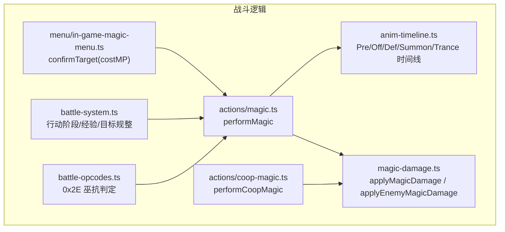
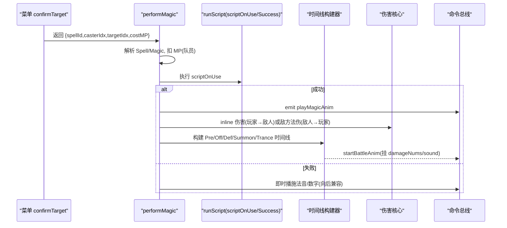
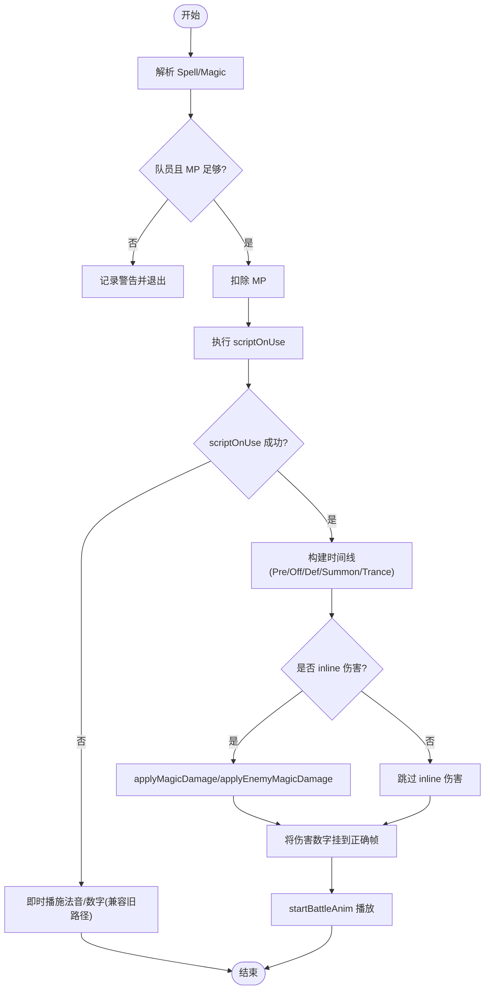
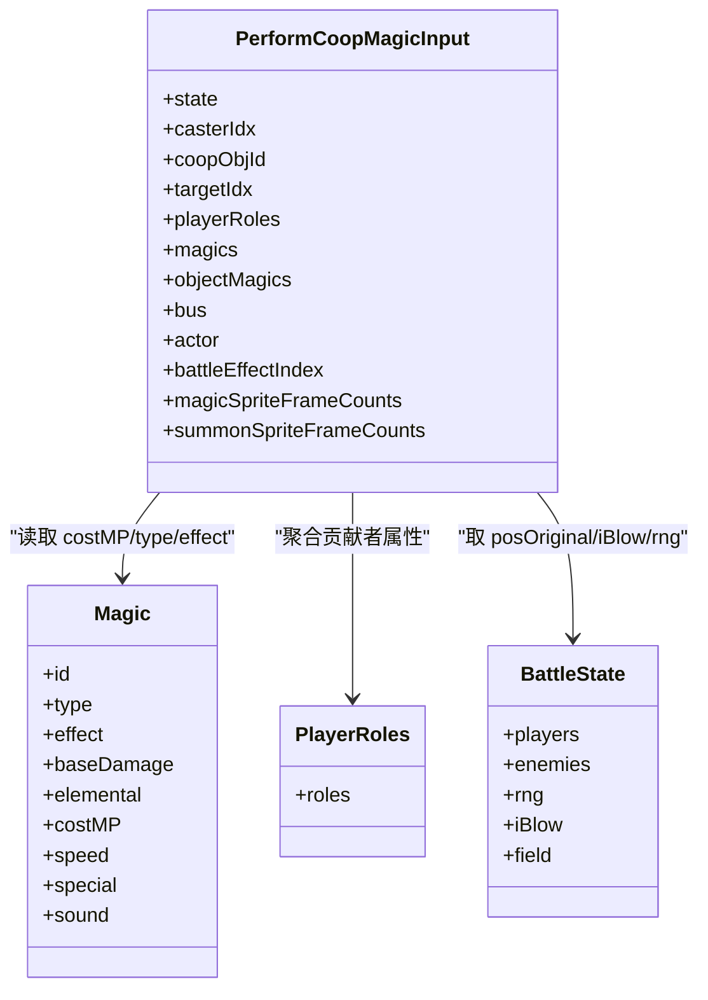
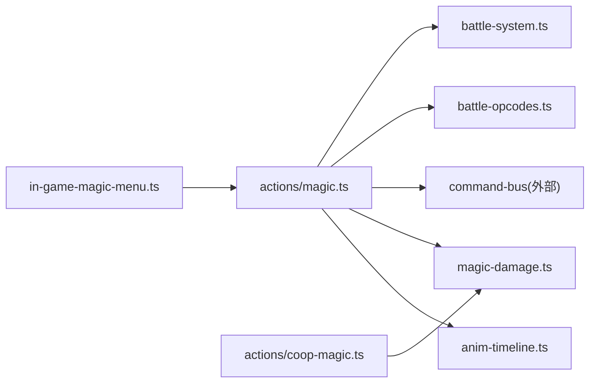

# 法术释放系统

<cite>
**本文引用的文件**   
- [packages/game/src/core/battle/actions/magic.ts](file://packages/game/src/core/battle/actions/magic.ts)
- [packages/game/src/core/battle/anim-timeline.ts](file://packages/game/src/core/battle/anim-timeline.ts)
- [packages/game/src/core/battle/magic-damage.ts](file://packages/game/src/core/battle/magic-damage.ts)
- [packages/game/src/core/battle/actions/coop-magic.ts](file://packages/game/src/core/battle/actions/coop-magic.ts)
- [packages/game/src/core/menu/in-game-magic-menu.ts](file://packages/game/src/core/menu/in-game-magic-menu.ts)
- [packages/game/src/core/battle/battle-system.ts](file://packages/game/src/core/battle/battle-system.ts)
- [packages/game/src/core/battle/battle-opcodes.ts](file://packages/game/src/core/battle/battle-opcodes.ts)
</cite>

## 目录
1. [简介](#简介)
2. [项目结构](#项目结构)
3. [核心组件](#核心组件)
4. [架构总览](#架构总览)
5. [详细组件分析](#详细组件分析)
6. [依赖关系分析](#依赖关系分析)
7. [性能与渲染优化建议](#性能与渲染优化建议)
8. [故障排查指南](#故障排查指南)
9. [结论](#结论)
10. [附录：扩展与示例路径](#附录扩展与示例路径)

## 简介
本文件面向 Type-Pal 的“法术释放系统”，系统化阐述法术分类与效果类型、释放流程（MP 消耗检查、冷却管理、施法前摇）、目标选择算法、合击触发与协同计算、抗性系统与抵抗机制，并提供添加新法术效果与自定义动画的实践路径，以及性能与特效渲染优化建议。内容严格基于仓库源码与注释进行说明。

## 项目结构
与法术系统直接相关的代码集中在 packages/game/src/core/battle 与 packages/game/src/core/menu 下：
- actions/magic.ts：法术执行主流程（扣 MP、脚本调度、伤害结算、动画链构建）
- anim-timeline.ts：战斗动画时间线构建器（PreMagic/OffMagic/DefMagic/Summon/Trance 等）
- magic-damage.ts：法术伤害共享核心（玩家→敌人、敌人→玩家、SimulateMagic）
- actions/coop-magic.ts：协力合击（HP 代价、贡献者聚合、伤害与动画）
- menu/in-game-magic-menu.ts：菜单交互（选目标、返回 costMP）
- battle-system.ts：行动阶段整合（经验增长、目标规整）
- battle-opcodes.ts：脚本 opcode 实现（如巫术命中判定）

图表来源
- [packages/game/src/core/battle/actions/magic.ts:123-435](file://packages/game/src/core/battle/actions/magic.ts#L123-L435)
- [packages/game/src/core/battle/anim-timeline.ts:705-751](file://packages/game/src/core/battle/anim-timeline.ts#L705-L751)
- [packages/game/src/core/battle/magic-damage.ts:80-124](file://packages/game/src/core/battle/magic-damage.ts#L80-L124)
- [packages/game/src/core/battle/actions/coop-magic.ts:92-245](file://packages/game/src/core/battle/actions/coop-magic.ts#L92-L245)
- [packages/game/src/core/menu/in-game-magic-menu.ts:197-222](file://packages/game/src/core/menu/in-game-magic-menu.ts#L197-L222)
- [packages/game/src/core/battle/battle-system.ts:2773-2785](file://packages/game/src/core/battle/battle-system.ts#L2773-L2785)
- [packages/game/src/core/battle/battle-opcodes.ts:628-642](file://packages/game/src/core/battle/battle-opcodes.ts#L628-L642)

章节来源
- [packages/game/src/core/battle/actions/magic.ts:123-435](file://packages/game/src/core/battle/actions/magic.ts#L123-L435)
- [packages/game/src/core/battle/anim-timeline.ts:705-751](file://packages/game/src/core/battle/anim-timeline.ts#L705-L751)
- [packages/game/src/core/battle/magic-damage.ts:80-124](file://packages/game/src/core/battle/magic-damage.ts#L80-L124)
- [packages/game/src/core/battle/actions/coop-magic.ts:92-245](file://packages/game/src/core/battle/actions/coop-magic.ts#L92-L245)
- [packages/game/src/core/menu/in-game-magic-menu.ts:197-222](file://packages/game/src/core/menu/in-game-magic-menu.ts#L197-L222)
- [packages/game/src/core/battle/battle-system.ts:2773-2785](file://packages/game/src/core/battle/battle-system.ts#L2773-L2785)
- [packages/game/src/core/battle/battle-opcodes.ts:628-642](file://packages/game/src/core/battle/battle-opcodes.ts#L628-L642)

## 核心组件
- 法术执行器 performMagic：负责解析法术对象、MP 检查、脚本运行、伤害结算、动画链构建与音效帧同步。
- 动画时间线 builder：提供 PreMagic/OffMagic/DefMagic/Summon/Trance 等时间线构建能力，驱动帧级演出。
- 伤害核心 applyMagicDamage/applyEnemyMagicDamage：统一玩家→敌人、敌人→玩家的伤害公式与随机波动、抗性处理。
- 协力合击 performCoopMagic：按 healthy 队员聚合贡献、以 HP 为代价、聚合属性计算伤害并播放聚拢动画。
- 菜单 confirmTarget：返回选中目标的 costMP，供上层在脚本执行后做最终 MP 校验与回退。
- 战斗系统 battle-system：在行动阶段对普攻/法术的目标范围进行规整，并在施法后增加隐藏经验。
- 脚本 opcode 0x2E：巫术命中判定，采用“>=”对齐原版后期修复。

章节来源
- [packages/game/src/core/battle/actions/magic.ts:123-435](file://packages/game/src/core/battle/actions/magic.ts#L123-L435)
- [packages/game/src/core/battle/anim-timeline.ts:705-751](file://packages/game/src/core/battle/anim-timeline.ts#L705-L751)
- [packages/game/src/core/battle/magic-damage.ts:80-124](file://packages/game/src/core/battle/magic-damage.ts#L80-L124)
- [packages/game/src/core/battle/actions/coop-magic.ts:92-245](file://packages/game/src/core/battle/actions/coop-magic.ts#L92-L245)
- [packages/game/src/core/menu/in-game-magic-menu.ts:197-222](file://packages/game/src/core/menu/in-game-magic-menu.ts#L197-L222)
- [packages/game/src/core/battle/battle-system.ts:2773-2785](file://packages/game/src/core/battle/battle-system.ts#L2773-L2785)
- [packages/game/src/core/battle/battle-opcodes.ts:628-642](file://packages/game/src/core/battle/battle-opcodes.ts#L628-L642)

## 架构总览
下图展示一次玩家法术释放从菜单到动画与伤害的全链路调用顺序。

图表来源
- [packages/game/src/core/menu/in-game-magic-menu.ts:197-222](file://packages/game/src/core/menu/in-game-magic-menu.ts#L197-L222)
- [packages/game/src/core/battle/actions/magic.ts:123-435](file://packages/game/src/core/battle/actions/magic.ts#L123-L435)
- [packages/game/src/core/battle/anim-timeline.ts:705-751](file://packages/game/src/core/battle/anim-timeline.ts#L705-L751)
- [packages/game/src/core/battle/magic-damage.ts:80-124](file://packages/game/src/core/battle/magic-damage.ts#L80-L124)

## 详细组件分析

### 法术分类与效果类型
- 攻击类（OffMagic）：normal、attackAll、attackWhole、attackField。走 OffMagic 时间线，可带屏波、震屏、吹飞等特效。
- 防御/辅助类（DefMagic）：applyToPlayer、applyToParty。走 DefMagic 时间线，目标处产生辉光特效。
- 召唤类（Summon）：buildAndStartSummonAnim，含变亮、神出场、二次法术效果与 PostMagic。
- 变身类（Trance）：colorShift + crossfade 变身段。
- 全体目标强制类型：attackAll/attackWhole/attackField/applyToParty/summon 会强制打全体。

章节来源
- [packages/game/src/core/battle/actions/magic.ts:437-444](file://packages/game/src/core/battle/actions/magic.ts#L437-L444)
- [packages/game/src/core/battle/magic-damage.ts:41-48](file://packages/game/src/core/battle/magic-damage.ts#L41-L48)

### 法术释放流程（MP 检查、冷却、前摇）
- MP 检查：队员施法时先判断 role.mp >= costMP，不足则警告并早退；敌人不 track MP。
- 冷却管理：当前实现未内置全局冷却表；若需加入，可在 performMagic 入口增加“已冷却”门控与计时器，并在动画结束后重置。
- 施法前摇：所有玩家法术均先播放 PreMagic（上移、施法姿、cast 特效），再进入 OffMagic/DefMagic/Summon/Trance 分支。
- 音效帧同步：玩家施法音与效果音通过时间线帧挂载，避免提前或错位。

图表来源
- [packages/game/src/core/battle/actions/magic.ts:123-435](file://packages/game/src/core/battle/actions/magic.ts#L123-L435)
- [packages/game/src/core/battle/anim-timeline.ts:705-751](file://packages/game/src/core/battle/anim-timeline.ts#L705-L751)

章节来源
- [packages/game/src/core/battle/actions/magic.ts:123-435](file://packages/game/src/core/battle/actions/magic.ts#L123-L435)
- [packages/game/src/core/battle/anim-timeline.ts:705-751](file://packages/game/src/core/battle/anim-timeline.ts#L705-L751)

### 目标选择算法（单体、群体、随机）
- 强制全体：magic.type ∈ {attackAll, attackWhole, attackField, applyToParty, summon} → 全体。
- 普通攻击/单体：type=normal 或 applyToPlayer/trance → 单体。
- 菜单侧规整：当动作类型为 attack 且武器具备 attackAll 但原 target=-1 时，自动重选单个活敌；反之亦然。
- 随机目标：当前实现未见显式“随机目标”逻辑；若有需求，可在目标集合中随机选取。

章节来源
- [packages/game/src/core/battle/magic-damage.ts:41-48](file://packages/game/src/core/battle/magic-damage.ts#L41-L48)
- [packages/game/src/core/battle/battle-system.ts:2595-2607](file://packages/game/src/core/battle/battle-system.ts#L2595-L2607)

### 合击法术（触发条件与协同计算）
- 触发条件：角色装备覆盖 cooperativeMagic；healthy 队员数 > 1 才生效，否则退化普通攻击。
- 代价：每个 contributor 扣除 magic.costMP 作为 HP 代价（非 MP），最低钳至 1。
- 协同强度：str = Σ(attackStrength + magicStrength) over contributors，再除以 4。
- 目标与伤害：按 type 或 object flag 决定全体/单体；伤害下限为 1；群攻逐敌独立掷倍率。
- 动画：有 FIRE.MKF 帧数与队员位置时，播放聚拢/施法/OffMagic/PostMagic 时间线。

图表来源
- [packages/game/src/core/battle/actions/coop-magic.ts:35-57](file://packages/game/src/core/battle/actions/coop-magic.ts#L35-L57)
- [packages/game/src/core/battle/actions/coop-magic.ts:92-245](file://packages/game/src/core/battle/actions/coop-magic.ts#L92-L245)

章节来源
- [packages/game/src/core/battle/actions/coop-magic.ts:92-245](file://packages/game/src/core/battle/actions/coop-magic.ts#L92-L245)

### 抗性系统与效果抵抗机制
- 元素/毒抗：敌方被打时按 enemy.e.elemResistance/poisonResistance 参与 calcMagicDamage；玩家被敌法打时按角色抗性上限 100 参与。
- 被动格挡（autoDefend）：敌法前预掷，存活且非失能状态有概率触发，除因子额外 +1。
- 巫术命中（0x2E）：采用“>=”判定，巫抗 0 时掷出 0 也命中（对齐原版后期修复）。

章节来源
- [packages/game/src/core/battle/magic-damage.ts:195-270](file://packages/game/src/core/battle/magic-damage.ts#L195-L270)
- [packages/game/src/core/battle/battle-opcodes.ts:628-642](file://packages/game/src/core/battle/battle-opcodes.ts#L628-L642)

### 关键数据流与复杂度
- 伤害计算：单次目标 O(1)，群攻 O(N)（N 为目标数量）。
- 动画时间线：帧数 l ≈ (n - fireDelay)*effectTimes + n + shake，每帧构造少量 FighterDelta，整体 O(l)。
- 合击聚合：遍历队员 O(P)，P≤MAX_PLAYERS，常数级开销。

章节来源
- [packages/game/src/core/battle/magic-damage.ts:80-124](file://packages/game/src/core/battle/magic-damage.ts#L80-L124)
- [packages/game/src/core/battle/anim-timeline.ts:875-907](file://packages/game/src/core/battle/anim-timeline.ts#L875-L907)
- [packages/game/src/core/battle/actions/coop-magic.ts:145-168](file://packages/game/src/core/battle/actions/coop-magic.ts#L145-L168)

## 依赖关系分析
- performMagic 依赖：
  - 动画时间线构建器（Pre/Off/Def/Summon/Trance）
  - 伤害核心（applyMagicDamage/applyEnemyMagicDamage）
  - 命令总线（emit playMagicAnim/showDamageNum/playSound）
  - 菜单 confirmTarget（提供 costMP）
  - 战斗系统（行动阶段目标规整与经验增长）
  - 脚本 opcode（0x2E 巫抗判定）

图表来源
- [packages/game/src/core/battle/actions/magic.ts:123-435](file://packages/game/src/core/battle/actions/magic.ts#L123-L435)
- [packages/game/src/core/battle/anim-timeline.ts:705-751](file://packages/game/src/core/battle/anim-timeline.ts#L705-L751)
- [packages/game/src/core/battle/magic-damage.ts:80-124](file://packages/game/src/core/battle/magic-damage.ts#L80-L124)
- [packages/game/src/core/battle/actions/coop-magic.ts:92-245](file://packages/game/src/core/battle/actions/coop-magic.ts#L92-L245)
- [packages/game/src/core/menu/in-game-magic-menu.ts:197-222](file://packages/game/src/core/menu/in-game-magic-menu.ts#L197-L222)
- [packages/game/src/core/battle/battle-system.ts:2773-2785](file://packages/game/src/core/battle/battle-system.ts#L2773-L2785)
- [packages/game/src/core/battle/battle-opcodes.ts:628-642](file://packages/game/src/core/battle/battle-opcodes.ts#L628-L642)

章节来源
- [packages/game/src/core/battle/actions/magic.ts:123-435](file://packages/game/src/core/battle/actions/magic.ts#L123-L435)
- [packages/game/src/core/battle/anim-timeline.ts:705-751](file://packages/game/src/core/battle/anim-timeline.ts#L705-L751)
- [packages/game/src/core/battle/magic-damage.ts:80-124](file://packages/game/src/core/battle/magic-damage.ts#L80-L124)
- [packages/game/src/core/battle/actions/coop-magic.ts:92-245](file://packages/game/src/core/battle/actions/coop-magic.ts#L92-L245)
- [packages/game/src/core/menu/in-game-magic-menu.ts:197-222](file://packages/game/src/core/menu/in-game-magic-menu.ts#L197-L222)
- [packages/game/src/core/battle/battle-system.ts:2773-2785](file://packages/game/src/core/battle/battle-system.ts#L2773-L2785)
- [packages/game/src/core/battle/battle-opcodes.ts:628-642](file://packages/game/src/core/battle/battle-opcodes.ts#L628-L642)

## 性能与渲染优化建议
- 动画帧批处理：将同帧的 fighters/damageNums/sound 合并写入单帧，减少 bus.emit 次数。
- 资源复用：FIRE.MKF/F.MKF 帧数 Map 缓存，避免重复查找。
- 批量伤害数字：群攻时将多目标 damageNums 挂到同一帧首帧显示，降低 UI 刷新压力。
- 屏幕震动与屏波：仅在 shake/wave 区间生成 overlay，其余帧跳过。
- 音效去重：通过“帧同步标记”避免重复 push pendingSounds。
- RNG 局部化：确保 AoE 逐目标独立掷倍率，避免跨目标共用 RNG 导致数值偏差。

[本节为通用指导，无需列出具体文件来源]

## 故障排查指南
- 法术无动画/无声效：确认是否缺少对应 effect chunk 帧数或 caster.posOriginal；检查 buildAndStart* 返回值是否为 true。
- 伤害数字时机异常：确认是否挂在 PostMagic 第一帧或 DefMagic 末帧；未建链时应即时 emit。
- 巫术命中率不符预期：核对 0x2E 使用“>=”判定；巫抗 0 时掷 0 应命中。
- 合击退化普攻：检查 healthy 人数是否 ≤ 1；若是，将走普通攻击路径。
- 目标范围错误：确认 magic.type 与 flags.applyToAll 的优先级；菜单侧对普攻 attackAll 的 target 规整是否正确。

章节来源
- [packages/game/src/core/battle/actions/magic.ts:485-572](file://packages/game/src/core/battle/actions/magic.ts#L485-L572)
- [packages/game/src/core/battle/battle-opcodes.ts:628-642](file://packages/game/src/core/battle/battle-opcodes.ts#L628-L642)
- [packages/game/src/core/battle/actions/coop-magic.ts:101-123](file://packages/game/src/core/battle/actions/coop-magic.ts#L101-L123)
- [packages/game/src/core/battle/battle-system.ts:2595-2607](file://packages/game/src/core/battle/battle-system.ts#L2595-L2607)

## 结论
Type-Pal 的法术系统以 performMagic 为核心，结合时间线构建器与伤害核心，实现了高度忠实于 sdlpal 的行为与表现。通过严格的 MP 检查、脚本驱动的效果、统一的伤害公式与帧同步的动画/音效，保证了玩法一致性与表现力。合击与抗性系统进一步丰富了策略维度。后续可按附录路径扩展新法术效果与自定义动画，并结合性能建议提升大规模战斗时的稳定性与流畅度。

## 附录：扩展与示例路径
- 新增法术效果（脚本驱动）
  - 参考 performMagic 的 runScript 注入 battleCtx，使用现有 opcode 组合实现 heal/status/damage。
  - 参考路径：[packages/game/src/core/battle/actions/magic.ts:204-230](file://packages/game/src/core/battle/actions/magic.ts#L204-L230)
- 自定义法术动画
  - 在 anim-timeline.ts 新增 builder，或在现有 Pre/Off/Def/Summon/Trance 基础上扩展参数。
  - 参考路径：[packages/game/src/core/battle/anim-timeline.ts:705-751](file://packages/game/src/core/battle/anim-timeline.ts#L705-L751)
- 调整目标选择
  - 在 battle-system.ts 的行动阶段对 target 进行规整，或在 performMagic 内根据 type 强制全体。
  - 参考路径：[packages/game/src/core/battle/battle-system.ts:2595-2607](file://packages/game/src/core/battle/battle-system.ts#L2595-L2607)
- 合击扩展
  - 修改 contributors 筛选或 str 聚合规则，注意保持 HP 代价与 minDamage=1 的语义。
  - 参考路径：[packages/game/src/core/battle/actions/coop-magic.ts:138-168](file://packages/game/src/core/battle/actions/coop-magic.ts#L138-L168)
- 抗性/抵抗
  - 调整 0x2E 判定或 autoDefend 概率，遵循“>=”与预掷一致性。
  - 参考路径：[packages/game/src/core/battle/battle-opcodes.ts:628-642](file://packages/game/src/core/battle/battle-opcodes.ts#L628-L642), [packages/game/src/core/battle/magic-damage.ts:170-193](file://packages/game/src/core/battle/magic-damage.ts#L170-L193)