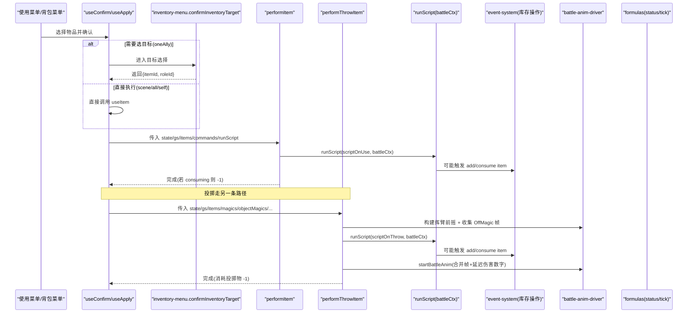
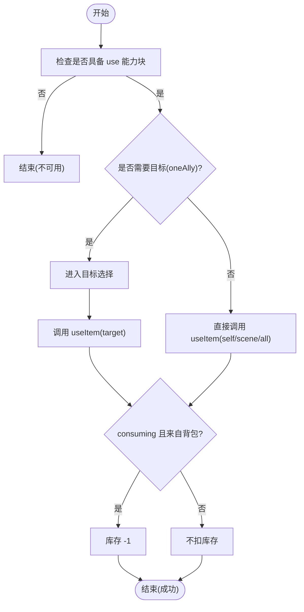
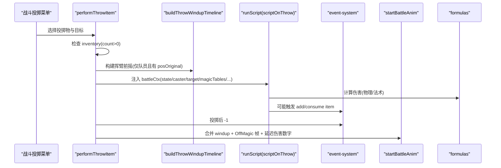
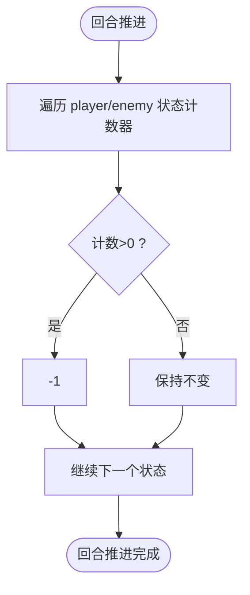
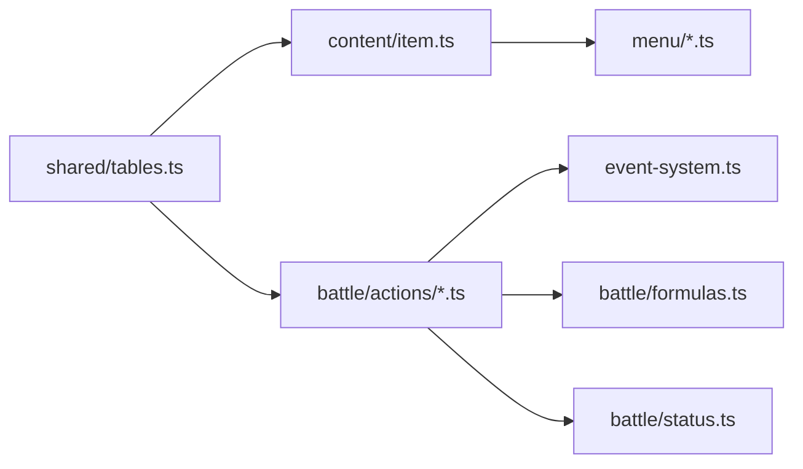

# 物品使用系统

<cite>
**本文引用的文件**
- [packages/content/src/item.ts](file://packages/content/src/item.ts)
- [packages/shared/src/tables.ts](file://packages/shared/src/tables.ts)
- [packages/game/src/core/menu/item-select.ts](file://packages/game/src/core/menu/item-select.ts)
- [packages/game/src/core/battle/actions/item.ts](file://packages/game/src/core/battle/actions/item.ts)
- [packages/game/src/core/battle/actions/throw-item.ts](file://packages/game/src/core/battle/actions/throw-item.ts)
- [packages/game/src/core/event-system.ts](file://packages/game/src/core/event-system.ts)
- [packages/game/src/core/battle/formulas.ts](file://packages/game/src/core/battle/formulas.ts)
- [packages/game/src/core/battle/status.ts](file://packages/game/src/core/battle/status.ts)
- [packages/reforge/src/use-menu-state.ts](file://packages/reforge/src/use-menu-state.ts)
- [packages/game/src/core/menu/inventory-menu.ts](file://packages/game/src/core/menu/inventory-menu.ts)
- [docs/phase1/status/item-status.md](file://docs/phase1/status/item-status.md)
- [docs/phase2/foundation/item-data-design.md](file://docs/phase2/foundation/item-data-design.md)
</cite>

## 目录
1. [引言](#引言)
2. [项目结构](#项目结构)
3. [核心组件](#核心组件)
4. [架构总览](#架构总览)
5. [详细组件分析](#详细组件分析)
6. [依赖关系分析](#依赖关系分析)
7. [性能考量](#性能考量)
8. [故障排查指南](#故障排查指南)
9. [结论](#结论)
10. [附录](#附录)

## 引言
本文件为 Type-Pal 的“物品使用系统”提供系统化、可落地的技术文档。内容覆盖：
- 物品分类与使用效果（恢复、状态解除、投掷武器）
- 使用流程（库存检查、数量扣除、动画播放）
- 投掷伤害计算与命中判定机制
- 效果持续时间与状态叠加规则
- 目标选择与范围判定逻辑
- 新增物品类型与自定义效果的扩展方法
- 数据结构设计与内存管理优化建议

## 项目结构
围绕“物品使用系统”，代码分布在数据层、菜单层、战斗执行层与事件脚本层：
- 数据层：共享表结构与内容模型定义
- 菜单层：物品列表过滤、使用确认与目标选择
- 战斗层：使用与投掷的执行器、动画驱动、公式与状态
- 事件脚本层：runScript 注入 battleCtx，驱动具体效果

```mermaid
graph TB
subgraph "数据层"
A["ItemData / UseSpec / ThrowSpec<br/>content/src/item.ts"]
B["Item / ItemFlags / Magic / ObjectMagicView<br/>shared/src/tables.ts"]
end
subgraph "菜单层"
C["ItemSelectMenu 过滤<br/>core/menu/item-select.ts"]
D["Use 菜单状态机<br/>reforge/src/use-menu-state.ts"]
E["背包使用目标选择<br/>core/menu/inventory-menu.ts"]
end
subgraph "战斗层"
F["performItem 使用执行器<br/>core/battle/actions/item.ts"]
G["performThrowItem 投掷执行器<br/>core/battle/actions/throw-item.ts"]
H["战斗公式 formulas.ts"]
I["状态衰减 status.ts"]
end
subgraph "事件脚本层"
J["addItemToInventory / consumeItemFromInventory<br/>core/event-system.ts"]
end
A --> C
B --> C
C --> D
D --> E
E --> F
E --> G
F --> J
G --> J
G --> H
F --> I
G --> I
```

图表来源
- [packages/content/src/item.ts:52-64](file://packages/content/src/item.ts#L52-L64)
- [packages/shared/src/tables.ts:51-70](file://packages/shared/src/tables.ts#L51-L70)
- [packages/game/src/core/menu/item-select.ts:38-55](file://packages/game/src/core/menu/item-select.ts#L38-L55)
- [packages/reforge/src/use-menu-state.ts:61-99](file://packages/reforge/src/use-menu-state.ts#L61-L99)
- [packages/game/src/core/menu/inventory-menu.ts:254-274](file://packages/game/src/core/menu/inventory-menu.ts#L254-L274)
- [packages/game/src/core/battle/actions/item.ts:69-119](file://packages/game/src/core/battle/actions/item.ts#L69-L119)
- [packages/game/src/core/battle/actions/throw-item.ts:70-139](file://packages/game/src/core/battle/actions/throw-item.ts#L70-L139)
- [packages/game/src/core/battle/formulas.ts:36-60](file://packages/game/src/core/battle/formulas.ts#L36-L60)
- [packages/game/src/core/battle/status.ts:20-35](file://packages/game/src/core/battle/status.ts#L20-L35)
- [packages/game/src/core/event-system.ts:3262-3283](file://packages/game/src/core/event-system.ts#L3262-L3283)

章节来源
- [packages/content/src/item.ts:52-64](file://packages/content/src/item.ts#L52-L64)
- [packages/shared/src/tables.ts:51-70](file://packages/shared/src/tables.ts#L51-L70)
- [packages/game/src/core/menu/item-select.ts:38-55](file://packages/game/src/core/menu/item-select.ts#L38-L55)
- [packages/reforge/src/use-menu-state.ts:61-99](file://packages/reforge/src/use-menu-state.ts#L61-L99)
- [packages/game/src/core/menu/inventory-menu.ts:254-274](file://packages/game/src/core/menu/inventory-menu.ts#L254-L274)
- [packages/game/src/core/battle/actions/item.ts:69-119](file://packages/game/src/core/battle/actions/item.ts#L69-L119)
- [packages/game/src/core/battle/actions/throw-item.ts:70-139](file://packages/game/src/core/battle/actions/throw-item.ts#L70-L139)
- [packages/game/src/core/battle/formulas.ts:36-60](file://packages/game/src/core/battle/formulas.ts#L36-L60)
- [packages/game/src/core/battle/status.ts:20-35](file://packages/game/src/core/battle/status.ts#L20-L35)
- [packages/game/src/core/event-system.ts:3262-3283](file://packages/game/src/core/event-system.ts#L3262-L3283)

## 核心组件
- 数据模型
  - ItemData：基础信息 + 能力块 equip? / use? / throw?
  - UseSpec：target、consuming、effects（healHp/healMp/applyStatus/triggerScript/teleport 等）
  - ThrowSpec：占位，后续细化
  - Item / ItemFlags：来自 shared 表的原始条目与 flags 拆解
- 菜单与交互
  - ItemSelectMenu：按 flags 过滤（equip/potion/battle/important/usable/sellable/all）
  - Use 菜单状态机：pick-item → pick-target → apply/direct
  - 背包使用目标选择：记录上次目标槽位记忆
- 战斗执行
  - performItem：跑 scriptOnUse，按 consuming 扣库存
  - performThrowItem：跑 scriptOnThrow，支持挥臂动画与 OffMagic 特效帧缓冲
- 事件脚本
  - addItemToInventory / consumeItemFromInventory：统一库存增减（含 0→1 修正、上限 99、移除空项）
- 战斗公式与状态
  - calcBaseDamage / calcPhysicalAttackDamage / calcMagicDamage
  - tickStatusEffects：回合末全部状态计数器 -1

章节来源
- [packages/content/src/item.ts:32-50](file://packages/content/src/item.ts#L32-L50)
- [packages/shared/src/tables.ts:22-40](file://packages/shared/src/tables.ts#L22-L40)
- [packages/game/src/core/menu/item-select.ts:38-55](file://packages/game/src/core/menu/item-select.ts#L38-L55)
- [packages/reforge/src/use-menu-state.ts:61-99](file://packages/reforge/src/use-menu-state.ts#L61-L99)
- [packages/game/src/core/menu/inventory-menu.ts:254-274](file://packages/game/src/core/menu/inventory-menu.ts#L254-L274)
- [packages/game/src/core/battle/actions/item.ts:69-119](file://packages/game/src/core/battle/actions/item.ts#L69-L119)
- [packages/game/src/core/battle/actions/throw-item.ts:70-139](file://packages/game/src/core/battle/actions/throw-item.ts#L70-L139)
- [packages/game/src/core/event-system.ts:3262-3283](file://packages/game/src/core/event-system.ts#L3262-L3283)
- [packages/game/src/core/battle/formulas.ts:36-60](file://packages/game/src/core/battle/formulas.ts#L36-L60)
- [packages/game/src/core/battle/status.ts:20-35](file://packages/game/src/core/battle/status.ts#L20-L35)

## 架构总览
从“玩家选择物品”到“效果落地”的关键路径如下：

图表来源
- [packages/reforge/src/use-menu-state.ts:61-99](file://packages/reforge/src/use-menu-state.ts#L61-L99)
- [packages/game/src/core/menu/inventory-menu.ts:254-274](file://packages/game/src/core/menu/inventory-menu.ts#L254-L274)
- [packages/game/src/core/battle/actions/item.ts:69-119](file://packages/game/src/core/battle/actions/item.ts#L69-L119)
- [packages/game/src/core/battle/actions/throw-item.ts:70-139](file://packages/game/src/core/battle/actions/throw-item.ts#L70-L139)
- [packages/game/src/core/event-system.ts:3262-3283](file://packages/game/src/core/event-system.ts#L3262-L3283)

## 详细组件分析

### 物品分类与使用效果
- 分类维度
  - 恢复类：回 HP/MP（如观音符、茶叶蛋）
  - 状态解除类：清毒/解异常（如净衣符、灵心符）
  - 投掷武器：对敌造成伤害或附加法术/毒（如梅花镖、银针、各种卵蛊）
- 能力块设计
  - 一物多能力：flags 独立位，菜单按能力过滤；灵珠同时具备 equip 与 use
  - UseSpec.effects 为独立联合，除回复外还包含 triggerScript/teleport 等
- 参考清单
  - 大量物品行为与 opcode 映射见 item-status.md

章节来源
- [docs/phase1/status/item-status.md:45-283](file://docs/phase1/status/item-status.md#L45-L283)
- [packages/content/src/item.ts:32-50](file://packages/content/src/item.ts#L32-L50)
- [packages/shared/src/tables.ts:22-40](file://packages/shared/src/tables.ts#L22-L40)
- [docs/phase2/foundation/item-data-design.md:1-25](file://docs/phase2/foundation/item-data-design.md#L1-L25)

### 使用流程（库存检查、数量扣除、动画播放）
- 大世界使用
  - 使用菜单：pick-item → 若 target=oneAlly 进入 pick-target → useApply 调用 useItem
  - useItem 校验：存在 use 能力块、目标有效、在背包或已穿戴 → 应用 effects → 若 consuming 且来自背包则 -1
- 战斗中使用
  - performItem：查找 item → 队员 cast 时先查 inventory → 跑 scriptOnUse → 若 consuming 则 -1
- 动画播放
  - 投掷有挥臂前摇与 OffMagic 特效帧缓冲；使用后无通用动画（由脚本/特效控制）

图表来源
- [packages/reforge/src/use-menu-state.ts:61-99](file://packages/reforge/src/use-menu-state.ts#L61-L99)
- [packages/content/src/item.ts:178-226](file://packages/content/src/item.ts#L178-L226)
- [packages/game/src/core/battle/actions/item.ts:69-119](file://packages/game/src/core/battle/actions/item.ts#L69-L119)

章节来源
- [packages/reforge/src/use-menu-state.ts:61-99](file://packages/reforge/src/use-menu-state.ts#L61-L99)
- [packages/content/src/item.ts:178-226](file://packages/content/src/item.ts#L178-L226)
- [packages/game/src/core/battle/actions/item.ts:69-119](file://packages/game/src/core/battle/actions/item.ts#L69-L119)

### 投掷物品的伤害计算与命中判定
- 执行入口
  - performThrowItem：查 item → 队员 cast 检查 inventory → 构建挥臂前摇 → runScript(scriptOnThrow) → 消耗 -1 → 合并动画帧
- 伤害计算
  - 物理伤害：calcPhysicalAttackDamage(atk, def, physicalResistance)
  - 法术伤害：calcMagicDamage(magStr, def, elemRes, poisonRes, resistMult, magicData, fieldEffect, rngFactor)
- 命中与范围
  - 通过 battleCtx.target 指定单个敌人或全体；0x42 SimulateMagic 的 op2=0 时当作 eventObjectID 处理
  - 多数投掷物通过脚本组合 0x42/0x28/0x2E/0x39/0x5B 等实现致伤/致毒/吸血/减半等

图表来源
- [packages/game/src/core/battle/actions/throw-item.ts:70-139](file://packages/game/src/core/battle/actions/throw-item.ts#L70-L139)
- [packages/game/src/core/battle/formulas.ts:36-60](file://packages/game/src/core/battle/formulas.ts#L36-L60)
- [packages/game/src/core/event-system.ts:3262-3283](file://packages/game/src/core/event-system.ts#L3262-L3283)

章节来源
- [packages/game/src/core/battle/actions/throw-item.ts:70-139](file://packages/game/src/core/battle/actions/throw-item.ts#L70-L139)
- [packages/game/src/core/battle/formulas.ts:36-60](file://packages/game/src/core/battle/formulas.ts#L36-L60)
- [packages/game/src/core/event-system.ts:3262-3283](file://packages/game/src/core/event-system.ts#L3262-L3283)

### 效果持续时间与状态叠加规则
- 回合末统一衰减：所有 BattleStatus 字段（sleep/paralyzed/confused/haste/slow/silence/puppet/bravery/protect/dualAttack）每回合 -1
- 可行动性：sleep/paralyzed > 0 禁止正常行动；silence > 0 阻止施法
- 叠加规则：同一状态以计数器表示，多次施加会延长剩余回合数（非累加强度）

图表来源
- [packages/game/src/core/battle/status.ts:20-35](file://packages/game/src/core/battle/status.ts#L20-L35)

章节来源
- [packages/game/src/core/battle/status.ts:20-35](file://packages/game/src/core/battle/status.ts#L20-L35)

### 目标选择与范围判定逻辑
- 使用菜单
  - oneAlly：进入目标选择面板；其他 target 直接执行
  - 背包使用：confirmInventoryTarget 记录上次目标槽位记忆
- 投掷
  - targetIdx 可为具体敌人索引或 'all'；全体由脚本内部根据 applyToAll 或自动选敌处理

章节来源
- [packages/reforge/src/use-menu-state.ts:61-99](file://packages/reforge/src/use-menu-state.ts#L61-L99)
- [packages/game/src/core/menu/inventory-menu.ts:254-274](file://packages/game/src/core/menu/inventory-menu.ts#L254-L274)
- [packages/game/src/core/battle/actions/throw-item.ts:98-102](file://packages/game/src/core/battle/actions/throw-item.ts#L98-L102)

### 添加新物品类型与自定义效果示例
- 新增“治疗护符”（单体回 HP，消耗品）
  - 在 content 层 ItemDataMap 中添加条目，配置 use={target:'oneAlly', consuming:true, effects:[{kind:'healHp', amount: N}]}
  - 在 shared 表 items.json 中对应 id 设置 flags.usable=true、flags.consuming=true
  - 使用菜单会自动出现该物品；确认后调用 useItem 生效
- 新增“群体净化符”（全体清除睡眠/混乱/沉默）
  - use.effects 增加 applyStatus 或更多 kind（如 cureStatus），并在 useItem 分支中实现对应逻辑
  - 若需剧情/场景联动，使用 triggerScript/teleport 等
- 新增“投掷毒刃”（对单体造成法术伤害并附加瘴毒）
  - 在 items.json 设置 throwable=true，scriptOnThrow 指向脚本入口
  - 脚本内使用 0x42 模拟法术 + 0x28 施加毒；performThrowItem 将负责动画与消耗

章节来源
- [packages/content/src/item.ts:32-50](file://packages/content/src/item.ts#L32-L50)
- [packages/shared/src/tables.ts:51-70](file://packages/shared/src/tables.ts#L51-L70)
- [packages/game/src/core/battle/actions/throw-item.ts:70-139](file://packages/game/src/core/battle/actions/throw-item.ts#L70-L139)

### 数据结构设计与内存管理优化
- 数据结构
  - ItemDataMap：id → ItemData 映射，避免全局隐式依赖
  - InventoryEntry[]：{itemId, count}，count 上限 99，0 时移除条目
  - CharacterInstance.equipment：Record<EquipSlot, string>，显式槽位
- 内存与性能
  - 使用不可变更新策略（useItem/equipItem 返回新 WorldState），便于调试与撤销
  - 库存操作集中化（addItemToInventory/consumeItemFromInventory），统一边界条件（0→1、上限 99、空项清理）
  - 投掷动画采用帧缓冲合并，减少重复渲染开销
  - 公式函数纯函数化，便于 worker/Node 测试与缓存

章节来源
- [packages/content/src/item.ts:66-90](file://packages/content/src/item.ts#L66-L90)
- [packages/content/src/item.ts:128-149](file://packages/content/src/item.ts#L128-L149)
- [packages/game/src/core/event-system.ts:3262-3283](file://packages/game/src/core/event-system.ts#L3262-L3283)
- [packages/game/src/core/battle/actions/throw-item.ts:132-139](file://packages/game/src/core/battle/actions/throw-item.ts#L132-L139)
- [packages/game/src/core/battle/formulas.ts:1-16](file://packages/game/src/core/battle/formulas.ts#L1-L16)

## 依赖关系分析
- 模块耦合
  - menu 层依赖 shared Item 与 content ItemDataMap
  - battle actions 依赖 shared Item/Magic/ObjectMagicView 与 event-system
  - formulas/status 为纯函数，被 actions 按需调用
- 外部依赖
  - events.bin commands 与 runScript 注入 battleCtx，驱动具体效果
  - 动画驱动仅在投掷路径启用，避免不必要的开销

图表来源
- [packages/shared/src/tables.ts:51-70](file://packages/shared/src/tables.ts#L51-L70)
- [packages/content/src/item.ts:52-64](file://packages/content/src/item.ts#L52-L64)
- [packages/game/src/core/battle/actions/item.ts:69-119](file://packages/game/src/core/battle/actions/item.ts#L69-L119)
- [packages/game/src/core/battle/actions/throw-item.ts:70-139](file://packages/game/src/core/battle/actions/throw-item.ts#L70-L139)
- [packages/game/src/core/event-system.ts:3262-3283](file://packages/game/src/core/event-system.ts#L3262-L3283)
- [packages/game/src/core/battle/formulas.ts:36-60](file://packages/game/src/core/battle/formulas.ts#L36-L60)
- [packages/game/src/core/battle/status.ts:20-35](file://packages/game/src/core/battle/status.ts#L20-L35)

章节来源
- [packages/shared/src/tables.ts:51-70](file://packages/shared/src/tables.ts#L51-L70)
- [packages/content/src/item.ts:52-64](file://packages/content/src/item.ts#L52-L64)
- [packages/game/src/core/battle/actions/item.ts:69-119](file://packages/game/src/core/battle/actions/item.ts#L69-L119)
- [packages/game/src/core/battle/actions/throw-item.ts:70-139](file://packages/game/src/core/battle/actions/throw-item.ts#L70-L139)
- [packages/game/src/core/event-system.ts:3262-3283](file://packages/game/src/core/event-system.ts#L3262-L3283)
- [packages/game/src/core/battle/formulas.ts:36-60](file://packages/game/src/core/battle/formulas.ts#L36-L60)
- [packages/game/src/core/battle/status.ts:20-35](file://packages/game/src/core/battle/status.ts#L20-L35)

## 性能考量
- 菜单过滤 O(n) 扫描 inventory，通常 n 较小；必要时可对常用 filter 建立索引
- 投掷动画合并帧，避免多次 startBattleAnim 调用
- 公式函数纯函数化，可缓存中间结果（如角色 dex、元素抗性）
- 库存操作集中化，减少重复判断与分支

[本节为通用指导，无需源码引用]

## 故障排查指南
- 常见错误
  - 投掷物库存不足：performThrowItem 会在无库存时 console.warn 并早退
  - 使用物品无效：performItem/useItem 在无 use 能力块或目标不存在时早退
  - 库存 0 给 1 的问题：addItemToInventory 已将 qty==0 修正为 1
- 定位步骤
  - 检查 items.json flags 与 scriptOnUse/scriptOnThrow 是否为 0
  - 核对 battleCtx 注入是否完整（caster/target/magicTables/playerRoles/gs）
  - 查看 event-system 日志与 console.warn 输出

章节来源
- [packages/game/src/core/battle/actions/throw-item.ts:71-84](file://packages/game/src/core/battle/actions/throw-item.ts#L71-L84)
- [packages/game/src/core/battle/actions/item.ts:70-84](file://packages/game/src/core/battle/actions/item.ts#L70-L84)
- [packages/game/src/core/event-system.ts:3262-3283](file://packages/game/src/core/event-system.ts#L3262-L3283)

## 结论
Type-Pal 的物品使用系统以“一物多能力”的数据模型为核心，结合菜单过滤、脚本驱动与战斗执行器，实现了恢复、状态解除与投掷武器的完整闭环。通过统一的库存操作与纯函数化的战斗公式，系统在可扩展性与性能之间取得平衡。后续可在 UseSpec/ThrowSpec 上进一步丰富效果种类，完善动画与音效管线，并基于现有 schema 迁移全量 234 件物品。

[本节为总结，无需源码引用]

## 附录
- 关键流程图示
  - 使用流程（库存检查、数量扣除、动画播放）
  - 投掷流程（挥臂前摇、OffMagic 帧缓冲、伤害延迟显示）
  - 状态衰减（回合末统一 -1）

[本节为概念图示说明，无需源码引用]