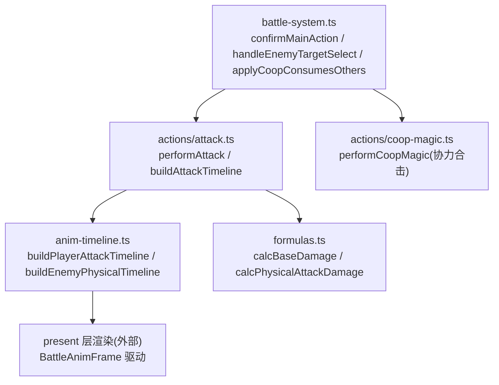
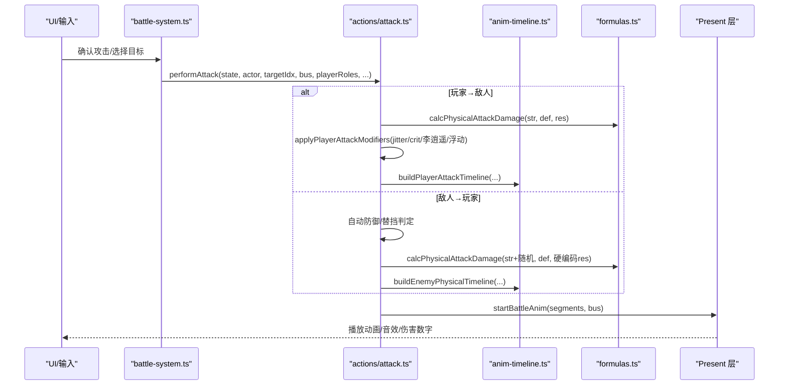
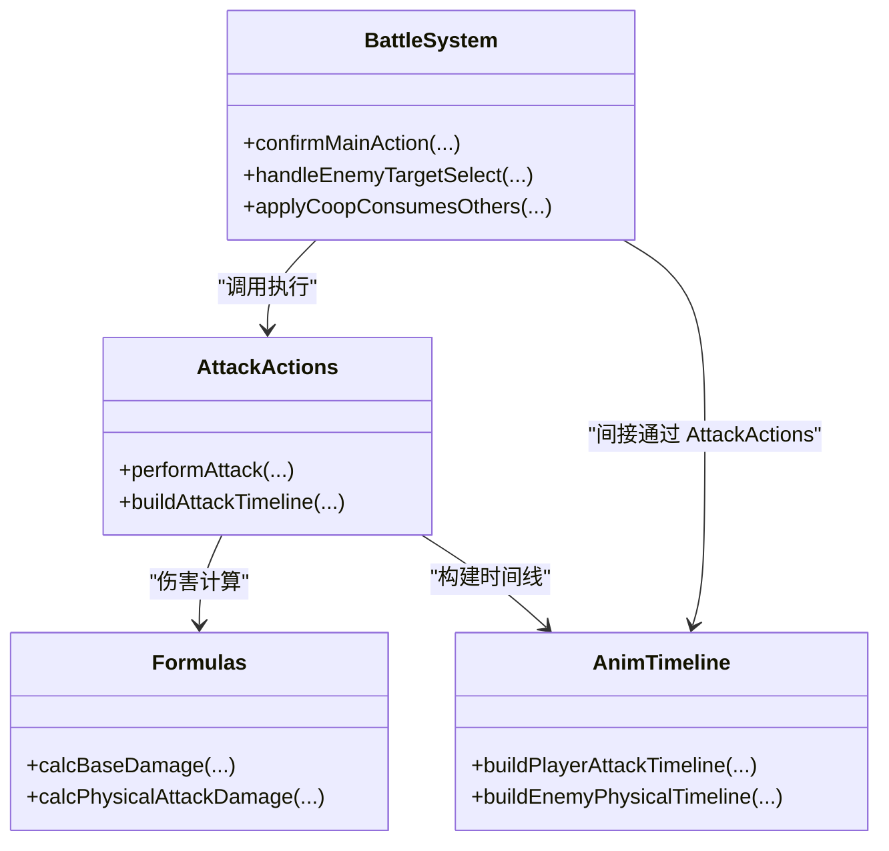

# 物理攻击动作

<cite>
**本文引用的文件**   
- [attack.ts](file://packages/game/src/core/battle/actions/attack.ts)
- [anim-timeline.ts](file://packages/game/src/core/battle/anim-timeline.ts)
- [formulas.ts](file://packages/game/src/core/battle/formulas.ts)
- [battle-system.ts](file://packages/game/src/core/battle/battle-system.ts)
- [README.md](file://README.md)
</cite>

## 目录
1. [引言](#引言)
2. [项目结构](#项目结构)
3. [核心组件](#核心组件)
4. [架构总览](#架构总览)
5. [详细组件分析](#详细组件分析)
6. [依赖关系分析](#依赖关系分析)
7. [性能与流畅性优化](#性能与流畅性优化)
8. [故障排查指南](#故障排查指南)
9. [结论](#结论)
10. [附录：新增物理攻击技能与自定义动画](#附录新增物理攻击技能与自定义动画)

## 引言
本文件聚焦 Type-Pal 第一阶段（忠实还原）中“物理攻击动作”的完整实现说明，覆盖普通攻击与连携攻击（协力合击）的伤害计算、命中判定、暴击处理、动画时间线（出招帧、命中帧、收招帧）、触发条件与协同伤害加成、方向判定与目标锁定逻辑，并提供扩展新物理攻击技能与自定义攻击动画的实践指引。所有机制均以 reference/sdlpal 源码为真值对照，TS 代码逐行对齐行为与时序。

## 项目结构
与物理攻击相关的核心代码位于 packages/game/src/core/battle 下：
- actions/attack.ts：物理攻击执行入口，含玩家→敌人、敌人→玩家、群攻、双击、被动格挡/替挡等分支。
- anim-timeline.ts：纯函数式动画时间线构建器，产出 BattleAnimFrame[]，驱动战斗演出。
- formulas.ts：伤害公式（基础伤害、物理伤害、魔法伤害、敏捷等）。
- battle-system.ts：战斗系统主流程，含目标选择、方向选择、行动队列推进、合击消耗与吞并后续行动等。

图表来源
- [attack.ts:112-435](file://packages/game/src/core/battle/actions/attack.ts#L112-L435)
- [anim-timeline.ts:311-458](file://packages/game/src/core/battle/anim-timeline.ts#L311-L458)
- [anim-timeline.ts:509-670](file://packages/game/src/core/battle/anim-timeline.ts#L509-L670)
- [formulas.ts:36-60](file://packages/game/src/core/battle/formulas.ts#L36-L60)
- [battle-system.ts:1256-1310](file://packages/game/src/core/battle/battle-system.ts#L1256-L1310)
- [battle-system.ts:1710-1725](file://packages/game/src/core/battle/battle-system.ts#L1710-L1725)
- [battle-system.ts:2878-2903](file://packages/game/src/core/battle/battle-system.ts#L2878-L2903)

章节来源
- [README.md:1-139](file://README.md#L1-L139)

## 核心组件
- performAttack：统一入口，按 actor 是玩家或敌人、targetIdx 是否全体、是否双击/群攻武器等分支，完成伤害计算、状态更新与动画调度。
- buildAttackTimeline：根据 actor/target 组合生成对应时间线（玩家→敌人、敌人→玩家），封装对 buildPlayerAttackTimeline/buildEnemyPhysicalTimeline 的调用。
- buildPlayerAttackTimeline：玩家物理攻击动画（前摇、冲刺、命中特效、受击抖动、收势）。
- buildEnemyPhysicalTimeline：敌人物理攻击动画（蓄力、冲锋、命中、击退、死亡/濒死姿态恢复、复位）。
- formulas：提供 calcBaseDamage 与 calcPhysicalAttackDamage，作为伤害计算的底层。

章节来源
- [attack.ts:112-435](file://packages/game/src/core/battle/actions/attack.ts#L112-L435)
- [attack.ts:503-581](file://packages/game/src/core/battle/actions/attack.ts#L503-L581)
- [anim-timeline.ts:311-458](file://packages/game/src/core/battle/anim-timeline.ts#L311-L458)
- [anim-timeline.ts:509-670](file://packages/game/src/core/battle/anim-timeline.ts#L509-L670)
- [formulas.ts:36-60](file://packages/game/src/core/battle/formulas.ts#L36-L60)

## 架构总览
物理攻击从输入到演出的关键路径如下：

图表来源
- [attack.ts:112-435](file://packages/game/src/core/battle/actions/attack.ts#L112-L435)
- [anim-timeline.ts:311-458](file://packages/game/src/core/battle/anim-timeline.ts#L311-L458)
- [anim-timeline.ts:509-670](file://packages/game/src/core/battle/anim-timeline.ts#L509-L670)
- [formulas.ts:36-60](file://packages/game/src/core/battle/formulas.ts#L36-L60)

## 详细组件分析

### 普通攻击（玩家→敌人）
- 伤害计算
  - 力量 str = 角色 attackStrength（已含装备，不含等级项）。
  - 防御 def = 敌方 defense + (敌方 level+6)*4。
  - 抗性 res = 敌方物理抗性。
  - 基础伤害 base = calcPhysicalAttackDamage(str, def, res)。
  - 修饰 applyPlayerAttackModifiers：
    - jitter：base + RandomLong(1,2)
    - 暴击：RandomLong(0,5)==0 或 bravery>0 → ×3，标记 fCritical
    - 李逍遥额外暴击：role==0 且 RandomLong(0,11)==0 → ×2，标记 fCritical
    - 末浮动：damage * RandomFloat(1,1.125)，SHORT 截断
    - damage<=0 → 1
- 命中与表现
  - 单体：一次或双击（dualAttack>0 时整段重复两次，含声音与动画）。
  - 群攻（attackAll 武器，targetIdx==-1）：固定遍历顺序 index[]={2,1,0,4,3}；每 sweep 重摇一次暴击；逐敌衰减 division 初 1，每命中一个活敌后 *=2；首 sweep 有 windup 前摇；每次挥砍后 Delay(4) 收势停顿。
- 动画时间线（buildPlayerAttackTimeline）
  - 出招帧：windup 时 frame7 举武器 4 帧（仅首击）；frame8 冲刺到敌前；frame1 微调位置。
  - 命中帧：frame9 + 命中特效 3 帧；i==0 帧 target 染色 iColorShift=6 并弹出伤害数字；i==1 帧 attacker 微位移。
  - 收招帧：3 帧抖动复位 iColorShift=0；群攻走 groupEnemies 全敌复位与位移序列。
- 声音
  - 出招声 attackSound/criticalSound 挂 swing 首帧；武器声 weaponSound 挂 currentFrame=9 同帧。

章节来源
- [attack.ts:126-141](file://packages/game/src/core/battle/actions/attack.ts#L126-L141)
- [attack.ts:150-237](file://packages/game/src/core/battle/actions/attack.ts#L150-L237)
- [attack.ts:239-297](file://packages/game/src/core/battle/actions/attack.ts#L239-L297)
- [attack.ts:82-101](file://packages/game/src/core/battle/actions/attack.ts#L82-L101)
- [anim-timeline.ts:311-458](file://packages/game/src/core/battle/anim-timeline.ts#L311-L458)

### 普通攻击（敌人→玩家）
- 伤害计算
  - 力量 str = 敌方 attackStrength + (敌方 level+6)*6（负数钳 0）。
  - 防御 def = 玩家 defense（含装备，无等级项），若 defending → ×2。
  - 抗性 res = 2（硬编码）。
  - 最终伤害 = calcPhysicalAttackDamage(str + RandomLong(0,2), def, 2) + RandomLong(0,1)；Protect 减半；<=0 → 1。
- 命中判定与替挡
  - 自动防御闪避：fAutoDefend = RandomLong(0,16)>=10（7/17 概率）。
  - 替挡 cover：当目标濒死/坏状态且 fAutoDefend 命中时，查找 coveredBy 健康队友替挡；替挡者自身坏状态/濒死则无效。
  - 坏状态强制不闪避：若无替挡且目标处于混乱/睡眠/麻痹，则 fAutoDefend=false。
- 动画时间线（buildEnemyPhysicalTimeline）
  - 蓄力：magicFrames 帧 idleFrames+i，Delay(2)；随后 (3-magicFrames) 步前移。
  - 冲锋：attackFrames==0 用 idleFrames-1，否则循环 attackFrames 次，actWaitFrames 控制停留。
  - 命中：target.currentFrame=4，iColorShift=6，显示伤害数字；callSound 在命中帧播。
  - 击退：iColorShift=0，target.pos+=(8,4)；死亡/濒死追加 pos+=(2,1) 并延时。
  - 复位：enemy 回到原位 frame0；target 恢复 wFrameBak（睡姿/防姿/站立），updateGesture=true 推进 idle 呼吸，避免卡顿。
- 附加效果
  - 等价物品中毒：满足 rate 与 poisonResistance 阈值后，运行 item.scriptOnUse（以被打队员 role 为 eventObjectId）。

章节来源
- [attack.ts:299-435](file://packages/game/src/core/battle/actions/attack.ts#L299-L435)
- [anim-timeline.ts:509-670](file://packages/game/src/core/battle/anim-timeline.ts#L509-L670)
- [formulas.ts:54-60](file://packages/game/src/core/battle/formulas.ts#L54-L60)

### 连携攻击（协力合击）
- 触发条件
  - 仅玩家可发起；actionId 来自 cooperativeMagic（可被装备 override）。
  - contributors 为所有 healthy 队员；人数<=1 退化普通攻击（选单有效性已门控）。
- 协同伤害加成
  - HP 代价：每个 contributor 扣除 magic.costMP（实际为 HP，见注释）。
  - 强度 str = Σ(PAL_GetPlayerAttackStrength + PAL_GetPlayerMagicStrength) over contributors，再 /4。
  - 伤害 = PAL_CalcMagicDamage(str, ...)；minDamage=1；目标由 magic.type/flag 决定（全体或单体）。
- 动画时间线
  - Phase1 聚拢：贡献者线性插值滑向 COOP_POS。
  - Phase2 蓄势：非发起贡献者逐个切施法姿 frame5。
  - Phase3/4 发起者闪白与出招。
  - Phase5 OffMagic：法术特效。
  - Phase6 PostMagic：受伤敌抖动。
  - Phase7 滑回：反向插值归位。

章节来源
- [battle-system.ts:2878-2903](file://packages/game/src/core/battle/battle-system.ts#L2878-L2903)
- [battle-system.ts:1710-1725](file://packages/game/src/core/battle/battle-system.ts#L1710-L1725)
- [anim-timeline.ts:1148-1196](file://packages/game/src/core/battle/anim-timeline.ts#L1148-L1196)

### 动画时间线精解（出招帧、命中帧、收招帧）
- 玩家物理攻击
  - 出招帧：windup 前摇 frame7 4 帧（仅首击）；frame8 冲刺；frame1 微调。
  - 命中帧：frame9 + 命中特效 3 帧；i==0 帧染色+伤害数字；i==1 帧微位移。
  - 收招帧：3 帧抖动复位；群攻全敌位移序列。
- 敌人物理攻击
  - 蓄力/冲锋：magicFrames + 前移步数 + actWaitFrames 停留。
  - 命中帧：target.frame=4 + 染色 + 伤害数字 + callSound。
  - 收招帧：击退、死亡/濒死姿态、复位至原位与 frameBak，updateGesture=true 推进 idle。

章节来源
- [anim-timeline.ts:311-458](file://packages/game/src/core/battle/anim-timeline.ts#L311-L458)
- [anim-timeline.ts:509-670](file://packages/game/src/core/battle/anim-timeline.ts#L509-L670)

### 方向判定与目标锁定
- 方向选择：Up/Down/Left/Right 切换选中动作，Confirm 提交；当前动作失效回退到攻击。
- 目标锁定：
  - 全体目标态：进入即提交，避免多余高亮帧。
  - 单体目标态：仅 1 活敌时同 tick 立即 commit，跳过高亮闪烁。
  - 光标环绕死敌；菜单返回 selectMove。
  - 普攻与群攻武器互转：若 action.target==-1 但无 attackAll 能力，则自动选单个活敌；反之将 target 置 -1。

章节来源
- [battle-system.ts:1256-1310](file://packages/game/src/core/battle/battle-system.ts#L1256-L1310)
- [battle-system.ts:1804-1825](file://packages/game/src/core/battle/battle-system.ts#L1804-L1825)
- [battle-system.ts:2595-2607](file://packages/game/src/core/battle/battle-system.ts#L2595-L2607)

## 依赖关系分析
- actions/attack.ts 依赖：
  - formulas.ts：伤害计算。
  - anim-timeline.ts：动画时间线构建。
  - command-bus：Present 命令通道。
  - equip-effect：毒抗等辅助。
  - rng：随机源。
- anim-timeline.ts 依赖：
  - battle-state：BattleAnimFrame/FighterDelta 类型。
- battle-system.ts 依赖：
  - actions/attack.ts：执行攻击。
  - actions/magic.ts、actions/coop-magic.ts：法术与合击。
  - uibattle 相关：UI 状态机与输入分发。

图表来源
- [attack.ts:112-435](file://packages/game/src/core/battle/actions/attack.ts#L112-L435)
- [anim-timeline.ts:311-458](file://packages/game/src/core/battle/anim-timeline.ts#L311-L458)
- [anim-timeline.ts:509-670](file://packages/game/src/core/battle/anim-timeline.ts#L509-L670)
- [formulas.ts:36-60](file://packages/game/src/core/battle/formulas.ts#L36-L60)
- [battle-system.ts:1256-1310](file://packages/game/src/core/battle/battle-system.ts#L1256-L1310)

## 性能与流畅性优化
- 动画帧时长与节奏
  - BATTLE_FRAME_TIME=40ms，Delay(N)=N×40ms。合理设置 actWaitFrames、windup 与收势 Delay，避免过短导致“瞬移感”。
- 减少不必要的重绘
  - updateGesture=true 仅在收尾两帧使用，使 idle 呼吸推进，避免全画面冻结导致的卡顿。
- 声音同步
  - 将出招声/武器声挂入时间线帧.sound，避免双击两段重叠成一次的问题。
- 群攻收势停顿
  - 每次挥砍后补 Delay(4) 收势停顿，保持与原版一致的节奏。
- 旧 fixture 兼容
  - 缺 posOriginal 时退回即时 emit 数字与声音，保证测试与回归稳定。

章节来源
- [anim-timeline.ts:27-35](file://packages/game/src/core/battle/anim-timeline.ts#L27-L35)
- [anim-timeline.ts:650-668](file://packages/game/src/core/battle/anim-timeline.ts#L650-L668)
- [attack.ts:220-236](file://packages/game/src/core/battle/actions/attack.ts#L220-L236)
- [attack.ts:258-291](file://packages/game/src/core/battle/actions/attack.ts#L258-L291)

## 故障排查指南
- 敌人普攻只出声无动画
  - 现象：高级草妖普攻只播声音，无动作、无受击、无掉血。
  - 原因：此前只 emit 声音 return，未建动画时间线。
  - 修复：格挡/替挡均建时间线，frame3 格挡姿 + coverSound，lunge 照常，不掉血。
- 双击出招音重叠
  - 现象：单体/群攻双击时出招声只响一次。
  - 原因：loop 内同步 bus.emit 导致同 tick drain 重叠。
  - 修复：改挂时间线帧.sound，随帧错开各响。
- 群攻衔接过快
  - 现象：全体攻击武器挥砍完没有短暂收势停顿。
  - 修复：每次挥砍后补 Delay(4) 收势停顿。
- 受击复位卡顿
  - 现象：物攻收尾“回一半→卡顿→瞬移”。
  - 修复：将坐标复位提前并入 frameBak 帧，配合 updateGesture=true，200ms 停顿期人已就位。

章节来源
- [attack.ts:336-356](file://packages/game/src/core/battle/actions/attack.ts#L336-L356)
- [attack.ts:258-291](file://packages/game/src/core/battle/actions/attack.ts#L258-L291)
- [attack.ts:220-236](file://packages/game/src/core/battle/actions/attack.ts#L220-L236)
- [anim-timeline.ts:650-668](file://packages/game/src/core/battle/anim-timeline.ts#L650-L668)

## 结论
Type-Pal 的物理攻击系统在 TS 中严格复刻 sdlpal 的行为与时序，涵盖伤害计算、暴击、群攻衰减、被动格挡/替挡、动画时间线与声音同步等关键点。通过纯函数式时间线构建与帧级控制，既保证了与原版的 1:1 一致性，也为后续扩展新技能与自定义动画提供了清晰的接入点。

## 附录：新增物理攻击技能与自定义动画
- 添加新物理攻击技能（数据侧）
  - 在内容数据中为新角色/武器定义 attackAll、dualAttack、weaponSound、criticalSound、coverSound 等字段，确保 performAttack 分支能正确读取。
  - 若需新的“连携”型物理攻击，参考协力合击的触发与伤害聚合逻辑，在 battle-system.ts 的 action 派发处增加新 case，并在 actions/ 下新建对应 perform 模块。
- 自定义攻击动画
  - 在 anim-timeline.ts 中新增 buildXxxAttackTimeline(input): BattleAnimFrame[]，遵循以下约定：
    - 输入包含 attackerPos/targetPos、idx、effectFrameBase、damage、sound 等只读快照。
    - 输出帧数组使用 delayMs(frames) 控制时长，fighters 描述精灵帧/位移/染色，overlay 描述命中特效，damageNum/damageNums 描述伤害数字。
    - 在 actions/attack.ts 的 buildAttackTimeline 中增加分支，根据 actor/target 组合调用新 builder。
  - 注意：
    - 声音挂入 frame.sound，避免同 tick 重叠。
    - 群攻路径如需参与全敌位移/染色，传入 groupEnemies 列表。
    - 收尾阶段使用 updateGesture=true 推进 idle，避免卡顿。
- 验证与回归
  - 使用 e2e 与 unit 测试覆盖关键时序与数值边界（如 dualAttack、群攻衰减、被动格挡/替挡）。
  - 对照 sdlpal 差异审计清单逐项核对，确保行为一致。

章节来源
- [attack.ts:503-581](file://packages/game/src/core/battle/actions/attack.ts#L503-L581)
- [anim-timeline.ts:311-458](file://packages/game/src/core/battle/anim-timeline.ts#L311-L458)
- [anim-timeline.ts:509-670](file://packages/game/src/core/battle/anim-timeline.ts#L509-L670)
- [battle-system.ts:2878-2903](file://packages/game/src/core/battle/battle-system.ts#L2878-L2903)