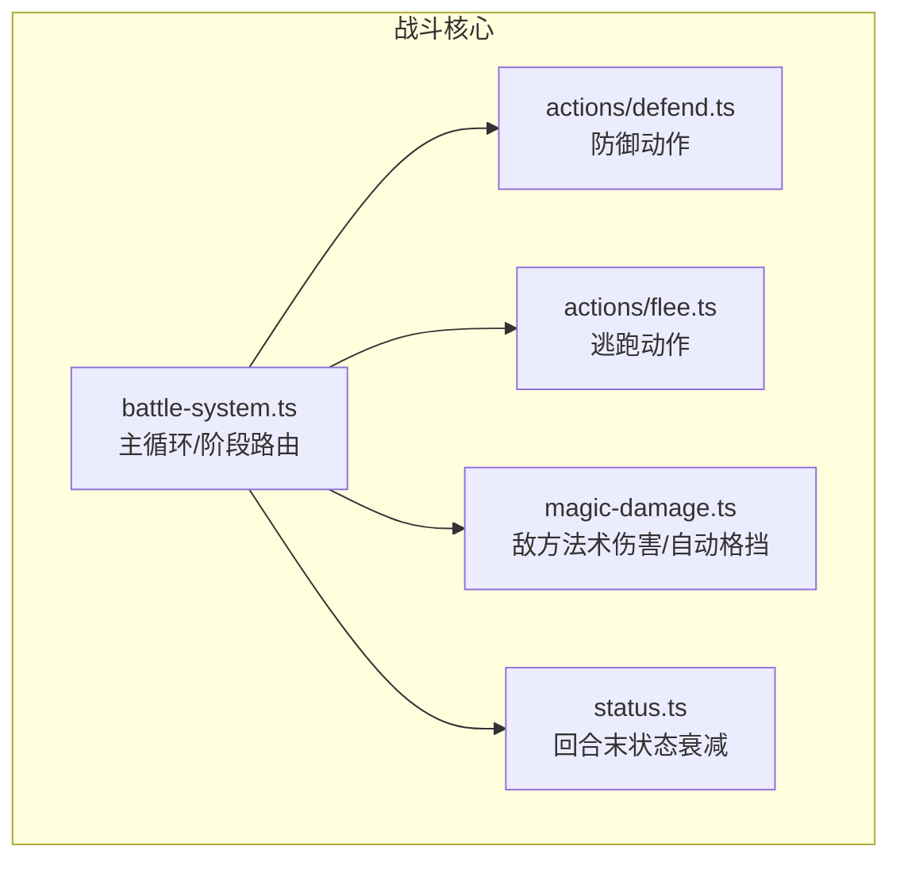
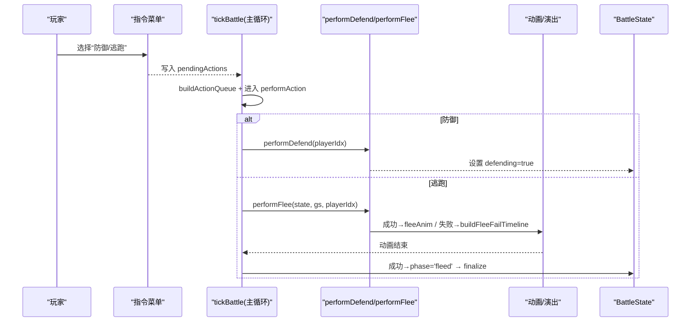
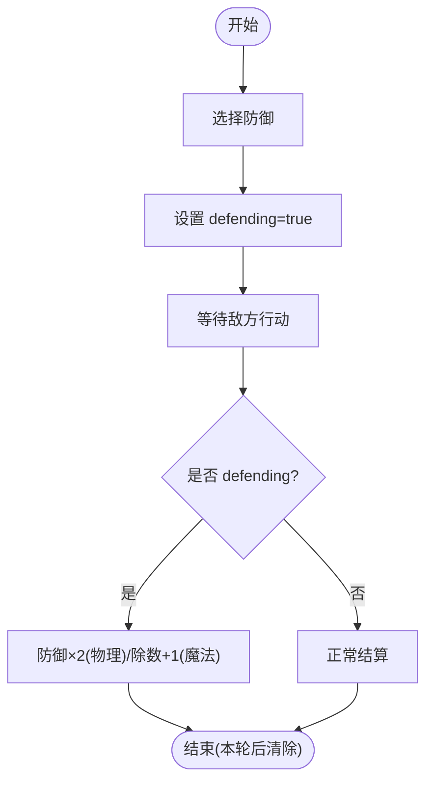
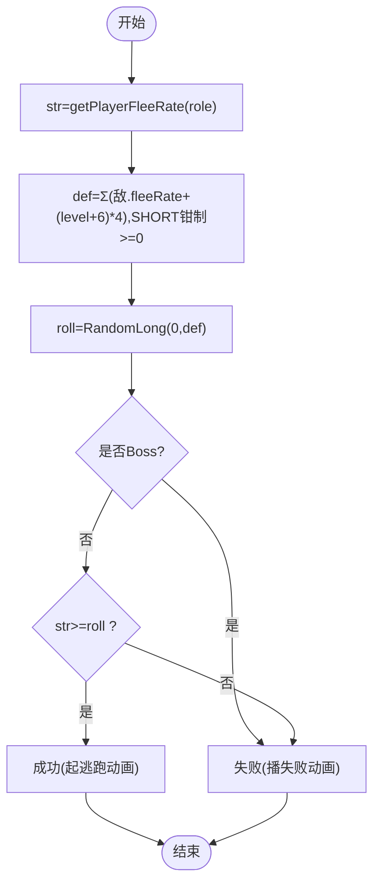
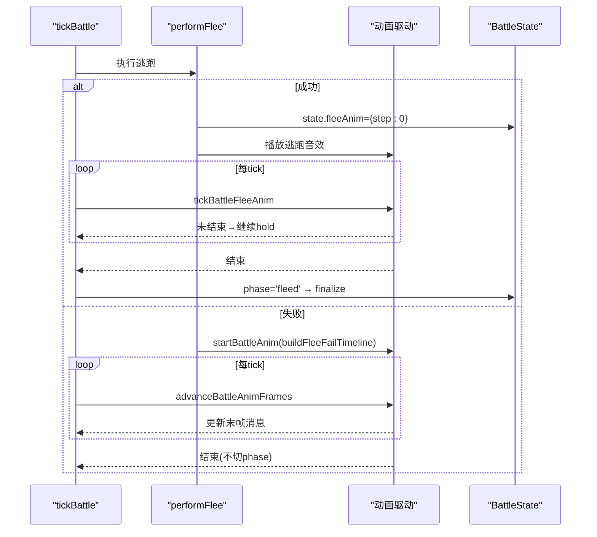
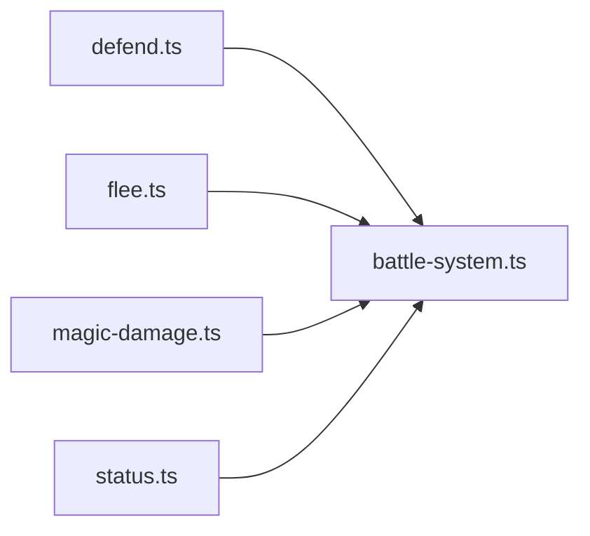

# 防御与逃跑系统

<cite>
**本文引用的文件**
- [flee.ts](file://packages/game/src/core/battle/actions/flee.ts)
- [defend.ts](file://packages/game/src/core/battle/actions/defend.ts)
- [battle-system.ts](file://packages/game/src/core/battle/battle-system.ts)
- [magic-damage.ts](file://packages/game/src/core/battle/magic-damage.ts)
- [status.ts](file://packages/game/src/core/battle/status.ts)
- [actions.test.ts](file://packages/game/src/core/battle/__tests__/actions.test.ts)
- [e2e-battle.test.ts](file://packages/game/src/__tests__/e2e-battle.test.ts)
- [feature-status-audit.md](file://docs/phase1/plans/2026-06-01-feature-status-audit.md)
- [enemy-ai-plan.md](file://docs/phase1/plans/2026-05-31-d-batch2-enemy-ai.md)
</cite>

## 目录
1. [简介](#简介)
2. [项目结构](#项目结构)
3. [核心组件](#核心组件)
4. [架构总览](#架构总览)
5. [详细组件分析](#详细组件分析)
6. [依赖关系分析](#依赖关系分析)
7. [性能考量](#性能考量)
8. [故障排查指南](#故障排查指南)
9. [结论](#结论)
10. [附录](#附录)

## 简介
本文件聚焦 Type-Pal 的“防御”与“逃跑”两大子系统，围绕以下目标展开：
- 防御姿态机制：伤害减免比例、持续时间控制、状态标记与 UI/视觉反馈。
- 逃跑成功率计算：敏捷值影响、敌人强度与随机因子；并说明修复版与原版的差异。
- 逃跑动画序列：退出特效与场景过渡处理。
- 防御状态的视觉效果与 UI 反馈机制。
- 逃跑失败后的惩罚机制与状态影响。
- 自定义示例路径：如何扩展防御效果与调整逃跑条件。
- 平衡性与用户体验优化建议。

## 项目结构
与防御/逃跑相关的核心代码位于战斗模块 actions 与 battle-system 中，配合状态衰减与动画驱动完成完整流程。

图示来源
- [battle-system.ts:472-614](file://packages/game/src/core/battle/battle-system.ts#L472-L614)
- [defend.ts:17-21](file://packages/game/src/core/battle/actions/defend.ts#L17-L21)
- [flee.ts:36-76](file://packages/game/src/core/battle/actions/flee.ts#L36-L76)
- [magic-damage.ts:195-270](file://packages/game/src/core/battle/magic-damage.ts#L195-L270)
- [status.ts:30-35](file://packages/game/src/core/battle/status.ts#L30-L35)

章节来源
- [battle-system.ts:472-614](file://packages/game/src/core/battle/battle-system.ts#L472-L614)
- [defend.ts:17-21](file://packages/game/src/core/battle/actions/defend.ts#L17-L21)
- [flee.ts:36-76](file://packages/game/src/core/battle/actions/flee.ts#L36-L76)
- [magic-damage.ts:195-270](file://packages/game/src/core/battle/magic-damage.ts#L195-L270)
- [status.ts:30-35](file://packages/game/src/core/battle/status.ts#L30-L35)

## 核心组件
- 防御动作 performDefend：为当前玩家设置 defending 标志，后续敌方攻击结算时按规则倍增防御。
- 逃跑动作 performFlee：计算 str/def 与随机 roll，决定成功或失败；成功触发逃跑动画，失败播放失败动画并累积隐藏经验计数。
- 战斗主循环 tickBattle：在 selectAction/performAction/postAction 等阶段间流转，并在特定 hold（如逃跑动画）期间暂停推进。
- 敌方法术伤害 applyEnemyMagicDamage：包含 auto-defend 判定与除数因子（含 defending 与 Protect）。
- 状态衰减 tickStatusEffects：每回合统一递减所有 status 计数器（含 protect 等布尔类状态）。

章节来源
- [defend.ts:17-21](file://packages/game/src/core/battle/actions/defend.ts#L17-L21)
- [flee.ts:36-76](file://packages/game/src/core/battle/actions/flee.ts#L36-L76)
- [battle-system.ts:472-614](file://packages/game/src/core/battle/battle-system.ts#L472-L614)
- [magic-damage.ts:195-270](file://packages/game/src/core/battle/magic-damage.ts#L195-L270)
- [status.ts:30-35](file://packages/game/src/core/battle/status.ts#L30-L35)

## 架构总览
下图展示从“选择防御/逃跑”到“动画与阶段切换”的端到端流程。

图示来源
- [battle-system.ts:576-614](file://packages/game/src/core/battle/battle-system.ts#L576-L614)
- [defend.ts:17-21](file://packages/game/src/core/battle/actions/defend.ts#L17-L21)
- [flee.ts:36-76](file://packages/game/src/core/battle/actions/flee.ts#L36-L76)

## 详细组件分析

### 防御姿态机制
- 状态标记：performDefend 将对应玩家的 defending 置为 true。
- 伤害减免：
  - 物理：敌方对玩家物理伤害结算时，若 defending 为真，则防御乘 2（等价于伤害减半）。
  - 魔法：敌方对玩家法术伤害结算时，除数因子包含 defending（×2），同时可叠加 Protect 与 auto-defend 额外减伤。
- 持续时间：defending 仅持续一轮，postAction 阶段会被清除（由主循环负责）。
- 行动顺序：防御动作的 dex 倍率为 5，确保防御方优先出手，从而在首轮即进入防御姿。

图示来源
- [defend.ts:17-21](file://packages/game/src/core/battle/actions/defend.ts#L17-L21)
- [battle-system.ts:679-701](file://packages/game/src/core/battle/battle-system.ts#L679-L701)
- [magic-damage.ts:256-260](file://packages/game/src/core/battle/magic-damage.ts#L256-L260)

章节来源
- [defend.ts:17-21](file://packages/game/src/core/battle/actions/defend.ts#L17-L21)
- [battle-system.ts:679-701](file://packages/game/src/core/battle/battle-system.ts#L679-L701)
- [magic-damage.ts:256-260](file://packages/game/src/core/battle/magic-damage.ts#L256-L260)

### 逃跑成功率计算
- 公式（修复版）：
  - str = getPlayerFleeRate(role)（角色基础 fleeRate + 装备加成）
  - def = Σ[敌人(fleeRate + (level+6)*4)]，且对 SHORT 负溢出钳制为 0
  - success = (str >= RandomLong(0, def)) && !isBoss
- 关键差异与修复：
  - 原版 bug：抵抗项误用敌人“身法”，实际应为“吉运”。本项目采用修复版，使数据表中的敌人 fleeRate 生效。
  - 装备感知：str 使用运行时 getter，已包含装备授予的 fleeRate 加成。
- Boss 战不可逃：isBoss 直接失败分支，但仍会播放失败动画并推进队列。

图示来源
- [flee.ts:36-76](file://packages/game/src/core/battle/actions/flee.ts#L36-L76)

章节来源
- [flee.ts:36-76](file://packages/game/src/core/battle/actions/flee.ts#L36-L76)
- [actions.test.ts:988-1078](file://packages/game/src/core/battle/__tests__/actions.test.ts#L988-L1078)
- [feature-status-audit.md:23-31](file://docs/phase1/plans/2026-06-01-feature-status-audit.md#L23-L31)

### 逃跑动画序列与场景过渡
- 成功逃跑：
  - 设置 fleeAnim={step:0}，播放 16 步右下滑移出屏的动画；动画结束后 phase 切至 'fleed'，随后 finalize 回到探索。
  - 播放逃跑音效（sound id 45）。
- 失败逃跑：
  - 为该队员构建失败时间线（3 步右下挪 + 帧1 濒死姿），通过 battleAnim 驱动播放；末帧显示“逃跑失败”文字。
  - 不改变 phase，继续推进回合。
- 主循环 hold：
  - 在 tickBattle 中，当 fleeAnim 或 battleAnim 活跃时，暂停其他推进逻辑，直至动画结束。

图示来源
- [battle-system.ts:508-514](file://packages/game/src/core/battle/battle-system.ts#L508-L514)
- [flee.ts:57-76](file://packages/game/src/core/battle/actions/flee.ts#L57-L76)

章节来源
- [battle-system.ts:508-514](file://packages/game/src/core/battle/battle-system.ts#L508-L514)
- [flee.ts:57-76](file://packages/game/src/core/battle/actions/flee.ts#L57-L76)

### 防御状态的视觉效果与 UI 反馈
- 视觉表现：
  - 防御姿：在敌方攻击结算时，根据 defending 标志消费该状态，表现为防御姿态帧（物理/魔法均适用）。
  - 自动格挡（auto-defend）：敌方法术命中前，有 1/3 概率触发，进一步增加除数因子。
- UI 反馈：
  - 防御：无独立弹窗，但可通过状态栏/精灵姿态变化体现。
  - 逃跑失败：在失败动画末帧显示“逃跑失败”文字提示。
  - 逃跑成功：播放逃跑音效，随后进入 fleed 终态。

章节来源
- [magic-damage.ts:170-193](file://packages/game/src/core/battle/magic-damage.ts#L170-L193)
- [magic-damage.ts:256-260](file://packages/game/src/core/battle/magic-damage.ts#L256-L260)
- [flee.ts:64-76](file://packages/game/src/core/battle/actions/flee.ts#L64-L76)

### 逃跑失败后的惩罚机制与状态影响
- 不改变 phase：失败不会中断回合，后续行动继续推进。
- 隐藏经验累积：每次失败为对应角色的“逃跑经验”计数 +2（用于隐藏经验统计）。
- 行为一致性：即使 boss 战，也会走失败分支并播放失败动画，保证反馈一致。

章节来源
- [flee.ts:64-76](file://packages/game/src/core/battle/actions/flee.ts#L64-L76)
- [actions.test.ts:1053-1065](file://packages/game/src/core/battle/__tests__/actions.test.ts#L1053-L1065)

### 自定义示例（以路径代替代码片段）
- 自定义防御效果（例如引入护盾层数或额外抗性）：
  - 参考路径：[defend.ts:17-21](file://packages/game/src/core/battle/actions/defend.ts#L17-L21)
  - 修改点：在 performDefend 中追加新的状态字段（如 shieldStacks），并在物理/魔法伤害结算处读取该字段进行二次减免。
- 自定义逃跑条件（例如加入技能/道具临时提升 fleeRate）：
  - 参考路径：[flee.ts:36-76](file://packages/game/src/core/battle/actions/flee.ts#L36-L76)
  - 修改点：在计算 str 之前注入临时 buff（如来自技能或道具），再调用 getPlayerFleeRate 获取最终 str。
- 调整逃跑动画时长或失败文案：
  - 参考路径：[flee.ts:64-76](file://packages/game/src/core/battle/actions/flee.ts#L64-L76)
  - 修改点：替换文本常量或调整动画帧参数。

章节来源
- [defend.ts:17-21](file://packages/game/src/core/battle/actions/defend.ts#L17-L21)
- [flee.ts:36-76](file://packages/game/src/core/battle/actions/flee.ts#L36-L76)

## 依赖关系分析
- 防御与逃跑均依赖 battle-system 的主循环与阶段管理。
- 防御对伤害结算的影响贯穿物理与魔法两条路径。
- 逃跑依赖 RNG、动画驱动与音效系统。
- 状态衰减与防御/逃跑共同受回合推进节奏影响。

图示来源
- [defend.ts:17-21](file://packages/game/src/core/battle/actions/defend.ts#L17-L21)
- [flee.ts:36-76](file://packages/game/src/core/battle/actions/flee.ts#L36-L76)
- [magic-damage.ts:195-270](file://packages/game/src/core/battle/magic-damage.ts#L195-L270)
- [status.ts:30-35](file://packages/game/src/core/battle/status.ts#L30-L35)
- [battle-system.ts:472-614](file://packages/game/src/core/battle/battle-system.ts#L472-L614)

章节来源
- [battle-system.ts:472-614](file://packages/game/src/core/battle/battle-system.ts#L472-L614)
- [defend.ts:17-21](file://packages/game/src/core/battle/actions/defend.ts#L17-L21)
- [flee.ts:36-76](file://packages/game/src/core/battle/actions/flee.ts#L36-L76)
- [magic-damage.ts:195-270](file://packages/game/src/core/battle/magic-damage.ts#L195-L270)
- [status.ts:30-35](file://packages/game/src/core/battle/status.ts#L30-L35)

## 性能考量
- 动画 hold 避免每 tick 重复计算：在 fleeAnim/battleAnim 活跃时，主循环提前 return，减少不必要的状态推进。
- 短整型钳制与简单算术：def 累加后进行 SHORT 钳制，避免异常值导致的数值爆炸。
- 批量状态衰减：tickStatusEffects 一次性遍历所有参与者，保持 O(n) 复杂度。

## 故障排查指南
- 防御无效：
  - 检查 performDefend 是否被调用（pendingActions 是否正确写入）。
  - 确认 postAction 阶段是否清除了 defending。
  - 参考路径：[defend.ts:17-21](file://packages/game/src/core/battle/actions/defend.ts#L17-L21)
- 逃跑总是失败：
  - 核对 isBoss 是否为 true。
  - 检查 str 是否包含装备加成（getPlayerFleeRate）。
  - 验证 def 计算是否包含所有活敌，且 SHORT 钳制正确。
  - 参考路径：[flee.ts:36-76](file://packages/game/src/core/battle/actions/flee.ts#L36-L76)
- 逃跑动画不播放：
  - 确认 tickBattle 是否在 fleeAnim 活跃时 hold。
  - 检查动画驱动是否返回“未完成”导致 continue。
  - 参考路径：[battle-system.ts:508-514](file://packages/game/src/core/battle/battle-system.ts#L508-L514)
- 失败文案未出现：
  - 检查失败时间线末帧是否设置了 battleMessage。
  - 参考路径：[flee.ts:64-76](file://packages/game/src/core/battle/actions/flee.ts#L64-L76)

章节来源
- [defend.ts:17-21](file://packages/game/src/core/battle/actions/defend.ts#L17-L21)
- [flee.ts:36-76](file://packages/game/src/core/battle/actions/flee.ts#L36-L76)
- [battle-system.ts:508-514](file://packages/game/src/core/battle/battle-system.ts#L508-L514)

## 结论
- 防御系统通过简单的 defending 标志与伤害结算处的乘除因子实现稳定、可预期的减伤体验。
- 逃跑系统在修复版下更贴合设计意图：以“吉运 vs 吉运”为核心，结合等级与随机性，提供可控的策略空间。
- 动画与主循环的 hold 机制保证了演出与玩法的一致性，失败/成功均有明确反馈。
- 建议在后续迭代中关注平衡性微调（如 fleeRate 上限、defending 的魔法除数权重）与 UX 细节（失败提示时机、音效音量）。

## 附录
- 相关审计与计划文档：
  - 逃跑公式简化与高估修正记录：[feature-status-audit.md:23-31](file://docs/phase1/plans/2026-06-01-feature-status-audit.md#L23-L31)
  - 敌方 AI 与防御/守护相关改动要点：[enemy-ai-plan.md:45-59](file://docs/phase1/plans/2026-05-31-d-batch2-enemy-ai.md#L45-L59)
- 测试用例参考：
  - 逃跑失败动画与隐藏经验累积：[actions.test.ts:1053-1065](file://packages/game/src/core/battle/__tests__/actions.test.ts#L1053-L1065)
  - 装备 fleeRate 加成生效：[actions.test.ts:1067-1078](file://packages/game/src/core/battle/__tests__/actions.test.ts#L1067-L1078)
  - e2e 快速逃跑流程：[e2e-battle.test.ts:260-291](file://packages/game/src/__tests__/e2e-battle.test.ts#L260-L291)