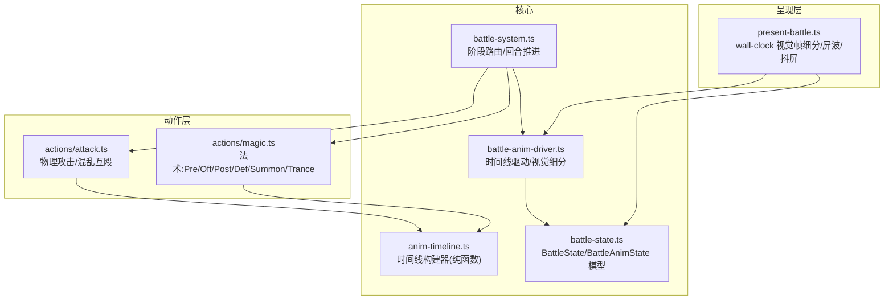
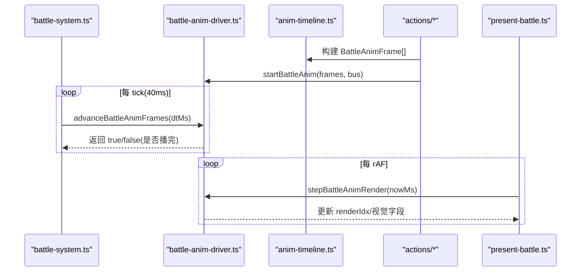
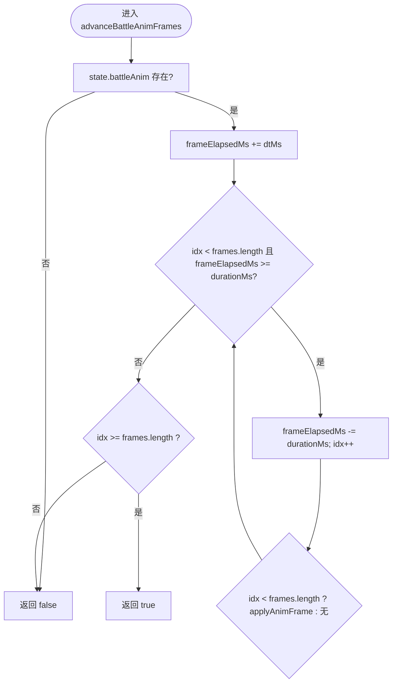
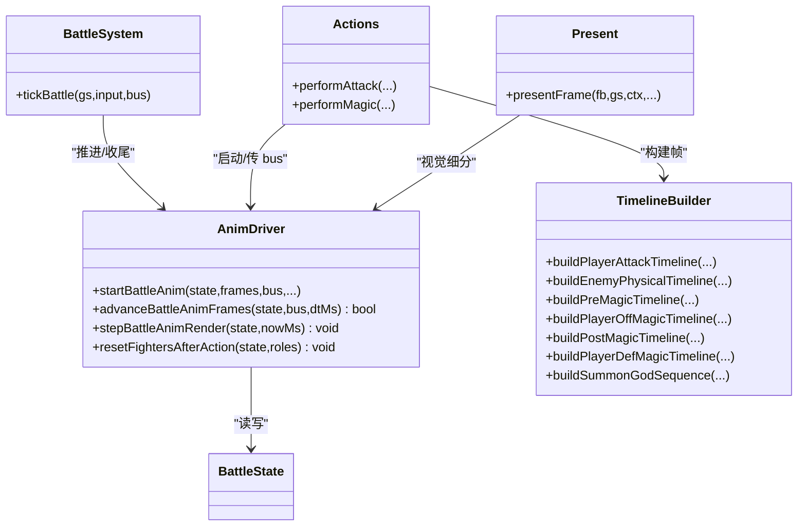

# 战斗动画系统

<cite>
**本文引用的文件**   
- [battle-anim-driver.ts](file://packages/game/src/core/battle/battle-anim-driver.ts)
- [battle-system.ts](file://packages/game/src/core/battle/battle-system.ts)
- [battle-state.ts](file://packages/game/src/core/battle/battle-state.ts)
- [anim-timeline.ts](file://packages/game/src/core/battle/anim-timeline.ts)
- [attack.ts](file://packages/game/src/core/battle/actions/attack.ts)
- [magic.ts](file://packages/game/src/core/battle/actions/magic.ts)
- [present-battle.ts](file://packages/game/src/present/battle/present-battle.ts)
</cite>

## 目录
1. [简介](#简介)
2. [项目结构](#项目结构)
3. [核心组件](#核心组件)
4. [架构总览](#架构总览)
5. [详细组件分析](#详细组件分析)
6. [依赖关系分析](#依赖关系分析)
7. [性能考虑](#性能考虑)
8. [故障排查指南](#故障排查指南)
9. [结论](#结论)
10. [附录](#附录)

## 简介
本文件为 Type-Pal 战斗动画系统的权威技术文档，聚焦“时间线驱动”的动画架构：以声明式帧序列（BattleAnimFrame）为核心，通过逻辑 tick 推进与渲染细分双通道，实现伤害数字、特效精灵、音效与文本的精确时序同步。文档覆盖状态管理（队列、优先级、中断）、与游戏逻辑的同步方式、性能优化策略、调试工具使用，以及扩展接口与插件化设计，并给出创建新动画序列与自定义事件的实践路径。

## 项目结构
围绕战斗动画的关键模块组织如下：
- 动画驱动层：负责启动、推进、视觉细分与收尾复位
- 时间线构建器：纯函数产出帧序列，描述位移、帧号、特效、声音、文字等
- 动作执行器：物理攻击与法术在各自 perform* 中构建时间线并交由驱动播放
- 战斗主循环：phase 路由、hold 控制、与动画驱动的协作
- 呈现层：按 wall-clock 计算 renderIdx，平滑非 40ms 整数倍帧的拍频

图表来源
- [battle-system.ts](file://packages/game/src/core/battle/battle-system.ts)
- [battle-anim-driver.ts](file://packages/game/src/core/battle/battle-anim-driver.ts)
- [anim-timeline.ts](file://packages/game/src/core/battle/anim-timeline.ts)
- [battle-state.ts](file://packages/game/src/core/battle/battle-state.ts)
- [attack.ts](file://packages/game/src/core/battle/actions/attack.ts)
- [magic.ts](file://packages/game/src/core/battle/actions/magic.ts)
- [present-battle.ts](file://packages/game/src/present/battle/present-battle.ts)

章节来源
- [battle-system.ts](file://packages/game/src/core/battle/battle-system.ts)
- [battle-anim-driver.ts](file://packages/game/src/core/battle/battle-anim-driver.ts)
- [anim-timeline.ts](file://packages/game/src/core/battle/anim-timeline.ts)
- [battle-state.ts](file://packages/game/src/core/battle/battle-state.ts)
- [attack.ts](file://packages/game/src/core/battle/actions/attack.ts)
- [magic.ts](file://packages/game/src/core/battle/actions/magic.ts)
- [present-battle.ts](file://packages/game/src/present/battle/present-battle.ts)

## 核心组件
- 动画驱动（battle-anim-driver.ts）
  - startBattleAnim：设置 BattleAnimState，立即应用首帧
  - advanceBattleAnimFrames：每 tick 累加 frameElapsedMs，跨多帧推进并触发副作用
  - stepBattleAnimRender：present 端 wall-clock 计算 renderIdx，仅刷视觉字段
  - applyAnimFrame / applyAnimFrameVisual：将 fighters/overlay/damageNum/sound/message 落到 state 或 emit
  - resetFightersAfterAction：动作结束后统一复位 fighter 位置、姿态、idle 计数
- 时间线构建器（anim-timeline.ts）
  - 提供 buildPlayerAttackTimeline、buildEnemyPhysicalTimeline、buildPreMagicTimeline、buildPlayerOffMagicTimeline、buildPostMagicTimeline、buildPlayerDefMagicTimeline、buildSummonGodSequence 等纯函数
  - 常量 BATTLE_FRAME_TIME=40ms；EFFECT_SPRITE_CHUNK=10
- 动作执行器（actions/attack.ts, actions/magic.ts）
  - 物理攻击：根据目标类型与是否群攻构建时间线，挂出招声/武器声/命中特效/伤害数字
  - 法术：按类型分发到 Pre/Off/Post/Def/Summon/Trance 链，延迟伤害数字至正确帧
- 战斗主循环（battle-system.ts）
  - tickBattle 负责 phase 路由、各类 hold（淡出、对话、逃跑、结算），并在 selectAction/performAction 阶段推进动画
  - 引入 INTRO_FADE_TICKS、BATTLE_DT 等常量
- 状态模型（battle-state.ts）
  - BattleState、BattleAnimState、BattleAnimFrame、SummonFrameState 等定义
  - 包含 persistentBgBlits、introFade、battleFade、battleDialogQueue 等运行时字段

章节来源
- [battle-anim-driver.ts](file://packages/game/src/core/battle/battle-anim-driver.ts)
- [anim-timeline.ts](file://packages/game/src/core/battle/anim-timeline.ts)
- [attack.ts](file://packages/game/src/core/battle/actions/attack.ts)
- [magic.ts](file://packages/game/src/core/battle/actions/magic.ts)
- [battle-system.ts](file://packages/game/src/core/battle/battle-system.ts)
- [battle-state.ts](file://packages/game/src/core/battle/battle-state.ts)

## 架构总览
时间线驱动采用“逻辑帧 + 视觉帧”双通道：
- 逻辑帧：40ms tick，advanceBattleAnimFrames 推进 idx，触发副作用（damageNum、sound、message、keepEffect）
- 视觉帧：present 端 per rAF 调用 stepBattleAnimRender，按 nowMs 计算 renderIdx，仅刷新 fighters/overlay/screenWave/shake 等视觉字段

图表来源
- [battle-system.ts](file://packages/game/src/core/battle/battle-system.ts)
- [battle-anim-driver.ts](file://packages/game/src/core/battle/battle-anim-driver.ts)
- [anim-timeline.ts](file://packages/game/src/core/battle/anim-timeline.ts)
- [present-battle.ts](file://packages/game/src/present/battle/present-battle.ts)

## 详细组件分析

### 动画时间线驱动（battle-anim-driver.ts）
- 启动与推进
  - startBattleAnim：写入 frames、idx、frameElapsedMs、pendingDamageNums、afterComplete，并立即 applyAnimFrame(frames[0])
  - advanceBattleAnimFrames：while 循环消耗 durationMs，逐帧 applyAnimFrame；返回 true 表示完成
- 副作用与视觉分离
  - applyAnimFrame：写 overlay/overlays/summon、持久背景烙画、emit showDamageNum/playSound/showBattleMessage
  - applyAnimFrameVisual：仅写 fighters/overlay/overlays/summon，供 present 高频刷新
- 视觉细分
  - stepBattleAnimRender：惰性锚点 renderStartMs，从上次 renderIdx 向前扫到 elapsed 所在帧，clamp 不落后 idx，applyAnimFrameVisual
- 收尾复位
  - playerRestFrame：依据 hp/status/defending 决定站立/濒死/睡倒/防御帧
  - resetFightersAfterAction：恢复 posOriginal、iColorShift=0、currentFrame/idle 重置

图表来源
- [battle-anim-driver.ts](file://packages/game/src/core/battle/battle-anim-driver.ts)

章节来源
- [battle-anim-driver.ts](file://packages/game/src/core/battle/battle-anim-driver.ts)

### 时间线构建器（anim-timeline.ts）
- 物理攻击
  - buildPlayerAttackTimeline：前摇/冲刺/命中特效/抖动/收势，支持单体与群攻（groupEnemies/groupDamageNums）
  - buildEnemyPhysicalTimeline：施法前摇/滑步/冲锋/命中/击退/死亡或濒死帧/复位，含 autoDefend/cover 分支
- 法术
  - buildPreMagicTimeline：上移+施法姿+cast 特效
  - buildPlayerOffMagicTimeline：按 type(normal/attackAll/attackWhole/attackField) 生成落点与特效循环
  - buildPostMagicTimeline：受击敌人抖动
  - buildPlayerDefMagicTimeline：单体/全体辉光
  - buildSummonGodSequence：fadeIn→loop→二次 OffMagic→PostMagic→fadeOut
- 通用
  - delayMs = N × 40ms；EFFECT_SPRITE_CHUNK=10

章节来源
- [anim-timeline.ts](file://packages/game/src/core/battle/anim-timeline.ts)

### 物理攻击（actions/attack.ts）
- 玩家→敌人
  - 单体：计算 str/def/res → damage，双击时两段时间线，挂 attackVoice/weaponSound，命中帧 emit damageNum
  - 群攻：固定命中序、逐敌减半、每 sweep 一次挥砍段，i==0 帧遍历全敌弹各自数字
- 敌人→玩家
  - 自动格挡/替挡：autoDefend 分支不结算伤害，摆 frame3，播 coverSound
  - 普通命中：target.currentFrame=4,iColorShift=6,damageNum,callSound，随后击退/复位
- 时间线构建
  - buildAttackTimeline 内部选择 buildPlayerAttackTimeline 或 buildEnemyPhysicalTimeline

章节来源
- [attack.ts](file://packages/game/src/core/battle/actions/attack.ts)

### 法术（actions/magic.ts）
- 流程要点
  - 扣 MP（队员）→ runScript(scriptOnUse) → 成功则 emit playMagicAnim → runScript(scriptOnSuccess)
  - inline 伤害：player→enemy 与 enemy→player 分别走 applyMagicDamage/applyEnemyMagicDamage
  - 数字延迟：pendingDamageNums 挂到 PostMagic 第一帧或 DefMagic 末帧
- 动画链
  - 攻击魔法：PreMagic → OffMagic → PostMagic，attachDamageNumsToFirstFrame
  - 防御/治疗魔法：PreMagic → DefMagic，数字延后到链末
  - 召唤魔法：PreMagic → 全员变亮 → 召唤神 sequence → 二次 OffMagic → PostMagic → fadeOut
  - Trance：闪色 + dither crossfade 切换精灵
- 音效对齐
  - 玩家施法音延后至“施法姿”帧；效果音在特效首帧帧同步；未建链回落即时 push

章节来源
- [magic.ts](file://packages/game/src/core/battle/actions/magic.ts)

### 战斗主循环（battle-system.ts）
- tickBattle
  - 防卡死保护、死亡淡出 hold、对话 hold、逃跑/敌逃 hold、胜利结算 hold
  - selectAction 阶段若 battleAnim 存在，先推进动画再放行
  - performAction/postAction 阶段由 tickPerformAction/tickPostAction 驱动
- 常量
  - BATTLE_DT = BATTLE_FRAME_TIME = 40ms
  - INTRO_FADE_TICKS = 9（入场揭示 gate）

章节来源
- [battle-system.ts](file://packages/game/src/core/battle/battle-system.ts)

### 呈现层（present-battle.ts）
- 视觉细分
  - 优先使用 renderIdx，否则回退 idx；据此读取 screenWave/shake 等同源值，避免拍频
- 屏波
  - 在精灵之前、只波动背景；叠加 animFrame.screenWave 后恢复 base

章节来源
- [present-battle.ts](file://packages/game/src/present/battle/present-battle.ts)

## 依赖关系分析
- 低耦合：时间线构建器为纯函数，不 mutate state；驱动层只读 frames 并写 state
- 明确边界：动作层负责“何时建链”，驱动层负责“如何播链”，呈现层负责“如何平滑显示”
- 外部交互：通过 CommandBus emit showDamageNum/playSound/showBattleMessage，由 bootstrap 战斗 drain 消费

图表来源
- [battle-system.ts](file://packages/game/src/core/battle/battle-system.ts)
- [battle-anim-driver.ts](file://packages/game/src/core/battle/battle-anim-driver.ts)
- [anim-timeline.ts](file://packages/game/src/core/battle/anim-timeline.ts)
- [attack.ts](file://packages/game/src/core/battle/actions/attack.ts)
- [magic.ts](file://packages/game/src/core/battle/actions/magic.ts)
- [present-battle.ts](file://packages/game/src/present/battle/present-battle.ts)

## 性能考虑
- 帧缓冲与对象池
  - present 复用 seamCoverageBuf 减少分配（present.ts 中的 getSeamCoverage）
  - 建议：对频繁创建的 BattleAnimOverlay/FighterDelta 可引入对象池（当前未实现，可按需扩展）
- 渲染批处理
  - keepEffect 将 overlays 追加到 persistentBgBlits，present 每帧批量绘制于背景层，减少重复 blit
- 视觉细分
  - stepBattleAnimRender 按 nowMs 计算 renderIdx，避免 40ms 离散导致的拍频抖动
- 事件去重
  - driver 每帧仅 emit 一次 sound，避免同 tick 内重复播放

章节来源
- [present-battle.ts](file://packages/game/src/present/battle/present-battle.ts)
- [battle-anim-driver.ts](file://packages/game/src/core/battle/battle-anim-driver.ts)

## 故障排查指南
- 症状：施法慢/卡顿
  - 检查是否误用逻辑帧刷画面；应使用 stepBattleAnimRender 基于 nowMs 计算 renderIdx
  - 确认法术 speed 与 fireDelay 配置，确保 n 帧数与帧时长一致
- 症状：音效不同步
  - 玩家施法音应在“施法姿”帧同步；效果音在特效首帧同步；未建链才即时 push
- 症状：数字弹幕时机错误
  - 攻击/召唤类挂 PostMagic 第一帧；防御/治疗类挂链末；未建链则即时 emit
- 症状：敌人 idle 呼吸冻结
  - 物攻收尾两帧需 updateGesture=true，使 Delay(TRUE) 生效，恢复 idle 推进
- 症状：逃跑失败文本未显示
  - 检查 fleeFailTimeline 是否在 Delay(8) 期间 emit showBattleMessage

章节来源
- [battle-anim-driver.ts](file://packages/game/src/core/battle/battle-anim-driver.ts)
- [anim-timeline.ts](file://packages/game/src/core/battle/anim-timeline.ts)
- [magic.ts](file://packages/game/src/core/battle/actions/magic.ts)
- [attack.ts](file://packages/game/src/core/battle/actions/attack.ts)

## 结论
Type-Pal 战斗动画系统通过“声明式时间线 + 逻辑/视觉双通道”实现了高保真、可测试、可扩展的战斗演出。其关键优势在于：
- 确定性：逻辑帧独占副作用与完成判定
- 流畅性：视觉帧按 wall-clock 细分，规避拍频抖动
- 可维护性：时间线构建器纯函数化，动作层专注业务语义
- 可观测性：通过 bus 命令与 pending 队列，便于调试与回放

## 附录

### 创建新的动画序列（示例路径）
- 新建时间线片段
  - 参考路径：[buildPlayerAttackTimeline:311-458](file://packages/game/src/core/battle/anim-timeline.ts#L311-L458)、[buildEnemyPhysicalTimeline:509-670](file://packages/game/src/core/battle/anim-timeline.ts#L509-L670)
  - 步骤：
    1) 在 anim-timeline.ts 新增 builder 函数，返回 BattleAnimFrame[]
    2) 在对应动作（如 attack.ts/magic.ts）中调用该 builder，拼接入 segments
    3) 调用 startBattleAnim(state, segments, bus, pendingDamageNums?, opts?)
- 插入音效/文字/特效
  - 在帧中设置 sound、battleMessage、overlay/overlays、shake、screenWave、keepEffect 等字段
  - 参考：[applyAnimFrame:56-106](file://packages/game/src/core/battle/battle-anim-driver.ts#L56-L106)

章节来源
- [anim-timeline.ts](file://packages/game/src/core/battle/anim-timeline.ts)
- [attack.ts](file://packages/game/src/core/battle/actions/attack.ts)
- [magic.ts](file://packages/game/src/core/battle/actions/magic.ts)
- [battle-anim-driver.ts](file://packages/game/src/core/battle/battle-anim-driver.ts)

### 自定义动画事件（示例路径）
- 在帧中附加自定义数据（如 customEvent），在 applyAnimFrame 中解析并 emit 自定义 bus 事件
- 在 present 侧监听 bus 自定义事件，触发 UI/音频/粒子等
- 参考：[applyAnimFrame:56-106](file://packages/game/src/core/battle/battle-anim-driver.ts#L56-L106)

章节来源
- [battle-anim-driver.ts](file://packages/game/src/core/battle/battle-anim-driver.ts)

### 动画状态管理与优先级
- 状态存储：state.battleAnim 持有当前活动时间线；不存在即无 active 动画
- 优先级与中断
  - 同一时刻仅一条时间线活跃；selectAction 阶段的脚本动画会 hold 菜单直至播完
  - 死亡淡出/对话/逃跑/结算等 hold 会阻塞后续动画推进
- 收尾与复位
  - 播完后由 tickPerformAction 调用 resetFightersAfterAction 统一复位

章节来源
- [battle-system.ts](file://packages/game/src/core/battle/battle-system.ts)
- [battle-anim-driver.ts](file://packages/game/src/core/battle/battle-anim-driver.ts)
- [battle-state.ts](file://packages/game/src/core/battle/battle-state.ts)

### 与游戏逻辑的同步机制
- 伤害数字
  - 物理：在命中帧 i==0 或 PostMagic 第一帧 emit
  - 法术：pendingDamageNums 挂到正确帧，未建链则即时 emit
- 特效播放
  - overlay/overlays 指定 spriteChunk/frameIdx/x/y，present 按 renderIdx 取帧绘制
- 音效触发
  - frame.sound 帧同步播放；玩家施法音延至“施法姿”帧，效果音在特效首帧
- 文本显示
  - frame.battleMessage 在 Delay(N) 期间显示，用于“逃跑失败”等非对话框文本

章节来源
- [attack.ts](file://packages/game/src/core/battle/actions/attack.ts)
- [magic.ts](file://packages/game/src/core/battle/actions/magic.ts)
- [battle-anim-driver.ts](file://packages/game/src/core/battle/battle-anim-driver.ts)
- [present-battle.ts](file://packages/game/src/present/battle/present-battle.ts)

### 调试工具使用方法
- 帧查看器
  - 在 headless/单测下，renderIdx 恒 undefined，仅 idx 路径运行，便于断言帧序列
- 速度控制
  - 调整 BATTLE_DT 或注入 nowMs 步进，观察 stepBattleAnimRender 行为
- 单步调试
  - 在 advanceBattleAnimFrames 与 applyAnimFrame 处打桩，检查副作用触发顺序
- 可视化辅助
  - 开启 FPS 显示（tools-panel 中开关），结合 present 的 renderIdx 日志定位卡顿

章节来源
- [battle-anim-driver.ts](file://packages/game/src/core/battle/battle-anim-driver.ts)
- [battle-system.ts](file://packages/game/src/core/battle/battle-system.ts)

### 扩展接口与插件化设计
- 扩展点
  - 时间线构建器：新增 builder 函数即可接入新演出
  - 动作层：在 perform* 中按需构建时间线并传入 bus
  - 驱动层：可在 applyAnimFrame 中扩展自定义事件派发
  - 呈现层：在 present 消费 bus 自定义事件，实现 UI/音频/粒子联动
- 插件化建议
  - 将特定演出的 builder 抽离为独立模块，按条件注册到动作层
  - 通过 bus 解耦副作用，便于替换/模拟/回放

章节来源
- [anim-timeline.ts](file://packages/game/src/core/battle/anim-timeline.ts)
- [attack.ts](file://packages/game/src/core/battle/actions/attack.ts)
- [magic.ts](file://packages/game/src/core/battle/actions/magic.ts)
- [battle-anim-driver.ts](file://packages/game/src/core/battle/battle-anim-driver.ts)