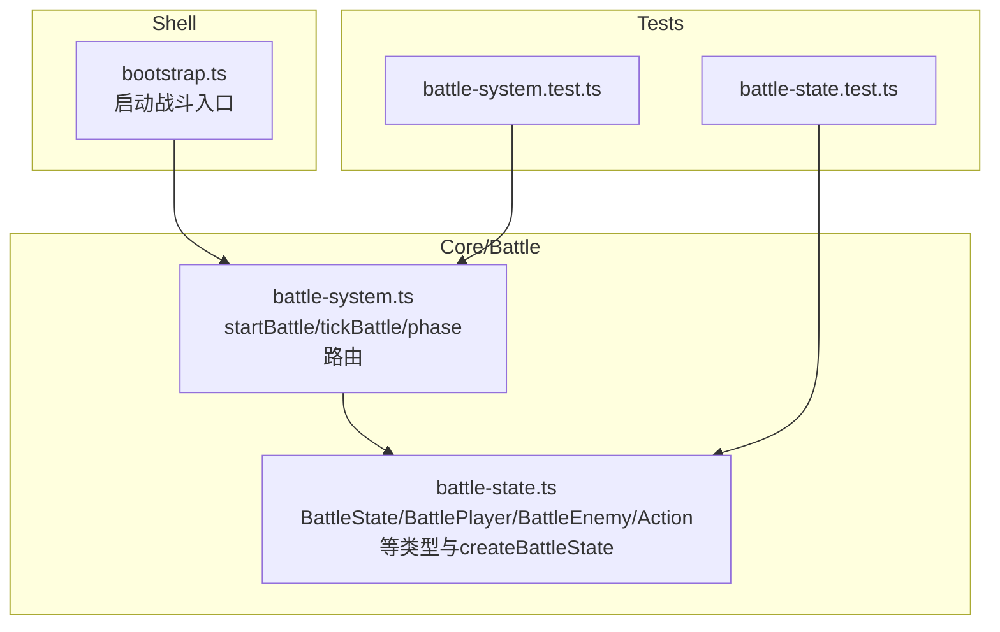
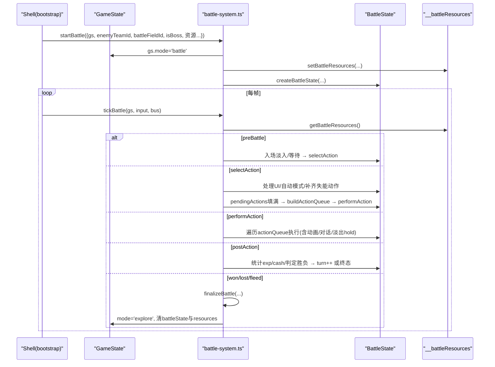
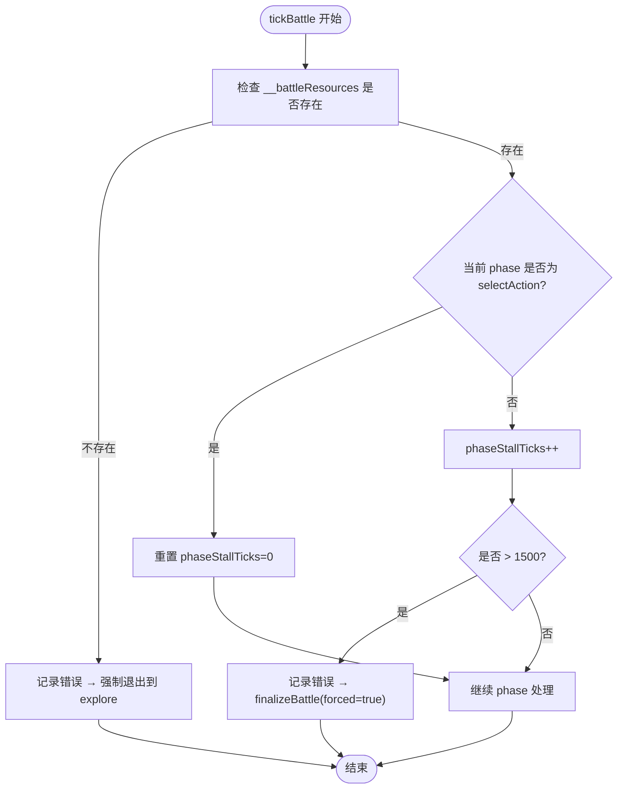
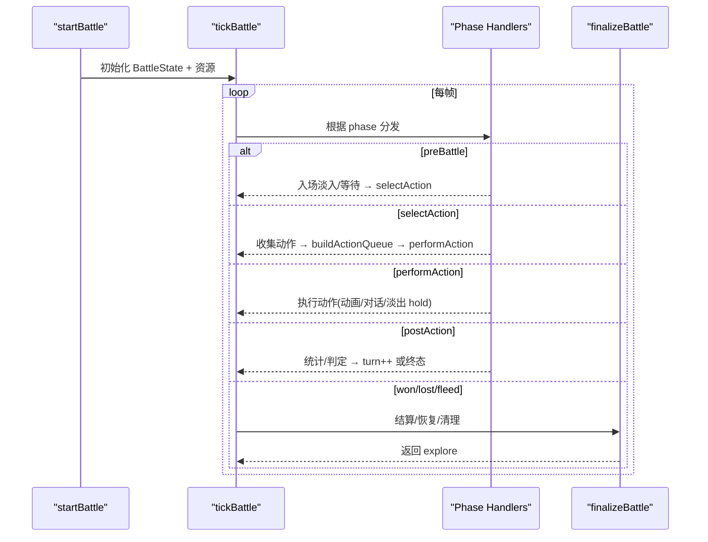
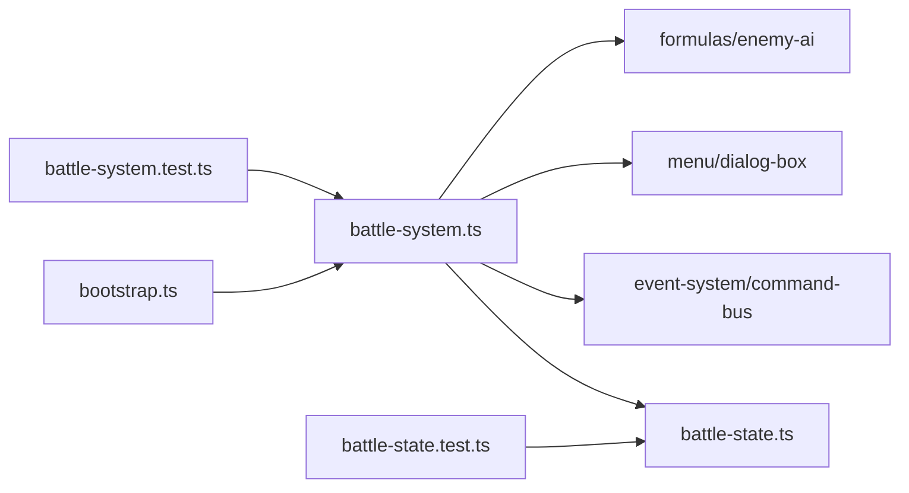

# 战斗核心系统

<cite>
**本文引用的文件**   
- [battle-system.ts](file://packages/game/src/core/battle/battle-system.ts)
- [battle-state.ts](file://packages/game/src/core/battle/battle-state.ts)
- [bootstrap.ts](file://packages/game/src/shell/bootstrap.ts)
- [battle-system.test.ts](file://packages/game/src/core/battle/__tests__/battle-system.test.ts)
- [battle-state.test.ts](file://packages/game/src/core/battle/__tests__/battle-state.test.ts)
</cite>

## 目录
1. [简介](#简介)
2. [项目结构](#项目结构)
3. [核心组件](#核心组件)
4. [架构总览](#架构总览)
5. [详细组件分析](#详细组件分析)
6. [依赖分析](#依赖分析)
7. [性能考虑](#性能考虑)
8. [故障排查指南](#故障排查指南)
9. [结论](#结论)
10. [附录](#附录)

## 简介
本文件为 Type-Pal 战斗核心系统的权威技术文档，聚焦于战斗状态机与生命周期管理、BattleState 数据结构设计、资源注入与缓存机制、防卡死保护与超时策略，并提供扩展新阶段与异常处理的实践建议。内容基于仓库中实际源码与测试用例进行提炼，确保可追溯与可验证。

## 项目结构
战斗核心位于 packages/game/src/core/battle 下，主入口与运行时调度在 battle-system.ts，数据模型与构造器在 battle-state.ts；Shell 层通过 bootstrap.ts 触发 startBattle；单元测试覆盖关键路径与边界条件。



图表来源
- [battle-system.ts:277-419](file://packages/game/src/core/battle/battle-system.ts#L277-L419)
- [battle-state.ts:728-912](file://packages/game/src/core/battle/battle-state.ts#L728-L912)
- [bootstrap.ts:1195-1222](file://packages/game/src/shell/bootstrap.ts#L1195-L1222)

章节来源
- [battle-system.ts:1-120](file://packages/game/src/core/battle/battle-system.ts#L1-L120)
- [battle-state.ts:1-120](file://packages/game/src/core/battle/battle-state.ts#L1-L120)
- [bootstrap.ts:1195-1222](file://packages/game/src/shell/bootstrap.ts#L1195-L1222)

## 核心组件
- 战斗状态机：preBattle → selectAction → performAction → postAction → (won/lost/fleed) → finalize → explore
- 生命周期：startBattle 初始化 → tickBattle 驱动 → finalizeBattle 清理
- 数据结构：BattleState（玩家/敌人/回合/阶段/UI/动画/对话/结算等）
- 资源管理：__battleResources 缓存 + get/set 访问器
- 安全保护：phaseStallTicks 防卡死 + 强制退出
- 输入与菜单：selectAction 阶段的完整 UI 选择链路
- 动画与演出：战斗内时间线、死亡淡出、逃跑动画、胜利结算

章节来源
- [battle-system.ts:472-614](file://packages/game/src/core/battle/battle-system.ts#L472-L614)
- [battle-state.ts:455-666](file://packages/game/src/core/battle/battle-state.ts#L455-L666)

## 架构总览
战斗系统采用“状态机 + 资源注入”的轻量架构。Shell 调用 startBattle 构建 BattleState 并挂入 GameState；每帧由 tickBattle 根据 phase 分发到对应处理器；performAction 阶段按 ActionQueue 执行动作；postAction 阶段统计战果并推进回合或进入终态；最终由 finalizeBattle 写回全局状态并清理资源。



图表来源
- [battle-system.ts:277-419](file://packages/game/src/core/battle/battle-system.ts#L277-L419)
- [battle-system.ts:472-614](file://packages/game/src/core/battle/battle-system.ts#L472-L614)
- [battle-system.ts:169-186](file://packages/game/src/core/battle/battle-system.ts#L169-L186)

## 详细组件分析

### 战斗状态机与生命周期
- 入口 startBattle
  - 解析 enemyTeam → 展开槽位(过滤 0xFFFF，保留 0 空槽) → 映射 enemies.json 与 OBJECT_ENEMY 脚本钩子
  - 校验 battleField 存在
  - 初始化 RNG、BattleState
  - 复活倒地队员(HP=0→1)并更新装备效果
  - 保存大世界屏波快照，设置战场常驻波
  - 清空隐藏经验池，可选入场淡入 gate
  - 写入 gs.mode='battle'、gs.battleState、__battleResources
- 主循环 tickBattle
  - 读取 __battleResources，缺失则强制退出并报错
  - 防卡死计数：非 selectAction 阶段累计，超过阈值强制退出
  - 多 hold 前置：死亡淡出、调色板淡出、逃跑动画、敌逃动画、对话队列、胜利结算
  - 回合起手脚本 runEnemyTurnStartScripts（在菜单之前）
  - 选指令菜单仅在 turnStart 完成且无 hold 后开启
  - 按 phase 分发到 tickPreBattle / tickSelectAction / tickPerformAction / tickPostAction
  - 终态 won/lost/fleed 进入 finalizeBattle
- 收尾 finalizeBattle
  - 胜利：分配 exp/cash，升级与学法术（若提供配置）
  - 失败：M3 简化为全员 HP=1
  - 恢复屏波、清 battleState 与 __battleResources，切回 explore

章节来源
- [battle-system.ts:277-419](file://packages/game/src/core/battle/battle-system.ts#L277-L419)
- [battle-system.ts:472-614](file://packages/game/src/core/battle/battle-system.ts#L472-L614)
- [battle-system.ts:332-348](file://packages/game/src/core/battle/battle-system.ts#L332-L348)

### BattleState 数据结构设计
- 玩家与敌人视图
  - BattlePlayer：引用 PlayerRoles.roles[roleId]，维护 prevHp/prevMp、defending、status 计数器、动画渲染字段、临时精灵覆盖等
  - BattleEnemy：e 为 shallow copy，维护 status、prevHp/maxHealth、objectId、scriptOn*、poisons、defeated、动画与 idle 状态、deathFadeStep 等
- 行动与队列
  - BattleAction：type/target/targetSide/actionId 等，支持攻击/防御/合击/法术/物品/逃跑/投掷/攻友军
  - actionQueue：buildActionQueue 生成，按 dex 与抖动排序，支持双动与二次行动
- 阶段与 UI
  - phase：preBattle/selectAction/performAction/postAction/won/lost/fleed
  - uiState/menuState/selectedAction/uiCursor/miscMenuCursor/miscSubMenuCursor 等精确对齐 sdlpal 状态
- 回合与结果
  - turn/currentActionIndex/pendingActions/prevActions/expGained/cashGained/rng
- 演出与对话
  - battleAnim/BattleAnimState/BattleAnimFrame 声明式时间线
  - battleDialogQueue/BattleDialogLine 复用大世界对话框
  - battleFade/fleeAnim/enemyEscapeAnim/settlement 等 hold 控制
- 其他
  - roundEndDelayTicks/iHidingTime/iBlow/fThisTurnCoop/prevPlayerAutoAtk 等

```mermaid
classDiagram
class BattleState {
+players : BattlePlayer[]
+enemies : BattleEnemy[]
+field : BattleField
+isBoss : boolean
+phase : BattlePhase
+turn : number
+actionQueue : ActionQueueItem[]
+currentActionIndex : number
+pendingActions : Map<number,BattleAction>
+uiState : BattleUIState
+menuState : BattleMenuState
+selectedAction : number
+uiCursor : number
+miscMenuCursor : number
+miscSubMenuCursor : number
+magicSelect? : SelectionMenuState
+itemSelect? : SelectionMenuState
+fAutoAttack? : boolean
+fForce? : boolean
+fRepeat? : boolean
+fAutoBattle? : boolean
+prevActions? : Map<number,BattleAction>
+repeatSelectionActive? : boolean
+iPrevEnemyTarget? : number
+expGained : number
+cashGained : number
+rng : SeedableRng
+phaseStallTicks : number
+prevWaveLevel? : number
+prevWaveProgression? : number
+roundEndDelayTicks? : number
+fThisTurnCoop? : boolean
+prevPlayerAutoAtk? : boolean
+iHidingTime? : number
+iBlow? : number
+battleAnim? : BattleAnimState
+persistentBgBlits? : Array
+introFade? : {step : number;total : number}
+fleeAnim? : {step : number}
+enemyEscapeAnim? : {step : number;holdTicks? : number}
+terminatedByEnemyEscape? : boolean
+battleFade? : {elapsedMs : number;startMs? : number}
+battleDialogQueue? : BattleDialogLine[]
+battleDialogTypingAccMs? : number
+battleDialogNarrationFrames? : number
+battleDialogStyle? : DialogBoxStyle
+battleDialogPendingClear? : boolean
+turnStartDoneForTurn? : number
+selectionStartedForTurn? : number
+settlement? : BattleSettlementState
}
class BattlePlayer {
+roleId : number
+prevHp : number
+prevMp : number
+scriptPrevHp? : number
+defending : boolean
+pos? : {x : number;y : number}
+posOriginal? : {x : number;y : number}
+currentFrame? : number
+iColorShift? : number
+spriteNumOverride? : number
+status : BattleStatus
}
class BattleEnemy {
+e : Enemy
+status : BattleStatus
+prevHp : number
+maxHealth? : number
+objectId? : number
+scriptOnTurnStart : number
+scriptOnBattleEnd : number
+scriptOnReady : number
+resistanceToSorcery? : number
+poisons? : Array
+defeated? : boolean
+pos? : {x : number;y : number}
+posOriginal? : {x : number;y : number}
+currentFrame? : number
+iColorShift? : number
+spriteFrameHeight? : number
+idleFrame? : number
+idleTick? : number
+deathFadeStep? : number
}
BattleState --> BattlePlayer : "包含"
BattleState --> BattleEnemy : "包含"
```

图表来源
- [battle-state.ts:455-666](file://packages/game/src/core/battle/battle-state.ts#L455-L666)
- [battle-state.ts:44-156](file://packages/game/src/core/battle/battle-state.ts#L44-L156)

章节来源
- [battle-state.ts:455-666](file://packages/game/src/core/battle/battle-state.ts#L455-L666)
- [battle-state.ts:44-156](file://packages/game/src/core/battle/battle-state.ts#L44-L156)

### 资源管理系统（__battleResources）
- 目的：tickBattle 内的 perform* 需要 items/spells/magics/playerRoles/commands 等多张表，而 GameState 不直接持有这些静态资源
- 实现：
  - 常量键名 '__battleResources'
  - getBattleResources / setBattleResources 存取
  - startBattle 写入，finalizeBattle 清理
  - getBattleLiveRoles 暴露实时角色视图（含装备 effect），供 present/UI 消费
- 健壮性：
  - tickBattle 若无 resources → 强制退出并记录错误日志
  - 测试覆盖“有 state 无 resources”场景

章节来源
- [battle-system.ts:109-186](file://packages/game/src/core/battle/battle-system.ts#L109-L186)
- [battle-system.ts:472-482](file://packages/game/src/core/battle/battle-system.ts#L472-L482)
- [battle-system.test.ts:1739-1771](file://packages/game/src/core/battle/__tests__/battle-system.test.ts#L1739-L1771)

### 防卡死保护与超时处理
- 机制：phaseStallTicks 在非 selectAction 阶段递增，超过 PHASE_STALL_TICKS_LIMIT（约 60s at 25fps）时强制退出并记录错误
- 例外：selectAction 合法无限等待用户操作，不计 stall
- 兜底：调用 finalizeBattle 以受控方式退出



图表来源
- [battle-system.ts:472-498](file://packages/game/src/core/battle/battle-system.ts#L472-L498)

章节来源
- [battle-system.ts:472-498](file://packages/game/src/core/battle/battle-system.ts#L472-L498)

### 战斗流程时序（从 startBattle 到 finalize）


图表来源
- [battle-system.ts:277-419](file://packages/game/src/core/battle/battle-system.ts#L277-L419)
- [battle-system.ts:472-614](file://packages/game/src/core/battle/battle-system.ts#L472-L614)

章节来源
- [battle-system.ts:277-419](file://packages/game/src/core/battle/battle-system.ts#L277-L419)
- [battle-system.ts:472-614](file://packages/game/src/core/battle/battle-system.ts#L472-L614)

### 扩展新战斗阶段与异常处理示例
- 新增阶段步骤（概念性说明）
  - 在 BattlePhase union 中添加新阶段字符串
  - 在 tickBattle 的 switch 分支中增加对应 case，并在相应位置插入 hold 检测（如淡出/对话/动画）
  - 在 tickPostAction 或专用 handler 中决定下一 phase
- 异常状态处理（概念性说明）
  - 在 tickBattle 开头统一做资源与状态一致性校验，必要时走 forced finalize
  - 对不可恢复状态（如 missing resources）记录错误日志并安全退出
- 参考路径（仅路径，不含代码）
  - 状态机定义与入口：[battle-system.ts:277-419](file://packages/game/src/core/battle/battle-system.ts#L277-L419)
  - 主循环与 phase 分发：[battle-system.ts:472-614](file://packages/game/src/core/battle/battle-system.ts#L472-L614)
  - 资源存取与缺失保护：[battle-system.ts:169-186](file://packages/game/src/core/battle/battle-system.ts#L169-L186), [battle-system.ts:472-482](file://packages/game/src/core/battle/battle-system.ts#L472-L482)
  - 终态清理与写回：[battle-system.ts:603-614](file://packages/game/src/core/battle/battle-system.ts#L603-L614)

章节来源
- [battle-system.ts:277-419](file://packages/game/src/core/battle/battle-system.ts#L277-L419)
- [battle-system.ts:472-614](file://packages/game/src/core/battle/battle-system.ts#L472-L614)
- [battle-system.ts:169-186](file://packages/game/src/core/battle/battle-system.ts#L169-L186)

## 依赖分析
- 模块耦合
  - battle-system.ts 依赖 battle-state.ts 的类型与 createBattleState
  - shell/bootstrap.ts 调用 startBattle 并将资源传入
  - 测试文件覆盖 startBattle、tickBattle、finalize 等关键路径
- 外部依赖
  - 事件系统与命令总线用于脚本与动画/弹幕输出
  - 菜单与对话框子系统用于 selectAction 与战斗内对话
  - 公式与 AI 模块用于行动顺序与敌人决策



图表来源
- [bootstrap.ts:1195-1222](file://packages/game/src/shell/bootstrap.ts#L1195-L1222)
- [battle-system.ts:1-120](file://packages/game/src/core/battle/battle-system.ts#L1-L120)
- [battle-system.test.ts:571-591](file://packages/game/src/core/battle/__tests__/battle-system.test.ts#L571-L591)
- [battle-state.test.ts:82-124](file://packages/game/src/core/battle/__tests__/battle-state.test.ts#L82-L124)

章节来源
- [bootstrap.ts:1195-1222](file://packages/game/src/shell/bootstrap.ts#L1195-L1222)
- [battle-system.test.ts:571-591](file://packages/game/src/core/battle/__tests__/battle-system.test.ts#L571-L591)
- [battle-state.test.ts:82-124](file://packages/game/src/core/battle/__tests__/battle-state.test.ts#L82-L124)

## 性能考虑
- 避免重复计算：buildActionQueue 前预计算 dex 与抖动，减少后续分支开销
- 动画与渲染解耦：BattleAnimState 将逻辑帧与视觉帧分离，present 侧用 wall-clock 平滑特效帧率
- 批量更新：postAction 集中统计 exp/cash 与状态衰减，减少跨阶段多次扫描
- 内存管理：
  - 使用浅拷贝 e 副本避免污染原 JSON
  - 战斗结束后立即清理 battleState 与 __battleResources，防止泄漏
  - 大对象（Map/Set）在阶段切换时及时 clear 或重建

## 故障排查指南
- 症状：进入战斗后长时间无响应
  - 检查 phaseStallTicks 是否超限，确认是否在 selectAction 合法等待
  - 查看控制台错误日志中“phase stall”提示
- 症状：战斗中无法读取资源
  - 确认 __battleResources 是否被正确写入与清理
  - 检查 tickBattle 是否有“without resources”错误日志
- 症状：胜利后未回到探索
  - 核查 finalizeBattle 是否被调用，以及 gs.mode 是否被置回 'explore'
- 症状：队伍成员显示异常（仍满血）
  - 确认 present/UI 是否读取 getBattleLiveRoles 而非静态基线

章节来源
- [battle-system.ts:472-498](file://packages/game/src/core/battle/battle-system.ts#L472-L498)
- [battle-system.ts:169-186](file://packages/game/src/core/battle/battle-system.ts#L169-L186)
- [battle-system.test.ts:1739-1771](file://packages/game/src/core/battle/__tests__/battle-system.test.ts#L1739-L1771)

## 结论
Type-Pal 的战斗核心以清晰的状态机与严格的资源注入机制为基础，配合完善的 hold 控制与防卡死保护，实现了高保真与可扩展的战斗体验。BattleState 的数据模型既贴近 sdlpal 语义，又为 TypeScript 生态提供了强类型保障。通过模块化拆分与测试覆盖，系统在可维护性与稳定性方面具备良好基础。

## 附录
- 关键函数与类型路径（仅路径）
  - startBattle：[battle-system.ts:277-419](file://packages/game/src/core/battle/battle-system.ts#L277-L419)
  - tickBattle：[battle-system.ts:472-614](file://packages/game/src/core/battle/battle-system.ts#L472-L614)
  - BattleState 定义：[battle-state.ts:455-666](file://packages/game/src/core/battle/battle-state.ts#L455-L666)
  - createBattleState：[battle-state.ts:728-912](file://packages/game/src/core/battle/battle-state.ts#L728-L912)
  - 资源存取：[battle-system.ts:169-186](file://packages/game/src/core/battle/battle-system.ts#L169-L186)
  - Shell 入口：[bootstrap.ts:1195-1222](file://packages/game/src/shell/bootstrap.ts#L1195-L1222)
  - 测试用例（startBattle/phase/资源清理）：[battle-system.test.ts:571-591](file://packages/game/src/core/battle/__tests__/battle-system.test.ts#L571-L591), [battle-system.test.ts:1739-1771](file://packages/game/src/core/battle/__tests__/battle-system.test.ts#L1739-L1771), [battle-state.test.ts:82-124](file://packages/game/src/core/battle/__tests__/battle-state.test.ts#L82-L124)