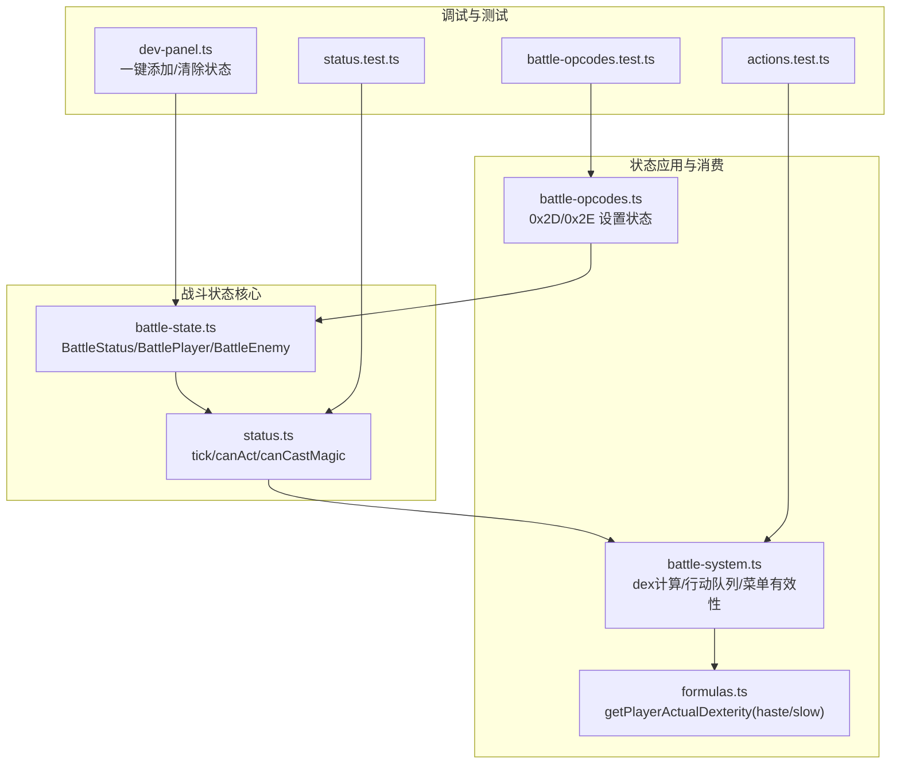
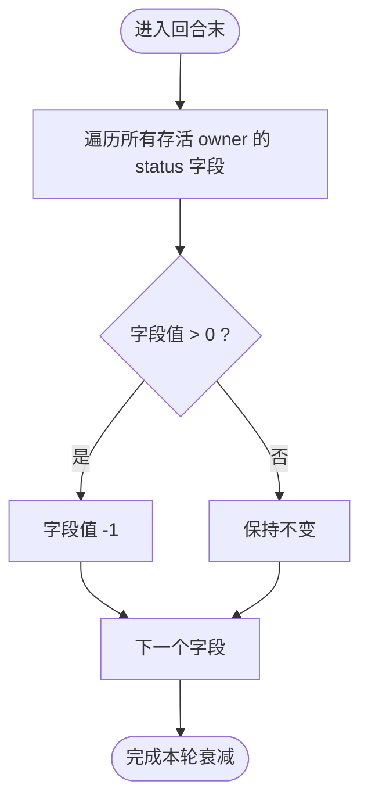
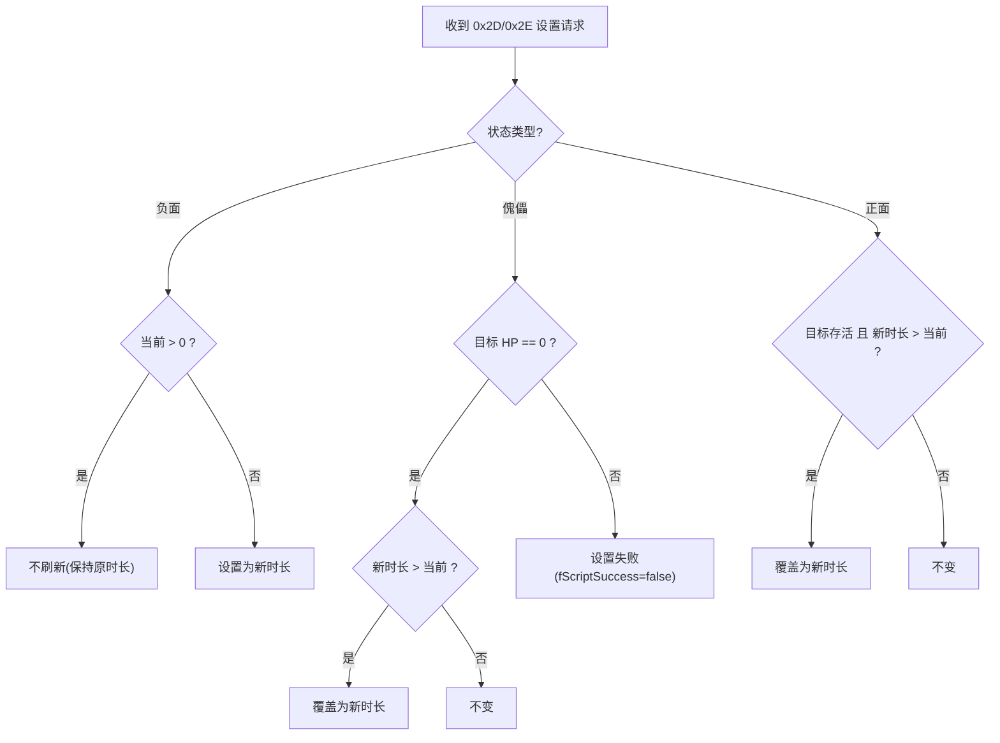
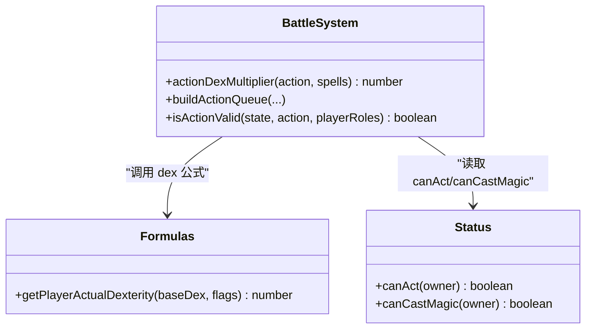
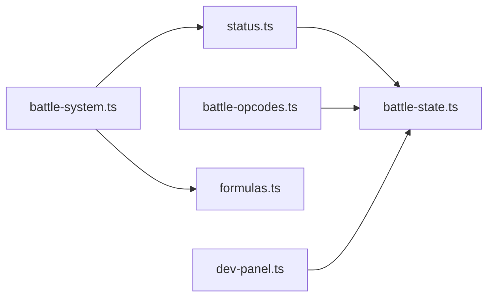

# 战斗状态系统

<cite>
**本文引用的文件**
- [status.ts](file://packages/game/src/core/battle/status.ts)
- [battle-state.ts](file://packages/game/src/core/battle/battle-state.ts)
- [battle-system.ts](file://packages/game/src/core/battle/battle-system.ts)
- [battle-opcodes.ts](file://packages/game/src/core/battle/battle-opcodes.ts)
- [formulas.ts](file://docs/phase1/plans/2026-05-23-m3-battle-vertical-slice.md)
- [dev-panel.ts](file://packages/game/src/dev/dev-panel.ts)
- [status.test.ts](file://packages/game/src/core/battle/__tests__/status.test.ts)
- [actions.test.ts](file://packages/game/src/core/battle/__tests__/actions.test.ts)
- [battle-opcodes.test.ts](file://packages/game/src/core/battle/__tests__/battle-opcodes.test.ts)
</cite>

## 目录
1. [简介](#简介)
2. [项目结构](#项目结构)
3. [核心组件](#核心组件)
4. [架构总览](#架构总览)
5. [详细组件分析](#详细组件分析)
6. [依赖关系分析](#依赖关系分析)
7. [性能与复杂度](#性能与复杂度)
8. [故障排查指南](#故障排查指南)
9. [结论](#结论)
10. [附录：新增状态效果示例](#附录新增状态效果示例)

## 简介
本文件为 Type-Pal 战斗状态系统的权威技术文档。围绕“状态效果”的设计、管理、冲突解决、数值计算与可视化，给出从源码到测试的完整说明，帮助开发者快速理解并扩展状态系统。

## 项目结构
与战斗状态直接相关的代码集中在 battle 子系统内，关键文件如下：
- 状态模型与生命周期：battle-state.ts、status.ts
- 状态应用与消费点：battle-system.ts、battle-opcodes.ts、formulas.ts
- 调试与可视化入口：dev-panel.ts
- 单元测试：status.test.ts、actions.test.ts、battle-opcodes.test.ts



图表来源
- [battle-state.ts:26-38](file://packages/game/src/core/battle/battle-state.ts#L26-L38)
- [status.ts:14-47](file://packages/game/src/core/battle/status.ts#L14-L47)
- [battle-system.ts:809-847](file://packages/game/src/core/battle/battle-system.ts#L809-L847)
- [battle-opcodes.ts:604-626](file://packages/game/src/core/battle/battle-opcodes.ts#L604-L626)
- [formulas.ts:2578-2586](file://docs/phase1/plans/2026-05-23-m3-battle-vertical-slice.md#L2578-L2586)
- [dev-panel.ts:1011-1079](file://packages/game/src/dev/dev-panel.ts#L1011-L1079)
- [status.test.ts:1-93](file://packages/game/src/core/battle/__tests__/status.test.ts#L1-L93)
- [actions.test.ts:2263-2338](file://packages/game/src/core/battle/__tests__/actions.test.ts#L2263-L2338)
- [battle-opcodes.test.ts:557-588](file://packages/game/src/core/battle/__tests__/battle-opcodes.test.ts#L557-L588)

章节来源
- [battle-state.ts:26-38](file://packages/game/src/core/battle/battle-state.ts#L26-L38)
- [status.ts:14-47](file://packages/game/src/core/battle/status.ts#L14-L47)
- [battle-system.ts:809-847](file://packages/game/src/core/battle/battle-system.ts#L809-L847)
- [battle-opcodes.ts:604-626](file://packages/game/src/core/battle/battle-opcodes.ts#L604-L626)
- [formulas.ts:2578-2586](file://docs/phase1/plans/2026-05-23-m3-battle-vertical-slice.md#L2578-L2586)
- [dev-panel.ts:1011-1079](file://packages/game/src/dev/dev-panel.ts#L1011-L1079)
- [status.test.ts:1-93](file://packages/game/src/core/battle/__tests__/status.test.ts#L1-L93)
- [actions.test.ts:2263-2338](file://packages/game/src/core/battle/__tests__/actions.test.ts#L2263-L2338)
- [battle-opcodes.test.ts:557-588](file://packages/game/src/core/battle/__tests__/battle-opcodes.test.ts#L557-L588)

## 核心组件
- BattleStatus 模型：所有状态均为 WORD 计数器（剩余回合数），统一在回合末 -1 递减；>999 视为装备授予的“永久”效果，战末不清除。
- 状态分类（按语义）：
  - 负面状态：睡眠、麻痹、混乱、沉默、傀儡等（影响行动/施法/行为）。
  - 正面状态：迅捷、庇护、神勇、双倍攻击等（提升属性或触发额外效果）。
  - 兼容字段：慢速（Slow）用于兼容模式，不参与 CLASSIC 真值但保留计数。
- 状态生命周期：
  - 添加：通过脚本 opcode 0x2D/0x2E 设置，遵循“坏状态不刷新、好状态仅更长才覆盖”的规则。
  - 衰减：每回合 tickStatusEffects 对所有 owner 的计数器逐项 -1。
  - 移除：当计数器归 0 时自动失效；某些状态在特定阶段被强制清理（如战斗结束对玩家的全清策略由上层控制）。
- 消费点：
  - 可行动判定：睡眠/麻痹阻止正常行动。
  - 可施法判定：沉默禁止法术菜单。
  - 行动顺序：迅捷/慢速影响实际敏捷，从而改变行动队列排序。
  - 其他：庇护影响伤害减免、神勇影响暴击、双倍攻击影响攻击次数等（由具体动作逻辑消费）。

章节来源
- [battle-state.ts:26-38](file://packages/game/src/core/battle/battle-state.ts#L26-L38)
- [status.ts:20-47](file://packages/game/src/core/battle/status.ts#L20-L47)
- [battle-opcodes.ts:604-626](file://packages/game/src/core/battle/battle-opcodes.ts#L604-L626)
- [battle-system.ts:809-847](file://packages/game/src/core/battle/battle-system.ts#L809-L847)

## 架构总览
状态系统在“数据模型—生命周期—消费点—可视化/调试”四层解耦：
- 数据层：BattleStatus 作为纯数据结构，存在于每个队员/敌人对象中。
- 管理层：tickStatusEffects 负责统一衰减；opcode 处理负责添加/更新。
- 消费层：battle-system 在 dex 计算、菜单有效性、自动行为等处读取状态。
- 可视化/调试：dev-panel 提供一键施加/清除状态，便于验证与排错。

```mermaid
sequenceDiagram
participant Script as "脚本/指令"
participant Opcode as "battle-opcodes.ts"
participant State as "battle-state.ts"
participant Tick as "status.ts"
participant System as "battle-system.ts"
participant Dev as "dev-panel.ts"
Script->>Opcode : "0x2D/0x2E 设置状态(目标,类型,时长)"
Opcode->>State : "写入 player/enemy.status[类型]=时长"
Note over State : "坏状态已有不刷新;好状态仅更长覆盖"
loop 每回合
Tick->>State : "tickStatusEffects 全部 -1"
System->>State : "读取 status 计算 dex/菜单有效性/自动行为"
end
Dev->>State : "一键施加/清除状态(调试)"
```

图表来源
- [battle-opcodes.ts:604-626](file://packages/game/src/core/battle/battle-opcodes.ts#L604-L626)
- [battle-state.ts:26-38](file://packages/game/src/core/battle/battle-state.ts#L26-L38)
- [status.ts:20-47](file://packages/game/src/core/battle/status.ts#L20-L47)
- [battle-system.ts:809-847](file://packages/game/src/core/battle/battle-system.ts#L809-L847)
- [dev-panel.ts:1011-1079](file://packages/game/src/dev/dev-panel.ts#L1011-L1079)

## 详细组件分析

### 状态模型与生命周期
- 模型定义：BattleStatus 包含 sleep、paralyzed、confused、haste、slow、silence、puppet、bravery、protect、dualAttack 等字段，均为 number 计数器。
- 初始化：createBattleState 为每个角色/敌人创建独立 status；玩家侧可从持久层 rgPlayerStatus 播种装备授予的状态。
- 衰减规则：tickOwnerStatus 遍历 STATUS_KEYS，对 >0 的字段 -1；dead enemy 不 tick。
- 消费接口：canAct 判断是否可行动；canCastMagic 判断是否可施法。



图表来源
- [status.ts:14-35](file://packages/game/src/core/battle/status.ts#L14-L35)
- [battle-state.ts:803-913](file://packages/game/src/core/battle/battle-state.ts#L803-L913)

章节来源
- [battle-state.ts:26-38](file://packages/game/src/core/battle/battle-state.ts#L26-L38)
- [battle-state.ts:803-913](file://packages/game/src/core/battle/battle-state.ts#L803-L913)
- [status.ts:14-47](file://packages/game/src/core/battle/status.ts#L14-L47)

### 状态添加与冲突解决
- 添加入口：0x2D（玩家）、0x2E（敌人）opcode。
- 冲突规则：
  - 负面状态（如睡眠、麻痹、混乱、沉默）：若已存在（>0）则不刷新，保持原时长。
  - 傀儡（puppet）：仅在目标死亡（HP==0）时设置成功，且需更长时间才覆盖；活人设置失败。
  - 正面状态（神勇、庇护、双倍攻击、迅捷）：仅在目标存活且新时长大于当前时才覆盖。
- 优先级：以“是否已有 + 时长比较”为核心，无全局优先级表；同一类状态互斥（例如负面状态不刷新）。



图表来源
- [battle-opcodes.ts:604-626](file://packages/game/src/core/battle/battle-opcodes.ts#L604-L626)

章节来源
- [battle-opcodes.ts:604-626](file://packages/game/src/core/battle/battle-opcodes.ts#L604-L626)

### 状态消费与数值计算
- 行动顺序（dex）：
  - 基础敏捷来自角色/敌人属性与装备加成。
  - 迅捷（haste>0）使玩家敏捷 ×3；慢速（slow>0）在 CLASSIC 路径下不生效（非 classic 分支未实现）。
  - 行动类型倍率（防御×5、合击×10、物品×3、逃跑×0.5 等）进一步调整排队先后。
  - 濒死修正：hp 低于阈值时 dex ÷2。
  - 随机抖动：末尾乘以 RandomFloat(0.9,1.1)。
- 菜单有效性：
  - 沉默（silence>0）禁用法术菜单。
  - 合击要求本人健康且队伍健康人数>1。
- 可行动性：
  - 睡眠/麻痹阻止正常行动；混乱由上层改派为攻击友军。



图表来源
- [battle-system.ts:809-847](file://packages/game/src/core/battle/battle-system.ts#L809-L847)
- [formulas.ts:2578-2586](file://docs/phase1/plans/2026-05-23-m3-battle-vertical-slice.md#L2578-L2586)
- [status.ts:37-47](file://packages/game/src/core/battle/status.ts#L37-L47)

章节来源
- [battle-system.ts:809-847](file://packages/game/src/core/battle/battle-system.ts#L809-L847)
- [formulas.ts:2578-2586](file://docs/phase1/plans/2026-05-23-m3-battle-vertical-slice.md#L2578-L2586)
- [status.ts:37-47](file://packages/game/src/core/battle/status.ts#L37-L47)

### 状态可视化与调试
- dev-panel 提供一键施加/清除状态按钮，支持常见状态键名与“清除全部”。
- 提示文本说明需在战斗中操作，并提醒多人队需求（如混乱攻友军）。
- 该面板直接修改 battleState.players[0].status 对应字段，便于快速验证。

章节来源
- [dev-panel.ts:1011-1079](file://packages/game/src/dev/dev-panel.ts#L1011-L1079)

## 依赖关系分析
- 模块耦合：
  - status.ts 仅依赖 battle-state.ts 的类型定义，低耦合。
  - battle-system.ts 消费 status 与 formulas，决定 UI 与行动顺序。
  - battle-opcodes.ts 直接写 battle-state.ts 的 status 字段。
- 外部依赖：
  - 资源表（items/spells/magics/playerRoles/commands）通过 battle-system.ts 注入，供菜单与自动选择使用。
- 循环依赖：
  - 未见显式循环；状态模型与消费点分层清晰。



图表来源
- [status.ts:10-18](file://packages/game/src/core/battle/status.ts#L10-L18)
- [battle-opcodes.ts:604-626](file://packages/game/src/core/battle/battle-opcodes.ts#L604-L626)
- [battle-system.ts:809-847](file://packages/game/src/core/battle/battle-system.ts#L809-L847)
- [formulas.ts:2578-2586](file://docs/phase1/plans/2026-05-23-m3-battle-vertical-slice.md#L2578-L2586)
- [dev-panel.ts:1011-1079](file://packages/game/src/dev/dev-panel.ts#L1011-L1079)

章节来源
- [status.ts:10-18](file://packages/game/src/core/battle/status.ts#L10-L18)
- [battle-opcodes.ts:604-626](file://packages/game/src/core/battle/battle-opcodes.ts#L604-L626)
- [battle-system.ts:809-847](file://packages/game/src/core/battle/battle-system.ts#L809-L847)
- [formulas.ts:2578-2586](file://docs/phase1/plans/2026-05-23-m3-battle-vertical-slice.md#L2578-L2586)
- [dev-panel.ts:1011-1079](file://packages/game/src/dev/dev-panel.ts#L1011-L1079)

## 性能与复杂度
- 时间复杂度：
  - tickStatusEffects：O(N×K)，N 为存活单位数，K 为状态字段数（常量≈10）。
  - 菜单有效性/自动选择：O(M) 扫描队伍，M≤3。
- 空间复杂度：
  - 每单位维护一个固定大小的 BattleStatus 对象，内存开销恒定。
- 优化建议：
  - 将 STATUS_KEYS 缓存为只读数组（已实现）。
  - 对大量敌人场景，可在 tick 前过滤 defeated/health<=0 的单位（已实现）。

## 故障排查指南
- 症状：状态不生效
  - 检查是否通过 opcode 正确设置（0x2D/0x2E），确认目标与时长。
  - 确认是否为“坏状态已有不刷新”导致未覆盖。
- 症状：迅捷无效
  - 确认 haste>0 且在行动顺序计算中被读取（getPlayerActualDexterity）。
- 症状：沉默无法施法
  - 检查菜单有效性 isActionValid 与 canCastMagic 返回值。
- 症状：回合末状态未减少
  - 确认 tickStatusEffects 在正确时机被调用（回合末 turn++ 前）。
- 调试工具：
  - 使用 dev-panel 一键施加/清除状态，观察回合推进后的变化。
  - 运行单元测试：status.test.ts、actions.test.ts、battle-opcodes.test.ts。

章节来源
- [status.test.ts:1-93](file://packages/game/src/core/battle/__tests__/status.test.ts#L1-L93)
- [actions.test.ts:2263-2338](file://packages/game/src/core/battle/__tests__/actions.test.ts#L2263-L2338)
- [battle-opcodes.test.ts:557-588](file://packages/game/src/core/battle/__tests__/battle-opcodes.test.ts#L557-L588)
- [dev-panel.ts:1011-1079](file://packages/game/src/dev/dev-panel.ts#L1011-L1079)

## 结论
Type-Pal 的战斗状态系统采用“统一计数器 + 明确消费点”的设计，既忠实于 sdlpal 真值，又具备良好的可扩展性与可测试性。通过 opcode 添加、回合末统一衰减、以及明确的消费规则，实现了稳定可控的状态行为。配合 dev-panel 与完善的单测，开发者可高效地新增与验证状态效果。

## 附录：新增状态效果示例
以下示例展示如何新增一种“护盾”状态（保护型，减半受伤），包括数据模型、添加逻辑、消费点与测试。

- 数据模型
  - 在 BattleStatus 中添加 shield: number 字段（可选，向后兼容）。
  - 参考现有字段声明位置。

- 添加逻辑（opcode）
  - 在 0x2D 分支增加对 'shield' 的处理：属于“好状态”，仅在目标存活且新时长大于当前时覆盖。
  - 参考现有“好状态”分支的实现方式。

- 消费点
  - 伤害计算处读取 player.status.shield>0 时，最终伤害 ×0.5。
  - 若需要影响行动顺序，可按需参与 dex 计算（此处通常不影响）。

- 可视化/调试
  - 在 dev-panel 的 STATUS_BTNS 中加入 ['护盾 shield(减半受伤)', 'shield']。
  - 点击后对 P0 设置 shield=5，回合末逐回合 -1。

- 测试
  - 新增用例：施加 shield → 物理攻击伤害减半 → 回合末衰减。
  - 断言：施加前后伤害对比；回合末 shield 值递减。

章节来源
- [battle-state.ts:26-38](file://packages/game/src/core/battle/battle-state.ts#L26-L38)
- [battle-opcodes.ts:604-626](file://packages/game/src/core/battle/battle-opcodes.ts#L604-L626)
- [dev-panel.ts:1011-1079](file://packages/game/src/dev/dev-panel.ts#L1011-L1079)
- [status.test.ts:1-93](file://packages/game/src/core/battle/__tests__/status.test.ts#L1-L93)