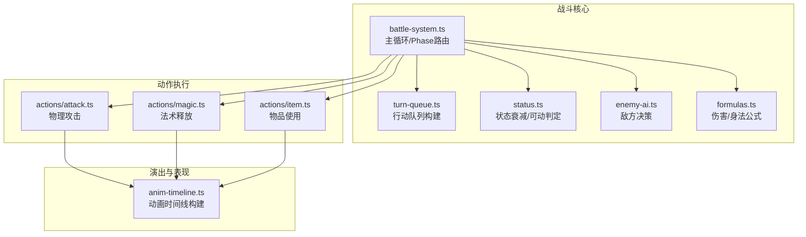
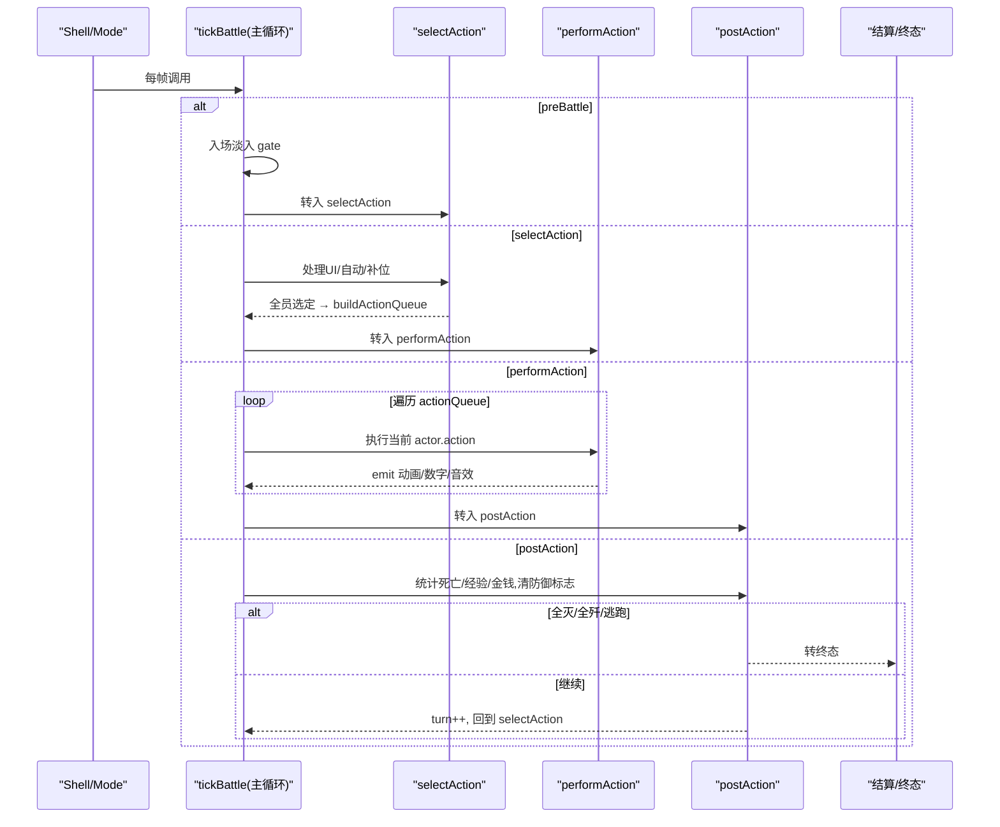
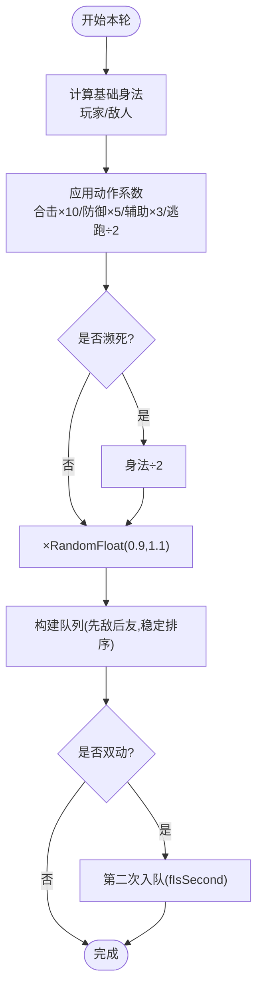
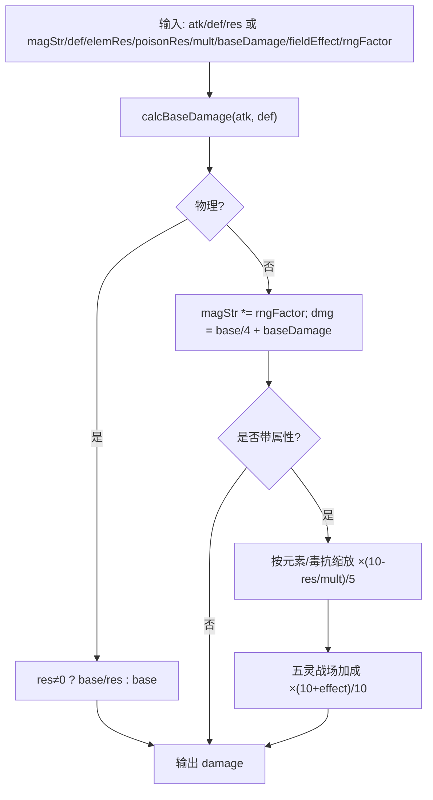
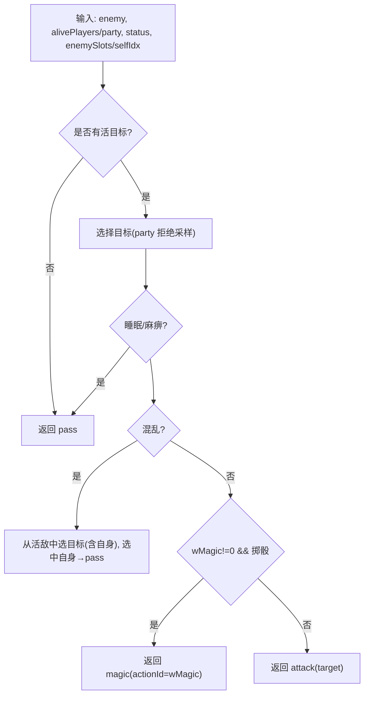
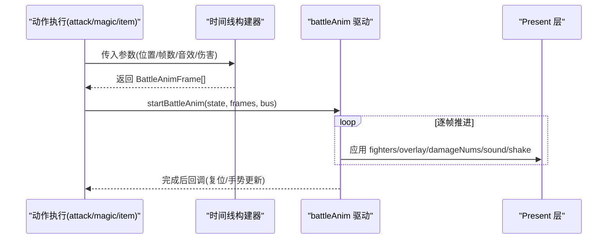
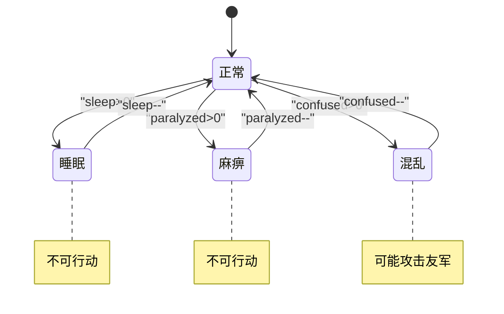
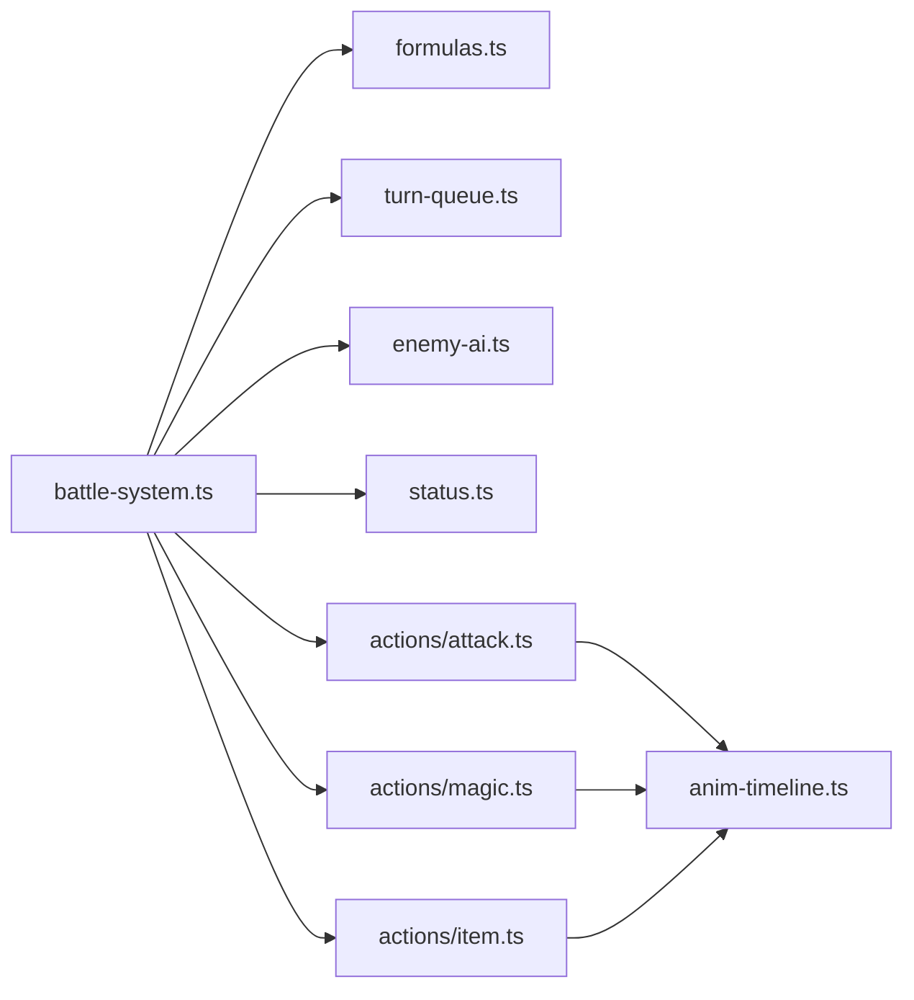

# 战斗系统

<cite>
**本文引用的文件**   
- [battle-system.ts](file://packages/game/src/core/battle/battle-system.ts)
- [formulas.ts](file://packages/game/src/core/battle/formulas.ts)
- [turn-queue.ts](file://packages/game/src/core/battle/turn-queue.ts)
- [enemy-ai.ts](file://packages/game/src/core/battle/enemy-ai.ts)
- [attack.ts](file://packages/game/src/core/battle/actions/attack.ts)
- [magic.ts](file://packages/game/src/core/battle/actions/magic.ts)
- [item.ts](file://packages/game/src/core/battle/actions/item.ts)
- [status.ts](file://packages/game/src/core/battle/status.ts)
- [anim-timeline.ts](file://packages/game/src/core/battle/anim-timeline.ts)
- [game-mechanics.md](file://docs/phase1/game-mechanics.md)
</cite>

## 目录
1. [简介](#简介)
2. [项目结构](#项目结构)
3. [核心组件](#核心组件)
4. [架构总览](#架构总览)
5. [详细组件分析](#详细组件分析)
6. [依赖关系分析](#依赖关系分析)
7. [性能与平衡性建议](#性能与平衡性建议)
8. [故障排查指南](#故障排查指南)
9. [结论](#结论)
10. [附录：扩展示例路径](#附录：扩展示例路径)

## 简介
本文件为 Type-Pal 第一阶段（忠实还原）的战斗系统技术文档，聚焦回合制战斗逻辑、行动顺序计算、回合队列管理、状态转换机制、伤害公式、AI 决策、动画时间线同步与战斗状态管理。内容以源码与真值文档为依据，提供可追溯的“章节来源”和“图示来源”，并给出扩展新技能、自定义伤害公式与新增敌人类型的实践指引。

## 项目结构
战斗系统位于 packages/game/src/core/battle 下，采用“系统 + 动作 + 表现”分层组织：
- 系统与流程：battle-system.ts（主循环与 phase 状态机）、turn-queue.ts（行动队列）、status.ts（状态衰减）、enemy-ai.ts（敌方 AI）
- 动作实现：actions/attack.ts、actions/magic.ts、actions/item.ts 等
- 表现层：anim-timeline.ts（帧级时间线构建）、present 层消费 battleAnim 驱动渲染与音效
- 公式与数值：formulas.ts（基础伤害、法术伤害、身法）

**图示来源**
- [battle-system.ts:472-614](file://packages/game/src/core/battle/battle-system.ts#L472-L614)
- [turn-queue.ts:68-99](file://packages/game/src/core/battle/turn-queue.ts#L68-L99)
- [status.ts:30-35](file://packages/game/src/core/battle/status.ts#L30-L35)
- [enemy-ai.ts:68-130](file://packages/game/src/core/battle/enemy-ai.ts#L68-L130)
- [formulas.ts:36-158](file://packages/game/src/core/battle/formulas.ts#L36-L158)
- [attack.ts:112-435](file://packages/game/src/core/battle/actions/attack.ts#L112-L435)
- [magic.ts:123-435](file://packages/game/src/core/battle/actions/magic.ts#L123-L435)
- [item.ts:69-119](file://packages/game/src/core/battle/actions/item.ts#L69-L119)
- [anim-timeline.ts:311-670](file://packages/game/src/core/battle/anim-timeline.ts#L311-L670)

**章节来源**
- [battle-system.ts:1-120](file://packages/game/src/core/battle/battle-system.ts#L1-L120)
- [turn-queue.ts:1-100](file://packages/game/src/core/battle/turn-queue.ts#L1-L100)
- [status.ts:1-47](file://packages/game/src/core/battle/status.ts#L1-L47)
- [enemy-ai.ts:1-131](file://packages/game/src/core/battle/enemy-ai.ts#L1-L131)
- [formulas.ts:1-217](file://packages/game/src/core/battle/formulas.ts#L1-L217)
- [attack.ts:1-582](file://packages/game/src/core/battle/actions/attack.ts#L1-L582)
- [magic.ts:1-800](file://packages/game/src/core/battle/actions/magic.ts#L1-L800)
- [item.ts:1-120](file://packages/game/src/core/battle/actions/item.ts#L1-L120)
- [anim-timeline.ts:1-800](file://packages/game/src/core/battle/anim-timeline.ts#L1-L800)

## 核心组件
- 主循环与 Phase 状态机：preBattle → selectAction → performAction → postAction → won/lost/fleed → finalize
- 行动队列：按有效身法降序稳定排序，支持双动与随机抖动
- 状态系统：每回合统一递减所有状态计数器，sleep/paralyzed 阻止行动，silence 禁止施法
- 敌方 AI：默认 fallback 基于 wMagic/wMagicRate/silence/confused 等状态选择魔法或物理，目标选择对齐 sdlpal RNG 流
- 伤害公式：物理三段式 + 物抗；法术灵力浮动 + 三段式 /4 + 固定威力 + 元素/毒抗缩放 + 战场加成
- 动画时间线：将动作拆分为帧序列（位移、特效、音效、数字），由 battleAnim 驱动播放

**章节来源**
- [battle-system.ts:472-614](file://packages/game/src/core/battle/battle-system.ts#L472-L614)
- [turn-queue.ts:68-99](file://packages/game/src/core/battle/turn-queue.ts#L68-L99)
- [status.ts:30-47](file://packages/game/src/core/battle/status.ts#L30-L47)
- [enemy-ai.ts:68-130](file://packages/game/src/core/battle/enemy-ai.ts#L68-L130)
- [formulas.ts:36-158](file://packages/game/src/core/battle/formulas.ts#L36-L158)
- [anim-timeline.ts:311-670](file://packages/game/src/core/battle/anim-timeline.ts#L311-L670)

## 架构总览
战斗系统通过 tickBattle 作为入口，在 mode='battle' 时逐帧推进。各 phase 负责不同职责：selectAction 处理 UI 输入与自动模式；performAction 根据 actionQueue 依次执行动作；postAction 结算死亡、经验金钱、回合重置；终态进入结算或退出。

**图示来源**
- [battle-system.ts:472-614](file://packages/game/src/core/battle/battle-system.ts#L472-L614)
- [turn-queue.ts:68-99](file://packages/game/src/core/battle/turn-queue.ts#L68-L99)

**章节来源**
- [battle-system.ts:472-614](file://packages/game/src/core/battle/battle-system.ts#L472-L614)

## 详细组件分析

### 回合顺序与队列管理
- 有效身法：玩家 = baseDexterity × haste×3（上限 999）；敌人 = (level+6)×3 + dexterity
- 动作修正系数：合击×10、防御×5、辅助法术/物品×3、逃跑÷2、攻击类×1
- 收尾修正：濒死 ÷2；RandomFloat(0.9,1.1) 抖动
- 队列构建：先敌后友，dualMove 敌人二次入队（dex2 比较定 fIsSecond），同 dex 保持填充顺序（敌在前）

**图示来源**
- [formulas.ts:179-216](file://packages/game/src/core/battle/formulas.ts#L179-L216)
- [turn-queue.ts:68-99](file://packages/game/src/core/battle/turn-queue.ts#L68-L99)
- [battle-system.ts:679-701](file://packages/game/src/core/battle/battle-system.ts#L679-L701)

**章节来源**
- [formulas.ts:179-216](file://packages/game/src/core/battle/formulas.ts#L179-L216)
- [turn-queue.ts:68-99](file://packages/game/src/core/battle/turn-queue.ts#L68-L99)
- [battle-system.ts:679-701](file://packages/game/src/core/battle/battle-system.ts#L679-L701)

### 伤害计算公式
- 基础伤害三段式：atk > def → 2at - 1.6def；atk > 0.6def → atk - 0.6def；否则 0
- 物理：玩家打敌人用 calcPhysicalAttackDamage(atk, def, res)，res=敌物理抗性；敌人打玩家 res=2（硬编码）
- 法术：magStr 随机浮动 ×1.0~1.1 → calcBaseDamage(magStr, def)/4 + baseDamage；若带属性则乘以 (10 - 抗性/倍率)/5，再乘战场加成
- 暴击/会心/双重攻击/群体递减：详见 attack.ts 分支

**图示来源**
- [formulas.ts:36-158](file://packages/game/src/core/battle/formulas.ts#L36-L158)
- [attack.ts:112-435](file://packages/game/src/core/battle/actions/attack.ts#L112-L435)
- [game-mechanics.md:143-232](file://docs/phase1/game-mechanics.md#L143-L232)

**章节来源**
- [formulas.ts:36-158](file://packages/game/src/core/battle/formulas.ts#L36-L158)
- [attack.ts:112-435](file://packages/game/src/core/battle/actions/attack.ts#L112-L435)
- [game-mechanics.md:143-232](file://docs/phase1/game-mechanics.md#L143-L232)

### AI 决策算法
- 默认 fallback：wMagic!=0 且掷骰 < magicRate 且非沉默 → 使用 wMagic；否则物理
- 目标选择：对玩家走 party 拒绝采样（HP==0 重摇），对敌人走 enemySlots 拒绝采样（空槽/死敌重摇）
- 混乱：从活敌中随机选目标，选中自己则 pass
- 睡眠/麻痹：直接 pass

**图示来源**
- [enemy-ai.ts:68-130](file://packages/game/src/core/battle/enemy-ai.ts#L68-L130)

**章节来源**
- [enemy-ai.ts:68-130](file://packages/game/src/core/battle/enemy-ai.ts#L68-L130)

### 战斗动画时间线同步
- 帧时长：BATTLE_FRAME_TIME=40ms（25fps）
- 物理攻击：前摇/冲刺/命中特效/受击抖动/复位，挂出招声与武器声到对应帧
- 法术：PreMagic → OffMagic → PostMagic 链；召唤 PreMagic → 变亮 → 神序列 → 二次效果 → PostMagic → 淡出
- 数字弹幕：优先挂到 PostMagic 首帧，未建链则即时 emit
- 音效：施法音/效果音按帧同步，避免提前或重叠

**图示来源**
- [anim-timeline.ts:311-670](file://packages/game/src/core/battle/anim-timeline.ts#L311-L670)
- [attack.ts:503-582](file://packages/game/src/core/battle/actions/attack.ts#L503-L582)
- [magic.ts:485-678](file://packages/game/src/core/battle/actions/magic.ts#L485-L678)

**章节来源**
- [anim-timeline.ts:1-800](file://packages/game/src/core/battle/anim-timeline.ts#L1-L800)
- [attack.ts:503-582](file://packages/game/src/core/battle/actions/attack.ts#L503-L582)
- [magic.ts:485-678](file://packages/game/src/core/battle/actions/magic.ts#L485-L678)

### 战斗状态管理
- 状态衰减：每回合对所有状态计数器 -1（含 boolean 类 haste/protect/dualAttack 等）
- 可动判定：sleep/paralyzed 不可行动；confused 改派 attack-mate；silence 禁止施法
- 防御姿态：主动防御整回合生效，回合末清除；自动防御/援护/护体影响减伤与免伤

**图示来源**
- [status.ts:30-47](file://packages/game/src/core/battle/status.ts#L30-L47)
- [battle-system.ts:576-614](file://packages/game/src/core/battle/battle-system.ts#L576-L614)

**章节来源**
- [status.ts:30-47](file://packages/game/src/core/battle/status.ts#L30-L47)
- [battle-system.ts:576-614](file://packages/game/src/core/battle/battle-system.ts#L576-L614)

## 依赖关系分析
- battle-system.ts 依赖 formulas.ts、turn-queue.ts、enemy-ai.ts、status.ts 与各 actions/*
- actions/* 依赖 anim-timeline.ts 构建帧序列，并通过 CommandBus 向 Present 层发送命令
- 资源注入：startBattle 将 items/spells/magics/playerRoles/commands 等缓存至 GameState.__battleResources，供 perform* 读取

**图示来源**
- [battle-system.ts:1-120](file://packages/game/src/core/battle/battle-system.ts#L1-L120)
- [attack.ts:1-582](file://packages/game/src/core/battle/actions/attack.ts#L1-L582)
- [magic.ts:1-800](file://packages/game/src/core/battle/actions/magic.ts#L1-L800)
- [item.ts:1-120](file://packages/game/src/core/battle/actions/item.ts#L1-L120)
- [anim-timeline.ts:1-800](file://packages/game/src/core/battle/anim-timeline.ts#L1-L800)

**章节来源**
- [battle-system.ts:1-120](file://packages/game/src/core/battle/battle-system.ts#L1-L120)

## 性能与平衡性建议
- 性能
  - 时间线构建纯函数化，避免重复分配；批量 emit 数字与音效，减少总线压力
  - 群攻动画参与敌集合预过滤，仅对有 posOriginal 的敌人生成 groupEnemies
  - 战斗内对话与动画 hold 互斥，避免并发阻塞导致的卡顿
- 平衡性
  - 合理设置敌人 dualMove 与等级项，控制出手顺序与伤害曲线
  - 调整元素/毒抗与战场加成，形成相克策略
  - 控制自动防御概率与援护条件，保证生存与风险并存

[本节为通用建议，不直接分析具体文件]

## 故障排查指南
- 阶段卡死保护：非 selectAction 阶段 stall > 1500 ticks 强制退出 explore，检查 phase 流转与 hold 条件
- 资源缺失：__battleResources 为空时强制退出，确认 startBattle 写入与 finalize 清理
- 动画不同步：检查 timeLine 帧挂载点（damageNums 挂 PostMagic 首帧；音效挂对应帧）
- 脚本失败：scriptOnUse 失败时仍扣 MP 但不播效果，检查 g_fScriptSuccess 与分支跳转

**章节来源**
- [battle-system.ts:472-530](file://packages/game/src/core/battle/battle-system.ts#L472-L530)
- [magic.ts:247-258](file://packages/game/src/core/battle/actions/magic.ts#L247-L258)

## 结论
Type-Pal 战斗系统在 M3 阶段已实现完整的回合制流程、队列与动画时间线，并在关键路径上对齐 sdlpal 真值。后续可在隐藏经验、完整防御体系、更多特殊技能与更丰富的敌人 AI 方面持续完善。

[本节为总结，不直接分析具体文件]

## 附录：扩展示例路径
- 扩展新战斗技能（以法术为例）
  - 定义 Spell/Magic 数据与 scriptOnUse/scriptOnSuccess
  - 在 actions/magic.ts 的 performMagic 中接入新类型或复用现有分支
  - 如需新动画，参考 anim-timeline.ts 的 Pre/Off/Post 链构建方式
  - 参考路径：
    - [performMagic 入口:123-435](file://packages/game/src/core/battle/actions/magic.ts#L123-L435)
    - [Pre/Off/Post 链构建:672-800](file://packages/game/src/core/battle/anim-timeline.ts#L672-L800)
- 自定义伤害公式
  - 在 formulas.ts 新增/修改 calcBaseDamage/calcMagicDamage 等纯函数
  - 在 actions/attack.ts 或 actions/magic.ts 中调用新公式
  - 参考路径：
    - [基础/法术伤害:36-158](file://packages/game/src/core/battle/formulas.ts#L36-L158)
    - [物理攻击编排:112-435](file://packages/game/src/core/battle/actions/attack.ts#L112-L435)
- 添加新的敌人类型
  - 在 enemies.json 新增条目，配置 wMagic/wMagicRate/抗性/附加异常等
  - 在 enemy-objects.json 配置 resistanceToSorcery 与脚本钩子
  - 在 battle-system.ts 的 startBattle 展开 enemyList 与 enemyScripts
  - 参考路径：
    - [startBattle 展开敌人:277-419](file://packages/game/src/core/battle/battle-system.ts#L277-L419)
    - [敌方 AI 决策:68-130](file://packages/game/src/core/battle/enemy-ai.ts#L68-130)