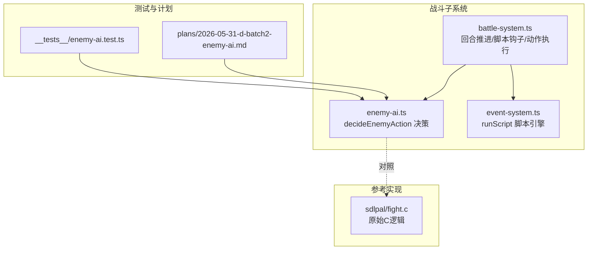
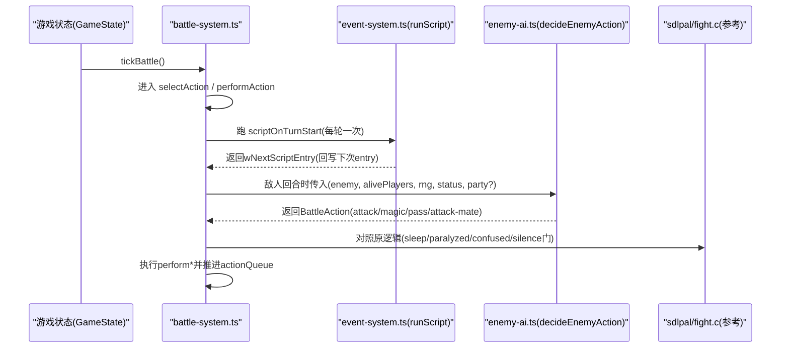
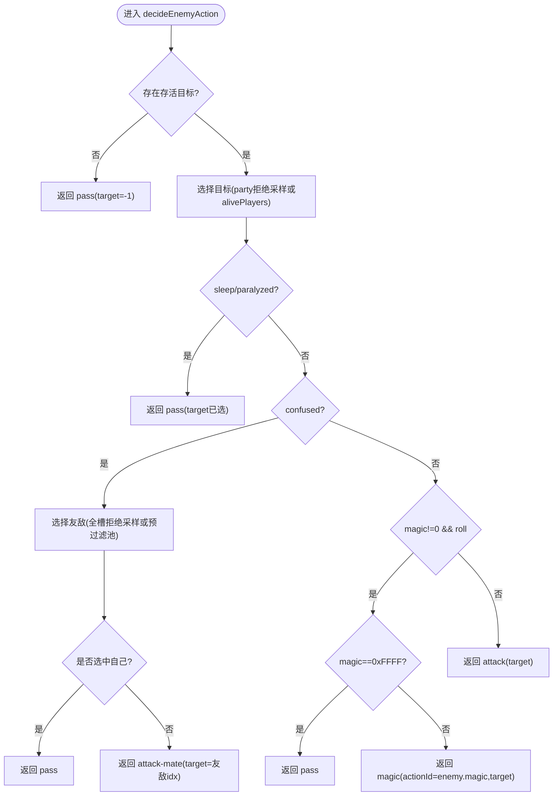
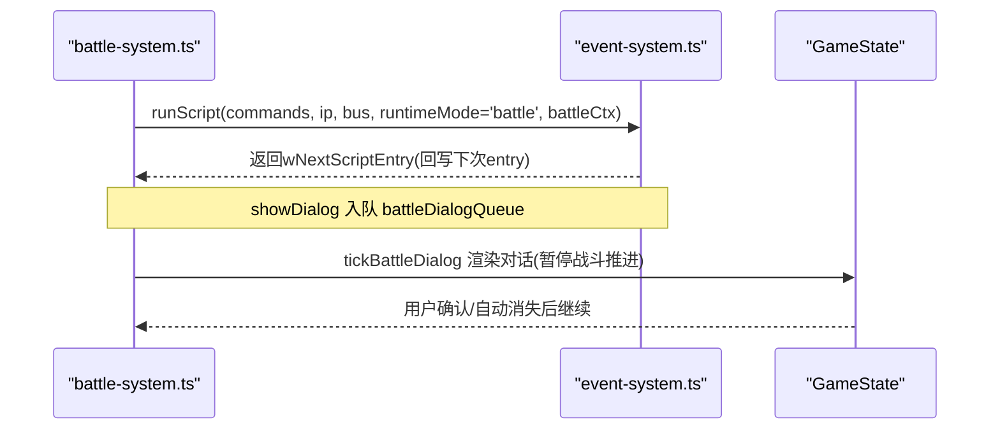
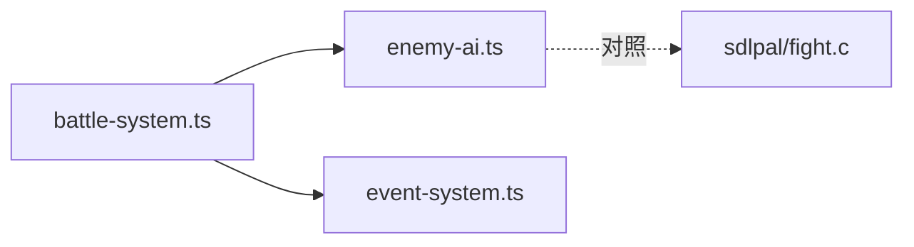

# 敌人AI系统

<cite>
**本文引用的文件**   
- [packages/game/src/core/battle/enemy-ai.ts](file://packages/game/src/core/battle/enemy-ai.ts)
- [packages/game/src/core/battle/__tests__/enemy-ai.test.ts](file://packages/game/src/core/battle/__tests__/enemy-ai.test.ts)
- [packages/game/src/core/battle/battle-system.ts](file://packages/game/src/core/battle/battle-system.ts)
- [packages/game/src/core/event-system.ts](file://packages/game/src/core/event-system.ts)
- [docs/phase1/plans/2026-05-31-d-batch2-enemy-ai.md](file://docs/phase1/plans/2026-05-31-d-batch2-enemy-ai.md)
- [reference/sdlpal/fight.c](file://reference/sdlpal/fight.c)
</cite>

## 目录
1. [简介](#简介)
2. [项目结构](#项目结构)
3. [核心组件](#核心组件)
4. [架构总览](#架构总览)
5. [详细组件分析](#详细组件分析)
6. [依赖关系分析](#依赖关系分析)
7. [性能与确定性](#性能与确定性)
8. [疑难排查指南](#疑难排查指南)
9. [结论](#结论)
10. [附录：扩展与示例](#附录扩展与示例)

## 简介
本文件系统性梳理 Type-Pal 的敌人 AI 子系统，覆盖决策树设计、目标选择算法、技能使用优先级、行为模式切换、状态评估（含血量阈值、队友感知与环境因素）、脚本系统集成（scriptOnReady/scriptOnTurnStart 钩子执行时机与参数传递）、不同敌人类型差异（普通怪/精英/Boss）的行为要点、难度调节机制与动态调整思路，以及调试与测试方法。文档以源码为依据，辅以流程图与时序图帮助理解。

## 项目结构
与敌人 AI 直接相关的代码集中在 battle 子系统与事件脚本系统：
- 决策核心：enemy-ai.ts 提供纯函数 decideEnemyAction，负责在给定状态下输出行动类型与目标。
- 战斗主循环：battle-system.ts 负责回合推进、脚本钩子调用、动作队列构建与执行。
- 脚本引擎：event-system.ts 提供 runScript 及命令执行语义，支持 show-dialog、跳转等。
- 参考实现：reference/sdlpal/fight.c 为 sdlpal 原版逻辑对照。
- 测试与计划：__tests__/enemy-ai.test.ts 与 docs/phase1/plans/... 提供断言与对齐说明。

图表来源
- [packages/game/src/core/battle/battle-system.ts](file://packages/game/src/core/battle/battle-system.ts)
- [packages/game/src/core/battle/enemy-ai.ts](file://packages/game/src/core/battle/enemy-ai.ts)
- [packages/game/src/core/event-system.ts](file://packages/game/src/core/event-system.ts)
- [reference/sdlpal/fight.c](file://reference/sdlpal/fight.c)
- [packages/game/src/core/battle/__tests__/enemy-ai.test.ts](file://packages/game/src/core/battle/__tests__/enemy-ai.test.ts)
- [docs/phase1/plans/2026-05-31-d-batch2-enemy-ai.md](file://docs/phase1/plans/2026-05-31-d-batch2-enemy-ai.md)

章节来源
- [packages/game/src/core/battle/battle-system.ts](file://packages/game/src/core/battle/battle-system.ts)
- [packages/game/src/core/battle/enemy-ai.ts](file://packages/game/src/core/battle/enemy-ai.ts)
- [packages/game/src/core/event-system.ts](file://packages/game/src/core/event-system.ts)
- [reference/sdlpal/fight.c](file://reference/sdlpal/fight.c)
- [packages/game/src/core/battle/__tests__/enemy-ai.test.ts](file://packages/game/src/core/battle/__tests__/enemy-ai.test.ts)
- [docs/phase1/plans/2026-05-31-d-batch2-enemy-ai.md](file://docs/phase1/plans/2026-05-31-d-batch2-enemy-ai.md)

## 核心组件
- 决策函数 decideEnemyAction：纯函数，输入包含敌方单位、存活玩家列表、RNG、敌方状态与可选全槽信息；输出 BattleAction（attack/magic/pass/attack-mate 等）。
- 战斗主循环 tickBattle：按阶段推进，构建 actionQueue，并在敌人回合调用 decideEnemyAction 生成行动。
- 脚本钩子：
  - scriptOnTurnStart：每轮开始对全体活敌执行一次，可显示对话、改写后续行为或触发逃跑等终态。
  - scriptOnReady：在 performAction 前运行，用于“先对话再行动”的演出控制。
- 事件脚本引擎 runScript：同步执行到 end，返回 wNextScriptEntry，供上层回写下次 entry 以实现 show-once/re-arm。

章节来源
- [packages/game/src/core/battle/enemy-ai.ts](file://packages/game/src/core/battle/enemy-ai.ts)
- [packages/game/src/core/battle/battle-system.ts](file://packages/game/src/core/battle/battle-system.ts)
- [packages/game/src/core/event-system.ts](file://packages/game/src/core/event-system.ts)

## 架构总览
下图展示从回合开始到敌人行动的完整流程，包括脚本钩子与决策分支。

图表来源
- [packages/game/src/core/battle/battle-system.ts](file://packages/game/src/core/battle/battle-system.ts)
- [packages/game/src/core/battle/enemy-ai.ts](file://packages/game/src/core/battle/enemy-ai.ts)
- [reference/sdlpal/fight.c](file://reference/sdlpal/fight.c)

## 详细组件分析

### 决策树与目标选择算法
- 决策入口：decideEnemyAction 是纯函数，保证同 seed 同输入必同输出，便于 baseline 对拍。
- 目标选择：
  - 优先从 party 全列表进行拒绝采样（RandomLong + while HP==0 重摇），确保 RNG 流与 sdlpal 一致；若未传 party，则回退到仅从 alivePlayers 中随机选。
  - confused 状态下的友军目标选择：
    - 若传入 enemySlots（含死/空槽 hp<=0），采用全槽拒绝采样，跳过无效槽位；否则回退到预过滤的 aliveEnemies 池单抽。
    - 选中自身则 pass（goto end）。
- 魔法/物理优先级：
  - 当 enemy.magic != 0 且 rng.range(0,10) < enemy.magicRate 且未被沉默时，进入魔法分支；
  - magic == 0xFFFF 哨兵表示“进魔法分支即什么也不做”，返回 pass；
  - 否则走物理攻击。
- 状态门：
  - sleep/paralyzed → pass（do nothing）；
  - silence → 强制物理（即使 magicRate=10 也退化物理）；
  - iHidingTime 由上层控制，隐身期间整轮跳过（不在本函数内判断，但在上层 turn 流程中屏蔽）。

图表来源
- [packages/game/src/core/battle/enemy-ai.ts](file://packages/game/src/core/battle/enemy-ai.ts)
- [reference/sdlpal/fight.c](file://reference/sdlpal/fight.c)

章节来源
- [packages/game/src/core/battle/enemy-ai.ts](file://packages/game/src/core/battle/enemy-ai.ts)
- [packages/game/src/core/battle/__tests__/enemy-ai.test.ts](file://packages/game/src/core/battle/__tests__/enemy-ai.test.ts)
- [docs/phase1/plans/2026-05-31-d-batch2-enemy-ai.md](file://docs/phase1/plans/2026-05-31-d-batch2-enemy-ai.md)
- [reference/sdlpal/fight.c](file://reference/sdlpal/fight.c)

### 敌人状态评估系统
- 状态字段：status 包含 sleep、paralyzed、silence、confused 计数，来自 g_Battle.rgEnemy[i].rgwStatus。
- 阈值检测：
  - 当前实现不直接在 decideEnemyAction 中读取 enemy.health 阈值；上层可在构造 input 时注入派生属性（如 isLowHp）以驱动更复杂的策略。
- 队友状态感知：
  - 通过 enemySlots/party 传入，使 confused 目标选择能感知死/空槽与死者，从而与 sdlpal 真值路径对齐。
- 环境因素：
  - iHidingTime 由上层 battle-system 管理，隐身期间整轮跳过（不跑脚本、不决策）。
  - 其他环境（地形/天气）在当前版本未接入 AI 决策，可扩展至 input 中。

章节来源
- [packages/game/src/core/battle/enemy-ai.ts](file://packages/game/src/core/battle/enemy-ai.ts)
- [packages/game/src/core/battle/battle-system.ts](file://packages/game/src/core/battle/battle-system.ts)

### 脚本系统集成（scriptOnReady / scriptOnTurnStart）
- scriptOnTurnStart：
  - 每轮开始对全体活敌执行一次，位于玩家选择动作之前；
  - runScript 同步执行到 end，返回 wNextScriptEntry，上层据此回写下次 entry，实现 show-once（advance）或每轮重显（plain）或 re-arm（resetTo）。
  - 可触发对话、修改全局状态、甚至触发敌人逃跑导致终止。
- scriptOnReady：
  - 在 performAction 前运行，用于“先对话再行动”的演出控制；
  - 对话框通过 battleDialogQueue 入队，tickBattleDialog 逐 tick 渲染，期间暂停战斗推进。
- 参数传递：
  - runScript 接收 battleCtx，包含 state、caster、summonTables、enemyPos、playerRoles、battleEffectIndex 等，供脚本访问战斗上下文。

图表来源
- [packages/game/src/core/battle/battle-system.ts](file://packages/game/src/core/battle/battle-system.ts)
- [packages/game/src/core/event-system.ts](file://packages/game/src/core/event-system.ts)

章节来源
- [packages/game/src/core/battle/battle-system.ts](file://packages/game/src/core/battle/battle-system.ts)
- [packages/game/src/core/event-system.ts](file://packages/game/src/core/event-system.ts)

### 不同敌人类型的行为差异
- 普通怪物：
  - 通常无复杂脚本，依赖 fallback 决策（按 magicRate 概率出魔法，否则物理）。
- 精英怪：
  - 可能配置 scriptOnTurnStart 以每轮开场嘲讽或改变行为；
  - 可通过脚本改写 enemy.magic 或设置特殊 flag，影响 fallback 分支。
- Boss：
  - 常见多段对话与阶段切换（show-once 与 re-arm 组合）；
  - 可能在特定条件（血量阈值、回合数）下通过脚本切换行为模式（例如提高 magicRate、开启双动等）。
- 注意：
  - 具体行为差异主要由数据与脚本决定，fallback 决策保持一致性。

章节来源
- [packages/game/src/core/battle/battle-system.ts](file://packages/game/src/core/battle/battle-system.ts)
- [docs/phase1/plans/2026-05-31-d-batch2-enemy-ai.md](file://docs/phase1/plans/2026-05-31-d-batch2-enemy-ai.md)

### AI难度调节机制与动态调整
- 静态难度：
  - 通过 enemy 数据字段（如 fleeRate、dexterity、magicRate、magicStrength 等）与脚本控制表现。
- 动态调整建议（可扩展点）：
  - 基于队伍平均等级/剩余人数/回合数等指标，在脚本或上层逻辑中动态调整 enemy.magicRate、fleeRate 或附加临时 buff/debuff；
  - 在 scriptOnTurnStart 中根据当前战局条件改写行为（如低血量时提高逃跑率或降低魔法释放频率）。
- 当前实现：
  - 未见内置的动态难度算法；建议在 battle-system 或脚本层按需引入。

章节来源
- [packages/game/src/core/battle/enemy-ai.ts](file://packages/game/src/core/battle/enemy-ai.ts)
- [packages/game/src/core/battle/battle-system.ts](file://packages/game/src/core/battle/battle-system.ts)

## 依赖关系分析
- 模块耦合：
  - battle-system.ts 依赖 enemy-ai.ts 的决策结果，依赖 event-system.ts 的脚本执行；
  - enemy-ai.ts 为纯函数，仅依赖 RNG 与输入数据，避免隐式状态耦合。
- 外部依赖：
  - sdlpal/fight.c 作为参考，确保关键分支与 RNG 行为对齐。
- 潜在环依赖：
  - 当前为单向依赖（BS→EA/ES），无环。

图表来源
- [packages/game/src/core/battle/battle-system.ts](file://packages/game/src/core/battle/battle-system.ts)
- [packages/game/src/core/battle/enemy-ai.ts](file://packages/game/src/core/battle/enemy-ai.ts)
- [packages/game/src/core/event-system.ts](file://packages/game/src/core/event-system.ts)
- [reference/sdlpal/fight.c](file://reference/sdlpal/fight.c)

章节来源
- [packages/game/src/core/battle/battle-system.ts](file://packages/game/src/core/battle/battle-system.ts)
- [packages/game/src/core/battle/enemy-ai.ts](file://packages/game/src/core/battle/enemy-ai.ts)
- [packages/game/src/core/event-system.ts](file://packages/game/src/core/event-system.ts)
- [reference/sdlpal/fight.c](file://reference/sdlpal/fight.c)

## 性能与确定性
- 确定性：
  - decideEnemyAction 为纯函数，同 seed 同输入必同输出，满足 baseline 对拍要求。
- RNG 对齐：
  - 目标选择采用拒绝采样（party 全列表 + while 重摇），与 sdlpal 真值路径一致；
  - 混淆目标的 enemySlots 拒绝采样亦对齐 RNG 流。
- 性能：
  - 决策计算轻量，主要开销在脚本执行与 UI 对话渲染；
  - 战斗对话 hold 期间暂停战斗推进，避免帧抖动。

章节来源
- [packages/game/src/core/battle/enemy-ai.ts](file://packages/game/src/core/battle/enemy-ai.ts)
- [packages/game/src/core/battle/battle-system.ts](file://packages/game/src/core/battle/battle-system.ts)

## 疑难排查指南
- 常见问题定位：
  - 敌人不出魔法：检查 silence 状态门与 magicRate 判定顺序；
  - confused 打错目标：确认传入 enemySlots 或 aliveEnemies 是否正确，关注拒绝采样次数；
  - 脚本不生效：检查 runScript 返回值是否被正确回写到 scriptOnTurnStart/scriptOnReady；
  - 对话卡住：查看 battleDialogQueue 是否为空、dialogBox 状态与 confirm 消费逻辑。
- 调试工具：
  - 单元测试：enemy-ai.test.ts 覆盖各分支与 RNG 序列；
  - 基线对比：baseline.test.ts 接受 AI 决策 RNG 差异，聚焦大局结果；
  - 日志与断点：在 battle-system.ts 的关键分支（脚本执行、决策、队列推进）插入日志。

章节来源
- [packages/game/src/core/battle/__tests__/enemy-ai.test.ts](file://packages/game/src/core/battle/__tests__/enemy-ai.test.ts)
- [packages/game/src/core/battle/battle-system.ts](file://packages/game/src/core/battle/battle-system.ts)

## 结论
Type-Pal 的敌人 AI 以纯函数决策为核心，结合脚本钩子实现灵活的行为编排。决策树严格遵循 sdlpal 的状态门与 RNG 行为，确保可复现与可对比。通过 enemySlots/party 的全量拒绝采样，目标选择与混淆行为与原版一致。脚本系统提供强大的运行时控制能力，适合表达 Boss 的多阶段与精英怪的个性化行为。未来可在上层引入动态难度调整，进一步丰富挑战体验。

## 附录：扩展与示例

### 如何编写新的 AI 行为
- 在 enemy-ai.ts 的 decideEnemyAction 输入中扩展字段（如 isLowHp、hasBuffX），在函数内增加条件分支；
- 在 battle-system.ts 的 performAction 前，依据新字段构造 input 并调用 decideEnemyAction；
- 如需演出前置，使用 scriptOnReady 的 showDialog 控制“先对话再行动”。

章节来源
- [packages/game/src/core/battle/enemy-ai.ts](file://packages/game/src/core/battle/enemy-ai.ts)
- [packages/game/src/core/battle/battle-system.ts](file://packages/game/src/core/battle/battle-system.ts)

### 如何扩展敌人能力
- 通过 data 配置 enemy.magic、magicRate、fleeRate、dexterity 等；
- 在 scriptOnTurnStart 中根据回合/血量/队伍状态改写行为（如提升魔法概率、开启双动）；
- 利用 battleCtx 中的 playerRoles、enemyPos、battleEffectIndex 等上下文进行特效与动画联动。

章节来源
- [packages/game/src/core/battle/battle-system.ts](file://packages/game/src/core/battle/battle-system.ts)
- [packages/game/src/core/event-system.ts](file://packages/game/src/core/event-system.ts)

### 测试框架使用方法
- 使用 Vitest 编写用例，固定 RNG seed 验证决策稳定性；
- 针对边界条件（空 alivePlayers、confused 自伤、silent 强制物理）编写失败单测；
- 基线测试接受 RNG 差异，关注整体回合数与胜负结果。

章节来源
- [packages/game/src/core/battle/__tests__/enemy-ai.test.ts](file://packages/game/src/core/battle/__tests__/enemy-ai.test.ts)
- [docs/phase1/plans/2026-05-31-d-batch2-enemy-ai.md](file://docs/phase1/plans/2026-05-31-d-batch2-enemy-ai.md)