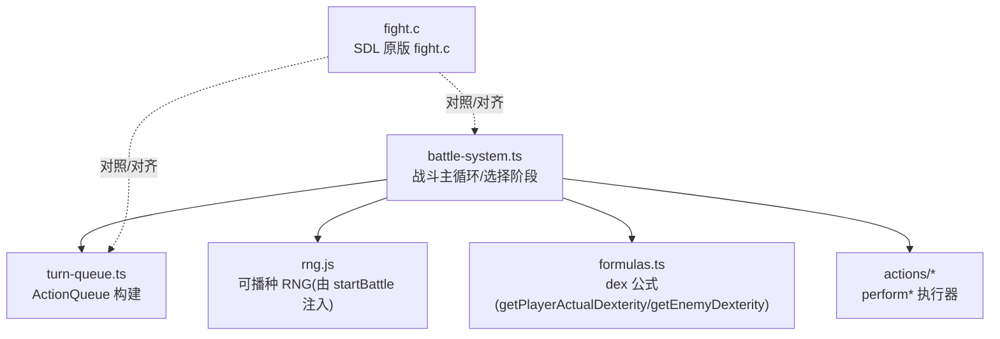
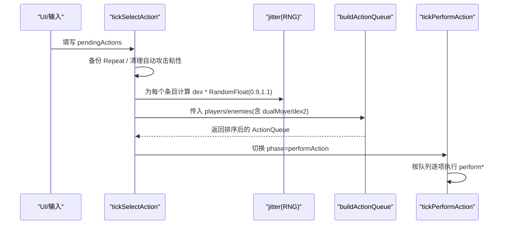
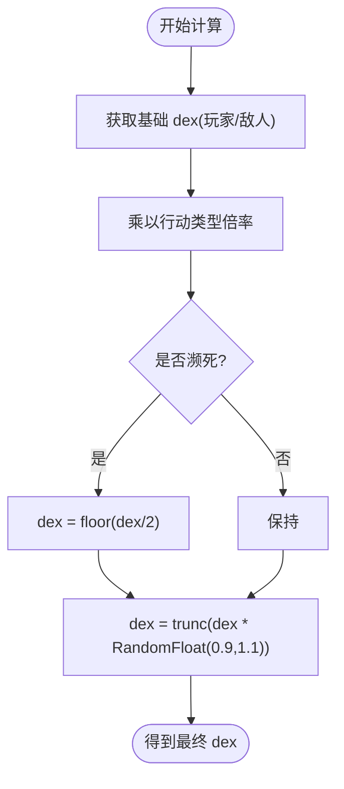
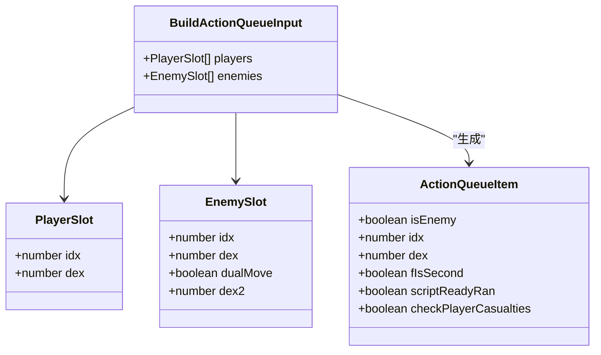
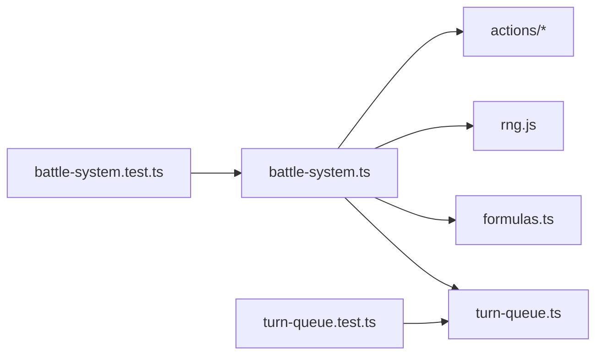

# 行动队列系统

<cite>
**本文引用的文件**   
- [battle-system.ts](file://packages/game/src/core/battle/battle-system.ts)
- [turn-queue.ts](file://packages/game/src/core/battle/turn-queue.ts)
- [battle-system.test.ts](file://packages/game/src/core/battle/__tests__/battle-system.test.ts)
- [turn-queue.test.ts](file://packages/game/src/core/battle/__tests__/turn-queue.test.ts)
- [fight.c](file://reference/sdlpal/fight.c)
</cite>

## 目录
1. [简介](#简介)
2. [项目结构](#项目结构)
3. [核心组件](#核心组件)
4. [架构总览](#架构总览)
5. [详细组件分析](#详细组件分析)
6. [依赖关系分析](#依赖关系分析)
7. [性能与确定性](#性能与确定性)
8. [故障排查指南](#故障排查指南)
9. [结论](#结论)
10. [附录：扩展与测试](#附录扩展与测试)

## 简介
本文件系统性梳理 Type-Pal 的回合制行动队列系统，聚焦 PAL_CLASSIC 路径下的行动顺序计算、敏捷值(dexterity)倍率机制、随机抖动因子、不同行动类型的优先级规则、ActionQueue 构建流程（先敌后玩家、dualMove 双重行动）、RNG 种子对顺序的影响与确定性保证、以及 Repeat 重放机制。文末提供自定义优先级与扩展新行动类型的方法，并给出平衡性调整与测试验证建议。

## 项目结构
围绕行动队列的核心代码位于 battle 子系统内：
- 战斗主循环与选择阶段逻辑：battle-system.ts
- 回合队列构建算法：turn-queue.ts
- 对照参考实现（SDL 原版）：reference/sdlpal/fight.c
- 单元测试覆盖关键行为：__tests__/battle-system.test.ts、__tests__/turn-queue.test.ts

图表来源
- [battle-system.ts:674-701](file://packages/game/src/core/battle/battle-system.ts#L674-L701)
- [turn-queue.ts:68-99](file://packages/game/src/core/battle/turn-queue.ts#L68-L99)
- [battle-system.ts:779-791](file://packages/game/src/core/battle/battle-system.ts#L779-L791)
- [battle-system.ts:826-839](file://packages/game/src/core/battle/battle-system.ts#L826-L839)
- [fight.c:1535-1569](file://reference/sdlpal/fight.c#L1535-L1569)

章节来源
- [battle-system.ts:674-701](file://packages/game/src/core/battle/battle-system.ts#L674-L701)
- [turn-queue.ts:68-99](file://packages/game/src/core/battle/turn-queue.ts#L68-L99)
- [battle-system.ts:779-791](file://packages/game/src/core/battle/battle-system.ts#L779-L791)
- [battle-system.ts:826-839](file://packages/game/src/core/battle/battle-system.ts#L826-L839)
- [fight.c:1535-1569](file://reference/sdlpal/fight.c#L1535-L1569)

## 核心组件
- 行动类型倍率函数：根据当前选择的行动类型返回 dex 倍率，决定本轮先后顺序。
- ActionQueue 构建器：将敌人和队员按最终 dex 降序排列，处理 dualMove 双重行动标记 fIsSecond。
- 选择阶段 tickSelectAction：收集所有活角色 pendingActions，备份 Repeat，调用 buildActionQueue 进入 performAction。
- RNG 与抖动：在填充队列前为每个条目乘以 RandomFloat(0.9,1.1)，确保与 SDL 一致。

章节来源
- [battle-system.ts:674-701](file://packages/game/src/core/battle/battle-system.ts#L674-L701)
- [turn-queue.ts:68-99](file://packages/game/src/core/battle/turn-queue.ts#L68-L99)
- [battle-system.ts:779-791](file://packages/game/src/core/battle/battle-system.ts#L779-L791)

## 架构总览
下图展示从“选择阶段”到“执行阶段”的关键数据流与控制流，包括 RNG 抖动、倍率应用、dualMove 处理与排序。

图表来源
- [battle-system.ts:779-791](file://packages/game/src/core/battle/battle-system.ts#L779-L791)
- [turn-queue.ts:68-99](file://packages/game/src/core/battle/turn-queue.ts#L68-L99)

## 详细组件分析

### 行动类型优先级与 dex 倍率
- 合击法术(coop-magic) ×10
- 防御(defend) ×5
- 辅助/防御法术(magic 且不可用于敌方) ×3；攻击法术 ×1
- 使用物品(item) ×3
- 逃跑(flee) ÷2（即 ×0.5）
- 其他默认 ×1

这些倍率直接作用于该角色的基础 dex，从而提升或降低其在本轮中的出手顺序。防御 ×5 使防御方优先入队，进入 perform 后立即处于防御姿态。

章节来源
- [battle-system.ts:674-701](file://packages/game/src/core/battle/battle-system.ts#L674-L701)
- [fight.c:1535-1569](file://reference/sdlpal/fight.c#L1535-L1569)

### 敏捷值(dexterity)倍率系统与濒死修正
- 基础 dex 来源：
  - 玩家：getPlayerActualDexterity（装备、状态等影响）
  - 敌人：getEnemyDexterity（等级与自身敏捷）
- 行动类型倍率：见上节
- 濒死修正：当角色 hp 低于阈值时 dex 再 ÷2
- 随机抖动：每条 dex 乘以 RandomFloat(0.9,1.1) 并截断整数

注意：玩家 base dex 不含 level 项（仅敌人有等级加成），避免高等级玩家异常抢先。

图表来源
- [battle-system.ts:826-839](file://packages/game/src/core/battle/battle-system.ts#L826-L839)
- [fight.c:1535-1569](file://reference/sdlpal/fight.c#L1535-L1569)

章节来源
- [battle-system.ts:826-839](file://packages/game/src/core/battle/battle-system.ts#L826-L839)
- [battle-system.test.ts:1634-1653](file://packages/game/src/core/battle/__tests__/battle-system.test.ts#L1634-L1653)

### ActionQueue 构建过程与 dualMove 双重行动
- 填充顺序：先全部敌人，再全部队员（与 SDL 一致）。
- dualMove 敌人：每轮无条件入队两次；第二次独立二抽 dex（若提供 dex2），比较两条 dex 确定 fIsSecond 标记（较小者作为第二动）。
- 排序：稳定降序；同 dex 保持“敌人先于队员”的填充顺序。

图表来源
- [turn-queue.ts:15-56](file://packages/game/src/core/battle/turn-queue.ts#L15-L56)
- [turn-queue.ts:68-99](file://packages/game/src/core/battle/turn-queue.ts#L68-L99)

章节来源
- [turn-queue.ts:68-99](file://packages/game/src/core/battle/turn-queue.ts#L68-L99)
- [turn-queue.test.ts:20-30](file://packages/game/src/core/battle/__tests__/turn-queue.test.ts#L20-L30)
- [turn-queue.test.ts:80-105](file://packages/game/src/core/battle/__tests__/turn-queue.test.ts#L80-L105)
- [battle-system.test.ts:3320-3344](file://packages/game/src/core/battle/__tests__/battle-system.test.ts#L3320-L3344)

### RNG 种子与确定性保证
- 战斗启动时通过 createSeedableRng 创建 RNG，startBattle 接受 rngSeed 参数；未传则用 Date.now()。
- 队列构建前对每个条目进行 jitter 抽取，必须严格遵循“先敌人（含 dualMove 二抽）后玩家”的顺序，以保证与 SDL 一致的 RNG 序列。
- 单测中可通过固定 rngSeed 复现相同行动顺序，便于回归与基准比对。

章节来源
- [battle-system.ts:277-335](file://packages/game/src/core/battle/battle-system.ts#L277-L335)
- [battle-system.ts:779-791](file://packages/game/src/core/battle/battle-system.ts#L779-L791)
- [battle-system.test.ts:399-421](file://packages/game/src/core/battle/__tests__/battle-system.test.ts#L399-L421)

### 行动队列的重放机制与 Repeat 功能
- 备份策略：在“全员 action 已决定、填 action queue 前”备份本轮 actions，供 R 键重复使用；即使本轮击杀最后敌人，也会成为下一场 R 的来源。
- 触发条件：若本轮由 Repeat 触发，则不覆盖 prevAction（fRepeat gate）。
- 生命周期：每轮 build 前清理执行期 auto-attack 粘性，防止跨轮残留。

章节来源
- [battle-system.ts:779-791](file://packages/game/src/core/battle/battle-system.ts#L779-L791)

## 依赖关系分析
- battle-system.ts 依赖 turn-queue.ts 的 buildActionQueue 完成排序。
- battle-system.ts 依赖 formulas.ts 的 getPlayerActualDexterity/getEnemyDexterity 获取基础 dex。
- battle-system.ts 依赖 rng.js 的 createSeedableRng 提供确定性 RNG。
- 单元测试覆盖关键分支：dualMove、同 dex 稳定性、玩家 base dex 不含 level 项等。

图表来源
- [battle-system.ts:779-791](file://packages/game/src/core/battle/battle-system.ts#L779-L791)
- [turn-queue.ts:68-99](file://packages/game/src/core/battle/turn-queue.ts#L68-L99)
- [battle-system.test.ts:3320-3344](file://packages/game/src/core/battle/__tests__/battle-system.test.ts#L3320-L3344)
- [turn-queue.test.ts:8-18](file://packages/game/src/core/battle/__tests__/turn-queue.test.ts#L8-L18)

章节来源
- [battle-system.ts:779-791](file://packages/game/src/core/battle/battle-system.ts#L779-L791)
- [turn-queue.ts:68-99](file://packages/game/src/core/battle/turn-queue.ts#L68-L99)
- [battle-system.test.ts:3320-3344](file://packages/game/src/core/battle/__tests__/battle-system.test.ts#L3320-L3344)
- [turn-queue.test.ts:8-18](file://packages/game/src/core/battle/__tests__/turn-queue.test.ts#L8-L18)

## 性能与确定性
- 时间复杂度：每轮 O(N log N)（N 为参与者数量），排序为稳定排序。
- 空间复杂度：O(N) 存储队列项。
- 确定性：通过固定 rngSeed 与严格的 RNG 抽取顺序，确保多平台/多次运行结果一致。

[本节为通用指导，无需源码引用]

## 故障排查指南
- 玩家 base dex 误加 level 项导致高等级抢先：检查 getPlayerActualDexterity 是否混入等级项（应无）。
- dualMove 未按必双动：确认 CLASSIC 路径下 wDualMove 非零即每轮入队两次，不应掷骰判定。
- 同 dex 顺序不稳定：确认排序为稳定降序，且填充顺序为先敌后玩家。
- RNG 错位导致后续目标选择错乱：核对 jitter 抽取顺序（先敌人含二抽，再玩家）。

章节来源
- [battle-system.test.ts:1634-1653](file://packages/game/src/core/battle/__tests__/battle-system.test.ts#L1634-L1653)
- [battle-system.test.ts:3320-3344](file://packages/game/src/core/battle/__tests__/battle-system.test.ts#L3320-L3344)
- [turn-queue.test.ts:32-52](file://packages/game/src/core/battle/__tests__/turn-queue.test.ts#L32-L52)

## 结论
Type-Pal 的行动队列系统在 PAL_CLASSIC 路径下高度还原 SDL 原版：以 dexterity 为核心，结合行动类型倍率、濒死修正与随机抖动，采用“先敌后玩家”的稳定排序，支持 dualMove 双重行动与 Repeat 重放。通过可播种 RNG 与完善的单测，保证了行为一致性与可重现性。

[本节为总结，无需源码引用]

## 附录：扩展与测试

### 如何自定义行动优先级规则
- 修改行动类型倍率：在 actionDexMultiplier 中新增 case 分支，返回新的倍率值。
- 示例路径：[actionDexMultiplier:674-701](file://packages/game/src/core/battle/battle-system.ts#L674-L701)

### 如何扩展新的行动类型
- 定义新 BattleAction.type 并在 actionDexMultiplier 中映射倍率。
- 在 perform 阶段添加对应 performNewAction 处理器，并在 tickPerformAction 路由中接入。
- 示例路径：
  - [actionDexMultiplier:674-701](file://packages/game/src/core/battle/battle-system.ts#L674-L701)
  - [tickPerformAction 入口:597-602](file://packages/game/src/core/battle/battle-system.ts#L597-L602)

### 行动平衡性调整建议
- 合击法术 ×10 与防御 ×5 显著影响先手，谨慎调高其他行动倍率以免破坏节奏。
- 逃跑 ÷2 强化生存压力，需配合 fleeRate 与场景脚本综合评估。
- 濒死 ÷2 增加弱势方风险，建议搭配复活/保护类法术平衡。

### 测试验证方法
- 固定 rngSeed 复现同一回合顺序，断言 ActionQueue 的 dex 序列与 fIsSecond 标记。
- 针对 dualMove 与非零 wDualMove 的必双动行为编写用例。
- 验证同 dex 稳定性与“敌人先于队员”的填充顺序。
- 示例路径：
  - [turn-queue.test.ts:8-106](file://packages/game/src/core/battle/__tests__/turn-queue.test.ts#L8-L106)
  - [battle-system.test.ts DH2 dualMove:3320-3344](file://packages/game/src/core/battle/__tests__/battle-system.test.ts#L3320-L3344)
  - [battle-system.test.ts 玩家 base dex 不含 level:1634-1653](file://packages/game/src/core/battle/__tests__/battle-system.test.ts#L1634-L1653)