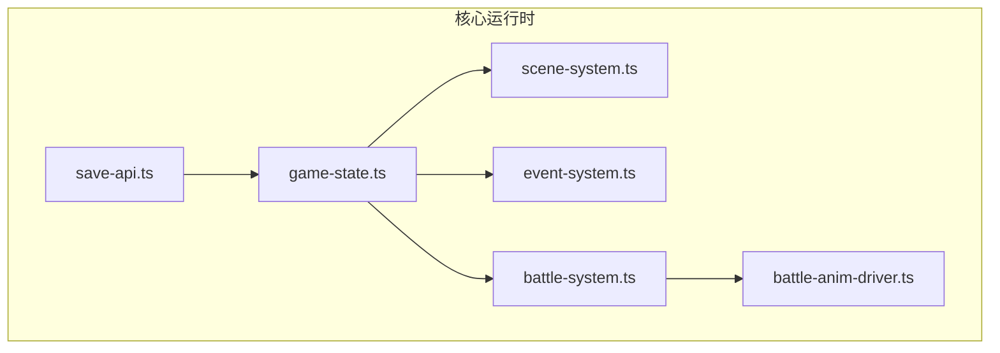
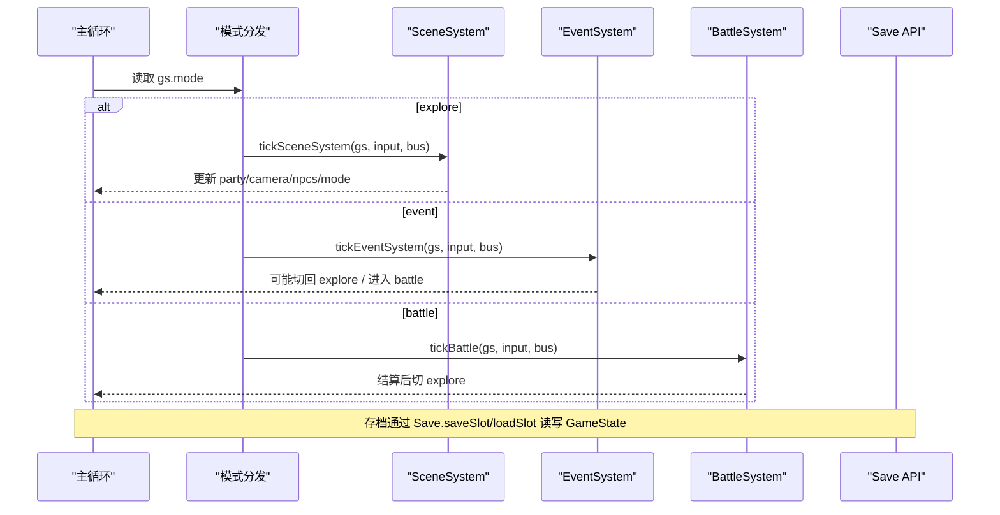
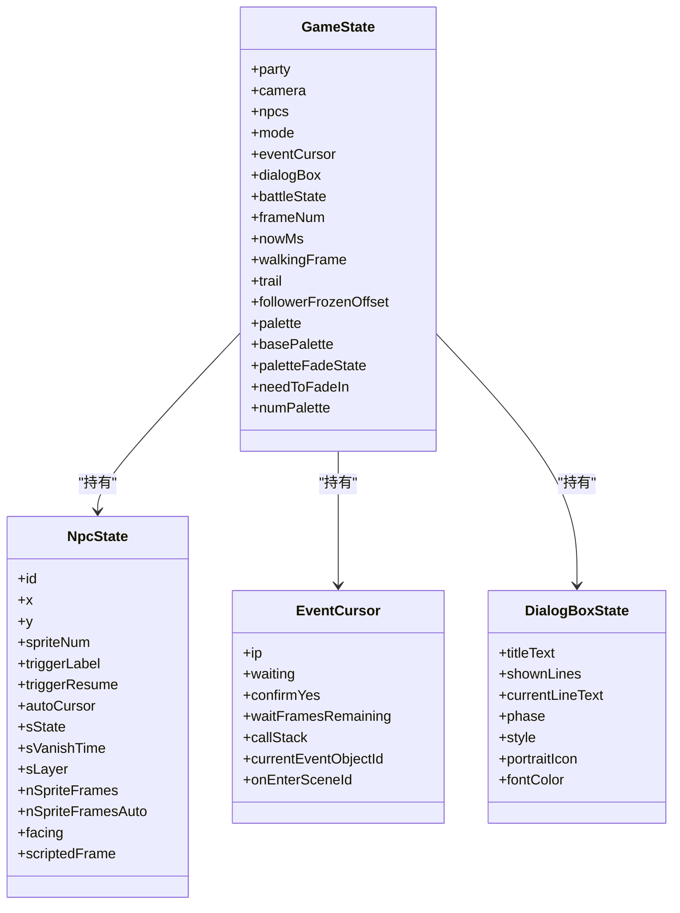
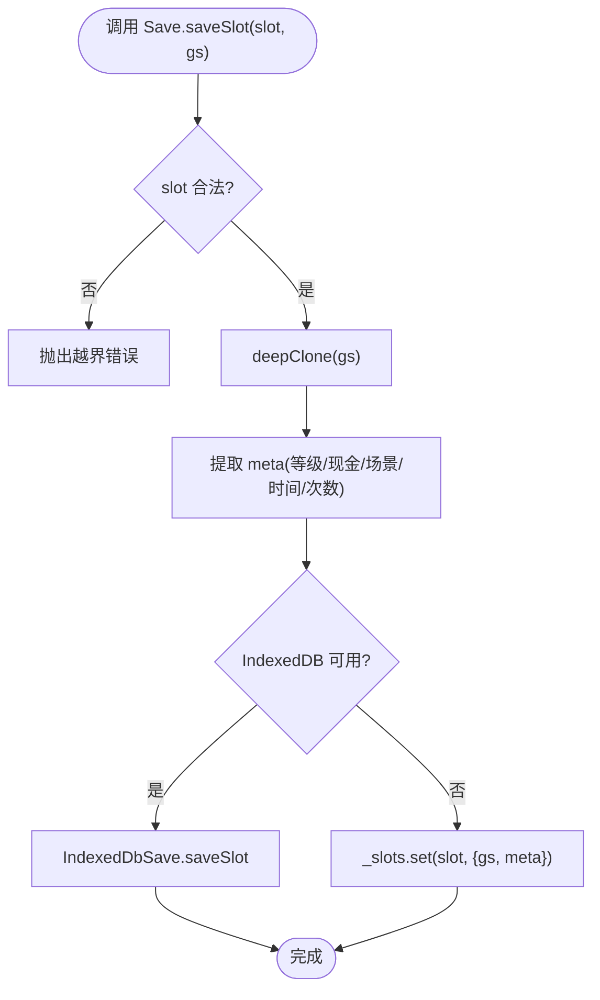
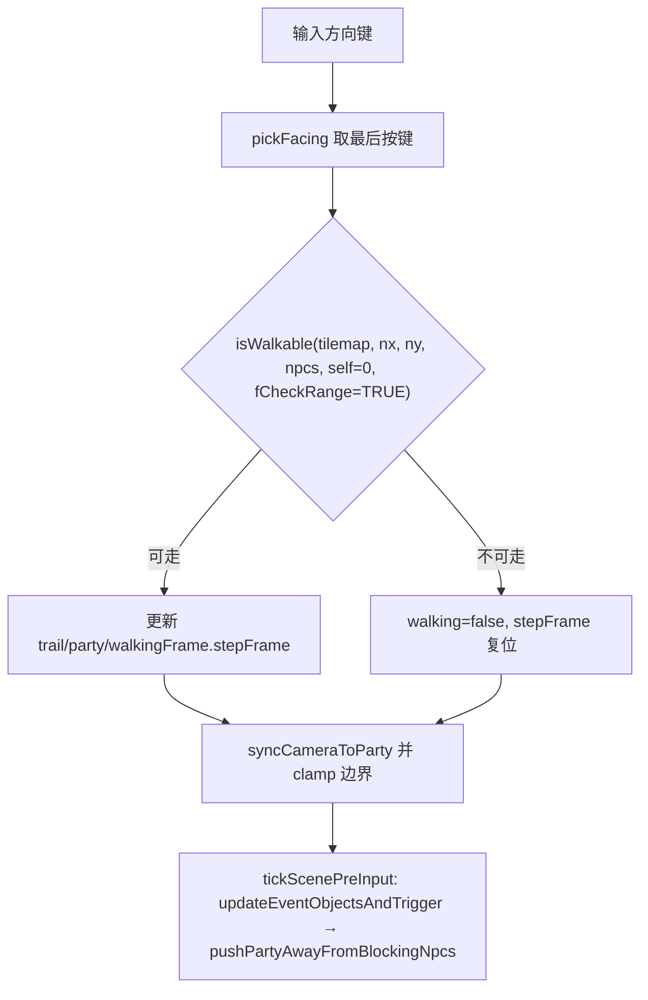
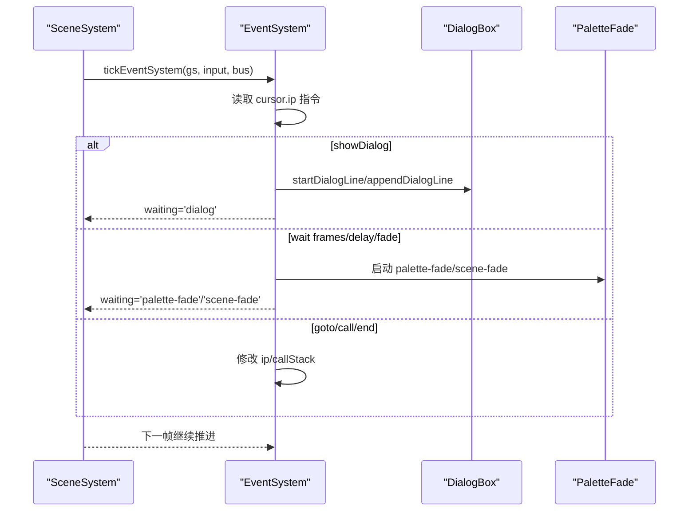
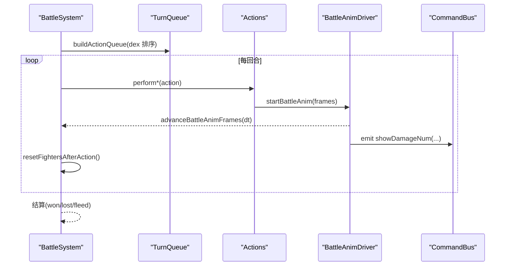
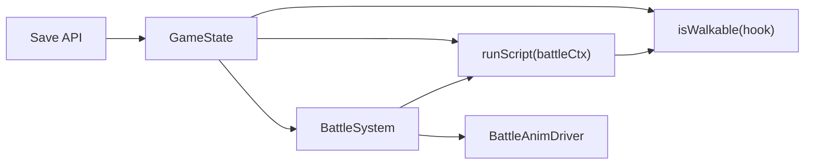

# 核心系统

<cite>
**本文引用的文件**   
- [README.md](file://README.md)
- [game-state.ts](file://packages/game/src/core/game-state.ts)
- [scene-system.ts](file://packages/game/src/core/scene-system.ts)
- [event-system.ts](file://packages/game/src/core/event-system.ts)
- [battle-system.ts](file://packages/game/src/core/battle/battle-system.ts)
- [battle-anim-driver.ts](file://packages/game/src/core/battle/battle-anim-driver.ts)
- [save-api.ts](file://packages/game/src/core/save/api.ts)
- [api.test.ts](file://packages/game/src/core/save/__tests__/api.test.ts)
- [scene-system.test.ts](file://packages/game/src/core/scene-system.test.ts)
- [game-state.test.ts](file://packages/game/src/core/game-state.test.ts)
- [actions.test.ts](file://packages/game/src/core/battle/__tests__/actions.test.ts)
</cite>

## 目录
1. [引言](#引言)
2. [项目结构](#项目结构)
3. [核心组件](#核心组件)
4. [架构总览](#架构总览)
5. [详细组件分析](#详细组件分析)
6. [依赖关系分析](#依赖关系分析)
7. [性能考量](#性能考量)
8. [故障排查指南](#故障排查指南)
9. [结论](#结论)
10. [附录](#附录)

## 引言
本文件为 Type-Pal 第一阶段（忠实还原）的核心系统综合文档，聚焦以下子系统：
- 游戏状态管理系统（GameState）：作为唯一真相源，覆盖序列化、存档机制与状态变更追踪。
- 场景系统：碰撞检测算法、NPC 行为模式、相机控制逻辑。
- 战斗系统：回合制流程、伤害计算要点、AI 决策、动画时间线同步。
- 事件系统：脚本执行器、对话管理、条件判断与协程式步进器。

目标读者包括对代码实现感兴趣的开发者与希望理解系统行为的策划/测试人员。

## 项目结构
Type-Pal 采用多包工作区组织，核心运行时位于 packages/game/src/core 下，按职责划分为 game-state、scene-system、event-system、battle 等模块；存档 API 独立于 save 子目录。

图表来源
- [game-state.ts:1-120](file://packages/game/src/core/game-state.ts#L1-L120)
- [scene-system.ts:1-60](file://packages/game/src/core/scene-system.ts#L1-L60)
- [event-system.ts:1-60](file://packages/game/src/core/event-system.ts#L1-L60)
- [battle-system.ts:1-120](file://packages/game/src/core/battle/battle-system.ts#L1-L120)
- [battle-anim-driver.ts:108-154](file://packages/game/src/core/battle/battle-anim-driver.ts#L108-L154)
- [save-api.ts:1-60](file://packages/game/src/core/save/api.ts#L1-L60)

章节来源
- [README.md:1-139](file://README.md#L1-L139)

## 核心组件
- GameState：单一真相源，统一持有探索/事件/战斗/菜单等所有运行态数据，字段冻结以支持 JSON 序列化与存档。
- SceneSystem：负责 explore 模式的输入处理、移动与碰撞、自动触发、NPC 阻挡与推离、相机跟随与边界限制。
- EventSystem：事件脚本解释器，协程式步进、等待/阻塞、对话显示、调色板淡入淡出、场景切换等。
- BattleSystem：回合制主循环、阶段路由、行动队列、动画时间线驱动、结算与退出。
- Save API：槽位级存档接口，内存或 IndexedDB 持久化，深拷贝保证隔离。

章节来源
- [game-state.ts:1-120](file://packages/game/src/core/game-state.ts#L1-L120)
- [scene-system.ts:1-60](file://packages/game/src/core/scene-system.ts#L1-L60)
- [event-system.ts:1-60](file://packages/game/src/core/event-system.ts#L1-L60)
- [battle-system.ts:1-120](file://packages/game/src/core/battle/battle-system.ts#L1-L120)
- [save-api.ts:1-60](file://packages/game/src/core/save/api.ts#L1-L60)

## 架构总览
下图展示核心模块间的调用与数据流向：主循环根据 mode 分发到 scene/battle/event；事件系统与战斗系统共享全局命令表；存档层读写 GameState。

图表来源
- [scene-system.ts:575-584](file://packages/game/src/core/scene-system.ts#L575-L584)
- [event-system.ts:1496-1510](file://packages/game/src/core/event-system.ts#L1496-L1510)
- [battle-system.ts:472-514](file://packages/game/src/core/battle/battle-system.ts#L472-L514)
- [save-api.ts:55-96](file://packages/game/src/core/save/api.ts#L55-L96)

## 详细组件分析

### 游戏状态管理系统（GameState）
- 设计理念：单一真相源，所有子系统只读/写同一份状态对象，避免多源不一致。
- 序列化与存档：全字段冻结，JSON.stringify/parse 可逆；存档使用 deepClone 隔离写入。
- 状态变更追踪：通过明确的可变字段（如 PlayerRolesRuntime、rgPoisonStatus、dialogBox、paletteFadeState 等）记录变化点，便于调试与回放。

图表来源
- [game-state.ts:655-800](file://packages/game/src/core/game-state.ts#L655-L800)
- [game-state.ts:82-224](file://packages/game/src/core/game-state.ts#L82-L224)
- [game-state.ts:226-343](file://packages/game/src/core/game-state.ts#L226-L343)
- [game-state.ts:354-496](file://packages/game/src/core/game-state.ts#L354-L496)

章节来源
- [game-state.ts:1-120](file://packages/game/src/core/game-state.ts#L1-L120)
- [game-state.ts:655-800](file://packages/game/src/core/game-state.ts#L655-L800)
- [game-state.ts:226-343](file://packages/game/src/core/game-state.ts#L226-L343)
- [game-state.ts:354-496](file://packages/game/src/core/game-state.ts#L354-L496)

#### 存档机制与序列化
- 槽位模型：1..5 槽位，meta 包含队伍等级、现金、场景编号、保存时间与累计保存次数。
- 存储后端：优先 IndexedDB，不可用时回退 to in-memory Map。
- 深拷贝：save/load 均返回深拷贝，避免跨槽位污染。

图表来源
- [save-api.ts:55-96](file://packages/game/src/core/save/api.ts#L55-L96)
- [api.test.ts:38-80](file://packages/game/src/core/save/__tests__/api.test.ts#L38-L80)

章节来源
- [save-api.ts:1-97](file://packages/game/src/core/save/api.ts#L1-L97)
- [api.test.ts:38-80](file://packages/game/src/core/save/__tests__/api.test.ts#L38-L80)

#### 状态变更追踪与冻结
- 冻结策略：全字段冻结确保 JSON 往返一致，单测验证 round-trip 相等。
- 关键可变区域：PlayerRolesRuntime、rgPoisonStatus、dialogBox、paletteFadeState、eventCursor 等。

章节来源
- [game-state.test.ts:272-332](file://packages/game/src/core/game-state.test.ts#L272-L332)

### 场景系统（Scene System）
- 碰撞检测：菱形四分法映射 tile，bit13 障碍位判定；NPC 仅 sState>=2 时阻挡；contact 怪物不阻挡但可触发战斗。
- NPC 行为：自动触发区距离公式按 triggerMode 分级；search 视觉反馈（NPC 转向 + 全员面向 NPC）。
- 相机控制：camera = party - PARTYOFFSET，边界 clamp；pushPartyAwayFromBlockingNpcs 在自动脚本/trigger 后把 party 推离阻挡物。

图表来源
- [scene-system.ts:371-434](file://packages/game/src/core/scene-system.ts#L371-L434)
- [scene-system.ts:443-465](file://packages/game/src/core/scene-system.ts#L443-L465)
- [scene-system.ts:269-296](file://packages/game/src/core/scene-system.ts#L269-L296)

章节来源
- [scene-system.ts:1-661](file://packages/game/src/core/scene-system.ts#L1-L661)
- [scene-system.test.ts:122-140](file://packages/game/src/core/scene-system.test.ts#L122-L140)

### 事件系统（Event System）
- 协程式步进器：loop-until-waitable，遇到等待型 opcode 挂起，下一帧恢复。
- 对话管理：打字机效果、分页、样式切换、标题/头像布局、部分清屏与恢复。
- 条件判断与跳转：goto、随机跳转、条件跳转、call 子脚本栈。
- 特效与场景：调色板 fade、屏幕淡入淡出、场景切换、RNG 播放、波浪等。

图表来源
- [event-system.ts:1496-1510](file://packages/game/src/core/event-system.ts#L1496-L1510)
- [event-system.ts:500-533](file://packages/game/src/core/event-system.ts#L500-L533)
- [event-system.ts:571-598](file://packages/game/src/core/event-system.ts#L571-L598)

章节来源
- [event-system.ts:1-800](file://packages/game/src/core/event-system.ts#L1-L800)

### 战斗系统（Battle System）
- 回合制流程：preBattle → selectAction → performAction → postAction → won/lost/fleed → finalize。
- 行动队列：dex 倍率决定先后顺序，先敌后友，含 dualMove 二次抽取。
- 动画时间线：startBattleAnim/advanceBattleAnimFrames 驱动帧序列，perform 阶段与 selectAction 起手脚本动画共用推进。
- AI 决策：decideEnemyAction 基于 enemy object 的脚本钩子与默认 fallback。
- 伤害与状态：伤害公式与状态影响由 formulas/status 模块提供，present 层消费 damageNum 弹幕。

图表来源
- [battle-system.ts:472-614](file://packages/game/src/core/battle/battle-system.ts#L472-L614)
- [battle-system.ts:544-561](file://packages/game/src/core/battle/battle-system.ts#L544-L561)
- [battle-anim-driver.ts:108-154](file://packages/game/src/core/battle/battle-anim-driver.ts#L108-L154)
- [actions.test.ts:1457-1469](file://packages/game/src/core/battle/__tests__/actions.test.ts#L1457-L1469)

章节来源
- [battle-system.ts:1-800](file://packages/game/src/core/battle/battle-system.ts#L1-L800)
- [battle-anim-driver.ts:108-154](file://packages/game/src/core/battle/battle-anim-driver.ts#L108-L154)
- [actions.test.ts:1457-1469](file://packages/game/src/core/battle/__tests__/actions.test.ts#L1457-L1469)

## 依赖关系分析
- 低耦合高内聚：各系统通过 GameState 解耦，事件系统与战斗系统共享全局命令表，避免重复解析。
- 外部依赖：Present 层通过 CommandBus 接收表现命令（如伤害数字），音频/资源加载通过注入函数接入。
- 潜在环依赖：event-system 通过注入回调访问 isWalkable，避免反向 import 形成环。

图表来源
- [event-system.ts:706-721](file://packages/game/src/core/event-system.ts#L706-L721)
- [battle-system.ts:421-425](file://packages/game/src/core/battle/battle-system.ts#L421-L425)
- [battle-anim-driver.ts:108-154](file://packages/game/src/core/battle/battle-anim-driver.ts#L108-L154)
- [save-api.ts:55-96](file://packages/game/src/core/save/api.ts#L55-L96)

章节来源
- [event-system.ts:706-721](file://packages/game/src/core/event-system.ts#L706-L721)
- [battle-system.ts:421-425](file://packages/game/src/core/battle/battle-system.ts#L421-L425)

## 性能考量
- 碰撞与寻路：菱形四分法与 bit13 判定 O(1)，NPC 阻挡遍历 O(N)，建议保持 npc 列表精简。
- 动画时间线：按 dt 推进，避免每帧重建帧序列；perform 阶段复用推进逻辑减少分支。
- 存档 IO：IndexedDB 异步写入，内存路径用于测试快速重置；深拷贝开销可控，注意大对象频繁存盘。

## 故障排查指南
- 存档异常：检查 slot 范围 1..5，确认 deepClone 是否成功，对比 meta 字段是否完整。
- 场景卡死：确认 paletteFadeState/sceneLoading 守卫未误冻结；检查 needToFadeIn 自动 FadeIn 是否被提前消费。
- 战斗卡顿：查看 phaseStallTicks 保护阈值；确认 battleAnim 与 dialog 队列优先级是否正确。
- 事件死循环：SINGLE_TICK_LIMIT 兜底，定位 raw opcode 链与 goto 自指。

章节来源
- [save-api.ts:55-96](file://packages/game/src/core/save/api.ts#L55-L96)
- [event-system.ts:645-671](file://packages/game/src/core/event-system.ts#L645-L671)
- [battle-system.ts:484-498](file://packages/game/src/core/battle/battle-system.ts#L484-L498)

## 结论
Type-Pal 的核心系统围绕 GameState 这一单一真相源构建，场景、事件、战斗三大子系统各司其职并通过清晰的接口交互。通过严格的 SDLPal 真值对齐与详尽的单测保障，系统在保真度与可维护性之间取得平衡。后续可在性能优化与扩展性方面持续改进，例如引入更细粒度的脏标记与增量渲染。

## 附录
- 常用 API 参考（路径引用）
  - 场景加载与切换：[loadScene:607-661](file://packages/game/src/core/scene-system.ts#L607-L661)
  - 事件步进与等待：[tickEventSystem:1496-1510](file://packages/game/src/core/event-system.ts#L1496-L1510)
  - 战斗主循环：[tickBattle:472-614](file://packages/game/src/core/battle/battle-system.ts#L472-L614)
  - 动画时间线推进：[advanceBattleAnimFrames:140-154](file://packages/game/src/core/battle/battle-anim-driver.ts#L140-L154)
  - 存档接口：[Save.saveSlot/loadSlot/listSlots/deleteSlot:55-96](file://packages/game/src/core/save/api.ts#L55-L96)