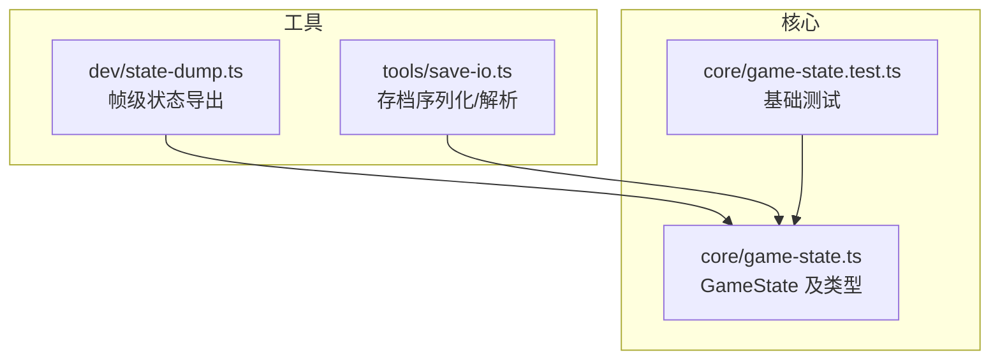
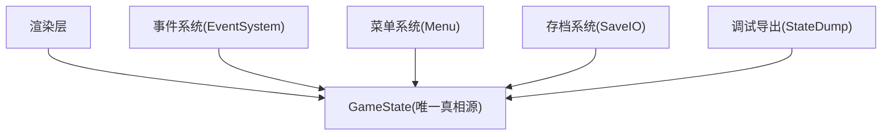
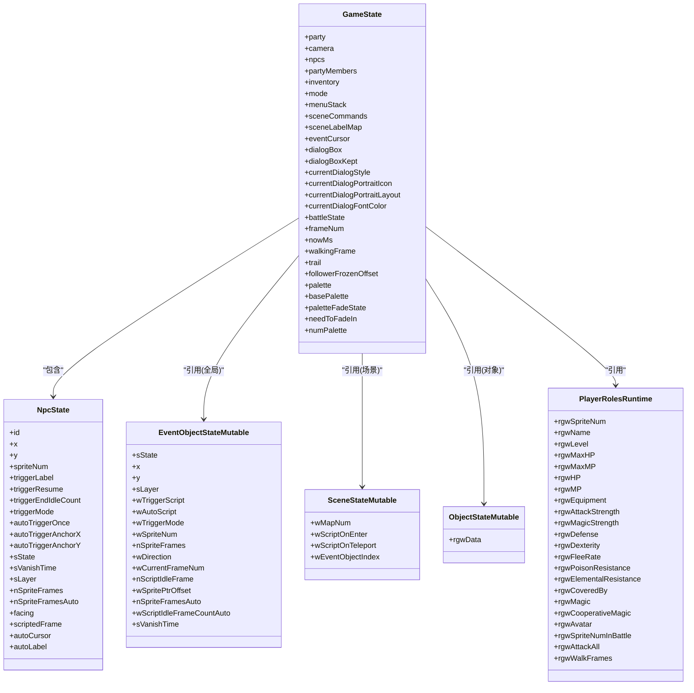
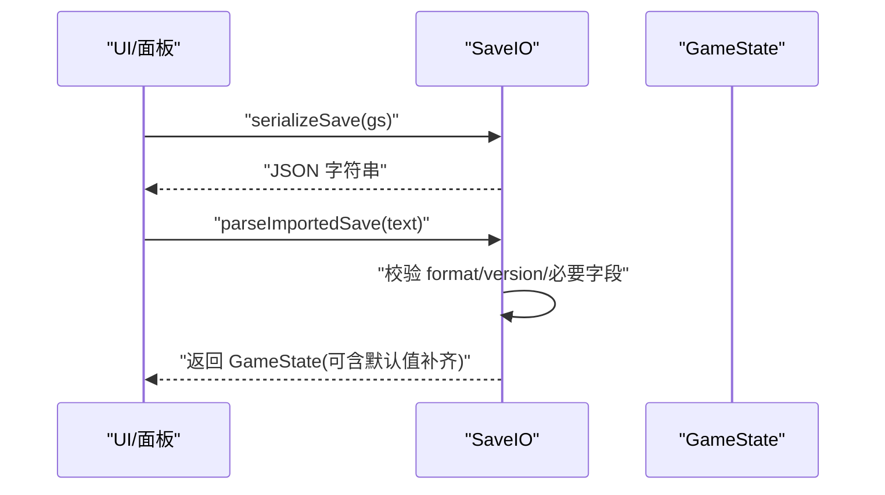
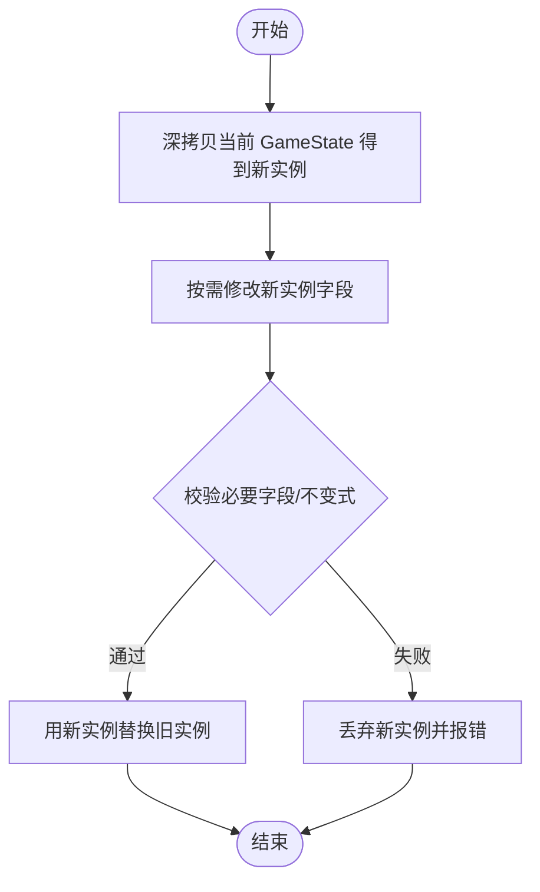
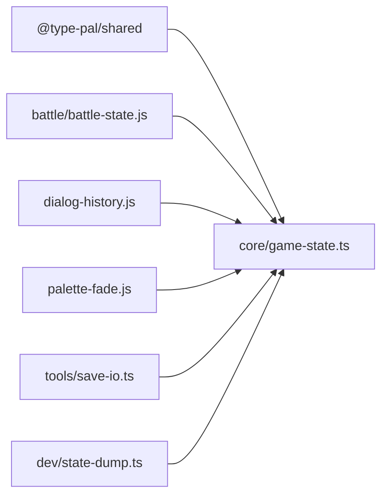

# 游戏状态管理

<cite>
**本文引用的文件**
- [game-state.ts](file://packages/game/src/core/game-state.ts)
- [save-io.ts](file://packages/game/src/tools/save-io.ts)
- [state-dump.ts](file://packages/game/src/dev/state-dump.ts)
- [game-state.test.ts](file://packages/game/src/core/game-state.test.ts)
</cite>

## 目录
1. [简介](#简介)
2. [项目结构](#项目结构)
3. [核心组件](#核心组件)
4. [架构总览](#架构总览)
5. [详细组件分析](#详细组件分析)
6. [依赖关系分析](#依赖关系分析)
7. [性能与内存优化](#性能与内存优化)
8. [故障排查指南](#故障排查指南)
9. [结论](#结论)
10. [附录：版本兼容与迁移](#附录：版本兼容与迁移)

## 简介
本文件为 Type-Pal 的“游戏状态管理系统”提供系统化文档，围绕 GameState 作为唯一真相源（Single Source of Truth）的设计理念展开。内容涵盖：
- 状态结构定义、字段语义与版本兼容性处理
- 存档序列化/反序列化机制、格式与数据迁移策略
- 状态变更追踪、不可变更新模式、快照与调试支持
- 队伍成员管理（partyMembers）、NPC 状态（NpcState）、事件对象可变状态（EventObjectStateMutable）等核心数据结构
- 安全读写状态的实践建议与示例路径
- 性能优化与内存管理最佳实践

## 项目结构
与状态管理直接相关的代码位于 packages/game 子包中：
- core/game-state.ts：GameState 及其相关类型、常量与初始态构造
- tools/save-io.ts：存档导入导出（纯序列化/校验）
- dev/state-dump.ts：帧级状态 dump（用于与 sdlpal 对齐比对）
- core/game-state.test.ts：GameState 基础行为测试

图表来源
- [game-state.ts:1-120](file://packages/game/src/core/game-state.ts#L1-L120)
- [save-io.ts:1-26](file://packages/game/src/tools/save-io.ts#L1-L26)
- [state-dump.ts:1-107](file://packages/game/src/dev/state-dump.ts#L1-L107)
- [game-state.test.ts:215-245](file://packages/game/src/core/game-state.test.ts#L215-L245)

章节来源
- [game-state.ts:1-120](file://packages/game/src/core/game-state.ts#L1-L120)
- [save-io.ts:1-26](file://packages/game/src/tools/save-io.ts#L1-L26)
- [state-dump.ts:1-107](file://packages/game/src/dev/state-dump.ts#L1-L107)
- [game-state.test.ts:215-245](file://packages/game/src/core/game-state.test.ts#L215-L245)

## 核心组件
- GameState：探索/事件/战斗模式的单一真相源，包含队伍、相机、NPC、菜单栈、事件游标、对话框、调色板、战斗状态等。
- NpcState：场景内 NPC 的可变运行时状态（位置、朝向、触发器、自动脚本、可见性、层级、动画帧等）。
- EventObjectStateMutable：全局事件对象的运行时可变字段集合（状态、坐标、触发/自动脚本、精灵帧等）。
- SceneStateMutable：场景运行时可变部分（地图号、onEnter/onTeleport 脚本入口、事件对象索引）。
- ObjectStateMutable：通用对象运行时可变部分（以固定长度数组按 C union 布局存储）。
- PlayerRolesRuntime：玩家角色运行时属性（等级、HP/MP、装备、魔法、抗性、战斗精灵等）。
- AllExperience / ExpEntry：经验系统（主经验、隐藏属性经验等）。
- DialogBoxState：对话框状态机（打字、翻页、样式、头像、颜色、延迟等）。
- EventCursor：事件脚本执行游标（ip、等待原因、调用栈、onEnter 进度等）。

章节来源
- [game-state.ts:506-651](file://packages/game/src/core/game-state.ts#L506-L651)
- [game-state.ts:655-800](file://packages/game/src/core/game-state.ts#L655-L800)
- [game-state.ts:800-1200](file://packages/game/src/core/game-state.ts#L800-L1200)
- [game-state.ts:1200-1600](file://packages/game/src/core/game-state.ts#L1200-L1600)
- [game-state.ts:1600-2070](file://packages/game/src/core/game-state.ts#L1600-L2070)

## 架构总览
GameState 作为唯一真相源，被以下子系统消费：
- 渲染层：读取 party/camera/npcs/palette/fade/dialog 等字段进行绘制
- 事件系统：基于 eventCursor 推进脚本，修改 npcs/allEventObjects/gs 字段
- 菜单系统：通过 menuStack 控制交互流程
- 存档系统：序列化 gs 到 JSON，带 format/version/savedAt 头
- 调试导出：dumpFrameJson 输出与 sdlpal 对齐的帧级 JSONL

图表来源
- [game-state.ts:1-120](file://packages/game/src/core/game-state.ts#L1-L120)
- [save-io.ts:1-26](file://packages/game/src/tools/save-io.ts#L1-L26)
- [state-dump.ts:1-107](file://packages/game/src/dev/state-dump.ts#L1-L107)

## 详细组件分析

### GameState 设计与字段语义
- 队伍与相机
  - party：队长像素坐标与朝向；camera 为屏幕左上对应的世界坐标（等价 sdlpal viewport），由 party 推导。
  - trail/followerFrozenOffset：队友跟随轨迹与冻结偏移，保证骑乘/非走路时跟随者位置稳定。
- 事件与脚本
  - sceneCommands/sceneLabelMap：当前场景的事件命令与标签映射，供 autoScript 在 explore 模式下运行。
  - eventCursor：当前事件脚本游标，含 waiting 原因、callStack、onEnter 进度等。
- 对话框
  - dialogBox/dialogBoxKept：双槽对话框（活动框与反位置冻结框），支持样式切换、头像、颜色、延时等。
- 调色板与特效 A
  - palette/basePalette/paletteFadeState/needToFadeIn/numPalette：工作调色板与目标调色板分离，fade 引擎仅改工作副本。
- 其他
  - mode/menuStack/battleState/frameNum/nowMs 等运行时元信息。

章节来源
- [game-state.ts:14-51](file://packages/game/src/core/game-state.ts#L14-L51)
- [game-state.ts:655-800](file://packages/game/src/core/game-state.ts#L655-L800)
- [game-state.ts:800-1200](file://packages/game/src/core/game-state.ts#L800-L1200)

#### 类图（核心类型关系）

图表来源
- [game-state.ts:506-651](file://packages/game/src/core/game-state.ts#L506-L651)
- [game-state.ts:655-800](file://packages/game/src/core/game-state.ts#L655-L800)
- [game-state.ts:800-1200](file://packages/game/src/core/game-state.ts#L800-L1200)

### 状态序列化与存档机制
- 存档格式
  - 顶层对象包含 format/version/savedAt/gs 四个字段。
  - gs 即完整 GameState 快照（或最小必要字段集，见解析校验）。
- 序列化
  - serializeSave(gs) → JSON 字符串
- 反序列化与校验
  - parseImportedSave(text) 会校验 JSON 合法性、format 头、以及必要字段（如 partyMembers、wNumScene）。
- 兼容性与迁移
  - 通过 format/version 区分不同存档版本；未来可在解析阶段根据 version 做字段补齐/迁移。
  - 生产端只持久化必要字段，避免冗余（例如 commands/labelMap 不内嵌大数组，改用 ip 下标）。

图表来源
- [save-io.ts:1-26](file://packages/game/src/tools/save-io.ts#L1-L26)

章节来源
- [save-io.ts:1-26](file://packages/game/src/tools/save-io.ts#L1-L26)

### 状态变更追踪与不可变更新
- 不可变更新模式
  - 推荐每次状态变更创建新的 GameState 对象（浅拷贝后替换关键字段），确保渲染/事件/菜单等消费者能感知变化。
- 状态快照
  - 使用 deepClone 生成快照用于回滚、回放或对比。
- 调试支持
  - initStateDump() 启用 per-frame 导出，dumpFrameJson 输出与 sdlpal 对齐的 JSONL，便于逐帧 diff。

章节来源
- [state-dump.ts:1-107](file://packages/game/src/dev/state-dump.ts#L1-L107)
- [game-state.ts:1-120](file://packages/game/src/core/game-state.ts#L1-L120)

### 队伍成员管理（partyMembers）
- partyMembers：队伍成员 role id 列表，决定跟随者数量与顺序。
- 渲染与行走
  - leader 的 wFrame 计算考虑方向、stepFrame、scriptedFrame 覆盖。
  - follower 位置由 trail 与 followerFrozenOffset 共同决定，非 walking 时冻结相对偏移。
- 初始化与默认
  - 测试断言默认空数组，实际填充由 bootstrap/fixture 决定。

章节来源
- [game-state.ts:655-760](file://packages/game/src/core/game-state.ts#L655-L760)
- [game-state.test.ts:215-245](file://packages/game/src/core/game-state.test.ts#L215-L245)
- [state-dump.ts:19-66](file://packages/game/src/dev/state-dump.ts#L19-L66)

### NPC 状态（NpcState）
- 关键语义
  - 位置/朝向/精灵帧：x/y/facing/scriptedFrame/nSpriteFrames/nSpriteFramesAuto
  - 触发器：triggerLabel/triggerMode/autoTriggerOnce/triggerResume（ip 下标，避免内嵌大数组）
  - 可见性与层级：sState/sVanishTime/sLayer
  - 自动脚本：autoCursor/autoLabel（每 tick 推进 1 op，支持 callStack 与 currentEventObjectId）
- 与 sdlpal 对齐
  - sState 负数表示临时隐藏，离开视口后恢复 abs(sState)。
  - nSpriteFramesAuto 装载时回填，驱动氛围动画循环。

章节来源
- [game-state.ts:82-224](file://packages/game/src/core/game-state.ts#L82-L224)

### 事件对象可变状态（EventObjectStateMutable）
- 用途：统一记录全局事件对象（包括门、箱子、机关等）的运行时可变字段。
- 字段覆盖：状态、坐标、层级、触发/自动脚本、精灵帧、脚本空闲计数、消失计时器等。
- 稀疏存储：仅保存被脚本改写过的对象，减少内存占用。

章节来源
- [game-state.ts:614-631](file://packages/game/src/core/game-state.ts#L614-L631)

### 场景与对象可变状态（SceneStateMutable / ObjectStateMutable）
- SceneStateMutable：场景级 onEnter/onTeleport 脚本入口、事件对象索引等。
- ObjectStateMutable：通用对象 union 的运行时可变部分，以固定长度数组按 C 布局存储。

章节来源
- [game-state.ts:637-651](file://packages/game/src/core/game-state.ts#L637-L651)

### 玩家角色运行时（PlayerRolesRuntime）
- 包含等级、HP/MP、装备、攻击/防御/速度、抗性、魔法、合击、战斗精灵等。
- 与装备效果叠加：最终 stat = base + Σ equipmentEffect。

章节来源
- [game-state.ts:536-560](file://packages/game/src/core/game-state.ts#L536-L560)
- [game-state.ts:589-606](file://packages/game/src/core/game-state.ts#L589-L606)

### 对话框状态机（DialogBoxState）
- 阶段：typing / line-done / waiting-page-key / waiting-end-key
- 特性：姓名标题行不计入正文行数；~NN 尾暂停；$NN 变速；图标与字体色跨行持续；setDialogStyleX 暂存 pendingStyle。
- 修复点：wall-clock 时间驱动打字精度提升；RestoreScreen 后的 partial clear 行为对齐原版。

章节来源
- [game-state.ts:345-496](file://packages/game/src/core/game-state.ts#L345-L496)

### 事件游标（EventCursor）
- 功能：维护当前脚本 ip、waiting 原因、callStack、onEnter 进度、delay/camera-pan 等。
- 与 npc trigger 联动：triggerOwnerId 用于持久化触发脚本推进（advance/reset/plain）。

章节来源
- [game-state.ts:226-343](file://packages/game/src/core/game-state.ts#L226-L343)

## 依赖关系分析
- 模块耦合
  - save-io.ts 仅依赖 GameState 类型，保持纯函数序列化/解析。
  - state-dump.ts 依赖 GameState 读取渲染所需字段，输出 JSONL。
  - game-state.ts 集中定义所有类型与常量，是各子系统的事实来源。
- 外部依赖
  - 共享类型来自 @type-pal/shared（Command、DialogBoxStyle、SceneEventObject 等）。
  - 战斗状态 BattleState 与对话历史、调色板淡入淡出等类型由同包内模块提供。

图表来源
- [game-state.ts:1-12](file://packages/game/src/core/game-state.ts#L1-L12)
- [save-io.ts:1-26](file://packages/game/src/tools/save-io.ts#L1-L26)
- [state-dump.ts:1-12](file://packages/game/src/dev/state-dump.ts#L1-L12)

章节来源
- [game-state.ts:1-12](file://packages/game/src/core/game-state.ts#L1-L12)
- [save-io.ts:1-26](file://packages/game/src/tools/save-io.ts#L1-L26)
- [state-dump.ts:1-12](file://packages/game/src/dev/state-dump.ts#L1-L12)

## 性能与内存优化
- 稀疏存储
  - 对频繁变化的对象（EventObjectStateMutable、SceneStateMutable、ObjectStateMutable）采用稀疏记录，仅保存被脚本改写过的条目。
- 避免大对象内嵌
  - 事件脚本 commands/labelMap 不在每个 cursor/NPC 中重复内嵌，统一使用全局下标 ip，显著降低存档体积。
- 调色板分离
  - basePalette 作为 fade 的目标/参照，palette 作为工作副本，避免不必要的重建与拷贝。
- 时间驱动
  - nowMs 使用 wall-clock，使对话打字等高频视觉不受逻辑 tick 频率限制，减少抖动与累积误差。
- 渲染缓存
  - followerFrozenOffset 为非存档语义的渲染缓存，避免每帧重算跟随者位置。

[本节为通用指导，无需列出具体文件来源]

## 故障排查指南
- 存档无法加载
  - 检查 format/version 是否匹配；确认必要字段存在（partyMembers、wNumScene）。
  - 若缺少可选字段，解析器应提供默认值或提示缺失项。
- 事件脚本不推进
  - 检查 eventCursor.waiting 是否为 'dialog'/'frame-wait' 等阻塞原因；确认 opcode 0x04 call-script 的 callStack 是否正确弹栈。
- NPC 触发异常
  - 核对 triggerMode 与 autoTriggerOnce 标记；确认 triggerResume.ip 指向下一条而非原点。
- 对话显示异常
  - 检查 DialogBoxState.pendingFullClear/pendingPreOpClear/pendingPartialClear 标志位是否与 opcode 行为一致。
- 帧级差异定位
  - 使用 initStateDump() 开启 per-frame dump，下载 ts-dump.jsonl 并与 sdlpal 输出逐行 diff。

章节来源
- [save-io.ts:12-25](file://packages/game/src/tools/save-io.ts#L12-L25)
- [game-state.ts:226-343](file://packages/game/src/core/game-state.ts#L226-L343)
- [game-state.ts:345-496](file://packages/game/src/core/game-state.ts#L345-L496)
- [state-dump.ts:73-106](file://packages/game/src/dev/state-dump.ts#L73-L106)

## 结论
通过将 GameState 作为唯一真相源，Type-Pal 实现了清晰的状态边界、可靠的序列化与调试能力。配合稀疏存储、脚本下标化、调色板分离与 wall-clock 驱动等设计，系统在正确性、可维护性与性能之间取得良好平衡。后续演进应继续遵循不可变更新与最小必要字段持久化的原则，并在版本升级时完善迁移管线。

[本节为总结，无需列出具体文件来源]

## 附录：版本兼容与迁移
- 版本标识
  - 存档头包含 format/version，用于识别存档版本。
- 向后兼容
  - 解析时校验必要字段，缺失则提供默认值或拒绝加载并给出中文错误信息。
- 迁移策略
  - 当 version 增加时，在解析阶段执行迁移步骤（补齐字段、重映射下标、清理废弃字段等），再返回 GameState。
- 示例路径
  - 序列化：serializeSave(gs)
  - 解析：parseImportedSave(text)

章节来源
- [save-io.ts:1-26](file://packages/game/src/tools/save-io.ts#L1-L26)