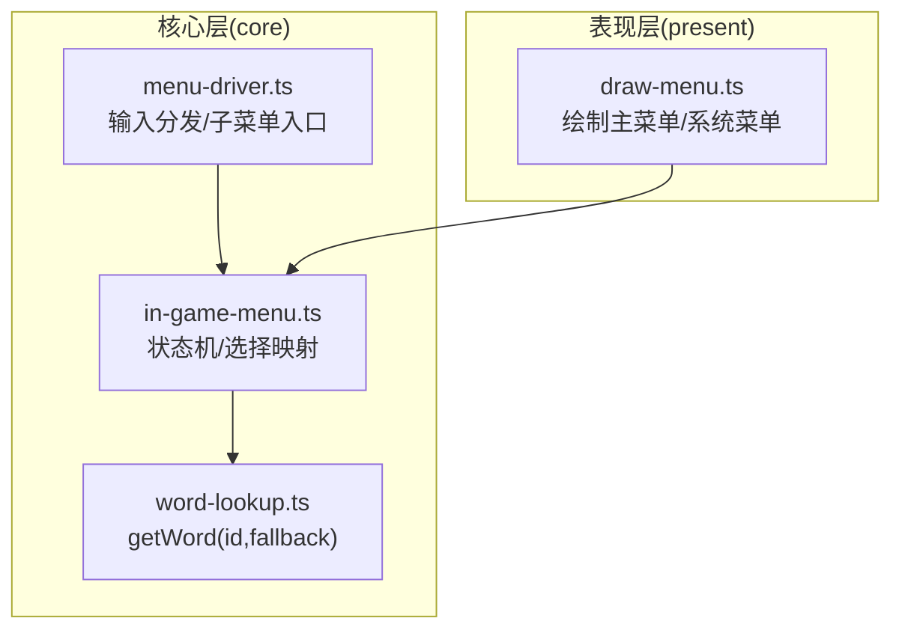
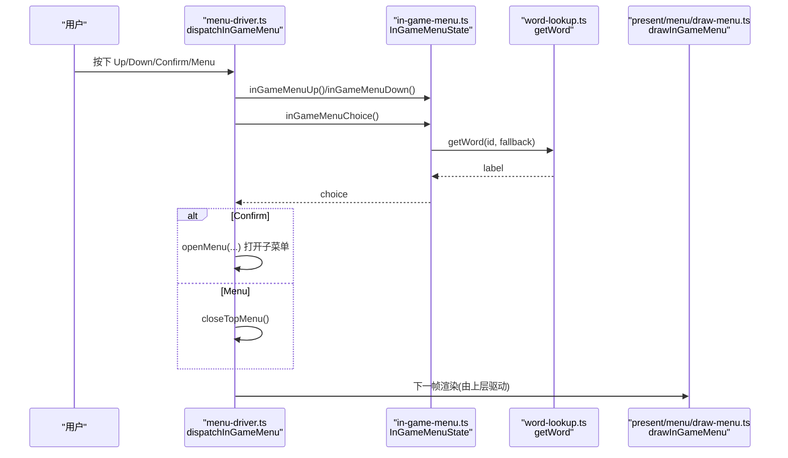
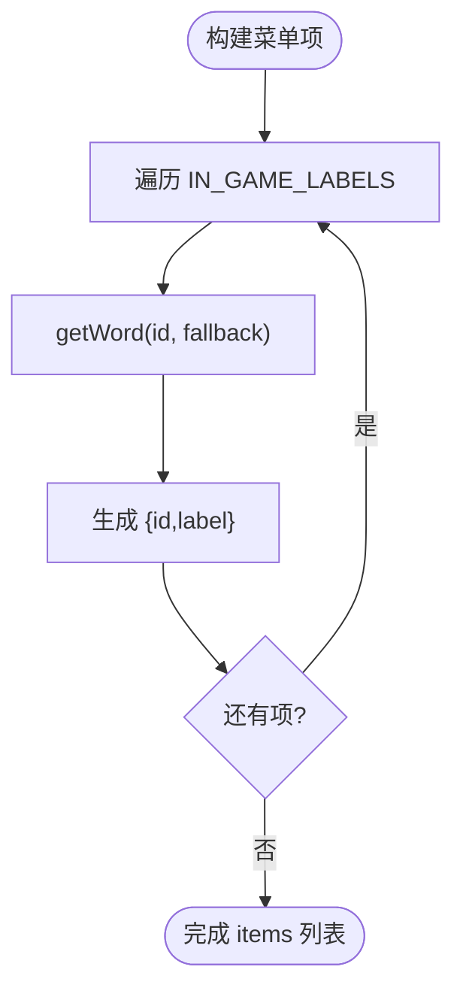
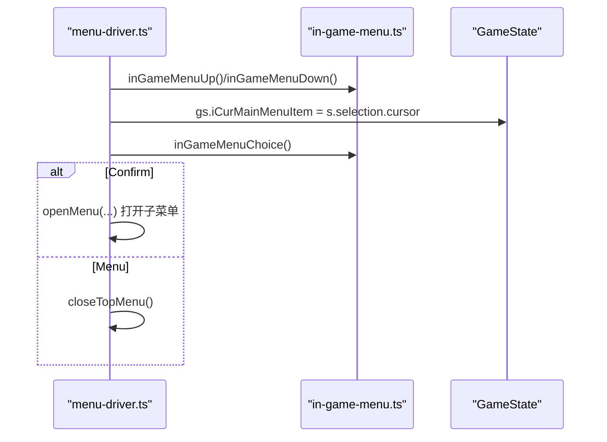
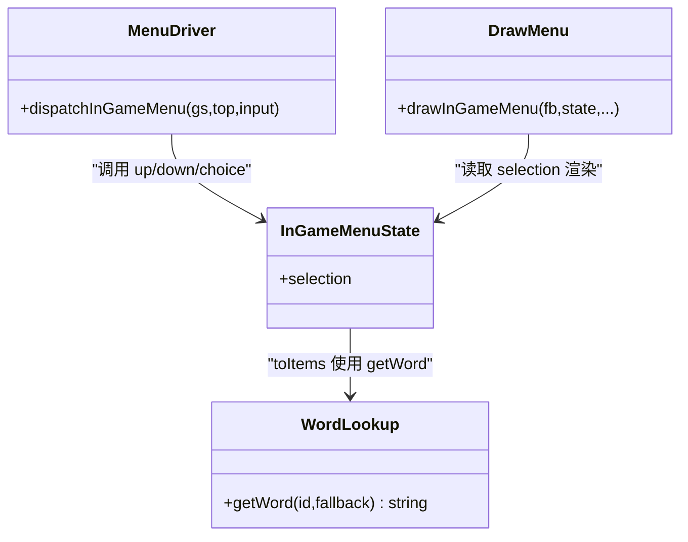

# 主菜单界面

<cite>
**本文引用的文件**   
- [in-game-menu.ts](file://packages/game/src/core/menu/in-game-menu.ts)
- [menu-driver.ts](file://packages/game/src/core/menu/menu-driver.ts)
- [word-lookup.ts](file://packages/game/src/core/word-lookup.ts)
- [draw-menu.ts](file://packages/game/src/present/menu/draw-menu.ts)
- [in-game-menu.test.ts](file://packages/game/src/core/menu/in-game-menu.test.ts)
- [menu-driver.test.ts](file://packages/game/src/core/menu/menu-driver.test.ts)
</cite>

## 目录
1. [简介](#简介)
2. [项目结构](#项目结构)
3. [核心组件](#核心组件)
4. [架构总览](#架构总览)
5. [详细组件分析](#详细组件分析)
6. [依赖关系分析](#依赖关系分析)
7. [性能考量](#性能考量)
8. [故障排查指南](#故障排查指南)
9. [结论](#结论)
10. [附录：与 sdlpal 原版对照](#附录与-sdlpal-原版对照)

## 简介
本文件聚焦 Type-Pal 的“大世界主菜单”（InGameMenu）实现，系统性解析状态管理、类型定义、配置数组设计、国际化机制、默认光标记忆、输入处理与子菜单跳转逻辑，并提供扩展指南与与 sdlpal 原版的对照说明。读者无需深入源码即可理解该模块的职责边界与交互流程。

## 项目结构
主菜单相关代码位于 packages/game 的 core/menu 与 present/menu 两个层次：
- core/menu/in-game-menu.ts：主菜单与系统菜单的状态机与选择映射
- core/menu/menu-driver.ts：输入分发与子菜单打开逻辑
- core/word-lookup.ts：WORD.DAT 词表查询与 fallback 兜底
- present/menu/draw-menu.ts：主菜单与系统菜单的绘制逻辑
- 测试用例：验证真值顺序、默认光标记忆、choice 映射等

图表来源
- [in-game-menu.ts:1-130](file://packages/game/src/core/menu/in-game-menu.ts#L1-L130)
- [menu-driver.ts:400-439](file://packages/game/src/core/menu/menu-driver.ts#L400-L439)
- [word-lookup.ts:1-28](file://packages/game/src/core/word-lookup.ts#L1-L28)
- [draw-menu.ts:258-316](file://packages/game/src/present/menu/draw-menu.ts#L258-L316)

章节来源
- [in-game-menu.ts:1-130](file://packages/game/src/core/menu/in-game-menu.ts#L1-L130)
- [menu-driver.ts:400-439](file://packages/game/src/core/menu/menu-driver.ts#L400-L439)
- [word-lookup.ts:1-28](file://packages/game/src/core/word-lookup.ts#L1-L28)
- [draw-menu.ts:258-316](file://packages/game/src/present/menu/draw-menu.ts#L258-L316)

## 核心组件
- InGameMenuState：主菜单状态，包含通用 SelectionMenuState（items、cursor）。
- InGameMenuChoice：主菜单项对应的操作枚举，包括 status、magic、inventory、system。
- IN_GAME_LABELS：主菜单配置数组，将“真 WORD ID”映射到 choice 与 fallback 文案。
- createInGameMenu：创建主菜单状态，支持 defaultCursor 记忆上次选中项。
- inGameMenuChoice：根据当前 cursor 反查对应 choice。
- inGameMenuUp / inGameMenuDown：上下导航。
- word-lookup.getWord：按真 WORD id 取文案，未载入时回退到 fallback。

章节来源
- [in-game-menu.ts:14-72](file://packages/game/src/core/menu/in-game-menu.ts#L14-L72)
- [word-lookup.ts:13-27](file://packages/game/src/core/word-lookup.ts#L13-L27)

## 架构总览
主菜单在 menu-driver 中作为“hub”，负责把键盘事件路由到具体菜单状态机，并根据选择打开子菜单；同时每帧写回全局光标记忆，保证下次进入菜单保持上次位置。

图表来源
- [menu-driver.ts:400-439](file://packages/game/src/core/menu/menu-driver.ts#L400-L439)
- [in-game-menu.ts:57-69](file://packages/game/src/core/menu/in-game-menu.ts#L57-L69)
- [word-lookup.ts:24-27](file://packages/game/src/core/word-lookup.ts#L24-L27)
- [draw-menu.ts:260-281](file://packages/game/src/present/menu/draw-menu.ts#L260-L281)

## 详细组件分析

### InGameMenuState 与 InGameMenuChoice
- InGameMenuState 仅持有 selection，遵循统一的选择菜单抽象，便于复用导航与渲染。
- InGameMenuChoice 是强类型的操作标识，避免字符串散落在业务分支中，提升可维护性与可扩展性。

章节来源
- [in-game-menu.ts:19-51](file://packages/game/src/core/menu/in-game-menu.ts#L19-L51)

### IN_GAME_LABELS 配置数组设计
- 每个元素包含三项：id（真 WORD ID）、choice（操作枚举）、fallback（缺省文案）。
- toItems 将配置转换为 SelectionMenuItem，label 通过 getWord(id, fallback) 获取。
- 真值顺序与 sdlpal 一致：状态/仙术/物品/系统。
- 当 words.json 未加载或某 id 缺失时，自动使用 fallback，确保 UI 不空白。

图表来源
- [in-game-menu.ts:15-17](file://packages/game/src/core/menu/in-game-menu.ts#L15-L17)
- [in-game-menu.ts:28-33](file://packages/game/src/core/menu/in-game-menu.ts#L28-L33)
- [word-lookup.ts:24-27](file://packages/game/src/core/word-lookup.ts#L24-L27)

章节来源
- [in-game-menu.ts:14-33](file://packages/game/src/core/menu/in-game-menu.ts#L14-L33)
- [word-lookup.ts:1-28](file://packages/game/src/core/word-lookup.ts#L1-L28)

### createInGameMenu 默认光标记忆与初始化
- 接受 defaultCursor 参数，来源于全局 iCurMainMenuItem，用于恢复上次选中项。
- 若 defaultCursor 越界则忽略，保持初始 0，防止崩溃。
- 内部调用 createSelectionMenu(toItems(IN_GAME_LABELS)) 构造 items 与 cursor。

章节来源
- [in-game-menu.ts:57-63](file://packages/game/src/core/menu/in-game-menu.ts#L57-L63)
- [in-game-menu.test.ts:61-65](file://packages/game/src/core/menu/in-game-menu.test.ts#L61-L65)

### inGameMenuChoice 选择映射
- 基于当前 cursor 定位 item.id，再在 IN_GAME_LABELS 中查找对应 choice。
- 即使 id 值变化，只要映射表正确，choice 仍稳定，利于后续扩展与维护。

章节来源
- [in-game-menu.ts:65-69](file://packages/game/src/core/menu/in-game-menu.ts#L65-L69)
- [in-game-menu.test.ts:42-45](file://packages/game/src/core/menu/in-game-menu.test.ts#L42-L45)

### 键盘输入处理
- Up/Left：上移；Down/Right：下移；Menu：关闭主菜单；Confirm：执行选择。
- 每帧将 s.selection.cursor 写回 gs.iCurMainMenuItem，持久化光标位置。
- 确认后将打开相应子菜单：
  - inventory → 先入“装备/使用”二级 box，再进具体列表
  - magic → 打开大世界法术菜单
  - status → 打开角色状态页
  - system → 打开系统菜单

图表来源
- [menu-driver.ts:400-439](file://packages/game/src/core/menu/menu-driver.ts#L400-L439)

章节来源
- [menu-driver.ts:400-439](file://packages/game/src/core/menu/menu-driver.ts#L400-L439)
- [menu-driver.test.ts:35-51](file://packages/game/src/core/menu/menu-driver.test.ts#L35-L51)

### 绘制与国际化
- drawInGameMenu 读取 state.selection.items 中的 label，按行绘制并高亮当前项。
- label 来自 getWord(id, fallback)，实现单一文案源与多语言切换能力。

章节来源
- [draw-menu.ts:260-281](file://packages/game/src/present/menu/draw-menu.ts#L260-L281)
- [word-lookup.ts:24-27](file://packages/game/src/core/word-lookup.ts#L24-L27)

## 依赖关系分析
- in-game-menu.ts 依赖 primitives.js 提供的选择菜单基础能力（createSelectionMenu、moveSelectionUp/Down）。
- menu-driver.ts 依赖 in-game-menu.ts 暴露的状态机函数，并负责与 GameState 交互（读写 iCurMainMenuItem）。
- word-lookup.ts 提供 getWord，被 toItems 使用，形成“配置→文案”的统一链路。
- draw-menu.ts 消费 InGameMenuState 的 selection 进行绘制。

图表来源
- [in-game-menu.ts:49-63](file://packages/game/src/core/menu/in-game-menu.ts#L49-L63)
- [menu-driver.ts:400-439](file://packages/game/src/core/menu/menu-driver.ts#L400-L439)
- [word-lookup.ts:24-27](file://packages/game/src/core/word-lookup.ts#L24-L27)
- [draw-menu.ts:260-281](file://packages/game/src/present/menu/draw-menu.ts#L260-L281)

章节来源
- [in-game-menu.ts:49-63](file://packages/game/src/core/menu/in-game-menu.ts#L49-L63)
- [menu-driver.ts:400-439](file://packages/game/src/core/menu/menu-driver.ts#L400-L439)
- [word-lookup.ts:24-27](file://packages/game/src/core/word-lookup.ts#L24-L27)
- [draw-menu.ts:260-281](file://packages/game/src/present/menu/draw-menu.ts#L260-L281)

## 性能考量
- 菜单项数量固定且较小，toItems 与 getWord 开销极低。
- 每帧写回 iCurMainMenuItem 为 O(1)，无额外分配。
- 如需新增大量动态菜单项，建议缓存 toItems 结果并在数据变更时重建。

[本节为通用指导，不涉及具体文件分析]

## 故障排查指南
- 菜单项显示为空：检查 setWordTable 是否已注入，或对应 id 是否在 words.json flat 中存在；否则将回退到 fallback。
- 默认光标异常：确认传入 defaultCursor 是否越界；越界将被忽略并回到 0。
- 选择无效：检查 inGameMenuChoice 返回是否为 undefined，可能因 items 为空或 cursor 越界导致。
- 子菜单未打开：确认 dispatchInGameMenu 的 Confirm 分支是否命中，以及 catalogs 是否已通过 setMenuCatalogs 注入。

章节来源
- [in-game-menu.ts:57-69](file://packages/game/src/core/menu/in-game-menu.ts#L57-L69)
- [menu-driver.ts:400-439](file://packages/game/src/core/menu/menu-driver.ts#L400-L439)
- [word-lookup.ts:24-27](file://packages/game/src/core/word-lookup.ts#L24-L27)

## 结论
Type-Pal 的主菜单以“配置即数据”的方式组织，结合真 WORD ID 与 getWord 的单一文案源，实现了稳定的选择映射与良好的国际化能力。通过 menu-driver 的集中式输入分发与状态机解耦，主菜单具备清晰的职责边界与易扩展的结构。默认光标记忆与完善的测试覆盖进一步提升了用户体验与可靠性。

[本节为总结，不涉及具体文件分析]

## 附录：与 sdlpal 原版对照
- 主菜单顺序与布局：与 sdlpal uigame.c 中 PAL_InGameMenu 真值一致（状态/仙术/物品/系统），box 与行距对齐。
- 系统菜单顺序：与 PAL_SystemMenu 真值一致（存档/读档/音乐/音效/退出）。
- 光标记忆：每帧写回 iCurMainMenuItem/iCurSystemMenuItem，等价于 sdlpal 的 OnItemChange 回调。
- 输入行为：左=上、右=下，Menu 关闭菜单，Confirm 打开子菜单，均与 sdlpal 一致。
- 二次确认与开关子菜单：QUIT 进入 confirm 阶段，音乐/音效进入 switch 阶段，行为与 sdlpal 的 PAL_ConfirmMenu/PAL_SwitchMenu 对齐。

章节来源
- [in-game-menu.ts:23-47](file://packages/game/src/core/menu/in-game-menu.ts#L23-L47)
- [menu-driver.ts:400-530](file://packages/game/src/core/menu/menu-driver.ts#L400-L530)
- [in-game-menu.test.ts:48-87](file://packages/game/src/core/menu/in-game-menu.test.ts#L48-L87)