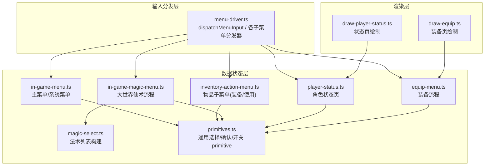
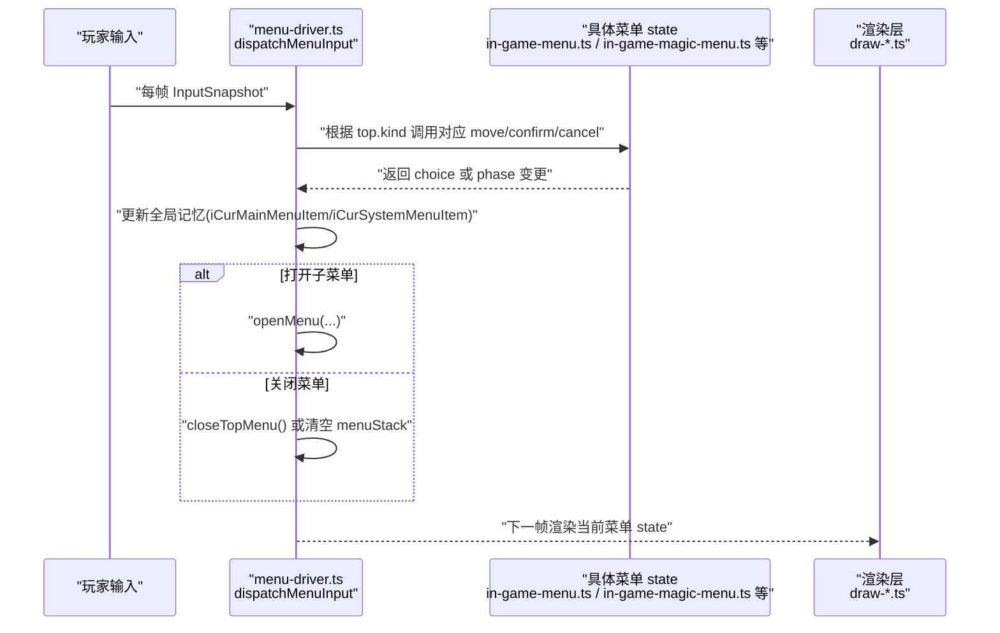
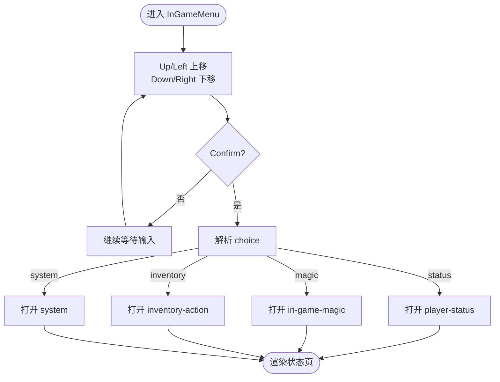
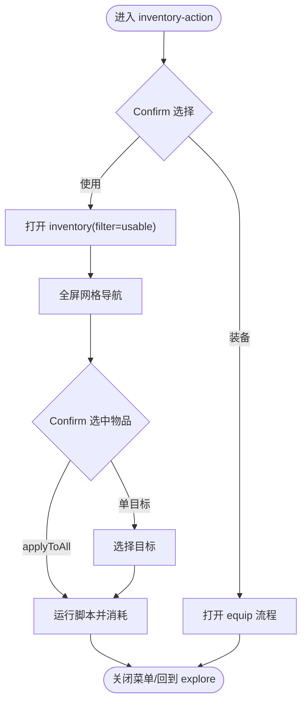
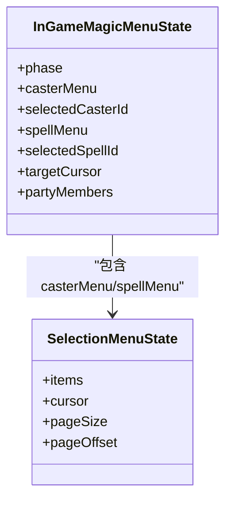
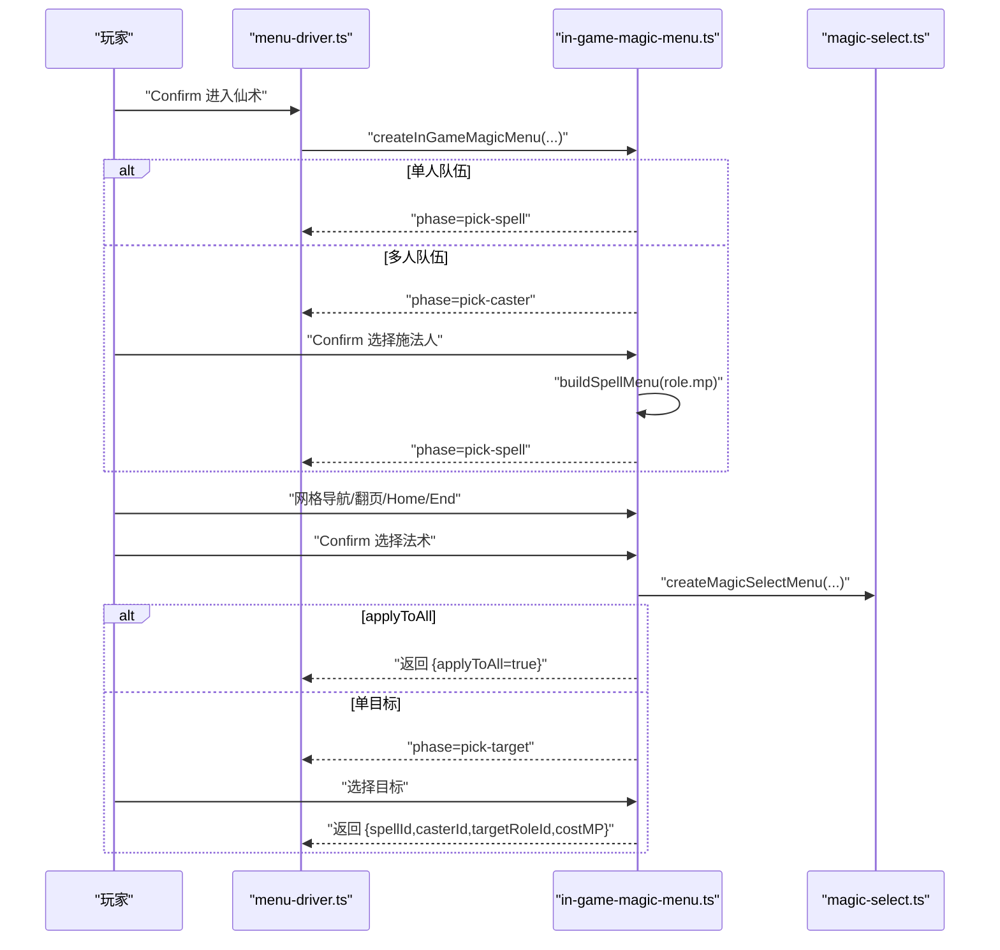
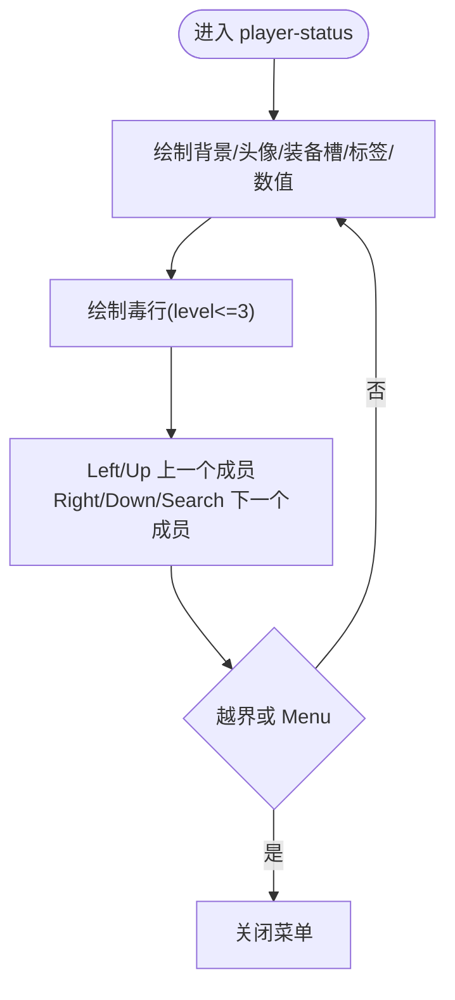
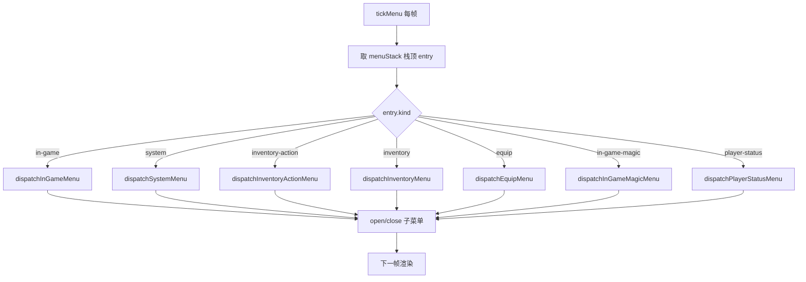
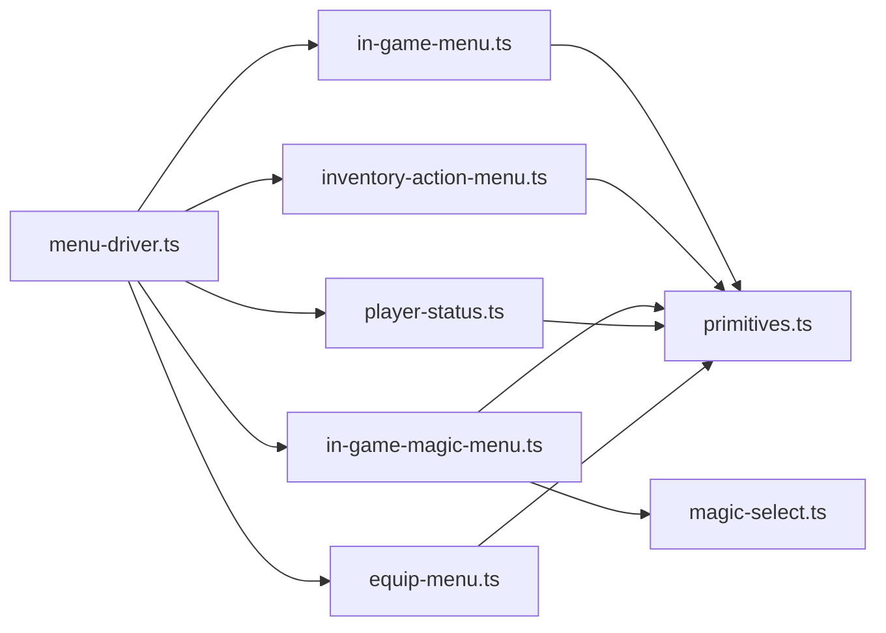

# 游戏内菜单

<cite>
**本文引用的文件**   
- [in-game-menu.ts](file://packages/game/src/core/menu/in-game-menu.ts)
- [menu-driver.ts](file://packages/game/src/core/menu/menu-driver.ts)
- [primitives.ts](file://packages/game/src/core/menu/primitives.ts)
- [magic-select.ts](file://packages/game/src/core/menu/magic-select.ts)
- [in-game-magic-menu.ts](file://packages/game/src/core/menu/in-game-magic-menu.ts)
- [player-status.ts](file://packages/game/src/core/menu/player-status.ts)
- [draw-player-status.ts](file://packages/game/src/present/menu/draw-player-status.ts)
- [inventory-action-menu.ts](file://packages/game/src/core/menu/inventory-action-menu.ts)
- [equip-menu.ts](file://packages/game/src/core/menu/equip-menu.ts)
- [draw-equip.ts](file://packages/game/src/present/menu/draw-equip.ts)
- [menu-mode.test.ts](file://packages/game/src/core/menu/menu-mode.test.ts)
- [in-game-menu.test.ts](file://packages/game/src/core/menu/in-game-menu.test.ts)
- [in-game-magic-menu.test.ts](file://packages/game/src/core/menu/in-game-magic-menu.test.ts)
- [menu-driver.test.ts](file://packages/game/src/core/menu/menu-driver.test.ts)
</cite>

## 目录
1. [简介](#简介)
2. [项目结构](#项目结构)
3. [核心组件](#核心组件)
4. [架构总览](#架构总览)
5. [详细组件分析](#详细组件分析)
6. [依赖关系分析](#依赖关系分析)
7. [性能与可访问性](#性能与可访问性)
8. [故障排查指南](#故障排查指南)
9. [结论](#结论)
10. [附录：扩展与示例](#附录扩展与示例)

## 简介
本文件为 Type-Pal 游戏内菜单系统的权威文档，覆盖主菜单、物品管理、法术选择、状态查看以及菜单驱动器的设计与实现。内容聚焦于：
- 菜单项布局与焦点管理（光标、分页、禁用项行为）
- 用户交互处理（确认/取消、方向键映射、键盘快捷键）
- 数据流与状态机（各菜单的 phase 切换与回退路径）
- 渲染对接点（数值、图标、标签位置与颜色）
- 可扩展性（如何新增菜单项、自定义布局与特殊交互）
- 用户体验优化与可访问性建议

## 项目结构
菜单系统采用“数据状态 + 输入分发 + 渲染呈现”的分层设计：
- 数据状态层：每个菜单一个独立 state machine 文件，仅维护纯数据与 cursor 操作
- 输入分发层：统一 dispatcher 将 InputSnapshot 路由到对应菜单的 state 函数
- 渲染层：present 目录下的 draw-* 文件负责把 state 绘制到帧缓冲

图表来源
- [menu-driver.ts:209-248](file://packages/game/src/core/menu/menu-driver.ts#L209-L248)
- [in-game-menu.ts:1-130](file://packages/game/src/core/menu/in-game-menu.ts#L1-L130)
- [inventory-action-menu.ts:1-74](file://packages/game/src/core/menu/inventory-action-menu.ts#L1-L74)
- [in-game-magic-menu.ts:1-307](file://packages/game/src/core/menu/in-game-magic-menu.ts#L1-L307)
- [magic-select.ts:1-57](file://packages/game/src/core/menu/magic-select.ts#L1-L57)
- [player-status.ts:1-59](file://packages/game/src/core/menu/player-status.ts#L1-L59)
- [equip-menu.ts](file://packages/game/src/core/menu/equip-menu.ts)
- [primitives.ts:1-177](file://packages/game/src/core/menu/primitives.ts#L1-L177)
- [draw-player-status.ts:1-271](file://packages/game/src/present/menu/draw-player-status.ts#L1-L271)
- [draw-equip.ts:1-207](file://packages/game/src/present/menu/draw-equip.ts#L1-L207)

章节来源
- [menu-driver.ts:209-248](file://packages/game/src/core/menu/menu-driver.ts#L209-L248)
- [in-game-menu.ts:1-130](file://packages/game/src/core/menu/in-game-menu.ts#L1-L130)

## 核心组件
- 通用 Primitive
  - SelectionMenu：支持上下移动、分页、Home/End、可见性滚动；允许光标停在 disabled 项上，由上层在 Confirm 时判定是否可用
  - ConfirmMenu/TripleMenu/SwitchMenu：用于二次确认、三选一、循环切换等常见 UI 模式
- 主菜单与系统菜单
  - 主菜单四项：状态/仙术/物品/系统；系统菜单五项：储存进度/读取进度/音乐/音效/结束游戏
  - 文案来自 WORD id，通过 getWord 解析，未加载时回退硬编码
- 物品管理
  - 一级子菜单“装备/使用”，再进入全屏物品网格或装备流程
- 法术选择
  - 三阶段：选施法人 → 选法术（按编号排序、MP 不足禁用）→ 选目标（单目标法术）
- 状态查看
  - 一屏显示头像、装备槽、属性数字、毒素行，无分页切换概念
- 菜单驱动器
  - 统一入口 dispatchMenuInput，按栈顶菜单 kind 分发输入，维护全局记忆（如 iCurMainMenuItem、iCurSystemMenuItem）

章节来源
- [primitives.ts:1-177](file://packages/game/src/core/menu/primitives.ts#L1-L177)
- [in-game-menu.ts:1-130](file://packages/game/src/core/menu/in-game-menu.ts#L1-L130)
- [inventory-action-menu.ts:1-74](file://packages/game/src/core/menu/inventory-action-menu.ts#L1-L74)
- [in-game-magic-menu.ts:1-307](file://packages/game/src/core/menu/in-game-magic-menu.ts#L1-L307)
- [magic-select.ts:1-57](file://packages/game/src/core/menu/magic-select.ts#L1-L57)
- [player-status.ts:1-59](file://packages/game/src/core/menu/player-status.ts#L1-L59)
- [menu-driver.ts:400-439](file://packages/game/src/core/menu/menu-driver.ts#L400-L439)

## 架构总览
下图展示从输入到状态变更再到渲染的关键路径，并标注 sdlpal 真值对齐点。

图表来源
- [menu-driver.ts:209-248](file://packages/game/src/core/menu/menu-driver.ts#L209-L248)
- [in-game-menu.ts:1-130](file://packages/game/src/core/menu/in-game-menu.ts#L1-L130)
- [in-game-magic-menu.ts:1-307](file://packages/game/src/core/menu/in-game-magic-menu.ts#L1-L307)
- [draw-player-status.ts:1-271](file://packages/game/src/present/menu/draw-player-status.ts#L1-L271)

## 详细组件分析

### 主菜单界面（InGameMenu）
- 菜单项布局
  - 四项顺序：状态/仙术/物品/系统，每项 label 由 WORD id 解析
  - 光标默认记忆上次选择（iCurMainMenuItem），越界归零
- 焦点管理与导航
  - Up/Left 上移，Down/Right 下移，环绕边界
  - Menu 键关闭整个菜单栈
- 用户交互
  - Confirm 后根据 choice 打开对应子菜单（物品→inventory-action；法术→in-game-magic；状态→player-status；系统→system）
  - 每帧写回 iCurMainMenuItem 以持久化光标

图表来源
- [in-game-menu.ts:28-72](file://packages/game/src/core/menu/in-game-menu.ts#L28-L72)
- [menu-driver.ts:400-439](file://packages/game/src/core/menu/menu-driver.ts#L400-L439)

章节来源
- [in-game-menu.ts:1-130](file://packages/game/src/core/menu/in-game-menu.ts#L1-L130)
- [menu-driver.ts:400-439](file://packages/game/src/core/menu/menu-driver.ts#L400-L439)
- [in-game-menu.test.ts:21-87](file://packages/game/src/core/menu/in-game-menu.test.ts#L21-L87)

### 物品管理界面（InventoryAction + Inventory）
- 一级子菜单（装备/使用）
  - 两项 box，Confirm 后分别进入装备流程或“可使用”物品列表
  - ESC 关闭整个菜单栈（不回 hub）
- 物品列表渲染
  - 全屏网格，8 键导航，支持翻页/Home/End
  - 每帧刷新快照，确保数量与背包一致
- 筛选功能
  - filter='usable' 仅显示可使用物品；filter='equip' 仅显示可装备物品
- 操作反馈机制
  - applyToAll 物品直接执行脚本并消耗，然后退出物品菜单
  - 单目标物品进入 use-target 阶段，确认后跑脚本并可重复使用同一物品

图表来源
- [inventory-action-menu.ts:1-74](file://packages/game/src/core/menu/inventory-action-menu.ts#L1-L74)
- [menu-driver.ts:544-580](file://packages/game/src/core/menu/menu-driver.ts#L544-L580)
- [menu-driver.ts:584-674](file://packages/game/src/core/menu/menu-driver.ts#L584-L674)

章节来源
- [inventory-action-menu.ts:1-74](file://packages/game/src/core/menu/inventory-action-menu.ts#L1-L74)
- [menu-driver.ts:544-580](file://packages/game/src/core/menu/menu-driver.ts#L544-L580)
- [menu-driver.ts:584-674](file://packages/game/src/core/menu/menu-driver.ts#L584-L674)

### 法术选择界面（InGameMagicMenu + MagicSelect）
- 流程阶段
  - pick-caster：选择施法人（单人队伍跳过直接进入 pick-spell）
  - pick-spell：法术网格（按法术 id 升序排列，MP 不足禁用）
  - pick-target：单目标法术的目标选择
- 分类显示与排序
  - 仅显示可在战斗外使用的法术（flags.usableOutsideBattle）
  - 已学法术按 id 排序，不随习得顺序变化
- 消耗检查
  - 基于 magic.costMP 与当前 MP 判断 disabled
- 目标选择逻辑
  - 非 applyToAll 的法术进入 pick-target；Confirm 后返回 {spellId, casterId, targetRoleId, costMP}
  - 若 MP 不足则退回 pick-spell

图表来源
- [in-game-magic-menu.ts:41-53](file://packages/game/src/core/menu/in-game-magic-menu.ts#L41-L53)
- [primitives.ts:23-31](file://packages/game/src/core/menu/primitives.ts#L23-L31)

图表来源
- [in-game-magic-menu.ts:64-143](file://packages/game/src/core/menu/in-game-magic-menu.ts#L64-L143)
- [magic-select.ts:26-56](file://packages/game/src/core/menu/magic-select.ts#L26-L56)
- [menu-driver.ts:779-800](file://packages/game/src/core/menu/menu-driver.ts#L779-L800)

章节来源
- [in-game-magic-menu.ts:1-307](file://packages/game/src/core/menu/in-game-magic-menu.ts#L1-L307)
- [magic-select.ts:1-57](file://packages/game/src/core/menu/magic-select.ts#L1-L57)
- [in-game-magic-menu.test.ts:77-247](file://packages/game/src/core/menu/in-game-magic-menu.test.ts#L77-L247)

### 状态查看界面（PlayerStatus）
- 角色属性显示
  - 一屏整布局：头像、6 个装备槽、EXP/Lv/HP/MP 标签与数值、5 项 stat 数值
  - 数值取自运行时 PlayerRolesRuntime，含装备效果加成
- 装备信息展示
  - 遍历 rgwEquipment[slot][role]，显示 BALL 图标与装备名
- 状态效果可视化
  - 毒行：遍历 rgPoisonStatus，仅 level<=3 的诅咒类毒显示，名称来自 WORD id，颜色偏移

图表来源
- [player-status.ts:19-59](file://packages/game/src/core/menu/player-status.ts#L19-L59)
- [draw-player-status.ts:157-270](file://packages/game/src/present/menu/draw-player-status.ts#L157-L270)

章节来源
- [player-status.ts:1-59](file://packages/game/src/core/menu/player-status.ts#L1-59)
- [draw-player-status.ts:1-271](file://packages/game/src/present/menu/draw-player-status.ts#L1-271)

### 菜单驱动器（Menu Driver）
- 键盘输入处理
  - Up/Left 上移，Down/Right 下移，Menu 关闭/回退，Confirm 确认
  - 特定菜单支持 PgUp/PgDn/Home/End（物品/法术网格）
- 焦点导航
  - 各菜单内部维护 selection.cursor/pageOffset，primitive 保证光标可见性
- 确认/取消操作
  - 系统菜单 quit 进入 confirm 阶段（默认高亮“否”），选“是”触发 _systemQuitHandler，“否”关闭整个菜单栈
  - 音乐/音效 switch 阶段 toggle 开/关，确认后关闭整个菜单栈

图表来源
- [menu-driver.ts:209-248](file://packages/game/src/core/menu/menu-driver.ts#L209-L248)
- [menu-driver.ts:400-439](file://packages/game/src/core/menu/menu-driver.ts#L400-L439)
- [menu-driver.ts:443-530](file://packages/game/src/core/menu/menu-driver.ts#L443-L530)
- [menu-driver.ts:544-580](file://packages/game/src/core/menu/menu-driver.ts#L544-L580)
- [menu-driver.ts:584-674](file://packages/game/src/core/menu/menu-driver.ts#L584-L674)
- [menu-driver.ts:691-770](file://packages/game/src/core/menu/menu-driver.ts#L691-L770)
- [menu-driver.ts:779-800](file://packages/game/src/core/menu/menu-driver.ts#L779-L800)

章节来源
- [menu-driver.ts:209-248](file://packages/game/src/core/menu/menu-driver.ts#L209-L248)
- [menu-driver.ts:400-439](file://packages/game/src/core/menu/menu-driver.ts#L400-L439)
- [menu-driver.ts:443-530](file://packages/game/src/core/menu/menu-driver.ts#L443-L530)
- [menu-driver.ts:544-580](file://packages/game/src/core/menu/menu-driver.ts#L544-L580)
- [menu-driver.ts:584-674](file://packages/game/src/core/menu/menu-driver.ts#L584-L674)
- [menu-driver.ts:691-770](file://packages/game/src/core/menu/menu-driver.ts#L691-L770)
- [menu-driver.ts:779-800](file://packages/game/src/core/menu/menu-driver.ts#L779-L800)
- [menu-driver.test.ts:112-134](file://packages/game/src/core/menu/menu-driver.test.ts#L112-L134)

## 依赖关系分析
- 模块耦合
  - menu-driver 集中依赖所有菜单 state 与 primitives，形成“星型”分发中心
  - 各菜单 state 仅依赖 primitives 与少量共享类型，保持低耦合
- 外部依赖
  - WORD 文案表（getWord）、资源 catalog（items/spells/magics/playerRoles）通过 setMenuCatalogs 注入
  - 运行时态（PlayerRolesRuntime）通过 menuRoles 投影到菜单可见态
- 潜在循环依赖
  - 通过 handler 注入（setStartGameHandler/setLoadGameHandler/setSystemQuitHandler）避免跨层 import 循环

图表来源
- [menu-driver.ts:209-248](file://packages/game/src/core/menu/menu-driver.ts#L209-L248)
- [in-game-magic-menu.ts:1-307](file://packages/game/src/core/menu/in-game-magic-menu.ts#L1-L307)
- [magic-select.ts:1-57](file://packages/game/src/core/menu/magic-select.ts#L1-L57)
- [primitives.ts:1-177](file://packages/game/src/core/menu/primitives.ts#L1-L177)

章节来源
- [menu-driver.ts:209-248](file://packages/game/src/core/menu/menu-driver.ts#L209-L248)
- [in-game-magic-menu.ts:1-307](file://packages/game/src/core/menu/in-game-magic-menu.ts#L1-L307)
- [magic-select.ts:1-57](file://packages/game/src/core/menu/magic-select.ts#L1-L57)
- [primitives.ts:1-177](file://packages/game/src/core/menu/primitives.ts#L1-L177)

## 性能与可访问性
- 性能考虑
  - 每帧只更新必要 state（如 inventory 快照刷新仅在需要时进行）
  - 法术列表按 id 排序一次，避免频繁重排
  - 数值绘制复用 drawNumber，减少文本测量开销
- 可访问性与体验优化
  - 光标始终可见（ensureCursorVisible），禁用项仍可停留但不可确认
  - 大字体/高对比色遵循 sdlpal 真值色，提升可读性
  - 提供 Home/End/PgUp/PgDn 快速导航，降低长列表操作成本
  - 对单手/键盘用户友好：左=上、右=下，符合经典 RPG 习惯

[本节为通用指导，无需源码引用]

## 故障排查指南
- 常见问题
  - 菜单项文案为空：检查 WORD id 是否正确、words.json 是否加载
  - 法术不可用：确认 currentMp < costMP 导致 disabled；或 spells 过滤 flags.usableOutsideBattle
  - 物品数量不更新：确认每帧刷新 inventory snapshot 且脚本消耗逻辑正确
  - 装备换装后列表异常：确认 scriptOnEquip 执行后重建 equip list
- 定位方法
  - 使用单元测试断言关键路径（如 in-game-menu.test.ts、in-game-magic-menu.test.ts、menu-driver.test.ts）
  - 打印 gs.iCur* 全局记忆，验证光标持久化是否符合预期

章节来源
- [in-game-menu.test.ts:21-87](file://packages/game/src/core/menu/in-game-menu.test.ts#L21-L87)
- [in-game-magic-menu.test.ts:77-247](file://packages/game/src/core/menu/in-game-magic-menu.test.ts#L77-L247)
- [menu-driver.test.ts:112-134](file://packages/game/src/core/menu/menu-driver.test.ts#L112-L134)

## 结论
Type-Pal 游戏内菜单系统以清晰的状态机与统一的输入分发为核心，严格对齐 sdlpal 真值行为，具备良好扩展性与可测试性。通过 primitives 抽象、catalog 注入与运行时态投影，实现了数据与渲染解耦，便于后续接入更多菜单与交互场景。

[本节为总结，无需源码引用]

## 附录：扩展与示例
- 添加新菜单项
  - 在主菜单定义新的 WORD id 与 choice，并在 toItems 中注册
  - 在 dispatchInGameMenu 的 switch 分支中打开对应子菜单
  - 参考路径：[in-game-menu.ts:28-47](file://packages/game/src/core/menu/in-game-menu.ts#L28-L47)、[menu-driver.ts:414-437](file://packages/game/src/core/menu/menu-driver.ts#L414-L437)
- 自定义菜单布局
  - 新建 state machine 文件，使用 createSelectionMenu 初始化 items 与 pageSize
  - 在 menu-driver 中添加新的 kind 与分发器
  - 参考路径：[primitives.ts:50-68](file://packages/game/src/core/menu/primitives.ts#L50-L68)、[menu-driver.ts:209-248](file://packages/game/src/core/menu/menu-driver.ts#L209-L248)
- 实现特殊交互逻辑
  - 在对应菜单 state 中增加 phase 与 transition 函数（如 confirmXxx/cancelXxx）
  - 在 dispatcher 中处理输入并调用 state 函数，必要时 openMenu/closeTopMenu
  - 参考路径：[in-game-magic-menu.ts:108-143](file://packages/game/src/core/menu/in-game-magic-menu.ts#L108-L143)、[menu-driver.ts:779-800](file://packages/game/src/core/menu/menu-driver.ts#L779-L800)
- 用户体验优化
  - 为长列表启用 PgUp/PgDn/Home/End
  - 为禁用项提供视觉提示（灰色/闪烁）
  - 为重要操作提供二次确认（如 quit）
  - 参考路径：[primitives.ts:113-128](file://packages/game/src/core/menu/primitives.ts#L113-L128)、[menu-driver.ts:475-489](file://packages/game/src/core/menu/menu-driver.ts#L475-L489)

章节来源
- [in-game-menu.ts:28-47](file://packages/game/src/core/menu/in-game-menu.ts#L28-L47)
- [menu-driver.ts:414-437](file://packages/game/src/core/menu/menu-driver.ts#L414-L437)
- [primitives.ts:50-68](file://packages/game/src/core/menu/primitives.ts#L50-L68)
- [menu-driver.ts:209-248](file://packages/game/src/core/menu/menu-driver.ts#L209-L248)
- [in-game-magic-menu.ts:108-143](file://packages/game/src/core/menu/in-game-magic-menu.ts#L108-L143)
- [menu-driver.ts:779-800](file://packages/game/src/core/menu/menu-driver.ts#L779-L800)
- [primitives.ts:113-128](file://packages/game/src/core/menu/primitives.ts#L113-L128)
- [menu-driver.ts:475-489](file://packages/game/src/core/menu/menu-driver.ts#L475-L489)