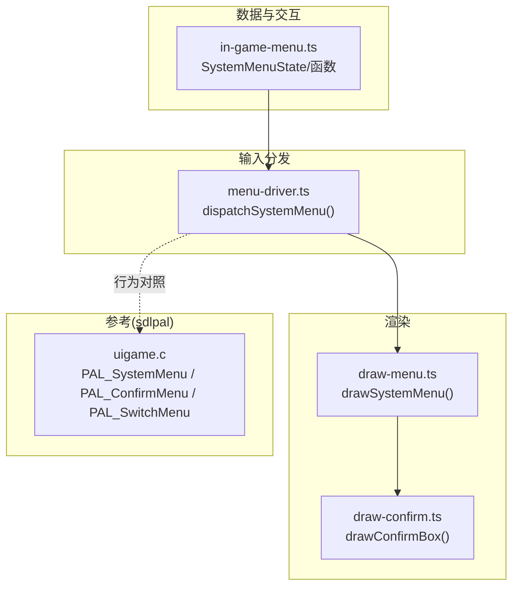
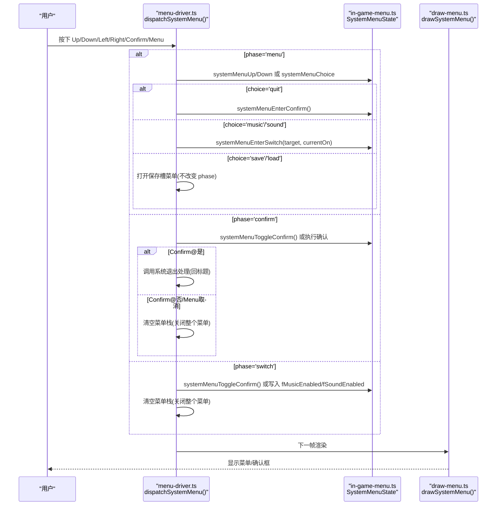
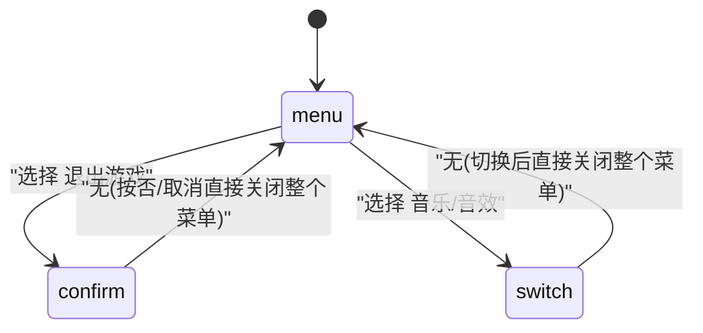
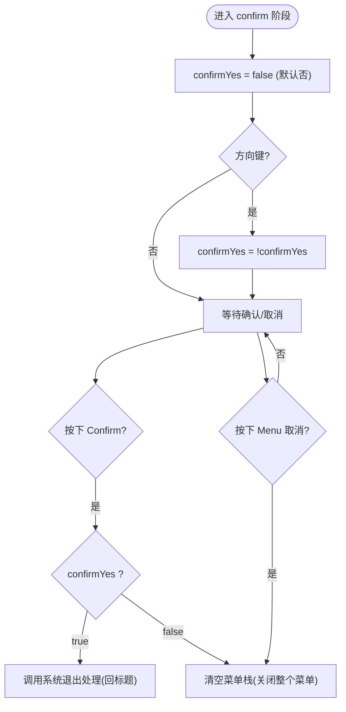
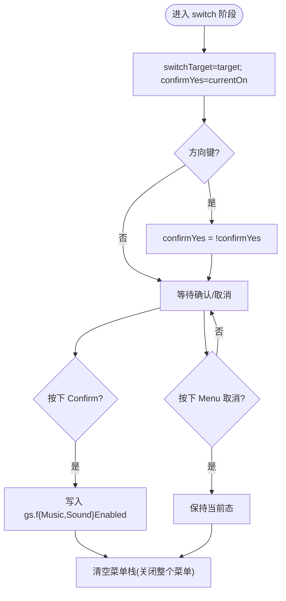
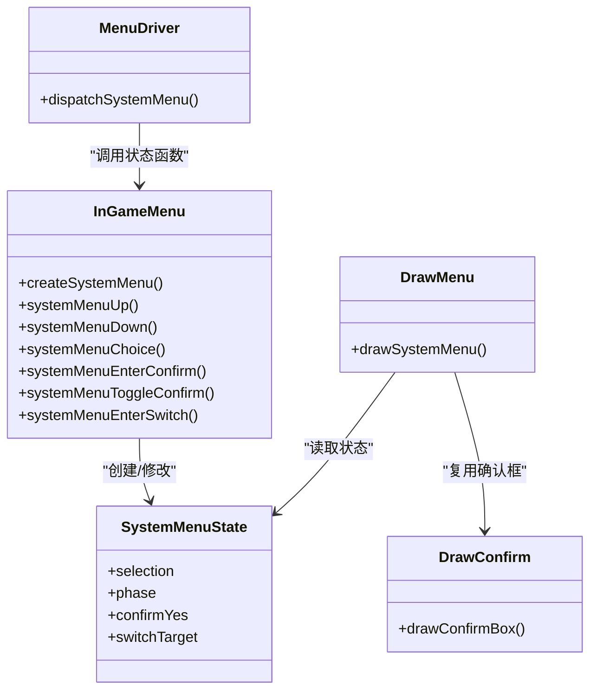

# 系统菜单界面

<cite>
**本文引用的文件列表**
- [in-game-menu.ts](file://packages/game/src/core/menu/in-game-menu.ts)
- [menu-driver.ts](file://packages/game/src/core/menu/menu-driver.ts)
- [draw-menu.ts](file://packages/game/src/present/menu/draw-menu.ts)
- [draw-confirm.ts](file://packages/game/src/present/menu/draw-confirm.ts)
- [uigame.c](file://reference/sdlpal/uigame.c)
</cite>

## 目录
1. [简介](#简介)
2. [项目结构](#项目结构)
3. [核心组件](#核心组件)
4. [架构总览](#架构总览)
5. [详细组件分析](#详细组件分析)
6. [依赖关系分析](#依赖关系分析)
7. [性能考量](#性能考量)
8. [故障排查指南](#故障排查指南)
9. [结论](#结论)
10. [附录](#附录)

## 简介
本文件聚焦 Type-Pal 的“系统菜单”子系统，围绕 SystemMenuState 的状态机设计展开，解释 menu、confirm、switch 三阶段切换逻辑；说明 SYSTEM_LABELS 配置与五项功能（存档、读档、音乐、音效、退出游戏）；阐述二次确认机制（systemMenuEnterConfirm、systemMenuToggleConfirm）与开关子菜单（systemMenuEnterSwitch）的实现细节；并给出 confirmYes 标志位在各阶段的含义与默认值。文末提供 sdlpal 原版 PAL_SystemMenu 与 PAL_ConfirmMenu/PAL_SwitchMenu 的行为对照，帮助读者理解移植差异与对齐策略。

## 项目结构
系统菜单涉及三层：
- 数据状态与交互函数：in-game-menu.ts
- 输入分发与流程控制：menu-driver.ts
- 渲染层绘制：draw-menu.ts、draw-confirm.ts
- 参考实现（sdlpal）：uigame.c

图表来源
- [in-game-menu.ts:74-130](file://packages/game/src/core/menu/in-game-menu.ts#L74-L130)
- [menu-driver.ts:443-530](file://packages/game/src/core/menu/menu-driver.ts#L443-L530)
- [draw-menu.ts:285-316](file://packages/game/src/present/menu/draw-menu.ts#L285-L316)
- [draw-confirm.ts:1-24](file://packages/game/src/present/menu/draw-confirm.ts#L1-L24)
- [uigame.c:515-651](file://reference/sdlpal/uigame.c#L515-L651)

章节来源
- [in-game-menu.ts:74-130](file://packages/game/src/core/menu/in-game-menu.ts#L74-L130)
- [menu-driver.ts:443-530](file://packages/game/src/core/menu/menu-driver.ts#L443-L530)
- [draw-menu.ts:285-316](file://packages/game/src/present/menu/draw-menu.ts#L285-L316)
- [draw-confirm.ts:1-24](file://packages/game/src/present/menu/draw-confirm.ts#L1-L24)
- [uigame.c:515-651](file://reference/sdlpal/uigame.c#L515-L651)

## 核心组件
- SystemMenuState：包含 selection（通用选择项）、phase（'menu'|'confirm'|'switch'）、confirmYes（布尔高亮位）、switchTarget（'music'|'sound'）。
- 创建与导航：createSystemMenu、systemMenuUp/Down、systemMenuChoice。
- 阶段入口与切换：
  - systemMenuEnterConfirm：进入 confirm 阶段，默认 confirmYes=false（否）。
  - systemMenuToggleConfirm：方向键在 confirm/switch 阶段 toggle confirmYes。
  - systemMenuEnterSwitch：进入 switch 阶段，默认 confirmYes=currentOn（当前开关态）。
- 渲染：drawSystemMenu 根据 phase 叠加 confirm box（是/否或关/开）。

章节来源
- [in-game-menu.ts:74-130](file://packages/game/src/core/menu/in-game-menu.ts#L74-L130)
- [draw-menu.ts:285-316](file://packages/game/src/present/menu/draw-menu.ts#L285-L316)

## 架构总览
系统菜单由“输入分发器”驱动，将按键映射到状态机函数，修改 SystemMenuState；渲染层读取 state 绘制菜单与确认框。

图表来源
- [menu-driver.ts:443-530](file://packages/game/src/core/menu/menu-driver.ts#L443-L530)
- [in-game-menu.ts:99-118](file://packages/game/src/core/menu/in-game-menu.ts#L99-L118)
- [draw-menu.ts:285-316](file://packages/game/src/present/menu/draw-menu.ts#L285-L316)

## 详细组件分析

### SystemMenuState 状态机与阶段切换
- 初始阶段 'menu'：展示五项系统菜单项。
- 进入 'confirm'：当选择“退出游戏”时触发，默认高亮“否”。
- 进入 'switch'：当选择“音乐/音效”时触发，默认高亮当前开关态。

图表来源
- [in-game-menu.ts:74-130](file://packages/game/src/core/menu/in-game-menu.ts#L74-L130)
- [menu-driver.ts:443-530](file://packages/game/src/core/menu/menu-driver.ts#L443-L530)

章节来源
- [in-game-menu.ts:74-130](file://packages/game/src/core/menu/in-game-menu.ts#L74-L130)
- [menu-driver.ts:443-530](file://packages/game/src/core/menu/menu-driver.ts#L443-L530)

### SYSTEM_LABELS 配置与五项功能
SYSTEM_LABELS 定义系统菜单的五项条目及其 WORD id、choice 枚举与 fallback 文案。顺序为：存档、读档、音乐、音效、退出游戏。

- 存档：打开保存槽菜单。
- 读档：打开保存槽菜单。
- 音乐：进入 switch 阶段，切换 gs.fMusicEnabled。
- 音效：进入 switch 阶段，切换 gs.fSoundEnabled。
- 退出游戏：进入 confirm 阶段，二次确认后决定是否返回标题。

章节来源
- [in-game-menu.ts:40-47](file://packages/game/src/core/menu/in-game-menu.ts#L40-L47)
- [menu-driver.ts:503-529](file://packages/game/src/core/menu/menu-driver.ts#L503-L529)

### 二次确认机制：systemMenuEnterConfirm 与 systemMenuToggleConfirm
- systemMenuEnterConfirm：设置 phase='confirm'，并将 confirmYes 置为 false（默认高亮“否”，对齐 sdlpal nDefault=0）。
- systemMenuToggleConfirm：在 confirm 阶段，方向键左右/上下均可 toggle confirmYes（两 box 左右排列，四向皆可切换）。

图表来源
- [in-game-menu.ts:99-108](file://packages/game/src/core/menu/in-game-menu.ts#L99-L108)
- [menu-driver.ts:475-489](file://packages/game/src/core/menu/menu-driver.ts#L475-L489)

章节来源
- [in-game-menu.ts:99-108](file://packages/game/src/core/menu/in-game-menu.ts#L99-L108)
- [menu-driver.ts:475-489](file://packages/game/src/core/menu/menu-driver.ts#L475-L489)

### 开关切换子菜单：systemMenuEnterSwitch
- 入口：选择“音乐/音效”时，传入 target 与当前开关态 currentOn。
- 默认高亮：confirmYes = currentOn（若当前开启则默认高亮“开”，否则“关”）。
- 交互：方向键 toggle confirmYes；Confirm 写入对应全局开关；Menu 取消保持原态。
- 后续行为：无论确认还是取消，均清空菜单栈（关闭整个菜单），与 sdlpal 真值一致。

图表来源
- [in-game-menu.ts:114-118](file://packages/game/src/core/menu/in-game-menu.ts#L114-L118)
- [menu-driver.ts:454-473](file://packages/game/src/core/menu/menu-driver.ts#L454-L473)

章节来源
- [in-game-menu.ts:114-118](file://packages/game/src/core/menu/in-game-menu.ts#L114-L118)
- [menu-driver.ts:454-473](file://packages/game/src/core/menu/menu-driver.ts#L454-L473)

### confirmYes 标志位在不同阶段的作用与默认值
- 'menu' 阶段：未使用。
- 'confirm' 阶段：表示是否高亮“是”，默认 false（否）。
- 'switch' 阶段：表示是否高亮“开”，默认等于当前开关态（currentOn）。

章节来源
- [in-game-menu.ts:74-130](file://packages/game/src/core/menu/in-game-menu.ts#L74-L130)

### 渲染与视觉呈现
- drawSystemMenu 根据 phase 决定叠加 confirm box：
  - confirm：显示“是/否”两框。
  - switch：显示“关/开”两框。
- drawConfirmBox 复用确认框绘制逻辑，颜色闪烁与位置对齐 sdlpal 真值。

章节来源
- [draw-menu.ts:285-316](file://packages/game/src/present/menu/draw-menu.ts#L285-L316)
- [draw-confirm.ts:1-24](file://packages/game/src/present/menu/draw-confirm.ts#L1-L24)

### 与 sdlpal 原版实现对比
- 菜单项与顺序：
  - sdlpal uigame.c 中 rgSystemMenuItem 顺序为：SAVE/LOAD/MUSIC/SOUND/QUIT（经典版无 BATTLEMODE）。
  - ts 端 SYSTEM_LABELS 顺序一致，WORD id 取自 ui.h 常量。
- 退出流程：
  - sdlpal：case QUIT → PAL_QuitGame → 内部弹 PAL_ConfirmMenu；无论选是/否，最终 PAL_SystemMenu return TRUE → 上层 goto out 关闭整个菜单。
  - ts：选择 quit 进入 confirm 阶段；选“是”调用系统退出处理（回标题）；选“否”或取消直接清空菜单栈，效果等价。
- 音乐/音效：
  - sdlpal：AUDIO_EnableMusic(PAL_SwitchMenu(...)) / AUDIO_EnableSound(...)。
  - ts：进入 switch 阶段，Confirm 写 gs.fMusicEnabled/gs.fSoundEnabled，随后关闭整个菜单。

章节来源
- [uigame.c:515-651](file://reference/sdlpal/uigame.c#L515-L651)
- [in-game-menu.ts:40-47](file://packages/game/src/core/menu/in-game-menu.ts#L40-L47)
- [menu-driver.ts:443-530](file://packages/game/src/core/menu/menu-driver.ts#L443-L530)

## 依赖关系分析
- in-game-menu.ts 提供 SystemMenuState 与操作函数，被 menu-driver.ts 消费。
- menu-driver.ts 负责输入路由与状态转换，并在必要时更新 GameState 的全局开关字段。
- draw-menu.ts 读取 SystemMenuState 进行绘制，draw-confirm.ts 提供共享确认框绘制。

图表来源
- [in-game-menu.ts:74-130](file://packages/game/src/core/menu/in-game-menu.ts#L74-L130)
- [menu-driver.ts:443-530](file://packages/game/src/core/menu/menu-driver.ts#L443-L530)
- [draw-menu.ts:285-316](file://packages/game/src/present/menu/draw-menu.ts#L285-L316)
- [draw-confirm.ts:1-24](file://packages/game/src/present/menu/draw-confirm.ts#L1-L24)

章节来源
- [in-game-menu.ts:74-130](file://packages/game/src/core/menu/in-game-menu.ts#L74-L130)
- [menu-driver.ts:443-530](file://packages/game/src/core/menu/menu-driver.ts#L443-L530)
- [draw-menu.ts:285-316](file://packages/game/src/present/menu/draw-menu.ts#L285-L316)
- [draw-confirm.ts:1-24](file://packages/game/src/present/menu/draw-confirm.ts#L1-L24)

## 性能考量
- 状态变更最小化：仅在 Confirm 或 Menu 取消时清空菜单栈，避免频繁重建。
- 渲染复用：drawConfirmBox 复用确认框绘制，减少重复代码与绘制开销。
- 每帧刷新：仅对必要状态（如保存槽计数）做增量刷新，系统菜单本身轻量。

## 故障排查指南
- 现象：选择“退出游戏”后未按预期关闭整个菜单。
  - 检查 dispatchSystemMenu 的 confirm 分支是否正确清空菜单栈或调用系统退出处理。
- 现象：音乐/音效切换无效。
  - 检查 switch 阶段 Confirm 分支是否写入 gs.fMusicEnabled/gs.fSoundEnabled。
- 现象：confirmYes 默认高亮不正确。
  - 确认 enterConfirm 默认 false；enterSwitch 默认 currentOn。

章节来源
- [menu-driver.ts:454-489](file://packages/game/src/core/menu/menu-driver.ts#L454-L489)
- [in-game-menu.ts:99-118](file://packages/game/src/core/menu/in-game-menu.ts#L99-L118)

## 结论
Type-Pal 的系统菜单通过清晰的状态机（menu/confirm/switch）与输入分发器实现了与原版的对齐：五项功能完整、二次确认与开关子菜单行为一致、关闭整个菜单的语义与 sdlpal 保持一致。confirmYes 作为跨阶段复用的布尔高亮位简化了确认框与开关框的统一处理。

## 附录

### 关键函数与路径索引
- 创建与基础操作
  - createSystemMenu：[in-game-menu.ts:91-97](file://packages/game/src/core/menu/in-game-menu.ts#L91-L97)
  - systemMenuUp/Down：[in-game-menu.ts:128-129](file://packages/game/src/core/menu/in-game-menu.ts#L128-L129)
  - systemMenuChoice：[in-game-menu.ts:122-126](file://packages/game/src/core/menu/in-game-menu.ts#L122-L126)
- 阶段入口与切换
  - systemMenuEnterConfirm：[in-game-menu.ts:99-103](file://packages/game/src/core/menu/in-game-menu.ts#L99-L103)
  - systemMenuToggleConfirm：[in-game-menu.ts:105-108](file://packages/game/src/core/menu/in-game-menu.ts#L105-L108)
  - systemMenuEnterSwitch：[in-game-menu.ts:114-118](file://packages/game/src/core/menu/in-game-menu.ts#L114-L118)
- 输入分发与流程控制
  - dispatchSystemMenu：[menu-driver.ts:443-530](file://packages/game/src/core/menu/menu-driver.ts#L443-L530)
- 渲染
  - drawSystemMenu：[draw-menu.ts:285-316](file://packages/game/src/present/menu/draw-menu.ts#L285-L316)
  - drawConfirmBox：[draw-confirm.ts:1-24](file://packages/game/src/present/menu/draw-confirm.ts#L1-L24)
- sdlpal 参考
  - PAL_SystemMenu：[uigame.c:515-651](file://reference/sdlpal/uigame.c#L515-L651)
  - PAL_ConfirmMenu：[uigame.c:342-365](file://reference/sdlpal/uigame.c#L342-L365)
  - PAL_SwitchMenu：[uigame.c:367-388](file://reference/sdlpal/uigame.c#L367-L388)