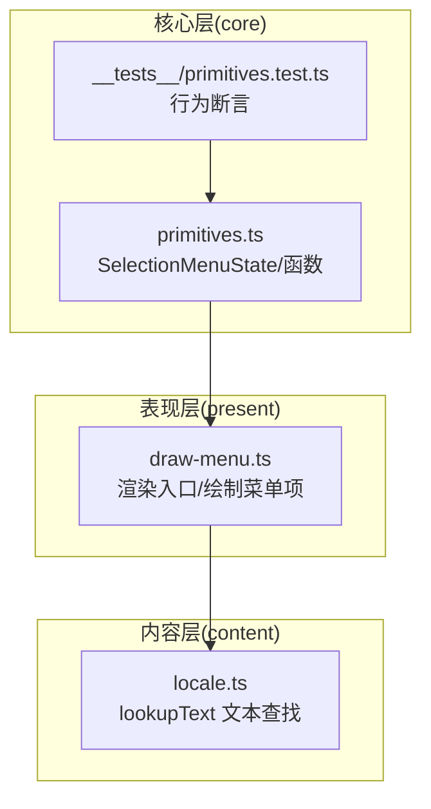
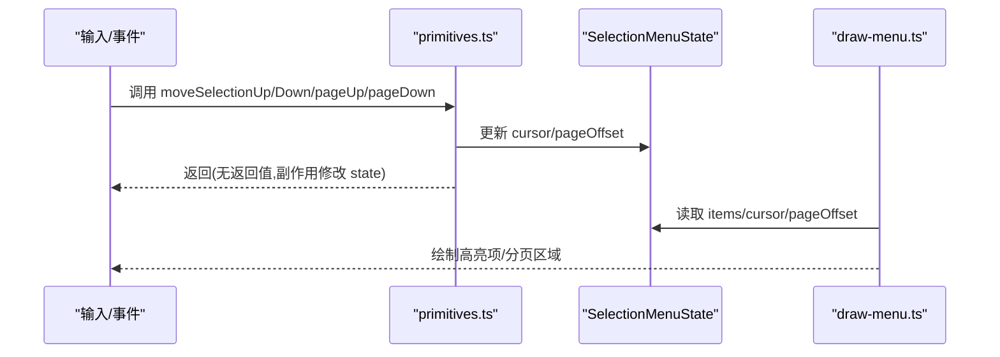
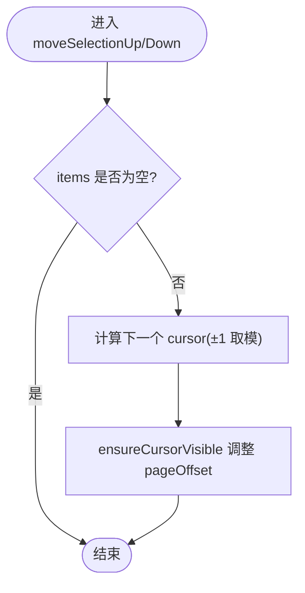
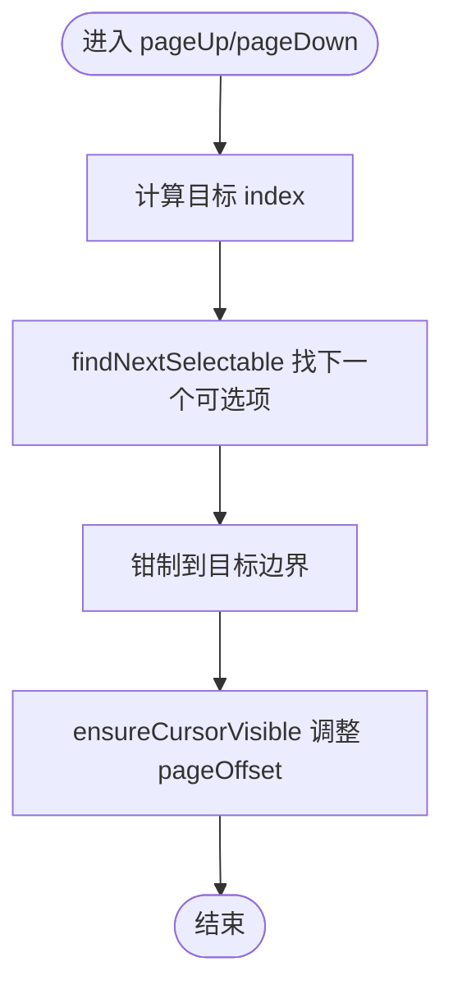
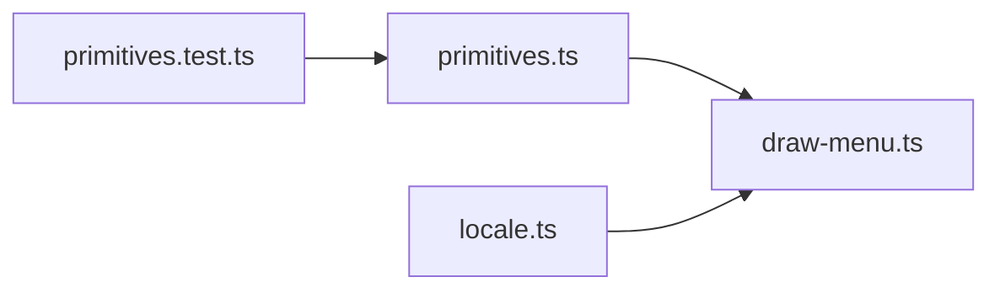

# 菜单基础组件

<cite>
**本文引用的文件**   
- [packages/game/src/core/menu/primitives.ts](file://packages/game/src/core/menu/primitives.ts)
- [packages/game/src/core/menu/__tests__/primitives.test.ts](file://packages/game/src/core/menu/__tests__/primitives.test.ts)
- [packages/game/src/present/menu/draw-menu.ts](file://packages/game/src/present/menu/draw-menu.ts)
- [packages/content/src/locale.ts](file://packages/content/src/locale.ts)
- [packages/content/src/locale.test.ts](file://packages/content/src/locale.test.ts)
</cite>

## 目录
1. [简介](#简介)
2. [项目结构](#项目结构)
3. [核心组件](#核心组件)
4. [架构总览](#架构总览)
5. [详细组件分析](#详细组件分析)
6. [依赖关系分析](#依赖关系分析)
7. [性能考量](#性能考量)
8. [故障排查指南](#故障排查指南)
9. [结论](#结论)
10. [附录：使用示例与最佳实践](#附录使用示例与最佳实践)

## 简介
本文件为 Type-Pal 的“菜单基础组件”提供系统化文档，聚焦 SelectionMenuState 数据结构、createSelectionMenu 初始化逻辑、moveSelectionUp/moveSelectionDown 导航算法、边界与循环滚动处理、以及菜单项数据结构（id、label、disabled、rightText）的设计意图。同时给出如何创建自定义菜单、添加新选项、处理用户输入的实践路径，并附带性能优化建议与最佳实践。

## 项目结构
菜单基础能力位于游戏包的核心层，采用“纯数据 + 操作函数”的 primitives 设计，渲染层在 present 层独立实现，二者通过类型契约解耦。

图表来源
- [packages/game/src/core/menu/primitives.ts:1-177](file://packages/game/src/core/menu/primitives.ts#L1-L177)
- [packages/game/src/present/menu/draw-menu.ts:1-435](file://packages/game/src/present/menu/draw-menu.ts#L1-L435)
- [packages/content/src/locale.ts:1-9](file://packages/content/src/locale.ts#L1-L9)

章节来源
- [packages/game/src/core/menu/primitives.ts:1-177](file://packages/game/src/core/menu/primitives.ts#L1-L177)
- [packages/game/src/present/menu/draw-menu.ts:1-435](file://packages/game/src/present/menu/draw-menu.ts#L1-L435)

## 核心组件
- SelectionMenuItem：菜单项数据模型，包含 id、label、可选 disabled、可选 rightText。
- SelectionMenuState：菜单状态，包含 items、cursor、pageSize、pageOffset。
- createSelectionMenu：构造菜单状态，设置默认光标与可见页偏移。
- moveSelectionUp / moveSelectionDown：逐项移动，支持循环滚动与可见性维护。
- pageUp / pageDown：翻页导航，定位到下一页/上一页首个可选项或边界。
- getSelected：获取当前选中项。

章节来源
- [packages/game/src/core/menu/primitives.ts:14-31](file://packages/game/src/core/menu/primitives.ts#L14-L31)
- [packages/game/src/core/menu/primitives.ts:50-68](file://packages/game/src/core/menu/primitives.ts#L50-L68)
- [packages/game/src/core/menu/primitives.ts:89-99](file://packages/game/src/core/menu/primitives.ts#L89-L99)
- [packages/game/src/core/menu/primitives.ts:113-128](file://packages/game/src/core/menu/primitives.ts#L113-L128)
- [packages/game/src/core/menu/primitives.ts:131-133](file://packages/game/src/core/menu/primitives.ts#L131-L133)

## 架构总览
SelectionMenu 遵循“数据与渲染分离”的架构：core 层只负责状态与导航，present 层根据 state 进行绘制。这样既便于单元测试，也便于在不同平台复用同一套交互逻辑。

图表来源
- [packages/game/src/core/menu/primitives.ts:89-128](file://packages/game/src/core/menu/primitives.ts#L89-L128)
- [packages/game/src/present/menu/draw-menu.ts:260-316](file://packages/game/src/present/menu/draw-menu.ts#L260-L316)

## 详细组件分析

### SelectionMenuState 数据结构设计
- items：菜单项数组，每项含 id、label、可选 disabled、可选 rightText。
- cursor：全局索引，指向当前高亮项；不随分页变化，仅由 ensureCursorVisible 调整 pageOffset 保证可见。
- pageSize：每屏显示行数。
- pageOffset：当前页起始索引，用于渲染裁剪与滚动。

设计要点
- 将“选择位置”和“可视窗口”解耦，避免每次渲染都计算裁剪范围。
- 允许光标落在 disabled 项上，确认时由上层业务判断是否可用，从而与原版行为一致。

章节来源
- [packages/game/src/core/menu/primitives.ts:14-31](file://packages/game/src/core/menu/primitives.ts#L14-L31)

### createSelectionMenu 初始化与验证
- 参数：items、pageSize（默认 8）、defaultCursor（默认 0）。
- 行为：
  - 若 items 为空，cursor 置 0。
  - 否则对 defaultCursor 做 clamp 至 [0, items.length-1]。
  - 初始化 pageOffset=0，并调用 ensureCursorVisible 确保初始光标可见。
- 验证机制：
  - 越界保护：防止传入非法 defaultCursor。
  - 空列表保护：避免访问 undefined 项。

章节来源
- [packages/game/src/core/menu/primitives.ts:50-68](file://packages/game/src/core/menu/primitives.ts#L50-L68)
- [packages/game/src/core/menu/primitives.ts:101-107](file://packages/game/src/core/menu/primitives.ts#L101-L107)

### 导航算法：moveSelectionUp / moveSelectionDown
- 行为：
  - 非空列表下，cursor 按 ±1 循环滚动。
  - 每次移动后调用 ensureCursorVisible 维护 pageOffset。
- 边界检测：
  - 首尾循环：从 0 上移回到末项，从末项下移到首项。
- 焦点管理：
  - 允许停在 disabled 项上，不跳过禁用项。
  - 确认时的可用性检查由上层业务负责。

图表来源
- [packages/game/src/core/menu/primitives.ts:89-99](file://packages/game/src/core/menu/primitives.ts#L89-L99)
- [packages/game/src/core/menu/primitives.ts:101-107](file://packages/game/src/core/menu/primitives.ts#L101-L107)

章节来源
- [packages/game/src/core/menu/primitives.ts:89-99](file://packages/game/src/core/menu/primitives.ts#L89-L99)
- [packages/game/src/core/menu/primitives.ts:101-107](file://packages/game/src/core/menu/primitives.ts#L101-L107)

### 翻页算法：pageUp / pageDown
- 目标定位：
  - pageUp：目标 = max(0, cursor - pageSize)。
  - pageDown：目标 = min(items.length - 1, cursor + pageSize)。
- 可选项落点：
  - 使用 findNextSelectable 从目标附近寻找下一个可选项（跳过 disabled），若无可选则回退到目标。
- 边界钳制：
  - 最终 cursor 被限制在 [0, items.length-1]。
- 可见性维护：
  - 最后调用 ensureCursorVisible 保证目标项可见。

图表来源
- [packages/game/src/core/menu/primitives.ts:113-128](file://packages/game/src/core/menu/primitives.ts#L113-L128)
- [packages/game/src/core/menu/primitives.ts:75-83](file://packages/game/src/core/menu/primitives.ts#L75-L83)
- [packages/game/src/core/menu/primitives.ts:101-107](file://packages/game/src/core/menu/primitives.ts#L101-L107)

章节来源
- [packages/game/src/core/menu/primitives.ts:75-83](file://packages/game/src/core/menu/primitives.ts#L75-L83)
- [packages/game/src/core/menu/primitives.ts:113-128](file://packages/game/src/core/menu/primitives.ts#L113-L128)

### 菜单项数据结构定义与国际化支持
- id：唯一标识，常用于业务侧关联资源或动作。
- label：展示文本。推荐在构建 items 前通过 lookupText 进行本地化解析，以支持多语言。
- disabled：标记不可用项，光标可停留但确认无效。
- rightText：右侧附加信息（如 MP 消耗、数量等），由渲染层消费。

国际化建议
- 使用 content 层的 lookupText 将文本 ID 映射为当前语言的字符串，再填充到 item.label。
- 未命中时 fallback 返回 id 本身，便于开发期发现缺失翻译。

章节来源
- [packages/game/src/core/menu/primitives.ts:14-21](file://packages/game/src/core/menu/primitives.ts#L14-L21)
- [packages/content/src/locale.ts:1-9](file://packages/content/src/locale.ts#L1-L9)
- [packages/content/src/locale.test.ts:1-14](file://packages/content/src/locale.test.ts#L1-L14)

### 渲染层对接与视觉反馈
- draw-menu.ts 中多处使用 SelectionMenuState 的 items 与 cursor 进行绘制：
  - 系统菜单、库存动作子菜单、存档槽位等均基于 selection.items 与 selection.cursor 渲染。
  - 选中项颜色动态闪烁，未选中项使用固定色。
- 当缺少必要资源时，渲染层会输出占位提示，避免静默失败。

章节来源
- [packages/game/src/present/menu/draw-menu.ts:260-316](file://packages/game/src/present/menu/draw-menu.ts#L260-L316)
- [packages/game/src/present/menu/draw-menu.ts:330-350](file://packages/game/src/present/menu/draw-menu.ts#L330-L350)
- [packages/game/src/present/menu/draw-menu.ts:384-417](file://packages/game/src/present/menu/draw-menu.ts#L384-L417)
- [packages/game/src/present/menu/draw-menu.ts:419-431](file://packages/game/src/present/menu/draw-menu.ts#L419-L431)

## 依赖关系分析
- core/menu/primitives.ts 对外暴露 SelectionMenuState 及操作函数，供上层菜单组合与渲染层消费。
- present/menu/draw-menu.ts 仅依赖类型契约，不直接引用 DOM/Canvas，保持纯渲染职责。
- content/locale.ts 提供文本查找工具，建议在构建菜单项之前完成本地化。

图表来源
- [packages/game/src/core/menu/primitives.ts:1-177](file://packages/game/src/core/menu/primitives.ts#L1-L177)
- [packages/game/src/present/menu/draw-menu.ts:1-435](file://packages/game/src/present/menu/draw-menu.ts#L1-L435)
- [packages/content/src/locale.ts:1-9](file://packages/content/src/locale.ts#L1-L9)
- [packages/game/src/core/menu/__tests__/primitives.test.ts:1-179](file://packages/game/src/core/menu/__tests__/primitives.test.ts#L1-L179)

章节来源
- [packages/game/src/core/menu/primitives.ts:1-177](file://packages/game/src/core/menu/primitives.ts#L1-L177)
- [packages/game/src/present/menu/draw-menu.ts:1-435](file://packages/game/src/present/menu/draw-menu.ts#L1-L435)
- [packages/content/src/locale.ts:1-9](file://packages/content/src/locale.ts#L1-L9)
- [packages/game/src/core/menu/__tests__/primitives.test.ts:1-179](file://packages/game/src/core/menu/__tests__/primitives.test.ts#L1-L179)

## 性能考量
- 时间复杂度
  - moveSelectionUp/Down：O(1)，仅算术运算与一次可见性维护。
  - pageUp/pageDown：最坏 O(n)（findNextSelectable 遍历一圈），但 n 通常为菜单项数，且仅在翻页时触发。
  - ensureCursorVisible：O(1)。
- 空间复杂度
  - 原地修改 state，额外空间 O(1)。
- 优化建议
  - 对于超长列表，优先使用 pageSize 控制单屏项数，减少渲染压力。
  - 将 findNextSelectable 的使用场景限定在翻页，避免逐项移动时扫描禁用项，提升响应速度。
  - 在构建 items 时预计算 label 与 rightText，避免渲染阶段重复拼接。

[本节为通用指导，无需特定文件来源]

## 故障排查指南
- 光标停留在禁用项
  - 现象：光标可停在 disabled 项上，但确认无效。
  - 原因：这是预期行为，与原版对齐；确认逻辑应由上层业务判断 !sel.disabled。
  - 参考测试用例断言。
- 默认光标越界
  - 现象：传入 defaultCursor 超出范围。
  - 处理：createSelectionMenu 会将其 clamp 到有效区间。
- 翻页异常
  - 现象：pageUp/pageDown 未落到期望项。
  - 排查：确认是否存在全禁用项导致 findNextSelectable 回退；检查 pageSize 与 items 长度。
- 渲染空白或错位
  - 现象：菜单区域空白或坐标错误。
  - 排查：检查 draw-menu.ts 中的 box 坐标与行高常量；确认 extra 上下文是否注入完整。

章节来源
- [packages/game/src/core/menu/__tests__/primitives.test.ts:19-93](file://packages/game/src/core/menu/__tests__/primitives.test.ts#L19-L93)
- [packages/game/src/present/menu/draw-menu.ts:260-316](file://packages/game/src/present/menu/draw-menu.ts#L260-L316)

## 结论
SelectionMenu 以最小状态与明确不变式实现了稳定可靠的列表导航：
- 数据结构清晰：items/cursor/pageSize/pageOffset 各司其职。
- 导航算法简洁：逐项移动循环滚动，翻页定位可选项并钳制边界。
- 与原版行为对齐：允许光标落在禁用项，确认时由上层决定可用性。
- 易于扩展：通过 rightText 与 locale 集成，满足复杂菜单需求。

[本节为总结，无需特定文件来源]

## 附录：使用示例与最佳实践

### 创建自定义菜单
- 步骤
  - 准备 items 数组，每个元素包含 id、label，必要时设置 disabled 与 rightText。
  - 调用 createSelectionMenu(items, pageSize?, defaultCursor?) 得到 state。
  - 在渲染层读取 state.selection.items 与 state.selection.cursor 进行绘制。
- 参考路径
  - [packages/game/src/core/menu/primitives.ts:50-68](file://packages/game/src/core/menu/primitives.ts#L50-L68)
  - [packages/game/src/present/menu/draw-menu.ts:260-316](file://packages/game/src/present/menu/draw-menu.ts#L260-L316)

### 添加新选项
- 在 items 数组末尾插入新对象，确保 id 唯一、label 可读。
- 如需默认选中某项，调整 defaultCursor 并在 createSelectionMenu 中传入。
- 参考路径
  - [packages/game/src/core/menu/primitives.ts:50-68](file://packages/game/src/core/menu/primitives.ts#L50-L68)

### 处理用户输入
- 向上/向下：调用 moveSelectionUp / moveSelectionDown。
- 翻页：调用 pageUp / pageDown。
- 获取选中项：调用 getSelected(state) 后进行业务校验（如检查 disabled）。
- 参考路径
  - [packages/game/src/core/menu/primitives.ts:89-99](file://packages/game/src/core/menu/primitives.ts#L89-L99)
  - [packages/game/src/core/menu/primitives.ts:113-128](file://packages/game/src/core/menu/primitives.ts#L113-L128)
  - [packages/game/src/core/menu/primitives.ts:131-133](file://packages/game/src/core/menu/primitives.ts#L131-L133)

### 国际化接入
- 在构建 items 前，使用 lookupText(id, locale) 生成 label。
- 未命中时返回 id 本身，便于开发期发现漏填。
- 参考路径
  - [packages/content/src/locale.ts:1-9](file://packages/content/src/locale.ts#L1-L9)
  - [packages/content/src/locale.test.ts:1-14](file://packages/content/src/locale.test.ts#L1-L14)

### 最佳实践
- 将“导航逻辑”与“渲染逻辑”严格分离，core 层不持有任何视图引用。
- 使用 pageSize 控制单屏项数，避免一次性渲染过多条目。
- 对长列表优先使用 pageUp/pageDown 而非逐项移动，减少 findNextSelectable 的扫描成本。
- 在确认前统一检查 selected.disabled，避免在 primitive 层耦合业务规则。

[本节为通用指导，无需特定文件来源]