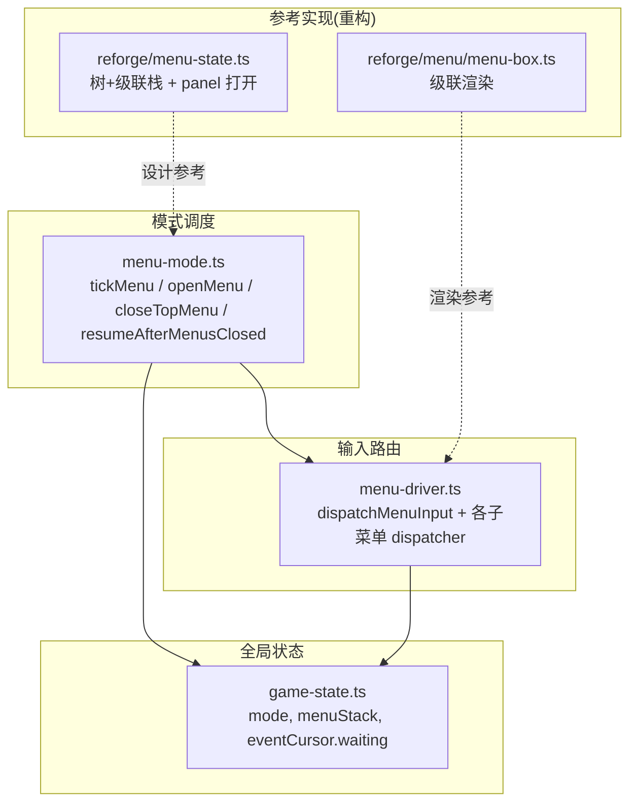
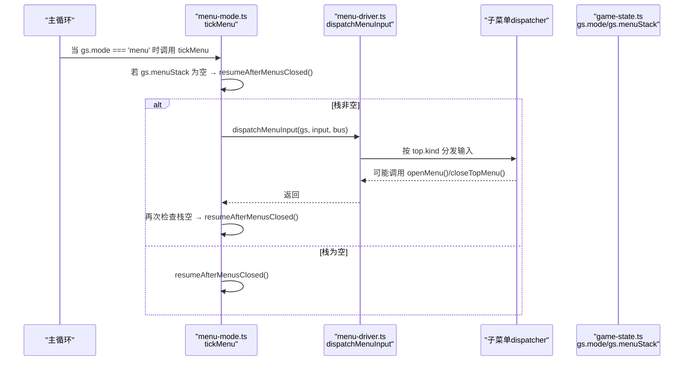
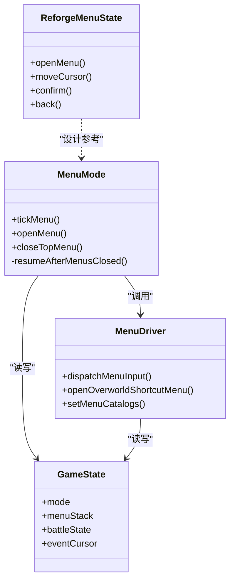

# 菜单模式管理

<cite>
**本文引用的文件**
- [packages/game/src/core/menu/menu-mode.ts](file://packages/game/src/core/menu/menu-mode.ts)
- [packages/game/src/core/menu/menu-driver.ts](file://packages/game/src/core/menu/menu-driver.ts)
- [packages/game/src/core/game-state.ts](file://packages/game/src/core/game-state.ts)
- [packages/reforge/src/menu-state.ts](file://packages/reforge/src/menu-state.ts)
- [packages/reforge/src/menu/menu-box.ts](file://packages/reforge/src/menu/menu-box.ts)
- [packages/game/src/core/menu/menu-mode.test.ts](file://packages/game/src/core/menu/menu-mode.test.ts)
</cite>

## 目录
1. [简介](#简介)
2. [项目结构](#项目结构)
3. [核心组件](#核心组件)
4. [架构总览](#架构总览)
5. [详细组件分析](#详细组件分析)
6. [依赖关系分析](#依赖关系分析)
7. [性能考量](#性能考量)
8. [故障排查指南](#故障排查指南)
9. [结论](#结论)
10. [附录：使用示例与最佳实践](#附录使用示例与最佳实践)

## 简介
本文件聚焦 Type-Pal 的“菜单模式管理系统”，围绕以下目标展开：
- 解释菜单状态机的设计原理，包括菜单栈操作、模式切换逻辑与生命周期管理。
- 深入说明 tickMenu 的工作流程：输入分发、状态同步与自动恢复机制。
- 详述 openMenu 与 closeTopMenu 的实现细节：菜单栈 push/pop 与模式状态更新。
- 阐述 resumeAfterMenusClosed 的智能恢复逻辑：战斗状态检测、商店脚本恢复与探索模式回归。
- 提供具体代码路径示例，展示如何正确打开/关闭菜单、处理嵌套菜单场景与实现自定义恢复逻辑。
- 给出性能优化建议与常见陷阱避免指导。

## 项目结构
菜单系统由“模式调度 + 输入路由 + 各子菜单状态机”三层构成：
- 模式调度层：menu-mode.ts 负责 menu 模式的 tick、栈管理与恢复。
- 输入路由层：menu-driver.ts 根据栈顶菜单 kind 将输入分发给对应 dispatcher。
- 子菜单状态机：各 menu 文件（如 inventory-menu.ts、equip-menu.ts 等）维护自身 state machine。
- 游戏全局状态：game-state.ts 定义 mode、menuStack、eventCursor 等待标志等。
- reforge 参考实现：reforge 中的 menu-state.ts 与 menu-box.ts 展示了树形菜单与级联栈的设计思路，便于理解导航与面板打开行为。

图表来源
- [packages/game/src/core/menu/menu-mode.ts:1-63](file://packages/game/src/core/menu/menu-mode.ts#L1-L63)
- [packages/game/src/core/menu/menu-driver.ts:207-248](file://packages/game/src/core/menu/menu-driver.ts#L207-L248)
- [packages/game/src/core/game-state.ts:51-74](file://packages/game/src/core/game-state.ts#L51-L74)
- [packages/reforge/src/menu-state.ts:1-89](file://packages/reforge/src/menu-state.ts#L1-L89)
- [packages/reforge/src/menu/menu-box.ts:461-485](file://packages/reforge/src/menu/menu-box.ts#L461-L485)

章节来源
- [packages/game/src/core/menu/menu-mode.ts:1-63](file://packages/game/src/core/menu/menu-mode.ts#L1-L63)
- [packages/game/src/core/menu/menu-driver.ts:207-248](file://packages/game/src/core/menu/menu-driver.ts#L207-L248)
- [packages/game/src/core/game-state.ts:51-74](file://packages/game/src/core/game-state.ts#L51-L74)
- [packages/reforge/src/menu-state.ts:1-89](file://packages/reforge/src/menu-state.ts#L1-L89)
- [packages/reforge/src/menu/menu-box.ts:461-485](file://packages/reforge/src/menu/menu-box.ts#L461-L485)

## 核心组件
- tickMenu：每帧在 menu 模式下调用，负责空栈恢复、输入分发与再次同步模式。
- dispatchMenuInput：按栈顶菜单 kind 路由到具体 dispatcher，驱动各子菜单状态机。
- openMenu/closeTopMenu：对 gs.menuStack 进行 push/pop，并设置 gs.mode='menu'。
- resumeAfterMenusClosed：根据 battleState 或 eventCursor.waiting 决定返回 battle/event/explore。
- reforge 参考：menu-state.ts 定义了树形菜单节点、级联栈与面板打开；menu-box.ts 演示了级联渲染。

章节来源
- [packages/game/src/core/menu/menu-mode.ts:18-63](file://packages/game/src/core/menu/menu-mode.ts#L18-L63)
- [packages/game/src/core/menu/menu-driver.ts:207-248](file://packages/game/src/core/menu/menu-driver.ts#L207-L248)
- [packages/reforge/src/menu-state.ts:1-89](file://packages/reforge/src/menu-state.ts#L1-L89)
- [packages/reforge/src/menu/menu-box.ts:461-485](file://packages/reforge/src/menu/menu-box.ts#L461-L485)

## 架构总览
下图展示了从主循环进入 menu 模式、输入分发、子菜单交互到最终恢复的完整时序。

图表来源
- [packages/game/src/core/menu/menu-mode.ts:18-30](file://packages/game/src/core/menu/menu-mode.ts#L18-L30)
- [packages/game/src/core/menu/menu-driver.ts:207-248](file://packages/game/src/core/menu/menu-driver.ts#L207-L248)
- [packages/game/src/core/game-state.ts:680-687](file://packages/game/src/core/game-state.ts#L680-L687)

## 详细组件分析

### tickMenu 工作流程
- 空栈优先恢复：若 gs.menuStack 长度为 0，立即执行 resumeAfterMenusClosed 并返回，避免无意义的 dispatch。
- 输入分发：调用 dispatchMenuInput，把当前帧 InputSnapshot.pressed 交给栈顶菜单的 dispatcher。
- 二次同步：dispatch 后再次检查栈是否为空，若为空则执行 resumeAfterMenusClosed，确保 mode 与栈一致。

要点
- 该函数不直接修改菜单内容，仅协调“输入→状态变更→模式恢复”。
- 通过“先判空再分发，再判空恢复”的两段式同步，保证即使 dispatcher 在本帧清空栈也能正确切回 explore/event/battle。

章节来源
- [packages/game/src/core/menu/menu-mode.ts:18-30](file://packages/game/src/core/menu/menu-mode.ts#L18-L30)

### resumeAfterMenusClosed 智能恢复
- 战斗内菜单：若 gs.battleState 存在，返回 mode='battle'，以继续战斗 UI 选择。
- 商店脚本恢复：若 gs.eventCursor.waiting === 'shop'，清除 waiting 并回到 mode='event'，使脚本继续执行。
- 其他情况：回到 mode='explore'，即大世界探索。

设计动机
- 对齐 sdlpal 真值：例如 PAL_BuyMenu/PAL_SellMenu 返回后脚本继续；战斗内状态屏返回后回到战斗 UI。

章节来源
- [packages/game/src/core/menu/menu-mode.ts:40-51](file://packages/game/src/core/menu/menu-mode.ts#L40-L51)
- [packages/game/src/core/game-state.ts:226-267](file://packages/game/src/core/game-state.ts#L226-L267)

### openMenu 与 closeTopMenu 栈操作
- openMenu：向 gs.menuStack 压入新菜单条目，并将 gs.mode 设为 'menu'。
- closeTopMenu：弹出栈顶菜单；是否切回 explore 交由 tickMenu 下帧判定，避免本帧模式翻转影响 dispatch。

注意
- 某些 dispatcher 会直接清空整个栈（如系统菜单取消/退出确认），此时 tickMenu 下一帧会触发 resumeAfterMenusClosed。

章节来源
- [packages/game/src/core/menu/menu-mode.ts:54-62](file://packages/game/src/core/menu/menu-mode.ts#L54-L62)
- [packages/game/src/core/menu/menu-driver.ts:400-406](file://packages/game/src/core/menu/menu-driver.ts#L400-L406)
- [packages/game/src/core/menu/menu-driver.ts:443-530](file://packages/game/src/core/menu/menu-driver.ts#L443-L530)

### 输入分发与子菜单交互（menu-driver）
- dispatchMenuInput：读取 gs.menuStack 栈顶 entry，按 kind 分发到对应 dispatcher。
- 典型交互：
  - in-game hub：Confirm 打开 inventory-action/in-game-magic/player-status/system；Menu 键关闭顶层。
  - system 菜单：save/load 打开 save-slot；music/sound 开关子选单；quit 二次确认后可能清空全栈。
  - inventory/equip/magic：Confirm 推进 phase，必要时 openMenu 打开子菜单；Menu 键 cancel 或关闭。
  - shop-buy/shop-sell：confirm 阶段支持否/是切换；cancel 可能 closeTopMenu 以恢复脚本。

关键路径
- 打开子菜单：openMenu({kind, state})
- 关闭一层：closeTopMenu()
- 关闭全部：gs.menuStack = []（由特定分支直接清空）

章节来源
- [packages/game/src/core/menu/menu-driver.ts:207-248](file://packages/game/src/core/menu/menu-driver.ts#L207-L248)
- [packages/game/src/core/menu/menu-driver.ts:398-439](file://packages/game/src/core/menu/menu-driver.ts#L398-L439)
- [packages/game/src/core/menu/menu-driver.ts:443-530](file://packages/game/src/core/menu/menu-driver.ts#L443-L530)
- [packages/game/src/core/menu/menu-driver.ts:544-580](file://packages/game/src/core/menu/menu-driver.ts#L544-L580)
- [packages/game/src/core/menu/menu-driver.ts:584-674](file://packages/game/src/core/menu/menu-driver.ts#L584-L674)
- [packages/game/src/core/menu/menu-driver.ts:691-770](file://packages/game/src/core/menu/menu-driver.ts#L691-L770)
- [packages/game/src/core/menu/menu-driver.ts:256-309](file://packages/game/src/core/menu/menu-driver.ts#L256-L309)
- [packages/game/src/core/menu/menu-driver.ts:317-359](file://packages/game/src/core/menu/menu-driver.ts#L317-L359)

### 参考实现：多级菜单树与级联栈（reforge）
- menu-state.ts：定义 MenuNode 树、MAIN_MENU 根节点、MenuLevel 级联栈、PanelId 叶子面板。
- 操作语义：
  - moveCursor：末层光标环绕移动（面板打开时不动）。
  - confirm：有 children → 压栈展开子菜单；叶子 panel → 打开面板；disabled/已开面板 → 不动。
  - back：面板打开 → 关面板；多层 → 弹栈；单层 → 关闭菜单。
- menu-box.ts：演示级联渲染，最深级联层静态高亮，子面板打开时让位闪烁。

用途
- 为 TS 端“树形菜单 + 级联栈 + 面板”提供可复用的状态机范式，便于扩展更多菜单项与面板。

章节来源
- [packages/reforge/src/menu-state.ts:1-89](file://packages/reforge/src/menu-state.ts#L1-L89)
- [packages/reforge/src/menu/menu-box.ts:461-485](file://packages/reforge/src/menu/menu-box.ts#L461-L485)

## 依赖关系分析
- menu-mode.ts 依赖：
  - game-state.ts：读写 gs.mode、gs.menuStack、gs.battleState、gs.eventCursor.waiting。
  - menu-driver.ts：调用 dispatchMenuInput 完成输入分发。
- menu-driver.ts 依赖：
  - game-state.ts：读写 gs.menuStack、iCur* 记忆字段、inventory 等运行时数据。
  - 各子菜单模块：创建/更新各自 state machine，并在需要时调用 openMenu/closeTopMenu。
- reforge 参考：
  - menu-state.ts 与 menu-box.ts 独立于 game-state，用于纯 UI 状态机与渲染参考。

图表来源
- [packages/game/src/core/menu/menu-mode.ts:1-63](file://packages/game/src/core/menu/menu-mode.ts#L1-L63)
- [packages/game/src/core/menu/menu-driver.ts:207-248](file://packages/game/src/core/menu/menu-driver.ts#L207-L248)
- [packages/game/src/core/game-state.ts:680-687](file://packages/game/src/core/game-state.ts#L680-L687)
- [packages/reforge/src/menu-state.ts:1-89](file://packages/reforge/src/menu-state.ts#L1-L89)

章节来源
- [packages/game/src/core/menu/menu-mode.ts:1-63](file://packages/game/src/core/menu/menu-mode.ts#L1-L63)
- [packages/game/src/core/menu/menu-driver.ts:207-248](file://packages/game/src/core/menu/menu-driver.ts#L207-L248)
- [packages/game/src/core/game-state.ts:680-687](file://packages/game/src/core/game-state.ts#L680-L687)
- [packages/reforge/src/menu-state.ts:1-89](file://packages/reforge/src/menu-state.ts#L1-L89)

## 性能考量
- 最小化对象分配：
  - 在 dispatcher 中尽量复用 state 对象，避免每帧重建大数组（如 inventory grid 仅在必要刷新）。
  - 参考 inventory 刷新策略：只在 list/use-target 阶段按需重建快照，减少 GC 压力。
- 输入分发短路：
  - tickMenu 先判空栈，避免无意义 dispatch。
  - dispatcher 内部尽早 return，减少后续分支判断。
- 只读共享数据：
  - catalogs（items/spells/playerRoles）通过 setMenuCatalogs 注入，避免重复查找。
- 渲染侧优化（参考 reforge）：
  - 级联菜单框与文本绘制采用切片与批量渲染，减少重复计算。

[本节为通用性能建议，无需源码引用]

## 故障排查指南
- 症状：打开菜单后无法关闭或卡死在 menu 模式
  - 检查是否在 dispatcher 中错误地清空了 gs.menuStack 而未考虑 resumeAfterMenusClosed 的时机。
  - 确认 Menu 键分支是否正确调用 closeTopMenu 或在特定情况下清空栈。
- 症状：商店菜单关闭后未恢复脚本
  - 确认 opcode 打开商店时设置了 gs.eventCursor.waiting='shop'。
  - 检查 cancel/closeTopMenu 后 tickMenu 是否触发了 resumeAfterMenusClosed，且 waiting 被清理。
- 症状：战斗内打开状态屏后未回到战斗
  - 确认 gs.battleState 在打开菜单期间未被清空。
  - 检查 resumeAfterMenusClosed 是否因条件不满足而误切 explore。
- 症状：物品菜单使用后列表不刷新
  - 检查 inventory dispatcher 是否每帧刷新 snapshot，以及 use-target 阶段是否检测 count<=0 自动 cancel。

章节来源
- [packages/game/src/core/menu/menu-driver.ts:584-674](file://packages/game/src/core/menu/menu-driver.ts#L584-L674)
- [packages/game/src/core/menu/menu-mode.ts:40-51](file://packages/game/src/core/menu/menu-mode.ts#L40-L51)
- [packages/game/src/core/menu/menu-mode.test.ts:34-61](file://packages/game/src/core/menu/menu-mode.test.ts#L34-L61)

## 结论
Type-Pal 的菜单模式管理系统通过“显式菜单栈 + 模式调度 + 输入路由”实现了与原版的 modal blocking 行为等价的分帧推进模型。tickMenu 作为中枢，确保输入分发与模式恢复的一致性；openMenu/closeTopMenu 提供简洁的栈操作接口；resumeAfterMenusClosed 依据战斗与脚本上下文智能恢复。结合 reforge 的树形菜单与级联栈参考，可在保持清晰职责边界的同时，快速扩展新的菜单与面板。

[本节为总结性内容，无需源码引用]

## 附录：使用示例与最佳实践

### 正确打开与关闭菜单
- 打开菜单：
  - 在合适时机（如按下 ESC 或选择某选项）调用 openMenu(gs, {kind, state})。
  - 参考路径：[packages/game/src/core/menu/menu-mode.ts:54-57](file://packages/game/src/core/menu/menu-mode.ts#L54-L57)
- 关闭一层：
  - 在 dispatcher 的 Menu 键分支调用 closeTopMenu(gs)。
  - 参考路径：[packages/game/src/core/menu/menu-mode.ts:60-62](file://packages/game/src/core/menu/menu-mode.ts#L60-L62)
- 关闭全部：
  - 在某些分支（如系统菜单取消/退出确认）可直接 gs.menuStack = []，由 tickMenu 下一帧恢复。
  - 参考路径：[packages/game/src/core/menu/menu-driver.ts:460-472](file://packages/game/src/core/menu/menu-driver.ts#L460-L472)

### 处理嵌套菜单场景
- 从 in-game hub 打开 inventory-action，再从 action 打开 equip 或 inventory：
  - 参考路径：[packages/game/src/core/menu/menu-driver.ts:414-439](file://packages/game/src/core/menu/menu-driver.ts#L414-L439)
  - 参考路径：[packages/game/src/core/menu/menu-driver.ts:544-580](file://packages/game/src/core/menu/menu-driver.ts#L544-L580)
- 从 opening 打开 save-slot：
  - 参考路径：[packages/game/src/core/menu/menu-driver.ts:386-396](file://packages/game/src/core/menu/menu-driver.ts#L386-L396)

### 实现自定义菜单恢复逻辑
- 若需新增一种“modal 阻塞”的菜单类型，确保：
  - 打开时设置合适的 waiting 标志（如 'shop'），以便 resumeAfterMenusClosed 能识别。
  - 关闭时调用 closeTopMenu 或清空栈，让 tickMenu 触发恢复。
- 参考路径：
  - waiting 标志定义：[packages/game/src/core/game-state.ts:226-267](file://packages/game/src/core/game-state.ts#L226-L267)
  - 恢复逻辑：[packages/game/src/core/menu/menu-mode.ts:40-51](file://packages/game/src/core/menu/menu-mode.ts#L40-L51)

### 参考：树形菜单与级联栈（reforge）
- 使用 MAIN_MENU 树构建多级菜单，利用 confirm/back 控制压栈/弹栈与面板打开。
- 参考路径：
  - 状态机：[packages/reforge/src/menu-state.ts:1-89](file://packages/reforge/src/menu-state.ts#L1-L89)
  - 渲染：[packages/reforge/src/menu/menu-box.ts:461-485](file://packages/reforge/src/menu/menu-box.ts#L461-L485)

### 测试用例参考
- 验证 Menu 键关闭菜单与模式恢复：
  - 参考路径：[packages/game/src/core/menu/menu-mode.test.ts:34-61](file://packages/game/src/core/menu/menu-mode.test.ts#L34-L61)
- 验证物品列表 Menu 键关闭整个菜单栈：
  - 参考路径：[packages/game/src/core/menu/menu-mode.test.ts:63-69](file://packages/game/src/core/menu/menu-mode.test.ts#L63-L69)

[本节为使用指导，涉及的具体实现均已在上述章节标注源码路径]